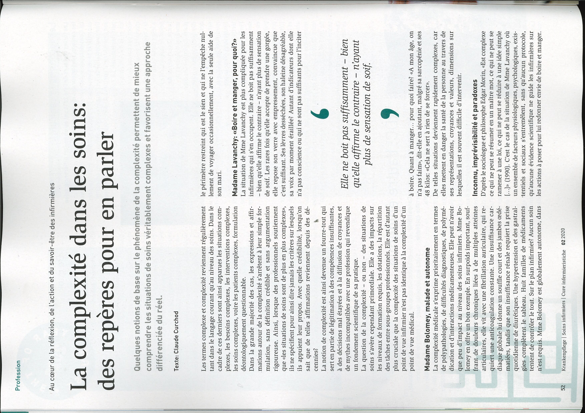
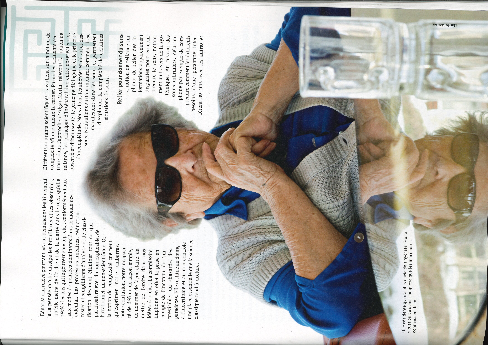
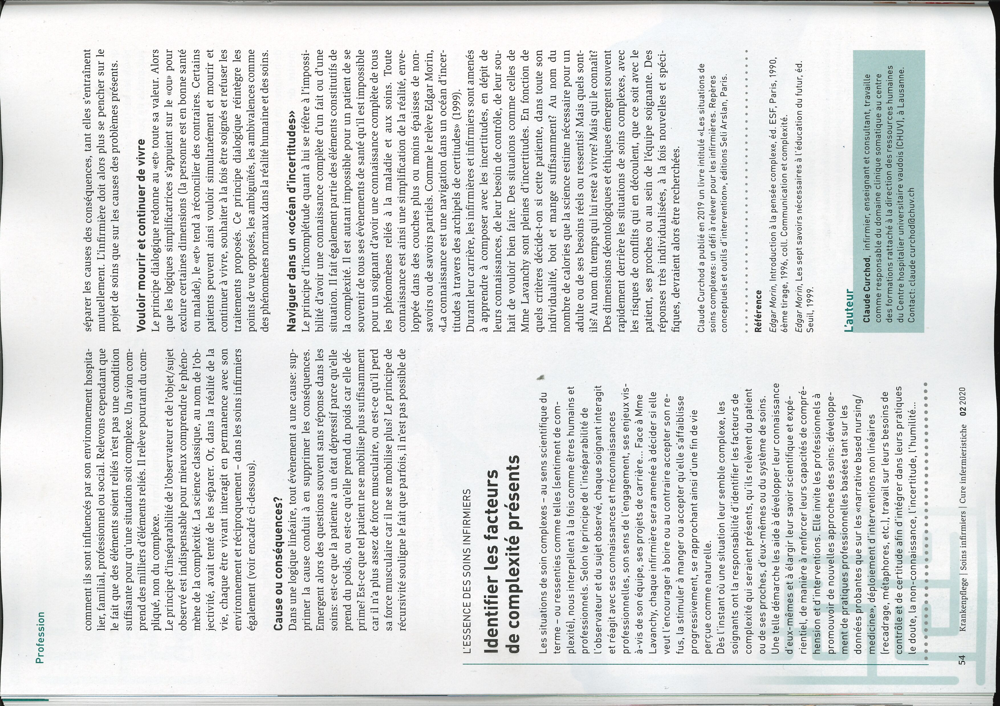
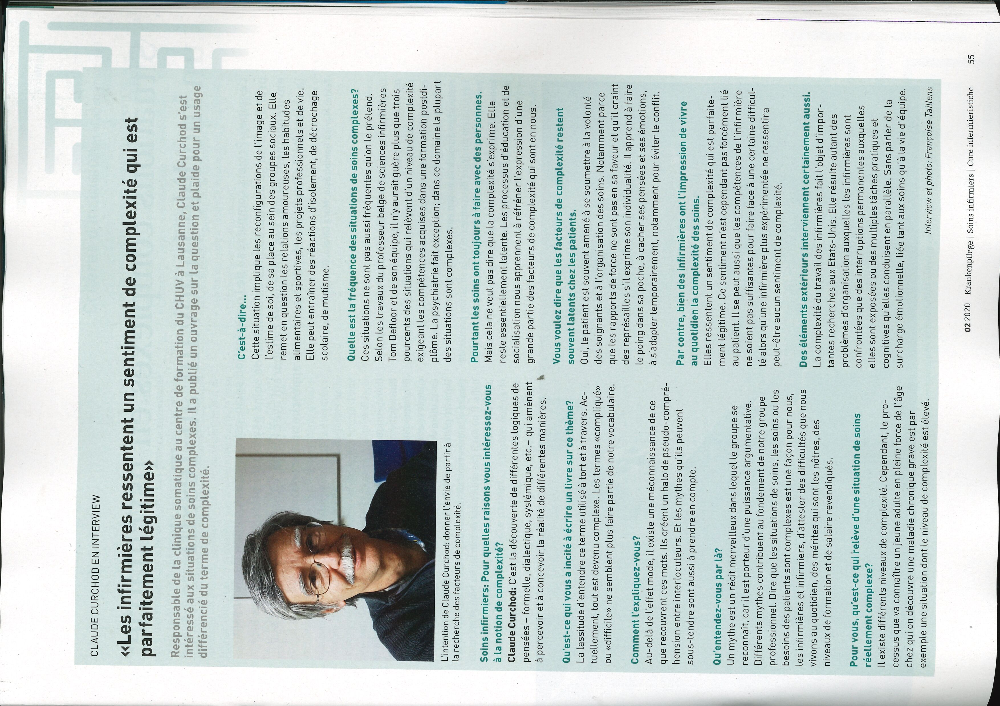

## Document page 1

Cure infermieristiche _ ..... 2

|
'
|
|
|
|
:
:
'
:
'
|
|
'
|
:
'
1
’
'

Li

12

Komplexitat in der Pflege

52

La complexité dans les soins

80

La complessità delle cure

ue vet

## Document page 2

Profession

Au cœur de La réflexion, de L'action et du savoir-être des infirmières

La complexité dans les soins:
des repères pour en parler

Quelques notions de base sur Le phénomène de La complexité permettent de mieux
comprendre Les situations de soins véritablement complexes et favorisent une approche

différenciée du réel.

Texte: Claude Curchod

Les termes complexe et complexité reviennent régulièrement
tant dans le langage courant qu'au niveau des soins. Dans le
cadre de ces derniers sont ainsi apparues les situations com-
plexes, les besoins complexes, les interventions complexes,
les soins complexes, voire les patients complexes, formulation
déontologiquement questionable

Dans la grande majorité des cas, les expressions et affir-
‘mations autour de la complexité s'arrêtent à leur simple for-
mulation, sans définition crédible et sans argumentation
rigoureuse, Ainsi, lorsque des professionnels soutiennent
que «es situations de soins sont de plus en plus complexes»,
ils ne spécifient pour ainsi dire jamais les critères sur lesquels
ils appuient leur propos. Avec quelle crédibilité, lorsqu'on
sait que de telles affirmations reviennent depuis des dé-
cennies? ‘

La notion de complexité est ainsi devenue un fourre-tout qui
sert en partie de légitimation à des compétences insuffisantes,
à des décisions mal étayées et à la diffusion de croyances et
de mythes incompatibles avec une profession qui reven
un fondement scientifique de sa pratique.

La question de la complexité - ou non - des situations de
soins s'avère cependant primordiale. Elle a des impacts sur
les niveaux de formation requis, les dotations, la répartition
des tâches entre sous-groupes professionnels. Elle est d'autant
plus cruciale que la complexité des situations de soins d'un
point de vue infirmier n'est pas identique à la complexité d'un
point de vue médical.

Madame Bolomey, malade et autonome

La complexité médicale s'exprime prioritairement en termes
de polypathologies, de difficultés diagnostiques, de polymé-
dication et d'interactions médicamenteuses. Elle peut n'avoir
que peu d'impact au niveau des soins infirmiers. Mme Bo-
Jomey en offre un bon exemple. En surpoids important, souf-
frant de douleurs chroniques liées à de multiples atteintes
articulaires, elle vit avec une fibrillation auriculaire, qui re-
quiert une anticoagulation constante. Une insuffisance car-
diaque globale lui donne un souffle court et des jambes cedé-
matiées, tandis que son insuffisance rénale requiert la prise
quotidienne de diurétiques. Une hypertension et des gastral:
gies. completent le tableau. Huit familles de médicaments
tentent de contrôler le tout. Sur le plan infirmier? Aucun soin
n'estrequis. Mme Bolomey est globalement autonome, dans

Krankenpflege | Soins infirmiers | Cure infermieristiche 022020

le périmètre restreint qui est le sien et qui ne l'empêche nul-
lement de voyager occasionnellement, avec la seule aide de
son mari.

Madame Lavanchy: «Boire et manger, pour quoi?»

La situation de Mme Lavanchy est plus compliquée pour les
infirmières qui s'en occupent. Elle ne boit pas suffisamment
~ bien qu'elle affirme le contraire - n'ayant plus de sensation
de soif. Les rares fois qu'elle accepte de prendre une gorgée,
elle repose son verre avec empressement, convaincue que
c'est suffisant. Ses lèvres desséchées, son haleine désagréable,
sa voix par moment éraillée? Autant d'indicateurs dont elle
n'a pas conscience ou qui ne sont pas suffisants pour l'inciter

$

Elle ne boit pas suffisamment - bien
quelle affirme le contraire - n'ayant
plus de sensation de soif.

9

à boire. Quant à manger... pour quoi faire? «A mon âge, on
n'a pas faim, dit-elle en ajoutant, malgré sa sarcopénie et ses
48 kilos: «Cela ne sert à rien de se forcer».

De telles situations deviennent rapidement complexes, car
elles mettent en danger la santé de la personne au travers de
ses représentations, croyances et valeurs, dimensions sur
lesquelles il est souvent difficile d'intervenir.

Inconnu, imprévisibilité et paradoxes

D'après le sociologue et philosophe Edgar Morin, «Est complexe
ce qui ne peut se résumer en un maitre mot, ce qui ne peut se
ramener à une loi, ce qui ne peut se réduire à une idée simple
Lp (1990). C'est le cas de la situation de Mme Lavanchy où
un ensemble de facteurs physiologiques, psychologiques, exis-
tentiels et sociaux s'entremélent, sans qu'aucun protocole,
qu'aucune évidence scientifique ne guide les infirmières sur
les actions à poser pour lui redonner envie de boire et manger.

## Document page 3

Edgar Morin relève pourtant: «Nous demandons légitimement
à la pensée qu'elle dissipe les brouillards et les obscurités,
qu'elle mette de l'ordre et de la clarté dans le réel, qu'elle
révèle les lois qui le gouvernent (op. cit), conformément aux
aux modes de pensées dominants dans le monde oc-
cidental. Les processus linéaires, réduction-
nistes et simplifiants d'analyse et de classi-
fication devaient éliminer tout ce qui
paraissait relever du non-explicable, de
Virrationnel, du non-scientifique. Or,

la notion de complexité «ne peut
qu'exprimer notre embarras,
notre confusion, notre incapaci-

té de définir de façon simple,

de nommer de façon claire, de

mettre de l'ordre dans nos

idées» (op. cit). La complexité
implique en effet la prise en
compte de l'inconnu, de l'im-
prévisible, du «hasard», des
paradoxes. Elle restitue au doute,

à l'incertitude et au non-contrôle

une place essentielle que la science
classique tend à exclure

Une résidente qui n'a plus envie de s'hydrater - une
Situation de soins complexe que Les infirmières
connaissent bien

Différents courants scientifiques travaillent sur là notion de
complexité afin de mieux la cerner. Parmi les éléments cen-
traux dans l'approche d'Edgar Morin, relevons la notion de
reliance, les principes d'inséparabilité entre observateur et
observé et d'incursivité, le principe dialogique et le principe
d'incomplétude. Nous allons les aborder en détail ci-des
sous. Nous allons surtout montrer comment ils se
manifestent dans les soins et permettent
d'expliquer la complexité de certaines
situations de soins.

Relier pour donner du sens
La notion de reliance im-
plique de relier des in-
formations apparemment
disparates pour en com
prendre le sens, notam-
ment au travers de la sys
témique. Au niveau des
soins infirmiers, cela im-
plique par exemple de com
prendre comment les différents
besoins d'une personne inter:
ferent les uns avec les autres et

Slavs

Mac

## Document page 4

Profession

comment ils sont influencés par son environnement hospita-
lier, familial, professionnel ou social. Relevons cependant que
le fait que des éléments soient reliés n'est pas une condition
suffisante pour qu'une situation soit complexe. Un avion com-
prend des milliers d'éléments reliés. Il relève pourtant du com-
pliqué, non du complexe.

Le principe d'inséparabilité de l'observateur et de l'objet/sujet
observé est indispensable pour mieux comprendre le phéno-
mène de la complexité. La science classique, au nom de l'ob-
jectivité, avait tenté de les séparer. Or, dans la réalité de la
vie, chaque être vivant interagit en permanence avec son
environnement et réciproquement - dans les soins infirmiers
également (voir encadré ci-dessous).

Cause ou conséquences?

Dans une logique linéaire, tout évènement a une cause: sup-
primer la cause conduit à en supprimer les conséquences.
Emergent alors des questions souvent sans réponse dans les
soins: est-ce que la patiente à un état dépressif parce qu'elle
prend du poids, ou est-ce qu'elle prend du poids car elle dé-
prime? Est-ce que tel patient ne se mobilise plus suffisamment
car il n'a plus assez de force musculaire, ou est-ce qu'il perd
sa force musculaire car il ne se mobilise plus? Le principe de
récursivité souligne le fait que parfois, il n'est pas possible de

L'ESSENCE DES SOINS INFIRMIERS

Identifier Les facteurs
de complexité présents

Les situations de soin complexes - au sens scientifique du à
terme - ou ressenties comme telles (sentiment de com-
plexité), nous interpellent à la fois comme êtres humains et
professionnels. Selon le principe de l'inséparabilité de
l'observateur et du sujet observé, chaque soignant interagit
et réagit avec ses connaissances et méconnaissances
professionnelles, son sens de l'engagement, ses enjeux vis-
3-vis de son équipe, ses projets de carrière... Face à Mme
Lavanchy, chaque infirmière sera amenée à décider si elle
veut l'encourager à boire ou au contraire accepter son re-
fus, la stimuler à manger ou accepter qu'elle s'affaiblisse
progressivement, se rapprochant ainsi d'une fin de vie
perçue comme naturelle.

Dès l'instant où une situation leur semble complexe, les
soignants ont la responsabilité d'identifier les facteurs de
complexité qui seraient présents, qu'ils relèvent du patient
ou de ses proches, d'eux-mêmes ou du système de soins
Une telle démarche les aide à développer leur connaissance
d'eux-mêmes et à élargir leur savoir scientifique et expé-
rientiel, de manière à renforcer leurs capacités de compré-
hension etd'interventions. Elle invite Les professionnels à
promouvoir de nouvelles approches des soins: développe-
mentde pratiques professionnelles basées tant sur les
données probantes que sur les «narrative based nursing/
medicine», déploiement d'interventions non linéaires
(recadrage, métaphores, etc], travail sur leurs besoins de
contrôleret de certitude afin d'intégrer dans leurs pratiques.
le doute, la non-connaissance, l'incertitude, l'humilité.

54 Kankonplege | Soins infirmiers | Cure infermierisiche 022020

séparer les causes des conséquences, tant elles s’entraînent
mutuellement. L'infirmière doit alors plus se pencher sur le
projet de soins que sur les causes des problèmes présents

Vouloir mourir et continuer de vivre

Le principe dialogique redonne au «et» toute sa valeur. Alors
que les logiques simplificatrices s'appuient sur le «ou» pour
exclure certaines dimensions (la personne est en bonne santé
ou malade), le «et» tend à réconcilier des contraires. Certains
patients peuvent ainsi vouloir simultanément et mourir et
continuer à vivre, souhaiter à la fois être soignés et refuser les
traitements proposés. Ce principe dialogique réintègre les
points de vue opposés, les ambiguités, les ambivalences comme
des phénomènes normaux dans la réalité humaine et des soins.

Naviguer dans un «océan d'incertitudes»

Le principe d'incomplétude quant à lui se réfère à l'impossi-
bilité d'avoir une connaissance complète d'un fait ou d'une
situation. I fait également partie des éléments constitutifs de
la complexité. Il est autant impossible pour un patient de se
souvenir de tous ses évènements de santé qu'il est impossible
pour un soignant d'avoir une connaissance complète de tous
les phénomènes reliés à la maladie et aux soins. Toute
connaissance est ainsi une simplification de la réalité, enve-
loppée dans des couches plus ou moins épaisses de non-
savoirs ou de savoirs partiels. Comme le relève Edgar Morin,
«La connaissance est une navigation dans un océan d'incer-
titudes à travers des archipels de certitudes» (1999).

Durant leur carrière, les infirmières et infirmiers sont amenés
à apprendre à composer avec les incertitudes, en dépit de
leurs connaissances, de leur besoin de contrôle, de leur sou-
hait de vouloir bien faire. Des situations comme celles de
Mme Lavanchy sont pleines d'incertitudes. En fonction de
quels critères décide-t-on si cette patiente, dans toute son
individualité, boit et mange suffisamment? Au nom du
nombre de calories que la science estime nécessaire pour un
adulte ou de ses besoins réels ou ressentis? Mais quels sont-
ils? Au nom du temps qui lui reste à vivre? Mais qui le connaît?
Des dimensions déontologiques et éthiques émergent souvent
rapidement derrière les situations de soins complexes, avec
les risques de conflits qui en découlent, que ce soit avec le
patient, ses proches ou au sein de l'équipe soignante. Des
réponses très individualisées, à la fois nouvelles et spéci-
fiques, devraient alors être recherchées.

Claude Curchod a publié en 2019 un livre intitulé «Les situations de
soins complexes: un défi à relever pour Les infirmières. Repères

Référence

Edgar Morin, Introduction à la pensée complexe, éd. ESF, Paris, 1990,
6ème tirage, 1996, coll. Communication et complexité.

Edgar Morin, Les sept savoirs nécessaires à l'éducation du futur, éd.
Seuil, 1999,

## Document page 5

_

CLAUDE CURCHOD EN INTERVIEW

«Les infirmières ressentent un sentiment de complexité qui est

parfaitement légitime»

Responsable de La clinique somatique au centre de formation du CHUV à Lausanne, Claude Curchod s’est
intéressé aux situations de soins complexes. IL a publié un ouvrage sur La question et plaide pour un usage

différencié du terme de complexité.

L'intention de Claude Curchod: donner l'envie de partir à
La recherche des facteurs de complexité.

Soins infirmiers: Pour quelles raisons vous intéressez-vous
à La notion de complexit
Claude Curchod: C'est La découverte de différentes logiques de
pensées - formelle, dialectique, systémique, etc. qui amènent
à percevoir et à concevoir La réalité de différentes manières. h

Qu'est-ce qui vous a incité à écrire un livre sur ce thème

La lassitude d'entendre ce terme utilisé à tort et à travers. Ac-
tuellement, tout est devenu complexe. Les termes «compliqué»
ou «difficile» ne semblent plus faire partie de notre vocabulaire

‘Comment l'expliquez-vous?
Au-delà de l'effet mode, il existe une méconnaissance de ce
que recouvrent ces mots. Ils créent un halo de pseudo-compré-
hension entre interlocuteurs. Et les mythes qu'ils peuvent
sous-tendre sont aussi à prendre en compte.

Qu'entendez-vous par Là?
Un mythe est un récit merveilleux dans Lequel le groupe se
reconnaît, car il est porteur d'une puissance argumentative.
Différents mythes contribuent au fondement de notre groupe
professionnel. Dire que les situations de soins, les soins ou les
besoins des patients sont complexes est une façon pour nous,
les infirmières et infirmiers, d'attester des difficultés que nous
vivons au quotidien, des mérites qui sont les nôtres, des
niveaux de formation et de salaire revendiqués.

Pour vous, qu'est-ce qui relève d'une situation de soins
réellement complexe’

ILexiste différents niveaux de complexité. Cependant, le pro-
cessus que va connaître un jeune adulte en pleine force de l'âge
chez qui on découvre une maladie chronique grave est par
exemple une situation dont le niveau de complexité est élevé.

C'est-à-dire...
Cette situation implique Les reconfigurations de l'image et de
l'estime de soi, de sa place au sein des groupes sociaux. Elle
remet en question les relations amoureuses, Les habitudes
alimentaires et sportives, les projets professionnels et de vie.
Elle peut entraîner des réactions d'isolement, de décrochage
Scolaire, de mutisme.

Quelle est La fréquence des situations de soins complexes?
Ces situations ne sont pas aussi fréquentes qu'on Le prétend.
Selon les travaux du professeur belge de sciences infirmières
Tom Defloor et de son équipe, il n'y aurait guère plus que trois
pourcents des situations qui relèvent d'un niveau de complexité
exigeant Les compétences acquises dans une formation postdi-
pléme. La psychiatrie fait exception; dans ce domaine la plupart
des situations sont complexes.

Pourtant les soins ont toujours à faire avec des personnes.
Mais cela ne veut pas dire que La complexité s'exprime. Elle
reste essentiellement latente. Les processus d'éducation et de
socialisation nous apprennent à réfréner l'expression d'une
grande partie des facteurs de complexité qui sont en nous.

Vous voulez dire que Les facteurs de complexité restent
souvent latents chez Les patients.

Oui, le patient est souvent amené à se soumettre à la volonté
des soignants et à l'organisation des soins. Notamment parce
que les rapports de force ne sont pas en sa faveur et qu'il craint
des représailles s'il exprime son individualité. | apprend à faire
Le poing dans sa poche, à cacher ses pensées et ses émotions,
à s'adapter temporairement, notamment pour éviter le confit

Par contre, bien des infirmières ont l'impression de vivre
au quotidien La complexité des soins.

Elles ressentent un sentiment de complexité qui est parfaite-
ment légitime Ce sentiment n'est cependant pas forcément lié
au patient. Ilse peut aussi que les compétences de l'infirmière
ne soient pas suffisantes pour faire face à une certaine difficul-
té alors qu'une infirmière plus expérimentée ne ressentira
peut-être aucun sentiment de complexité

Des éléments extérieurs interviennent certainement aussi.
La complexité du travail des infirmières fait l'objet d'impor-
tantes recherches aux Etats-Unis. Elle résulte autant des
problèmes d'organisation auxquelles les infirmières sont
confrontées que des interruptions permanentes auxquelles
elles sont exposées ou des multiples tâches pratiques et
cognitives qu'elles conduisent en parallèle. Sans parler de la
surcharge émotionnelle, liée tant aux soins qu'à la vie d'équipe.

Interview et photo: Francoise Talllens

022020 Krankenpftege | Soins infirmiers | Cure infermieristche

55
