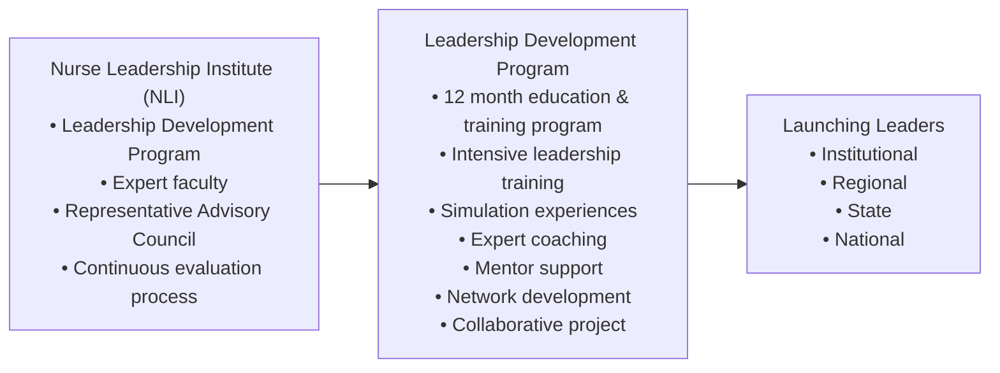

## Document page 1

Building Maryland’s health care leadership capacity: The Nurse Leadership Institute at the University of Maryland School of Nursing Patricia D. Franklin, PhD, RNa*, Kathryn L. Montgomery, PhD, RNb, Peggy Dorr, DNPc, Darlene Trandel, PhD, RNd

aUniversity of Maryland School of Nursing, Baltimore, MD bAdjunct Associate Professor, University of Maryland School of Nursing, Baltimore, MD cUniversity of Maryland Medical Center, Baltimore, MD dUniversity of Maryland School of Nursing, Baltimore, MD

A B S T R A C T

Nurse leadership was identified as essential to the advancement of health care in the State of Maryland. The State’s Health Services Cost Review Commission’s (HSCRC) committed to building the next generation of nurse leaders as part of its vision for advancing healthcare in Maryland. In 2015, HSCRC approved a $2.5 million, multiyear grant that supported development of the Nurse Leadership Institute (NLI) at the University of Maryland School of Nursing. The NLI designed a leadership development program that prepared nurse faculty and clinicians with critical competencies needed for assuming leadership positions unique to complex adaptive systems, facilitating collaborative partnerships between academia and practice, and ultimately improving health outcomes for Maryland’s residents. This article is the first in a series reporting on outcomes of this initiative, which describes the design and implementation of the Nurse Leadership Institute, its Leadership Development Program, and preliminary findings for the first 4 years.

Cite this article: Franklin, P.D., Montgomery, K.L., Dorr, P., & Trandel, D. (2020, September/October). Building Maryland’s health care leadership capacity: The Nurse Leadership Institute at the University of Maryland School of Nursing. Nurs Outlook, 68(5), 657670. https://doi.org/10.1016/j. outlook.2020.06.001.

A R T I C L E I N F O

Article history: Received 21 February 2020 Received in revised form 2 June 2020 Accepted 7 June 2020 Available online August 25, 2020.

Keywords: Leadership complex adaptive systems leadership development leadership development programs designing leadership programs leadership competencies

Introduction

Multiple forces strain U.S. health care systems, revealing their limitations in meeting current needs as well as future demands. The compounding effects of

accelerating scientific and technological developments, increasing complexity of health disorders, expanding population diversity, elusive preventative health care plans, and unsustainable costs are well documented in the literature. Scholarly and lay publications urged new perspectives along with new

The Nurse Leadership Institute is funded through a grant awarded by the Maryland Health Services Cost Review Commission and administered by the Maryland Higher Education Commission. The authors appreciate the support of Emily Parks and Jill Sullivan in assisting with manuscript preparation and providing administrative support for this grant. In addition, we thank Drs. Linda Costa, Erika Friedmann, and Shannon Idzik who actively served on this grant and contributed to the programs design, implementation and evaluation processes. *Patricia D. Franklin, Adjunct Assistant Professor, University of Maryland School of Nursing, Baltimore, MD. E-mail address: pd.franklin.lc@gmail.com (P.D. Franklin). 0029-6554/$ -see front matter  2020 Elsevier Inc. All rights reserved. https://doi.org/10.1016/j.outlook.2020.06.001

Available online at www.sciencedirect.com

N u r s O u t l o o k 6 8 ( 2 0 2 0 ) 6 5 7 6 7 0 www.nursingoutlook.org

## Document page 2

models for delivering health care services, whereas adherence to traditional, mechanistic models and processes would impede desperately needed innovation. Mounting evidence for a new health care system paradigm was reinforced by health outcome data reported in the National Center for Health Statistics (2017) where, for the first time since 1993, life expectancy at birth declined between 2014 and 2015 then again between 2015 and 2016. Further, heart disease, which in most cases is preventable, remained the leading causes of death. The State of Maryland faced similar health outcomes. In 2015, a Maryland Vital Statistics Annual Report revealed that for first year in recent history, life expectancy for state residents had declined and heart disease the leading cause of death. Further, black males were observed to have the largest decline in life expectancy, which reflected the state’s persistent issue with disparities in health outcomes (Maryland Department of Health and Mental Hygiene Vital Statistics Administration, 2015). Health care system reform was not an option for Maryland, it was an imperative. Health care needed to pivot from an acute care focus to primary preventative care as well as community and population care models. Maryland had negotiated a new Medicare waiver designed to halt the continued trajectory of poor outcomes, and bend the curve to align with a vision of health and wellness for its residents. In addition to this vision for a new model of health care delivery services, was an evolving perspective on the leadership needed to achieve this vision. Maryland’s Health Services Cost Review Commission (HSCRC) and state leaders recognized nurses were essential for designing and leading innovation in health care in order to achieve its goal of improving health outcomes for its residents. HSCRC made a commitment to building the next generation of nurse leaders as part of their vision for advancing healthcare in Maryland post Accountable Care Act, and the State’s new Centers for Medicare and Medicaid wavier. In 2013 they funded a leadership development program (LDP) at Johns Hopkins University School of Nursing. The 2-year grant focused on developing leadership within faculty at five Maryland Schools of Nursing. Outcome data on the faculty LDP was not published. Then, in 2015, HSCRC expanded this program and awarded the University of Maryland School of Nursing (UMSON) a $2.5 million, 5-year grant to build leadership capacity within both nursing faculty and nurses in clinical practice settings. Their vision, was to build nurse leaders from academia and practice who would be prepared to assume leadership roles across the spectrum of health care organizations as well as leadership positions within various forums in the State of Maryland. In these multiple settings, nurses would be essential members of the leadership needed to advance health care innovation. Funding for this grant was provided through a unique, state based Nurse Support Program which is

financed through Maryland’s Medicare waiver program. Maryland’s agreement with the Centers for Medicare & Medicaid Services , required all payers to reimburse Maryland hospitals according to rates set by the HSCRC. A portion (0.1%) of pooled, regulated gross patient revenue, actualized through this payment model, was dedicated to expanding the nursing workforce by increasing nursing faculty and nursing program capacity as well as hospital-based initiatives (Maryland Health Services Cost Review Commission, 2018). The Maryland Higher Education Commission administers these respective, Nursing Support II and Nursing Support I programs along with additional statewide initiatives.

The Nurse Leadership Institute

In order to lead within complex systems such as health care, nurses must develop competencies beyond traditional leadership and management skills. Therefore, HSCRC made a substantial investment in preparing nurse leaders with the appropriate competencies. The vision for the Nurse Leadership Institute (NLI) was to increase leadership capacity in both academia and practice, facilitate collaboration and transfer of knowledge that would lead innovation in Maryland’s health care system, and ultimately improve outcomes for all residents. This vision was grounded in a leadership framework that embodies contextual, interpersonal, interprofessional, and content competencies in the application of influence and expertise as well as an appreciation of the healthcare system as a complex adaptive system (CAS) (Porter- O’Grady & Malloch, 2018). Specifically, the goals for the LDP were:

 build leadership capacity within Maryland nursing faculty and clinicians,  facilitate partnerships between faculty and clinicians for developing strategies that shape effective health care systems, and  prepare a nursing workforce to assume roles within these evolving systems.

This first article describes the design and implementation of the NLI, itsLDP, and preliminary findings for the first 4 years. We present the literature used in designing the program which launched in 2015 along with current literature that provided continued insight as the program progressed. Future articles will address topics such as the results of the longitudinal study begun with this program as well as in-depth description of the mentor program. The vision for the NLI and the LDP was advanced by utilizing the frameworks of CAS and quantum leadership. The CAS framework informed NLI Fellows’ understanding and conceptualization of this emerging healthcare system whether at the organizational, state

658 N u r s O u t l o o k 6 8 ( 2 0 2 0 ) 6 5 7 6 7 0

## Document page 3

and or policy level. Therefore, requirements for a new model of leader was designed to prepare the Fellows for a broader capacity as a leader within a CAS. The quantum leadership framework allowed for the design of a program that called upon self-knowledge, expanding interpersonal and interprofessional competence, and use of contextual knowledge of the system, interactions and intersections to focus analysis of improvement and innovative opportunities at the same time building upon the individual’s application and integration of practicing nurses’ area of expertise. Funds awarded through this grant supported establishment and operations of the NLI, the design and implementation of a yearly, 12-month leadership development program (LDP). The LDP included psychometric testing and analysis, expert faculty and trainers, coaches, food, lodging, travel, parking, supplies, and literature. Annual program costs fluctuated in relation to the number of participants in each cohort. All program costs for selected participants were covered by the grant, thus removing financial barriers for eligible candidates. The conceptual model for the NLI including its LDP, is represented in Figure 1. The following narrative describes the conceptual framework, major design components, followed by preliminary evaluation results and lessons learned.

A Needed Change in Perspective

Systems

As Uhl-Bien, Marion, and McKelvey summarized in their 2007 article, previous, bureaucratic, top-down models of leadership were effective for an economy premised on producing physical products (e.g. cars, phones, appliances, etc.) but are no longer effective nor efficient for a more knowledge-oriented economy.

Rather, they proposed conceptualizing an evolved leadership standard that facilitates “the learning, creative, and adaptive capacity of CAS within a context of knowledge-producing organizations.” Halfon, Larson, Lu, Tullis, and Russ (2014) reinforced that effective health care systems support interconnections between social, psychological, physiological, and genetic determinants to health and disease. Leaders then, must both understand these connections as well as appreciate the potential of CAS to support these connections in order to improve health outcomes and control costs. Extant literature revealed continued momentum from traditional concepts of organizational theory and leadership, toward the use of CAS theory and quantum leadership to improve health care services and outcomes (Bucknall & Hitch, 2018; Kitson, et al., 2018; Watson, Porter-O’Grady, Horton- Deutsch, & Malloch, 2018; Pype et al., 2017; Porter- O’Grady, 2015; Weberg, 2012; Halfon, et al.,2014; Davidson, 2010). The UMSON faculty had an established graduate course in systems theory and leadership. The course, grounded in CAS theory and quantum leadership, provided doctoral students both didactic as well applied learning experiences. The course provided a foundation for designing a leadership training program. UMSON faculty who developed and taught this course were selected to assist in designing NLI’s LDP. The complexity of health and health care systems requires a comprehensive framework to address inherent intricacies in both structure and function. While the purpose of this article was not to present an in-depth analysis of CAS theory, the following provides highlights from Porter-O’Grady & Malloch, 2018 fifth edition of Quantum Leadership: Creating Sustainable Value in Health Care, which is recommended for further study of this topic. Complexity science is grounded in natural, social and computer sciences, along with mathematics and engineering and provides the constructs with which to understand and lead within

Figure 1 - NLI Model.

N u r s O u t l o o k 6 8 ( 2 0 2 0 ) 6 5 7 6 7 0 659

## Document page 4

complex systems. Similar to the human body and other observed systems in nature, a CAS must be understood as a whole  rather than the sum of its parts. Disruption or dysfunction in one area, will affect the whole. CASs are dynamic, responsive, and emergent in nature. They are characterized by vitally interdependent components and subsystems with continuous and effective communication to support decision processes. They are designed for, and evolve to serve a function and produce a product or service. CAS have a stated vision, mission and goals that align with their function and service. Further, these dynamic entities are influenced by both internal and external forces and express potential for adaptation and innovation. While they exhibit many predictable patterns of behavior and function, there are multiple variables that are not predictable and can disrupt parts of and or the entire system. (Porter-O’Grady & Malloch, 2018). Further, a fundamental principle of complexity science is that at its core, is simplicity. The interpersonal relationship between a patient and a provider lies at the core of health care and health care systems. These interpersonal relationships, along with those among all members, agents and stakeholders of a system, must reflect an organization’s mission and purpose in order to for that system to operate effectively and efficiently (Thompson, Fazio, Kustra, Patrick, & Stanley, 2016). CAS require knowledge workers with expertise in highly specialized disciplines that work as a team. Further, these health care teams may include experts beyond the traditional health care fields. These interprofessional teams and CASs require leadership competencies beyond those inherent in traditional, hierarchical, authoritative, positional or managerial (Porter-O’Grady & Malloch, 2018). While features of traditional leadership models have value in system management, effective leaders employ their expertise and influence to facilitate and advance change. They also identify additional, specialized knowledge as needed, convey clear vision and goals, and facilitate interprofessional team relationships with individuals, communities and populations. Therefore, the complexity of health care systems requires leadership at all levels of organizations, not solely in positional, management roles. It is in the application of the specialized knowledge, strengthening of relationships and collaborations across disciplines, systems and subsystems, that leaders bring value to the health care system and improves its efficiency and effectiveness (Petrie, 2014).

Leaders for CAS

Nurses constitute the single, largest profession within U.S. health care. They historically and continue to lead innovations that improved outcomes at both the individual and population level. Their practice reaches beyond traditional acute care settings, including

primary, community, and population as well as in local, state and federal agencies. The Institute of Medicine (IOM) report on The Future of Nursing: Leading Change, Advancing Health (IOM, 2011) generated renewed focus on nurse leadership. A search of the literature conducted when designing the NLI’s LDP used CINAHL and SCOPUS databases. The results revealed 3,142 articles published in peer reviewed, academic journals (in English) in the 8 years following the IOM report, compared to 1,790 articles in the 8 years prior to its release. In searching for examples of nurse leadership programs that prepared nurses to lead within complex systems, the authors found limited examples. The largest proportion of articles that described or reported on results of LDPs were published in nursing management and nursing administration journals. Training programs predominantly focused on nurses working in a specific clinical setting (e.g., various acute care units) or within a defined role (e.g., clinical manager, clinician), or academic roles (e.g., faculty, researcher). The majority of programs were conducted over one to three days, while a few were structured to engage participants over three to up to 36 months. Training programs relied on learning and adopting leadership behaviors and attributes rather than development of an individual’s behavioral patterns, self-awareness, and emotional intelligence. Further, few included interprofessional or collaborative activities. Lastly, programs rarely measured effect beyond six months. A search of the literature also provided additional support for inclusion of specific features of the proposed NLI LDP, however no program included all elements. For example, Graham and Melnyk (2014) described a state-wide initiative entitled the Leadership Academy for Peak Performance. The purpose of this initiative was to enhance the leadership skills of nurses and other healthcare professionals with the goal of improving healthcare quality and patient outcomes, as well as of reducing costs. The program targeted nurses who “served in a leadership role/position for less than a year” and emerging leaders who “served in leadership roles/positions for more than 1 year but less than 5 years.” The authors described a three-day program grounded in transformational leadership theory. Similar to the proposed NLI program conceptual framework, this theory focused on competencies leaders need to work with teams; in which they act in the interests of the group as a whole in achieving organizational goals. The Leadership Academy for Peak Performance also used coaching, to enhance and support learners’ leadership development, as well as awarding continuing education credit, which were also part of the the NLI program. As stated earlier, the complexity of health care and health care systems requires an interprofessional team approach for both designing effective care delivery models as well as providing services. However, there were limited nurse LDPs that included interprofessional collaboration. Savage et al. (2014), observed

660 N u r s O u t l o o k 6 8 ( 2 0 2 0 ) 6 5 7 6 7 0

## Document page 5

participants in an interprofessional leadership program at the University of Alabama’s Academic Medical Center and reported the relationships and community developed within the cohort of participants and sponsors (mentors) as the two highest ranked attributes of the program. While the NLI LDP was not interprofessional, the Fellow collaborative activity required reaching out to stakeholders and professions to inform and develop their work. The Robert Wood Johnson (RWJ) Foundation’s Nurse Faculty Scholar’s program launched in 2008, aimed to accelerate nurse faculty’s academic and professional trajectory. Scholars participated in a fully funded 3year program of dedicated time for research, faculty role development with guided mentoring, and leadership training (Coffman, Goodman, Thomas, & Roberson, 2013). The RWJ National Advisory Committee created the leadership-training curriculum that was focused on academic, professional, social as well as policy issues such as institutional finances, research funding, scholarly leadership, and emerging trends in academia including health and social policy with related federal agencies. Initial results of that program indicated achievement of desired goals in addition to identifying challenges individuals experienced in meeting demands of such a robust program and the reality that leadership development and actualization evolves over time (Hickey et al, 2014). While the NLI would include nurses from both academic and practice setting, the LDP similarly included mentoring and sustained contact with Fellows, based on the understanding leadership skills take time to develop. In 2015, RWJ launched a Public Health Nurse Leaders Program designed as a 2-year LDP to prepare nurses to lead public health departments in building a culture of health in their communities. In addition, as part of the Future of Nursing: Campaign for Action, these public health nurse leaders would work closely with the Action Coalitions in their states to implement recommendations from the Institute of Medicine’s Future of Nursing report. RWJ partnered with the Center for Creative Leadership (CCL) to coordinate their leadership training program. While this RWJ project has not published a report on its outcomes, the program website provided links to the participants’ projects. The NLI also partnered with CCL in developing its LDP training sessions. The Center’s robust scientific studies on leadership development aligned with the competencies needed for leading complex adaptive systems. CCL is a nonprofit organization established in

1970. Its sole mission is to provide evidencebased LDPs for individuals and organizations. These include higher education and health care as well as commercial industries. CCL conducts original scientific research in the field to inform its designs. Their programs have been ranked in the top ten globally, by the Financial Times for the past 17 years (Center for Creative Leadership, 2014). Initially the collaboration to develop customized NLI’s training sessions was conducted through the National Leadership Institute at the University of Maryland University College, which

was an affiliate of the CCL. When the University of Maryland University College office closed, the NLI worked directly with CCL’s headquarters.

NLI Leadership Definition

The NLI’s definition of leadership was informed by the literature and predicated on the value of nurses’ use of their expertise and influence to affect positive change in a variety of forums, purposes and venues in the health care industry. Quantum leadership is defined as the knowledge worker’s use of both expert power (Drucker, 1992) and the recognition of the dynamic linkages and relationships in the use of influence that support the system’s effectiveness and potential for quality. Nurse leadership embodies interpersonal, conceptual and contextual competencies in the application of influence, contextual knowledge of the healthcare system as a CAS, and application of expertise (adapted from Katz, 1974; Porter-O’Grady & Malloch, 2018). The three major components of effective leadership: interpersonal, conceptual, and contextual competencies begin with a foundation of self-knowledge. It is essential for leaders to know their own strength, biases and challenge areas. Leaders need insight into how others experience their interactions and engagement with them as a leader. Next, a leader must have capacity to conceptualize a system, analyze areas of oppotunity and innovation as well as synthesize the interaction between its components and subsystesm. Contextual competence involves being able to apply knowledge of self, thoughtful analysis of the system including the interplay of contributing factors such as financial,economic, political, ethical and regulatory demands, as well as facilitate interprofessional collaboration. Further, a leader must be able to appreciate the system’s tolerance for innovation and risk, readiness for change, and openness to engaging in both problem analysis and solution finding. All too often a solution is identified, and action is taken that is absent of a comprehensive analysis and understanding of the contributing factors. Healthcare innovation requires the integration of all three competencies to facilitate quality leadership.

Mentor and Mentoring

The role of mentors in the NLI LDP was designed to sustain the Fellows’ development as they proceeded through the LDP. For this program, mentoring was defined, as a supportive, nurturing, collaborative and reciprocal relationship between an emerging and experienced leader. The nature and quality of this relationship is fundamental to the process of mentoring and is one that (a) elicits motivation, facilitates learning and increases the capacity to change, (b) uses visioning, goal-setting, and accountability, and (c) leads to professional and personal growth and development. The conceptual model that guided the mentoring component of the NLI program was informed by the

N u r s O u t l o o k 6 8 ( 2 0 2 0 ) 6 5 7 6 7 0 661

## Document page 6

literature and based on principles of adult learning and evidence based positive psychology. The Learner-Centered Mentoring model suggests that adult learners (a) learn best when they are involved in defining, planning, implementing and evaluating their own learning, (b) need to be self-directing and responsible for their own learning, (c) learn best when they are internally motivated to learn, and (d) have a need for immediacy of application (Zachary, 2012). Future articles cover detailed discussions on this feature of the LDP. While the literature provided sufficient support for inclusion of mentoring, there were limited nurse LDPs that reported including mentoring in the program. The RWJ faculty leadership development program mentioned earlier, reported benefits of peer-to-peer mentoring including development of leadership skills, reinforcement of scholar’s growth and achievements, as well as increasing their networking and securing funding support for their research (Hickey, et al, 2014). Results from a Midwest, nonteaching hospital’s leadership development initiative indicated participants were more likely to drive organizational change, provide vision, and empower nurses to utilize evidencebased practices compared to peers who did not participate (Hauck, Winsett & Kuric, 2012). As with the RWJ model, mentorship was a valued feature of that program. (Jacobson & Sherrod, 2012) also found few studies examining the effect of mentorship programs in nurse faculty development, however their search of the literature identified studies within other disciplines that reported significant effect of mentoring programs in faculty retention, career development and ultimately quality education. The Institute of Medicine’s (IOM) report on the Future of Nursing (2010) reinforced the utility of mentoring to facilitate the growth of leadership skills and support nurses in becoming leaders who can play a larger part in the development, design, collaboration and delivery of health care, and of which will ultimately strengthen the nation’s health care system. This report as well as the American Organization of Nurse Executives (Rich et al., 2015), emphasized the role of and the need for mentoring and called for nurses in higher levels to mentor those new in their role. However, not all nurses in leadership positions have formal mentor training. In collaboration with American Organization of Nurse Executives (AONE), one mid-Atlantic state developed a mentorship program with evidence-based resource materials and a structured mentorship model aligned with AONE and IOM goals. This state identified a critical need to promote personal and professional growth among current and future nursing leaders and so established a mentorship committee and a formal state-wide mentorship program. They developed a structured process with resources available for their mentor-mentee dyads and reported that this program had significantly enhanced the accomplishments of their nurse leadership program (Rich, et al., 2015). More recently, a 2017 international systematic review

of leadership mentoring in nursing research resulted in a total of 15 studies for review. Twelve of these studies reported the positive influence of mentoring on nurse researchers and the productivity of postdoctoral nurses. Four studies specifically investigated leadership in relation to mentoring and these showed improved leadership knowledge and skills when associated with mentoring (Hafsteinsdottir, van der Zwaag, & Schuurmans, 2017).

Evaluation

A literature search conducted during the design phase revealed a paucity of studies that measured long-term effect of participation in a leadership program. NLI’s 5year grant cycle provided an opportunity to design an evaluation process that measured the effect of participation in the NLI LDP over time. A research proposal was submitted to the University of Maryland Institutional Review Board in 2016 and received approval in time to recruit subjects from the first cohort of NLI Fellows. This research project will be discussed in a future article.

Implementation

Infrastructure

The NLI resides within the UMSON Department of Partnerships, Professional Education and Practice (PPEP). A grant team of UMSON faculty designed, facilitated, and evaluated the initiative as well served as instructors in various parts of the LDP. The grant PI and Co-PI selected UMSON faculty recognized as experts and leaders in their respective fields to serve as grant team members who received 5% to 10% work effort for their service. The team was comprised of the Director, Office of Professional Education; the Chair, Department of Partnerships, Professional Education and Practice; the Associate Dean for Research; the Associate Dean for the DNP Program; an Associate Professor with expertise in systems and leadership education; an Assistant Professor with expertise in designing mentoring programs; and an Adjunct Professor from the University of Maryland Medical Center. A parttime staff member provided daily administrative support of all operations. NLI leadership invited local, state, and national leaders from Maryland schools of nursing and health institutions and organizations to serve on the NLI Advisory Council. Their role was to provide oversight, expertise, and guidance in the administration, evaluation and policy development for the NLI and the LDP. They met quarterly during the first 2 years then annually for the remainder of the grant.

662 N u r s O u t l o o k 6 8 ( 2 0 2 0 ) 6 5 7 6 7 0

## Document page 7

Faculty The LDP required substantial faculty support. Grant team members provided didactic and experiential learning in the areas of health systems, leadership, health disparities, national and state health policies, education needs for the future workforce and well as future challenges and demands in nursing practice. Outside expertise enhanced learning in economics as a force shaping health care and health systems and specifically Maryland’s vision for a comprehensive and integrated health care system. The grant also partnered with the CCL to provide specific psychometric evaluations, training, and coaching.

Recruitment The Nurse Leadership web site provided detailed descriptions of all facets of the 12-month LDP program plus applicant eligibility requirements. An updated schedule with dates of all activities along with participation expectations were explicated in each year’s call for applications. The NLI website also provided potential candidates with information on selecting a mentor including qualities to consider, eligibility requirements, and expectations. Applicants were encouraged to share this information with their proposed mentor. The LDP call for applications was announced in March of each year with an 11 week submission window. The initial goal was to recruit 20 nurse faculty and 20 nurses from clinical practice settings each grant year. Promotional strategies were coordinated with the school’s Office of Communication. These included professionally designed electronic and print promotional items as well as personal outreach efforts. Direct email communications and flyers were sent to deans and directors of all Maryland schools of nursing, as well as leadership in health care service settings and state professional organizations as well as UMSON alumni and NLI alumni to distribute within their schools and organizations. Over the 4 years of this program, print and electronic ad campaigns were placed in the Maryland Nurses Association quarterly newspaper, the Maryland’s State Health Improvement Plan e-newsletter, as well as the Baltimore Business Journal newspaper. In March 2019, the NLI ad was printed in the Baltimore Business Journal on the same page with the 12 top-ranked health care systems, reinforcing the notion of nurses leading change in health care systems. Additionally, the Office of Comunication coordinated production of short videos used on the NLI web and social media sites. The short films offered personal testimony by NLI Fellows and Mentors.

Application, Review, Selection, and Retention The Maryland Higher Education Commission set eligibility and application criteria when they established the grant. Nurses with a minimum of graduate level preparation and employed full time in a Maryland school of nursing or health care organization were eligible to submit an application. Applicants were required to submit: (a) a brief description of their

professional history, professional goals, and how attending the NLI LDP would help them achieve those goals, (b) a professional resume or curriculum vitae (CV), (c) a copy of their job description; (d) verification of an active Maryland RN license, (e) a letter of commitment from their mentor, (f) the mentor’s resume/ CV; plus (g) a letter of commitment and support from their institution’s leadership. NLI faculty conducted the review and selection process. All applications were blinded. Attempts were made to reduce conflict of interest prior to assignments; however, reviewers were also instructed to inform NLI leadership if they identified a conflict of interest with any assigned application. If a conflict existed, then that application was reassigned. Applicants were accepted if they met all eligibility criteria, proposed goals that aligned with vision and purpose of the NLI, and had support from both their selected mentor and their institution’s leadership. The mentor’s CV and letter of commitment were reviewed for goodness of fit with applicant’s goals. Notification of selected candidates occurred between May and June of each year. The NLI also notified selected candidates’ employers and requested written confirmation of their support. The time between notification and start of the program allowed Fellows and Mentors to plan and adjust schedules for the year-long program.

Evaluation The NLI included a robust evaluation design that provided a continuous source of data to monitor the relevance and quality of the LDP. Formative evaluations were conducted at the conclusion of each activity using a quantitative design as well as opportunities for participants to provide reflective comments. All data collection methods assured anonymity of the responder. Fellows also completed a summative evaluation survey at the end of the program year.. Tracking mentor participation and session evaluations began in grant year II. Results of the mentor program evaluation will be discussed in a separate article. The literature reported on levels of satisfaction with LDPs yet lacked long term outcome studies. Leadership development occurs over time and therefore the effect of participating in a program may not be evident for years. In future articles, the NLI will publish a description and results of the longitudinal study implemented with this program.

LDP The LDP included the three essential components of leadership: interpersonal, conceptual and contextual knowledge throughout the learning experience. The design employed a combination of self-reflection, didactic, and experiential learning. Equally important were the efforts to establish and maintain personal connection with NLI Fellows and Mentors during their year-long program. NLI leadership, staff and faculty provided monthly communications and emphasized availability for questions and feedback . At the start of

N u r s O u t l o o k 6 8 ( 2 0 2 0 ) 6 5 7 6 7 0 663

## Document page 8

the program, all Fellows and Mentors received direct contact information for NLI staff and the Director. Training sessions utilized multiple small group practice sessions that reinforced self-knowledge, interpersonal, concepts and application through active engagement. Didactic sessions were designed to offer multiple perspectives on issues plus an “open mic” session where Fellows engaged the panel of speakers and examined the topics in further detail. A collaborative activity was an exercise in which Fellows applied their emerging knowledge of self and leadership competencies. The following describes the sequence of activities that constituted the 12-month LDP.

Orientation

The LDP began in September of each grant year and ran through the following August. The LDP Fellows and Mentors attended a one-day orientation in the first month. The orientation program included briefings on the state of healthcare, health disparities, education, practice and policy at the national and state level. It also included a detailed description and discussion of the LDP program’s vison, framework, features, faculty, goals, expectations, and processes. Fellows and Mentors also met in separate groups for additional orientation for each their respective roles and sessions. Lunch and breaks were included to facilitate valuable etworking.

Mentoring

As part of the application process, Fellows were required to identify and secure a mentor, preferably from their work setting, who committed to the entire 12-month program. Mentors were invited, but not required, to attend the orientation as well as the end of year wrap up and celebration. During these events, a UMSON faculty member led sessions designed specifically for the NLI Mentors. Observations during the initial cohort indicated mentors had little or no training in best practices of mentoring; nor had they received structured and formalized training on how to optimize their mentor-mentee relationships. Based on this information, NLI faculty revised and expanded mentor sessions and developed formal, evidenced-based learning activities for Mentors scheduled at three different times during the program year coinciding with the orientation, the Fellows’ intensive training and at the program’s closing event. Sessions included instruction and collaborative discussions on mentoring structures, methods and strategies for orchestrating effective mentor/mentee relationships, cultivating a positive approach in mentoring, advancing the positive learning environment while facilitating opportunities to engage and apply new skills and evaluating the mentor-mentee relationship. In addition, conference calls were scheduled during the 12-

month program to augment Mentors’ learning, networking and support. They also received copies of monthly communications sent to NLI Fellows . These messages informed mentors on Fellows’ activities, deadlines and provided additional resources.

Self-Evaluation

During the three months following orientation, NLI Fellows participated in a rigorous self-evaluation process conducted through the CCL. This evaluation process represented more than 45 years of research on use and application of assessment tools. It included three, evidence-based, psychometrically developed tools: the 360 Degree Feedback, Fundamental Interpersonal Relations Orientation-Behavior Test, Fundamental Interpersonal Relations Orientation-Behavior, and the Myers Briggs Personality Test. Results of these assessments informed customization of the training programs. As described earlier, understanding one’s self is central to developing one’s leadership skills. This evaluative process assisted each fellow in understanding personal patterns of behavior that facilitated or impeded their ability to influence others and teams. With this information, Fellows identified how to further develop and apply behaviors that result in positive, interpersonal engagement.

Monthly Communications with Literature

Fellows received monthly electronic communications developed by the NLI Director and Co-Director. These messages served multiple purposes. They were designed to maintain connection and facilitate the Fellows’ identity with NLI and as well as with each other. Therefore the narrative was personal, empathic, and encouraging in maintaining focus on work they were expected to accomplish. Monthly communiques included readings from the literature to reinforce didactic lessons in leadership. They also served administrative purposes by reviewing and reinforcing deadlines and dates of upcoming events.

Intensive Training

The first training program was initially designed as a 5day, residential program that covered assessment of leadership style, theoretical foundations of leadership, as well as a simulated experiences in team-based leadership within complex systems. In addition, expert coaches affiliated with the CCL, reviewed results of the self-evaluation with each fellow in a one-to-one consultation. It is important to note, evaluation results after the first training program revealed a week-long residential schedule placed substantial burden on Fellows’ personal and professional obligations. Therefore, in grant year 2, the intensive training program was divided into three separate sections; a 3-day, residential training program; an all-day simulation learning activity; and a final training session.

664 N u r s O u t l o o k 6 8 ( 2 0 2 0 ) 6 5 7 6 7 0

## Document page 9

Simulation Learning Activity

Based on self-assessment results and analyses, Fellows were assigned specific roles within a simulated organization. During a full day exercise, Fellows applied skills and knowledge learned through the previous didactic, evaluative, and coaching sessions. The simulated activity required teams to achieve predetermined goals for their department and the organization, while responding to unanticipated events and challenging situations.

Coaching

Each Fellow was matched with a coach based on the analysis of the self-evaluation data. The coaches were specifically trained by CCL to focus on the Fellow’s strengths and challenges identified in their self-evaluation phase. Coaches met individually with their matched Fellow at the end of the January intensive training session where the Fellow received their selfevaluation analysis. The coach met again with the fellow, by phone, 6 to 8 weeks later. Coaches focused on personal behavior change and interpersonal competencies in advancing the Fellow’s goals for new leadership behavior and growth. Coaching assisted Fellows in identifying and understanding how their behavior patterns contributed to positive interpersonal and team engagement as well as behaviors that impede their efforts. In contrast, the mentor dedicated time in guiding the Fellow in professional goal attainment and access to professional advancement and growth opportunities to experiences as an emerging leader in healthcare systems.

Collaborative Activity

The first half of the LDP involved the self-evaluation process, building a mentor/mentee relationship, didactic sessions, readings, trainings, personal development, and fostering peer relationships within the cohort. The second half of the year added a collaborative activity to the learning experience. Fellows formed groups that represented both academic and practice settings. These teams considered and designed strategies to address issues in health care/nursing practice, education, or policy. This collaborative activity emphasized the team-based leadership process rather than a specific product or outcome. Fellows were encouraged to use the knowledge and skills learned during the education, training, and coaching sessions to work and lead within a team. At the end of the year, each team presented their work during a poster session. This collaborative activity served to strengthen both conceptual and contextual competencies that are so critical to nurse leadership.

Wrap Up and Celebration

A final, on-site session occurred at the end of each 12month LDP. In the morning, Fellows met with faculty and trainers to review key leadership principles and plan for their continued leadership development. NLI faculty, trainers, Mentors, Advisory Committee members, and special guests were invited to a luncheon followed by the poster presentation (see collaborative activity). At the end of the day, all attened a "fireside chat". NLI invited three guest leaders for to participate in this special event. Over the first 4 years, guests represented leadership in academia, health care systems, nursing practice, professional organizations, and other complex systems such as the National Guard. A moderator facilitated a discussion on leadership in a simulated “fireside” setting. The relaxed atmosphere produced authentic, candid conversations on the lived experiences of leaders. The session ended with a celebratory recognition ceremony where each Fellow received a certificate of completion.

Supplementary Activities

Fellows were also offered the opportunity to participate in two, state leadership forums during and following their yearlong program. The Annual Maryland Action Coalition Summit held at UMSON is sponsored by the Maryland Aciton Coaliation (MAC). MAC is one of the Future of Nursing Campaign for Action state action coalitions that leads innovation in improving the health of individuals, communities, and populations through efforts that build and sustain a culture of health. Fellows were not required to attend; however, if they participated then grant funds covered their registration fees. In addition, the Maryland Organization of Nurse Leaders (MONL) partnered with NLI to offer each Fellow a 1-year membership on completion of the LDP. Again, grant funds covered the membership fee. Membership in MONL provided Fellows a transitional step from their NLI program to actualizing their leadership potential within a supportive network of nurse leaders.

Findings: First 4 Years

Recruitment and Retention

Fellows and Mentors were surveyed at the beginning of each grant year to determine how they learned about the NLI and LDP. Survey responses indicated word of mouth from friend/colleague (28%) and information distributed in work settings (27%) were the most often reported sources. NLI Fellows who completed the LDP also served as effective ambassadors and contributed to a 49% increase in applications between Year 1 and Year IV (see Table 1). While NLI

N u r s O u t l o o k 6 8 ( 2 0 2 0 ) 6 5 7 6 7 0 665

## Document page 10

leadership and faculty maintained regular, supportive communication with Fellows and Mentors, attrition occurred in each of the first 4 years. Attrition was defined as a selected Fellow beginning but not completing the program and occurred as a result of deployment orders, family and health events. A primary goal for the NLI was to facilitate partnerships between nurse faculty and clinicians for developing strategies that shape effective health care systems. Therefore, nurses from both academic and practice settings were recruited for this program. The State of Maryland has 27 accredited nursing schools and innumerable clinical practice settings (e.g. hospitals, public health sites and programs, private practices, etc.). Table 2 reports the number and proportion of academic and clinical practice settings that were represented in each of the first 4 grant years. The NLI web site (https://www.nursing.umaryland.edu/academics/pe/nli/)lists all entities that participated.

LDP Program Features

Fellows completed survey questionnaires immediately after each LDP activity. Using a Likert value scale of 1 to 5, where 1 = strongly disagree  5 = strongly agree, participants were asked to indicate their level of agreement with the survey items. The calculated mean and standard deviation of the responses are reported in Tables 3 to 5. The orientation was the first NLI event attended by Fellows (see Table 3). The next live activity was the residential, intensive training program (Table 4). Three months later, Fellows participated in a fullday organizational simulation activity (Table 5). The Simulation Leadership Activity was a daylong event for Fellows that exposed them to organization hierarchies and assigned roles within a simulated organization. Multiple aspects of this activity were evaluated. Table 5 reports the participants’ overall satisfaction rating of this session using a Likert value

Table 1 - NLI Fellow Recruitment and Completion by Grant Year

Grant Year Applications Selected Attrition Completed % Completed

I 21 20 1 19 95 II 22 20 4 16 80 III 28 27 3 24 89 IV 41 38 5 33 87

Table 2 - Employment Setting

Employment setting

Academic Practice

Grant year N % of Cohort N % of Cohort I 12 60% 8 40% II 13 65% 7 35% III 10 37% 17 63% IV 9 24% 29 76%

Table 3 - LDP Orientation

Grant Year (mean, SD)

I (N = 17) II (N = 18) III (N = 26) IV (N = 36)

As a result of attending I am able to: Identify & discuss forces shaping MD healthcare

4.5 (0.7) 4.3 (0.5) 4.6 (0.5) 4.6 (0.6)

Discuss conceptual NLI framework 4.4 (0.6) 4.3 (0.4) 4.5 (0.5) 4.7 (0.5)

Identify my role and responsibilities

n/a 4.1 (0.9) 4.7 (0.5) 4.7 (0.5)

Describe expectations for this year 4.4 (0.7) 4.2 (0.8) 4.4 (0.5) 4.7 (0.5)

Table 4 - Intensive Training

Grant Year (mean, SD)

I (N = 29) II (N = 16) III (N = 24) IV (N = 34)

As a result of participating, I am able to: Apply knowledge and skills learned, to my job

4.8 (0.4) 4.9 (0.3) 4.9 (0.3) 4.7 (0.5)

Improve my impact on the organization’s success

4.8 (0.4) 4.8 (0.4) 4.8 (0.5) 4.7 (0.5)

Connect other’s needs/preferences to needs of the work

n/a 4.8 (0.4) 4.7 (0.6) 4.2 (0.7)

Can use SBI to share constructive feedback

n/a 4.7 (0.6) 4.9 (0.4) 4.5 (0.6)

Table 5 - Simulation Leadership Activity

Grant Year (mean, SD)

I (N = 19) II (N = 14) III (N = 23) IV (N = 32)

Overall satisfaction with the program

4.8 (0.4) 4.8 (0.4) 4.6 (0.6) 4.4 (0.6)

666 N u r s O u t l o o k 6 8 ( 2 0 2 0 ) 6 5 7 6 7 0

## Document page 11

scale of 1  5; where 1 = not at all satisfied and 5= extremely satisfied. The NLI Final Session included both a wrap-up with training faculty for the Fellows and an informal discussion with statewide leaders. Set in an intimate space, invited guest leaders shared their professional experiences, providing rich telling of their leadership philosophy and journey (Table 6). Finally, Table 7 reports on the level of Fellow participation in the longitudinal research project that will track the effect of the LDP over time. Mentors were encouraged but not required to participate in the program’s orientation, mentor training workshop, conference calls, and the final session. Beginning in year II NLI tracked the level of mentor participation. Table 8 identifies the percentage of mentors who participated in each activity. Evaluation of the mentor workshops used a qualitative descriptive method. Collected data was organized

into descriptive categories. Questions such as “What part of this workshop was the most helpful to you as an NLI Mentor?,” “What part of this workshop was the least helpful to you?,” and “What could we do to improve the mentor workshop?” were used to survey NLI Mentors at the end of these sessions. Responses were grouped into three descriptive categories that revealed mentors’ positive experiences: learning and applying skills that build and enhance mentor relationship, sharing individual mentor experiences in group discussions, and opportunity to network with peer mentors. In addition, responses revealed four categories on improving the learning experience: provide slides and resources used in all sessions, increase number of opportunities for small group work and skill application, and expand time for discussions. This feedback was used to adjust the content and format for future sessions to better meet the learning needs of the mentors. A sample of responses indicated the overall satisfaction with the mentor program as well as the mentor experience.

 “The learning for mentors is a significant opportunity that I did not expect prior to today.”  “Enjoyed meeting other people from different institutions and networking opportunities.”  "Being a mentor in this program helped me expand my own leadership capacities and skills."

Discussion

Goal 1: Build Leadership Capacity within Maryland Nursing Faculty and Clinicians

The NLI and its LDP experienced substantial growth during the first 4 grant years. While the goal of recruiting 40 fellows for each cohort was not achieve until grant year IV, there was steady growth in the number of application with an overall increase of 47% percent in applications between grant years I and IV. Collaborations with the School’s marketing and communication experts was essential to this achievement. Their provision and interpretation of analytics revealed which social media platforms had the largest impactand informed future marketing strategies. In addition, the growing number of NLI Alumni served as effective program ambassadors. As one NLI Fellow from grant year II shared, “When I saw what my colleague was able to do after attending this program, I knew I

Table 6 - Final Session

Grant Year (mean, SD)

I (N = 19) II (N = 15) III (N = 18) IV (N = 29)

Indicate your level of agreement with the following: The session was valuable to my leadership development

4.8 (0.4) 4.9 (0.3) 4.7 (0.6) 4.3 (1.0)

The content level was appropriate for me at this time

4.7 (0.5) 4.8 (0.5) 4.8 (0.4) 4.4 (9.0)

I feel confident I can utilize this content in my professional role

4.9 (0.3) 4.9 (0.2) 4.7 (0.6) 4.4 (1.0)

The Fireside/Back Porch Chat is an effective learning activity

4.7 (0.7) 4.8 (0.4) 4.9 (0.3) 4.2 (0.9)

Table 8 - Mentor Participation

Grant Year* Orientation Conf. Call #1 Workshop Conf. Call #2 Final Session

II 69% 31% 63% 31% 75% III 65% 56% 52% 17% 69% IV 94% 81% 71% 58% 48%

* tracking mentor participation started in grant year II

Table 7 - Research Study Participation

Grant Year N % of Cohort

I 14 73 II 12 75 III 18 75 IV 30 90

N u r s O u t l o o k 6 8 ( 2 0 2 0 ) 6 5 7 6 7 0 667

## Document page 12

wanted that too!” Thus, NLI Fellow achievements and impact within their respective organizations also contributed to a growing, positive statewide reputation and interest in the program. Formative evaluations provided insight into the immediate effect of the program design. In grant year I Fellow evaluations indicated the five-day residential program imposed additional burden on their families and work settings. Working with the CCL, intensive training was divided into three separate sessions scheduled throughout the year beginning in grant year II. An unexpected lesson learned was that many NLI Fellows had never experienced professional development outside of their work institution. This was reported more often from nurses working in clinical settings. Despite having a master’s degree, many lacked the experience of being away from home attending a professional program or conference. Fellows reported that this was a new experience to have all logistics and costs taken care of to make it possible for them to be fully engaged in this intensive learning opportunity. Many Fellows, despite being professionally accomplished in their own organizations, had never experienced this level of professional development where they were fully engaged, networking, and contributing ideas and solutions. The lesson learned the LDP was a both personally and professionally a new and often challenging experience where this level of immersion was stressful and required additional support.

Goal 2: Facilitate Partnerships Between Faculty and Clinicians for Developing Strategies that Shape Effective Health Care Systems

While interest and participation in this program increased markedly within the first 4 years, there were challenges in sustaining the level of faculty participation. The decreased number of faculty applications was observed beginning in grant year III. Specific recruitment efforts with state nursing education programs were initiated. Personal outreach to Deans and Directors of Maryland’s the nursing programs revealed the pool of potential faculty candidates was limited due to schools needing faculty to support teaching loads for expanded undergraduate and graduate programs. Finally, not unlike other states, Maryland had challenges in filling faculty positions and also this limited their ability to support attendance.

Goal 3: Prepare a Nursing Workforce to Assume Roles within These Evolving Systems

Preliminary results from LDP evaluations indicated a high level of satisfaction with all learning and training experiences. The combined expertise of UMSON faculty and collaboration with the CCL allowed NLI to design a program aligned with its goals and vision to prepare nurses with appropriate competencies for leading change in complex systsms. The curriculum

focused on and promoted the individual’s understanding of self to develop interpersonal as well as conceptual and contextual leadership competencies. The self-evaluation was foundational to the program design as well as each Fellow’s leadership development. Translating results of these evaluations included expert coaching, that assisted the Fellow in applying new self-knowledge and awareness to their leadership development. Often Fellows expressed this was a difficult yet valuable process. Current literature emphasizes that CASs requires leaders develop a set of behaviors that emerge “from the interaction among individuals and groups in organizations occurring throughout the whole organization, and not a role or function formally assigned to an individual” (Belrhit, Nebot & Marchal, 2018 p. 1074), Therefore, understanding of one’s behavioral patterns was essential to Fellows’ leadership development for assuming roles within complex systems. Scheduling the training into three separate, onsite sessions did not diminish Fellow satisfaction. Fellows expressed strongly positive attitudes about the residential training sessions yet appreciated less time away from family and work. They also highly valued the rich networking opportunities offered during the all face-to-face sessions. It proved challenging to provide sufficient time for both networking and learning given the level of learning required. One of the most highly rated training experiences was the simulation session that allowed Fellows to appreciate and exercise the conceptual and contextual competencies needed to lead within a team and complex system. In addition, the collaborative activity served a dual purpose; the application of all three major competencies as well as facilitate collaborative relationships between academia and practice. As the cohorts increased in size it became challenging to offer adequate guidance and oversight for this activity. During grant year IV, NLI faculty were assigned to each collaborative group to provide feedback and guidance. While the faculty emphasized process over product, NLI Fellows expressed a high level of stress associated with this part of the program. However, a number of these collaborations resulted in sustained initiatives, including a new primary care focused clinical learning experience for undergraduate nursing students. These projects are also listed on the NLI website. The increased participation in mentor sessions observed over the first 4 years reflected the quality of the mentor program as well as a need for formal mentor training. While the NLI mentoring program design was based on evidence-based literature and best practices, feedback from Mentors was used to improve its value for each cohort. In addition, it also became apparent additional areas were rich for further explorations and analysis. For example, tracking the intent of NLI Mentors and Fellows to continue their mentor/mentee relationship. Therefore, the grant team recommended expanding the evaluation process for the mentor program. The following

668 N u r s O u t l o o k 6 8 ( 2 0 2 0 ) 6 5 7 6 7 0

## Document page 13

comment from a mentor reflects the potential of mentoring. “I enjoy seeing the growth of my fellow within this 1 year experience and looking forward to a continued relationship in the coming years.” Overall, the first 4 years confirmed the quality of the LDP as well as provided lessons for administering a program that is nimble, responsive, and relevant to participants as well as future candidates. NLI Alumni who returned to serve as mentors in this program or stayed in touch with NLI leadership, reported remarkable upward trajectories in their professional careers after completing the program. The results noted in this article speak to the Fellows’ growth in their interpersonal, conceptual, and contextual competencies which are critical to successful leadership within a CAS like health care. These anecdotal reports were encouraging, however, the longitudinal study will reveal NLI’s overall effect on developing the State’s leadership capacity. Although this research project added another layer of work to NLI operations, the potential for measuring the effect of a LDP was worth the effort dedicated to recruit and sustain fellow participation over the first 4 years.

R E F E R E N C E S

Belrhiti, Z, Nebot, G. A., & Marchal, B. (2018). Complex leadership in healthcare: A scoping review. International Journal of Health Policy and Management, 7(12), 1073-1084, doi:10.15171/ijhpm.2018.75 2018. Bucknall, T, & Hitch, D (2018). Connections, communication and collaboration in healthcare’s complex adaptive systems: Comment on “Using complexity and network concepts to inform healthcare knowledge translation. International Journal of Health Policy and Management, 7(6), 556-559, doi:10.15171/ ijhpm.2017.138. Center for Creative Leadership. (2014). Results that matter: Sustained impact for you, your business and the world. Retrieved 09/03/2019 from: https://www.ccl.org/ about-the-center-for-creative-leadership/. Coffman, M. J., Goodman, J. H., Thomas, T. L., & Roberson, D. (2013). The Robert Wood Johnson Foundation Nurse Faculty Scholars Program: An opportunity for junior nurse faculty. Nursing Outlook, 61(1), 25-30, doi:10.1016/j.outlook.2012.06.002. Davidson, S. J. (2010). Complex responsive processes: A new lens for leadership in twenty-first-century health care. Nursing Forum(45), 108-117 2. Drucker, P. (1992). Managing for the future, the 1990’s and beyond. New York: Penguin Books. Graham, S., & Melnyk, B. M. (2014). The birth of a healthcare leadership academy: Lessons learned from The Ohio State University. Nurse Leader, 12(2), 55-74, doi:10.1016/j.mnl.2014.01.001. Hafsteinsdottir, T. B., van der Zwaag, A. M., & Schuurmans, M. J. (2017). Leadership mentoring in nursing research, career development and scholarly

productivity: a systematic review. International Journal of Nursing Studies, 75, 21-34, doi:10.1016/j.ijnurstu.2017.07.004. Halfon, N., Larson, K., Lu, M., Tullis, E., & Russ, S. (2014). Lifecourse health development: Past, present and future. Maternal Child Health Journal, 18, 344-365, doi:10.1007/s10995-013-1346-. Hauck, S., Winsett, R. P., & Kuric, J. (2012). Leadership facilitation strategies to establish evidence-based practice in an acute care hospital. Journal of Advanced Nursing, 69(3), 664-674, doi:10.1111/j.1365-2648.2012.06053.x. Hickey, K., Hodges, E., Thomas, T., Coffman, M., Taylor- Piliae, R., Johnson-Mallard, V., . . ., Casida, J. (2014). Initial evaluation of the Robert Wood Johnson Foundation Nurse Faculty Scholars program. Nursing Outlook, 62(6), 394-401, doi:10.1016/j.outlook.2014.06.004. Institute of Medicine. (2011). The future of nursing: Leading change, advancing health. Washington, DC: The National Academies Press, doi:10.17226/12956. Jacobson, S. L., & Sherrod, D. R. (2012). Transformational mentorship models for nurse educators. Nursing Science Quarterly, 25(3), 279-284, doi:10.1177/0894318412447565. Katz, R. (1974). Skills of an effective administrator: an HBR Classic. Harvard Business Review, 52(5), 90-102. Kitson, A., Brook, A., Harvey, G., Jordan, Z., Marshall, R., O’Shea, R., & Wilson, W. (2018). Using complexity and network concepts to inform healthcare knowledge translation. International Journal of Health Policy and Management, 7(3), 231-243, doi:10.15171/ijhpm.2017.79. Maryland Department of Health and Mental Hygiene Vital Statistics Administration. (2015). Maryland vital statistics annual report (2015). Retrieved from: https://msa. maryland.gov/megafile/msa/speccol/sc5300/sc5339/ 000113/021700/021774/20170158e.pdf. Maryland Health Services Cost Review Commission. (2018). Maryland medicare total cost of care model terms. Retrieved from http://hscrc.maryland.gov/pages/ default.aspx. National Center for Health Statistics. (2017). Health, United States, 2016: With Chartbook on Long-term Trends in Health. Hyattsville, MD. Petrie, N. (2014). Future trends in leadership development [White paper]. Center for Creative Leadership. Retrieved from: https://rise-leaders.com/wp-content/uploads/ 2019/09/CCL_futureTrends-of-Leadership-Develop ment.pdf. Porter-O’Grady, T. (2015). Confluence and convergence: Team effectiveness in complex systems. Nursing Administration Quarterly, 39(1), 78-83, doi:10.1097/ NAQ.0000000000000035. Porter-O’Grady, T., & Malloch, K. (2018). Quantum leadership: Creating sustainable value in health care. Quantum Leadership: Creating sustainable value in health care. (5 ed.). Burlington, MA, USA: Jones & Bartlett Learning. Pype, P., Krystallidou, D., Deveugele, M., Mertens, F., Rubinelli, S., & Devisch, I. (2017). Healthcare teams as complex adaptive systems: Focus on interpersonal interaction. Patient Education and Counseling, 100(11), 2028-2034, doi:10.1016/j.pec.2017.06.029. Rich, M., Kempin, F., Loughlin, M. J., Vitale, R. R., Wurmser, T., & Thrall, T. H. (2015). Developing leadership Talent: A statewide nurse leaders mentoring program. JONA, 45(2), 63-66.

N u r s O u t l o o k 6 8 ( 2 0 2 0 ) 6 5 7 6 7 0 669

## Document page 14

Savage, G. T., Duncan, W. J., Knowles, K. L., Nelson, K., Rogers, D. A., & Kennedy, K. N. (2014). Interprofessional academic health center leadership development: The case of the University of Alabama at Birmingham’s Healthcare Leadership Academy. Applied Nursing Research, 27, 104-108, doi:10.1016/j.apnr.2013.07.001. Thompson, D. S., Fazio, X., Kustra, E., Patrick, L., & Stanley, D. (2016). Scoping review of complexity theory in health services research. BMC Health Services Research, 16, 87, doi:10.1186/s12913-016- 1343-4. Uhl-Bien, M., Marion, R., & McKelvey, B. (2007). Complexity Leadership Theory: Shifting leadership

from the industrial age to the knowledge era. The Leadership Quarterly, 18, 298-318, doi:10.1016/j. apnr.2013.07.001. Watson, J., Porter-O’Grady, T., Horton-Deutsch, S., & Malloch, K. (2018). Quantum Caring Leadership: Integrating Quantum Leadership with Caring Science. Nursing Science Quarterly, 31(3), 253-258, doi:10.1177/ 0894318418774893. Weberg, D. (2012). Complexity Leadership: A healthcare imperative. Nursing Forum, 47(4), 268-277, doi:10.1111/ j.1744-6198.2012.00276.x. Zachary, L. (2012). The mentor’s guide (2nd ed.). John Wiley & Sons.

670 N u r s O u t l o o k 6 8 ( 2 0 2 0 ) 6 5 7 6 7 0
