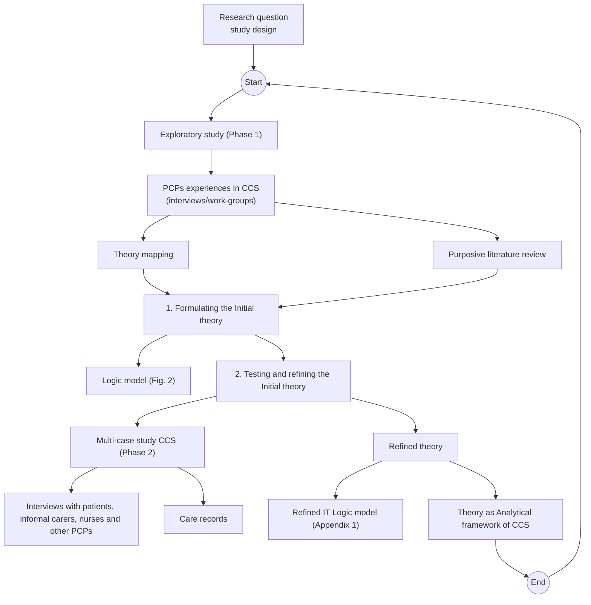
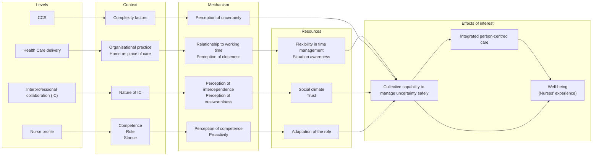

## Document page 1

187

8.1. ADVOCACY FOR PEOPLE IN COMPLEX SITUATIONS: A REALIST STUDY OF THE

NURSING ROLE IN CHRONIC WOUND CARE AT HOME THROUGH COLLABORATION.

8.1.1. Abstract

Aim: To explain how, for whom and why home care nurses, in collaboration with other primary care providers (PCPs), contribute to patient-centred care for people with chronic wounds in complex care situations (CCS).

Design: Realist approach with two phases 1) developing an initial theory (IT) based on provider narratives 2) testing and refining the IT through a multi-case study.

Methods: The data for phase 1 were collected from nurses and other PCPs through semi-structured interviews and working groups in a workshop setting. A purposive literature review allowed for exploration of emergent concepts from phase 1. Phase 2 data were collected through medical records and semi-directive interviews with patients, informal caregivers, nurses and PCPs.

Results: We collected 26 CCS from 51 professionals in phase 1, along with a purposive literature review to elaborate the IT. This allowed us to identify and link relevant concepts to the self-determination theory. The study identified mechanisms that clarify 1) how PCPs collectively manage CCS, 2) the nurses’ experience, and 3) the patient’s care. IT refinement allowed us to highlight the adaptation of the nurse's role in the form of advocacy on behalf of the patient. The mechanisms involved activated collaborative resources including interpersonal knowledge, trust, positive collaborative climate and vision of the nursing role.

Conclusion: In the context of home care for people in CCS, treated for chronic wounds, nurses contributed to person-centred care by extending their role towards more advocacy for the patient.

Keywords

Home care services, Person-centred care, Interprofessional collaboration, Nurses, Community health, Chronic Wounds, Complex Care Situations

## Document page 2

8.1.2. Introduction

The Belgian healthcare system, like others, is facing fragmentation due to specialisation and differentiation, leading to concerns about the quality of care (Gerkens & Merkur, 2024; Rijken et al., 2017). As a result, it's healthcare system is being forced to progress towards better integrated care to ensure coordinated and continuous services that are tailored to the needs of individuals across the care continuum (World Health Organization, 2016b). This transformation aims to strengthen primary care (PC) so that primary care providers (PCPs) play a central role in delivering integrated person-centred care (PCC), taking advantage of their proximity to people and their links with the community (Lambert et al., 2022). Improving the integration of care through PC should enable people's needs to be prioritised through a PCC approach (Miller et al., 2018; Starfield, 2011).

Complex care situations (CCS) are on the increase. These occur when multiple medical, psychosocial, cultural, environmental, and/or economic factors manifest simultaneously in an individual (Karam et al., 2021). As the population ages, multimorbidity, frailty, loss of autonomy, and the risks of social and financial vulnerability associated with aging also increase (Devos et al., 2019; Stafford et al., 2018). Patients in CCS often require involvement from various providers who must coordinate their actions. In such cases, aligning the patient's needs with the providers' responses becomes more challenging (Grembowski et al., 2014). Moreover, this lack of alignment increases the risk of care inconsistency and uncertainty about outcomes (Axelsson & Axelsson, 2006; Mount et al., 2015). Therefore, it is essential to pay special attention to factors determining alignment and interprofessional collaboration (IC) between PCPs, which should be adapted to the complexity of the situation (Careau et al., 2018; Valentijn, Ruwaard, et al., 2015).

There are factors at the macro and meso levels of the health system that influence IC and coordination among PCPs (Valentijn et al., 2013). In Belgium, the practice of PCPs is primarily regulated by two mechanisms. First, the regulatory framework, which defines the scope of practice and creates hierarchical relationships between PCPs (Nys, 2013). Second, the financing system, which also plays a regulatory role. The majority of PCPs in Belgium are funded on a fee-for-service basis, although flat-rate payments are becoming more common. In addition, capitation funding for multidisciplinary teams exists, but remains a minority compared to the population served by these teams. (Gerkens & Merkur, 2020). The practice of nurses and other

## Document page 3

189

PCPs can vary depending on whether they are employed or self-employed and whether they work in solo or group practice, mono- or multidisciplinary. The combination of these variables results in different organisational practices that need to be taken into account to understand the alignment and collaboration of PCPs (Karam et al., 2022).

In recent years, many international initiatives have been launched to improve coordination between PCPs for a person-centred approach, using new roles such as coordinators or case managers, or new organisational models(Karam et al., 2021; Kreitzer et al., 2015). Our study follows another line of reasoning, which is to strengthen the collective capacity of PCPs to manage CCS, and in particular to explore the potential contribution of the role of home care nurses. (Edwards et al., 2017; Robeyns & Byskov, 2023). Our choice of study case is the care of people with chronic wounds.

This study choice is justified for several reasons. Firstly, a significant proportion of these patients with chronic wounds are people with chronic conditions who face other vulnerability factors (Murray et al., 2018). Their needs require the involvement of providers from different disciplines or organisations, and specific coordination requirements (Alvarez-Irusta et al., 2022). Second, the care of these people is mainly provided by nurses, as the presence of general practitioners (GPs) at home has gradually declined over the past decade (OSSBC, 2022; Probst et al., 2014). Third, because of the frequent interactions during long episodes of care, nurses are in close to the patients in their living environment, whereas other providers, mostly GPs and medical specialists, have less frequent contacts (Alvarez-Irusta et al., 2022).

Given these factors, we asked how home care nurses, in collaboration with other PCPs, contribute to integrated person-centred care for patients with chronic wounds. Our research question was formulated as follows: How, under what circumstances, and why does the involvement of home care nurses contribute to the quality of care for patients with chronic wounds by strengthening the collective capability of PCPs to manage CCS ?

8.1.3. Methods

To address this question, we adopted a realist approach, well-suited for studying complex social realities such as healthcare delivery (Marchal et al., 2018; Pawson & Tilley, 1997). The realist approach aims to test the validity of an initial theory (IT)

## Document page 4

across various contexts to explain how, for whom, and why a process (here, healthcare delivery) contributes to expected outcomes (Pawson, 2013). The IT, defined as a working hypothesis, was developed based on providers' tacit knowledge, then tested and refined in specific contexts (Shearn et al., 2017; Van Belle et al., 2017).

For the development of the IT (phase 1 of the study), we used two methods to collect nurses' and other PCPs' narratives about CCS in home care. Data collection for this Phase 1 took place between July and November 2020 tough semi-structured interviews and work-groups during a workshop with nurses and other providers, focusing on CCS and interprofessional collaboration (IC) (Green & Thorogood, 2018; Reeves et al., 2017; Shearn et al., 2017). Then, a purposive literature review clarified and deepened the concepts that emerged from the narratives. Using theory mapping, we identify Ryan and Deci's Self-Determination Theory to explain empowering IC contexts for nurses to practice (Ryan & Deci, 2018). The IT was empirically tested (Phase 2) through a multi-case study. This method was well-suited for our research objective as it enables a deeper understanding of a real-life phenomenon where the

Figure 18 Diagram showing the stages of the study and the methods used

## Document page 5

191

boundary between the phenomenon and the context is blurred (Gerring, 2009; Yin, 2018). In this study, we defined the unit of analysis, the ‘case’, as the role of home care nurses in a collaborative process for managing one or more patients with chronic wounds in CCS (Shaw et al., 2023). Three groups of home care nurses from Frenchspeaking networks in Belgium were recruited following a widely publicised call for participation in 2021. We sought diversity in organisational practice (mono- and multidisciplinary, fee-for-service and capitation funding) and aimed for a purposive case sample (Emmel, 2013). Among the patients they cared for during the study, nursing teams identified one or two patients who had chronic wounds in CCS. All patients agreed to be contacted by the research team. Informed consent was obtained from patients, informal caregivers and other participants. Using the COMID® tool, a researcher assessed and verified the complexity of the situation(Busnel et al., 2018, 2021). A variety of methods were used to collect data, including group interviews with nursing teams, individual interviews with patients, informal caregivers, nurses and other PCPs involved, and data from care records and practice information. The research design included a 6-month follow-up period after the patient interview to capture any significant events related to the patient's care or the collaborative processes.

All interviews in phase 1 and 2, guided by tailored interview guides, were recorded and transcribed for analysis.

8.1.4. Data analysis according to the realist approach

The data collected at different stages of the study were analysed using the ‘C-M(R)- E’ heuristic tool (Van Belle et al., 2017). This acronym stands for :

Context (C): Pre-existing elements (structural, motivational, temporal, and resource) that provide necessary conditions for triggering one or more mechanisms (Sheaff et al., 2021; Wong et al., 2016).

Mechanism (M) : Underlying reasoning/behaviour of stakeholders, along with opportunities /constraints -Resources (R)- generated in a context that can lead to an effect (S. M. Dalkin et al., 2015; Pawson & Tilley, 1997).

Effects of interest to the study (E): change that has a particular influence on quality of care, expected or unexpected, at individual and/or collective level (Mukumbang et al., 2020; Pawson, 2013).

## Document page 6

The heuristic tool helped to establish C-M(R)-E configurations that explain how a mechanism triggered in a given context leads to observed effects, making the causal link explicit (Van Belle et al., 2017). During the iterative analysis process, C-M(R)-E configurations were identified, listed, compared, and confronted with potential competing configurations. The relevance of the configurations was discussed monthly between the authors and other researchers. The IT has been developed based on configurations achieving a dual effect at the nurse experience and patient care level. Finally, the results of the intra-case analysis were validated with the nurses involved in the multi-case study.

Data analysis was performed using NVIVO® 1.6.1.(S. Dalkin et al., 2021; Gilmore et al., 2019).

8.1.5. Results

8.1.5.1. IT development

During Phase1, 51 providers, including 39 nurses, shared accounts of their experiences from their own practice of CCS at home with people with chronic wounds.

The CCS collected in Phase 1 showed considerable heterogeneity, but they shared a common characteristic: a high level of uncertainty perceived by the PCPs involved. Analysis of the narratives highlighted contextual factors at different levels, mechanisms at work and resources that lead to effects on the nursing role, as follows:

| Participants and data (Phase 1) | Value |
| --- | --- |
| Nb of participants | 51 |
| Care and Health Providers | Semi-directed interviews: 5 PC nurses 3 GPs  Workshop (10 work-groups): 34 Nurses 2 Social workers 3 Occupational therapists 1 GP 1 Pharmacist 2 Technologists |
| CCS shared | 26 |

Table 3 Participation and number of CCS collected in Phase 1

## Document page 7

193

Contextual factors (C): the type of organisational practice (financing and resource sharing), the patient’s home environment as care setting, the complexity of the situation, the nature of the IC and the individual profile of the nurse.

Mechanisms (M): Relationship to working time, perceptions of interdependence between PCPs involved in care, competence, uncertainty, trustworthiness, proactivity in the care role and closeness to the patient.

Resources (R) generated as a function of the nature of the collaboration: trust, climate of IC and adaptation of the nurse's role.

Effects (E): The collective capability of PCPs to manage uncertainty as a proximal effect. This in turn becomes a resource that promotes quality of care (continuous, coordinated and centred on the individual's preferences) and influences the caregiver's experience of the care situation.

The logic model (Figure 18) shows the relationships between contextual factors, mechanisms and ressources at the level of interprofessional collaboration to influence patient’s care and the nurse’s experience in the CCS (Ebenso et al., 2019; Mills et al., 2019).

Figure 19 Logic model showing the relationships between contextual factors in CSS, mechanisms and resources at different levels, and effects of interest of the study

## Document page 8

After the initial analysis stage, a purposive literature review allowed us to deepen and refine our understanding of the concepts emerging from the empirical data : trust (Robbins, 2016b, 2016a), interdependence in collaboration (Courtright et al., 2015), proactivity (Strauss & Parker, 2014), advocacy role (Abbasinia et al., 2020) and to link them to a general theoretical framework, that of self-determination theory (Ryan & Deci, 2018). This theoretical framework provides insights into the elements that emerged from the initial analysis linked to empowering contexts, including recognising nurses' competence, autonomy and PCPS relationships. Selfdetermination theory explains how the fulfilment of these creates a conducive social climate for positive behaviours such as commitment and proactivity in practice (Gagné & Deci, 2005; Van den Broeck et al., 2021). This theory is consistent with participants' observations: in CCs with a positive collaborative climate, a safe space for empowerment emerges, enabling PCPs to feel valued, supported and encouraged.

These key empirical and theoretical components converge in the development of the IT, which is formulated according to the C-M(R)-E logic :

‘If the home nurse, who is close to the person with chronic wounds in a CCS, shares resources with the other PCPs involved in the patient’s care and works with them in a positive climate of interprofessional collaboration (supporting competence, autonomy) and trust, then she/he will plausibly adapt her/his role according to the needs of the patient in CCS, thereby strengthening the collective capability to manage uncertainty and giving meaning to her/his actions, because she/he will feel empowered and able to act proactively’.

This IT was then tested in the light of multi-case study data.

## Document page 9

195

8.1.5.2.Testing and refining the IT

For this multi-case study, carried out between March 2021 and February 2022, 24 interviews were conducted, 20 of which wre individual interviews.

All actors involved agreed to take part in the study, with the exception of one GP (Case B). A total of four patients, two informal caregivers and 24 providers took part in the study.

During this follow-up period, an additional interview was conducted with a nurse (Case B). The four situations were documented as complex with the COMID ® tool.

According to the participants, home care relies on teamwork to ensure continuity of care. However, each case included a ‘ reference nurse’, leading to a nurse individual and collective approach. The presentation of the results takes this specificity of the home care organisation into account, as the nurse provides care individually, but is positioned within the group.

In addition, the dynamics of collaboration with other PCPs were influenced by organisational practice modalities, situational characteristics and the patient’s needs.

|  | Case A | Case B | Case C |
| --- | --- | --- | --- |
| Number of participants | 6 | 10 | 14 |
| PCPs | 3 Nurses 1 GP 1 Physiotherapist | 7 Nurses 1 Physiotherapist | 6 Nurses 2 GPs 1 Family care assistant 1 Social worker 1 Psychologist |
| Patients and informal caregivers | 1 Patient | 1 Patient 1 Informal caregiver | 2 Patients 1 Informal caregiver |
| CCS | 1 | 1 | 2 |

Table 4 Summary table of multi-case study participants

## Document page 10

The main characteristics of the cases in terms of collaboration and organisational practices are presented in Table 5

For clarity, we chose to focus on specific C-M(R)-E configurations, particularly those providing new insights into the mechanisms at play in IC within CCS. These configurations illustrate the contexts and mechanisms at work for nurses' contribution to collective capability through adaptation of their role.

After the descriptive summary of the cases, the findings are presented on the basis of two contextual levels outlined in the IT:

1) The organisational practice type and collaboration from the perspective of the nursing team.

|  | Case A | Case B | Case C |
| --- | --- | --- | --- |
| Number of nurses | 4 | 15 (+ 2 nurse assistants) | 4 (2) |
| Type of organisational practice | Multidisciplinary capitation-funded | Monodisciplinary fee-for service and flat-rate | Multidisciplinary capitation-funded |
| Working status | Salaried | Self-employed | Salaried |
| Type of collaborative practice in CCS (Careau, 2018) | Shared health practice | Parallel practice | Concerted practice |

Table 5 Organisational practice characteristics of cases and type of interprofessional collaboration in studied CCS

## Document page 11

197

2) The nurse's role in the CCS from an individual perspective.

Organisational practice type and collaboration from the perspective of the nursing team.

The nursing team caring for Mrs. P comprised a stable core working for years in the MPHC, sharing resources like electronic health records. This MPHC served a socioeconomically mixed population (C- Organisational practice). Nurses felt competent due to their PC experience (M - Competence) and shared a vision of nursing care as autonomous, extended, and not limited to conventional technical care (R- Nursing care vision). They had to advocate and negotiate with other disciplines to establish this nursing vision in PC. Gradually, they gained support from MPHC members (R- Role understanding) and felt empowered to adopt an extended nursing role based on the situation, feeling legitimised (M - Empowerment perception). They felt their competence were recognized by colleagues, reinforcing their role. Recognition of competence, such as wound care expertise, was noted by other providers (M - Being trusted). Nurses emphasized a climate of trust with GPs and others PCPs. Consequently, they could actively and sometimes proactively contribute through an extended role (e.g. visiting patients at home when suspecting difficulties) (M - Proactivity - R-Extended role related to patient’s protection).

CASE A

Mrs. P's Care Situation

Context: Mrs P had multiple chronic health problems in a high-risk family context. She had been suffering from a leg ulcer infected with a multi-resistant germ for a number of years and was vehemently opposed to amputation. She was cared for by the PCPs of a capitation-funded MPHC and her situation was very fragile and her stability precarious (C).

Collective Capability to Manage Uncertainty: The PC team aligned with Mrs. P's preferences and negotiated with the specialist doctor for a care plan to delay the amputation as long as possible (E).

## Document page 12

The nurse's role in the CCS from an individual perspective.

Weekly, the reference nurse provided wound care and reevaluated the situation with Mrs. P, aiming to monitor overall progress and signs of potential infection progression, indicating a need to adjust the care strategy (C- Situation-specific). Over time, a close relationship developed between the nurse and Mrs P. (M - Closeness). Through this closeness and regular home visits, the nurse was at the forefront of monitoring (R- Situation awareness), reassuring other PCPs involved that alarming signs would be promptly reported (E - Collective capability to manage uncertainty). Additionally, the nurse felt recognized and motivated by the supportive role provided to Mrs. P (M- Empowerment perception) and was legitimised to take initiatives (M- Proactivity). For exemple, the nurse accompanied Mrs. P to a specialist appointment to help her understand the (non-) amputation issue and formulate her questions. Similarly, when a change in wound treatment was necessary, the nurse played a proactive role in seeking alternative treatments acceptable to Mrs. P (R- Extended role contributing to management). As a result, the nurse experienced great satisfaction in assisting Mrs. P in achieving her wish for non-amputation for as long as possible and believed his competence were strengthened by what he had learned from this situation (E- Nurse's experience).

CASE B

Mr. M's Care Situation

Context: Mr. M had diabetes complications: renal failure, heart problems, and a diabetic foot amputation (stump wound and heel pressure ulcer). For two years, he had been caught in a spiral of negative events. Yet, he maintained hope of walking again with his prosthesis. His situation was unstable, and prognosis bleak (uncertainty).

Collective capability to manage uncertainty: the nursing team and the haemodialysis centre providers, the only actors closely involved in Mr M's followup, worked in parallel. The GP and physiotherapist were no longer involved in the follow-up. Communication between the actors involved was strained and the CCS was at an impasse (E).

## Document page 13

199

Organisational practice type and collaboration from the perspective of the nursing team.

The nursing team provided wound care to Mr. M at home. The coordinator of the team was also Mr. M's reference nurse. This team provided daily care to around a hundred individuals from various socio-economic backgrounds and collaborated with multiple PCPs providers in the region, including various GPs. Most of these providers were independent practitioners (C- Organisational practice).

The team's care vision emphasized the nurse's autonomous role within conventional care practices, heavily focused on the care relationship and patient’s quality of life (R- Nursing care vision). Mr. M's reference nurse felt his role as a home nurse was misunderstood and disrespected by some providers in the hemodialysis service where Mr. M was treated three times a week. However, he knew his competence was widely recognized by the GPs he regularly worked with (M - Being trusted /Competence).

Communication between home nurses and the hemodialysis service was basic, primarily through a communication notebook and Mr. M's informal caregivers accompanying him during hospital visits. After several unsuccessful attempts to establish effective communication for coordinating Mr. M's care, a climate of distrust developed between home nurses and nephrologists (R- Social climate).

Mr. M's GP, who had previously acted as an intermediary with hospital services, was no longer involved. The nurses were unable to reach an agreement with any specialized providers on a common approach to support Mr. M's preferences. The nurse experienced this with a great deal of frustration (E- Nurse's experience).

The nurse's role in the CCS from an individual perspective.

For the past year and a half, the reference nurse has been providing daily wound care to Mr. M at home. Over time, a close relationship developed with Mr. M, motivating the nurse to support him in his preferences (M - Closeness). Through this closeness, the nurse gained a good understanding of Mr. M's situation and preferences, as well as those of his informal caregiver (R- Situation awareness). The specific challenge of wound care was to heal the wounds so that Mr. M could put on his prosthesis and regain mobility (C - Specific situation).

## Document page 14

The nurse felt competent in wound care due to years of practice in home care and regular continuing education in the field (M- Competence). One of the requests made to the hemodialysis service was to unload the amputated foot during dialysis sessions to help the wounds heal . Furthermore, the nephrologists providing medical follow-up three times a week were well-positioned, in the eyes of Mr. and Mrs. M, to act as intermediaries with other specialist doctors in wound care follow-up (C- Specific situation). Communication between the nurse and specialized providers was difficult, and care goals were not aligned (C- Specific situation). The nurse doubted the possibility of wound healing without the involvement of the hemodialysis service (M- Perception of goal interdependence). For this reason, the nurse, acting as Mr. M's spokesperson, requested the nephrologists to coordinate his specialized medical follow-up and ensure unloading of the foot during dialysis sessions (R - Extended role of mediation and support for the patient). The unsuccessful attempts to involve this service had led to feelings of powerlessness and fatigue in the nurse (E- Nurse's experience).

## Document page 15

201

Organisational practice type and collaboration from the perspective of the nursing team.

The year before the study, the nursing team providing wound care to Mrs. D and Mrs. T underwent complete turnover. At the time of the study, the team consisted of four nurses with varied prior experiences. They worked in a capitation-funded MPHC, caring

CASE C

Situation of Mrs. D

Context: Mrs. D was receiving treatment at home for leg ulcers. She had multiple chronic health problems, reduced mobility, and social isolation. Previously, due to a disagreement with other PCPs she had refused to allow them into her home. However, Mrs. D's deep desire was to remain at home, despite the inherent risks of her precarious stability (uncertainty).

Collective capability to manage uncertainty: The MM team aligned with Mrs. D's preferences and, in collaboration with a support service, organized a care and assistance system to enable her to stay at home. They found that wound care served as a sentinel role to ensure overall follow-up (E).

Mrs. T's Situation

Context: Mrs. T suffered from leg ulcers, various health problems, and mental disability due to a rare congenital syndrome. The family situation was complex and precarious. Her informal caregiver, who exhibited unpredictable behaviour, acted as an intermediary between providers and Mrs. T. The informal caregiver wished for care to be provided at home. Previously, there had been unexplained continuity disruptions in medical follow-up. Mrs. T's health status and the management of her care by her informal caregiver were concerning (uncertainty).

Collective capability to manage uncertainty: Home wound care allowed for a sentinel role in monitoring the overall situation, including care provided by the informal caregiver (medication administration, wound care, medical appointment attendance). This home monitoring met the couple's preferences. She unexpectedly passed away in the hospital during the study follow-up period (E).

## Document page 16

for a population many of whom lived in precarious conditions. (C-Organisational practice). Furthermore, the team's vision of nursing care was not uniform, limiting their ability to extend beyond a conventional technical role (R-Vision of nursing care). Due to staff turnover, MPHC team had not the opportunity to become acquainted with each other's roles and functioning (R-Role understanding). Nurses felt recognized as ‘trustworthy’ to some extent by MPHC members (M- Being trusted). The overall collaboration climate was neutral, with team functioning focusing more on disciplinary sectors (medical, nursing, physiotherapy), despite weekly multidisciplinary team meetings and shared electronic health records (R-Neutral Social Climate).

In both situations, through wound care provision, nurses played an implicit role in preserving the care relationship between the MPHC and the patients and informal caregiver. This role implicitly contributed to reduce the risk of relationship breakdown and enabling care continuity to prevent ‘closed-door’ or ‘lost-to-follow-up’ phenomena (E- Capability to manage uncertainty). Through wound care follow-up, nurses maintained an ‘open window’ for monitoring the patient's overall situation (R-Extended role related to patient protection). However, nurses did not feel that this implicit role was fully recognized by the team. The reference nurse explained feeling a need for legitimacy from ‘higher-ups’, indicative of limited empowerment of the nursing role, especially when it came to reducing the number or intensity of interventions, which he also attributed to his inexperience (M-Perception of Empowerment and Competence).

The nurse's role in the CCS from an individual perspective.

The reference nurse for Mrs. D and Mrs. T expressed having limited experience in wound care practice and perceived themselve as still in the process of professional development. In both situations, the goal of wound healing was secondary (C-Specific to the situation). The nurse was aware that the frequency of wound care (and Mrs D's preferred technique) did not align with best practice recommendations but corresponded to negotiated arrangements with the patient to maintain the relationship and avoid refusal of care. Therefore, the nurse perceived the care provided as suboptimal quality (M-Being trusted).

The nurse did not feel explicit recognition for the role played in benefiting the relationship between the MPHC team and the patient (M-Perception of Empowerment), even though it had been mentioned by both GPs in the interviews. Despite this, the reference nurse endeavored to gradually build a trusting relationship with the

## Document page 17

203

individuals, which, in his view, would strengthen the relationship and gradually allowing changes in treatments (E-Capability for collective management of uncertainty). The reference nurse explained that he had quickly adjusted his ideals as a young graduate nurse to the reality of practice (E- Nurse's Experience).

Refining IT

The inter-case analysis allowed us to identify a number of new elements that nuanced and enriched the IT. In all four scenarios, providing wound care at home validated the regular involvement of home care nurses in patients' and informal caregivers’ eyes. Depending on the context, nurses assumed varying roles beyond wound care, influenced by factors such as the vision of nursing care, trust between providers, and their role in the CCS.

Vision of nursing care and role extent

In Cases A and B, each team shared a common vision of nursing care, which served as a key resource to guide role adaptation beyond technical wound care. This shared vision provided a reference for the extent of the nurse's scope of practice and guided actions to go beyond the usual role boundaries. For example, nurses' direct contact with specialists to promote collaboration challenged the tacit rule according to which exchanges between the generalist and specialist levels of care follow a disciplinary logic (doctor to doctor). However, the group seemed to reinforce and internally legitimise nurse’s action when it took place in accordance with this shared vision. In Case C, however, this vision was a collection of individual views due to constant turnover in the nursing team.

Interpersonal knowledge and trust

Trust, rooted in trustworthiness, evolved through real-life interactions. In Case A, stable nursing team fostered collaboration within the MPHC, where trust was built on concrete practices such us confidentiality of shared information. Real-time interactions allowed providers to assess trustworthiness, reducing uncertainty and improving alignment. In Case B, sporadic interactions hindered role clarification and trust between nursing team and nephrologists. Barriers to effective communication led to reliance on patient and informal caregiver information, fostering mistrust. In Case C, nurse turnover disrupted interpersonal knowledge, affecting IC.

## Document page 18

Perception of interdependence

Sharing resources in group practices (i.e. MPHC) alone did not guarantee a positive collaborative climate. The quality of interactions influenced providers' interpersonal knowledge, role understanding and trust in Case A. Conversely, in case C, although the practice environments were similar, interdependence emerged at the intra-disciplinary level, weakening IC space.

Elements regarding the perception of interdependence in care goals emerged in Case

B. On one hand, the nursing team saw the potential for the hemodialysis service to complement wound care at home by offloading the foot during sessions and clinically coordinating specialized consultations. On the other hand, without understanding the nursing role's potential, nephrologists struggled to envision how it could complement the objectives set by the hemodialysis service. This led to a significant asymmetry in the perception of interdependence.

Advocacy role of the nurse

Nurses adapted their roles to various situations, including acting as sentinels and ensuring continuity of monitoring, education, and support for self-care. They maintained close presence and sounded the alarm when negative developments occurred, facilitating prompt intervention from other PCPS. Wound care facilitated their intervention, fostering a care relationship and continuity of care at home. They supported self-care for patients and informal caregivers, reinforcing their capabilities. Additionally, they served as coordinators, representatives, and protectors, advocating for patients in various ways.

Uncertainty in nursing practice in CCS

Nurses in CCS faced vulnerability due to close relationships with patients and uncertain outcomes. Positive IC dynamics in Case A provided a supportive environment for proactive roles, mitigating the negative impact of uncertainty. Conversely, lack of IC in Case B led to increased uncertainty, which negatively affected the experiences of both nurses, and patients and informal caregivers. In Case C, a neutral collaborative climate and intra-disciplinary focus contributed to nurse fatigue and a sense of lack of recognition of competence.

## Document page 19

205

IT refined

On the basis of these elements from the case studies, we refined our IT proposal as follows:

‘When the nurse, close to the patient with chronic wounds in CCS, has, on the one hand, a shared vision of the scope of the nursing role in CSS in the nursing team, and on the other hand, collaborates in trust and in a positive climate of IC supporting competence, autonomy and the relationship then, he/she will plausibly adapt his/her role according to the needs of the situation because he/she will feel empowered and able to act proactively. This adaptation will take the form of advocacy on behalf of the patient (protecting, informing, valuing, coordinating) in order to strengthen the collective capability to manage the uncertainty of the CCS in an integrated approach. The climate of positive collaboration and trust foster the creation of a safe space for the practice of this role. This practice gives meaning to his/her actions influencing nurses’ experience.’

The logical model summarizing the refined theory is presented in Appendix 15.4.3.

8.1.6. Discussion

This study led to the development of an IT explaining how home care nurses, adapting their roles for a more integrated and person-centered approach, contribute to collective effort to manage CSS. Nurses' roles extended beyond technical wound care to patient advocacy, according to our findings (Abbasinia et al., 2020). The IC climate appears to contribute to nurses' empowerment, as explained by the principles of selfdetermination theory (Ryan & Deci, 2018). The multi-case study consolidated four collaboration mechanisms (interdependence, empowerment, proactivity, being trusted or trustworthy) influencing the establishment of IC resources. Nursing care vision, trust, interpersonal knowledge and collaboration climate facilitated extended nurse intervention that mediated positively patient’s care and nurse’s experience. Refined IT provides guidelines for safe, empowered nursing practice within IC beyond conventional roles and current restrictive regulations (INAMI, 2023). We focused on the mechanisms that enable the transformation of the nursing role in CSS, highlighting the normative dimensions of interprofessional integration that promote informal coordination between PCPs. (Valentijn et al., 2013).

Our findings revealed that patients’ preferences, CCS specifics, and PCPs’ roles shape unique contexts for IC as already pointed by other studies (Grant et al., 2011). In our

## Document page 20

study, at a clinical level, PCPs experienced significant uncertainty due to the complexity and evolving nature of the situation. Despite the constraints and lack of structural incentives, the PCPs sometimes adopted a flexible approach that emphasised the relational aspect and the temporal nature of care and collaboration, which is consistent with previous research (Larsen et al., 2017; Loeb et al., 2016).

In our study, the organisational practices of the participants influenced the frequency of interaction between the PCPs involved, the modalities of information exchange, the sharing of resources and funding. These factors, mainly related to the functional dimension of care integration, significantly influenced the collaborative processes in one case and promoted the perception of interdependence of goals and tasks (Courtright et al., 2015; Valentijn et al., 2013). However, in other case, despite a similar organisational framework, resource sharing did not facilitate the extension and proactivity of the nurse's role. As Miers notes, the legal and organisational framework influences, but doesn't prevent, working within the gaps in the system, particularly in home care where roles may be poorly defined or where other providers' roles are withdrawn (Abbott, 1995; Comeau-Vallée & Langley, 2020; Miers, 2009; OSSBC, 2022). So, while these functional elements may initially facilitate IC, they may not always be sufficient to promote role empowerment and proactivity.

According to our findings, new resources emerged in collaborative processes thanks to other factors. First, trust between PCPs appears to be an essential resource for IC. Trust refers to the fact of acting competently and the perception of the type of motivation driving the action (Robbins, 2016a). Other authors have also identified trust as a fundamental element in defining and adapting the role of nurses (Weber et al., 2022) within collaborative PC processes (D’Amour et al., 2008; Larsen et al., 2017). According to Abbot, contrary to popular belief, roles are not fixed and determined on the basis of an unchanging set of activities (Abbott, 1995). Rather, role boundaries are dynamic. They are shaped by the interaction between actors in local contexts when these are favourable (Abbott, 1995; Contandriopoulos et al., 2015). However, in our study, trust, or lack of it, was related to previous experience of IC 'in the situation'. This is consistent with other studies (Bookey-Bassett et al., 2017; Pype et al., 2018). As in other studies, participants saw trust as a collective construct that requires time, investment in collective work, negotiation and continuous testing through collaborative action (Karam et al., 2021; Schot et al., 2020). The turnover of PCPs in CCS can therefore be an obstacle to the achievement of IC.

## Document page 21

207

Several studies link mutual trustworthiness perception, facilitated by providers' interpersonal and roles knowledge, to the creation of a positive social climate crucial for IC and well-being at work (Bookey-Bassett et al., 2017; D’Amour et al., 2008; Gagné et al., 2022b; Miers, 2009; Pype et al., 2018; Ryan & Deci, 2018; Van den Broeck et al., 2021; Weber et al., 2022). In our study, the relational space led to explicit recognition of nurses' competences and roles, equal dialogue, and nurse empowerment in one case. This space had positive effects on IC practices, increasing safety perception, knowledge, and professional satisfaction, as noted by other authors (Bookey-Bassett et al., 2017) .

Furthermore, providing nursing care at home involves two dimensions ensuring continuity: individual and collective practice. The shared vision of the nursing role in PC was reinforced by the nursing teams in two cases. This representation influenced how the role was played and contributed to collective efforts as also cited by Schot et al. (Schot et al., 2020). In one case, the process refers to what Langley et al. call the collaborative construction of professional boundaries (Langley et al., 2019) where role boundaries are negotiated, discussed, accommodated and aligned in order to get the job done (A. Strauss, 1978). Indeed, continuity, coordination and new activities can be facilitated by role flexibility (Miers, 2009). Finally, we hypothesize that a shared vision of the nursing role and positive collaborative spaces can partly mitigate the emotional impact of frequent exposure to CSSs (Weiner et al., 2019).

In our study, we found that the adaptation of the nurses' role was mainly directed towards advocacy on behalf of the person. This had taken various forms: mediation, representation, coordination or protection. This concept, often misunderstood and poorly conceptualized, encompasses activities commonly associated with global monitoring and coordination, similar to sentinel tasks (Abbasinia et al., 2020; Karam et al., 2021). These activities take place in the interstices of the formal system, where the boundaries between roles are particularly blurred or where there are gaps in the provision of care (Weber et al., 2022). In our study, in two cases, the interventions of the nurses helped to manage the uncertainty collectively. Working closely with patients in their home environments enabled nurses to fill information gaps and contribute to care coordination (Schot et al., 2020).

Finally, it should be noted that while working at the boundaries aims to improve IC, advocacy is not without risk, as other sources have previously corroborated our

## Document page 22

findings (Bu & Jezewski, 2007; Comeau-Vallée & Langley, 2020; Mallik, 1997; Weber et al., 2022).

Strengths and limitations of the study

The methodological choices in this study align with the realist approach (Marchal et al., 2018; Pawson, 2013). Our use of the multi-case study method provided valuable insights into the unique role and contributions of homecare nurses in caring for people with chronic wounds (Mol, 2009; Yin, 2018). This method is particularly useful for exploring relatively unexplored topics or when evidence is limited. It allows for flexible investigation, generating new ideas and hypotheses. However, like any research design, it has both strengths and limitations. On the one hand, this qualitative approach enabled us to collect rich data from multiple sources (Green & Thorogood, 2018). By including three cases in the case study, we were able to capture the diverse perspectives and experiences of the actors involved, which led to a better understanding of the role of nurses in different natural contexts (Yin, 2018). The study allowed us to identify challenges and strategies used by nurses in specific contexts. It also helped us understand the roles played and how they contributed to patient preferences. Finally, the methodological approach gave us the opportunity to triangulate the sources of information and to compare and enrich the results with a purposive literature review in order to strengthen the credibility and reliability of the study's conclusions (Varpio et al., 2017). As a result, the IT developed identifies areas for improvement in nursing and collaborative practice.

However, these methodological choices have limitations. Like any case study, the results may not be directly generalizable. The selection of cases was specific to PC in French-speaking Belgium, so the results are only transferable if this context is taken into account. In addition, multidisciplinary fee-for-service practices were not part of the study at any phase. On the other hand, the refined theory emerging from the intersection of the primary and secondary results, and from discussions with the researchers and participants, confidently demonstrate the involvement of these mechanisms in the collaborative processes in CCS. Having a certain degree of abstraction, these results can be applied to other areas of home care nursing and IC if contextual factors are considered.

Conducting this study was time and resource-intensive, leading to a limited number of cases. The study was part of a doctoral process, subject to time constraints.

## Document page 23

209

Additionally, data collection occurred during the COVID-19 pandemic, posing challenges for PCPs participation. Hence, we adopted a pragmatic approach to manage data collection logistics carefully.

Implications for research and practice

This study enhances our understanding of how collaborative practices and nurses' roles in home care influence mutually, aiming for a more integrated, person-centered approach. Our findings reveal varying interpretations of nursing care vision in PC.

We suggest it would be appropriate to reflect on the roles of home care nurses in light of increasing population needs. Researchers, professional groups, and teachers could contribute to developing and solidifying a shared vision of care and nurses' pivotal roles in collaborative practices in PC. Swanson et al., through their literature review, identified four primary roles for the PC nurse: creator of intra-interprofessional and organisational relationships, outreach connector, facilitator of prevention and followup programs for specific groups, and care coordinator (Swanson et al., 2020). As the needs and practices of other providers evolve, adjustments to the role may be required to address these changes.

The study also highlights the significance of PCPs in establishing safe spaces within IC. Developing interprofessional competences and promoting reflective practices within multidisciplinary teams can foster this relational space, facilitating role adaptation and promoting person-centered approaches in CSS (Richard et al., 2019).

Finally, bridging the gap between research and practice through this study can positively impact the quality of care for individuals in CSS

8.1.7. Conclusions

Our study investigated the role of nurses in the home care of patients with chronic wounds in CCS, focusing on the nurses' contribution to a person-centred integrated approach. The collective management of uncertainty associated with CCS and the consideration of patient preferences can be enhanced by extending the traditional role of the nurse to an advocacy role and by promoting proactive behaviours.

In conclusion, the results highlight two areas for improving the quality of care in CCS: firstly, the development of a common, shared vision of nursing care in PC, and

## Document page 24

secondly, the importance of the normative dimension in collaborative processes. These findings have important implications for nursing education and training, both in terms of IC and PC practice, and in terms of how innovative practices can support the nursing role to contribute to the collective capacity to manage the uncertainty of CSS.

Abbreviations

CCS : Complexe care situations

IC: Interprofessional Collaboration

IT: Initial Theory

GP: General Practitioner

PC: Primary Care

PCC: Person-centred care

PCPs: Primary care providers

MPHC: Multidisciplinary Primary Healthcare Center

Acknowledgements

We would like to thank all the participants in this study: patients and informal caregivers, nurses and other providers who welcomed us and agreed to share their views with the research team. We would also like to thank all the researchers who contributed to this work by discussing and sharing their suggestions for improvement.

Author contributions

LAI: Conceptualization, methodology, data collection, formal analysis, writing original draft

TVD: funding acquisition, supervision, methodology, writing-review& editing

JM: funding acquisition, supervision, methodology, writing-review& editing

JLB: writing-review & editing
