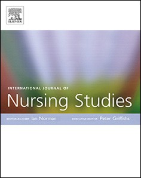
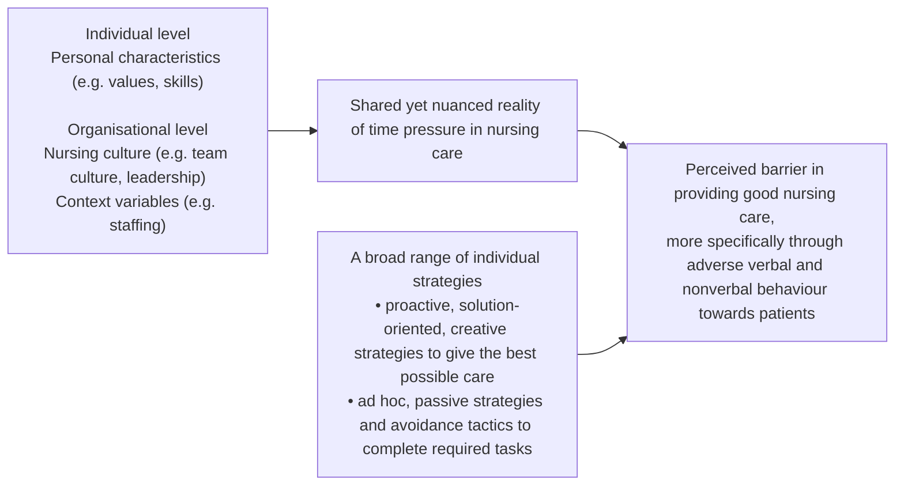

## Document page 1

International Journal of Nursing Studies 87 (2018) 60-68

Comprendre la complexité du travail sous pression dans le domaine des soins infirmiers en oncologie : une étude fondée sur la théorie

Marie-Astrid Vinckxa , Inge Bossuytb , Bernadette Dierckx de Casterléc,⁎

a Département des sciences infirmières de l' , Université des sciences appliquées Thomas More, Malines, Belgique

b Équipe de soutien hospitalier en soins palliatifs , Hôpitaux universitaires de Louvain, Louvain, Belgique c Département de santé publique et de soins primaires, Centre universitaire de soins infirmiers et obstétriques, KU Leuven, Louvain, Belgique

I N F O R M A T I O N S S U R L ' A R T I C L E

Mots-clés Soins contre le cancer Théorie fondée Interaction infirmière-patient Soins infirmiers Soins infirmiers en oncologie Recherche qualitative Qualité des soins Contrainte de temps

R É S U M É

Contexte : La pénurie internationale d'infirmières a des répercussions sur la qualité et la sécurité des soins prodigués aux patients. Diverses études indiquent que les infirmières n'ont pas le temps d'accomplir toutes les tâches nécessaires en matière de soins infirmiers, ce qui peut entraîner une pression temporelle perçue par les infirmières. Dans le contexte actuel, prodiguer des soins de qualité représente souvent un véritable défi éthique pour les infirmières. La manière dont les infirmières vivent la prise en charge des patients atteints de cancer sous la pression du temps et dont elles gèrent le temps limité dont elles disposent pour exercer leur profession de manière éthique reste floue. Objectifs : Présenter une recherche qualitative fondée sur les expériences des infirmières en oncologie en matière de pression temporelle, son impact perçu sur les soins infirmiers et la manière dont elles y font face. Conception : Une étude qualitative fondée sur une approche théorique a été menée afin d'explorer et d'expliquer les expériences des infirmières en oncologie en matière de pression temporelle et la dynamique sous-jacente. Cadre et participants : un échantillonnage raisonné et théorique a permis d'inclure 14 infirmières présentant des caractéristiques diverses, issues de cinq services d'oncologie hospitaliers d'un hôpital universitaire. Méthodes : Des entretiens individuels semi-structurés et approfondis ont été menés sur une période de six mois en 2015 et

2016. La collecte et l'analyse des données ont eu lieu simultanément. Les données issues des entretiens ont été analysées à l'aide du guide d'analyse qualitative de Louvain et du logiciel NVivo. Résultats : Le phénomène conceptualisé de la pression temporelle, fondé sur des données empiriques, a mis en lumière sa complexité et nous a aidés à expliquer et à décrire ce que ressentent les infirmières lorsqu'elles travaillent sous la pression du temps. Les infirmières interrogées ont décrit la pression temporelle comme une réalité partagée mais nuancée. Nous avons découvert que les infirmières géraient la pression temporelle de différentes manières, en recourant à un large éventail de stratégies proactives et « ad hoc ». Selon les personnes interrogées, la pression temporelle constituait un obstacle important à la fourniture de soins infirmiers de qualité. Elles ont illustré comment la pression temporelle affectait particulièrement les aspects interactionnels des soins, que la plupart des infirmières considéraient comme essentiels dans un contexte oncologique. Des facteurs personnels, culturels et contextuels sous-jacents semblaient jouer un rôle clé dans les expériences individuelles des infirmières en matière de pression temporelle. Conclusion : La pression temporelle est un phénomène largement reconnu et vécu par les infirmières, qui a des répercussions négatives importantes sur la qualité et la sécurité des soins prodigués aux patients. Nos conclusions renforcent la nécessité de mettre en place un meilleur soutien pour les infirmières et de réduire les situations dans lesquelles elles sont confrontées à des dilemmes éthiques pour fournir des soins de qualité en raison de la pression temporelle. Sur la base de nos conclusions, nous recommandons d'investir davantage dans la culture infirmière et le développement personnel des infirmières, en plus d'optimiser les effectifs infirmiers.

Que sait-on déjà sur le sujet ?

La pénurie d'infirmières a des implications importantes sur la qualité et la sécurité des soins prodigués aux patients. La pression temporelle est un facteur explicatif possible des soins infirmiers manqués, qui semblent courants en milieu clinique et sont associés

à une baisse de la satisfaction des patients et à des variations dans la qualité des soins. Les recherches existantes sur ce que la pression du temps signifie pour les infirmières et sur la manière dont elles y font face, en particulier sur la façon dont elles perçoivent les conséquences de la pression du temps dans les soins oncologiques, sont rares.

⁎ Auteur correspondant : Département de santé publique et de soins primaires, Centre universitaire de soins infirmiers et obstétriques, Kapucijnenvoer 35 blok d - bus 7001, Louvain B-3000, Belgique.

Adresse électronique :bernadette.dierckxdecasterle@kuleuven.be (B. Dierckx de Casterlé).

https://doi.org/10.1016/j.ijnurstu.2018.07.010 Reçu le 24 janvier 2018 ; reçu sous forme révisée le 15 juin 2018 ; accepté le 13 juillet 2018 0020-7489/©2018ElsevierLtd.Tous droits réservés.

Liste des contenus disponible sur ScienceDirect

International Journal of Nursing Studies

Page d'accueil de la revue : www.elsevier.com/locate/ijns

•

•

•

Abonnez-vous à DeepL Pro pour traduire des fichiers plus volumineux. Visitez www.DeepL.com/pro pour en savoir plus.

**Additional extracted image(s) from this page:**

## Document page 2

M.-A. Vinckx et al.

61

International Journal of Nursing Studies 87 (2018) 60-68

Ce que cet article apporte

L'expérience de la pression temporelle dans les soins infirmiers en oncologie est une réalité partagée mais nuancée, avec des différences individuelles entre les infirmières, ce qui souligne la complexité de ce phénomène. La manière dont les infirmières parviennent à prodiguer des soins de qualité à une population de patients vulnérables dans des circonstances difficiles peut s'expliquer par des facteurs individuels et organisationnels. La pression du temps est perçue comme un obstacle à la prestation de soins de haute qualité aux patients atteints de cancer, plus précisément à travers des comportements verbaux et non verbaux négatifs envers les patients.

1. Contexte

Le système de santé international est confronté à une pénurie de personnel infirmier, car la demande en infirmières continue d'augmenter en raison du vieillissement de la population et du fardeau croissant des maladies complexes et chroniques. Cette crise de main-d'œuvre reflète non seulement la pénurie actuelle, mais aussi future d'infirmières diplômées dans la plupart des pays européens et dans le monde entier (Eurohealth, 2016 ; OCDE, 2016 ; OMS, 2013, 2016).

La pénurie de personnel infirmier a des répercussions importantes sur la qualité et la sécurité des soins prodigués aux patients (par exemple, Aiken et al.,

2017). Un nombre croissant d'études ont montré qu'une charge de travail élevée

et un niveau de dotation en personnel infirmier insuffisant peuvent avoir des effets négatifs sur les résultats et l'expérience des patients (par exemple, Aiken et

al., 2002, 2011, 2014, 2017 ; Cho et al., 2016, 2017 ; Kane et al., 2007 ;

Needleman et al., 2011). L'un des principaux facteurs hypothétiques de l'association entre les effectifs infirmiers et l'expérience des patients est le «

manque de soins » ou les « soins non prodigués », définis comme les soins nécessaires que les infirmières n'ont pas pu prodiguer par manque de temps. De

nombreuses études ont montré que les activités les plus fréquemment signalées comme manquantes par les infirmières concernent la prise en charge des besoins psychosociaux et émotionnels des patients (par exemple, Ausserhofer et al., 2014

; Ball et al., 2014, 2016, 2018 ; Cho et al., 2017 ; DeCola et Riggins, 2010 ; Jones et al., 2015 ; Kalisch et al., 2009, 2011 ; West et al., 2005). Outre la charge

de travail et la dotation en personnel infirmier adéquate (Teng et al., 2010b), ces résultats suggèrent que les conditions de travail des infirmières, en particulier les

contraintes de temps, peuvent avoir une incidence sur la manière dont elles dispensent les soins infirmiers. Des études quantitatives antérieures contribuent à

démontrer que les infirmières ont le sentiment de manquer de temps pour accomplir les tâches requises et que cela peut avoir des répercussions sur les soins prodigués aux patients (par exemple, Teng et al., 2010a,b ; Thompson et al., 2008 ; Yang et al., 2014). La pression du temps est plus qu'un simple manque

de temps mesurable, et les études qualitatives approfondies qui ont exploré les

expériences subjectives des infirmières en matière de pression du temps sont rares (Jones, 2010). En 2001, Bowers et al. ont mis en évidence l'importance du temps pour les soins infirmiers dans les établissements de soins de longue durée.

Ils ont décrit comment les infirmières ont développé des stratégies pour compenser le manque de temps, mais avec des conséquences négatives possibles

pour les infirmières et les patients. Par exemple, les infirmières accordaient la

plus haute priorité aux tâches requises ayant des effets immédiats et visibles, tandis que les soins émotionnels étaient souvent relégués au second plan (Bowers

et al., 2001). D'autres études qualitatives ont également exploré la manière dont

les infirmières s'acquittaient de leurs tâches lorsqu'elles ne disposaient pas de suffisamment de temps. Ces études (Chan et al., 2013 ; Waterworth, 2003) ont

montré que la routinisation du travail infirmier pouvait réduire la pression temporelle perçue par les infirmières, mais que cela pouvait également conduire à négliger temporairement les besoins individuels des patients. En conséquence,

le désir des infirmières d'exercer leur profession conformément à leurs valeurs personnelles se heurte souvent à des difficultés, en particulier lorsque ces valeurs

sont limitées par la pression temporelle (Bentzen et al., 2013).

L'objectif initial des études qualitatives susmentionnées était d'explorer les expériences des infirmières en matière de temps et les stratégies qu'elles utilisent pour le gérer. Aucune étude antérieure n'avait exploré ce que signifie réellement pour les infirmières de travailler sous la pression du temps dans le contexte de l'oncologie. Fournir de bons soins infirmiers sous la pression du temps peut être encore plus difficile lorsqu'il s'agit d'une population de patients vulnérables (Izumi et al., 2010 ; Udo et al., 2013). Le cancer est une cause majeure de décès dans le monde entier qui peut provoquer une détresse émotionnelle et rendre les patients plus vulnérables en raison de son diagnostic, de son traitement et de son pronostic. La vulnérabilité de cette population de patients

souligne l'importance d'une approche infirmière holistique, individualisée et centrée sur l'humain, ce qui peut être perçu comme particulièrement difficile pour les infirmières en oncologie travaillant sous la pression du temps. Cette étude est la première à viser à mettre en lumière les expériences des infirmières en oncologie en matière de pression du temps, ses conséquences potentielles sur les soins infirmiers et la manière dont les infirmières y font face.

2. Méthodes

2.1. Conception de l'étude

Une conception qualitative avec une approche fondée sur la théorie (Corbin et Strauss, 2015) a été suivie afin d'explorer et d'expliquer théoriquement les expériences des infirmières face au phénomène de la pression temporelle et à sa dynamique sous-jacente dans les soins oncologiques (Polit et Beck, 2012).

2.2. Échantillon

L'étude a été menée dans un hôpital universitaire en Flandre, en Belgique. Nous avons d'abord utilisé un échantillonnage raisonné pour recruter les premiers participants. Nous avons ensuite procédé à un échantillonnage théorique (Corbin et Strauss, 2015) afin de sélectionner des participants présentant des caractéristiques et des expériences variées en fonction des résultats émergents. Les critères d'inclusion étaient les suivants (1) un diplôme d'associé ou de licence en soins infirmiers, (2) une implication dans les soins directs aux patients dans les services sélectionnés, (3) un statut d'emploi d'au moins 50 % et (4) au moins six mois d'expérience dans le service actuel afin de minimiser le risque de biais lié à une première expérience professionnelle.

Les participants ont été recrutés avec la collaboration du directeur des soins infirmiers et de l'infirmière responsable du service d'oncologie de l'hôpital. Au total, cinq services infirmiers spécialisés dans différentes branches des soins oncologiques ont été inclus. Nous avons d'abord recruté des participants dans trois services infirmiers. Après le recrutement initial, nos données ont indiqué que nous devions recruter des infirmières de deux autres services accueillant d'autres types de patients atteints de cancer afin d'élargir notre échantillon. Cela a contribué à une diversité adéquate des participants (tableau 1), nous permettant ainsi de fournir une compréhension globale du phénomène et des facteurs sousjacents (Corbin et Strauss, 2015 ; Polit et Beck, 2012). Les infirmières en chef ont été contactées par e-mail afin de leur expliquer l'objectif de l'étude et ses attentes, et d'obtenir leur autorisation. Les informations relatives à l'étude ont été fournies aux participants par le premier auteur lors de présentations en face à face, à l'aide d'affiches placées dans les services de soins infirmiers et d'une fiche d'information. Afin de faciliter le processus d'échantillonnage et d'identifier les participants potentiels, nous avons élaboré un questionnaire court et standardisé qui a été distribué aux infirmières intéressées. Ce questionnaire portait sur des données démographiques et contenait des déclarations sur la charge de travail et la pression du temps, ainsi que le choix de participer ou non à un entretien. Chaque questionnaire a été renvoyé dans une enveloppe scellée déposée dans une boîte prévue à cet effet dans le service de soins infirmiers. Les réponses au questionnaire sont présentées dans le tableau 1.

L'échantillon final était composé de 14 infirmières issues de cinq services hospitaliers qui dispensent des soins oncologiques à des patients adultes atteints de divers types de cancer (à savoir deux services d'oncologie médicale générale, dont l'un est spécialisé en radiothérapie, un service d'hématologie, un service d'oncologie gynécologique et de chirurgie et un service dédié aux maladies pulmonaires oncologiques). La grande majorité des participants étaient des infirmières âgées de 20 à 39 ans. Des infirmières ayant moins de trois ans d'expérience, de nombreuses années d'expérience (11+) et une expérience intermédiaire ont été incluses. Onze participants étaient titulaires d'une licence en soins infirmiers et d'un titre professionnel en soins infirmiers oncologiques, dont dix avaient une licence avancée en oncologie. Ce dernier nécessite une formation d'un an pour se spécialiser en soins infirmiers en oncologie (FPS Health, 2016). Deux participantes avaient obtenu une maîtrise, dont une en soins infirmiers. La moitié des infirmières incluses travaillaient à temps plein ; les autres travaillaient à temps partiel parce qu'elles cumulaient cet emploi avec un autre poste ou parce qu'elles souhaitaient passer plus de temps avec leur famille ou poursuivre leurs études.

Les réponses des infirmières au questionnaire ont indiqué qu'elles percevaient souvent une charge de travail élevée dans leur service. De nombreuses infirmières

•

•

•

## Document page 3

M.-A. Vinckx et al.

62

International Journal of Nursing Studies 87 (2018) 60-68

Tableau 1 Données démographiques et caractéristiques des participants (n = 14).

Élément Réponse n

Sexe Masculin 2 F 12 Âge 20-29 5 30-39 5 40-49 2 50 2 Formation Diplôme universitaire de premier cycle 3 Licence 11 Titre professionnel en oncologie 11 Maîtrise 2 Service de soins infirmiers Oncologie médicale générale A 3 Oncologie médicale générale B 3 Hématologie 3

de Casterlé et al., 2012). La méthode comprend deux parties, chacune comportant cinq étapes, qui nous guident à travers un processus cyclique et simultané de collecte et d'analyse des données. La première partie nécessite une préparation minutieuse du travail de codage, ou « un premier examen des données afin de déterminer ce qu'il convient d'y rechercher » (Sandelowski, 1995, p. 371). Chaque entretien a été transcrit mot pour mot par l'enquêteur et les transcriptions ont été (re)lues par l'équipe de recherche afin de mieux comprendre chaque entretien individuel. Cette étape a été suivie de la rédaction de schémas conceptuels des entretiens individuels à des fins de comparaison. Le processus de comparaison constante a permis d'identifier des thèmes communs au sein des entretiens et entre eux. Une liste de concepts a été rédigée, qui a été utilisée pour le processus de codage proprement dit dans la deuxième partie du QUAGOL. Ce n'est que dans cette partie de la méthode que nous avons utilisé un logiciel d'analyse de données qualitatives, QSR NVivo 11, pour coder les entretiens. données et relier les passages importants. L'analyse approfondie des Chirurgie gynécologique oncologique/ chirurgie

3 a permis une conceptualisation significative du phénomène.

Oncologie respiratoire 2 Expérience en soins infirmiers (années) 1-2 5 3-5 3 6 à 10 3 11-20 1 20 2 Situation professionnelle À temps plein 7 Temps partiel (≥50 %) 7

de pression temporelle en réponse à la question de recherche.

Les points forts du QUAGOL résident dans ses principes fondamentaux : il se caractérise par une approche axée sur les cas, avec un équilibre constant entre l'analyse intra-cas et inter-cas, une dynamique avant-arrière utilisant la méthode comparative constante et l'utilisation de différentes approches analytiques (c'està-dire combinant une approche holistique et créative avec une approche empirique classique telle que l'analyse thématique). Le guide

Je subis une charge de travail importante

dans mon service de soins infirmiers.

Je subis une pression temporelle dans mes

propres soins infirmiers.

La pression du temps a un impact sur les

soins infirmiers.

Jamais 0 Parfois 5 Souvent 9 Toujours 0 Jamais 0 Parfois 7 Souvent 7 Toujours 0 Jamais 0 Parfois 5 Souvent 7 Toujours 2

encourage fortement une approche d'équipe. Une préparation minutieuse et approfondie du processus de codage, plutôt qu'un codage ligne par ligne, permet de produire des idées et des concepts significatifs sur le plan analytique et contextuel, aidant ainsi les chercheurs à saisir l'essence du phénomène étudié (Dierckx de Casterlé et al., 2012).

2.5. Fiabilité

Plusieurs stratégies ont été utilisées pour garantir la fiabilité de nos résultats (Polit et Beck, 2012). Nous avons assuré la crédibilité en créant une piste d'audit (par exemple, transcriptions d'entretiens, notes de service et comptes rendus de réunions) ; en

ressentir plus ou moins fréquemment une pression temporelle dans le cadre de leurs soins infirmiers. D'après le questionnaire, les infirmières ont également indiqué que l'impact de la pression temporelle sur les soins infirmiers était souvent à toujours tangible. Au cours des entretiens, nous avons approfondi la signification de ces expériences pour les infirmières.

2.3. Collecte des données

Des entretiens individuels semi-structurés et approfondis ont été menés auprès de 14 infirmières entre décembre 2015 et mai 2016, dans une salle privée et calme du service de soins infirmiers ou de l'hôpital, selon le choix des participantes. Chaque entretien individuel en face à face a duré environ une heure et a été planifié pendant, juste avant ou après le service de l'infirmière, à l'exception de deux entretiens qui ont eu lieu en dehors des jours de travail des participantes. Une revue exploratoire et deux entretiens pilotes ont guidé l'élaboration d'un guide thématique et d'un guide d'entretien, qui ont été affinés au cours du processus de recherche en fonction des données émergentes. Les entretiens ont commencé par un examen détaillé des réponses données au questionnaire, et des techniques d'exploration ont été utilisées pour obtenir des informations plus approfondies (Polit et Beck, 2012). La première question ouverte posée aux participants consistait à leur demander de décrire une situation récente dans laquelle ils avaient subi une pression temporelle et d'illustrer comment ils avaient géré cette pression dans cette situation. Tous les entretiens ont été réalisés, enregistrés et transcrits mot à mot par le premier auteur. Un participant a demandé à pouvoir lire la transcription, mais n'y a apporté aucune modification.

2.4. Analyse des données

Le processus d'analyse des données s'est appuyé sur le guide d'analyse qualitative de Louvain (QUAGOL), complet et fondé sur la théorie et la pratique, qui s'inspire de l'approche de la théorie ancrée (Dierckx

documenter le contexte de la recherche (par exemple, notes de terrain) et le processus d'analyse des données à l'aide d'une description dense (par exemple, ajout de citations pertinentes pour illustrer les concepts générés) ; en triangulant la collecte de données afin d'obtenir une variété maximale de participants à différents moments ; en vérifiant auprès des membres pendant les entretiens en résumant les principales réponses des participants à la question de recherche à la fin de l'entretien. Cette dernière méthode nous a permis de vérifier les réactions immédiates des personnes interrogées et de les encourager à fournir des commentaires critiques sur l'interprétation de leur histoire par l'enquêteur. La collecte et l'analyse des données se sont poursuivies selon un processus cyclique jusqu'à ce que la saturation des résultats principaux soit atteinte. L'équipe de recherche a fréquemment discuté des résultats afin d'établir une uniformité dans l'interprétation et a exploré la réflexivité de l'intervieweur au cours de ces réunions. Trois ans avant l'étude, la première auteure était stagiaire en soins infirmiers dans un service d'oncologie ; afin d'éviter tout biais, son service n'a pas été inclus dans l'échantillon.

Nous avons organisé deux réunions formelles entre pairs en avril et juillet 2016 avec un panel d'experts en soins oncologiques, gestion des soins infirmiers et éthique, psychologie et recherche qualitative afin de discuter des résultats préliminaires. Au total, 10 experts ont participé au processus de débriefing entre pairs, sept et cinq respectivement lors de chaque session. Ces réunions ont contribué à une compréhension plus nuancée et à une interprétation uniforme du phénomène étudié. En novembre 2016, nous avons discuté des résultats lors d'une réunion avec les infirmières en chef des services de soins infirmiers en oncologie de l'hôpital universitaire où l'étude a été menée. Cela a donné lieu à des commentaires importants, étant donné que nos conclusions ont été généralement reconnues.

2.6. Considérations éthiques

Le comité d'éthique des hôpitaux universitaires de Louvain (référence mp08239) a approuvé l'étude en décembre 2015. Tous les participants ont donné leur consentement éclairé par écrit et des mesures ont été prises pour garantir la

## Document page 4

M.-A. Vinckx et al.

63

International Journal of Nursing Studies 87 (2018) 60-68

confidentialité des données. L'enquêteur était le seul à avoir accès à l'identité des participants. La participation était volontaire.

3. Résultats

Les infirmières en oncologie interrogées ont déclaré ressentir une pression temporelle commune, mais nuancée, dans leur pratique quotidienne. La perception qu'elles ont de cette pression, ses effets sur les soins infirmiers et leurs stratégies pour y faire face varient, comme en témoignent les différents mots et émotions utilisés pour décrire leur expérience. Nous avons mis en évidence un large éventail de stratégies utilisées par les infirmières pour travailler sous pression. Les principales stratégies utilisées diffèrent de leur perception initiale de la pression temporelle. Certaines infirmières ont déclaré qu'elles trouvaient des solutions créatives et proactives pour planifier et organiser leurs soins infirmiers de la meilleure façon possible malgré les contraintes de temps. D'autres ont déclaré se sentir parfois tellement dépassées qu'elles utilisaient des approches ad hoc et moins organisées pour accomplir leur travail sous la pression du temps. Les personnes interrogées ont décrit l'impact de la pression du temps sur les soins infirmiers comme un obstacle à la prise en charge des patients vulnérables. La plupart des infirmières ont déclaré que la pression du temps entraînait par la suite un sentiment d'échec dans la prestation de soins infirmiers de qualité. Ces infirmières ont également souligné qu'elles considéraient l'interaction avec les patients et la réponse à leurs besoins psychosociaux et émotionnels comme essentielles dans les soins infirmiers en oncologie. Cependant, le fait de travailler sous la pression du temps a mis à rude épreuve ces interactions avec les patients. Les infirmières ont expliqué cela par le fait d'éviter ou de reporter la communication et d'éviter le contact visuel avec les patients. Nous avons identifié trois facteurs sous-jacents qui expliquaient les différences dans la perception de la pression temporelle par les infirmières. Au niveau individuel, les caractéristiques individuelles des infirmières (par exemple, leurs croyances et leurs valeurs) pouvaient influencer leurs priorités lorsqu'elles étaient soumises à la pression temporelle. Au niveau organisationnel, nous avons constaté que la culture infirmière, telle que la culture d'équipe et le style de leadership de l'infirmière en chef, ainsi que des facteurs contextuels (par exemple, un personnel infirmier insuffisant, l'accumulation d'événements graves) influençaient également l'expérience des infirmières.

Ces résultats illustrent et soulignent la complexité du travail des infirmières soumises à des contraintes de temps dans un environnement clinique oncologique. Une description schématique des résultats est présentée ci-dessous (Fig. 1). Cette figure illustre comment les facteurs sous-jacents influencent les expériences des infirmières et, par conséquent, leur perception de l'impact des contraintes de temps sur les soins infirmiers et leurs stratégies pour y faire face.

3.1. Une réalité partagée mais nuancée

Tout au long de l'exploration des expériences des infirmières, la pression du temps est apparue comme une réalité commune dans la prestation de soins aux patients atteints de cancer. Cependant, les infirmières ont exprimé leurs expériences de différentes manières, soulignant les nuances de cette réalité complexe. Par exemple, certaines infirmières ont décrit la pression du temps comme un manque de temps mesurable, tandis que d'autres l'ont décrite comme un sentiment d'être débordées et pressées de terminer tout leur travail à temps.

« Quand on est débordé, on a l'impression de n'avoir rien fait ou d'avoir fait cent une choses et que soudain, le temps est écoulé. » (participant 2)

Les infirmières ne percevaient pas toujours la pression du temps comme présente. Cependant, les périodes calmes étaient plutôt rares, et la plupart des infirmières ont ressenti une pression du temps à un moment ou à un autre au cours de leurs gardes ou séries de gardes. Le fait de percevoir une pression du temps prolongée renforçait également le sentiment de pression persistante et dominante ressenti par les infirmières.

Des variations ont également été observées dans l'intensité de la pression temporelle décrite. La pression jugée acceptable par les infirmières était décrite comme une pression positive les incitant à prodiguer des soins de manière plus productive. Lorsque la pression temporelle était perçue comme plus intense, les infirmières l'associaient à des sentiments négatifs et à de la frustration. Ces sentiments étaient liés à des situations où elles estimaient ne pas disposer de suffisamment de temps pour prodiguer les soins qu'elles jugeaient importants. Pour certaines infirmières, les effets des contraintes de temps sévères ne se limitaient pas seulement aux heures de travail, mais s'étendaient également à leur vie personnelle.

« J'ai de plus en plus de problèmes avec la pression du temps. Je commence à remarquer que je rentre chez moi vraiment malheureux. Avant, je rentrais chez moi satisfait, mais ce n'est plus le cas aujourd'hui. Cela dure depuis des mois. Et bientôt, je vais aussi commencer à en rêver. » (participant 8)

3.2. Un large éventail de stratégies individuelles

Les réactions des infirmières face aux situations de pression temporelle variaient considérablement, et la manière dont elles réagissaient au manque de temps dépendait de l'intensité perçue de la pression temporelle et de leurs stratégies personnelles pour y faire face.

3.2.1. Stratégies proactives

Les infirmières qui faisaient face à la pression du temps de manière plus proactive cherchaient des solutions créatives pour travailler aussi efficacement et adéquatement que possible. Ces infirmières semblaient plus conscientes de la manière dont elles voulaient fournir de bons soins sous la pression du temps. L'exemple suivant montre comment cette infirmière a combiné le bain au lit et la conversation avec un patient.

« Si je dois donner un bain à quelqu'un dans son lit ou même dans la salle de bain, je discute avec le patient et je sens immédiatement si les gens veulent continuer à parler ou s'ils bloquent [la conversation]. On le sent toujours, et je considère que c'est le moment idéal, quand on lave quelqu'un, pour prendre un moment... C'est un moment où l'on a le temps de parler avec son patient, car on est de toute façon occupé. » (participant 11)

Fixer des priorités, planifier et organiser les soins, demander de l'aide au sein de l'équipe, signaler certaines situations et déléguer à d'autres professionnels de l'équipe sont quelques exemples de stratégies actives rapportées par les infirmières.

« [Concernant la définition des priorités] je me fie à mon intuition et j'évalue quel patient a le plus besoin d'aide à un moment donné, mais je pense que cela se fait généralement de manière automatique. Je ne me dis pas consciemment « aujourd'hui, je vais parler à telle personne », mais je m'occupe ensuite rigoureusement de mes soins, même si j'essaie d'évaluer la situation et que la planification des soins est vraiment importante. Et en termes de

Fig. 1. Conceptualisation empirique du travail sous pression dans le domaine des soins infirmiers en oncologie.

## Document page 5

M.-A. Vinckx et al.

64

International Journal of Nursing Studies 87 (2018) 60-68

conversations, je pense qu'il faut tenir compte du fait que cette personne traverse une période difficile et que je vais rester un peu plus longtemps à ses côtés. » (participant 6)

En général, les infirmières ont principalement exprimé la priorité absolue accordée aux soins physiques visibles, comme le montre la citation suivante :

« Je pense que mes priorités sont différentes [sous la pression du temps], je m'assure d'abord de prodiguer tous les soins fonctionnels, non pas que je veuille dire que les soins psychosociaux ne sont pas fonctionnels, mais simplement que je m'occupe d'abord des aspects techniques, comme les prélèvements sanguins, les soins d'hygiène... » (participant 1)

À moins qu'ils ne considèrent que répondre aux besoins psychosociaux et émotionnels des patients était plus urgent ou essentiel. Un autre exemple de stratégie active consistait à planifier et à organiser les soins à l'avance, ce qui permettait aux infirmières de prendre le contrôle de leur planification des soins et de fournir tous les soins en temps opportun. Une organisation efficace des soins était considérée comme une compétence infirmière importante, même en l'absence de contraintes de temps. Cependant, lorsque des situations aiguës et des événements imprévus (par exemple, une détérioration rapide de l'état d'un patient) se produisaient, la planification des soins par les infirmières était retardée. En conséquence, les personnes interrogées devaient réorganiser leurs soins pour accomplir leur travail, ce qu'une infirmière a décrit comme « essayer d'assembler les pièces d'un puzzle ».

« [À propos des discussions avec les patients] C'est possible, mais parfois difficile... Ce n'est pas que nous n'avons pas de temps à consacrer à nos patients, mais parfois, c'est vraiment comme essayer d'assembler les pièces d'un puzzle pour pouvoir terminer le reste de notre travail. » (participant 6)

Une autre approche consistait à orienter les cas vers d'autres professionnels de l'équipe (par exemple, contacter un psychologue), ce qui était considéré comme utile lorsque les infirmières étaient limitées en temps et ne pouvaient pas répondre pleinement aux besoins psychosociaux des patients, ou si le patient avait besoin d'un cadre plus professionnel. Cette stratégie était perçue comme permettant de consacrer plus de temps à d'autres activités infirmières.

Les infirmières ont déclaré qu'il était utile de communiquer ouvertement et activement avec les patients et les membres de l'équipe au sujet des contraintes de temps lorsqu'elles ne disposaient pas de suffisamment de temps pour avoir des conversations plus approfondies, répondre aux questions et fournir des soins en temps opportun. Identifier explicitement le problème des contraintes de temps dans le travail des infirmières et la manière de répondre aux besoins des patients a été décrit comme une stratégie de travail à long terme. Déléguer des tâches à des collègues et à des étudiants en soins infirmiers était considéré comme utile si l'infirmier en oncologie pouvait encore garder une vue d'ensemble sur ses patients tout en supervisant les étudiants.

Certaines infirmières ont décrit une façon de gérer et de réduire la pression du temps en essayant de trouver un équilibre avec le temps. Grâce à cette stratégie, les infirmières ont abordé le processus de soins sur une période prolongée au lieu de le considérer comme une situation tout ou rien. De cette manière, elles se sentaient moins pressées par le temps et cherchaient des moyens de créer du temps et de l'espace pour les soins. À titre d'exemple, si les infirmières n'avaient pas assez de temps pendant leur service pour avoir des conversations plus approfondies avec les patients, elles répondaient à leurs besoins lors d'un autre service moins chargé dans un avenir proche.

3.2.2. Stratégies ponctuelles

Les infirmières faisaient face aux défis liés à la pression du temps de manière plus passive, en adoptant des approches ponctuelles ou en évitant certaines situations lorsqu'elles estimaient devoir subir une pression temporelle dans des moments difficiles. Cela signifiait qu'en réponse à la pression du temps, elles abordaient les tâches de manière plus ponctuelle afin de les terminer, au lieu d'organiser les meilleurs soins possibles ou de réfléchir à plus long terme. Les infirmières ont également décrit comment elles évitaient d'engager des discussions approfondies avec les patients ou limitaient les soins aux seuls aspects physiques nécessaires, tels que le soin des plaies, les prises de sang et l'administration de médicaments.

D'autres stratégies consistaient à retarder considérablement les soins ou à essayer d'accomplir toutes les tâches infirmières en augmentant le rythme de travail et en faisant des heures supplémentaires. Les infirmières considéraient qu'il était acceptable de travailler plus vite et de rester plus longtemps pour accomplir les soins infirmiers nécessaires, mais cela n'était pas souhaitable et les infirmières ne considéraient pas cela comme une stratégie pour fournir des soins.

de bons soins. Il arrivait également fréquemment que les infirmières sautent leur pause déjeuner.

Les infirmières suivaient également une méthode de travail plus fixe et routinière pour accomplir leurs tâches, ce qui les aidait à faire face à la pression du temps, mais elles ont déclaré que cela se traduisait par des soins moins individualisés et moins centrés sur le patient.

« Il faut juste continuer, ne pas réfléchir et passer d'une tâche à l'autre. Hier, j'étais également très occupée de mon côté, et il y a eu une admission, et je venais juste d'entrer dans la chambre : tout va bien, douleur, et je reviens plus tard, mais je m'assure d'abord que tout le reste a été fait avant de prendre le temps d'organiser tout ce qu'il y a là [dans cette chambre] (...) » (participante 3)

Lorsqu'il n'était toujours pas possible de tout terminer, le fait de transmettre des tâches à un collègue de l'équipe suivante était accepté, bien que considéré comme négatif car cela augmentait la charge de travail d'une autre infirmière.

3.3. Impact perçu de la pression temporelle sur les soins infirmiers

Les infirmières interrogées percevaient la pression du temps comme un obstacle à la prestation de soins de qualité à une population de patients vulnérables. En général, les infirmières ont déclaré vouloir prodiguer des soins holistiques aux patients et ont expliqué en quoi la pression du temps les empêchait d'y parvenir. En conséquence, les infirmières avaient souvent le sentiment de ne pas être à la hauteur, non seulement par rapport à leurs propres normes de soins, mais aussi par rapport aux attentes des patients et des autres infirmières, telles qu'elles les percevaient. Les réponses tardives aux besoins des patients ou les tâches infirmières inachevées illustraient à quel point l'impact de la pression du temps était tangible pour les infirmières. Pour la plupart d'entre elles, ne pas terminer les soins signifiait qu'elles fournissaient des soins physiques, mais qu'elles manquaient de temps pour prodiguer des soins holistiques.

L'un des résultats les plus frappants concernant l'impact perçu par les infirmières était que la pression du temps avait un effet négatif sur leur communication verbale et non verbale avec les patients. Toutes les personnes interrogées ont déclaré qu'elles manquaient souvent de temps pour avoir des conversations plus approfondies avec les patients et qu'elles évitaient souvent d'explorer activement leurs sentiments. Certaines infirmières ont expliqué qu'elles disaient explicitement aux patients qu'elles devaient reporter les conversations à un moment moins chargé de leur service. Elles ont toutefois souligné qu'il était important de reprendre ces conversations, sinon elles risquaient de nuire à la confiance des patients. Les infirmières ont également illustré à l'aide de nombreux exemples comment la pression du temps les amenait à envoyer des signaux non verbaux indiquant qu'elles n'avaient pas assez de temps. Elles ont déclaré que les soins étaient prodigués aux patients de manière précipitée, qu'elles s'éloignaient déjà des patients alors qu'ils parlaient encore et qu'elles établissaient moins de contact visuel avec eux. Ces tactiques étaient utilisées pour éviter de créer des occasions de conversation qui prendraient du temps et qui seraient plus difficiles à interrompre une fois qu'elles auraient commencé à parler. Ces expériences contrastaient avec ce que les infirmières considéraient comme important dans les soins prodigués à ce type de patients, et les personnes interrogées ont associé cela à des difficultés à établir un lien de confiance avec les patients. Les infirmières ont fait part de leurs inquiétudes quant au fait que les patients ne leur faisaient pas toujours part de leurs besoins parce qu'ils voyaient les infirmières agir dans la précipitation.

« Ensuite, vous faites la tournée du soir ou la tournée suivante, ils [les patients] doivent prendre leurs médicaments à l'heure prévue, puis ils disent : « En fait, ça fait déjà plusieurs heures que j'ai mal », et là, je me dis : « Pourquoi tu n'as pas appelé ? » Je trouve ça horrible quand ils disent : « J'ai vu que tu étais occupée et je me suis dit : elle finira bien par passer », et je ne trouve pas ça normal. Si tu as mal, tu dois prendre ou demander quelque chose. » (participant 8) « Nous entrons [dans la chambre], puis nous scannons [les médicaments] avec notre ordinateur et administrons les médicaments, tout en sachant que le patient essaie d'établir un contact visuel parce qu'il a quelque chose à demander, mais nous l'évitons. Alors que... ce n'est pas notre genre, nous sommes venus travailler ici parce que nous sommes ce genre de personnes [qui prennent le temps de répondre aux besoins des patients], un par un. » (participant 8)

Les infirmières ont donc décrit la pression du temps comme un obstacle à la qualité des soins, car elle les empêchait de détecter les problèmes psychosociaux, éducatifs et

## Document page 6

M.-A. Vinckx et al.

65

International Journal of Nursing Studies 87 (2018) 60-68

besoins médicaux, ce qui conduit à des besoins non satisfaits et peut-être non identifiés chez les patients. Ils ont indiqué lors des entretiens qu'il était plus difficile d'estimer le temps nécessaire pour répondre aux besoins psychosociaux et émotionnels des patients, ce qui les amenait à consacrer moins de temps à cette tâche. Les tâches ayant un impact plus immédiat ou plus visible étaient souvent prioritaires par rapport aux besoins psychosociaux lorsque les infirmières étaient pressées par le temps.

« J'ai l'impression que vous vous contentez de faire les choses pratiques et que vous avez terminé votre liste de contrôle parce que vous avez fait tout ce que vous deviez faire, les choses strictes, les choses que vous deviez vraiment faire, mais... le « plus », ce qui rend les choses « humaines », parfois j'ai l'impression que j'oublie cela et que je n'ai pas le temps ou que je n'y prête pas attention, alors que l'on remarque que les gens en ont vraiment besoin. Je trouve... que cela me procure un sentiment désagréable. On a alors l'impression, ou du moins j'ai l'impression, d'avoir failli à ma mission. » (participant 7)

L'impact sur les soins physiques a également été décrit en termes de sécurité des patients. Certaines infirmières ont déclaré ne pas avoir le temps de vérifier si elles administraient les bons médicaments, mais aussi d'informer suffisamment les patients sur leur traitement (par exemple, la chimiothérapie et ses effets secondaires). Certaines infirmières ont décrit leur sentiment d'insécurité quant à la sécurité des soins prodigués après une journée bien remplie.

3.4. Facteurs sous-jacents

Les exemples suivants illustrent la dynamique sous-jacente de la pression temporelle perçue par les infirmières.

3.4.1. Personnalité de l'infirmière

Les caractéristiques individuelles des infirmières, telles que leurs convictions, leurs valeurs et leurs compétences, sont des exemples de facteurs qui ont influencé leur perception de la pression temporelle. À titre d'illustration, leurs qualités personnelles ont façonné leurs convictions et leurs attentes en matière de soins infirmiers de qualité, puis leur perception des écarts par rapport aux soins prodigués sous la pression du temps. Pour certaines infirmières, cela signifiait qu'elles ne pouvaient pas fournir des soins à la hauteur de leurs propres valeurs. D'autres se sont demandé si ces intentions en matière de soins étaient conformes aux besoins des patients.

« Je trouve ça vraiment dommage qu'on ne puisse pas... faire un petit effort supplémentaire, même si le patient ne sait pas qu'il y a « plus » à faire, mais qu'on peut le faire pour soi-même aussi. Comme ça, on n'a pas à rentrer chez soi avec un mauvais sentiment de temps en temps. C'est parfois trop difficile. » (participant 4) « Ou alors, c'est une question d'intuition : je veux donner un petit plus aux [patients], mais c'est vous en tant qu'infirmière : « Je pense que je dois donner quelque chose », mais est-ce vraiment le cas... » (participant 5)

D'autres exemples concernaient les compétences interpersonnelles et organisationnelles des infirmières, leurs capacités d'adaptation et leur perception du contrôle nécessaire pour accomplir leurs soins infirmiers dans des délais serrés. Par exemple, les infirmières qui percevaient des facteurs échappant à leur contrôle semblaient plus susceptibles de ressentir une pression temporelle. Certaines infirmières attribuaient explicitement leurs stratégies d'adaptation à leurs années d'expérience en soins infirmiers.

3.4.2. Culture infirmière

Les différences d'expériences pourraient également s'expliquer par des différences dans la culture infirmière, en particulier si celle-ci était perçue par les infirmières comme facilitant ou entravant la prestation de soins de qualité. La culture d'équipe et le style de leadership de l'infirmière en chef sont des exemples cités par les infirmières pour illustrer l'influence de cette culture. Les infirmières ont fait référence aux règles administratives et sociales qui façonnaient leur environnement de travail. Dans chaque service, il existait des règles sociales écrites et non écrites qui imposaient un horaire et des règles organisationnelles concernant la planification des soins, telles que le moment d'administrer les médicaments ou de prodiguer les soins d'hygiène. Cela entraînait des pics de travail liés à l'horaire tout au long du quart de travail, ce qui influençait la pression temporelle perçue par les infirmières. En particulier pendant le quart du matin, les infirmières fixaient des délais pour accomplir certaines activités de soins.

« Pour moi, le service du matin est plus chargé, car je trouve que mes patients doivent être lavés avant 11 h 30 (...) Je trouve cela terrible s'il reste encore des soins à prodiguer aux plaies à 14 heures. » (participant 4)

Les infirmières ont expliqué comment la culture d'équipe pouvait les aider à gérer le stress lorsqu'elles travaillaient sous la pression du temps. Elles considéraient que le travail en équipe et une bonne communication au sein de celle-ci étaient essentiels pour accomplir leurs tâches plus efficacement et dans les délais, car elles se sentaient ainsi davantage soutenues pour prodiguer de bons soins infirmiers.

« Je ne ressens pas de stress aussi rapidement ici, mais c'est parce qu'il y a une bonne équipe derrière moi et que je sais que je peux toujours compter sur de l'aide si les choses ne se passent vraiment pas bien. » (participant 12)

Le style de leadership des infirmières en chef était également un exemple de ce qui influençait la culture infirmière dans le service. Certaines infirmières ont déclaré se sentir soutenues par leur infirmière en chef dans l'organisation de leurs soins infirmiers de manière éthique, tandis que d'autres se sentaient moins soutenues. Les infirmières ont expliqué que cela dépendait de la manière dont leur infirmière en chef soutenait le travail d'équipe, améliorait la communication au sein de l'équipe infirmière et avec les autres professionnels de santé, et réagissait aux pénuries de personnel. Ce dernier point était souvent cité comme une source de frustration pour les infirmières.

« Lorsque vous avez beaucoup de patients alités, vous ne pouvez pas tout faire seul, et généralement, l'infirmière en chef anticipe cela : elle vous demande constamment comment ça se passe avec l'équipe et quelle est la charge de travail, afin que vous puissiez obtenir de l'aide pour les soins d'hygiène (...) car parfois, vous n'arrivez pas à tout faire. » (participant 1)

3.4.3. Contexte

La perception qu'ont les infirmières de la pression temporelle était également influencée par des facteurs contextuels, c'est-à-dire des circonstances spécifiques qui intensifiaient cette pression. Les infirmières ont décrit comment le manque de personnel, qu'il soit dû à l'absence de collègues pour cause de maladie ou à des contraintes organisationnelles, entraînait une pression temporelle accrue. Selon les personnes interrogées, le manque de personnel, combiné à la complexité des cas traités, empêchait souvent les infirmières de fournir les soins dont les patients avaient besoin.

« Je sais que des collègues qui travaillent ici depuis bien plus longtemps disent qu'on remarque que la sécurité des patients ne s'améliore pas malgré tous les efforts déployés par l'hôpital, car il y a tout simplement moins de personnel et une charge de travail plus lourde. » (participant 6)

Les situations aiguës soudaines, en particulier lorsqu'elles se combinent à plusieurs événements survenant dans un court laps de temps, ont obligé les infirmières à réorganiser leurs soins afin de pouvoir accomplir tout leur travail. Les infirmières ont notamment évoqué la pression du temps dans les situations où elles étaient confrontées à des patients gravement malades ou mourants, ou au décès d'un patient. Elles ont raconté qu'elles manquaient de temps et d'espace pour soutenir ces patients et leurs proches, ce qu'elles percevaient comme contraire à leurs valeurs éthiques. Elles ont néanmoins décrit comment elles essayaient d'agir conformément à ces valeurs et à leurs intentions en matière de soins dans ce contexte, plutôt que de fournir des soins précipités. Cela a entraîné des retards ou des limitations dans les soins prodigués aux autres patients.

4. Discussion

Notre conception qualitative, fondée sur une approche de théorie ancrée, nous a permis d'explorer avec soin la complexité du phénomène étudié et de réfléchir à ce que signifie pour les infirmières de travailler sous la pression du temps. Cette complexité est illustrée par les infirmières interrogées qui ont exprimé, de différentes manières et avec des tons différents, leur expérience du travail sous la pression du temps dans le domaine des soins infirmiers en oncologie.

Les stratégies utilisées par les infirmières en oncologie pour faire face à la pression du temps recoupent en partie celles décrites dans les études sur les stratégies de gestion du temps des infirmières (Bowers et al., 2001 ; Waterworth, 2003). Waterworth (2003), par exemple, a décrit une série de stratégies directes et indirectes de gestion du temps, tandis que Bowers et al. (2001) ont suggéré que les infirmières compensaient le manque de temps en développant

## Document page 7

M.-A. Vinckx et al.

66

International Journal of Nursing Studies 87 (2018) 60-68

stratégies pour rester à niveau ou rattraper son retard. Notre étude renforce les connaissances antérieures sur les stratégies de gestion du temps et apporte de nouvelles perspectives en proposant deux approches principales pour gérer spécifiquement la pression du temps. Nous avons constaté que les infirmières développaient toute une série de stratégies, soit pour prodiguer les meilleurs soins possibles dans le temps limité dont elles disposaient, soit pour accomplir les tâches requises en recourant à des stratégies ad hoc et à des tactiques d'évitement lorsqu'elles se sentaient dépassées par la pression du temps. Certaines de ces stratégies semblaient toutefois avoir des conséquences négatives importantes sur la fourniture de soins infirmiers individualisés et de qualité. Ceci a également été illustré par Bowers et al. (2001), qui ont rapporté les efforts déployés par les infirmières pour accroître leur efficacité par la routinisation et la hiérarchisation des priorités lorsqu'elles étaient confrontées à une forte pression temporelle afin d'accomplir leurs tâches, au lieu de s'efforcer de fournir des soins infirmiers de haute qualité. Cependant, les preuves font encore défaut quant à l'efficacité de ces stratégies et aux conditions qui ont conduit les infirmières à employer différentes stratégies.

La présente étude révèle également des facteurs pouvant expliquer les causes des variations dans les expériences des infirmières confrontées à la pression du temps et à la manière dont elles y font face. Les différences individuelles et les facteurs organisationnels soulignent encore davantage la nature complexe du phénomène de la pression du temps. Il convient de noter en particulier le rôle de la culture infirmière, qui a également été abordé dans la littérature. Par exemple, en termes de culture d'équipe, le soutien des membres de l'équipe (c'est-à-dire le travail d'équipe), les attentes de l'équipe en matière de priorités et le fait de ne pas vouloir surcharger ses collègues sont autant d'exemples de facteurs culturels qui peuvent influencer la manière dont les infirmières travaillent pendant les périodes de forte activité (Chan et al., 2013 ; Waterworth, 2003). Cummings et al. (2010) ont également souligné dans leur étude le rôle du responsable infirmier dans la compréhension des préoccupations professionnelles des infirmières et dans le soutien qu'il leur apporte pour leur permettre de fournir des soins de haute qualité aux patients. Nos résultats ont montré que la culture d'équipe et le style de leadership sont des exemples de facteurs qui peuvent faciliter ou entraver la prestation de soins infirmiers de qualité sous la pression du temps. Le fonctionnement précis de ce mécanisme reste toutefois flou dans cette étude.

Un thème récurrent dans les entretiens était le sentiment des infirmières que la pression du temps constituait un obstacle important à la qualité des soins en oncologie, même si nous avons observé des différences entre elles. Les infirmières ont décrit à leur manière comment elles luttaient pour fournir des soins de qualité, ce qui leur donnait le sentiment de ne pas répondre à leurs normes ou à leurs attentes. Nos résultats ont en outre montré que non seulement la nature des soins était affectée, mais aussi la manière dont les infirmières les dispensaient. Notre étude a révélé que les infirmières étaient intuitivement conscientes d'avoir dispensé des soins précipités sous la pression du temps. Cependant, le temps consacré aux soins infirmiers est considéré comme fondamental dans la relation infirmière-patient, ce qui fait que les réponses tardives et précipitées aux besoins des patients sont perçues par ces derniers comme un manque d'attention à leurs besoins (Jones, 2010). L'importance de ces aspects interpersonnels des soins augmente lorsqu'il s'agit de soigner des patients vulnérables (Dierckx de Casterlé, 2015 ; Izumi et al., 2010 ; Scott et al., 2014). Il semble essentiel d'être sensible au sentiment de vulnérabilité des patients pour exercer une pratique éthique (Dierckx de Casterlé, 2015 ; Gjengedal et al., 2013). Par conséquent, lorsque les infirmières ne parviennent pas à fournir les « bons soins » attendus au sens large du terme, cela menace leur sentiment d'identité en tant que « bonnes infirmières » (Angel et Vatne, 2016 ; Dierckx de Casterlé, 2015 ; Gastmans et al., 1998).

Il existe un besoin important de créer une culture infirmière dans laquelle les infirmières peuvent exercer un « accompagnement qualifié », c'est-à-dire un rôle qui combine « les fondements scientifiques et moraux de la pratique infirmière » (Dierckx de Casterlé, 2015). Être un compagnon qualifié exige non seulement des compétences médicales et techniques, mais aussi la capacité de l'infirmier à prendre véritablement soin des patients (Dierckx de Casterlé, 2015 ; Gastmans et al., 1998). Nos conclusions nous amènent à nous demander s'il est possible pour les infirmières de réaliser cela dans des situations moralement pénibles, telles que le travail sous pression (Dierckx de Casterlé, 2015 ; Goethals et al., 2010 ; Harvey et al., 2017 ; Varcoe et al., 2012). Il n'est pas encore clair si les intentions ou les normes des infirmières en matière de soins sont motivées par l'idéalisme ou par un réalisme exigeant, car certaines infirmières ont estimé que leurs normes pouvaient être irréalistes. Compte tenu de la vulnérabilité des patients oncologiques, il est toutefois important de garder à l'esprit que les aspects interactionnels et interpersonnels des soins sont essentiels lorsqu'il s'agit de soigner cette population.

4.1. Limites de l'étude

Cette étude présente certaines limites dont il convient de tenir compte lors de l'interprétation de ses résultats. La première limite réside dans la taille relativement réduite de l'échantillon, composé de 14 participants, par rapport à ce qui est habituellement attendu dans le cadre d'une théorie fondée. La plupart des infirmières interrogées étaient des femmes âgées de moins de 39 ans et titulaires d'un titre professionnel en soins infirmiers en oncologie. Nous avons toutefois obtenu une diversité de caractéristiques et d'expériences qui a augmenté les chances d'inclure des perspectives pertinentes dans notre étude. Ensuite, le processus cyclique de collecte et d'analyse des données n'a été poursuivi que jusqu'à ce que le point de saturation théorique des concepts clés soit atteint. Les résultats qui illustrent nos concepts principaux ne peuvent donc pas être expliqués ou nuancés davantage. Bien que nos résultats puissent suggérer des relations intéressantes entre les concepts, nos données ne nous permettent pas de faire des hypothèses valables sur les associations. Une troisième limite est que des biais ont pu se produire, étant donné que la participation était volontaire et que les participants recrutés étaient susceptibles d'avoir été soumis à des contraintes de temps, l'étude ayant été présentée comme recherchant des participants pouvant nous en dire plus sur ce phénomène. Il est également plausible que certaines infirmières aient refusé de participer précisément en raison de contraintes de temps. L'étude a recruté des participants dans cinq services d'un seul hôpital universitaire. Cela peut limiter la transférabilité des résultats à d'autres contextes.

Malgré certaines limites, l'étude présente une description des expériences des infirmières qui, selon nous, reflète la réalité complexe du travail sous pression dans les services d'oncologie. Le QUAGOL a guidé notre équipe de recherche dans le processus de collecte et d'analyse des données. Les transcriptions des entretiens et les résultats émergents ont été discutés jusqu'à ce que nous parvenions à une cohérence dans la signification et l'interprétation des catégories principales. Les résultats ont été généralement reconnus lors des séances de débriefing entre pairs et lors de la réunion avec les infirmières en chef. Cela a enrichi la qualité de nos conclusions et a également ouvert la voie à de nouvelles discussions sur la manière de mieux soutenir les infirmières travaillant sous la pression du temps.

4.2. Implications pour la recherche et les politiques

Notre étude souligne la nécessité d'adopter une approche plus nuancée pour aider les infirmières à prodiguer des soins de manière éthique, en particulier dans un contexte de pression temporelle. Les causes sous-jacentes que nous avons mises en évidence et qui conduisent à différentes expériences de contrainte de temps suggèrent que les solutions doivent viser à la fois le niveau individuel et le niveau organisationnel des établissements de soins infirmiers afin de remédier à la contrainte de temps. Par exemple, les caractéristiques individuelles des infirmières suggèrent que les solutions doivent viser à les aider à faire face aux facteurs de stress et à renforcer leur résilience afin d'améliorer leur développement personnel. Au niveau organisationnel, nos résultats soulignent fortement l'importance de développer des interventions axées sur la création d'une culture infirmière positive, telles que l'établissement d'une vision commune inspirante pour une bonne pratique infirmière et l'investissement dans un leadership infirmier excellent et éthique (Storch et al., 2013) et le travail d'équipe. Ces différents exemples semblent être des approches potentiellement intéressantes sur la base de cette étude et doivent être explorés plus en profondeur. À titre d'illustration, Cummings et al. (2010) ont décrit dans leur étude comment les responsables infirmiers ont utilisé leurs compétences émotionnelles pour instaurer la confiance avec les individus et les équipes en les écoutant, en faisant preuve d'empathie et en répondant à leurs préoccupations. Ce type de responsables aide leur personnel à accomplir les tâches requises pour fournir d'excellents soins aux patients, ce qui montre que l'investissement dans le leadership a des effets positifs sur le personnel infirmier et les résultats pour les patients. Dierckx de Casterlé et al. (2008) ont démontré cet impact positif du développement du leadership clinique sur l'équipe infirmière et le processus de soins. Cependant, les preuves sont limitées quant aux stratégies (par exemple, les activités éducatives, la création d'opportunités pour mettre en pratique les compétences en leadership) les plus efficaces dans le développement du leadership (Cummings et al., 2008, 2010). Il est donc intéressant d'étudier les interventions en soins infirmiers basées sur l'investissement dans le développement du leadership vers un leadership transformationnel/relationnel.

## Document page 8

M.-A. Vinckx et al.

67

International Journal of Nursing Studies 87 (2018) 60-68

5. Conclusion

La pression temporelle est largement reconnue et ressentie dans la pratique infirmière. Notre étude met en évidence les nuances de ce phénomène complexe et souligne la nécessité urgente d'améliorer le soutien apporté aux infirmières et de réduire les circonstances dans lesquelles la pression temporelle a un impact négatif sur les soins infirmiers. Il a été démontré que la pression temporelle a des répercussions négatives sur le comportement verbal et non verbal des infirmières envers les patients et les empêche de prodiguer des soins de manière éthique. Dans le contexte actuel de pénurie mondiale d'infirmières, l'amélioration de l'environnement de travail et un meilleur soutien à une pratique éthique des soins infirmiers constituent l'un des plus grands défis actuels dans le domaine des soins infirmiers.

Conflit d'intérêts

Aucun déclaré.

Financement

Cette recherche n'a reçu aucune subvention spécifique de la part d'un organisme de financement du secteur public, commercial ou à but non lucratif.

Contributeurs

Tous les auteurs ont apporté une contribution substantielle (1) à la conception et à la mise en place de l'étude, (2) à la collecte, à l'analyse et à l'interprétation des données, (3) à la rédaction de l'article et (4) à la révision de l'article. Tous les auteurs ont donné leur accord final pour la version soumise à la publication. Aucune aide à la rédaction autre que la révision de base n'a été fournie.

Remerciements

Nous remercions toutes les personnes interrogées pour leur disponibilité et le temps qu'elles ont consacré à partager leurs expériences en matière de pression temporelle et son impact sur les soins infirmiers. Nous sommes reconnaissants aux experts qui ont participé aux débriefings entre pairs pour leurs précieuses contributions.

Annexe A. Données supplémentaires

Les documents supplémentaires relatifs à cet article sont disponibles dans la version en ligne à l'adresse suivante : doi:https://doi.org/10.1016/j.ijnurstu.2018.07.010.

Références

Aiken, L.H., Clarke, S.P., Sloane, D.M., Sochalski, J., Silber, J.H., 2002. Effectifs infirmiers

hospitaliers et mortalité des patients, épuisement professionnel des infirmières et insatisfaction au travail. J. Am. Med. Assoc. 288 (16), 1987-1993. Aiken, L.H., Cimiotti, J.P., Sloane, D.M., Smith, H.L., Flynn, L., Neff, D.F., 2011. Effets de la

dotation en personnel infirmier et de la formation des infirmières sur la mortalité des patients dans les hôpitaux ayant des dotations en personnel infirmier et des environnements de travail différents. Med. Care 49 (12), 1047-1053. Aiken, L.H., Sloane, D.M., Bruyneel, L., Van den Heede, K., Griffiths, P., Busse, R., Diomidous,

M., Kinnunen, J., Kózka, M., Lesaffre, E., McHugh, M.D., Moreno-Casbas, M.T., Rafferty, A.M., Schwendimann, R., Scott, P.A., Tishelman, C., van Achterberg, T., Sermeus, W., 2014. Effectifs infirmiers, formation et mortalité hospitalière dans neuf pays européens : une étude observationnelle rétrospective. Lancet 383 (9931), 1824-1830. https://doi.org/10.1016/S0140-6736(13)62631-8. Aiken, L.H., Sloane, D.M., Griffiths, P., Rafferty, A.M., Bruyneel, L., McHugh, M.D., Maier, C.B.,

Moreno Casbas, M.T., Ball, J.E., Ausserhofer, D., Sermeus, W., RN4CAST Consortium,

2017. Composition des équipes infirmières dans les hôpitaux européens : étude transversale sur le lien avec la mortalité, les évaluations des patients et la qualité des soins. BMJ Qual. Saf. 26 (7), 559-568. https://doi.org/10.1136/bmjqs-2016-005567. Angel, S., Vatne, S., 2016. Vulnérabilité des patients et des infirmières et vulnérabilité

mutuelle dans la relation patient-infirmière. J. Clin. Nurs. 26, 1428-1437. https://doi. org/10.1111/jocn.13583. Ausserhofer, D., Zander, B., Busse, R., Schubert, M., De Geest, S., Rafferty, A.M., Ball, J., Scott,

A., Kinnunen, J., Heinen, M., Sjetne, I.S., Moreno-Casbas, T., Kozka, M., Lindqvist, R., Diomidous, M., Bruyneel, L., Sermeus, W., Aiken, L.H., Schwendimann, R., RN4CAST Consortium, 2014. Prévalence, schémas et facteurs prédictifs des soins infirmiers non prodigués dans les hôpitaux européens : résultats de l'étude transversale multinationale RN4CAST. BMJ Qual. Saf. 23 (2), 126-135. https://doi.org/10.1136/bmjqs- 2013-002318.

Ball, J.E., Murrells, T., Rafferty, A.M., Morrow, E., Griffiths, P., 2014. Soins non prodigués

pendant les gardes infirmières : liens avec la charge de travail et la qualité perçue des soins. BMJ Qual. Saf. 23 (2), 116-125. https://doi.org/10.1136/bmjqs-2012-001767. Ball, J.E., Griffiths, P., Rafferty, A.M., Lindqvist, R., Murrells, T., Tishelman, C., 2016. Étude

transversale sur les « soins non prodigués » pendant les quarts de travail infirmiers dans les hôpitaux. J. Adv. Nurs. 72 (9), 2086-2097. https://doi.org/10.1111/jan.12976. Ball, J.E., Bruyneel, L., Aiken, L.H., Sermeus, W., Sloane, D.M., Rafferty, A.M., Lindqvist, R.,

Tishelman, C., Griffiths, P., RN4CAST Consortium, 2018. Mortalité postopératoire, soins manqués et dotation en personnel infirmier dans neuf pays : une étude transversale. Int. J. Nurs. Stud. 78, 10-15. https://doi.org/10.1016/j.ijnurstu.2017.08.004. Bentzen, G., Harsvik, A., Brinchmann, B.S., 2013. « Des valeurs qui s'évaporent dans les airs » :

l'expérience des infirmières en matière de valeurs éthiques dans leur travail quotidien. Nurs. Res. Pract. 2013, 939153. https://doi.org/10.1155/2013/939153. Bowers, B.J., Lauring, C., Jacobson, N., 2001. Comment les infirmières gèrent leur temps et leur

travail dans les soins de longue durée. J. Adv. Nurs. 33 (4), 484-491. Chan, E.A., Jones, A., Wong, K., 2013. Les relations entre la communication, les soins et le

temps sont étroitement liées : une enquête narrative explorant l'impact du temps sur le travail des infirmières diplômées. J. Adv. Nurs. 69 (9), 2020-2029. https://doi.org/10.1111/jan (Les soins infirmiers en milieu hospitalier : une analyse des pratiques et des politiques). 12064. Cho, E., Lee, N.J., Kim, E.Y., Kim, S., Lee, K., Park, K.O., Sung, Y.H., 2016. Effectifs infirmiers

et heures supplémentaires associés à la sécurité des patients, à la qualité des soins et aux soins non prodigués dans les hôpitaux : une étude transversale. Int. J. Nurs. Stud. 60, 263-271. Cho, S., Mark, B.A., Knafl, G., Chang, H.E., Yoon, H.J., 2017. Relations entre la dotation en

personnel infirmier et l'expérience des patients, et effets médiateurs des soins infirmiers manqués. J. Nurs. Scholarsh. 49 (3), 347-355. https://doi.org/10.1111/jnu.12292. Corbin, J., Strauss, A., 2015. Basics of Qualitative Research. Techniques and Procedures for

Developing Grounded Theory, quatrième édition. SAGE Publications Inc., Californie. Cummings, G.G., Lee, H., MacGregor, T., Davey, M., Wong, C., Paul, L., Stafford, E., 2008. Facteurs

contribuant au leadership infirmier : revue systématique. J. Health Serv. Res. Policy 13 (4), 240-248. https://doi.org/10.1258/jhsrp.2008.007154 (Le leadership infirmier : une approche conceptuelle). Cummings, G.G., MacGregor, T., Davey, M., Lee, H., Wong, C.A., Lo, E., Muise, M., Stafford,

E., 2010. Leadership styles and outcome patterns for the nursing workforce and work environment: a systematic review. Int. J. Nurs. Stud. 47, 363-385. DeCola, P.R., Riggins, P., 2010. Nurses in the workplace: expectations and needs. Int. Nurs.

Rev. 57 (3), 335-342. https://doi.org/10.1111/j.1466-7657.2010.00818.x. D i e r ckx de Casterlé, B., 2015. Réaliser un accompagnement qualifié dans les soins infirmiers :

idée utopique ou défi difficile ? J. Clin. Nurs. 24 (21-22), 3327-3335. Dierckx de Casterlé, B., Willemse, A., Verschueren, M., Milisen, K., 2008. Impact du

développement du leadership clinique sur le leader clinique, l'équipe infirmière et le processus d' des soins : une étude de cas. J. Nurs. Manage. 16, 753-763. Dierckx de Casterlé, B., Gastmans, C., Bryon, E., Denier, Y., 2012. QUAGOL : un guide pour

l'analyse qualitative des données. Int. J. Nurs. Stud. 49, 360-371. https://doi.org/10.1016/j (Le processus de gestion des soins infirmiers : une étude de cas). ijnurstu.2011.09.012. Eurohealth - Observatoire européen des systèmes et des politiques de santé, 2016. New Eurohealth

on the Changing Role of Nursing. (Consulté le 20 novembre 2017). http:// www.euro.who.int/en/about-us/partners/observatory/publications/eurohealth/full- list-of-pastissues/the-changing-role-of-nursing. SPF - Service public fédéral Santé, 2016. Professions de santé réglementées en Belgique.

(Consulté le 20 novembre 2017). https://www.health.belgium.be/en/health/taking-careyourself/patient-related-themes/cross-border-health-care/healthcareproviders-0. Gastmans, C., Dierckx de Casterlé, B., Schotsman, P., 1998. Les soins infirmiers considérés

comme une pratique morale : une interprétation philosophico-éthique des soins infirmiers. Kennedy Inst. Ethic. J. 8 (1), 43-69. Gjengedal, E., Ekra, E.M., Hol, H., Kjelsvik, M., Lykkeslet, E., Michaelsen, R., Orøy, A.,

Skrondal, T., Sundal, H., Vatne, S., Wogn-Henriksen, K., 2013. Vulnérabilité dans les soins de santé - réflexions sur les rencontres dans la pratique quotidienne. Nurs. Philos. 14 (2), 127-138. https://doi.org/10.1111/j.1466-769x.2012.00558.x. Goethals, S., Gastmans, C., Dierckx de Casterlé, B., 2010. Raisonnement éthique et comportement des infirmières

comportement des infirmières : revue de la littérature. Int. J. Nurs. Stud. 47 (5), 635-650. https://doi.org/ 10.1016/j.ijnurstu.2009.12.010. Harvey, C., Thompson, S., Pearson, M., Willis, E., Toffoli, L., 2017. Les soins infirmiers manqués

comme « forme d'art » : les contradictions des infirmières en tant que soignantes. Nurs. Inq. 24 (3). https://doi.org/ 10.1111/nin.12180. Izumi, S., Baggs, J.G., Knafl, K.A., 2010. Soins infirmiers de qualité pour les patients hospitalisés

atteints d'une maladie avancée : développement du concept. Res. Nurs. Health 33 (4), 299-315. https://doi.org/10.1002/nur.20391. Jones, T.L., 2010. A holistic framework for nursing time: implications for theory, practice, and

research. Nurs. Forum 45 (3), 185-196. https://doi.org/10.1111/j.1744-6198. 2010.00180.x. Jones, T.L., Hamilton, P., Murry, N., 2015. Soins infirmiers inachevés, soins manqués et soins

implicitement rationnés : état des lieux de la recherche scientifique. Int. J. Nurs. Stud. 52 (6), 1121-1137. https://doi.org/10.1016/j.ijnurstu.2015.02.012. Kalisch, B.J., Landstrom, G., Williams, R.A., 2009. Soins infirmiers manqués : erreurs

d'omission. Nurs. Outlook 57 (1), 3-9. https://doi.org/10.1016/j.outlook.2008.05.007. Kalisch, B.J., Tschannen, D., Lee, K.H., 2011. Les niveaux de dotation en personnel permettent-ils de prédire les soins infirmiers manqués ?

? Int. J. Qual. Health Care 23 (3), 302-308. https://doi.org/10.1093/intqhc/ mzr009. Kane, R.L., Shamliyan, T.A., Mueller, C., Duval, S., Wilt, T.J., 2007. The association of

registered nurse staffing levels and patient outcomes: systematic review and meta- analysis. Med. Care 45 (12), 1195-1204. Needleman, J., Buerhaus, P., Pankratz, V.S., Leibson, C.L., Stevens, S.R., Harris, M., 2011.

Nurse staffing and inpatient hospital mortality. N. Engl. J. Med. 364 (11), 1037-1045. https://doi.org/10.1056/NEJMsa1001025. OCDE - Organisation de coopération et de développement économiques, 2016. Panorama de la

santé : Europe 2016. (Consulté le 20 novembre 2017). http://www.oecd.org/health/

## Document page 9

M.-A. Vinckx et al.

68

International Journal of Nursing Studies 87 (2018) 60-68

health-at-a-glance-europe-23056088.htm. Polit, D.F., Beck, C.T., 2012. Nursing Research: Generating and Assessing Evidence for Nursing

Practice, neuvième édition. Wolters Kluwer, Philadelphie. Sandelowski, M., 1995. Focus on qualitative methods. Qualitative analysis: what it is and how to

begin. Res. Nurs. Health 18 (4), 371-375. Scott, P.A., Matthews, A., Kirwan, M., 2014. Qu'est-ce que les soins infirmiers au XXIe siècle et

qu'attend le système de santé du XXIe siècle des soins infirmiers ? Nurs. Philos. 15 (1), 23-34. https://doi.org/10.1111/nup.12032. Storch, J., Makaroff, K.S., Pauly, B., Newton, L., 2013. Conduisez-moi à mon chef :

l'importance du leadership éthique chez les infirmières chefs officielles. Nurs. Ethics 20 (2), 150-157. Teng, C., Hsiao, F., Chou, T., 2010a. Nurse-perceived time pressure and patient-perceived care

quality. J. Nurs. Manage. 18, 275-284. https://doi.org/10.1111/j.1365-2834 (La pression temporelle et la qualité des soins : une étude de cas sur les infirmières en soins intensifs). 2010.01073.x. Teng, C., Shyu, Y.L., Chiou, W., Fan, H., Lam, S.M., 2010b. Effets interactifs de la pression

temporelle et de l'épuisement professionnel ressentis par les infirmières sur la sécurité des patients : une enquête transversale. Int.

J. Nurs. Stud. 47, 1442-1450. https://doi.org/10.1016/j.ijnurstu.2010.04.005. Thompson, C., Dalgleish, L., Bucknall, T., Estabrooks, C.A., Hutchinson, A.M., Fraser, K.,

de Vos, R., Binnekade, J.M., Barrett, G., Saunders, J.M., 2008. Les effets de la pression du temps et de l'expérience sur les décisions d'évaluation des risques prises par les infirmières : une analyse de détection des signaux. Nurs. Res. 57 (5), 302-311.

Udo, C., Danielson, E., Henoch, I., Melin-Johansson, C., 2013. Stress lié au travail des

infirmières en chirurgie lors des soins prodigués à des patients gravement malades et en fin de vie atteints d'un cancer après avoir participé à une intervention éducative sur les questions existentielles. Eur. J. Oncol. Nurs. 17 (5), 546-553. https://doi.org/10.1016/j.ejon.2013.02.002. Varcoe, C., Pauly, B., Storch, J., Newton, L., Makaroff, K., 2012. Perceptions et réactions des

infirmières face à des situations moralement pénibles. Nurs. Ethics 19 (4), 488-500. https://doi.org/10.1177/0969733011436025 . Waterworth, S., 2003. Stratégies de gestion du temps dans la pratique infirmière. J. Adv. Nurs.

43, 432-440. https://doi.org/10.1046/j.1365-2648.2003.02740.x. West, E., Barron, D.N., Reeves, R., 2005. Surmonter les obstacles aux soins centrés sur le patient :

temps, outils et formation. J. Clin. Nurs. 14 (4), 435-443. https://doi.org/10.1111/j (Les soins centrés sur le patient : une approche holistique pour améliorer la qualité des soins). 1365- 2702.2004.01091.x. Organisation mondiale de la santé, 2013. Une vérité universelle : pas de santé sans personnel de santé.

(Consulté le 20 novembre 2017). http://www.who.int/workforcealliance/knowledge/ resources/hrhreport2013/en/. Bureau régional de l'Organisation mondiale de la santé pour l'Europe, 2016. Données et

statistiques. (Consulté le 20 novembre 2017). http://www.euro.who.int/en/healthtopics/Health- systems/nursing-and-midwifery/data-and-statistics. Yang, H., Thompson, C., Bland, M., 2014. Les infirmières raisonnent-elles de manière « adaptative »

dans des situations où le temps est limité : résultats d'une analyse de régression descriptive. BMC Med. Inf. Decis. 14, 96.
