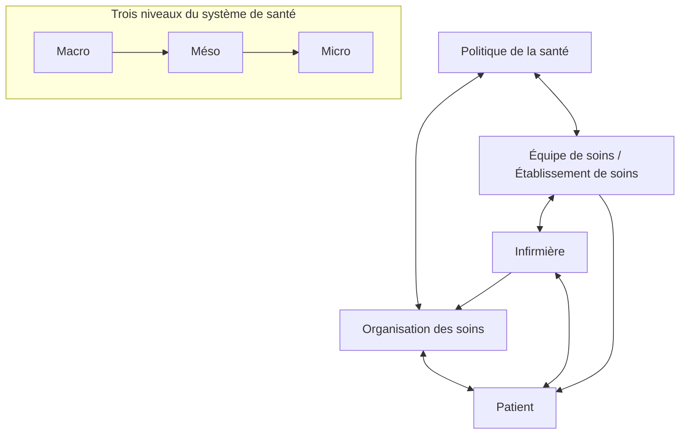
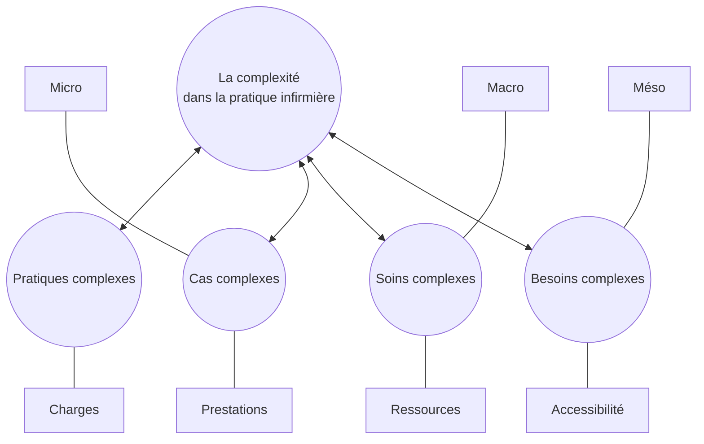

## Document page 1

La complexité dans la pratique infirmière : vers un nouveau cadre conceptuel dans les soins infirmiers

Catherine Busnel, Catherine Ludwig, Maria Goreti Da Rocha Rodrigues

Dans Recherche en soins infirmiers 2020/1 N° 140 , pages 7 à 16 Éditions Association de Recherche en Soins Infirmiers

ISSN 0297-2964

DOI 10.3917/rsi.140.0007

Date de mise en ligne : 10/06/2020

Article disponible en ligne à l’adresse https://stm.cairn.info/revue-recherche-en-soins-infirmiers-2020-1-page-7?lang=fr

Découvrir le sommaire de ce numéro, suivre la revue par email, s’abonner... Scannez ce QR Code pour accéder à la page de ce numéro sur Cairn.info.

Distribution électronique Cairn.info pour Association de Recherche en Soins Infirmiers. Vous avez l’autorisation de reproduire cet article dans les limites des conditions d’utilisation de Cairn.info ou, le cas échéant, des conditions générales de la licence souscrite par votre établissement. Détails et conditions sur cairn.info/copyright. Sauf dispositions légales contraires, les usages numériques à des fins pédagogiques des présentes ressources sont soumises à l’autorisation de l’Éditeur ou, le cas échéant, de l’organisme de gestion collective habilité à cet effet. Il en est ainsi notamment en France avec le CFC qui est l’organisme agréé en la matière.

**Additional extracted image(s) from this page:**

## Document page 2

Recherche en soins infirmiers n° 140 - Mars 2020 l Copyright © ARSI tous droits réservés - 7

RENCONTRE

While complexity theory has gradually influenced the field of health and social sciences, it has also had an impact on nursing care by introducing a wealth of terminology into the field. The terms “complex patient,” “complex case,” “complex care,” “complex practice,” and “complex needs” have been proposed to describe different aspects of complexity in nursing care. As these qualifiers reflect, nurses become actors in multidefined care and must integrate complexity into their reflective practice. By way of a narrative literature review, this article aims to offer a new perspective on nursing by explaining the different terms used in the discipline, using a multi-level approach. At the end of this review, the authors propose a new integrative conceptual framework for complexity in nursing practice.

Keywords: Complex case, complex care, complex needs, complex nursing practice, concept.

AB S T R AC T

R ÉS U M É

Si la théorie de la complexité a influencé les champs de la santé et du social, elle entre aujourd’hui de manière encore plus ciblée dans les soins infirmiers au travers d’une foison de terminologies. Ainsi, les termes de patient complexe, cas complexe, complexité des soins, pratique complexe et besoins complexes ont progressivement été proposés pour qualifier différents aspects de la complexité dans les soins infirmiers. Comme le traduisent ces qualificatifs, les infirmières deviennent les actrices de prises en soins multi déterminées et se doivent d’intégrer la complexité dans une pratique réflexive. Le présent article a pour objectif, à partir d’une revue narrative de littérature, d’apporter un regard croisé sur la complexité dans les soins infirmiers en précisant les différents termes utilisés dans la discipline, selon une approche multi niveaux. A l’issue de cette revue, les auteures proposent un nouveau cadre conceptuel intégratif de la complexité dans la pratique infirmière.

Mots clés : cas complexe, soins complexes, besoins complexes, pratique infirmière complexe, concept.

Catherine BUSNEL, B.Sc, Responsable de l’unité recherche et développement, Institution genevoise de maintien à domicile, Carouge, Genève, Suisse

Catherine LUDWIG, Ph.D, Professeure associée HES, Haute école de santé de Genève, HES-SO, Haute École Spécialisée de Suisse Occidentale, Genève, Suisse

Maria Goreti DA ROCHA RODRIGUES, Ph.D, Professeure assistante HES, Haute école de santé de Genève, HES-SO, Haute École Spécialisée de Suisse Occidentale, Genève, Suisse

La complexité dans la pratique infirmière : vers un nouveau cadre conceptuel dans les soins infirmiers

Complexity in nursing practice: Toward a new conceptual framework in nursing care

Pour citer l’article : Busnel C, Ludwig C, Da Rocha Rodrigues MG. La complexité dans la pratique infirmière : vers un nouveau cadre conceptuel dans les soins infirmiers. Rech Soins Infirm. 2020 Mar;(140):7-16.

Adresse de correspondance : Catherine Busnel : catherine.busnel@imad-ge.ch

Association de Recherche en Soins Infirmiers | Téléchargé le 05/04/2026 sur https://stm.cairn.info (IP: 91.177.203.44)

## Document page 3

8 l Recherche en soins infirmiers n° 140 - Mars 2020 Copyright © ARSI tous droits réservés

INTRODUCTION

Le terme complexité s’est infiltré au cours des années 70 dans tous les domaines de la société, en référence à l’évolution d’une dynamique industrielle, informatique, organisationnelle et opérationnelle mettant en avant un monde multidimensionnel (1). Les termes « complexes » et « complexité » sont aujourd’hui utilisés couramment et leur usage dans le domaine des soins ne fait pas exception. A l’instar de l’organisation mondiale de la santé qui transpose dans les soins la notion de « système complexe » (2) comme un « système dans lequel les parties interagissant entre elles sont si nombreuses qu’il est difficile, voire impossible, de prévoir les comportements du système sur la simple base de la connaissance de ses composantes individuelles. » Cette définition place surtout la complexité au niveau des systèmes de santé rejoignant une définition globale et conceptuelle de la complexité. En effet, elle est tout d’abord un concept théorique (3) dont les définitions proposées sont souvent générales et les critères retenus pour la décrire sont associés le plus communément à l’imprécision, au flou, aux aléas, à l’instabilité, à l’ambiguïté, à l’incertitude, et à l’imprévisibilité (4) incluant des caractères dynamiques et non-linéaires. Dans les sciences sociales et humaines, comme dans les sciences naturelles et biomédicales, la complexité est aussi définie d’une manière conceptuelle par un ensemble de phénomènes non linéaires et imprévisibles nécessitant en permanence des adaptations du système et des différents composants la constituant. Une telle dynamique a été qualifiée par Edgar Morin (3) d’« ordredésordre-interactions-organisation ». Dans les soins, la complexité est souvent définie soit par opposition (complexité vs simplicité) (5), par association (complexité et fragilité ou complexité vs vulnérabilité ou complexité vs comorbidité) (6) ou par graduation (complexité vs sévérité). Dans les sciences infirmières, la complexité apparait discrètement de manière diluée dans le paradigme de l’intégration et celui de la transformation (7). Mais actuellement, la complexité n’est pas positionnée comme un concept central d’une théorie ou modèle infirmier spécifique, même si l’intérêt de questionner la complexité dans les soins est de plus en plus prégnant dans la pratique infirmière. Aussi, si comme évoqué par Morin (3), la complexité est « l’art de faire coexister, sans les fusionner, les modèles, théories, méthodes de sorte que leur application rende nos interventions conformes dans la situation dans laquelle elles s’opèrent », elle devrait par conséquent avoir une place prépondérante dans nos modèles actuels pour optimiser la qualité des prises en soins.

Dans une perspective d’opérationnalisation, en France, la Haute autorité de santé a proposé de définir la situation complexe « comme une situation pour laquelle la présence simultanée d’une multitude de facteurs, médicaux, psychosociaux, culturels, environnementaux et/ou économiques sont susceptibles de perturber ou de remettre en cause la prise en charge d’un patient, voire d’aggraver son état de santé » (8). Plusieurs outils pour la pratique ont été déclinés selon des contextes de soins différents (9), selon les professionnels y compris pour des infirmières (10). Si différents auteurs s’accordent sur les notions « d’ensemble d’éléments » interagissant de manière « instable » (11), la complexité dans le champ de la santé peut s’interpréter à différents niveaux ; de l’ensemble des unités composant chaque système physiologique à l’ensemble des institutions composant un système de santé. D’un point de vue général, la complexité dans les soins fait coexister des modèles existant dans différentes disciplines (biologie, sociologie, anthropologie, par exemple). Elle met les infirmières au centre d’un système de santé, au cœur des prises en soins multi déterminées par des éléments à la fois physiologiques, environnementaux, institutionnels et politiques, comme le rappelle le métaparadigme infirmier qui inscrit le champ d’activité des infirmières et leur centre d’intérêt sur quatre concepts centraux que sont l’être humain, le soin, la santé et l’environnement (12).

Cet article, basé sur une revue narrative de la littérature (13,14), a pour objectif d’apporter un regard croisé sur la complexité dans les soins infirmiers selon les différents qualificatifs rencontrés dans le champ de la santé (cas, soins, besoins) et selon les différents niveaux d’application (micro, méso, macro). Dans les sciences infirmières, la complexité apparait de manière discrète dans les paradigmes de l’intégration et de la transformation (7). Il n’est donc pas surprenant qu’une foison de qualificatifs renvoyant à la notion de complexité soit apparue dans la littérature infirmière, parmi lesquels on peut citer « patient complexe », « cas complexe », « complexité des soins », « pratique complexe » et « besoins complexes ».

D’emblée, on peut relever que la diversité de termes liés à la complexité s’inscrit à différents niveaux d’interprétation, allant d’un niveau « micro » - celui de la physiologie des individus à prendre en soin par l’infirmière - à un niveau « macro » celui des systèmes de santé au sein duquel l’infirmière déploie ses soins. Si cette richesse dénote l’importance de la complexité dans la pratique infirmière, la multitude de références à cette notion demande une démarche de clarification - voire de classification - pour aboutir à une meilleure définition de la complexité dans

Remerciements

Les auteures remercient Fanny Vallet, pour ses commentaires suite à sa relecture attentive du manuscrit.

Association de Recherche en Soins Infirmiers | Téléchargé le 05/04/2026 sur https://stm.cairn.info (IP: 91.177.203.44)

## Document page 4

La complexité dans la pratique infirmière : vers un nouveau cadre conceptuel dans les soins infirmiers

Recherche en soins infirmiers n° 140 - Mars 2020 l Copyright © ARSI tous droits réservés - 9

la pratique infirmière. A l’issue de cette revue narrative, l’article propose la définition d’un cadre conceptuel de la complexité dans les soins infirmiers qui complète les développements cliniques et de recherche en cours visant la mise à dispositions de méthodes valides et fiables d’évaluation de la complexité pour la pratique infirmière domiciliaire (10,15,16).

LES DIFFÉRENTS NIVEAUX DE COMPLEXITÉ DANS LES SOINS INFIRMIERS

Si la complexité agit, interagit, s’entremêle à différents niveaux dans les prises en soins quotidiennes, les infirmières y sont en permanence confrontées (17). Ainsi, pour les infirmières, la complexité peut se retrouver au niveau « micro », niveau individuel avec le patient, au niveau «  méso  », niveau organisationnel avec l’équipe de soin agissant pour le patient et au niveau « macro », niveau sociétal avec le système de santé d’un point de vue économique et politique (figure 1).

Au demeurant, les différents niveaux ne sont pas indépendants les uns des autres mais interagissent entre eux. Par exemple, l’ensemble des données cliniques mobilisées pour chaque patient puis agrégées pour l’ensemble des patients contribue à mieux comprendre un sous-groupe de personnes suivis par une institution de soin (18). De même, les orientations économiques et politiques régissant un système de santé ont un impact sur l’organisation de ce système, mais aussi, par voie de conséquence, sur les individus, soignants et patients. Les changements et les évolutions des situations de santé des patients pris en soin dans une institution peuvent également amener, en retour, à l’adaptation du système de santé luimême. Aujourd’hui, cette dynamique s’observe notamment avec les enjeux de prises en soins liés au vieillissement de la population et à l’augmentation de la prévalence des maladies chroniques et des comorbidités (19).

Comme le montre la figure 1, les niveaux « micro », « méso » et « macro » peuvent être réorganisés de manière très différente

Politique de la santé

Equipe de soins/Etablissement de soins

Infirmière

Organisation des soins

Patient

Macro

Méso

Micro

Figure 1 : Place de l’infirmière au regard des trois niveaux du système de santé-micro, méso, macroet des interactions entre les différents systèmes : du patient à la politique de santé

Association de Recherche en Soins Infirmiers | Téléchargé le 05/04/2026 sur https://stm.cairn.info (IP: 91.177.203.44)

**Figure 1 - Diagramme converti en Mermaid**

## Document page 5

10 l Recherche en soins infirmiers n° 140 - Mars 2020 Copyright © ARSI tous droits réservés

selon le focus porté sur chaque système. Par exemple, un focus posé sur le niveau « micro » visera d’abord l’organe défaillant d’un patient/bénéficiaire de soins, un focus posé sur le niveau « méso » prendra en compte le patient dans sa globalité et un focus posé sur le niveau « macro » mettra en lumière les liens entre le patient et l’infirmière/équipe de soin, l’inscrivant au sein du système de santé.

LA COMPLEXITÉ AU NIVEAU « MICRO » : COMPLEXITÉ DES CAS

Le niveau « micro » dans les soins infirmiers intègre les éléments liés au bénéficiaire de soins incluant la clinique et les pratiques professionnelles nécessaires à la prise en soin (20). Il intègre un modèle de la santé global associant outre la biologie humaine, l’environnement de la personne et les habitudes de vie entendues comme « ensemble des décisions que prennent les individus et qui ont des répercussions sur leur propre santé » (21). Ainsi, le niveau « micro » s’étend au-delà des facteurs de santé médicale, pour englober des dimensions telles que l’éducation et la formation des bénéficiaires de soins (22), l’étendue de leur soutien social (23). Sont également pris en compte les facteurs de santé mentale et de comportement à l’égard des soins (23). Des composantes défavorables pour la prise en soin telles que la précarité financière, l’accès réduit aux soins, les faibles niveaux d’éducation et de littératie, la résistance aux soins, l’absence de soutien social, les difficultés cognitives et/ou les troubles psychologiques qui sont des facteurs associés, définissent la complexité des cas (24). Elle est également précisée par un ensemble de conditions et de troubles manifestés par un patient comme la gravité de la maladie et l’acuité du patient (25). Dans le cas d’une décompensation d’une des polypathologies associées avec de nombreuses conséquences en cascades (instabilité, intensité), l’intervention des soignants peut devenir très spécifique (soins spécialisés) et techniquement complexe (26). Hors, les interventions des différents professionnels se centrent encore très largement sur les maladies isolées prenant peu en considération les interactions entre facteurs intrinsèques/individuels et extrinsèques/environnementaux caractérisant la personne. Ainsi, à la notion de complexité de cas, on peut associer la notion de « patient en situation complexe » un terme qui unit la complexité médicale à savoir l’association et/ou les pathologies multiples, des difficultés dans les activités de la vie quotidienne (ADL), la sévérité des pathologies, l’instabilité de l’état de santé, des hospitalisations répétées pour une même problématique et la complexité psycho-sociale à savoir une association et/ou un cumul d’un faible recours aux soins, d’un isolement social, de vulnérabilité sociale, de pratiques de santé inadaptées, d’une situation de dépendance, et une nécessité de faire intervenir plusieurs acteurs.

LA COMPLEXITÉ AU NIVEAU « MÉSO » : COMPLEXITÉ DES BESOINS1

Le niveau « méso » dans les soins intègre les éléments liés aux services, à l’organisation, à la planification, et à la structuration du dispositif de soins y incluant les ressources humaines et matérielles. Dans cette perspective, la complexité est souvent abordée en utilisant une approche fondée sur le risque (27) et les coûts de la santé. Ainsi les économistes et les gestionnaires du système de santé qualifient les caractéristiques du système de prise en charge engagé avec des individus qui utilisent une part disproportionnée des ressources sanitaires, humaines ou financières (28) en raison de besoins dits « complexes ». Les stratégies visant à diminuer ces risques de surconsommation sont principalement étudiées en tant qu’opportunités de réduction de la consommation des ressources de santé, cela dans une perspective d’amélioration de la qualité des soins. L’évolution des soins et du système de santé - notamment liée au passage des soins axés sur les maladies aigües vers les soins axés sur les maladies chroniques, et le passage des soins hospitaliers vers les soins ambulatoires - met en lumière les limites de la pensée orientée « maladies » et la nécessité de changer de paradigme (19). De plus, l’augmentation des patients présentant des maladies chroniques fluctuantes, à haut risque de décompensation et de réadmission prématurée à l’hôpital, font émerger de nouveaux enjeux pour les systèmes de santé (29). Ainsi, au niveau « méso », la complexité peut aussi être définie comme un ensemble de conditions et de désordres se manifestant sur un ensemble d’acteurs composant un système de prestation de soins (30). Les infirmières, comme tous les professionnels de la santé, se trouvent au cœur des prises en soins des personnes vivant des expériences de santé aussi multiples que variées et fluctuantes. Parmi les stratégies de prises en soins reconnues comme efficaces figurent les interventions fondées sur le modèle de soins chroniques (31) qui reposent sur un réseau composé non seulement de soignants formels (médecins, pharmaciens, infirmières, autres professionnels de la santé et du travail social), mais aussi du patient et des aidants naturels non formels (proches aidants) (32). Ce cadre de soins intégrés vise à fournir des soins mieux adaptés aux patients avec des besoins complexes, sur la base d’une collaboration interprofessionnelle. Il constitue le principal pilier soutenant des soins individualisés à long terme et en dehors des établissements médicaux (33).

LA COMPLEXITÉ AU NIVEAU « MACRO » : LA COMPLEXITÉ DES SOINS

Le niveau « macro » dans les soins infirmiers insère les éléments tels que l’organisation et la gouvernance des soins de santé, les politiques publiques et sociales de santé et

1 Le mot « besoin » intègre dans ce cas les supports, équipements, ressources. Il doit s’entendre en tant que besoin en services de santé.

Association de Recherche en Soins Infirmiers | Téléchargé le 05/04/2026 sur https://stm.cairn.info (IP: 91.177.203.44)

## Document page 6

La complexité dans la pratique infirmière : vers un nouveau cadre conceptuel dans les soins infirmiers

Recherche en soins infirmiers n° 140 - Mars 2020 l Copyright © ARSI tous droits réservés - 11

les financements. Le terme « complexité des soins » a été employé très largement au niveau international pour définir et quantifier les coûts des maladies et des traitements. La complexité des soins est aussi définie dans les soins infirmiers comme reflétant l’intensité des soins et/ou la charge de travail (34). Le terme de « complexité des soins » est ainsi utilisé avec d’importantes divergences, soit de manière quantitative (mesure quantitative de la charge de travail, contexte de soins, intensité des soins), soit de manière qualitative (incertitude du patient, communication entre les différents acteurs de la santé, collaboration au sein d’une équipe multidisciplinaire) (33).

LES INTERACTIONS ENTRE LES « MICRO », « MÉSO » ET « MACRO »

A l’instar de systèmes complexes, les types de complexité rapportés aux niveaux « micro », « méso » et « macro » sont en perpétuelle interaction et décrivent une dynamique non linéaire et en constante évolution entre le patient, l’infirmière, l’organisation du travail et la politique de la santé. La complexité des soins est mise en lumière par les personnes ayant des besoins complexes qui présentent des risques significativement plus élevés de décompensations et une fréquence plus élevée d’admissions aux urgences et/ou de réadmissions à court terme à l’hôpital, considérées en grande partie comme inutile. L’évolution de la pathologie, les besoins de soins, la charge de la prise en soins, les modalités organisationnelles, financières peuvent modifier et rendre incertaine la prise en charge initialement prévue. Les

multiples pathologies en interaction peuvent se compliquer les unes les autres. Selon l’environnement du patient et selon le contexte général du système de santé, elles peuvent entraîner un ensemble de besoins particuliers et ainsi engendrer l’intervention d’une multitude d’acteurs dispensant des soins. Ainsi, face à une double transition, une démographique liée au vieillissement de la population et l’autre liée à l’augmentation des comorbidités, la typologie de patients « gériatriques » en est modifiée et nécessite une prise en charge socio sanitaire spécialisée (35). Dans l’éventualité de la survenue d’une décompensation, l’agir sera très spécifique et techniquement complexe (26) et nécessitera une organisation conséquente au regard de la politique de la santé.

S’ajoutent également à la complexification des prises en soins des patients, les avancées technologiques qui contribuent à diagnostiquer des maladies de plus en plus précisément, de suivre encore plus finement et de manière répétée leurs évolutions dans le temps pouvant engendrer une multitude d’examens complémentaires et par conséquent des surcoûts d’examen (36).

Ainsi, les différentes approches de complexité des cas, des soins et des besoins et les différents niveaux - « micro », « méso » et « macro » ne doivent en aucun cas être opposables mais bien au contraire cumulatives et dynamiques pour une compréhension la plus pertinente possible de toutes les facettes de la complexité de la situation du patient dans son environnement. Ainsi, la complexité dans les soins infirmiers s’inscrit de fait dans une approche systémique ouverte et imprévisible (37).

Les différents axes de la complexité dans les soins Éléments de compréhension

Complexité des cas

« capacités du patient »

Ensemble de conditions et de troubles manifestés par un patient, d’un point de vue médical, socio-économique, santé mentale et comportemental. Sont souvent associés les termes : Comorbidité, polypathologies, multimorbidité. Ensemble de conditions et de troubles manifestés par un patient (gravité de la maladie et l’acuité du patient).

Complexité des soins

« charge de travail »

Ensemble des acteurs composant un système de prise en charge et réalisant des prestations d’aide et de soins.

La complexité des soins est souvent utilisée comme synonyme d’intensité des soins ou de charge de travail infirmier.

Complexité des besoins Caractéristiques du système de prise en charge engagé pour un patient qui utilise une part disproportionnée des ressources sanitaires humaines ou financières (besoins en services de santé : besoin de soins infirmiers, médicaux, chirurgicaux, de thérapies, d’équipements par exemple).

Tableau 1 : Tableau synoptique des types de complexités dans les soins et leur définition : complexité des cas, complexité des soins, complexité des besoins

Association de Recherche en Soins Infirmiers | Téléchargé le 05/04/2026 sur https://stm.cairn.info (IP: 91.177.203.44)

## Document page 7

12 l Recherche en soins infirmiers n° 140 - Mars 2020 Copyright © ARSI tous droits réservés

LA COMPLEXITÉ DANS DES SOINS INFIRMIERS : VERS UN NOUVEAU CADRE CONCEPTUEL

Si la théorie de la complexité a progressivement influencé le champ de la santé et du social (38), elle s’est intégrée, comme décrit précédemment, dans les niveaux « micro », « méso » et « macro » de l’organisation des soins. Par définition, la complexité prend en compte la coexistence dynamique de multiples interactions, en termes de processus et de résultats ainsi que des conséquences, parfois inattendues et peu prévisibles, susceptibles de se produire au fil du temps (39). Bien que la complexité ne bénéficie pas d’une théorie unifiée en raison de sa nature multidisciplinaire, elle peut néanmoins se concevoir de manière transdisciplinaire par la nécessité de s’adapter en permanence et d’interagir. Il n’en demeure pas moins que les soins infirmiers sont au centre d’une alchimie subtile intégrant de nombreuses disciplines comme la biologie, la psychologie, la sociologie, l’anthropologie, la médecine et l’éthique. Cela implique pour eux de prendre en considération les apports des disciplines apparentées en mobilisant en continu une approche holistique et anthropologique (40) afin de mieux comprendre les différentes articulations entre les systèmes (41) et d’agir en conséquence. Dans le domaine des soins infirmiers, la complexité s’est inscrite dans un courant humaniste incluant les éléments psychologiques et relationnels (7) faisant évoluer ces modèles du biomédical « faire pour » (42), au modèle biopsychosocial « faire avec » (43) et finalement au modèle holistique « être avec ». Dans cette perspective, la modélisation des systèmes complexes développée par Le Moigne (44) apparait comme une base solide pour initier une réflexion sur la complexité dans les soins infirmiers. Cet auteur propose une approche qui prend en compte la structure du système de santé, les activités de soin, l’environnement dans lequel est prodigué le soin, l’évolution de la santé et la finalité du soin. Ces composantes se retrouvent aisément dans le métaparadigme infirmier (12). Un des concepts qui interagit en permanence avec le patient est celui de l’environnement soit au niveau du logement physique avec la fonctionnalité et l’accessibilité, soit au niveau de l’environnement familial avec les proches aidants ou le voisinage, soit au niveau des organisations de soins de proximité dont l’accessibilité aux services et aux soins, soit au niveau du contexte socioéconomique, soit au niveau environnemental et écologique (pollutions). La composante environnementale agit fortement sur la prise en soin du patient à domicile et peut être perçue au niveau micro, méso et macro. Prendre en compte la complexité des prises en soins à domicile par les infirmières nécessite, de fait, une approche multidimensionnelle, interdisciplinaire et holistique tenant compte des facteurs intrinsèques du patient (santé, religion, socio-économique), les soins, les facteurs liés aux professionnels de la santé (médecin, infirmière, autres), les facteurs liés à la réalisation des prestations de soins, les facteurs organisationnels, l’environnement, l’équipe, les

facteurs organisationnels (structure, planification), les facteurs politique. Par conséquent, la complexité défie les modèles de pensées actuelles en ouvrant très largement le champ des interactions, des interrelations à tous les niveaux et de manière dynamique. C’est également tout naturellement que les cadres conceptuels de soins ont été et sont influencés. Pour l’illustrer, Wilson (45) y fait référence par l’interaction complexe entre la physiologie et le comportement, elle reconnaît que la maladie découle de l’interaction dynamique entre et au sein des systèmes. Chaffee (46) propose un modèle des soins infirmiers perçus comme un système adaptatif complexe avec des implications potentielles dans les soins infirmiers. Davidson (47) place l’être humain dans l’environnement comme un tout unifié en utilisant également la science de la complexité. Fawcett avec le métaparadigme infirmier (12) permet quant à elle une classification autour de quatre concepts centraux que sont l’être humain, l’environnement, la santé et les soins. Cependant, cette catégorisation semble en premier lieu être plus mobilisée par les infirmières au niveau du bénéficiaire de soin, soit à un niveau « micro ». Dans une approche plus large de la complexité, le métaparadigme couvre aussi les niveaux « méso » et « macro » ouvrant considérablement la vision du soin (39) et obligeant ainsi une réflexivité multiaxiale (48). Par les soins que l’infirmière prodigue, par son statut d’actrice du système de santé selon des prestations définies par les politiques de santé, elle se situe au centre des interactions entre la complexité des cas, la complexité des soins et la complexité des besoins.

Dans cette dynamique, l’infirmière fait valoir une pratique complexe qui intègre les actions/interventions de soins en tenant compte de la variabilité et l’instabilité de la situation du patient, mais aussi des fluctuations de l’environnement où il se trouve (domicile, hôpital). De plus, la prise en soins intègre la décision du bénéficiaire de soin selon la capacité de discernement, le choix éclairé et les directives anticipées par exemple de ce dernier. La pratique complexe nécessite alors une cohérence thérapeutique (approches curatives, éducatives, préventives ou palliatives), un choix dans les actes techniques et les protocoles de soins ainsi qu’une coordination interprofessionnelle anticipée.

Ainsi, en termes d’agir, la complexité dans les soins infirmiers intègre pleinement la complexité des cas, la complexité des soins, la complexité des besoins et les pratiques complexes. Pour être efficiente, l’action inclut finalement une pratique réflexive avec le « penser complexe » (37). La prise en compte conjointe de l’ensemble de ces éléments permet d’ouvrir la porte à un nouveau cadre conceptuel : « la complexité dans la pratique infirmière ». Est entendu par cadre conceptuel une explication d’un ensemble de concepts et sous-concepts interreliés et réunis en raison de leurs rapports avec le problème de recherche. L’explication se fonde sur le contenu d’écrits portant sur le domaine de connaissances auquel se rattache le sujet d’étude ou dérive de modèles conceptuels ou de données empiriques (49). Ainsi la complexité dans la

Association de Recherche en Soins Infirmiers | Téléchargé le 05/04/2026 sur https://stm.cairn.info (IP: 91.177.203.44)

## Document page 8

La complexité dans la pratique infirmière : vers un nouveau cadre conceptuel dans les soins infirmiers

Recherche en soins infirmiers n° 140 - Mars 2020 l Copyright © ARSI tous droits réservés - 13

pratique infirmière donne une vision du soin élargie, organise le champ d’activité qui agit et interagit aux niveaux « micro », « méso » et « macro » (50), et rejoint, de manière intégrative, l’ensemble des typologies de la complexité : complexité des cas, complexité des soins et pratiques complexes. Elle intègre le patient, sa santé, son environnement de soins, les conditions contextuelles de la prise en soins, l’accessibilité aux soins, les besoins de soins nécessaires et déployés, les soins réalisés en interdisciplinarité et interprofessionnalité ainsi que la politique de santé. Cette manière de concevoir la complexité des soins infirmiers s’inscrit facilement dans le paradigme de l’intégration qui reconnaît les éléments multiples et les manifestations en lien avec le contexte (51). Le but visé est l’équilibre. Or, si on tient compte de la dynamique dans l’interdépendance des systèmes, ce mouvement est relevé

dans le paradigme de la transformation (51). La complexité intègre également la présence de l’imprévisible et du désordre acceptant que la maitrise soit impossible. Dans ce paradigme le phénomène est unique, complexe et global et les éléments sont en interaction continuelle, réciproque et simultanée. La réalité est prise en compte de manière complexe, non linéaire et en évolution. Le but visé est la compréhension des expériences humaines individuelles de santé.

Le modèle proposé, schématisé dans la Figure  2, permet de considérer l’ensemble des approches comme complémentaires pour une compréhension plus pertinente de la situation du bénéficiaire de soin dans son environnement, cela dans une dynamique propre aux systèmes complexes (52).

Pratiques complexes

La complexité dans la pratique infirmière

Soins complexes

Cas complexes Besoins complexes

Prestations

Ressources

Charges

Accessibilité

Micro

Méso

Macro

Figure 2 : Les différentes approches de la complexité contribuant à la complexité dans la pratique infirmière

Association de Recherche en Soins Infirmiers | Téléchargé le 05/04/2026 sur https://stm.cairn.info (IP: 91.177.203.44)

**Figure 2 - Diagramme converti en Mermaid**

## Document page 9

14 l Recherche en soins infirmiers n° 140 - Mars 2020 Copyright © ARSI tous droits réservés

Le cadre conceptuel de la complexité dans la pratique infirmière, peut être illustré par la situation unique de chaque bénéficiaire de soin « contemporain », susceptible de présenter des difficultés qui s’inscrivent de manière multidimensionnelles au niveau de la santé médicale, de la santé mentale, du social et de l’économique, de l’instabilité et des intervenants. De plus, chaque expérience de santé est vécue de manière différente et toujours changeante, donc imprévisible. Une manière empirique d’appréhender ce modèle de la complexité a récemment été proposée avec l’instrument de complexité multidimensionnelle (COMID) (10,15). Cet outil, développé pour les infirmières à domicile, intègre les axes multidimensionnels tels que les facteurs médicaux, socio-économiques, de santé mentale, environnementaux, d’instabilité et d’interprofessionnalité. Ainsi, le COMID reprend sous forme de check-list les éléments de la pratique complexe en se référant au cas, au soins et aux besoins complexes. Il constitue une aide à la décision pour l’infirmière qui souhaite intégrer dans sa pratique le « penser complexe », « l’évaluation de la complexité » (évaluation de la multidimensionnalité) et « l’agir complexe » (interdisciplinarité et interprofessionnalité).

CHANGEMENTS ET PERSPECTIVES DANS LES SOINS INFIRMIERS

Approcher la complexité dans les soins élargit nécessairement le regard porté sur la santé, le soin, l’être humain, et l’environnement en amenant l’infirmière à les inscrire dans une typologie de complexités qui se révèlent dans les niveaux « micro », « méso » et « macro ». Ce changement de perspective les contraint à dépasser le seul diagnostic traditionnel pour la prise en compte du bénéficiaire de soin avec un traitement intégré et personnalisé, inscrit dans les contraintes et opportunités du système de santé. La complexité nécessite d’être appréhendée d’une manière non linéaires, dynamique et en interdisciplinarité pour répondre aux besoins complexes de la personne dans son système de vie (18). L’infirmière devrait ainsi mobiliser dans sa pratique le « penser complexe », « l’évaluation de la complexité » (10), et « l’agir complexe » (37). La complexité dans la pratique infirmière est dès lors une proposition d’intégration de la complexité au cœur même de la pratique infirmière réflexive et agie. Car si pendant plusieurs décennies, la complexité des cas a été l’approche de choix, en référence à une approche centrée sur la maladie, ce paradigme est aujourd’hui remis en question, au bénéfice d’une approche plus large, qui appréhende le soin de manière globale et intégrée, à l’instar du Chronique Care Model (53). La complexité dans la pratique infirmière axe véritablement la collaboration de l’ensemble des acteurs de soins, des niveaux « micro » et « méso » en soutenant une démarche de soin interdisciplinaire et coordonnée, dans une perspective holistique. Il permet ainsi 1) d’appréhender de manière multidimensionnelle et dynamique les bénéficiaires de soins dans leur environnement,

2) de développer la coordination interprofessionnelle et 3) de

créer un nouveau métier à l’interface du champ sanitaire et social comme pour les patients âgés : le case manager ou gestionnaire de cas (54).

Ce nouveau cadre conceptuel se fonde sur les connaissances actuelles de la complexité et tente d’articuler différentes approches et niveaux possibles pour une compréhension plus large et organisée des prises en soins infirmières. La complexité dans la pratique infirmière devrait permettre non seulement une pratique complexe, mais également, une prise en soins qui prend en compte l’ensemble des éléments d’une situation, y inclus les capacités intrinsèques (55) ou les forces (56). Il s’inscrit dans ce nouveau virage prôné par l’Organisation Mondiale de la Santé dans une prise en soins centrée sur les ressources, les capacités intrinsèques des personnes et non plus sur les déficits en santé (55).

LIMITES

Il est proposé ici un nouveau cadre conceptuel où le concept prioritaire est la complexité. Cette nouvelle manière de considérer la prise en soin est encore en phase préliminaire. Comme proposé par Newman (57), la pratique est un tout unifié qui transcende les limites de chaque paradigme. Vouloir considérer les paradigmes comme des catégories séparées restent une difficulté dans la science infirmière. La complexité dans la pratique infirmière méritera d’être questionnée sous l’angle de la recherche, de la constatation dans la pratique, dans le but d’affiner le cadre conceptuel proposé et ainsi envisager une perspective plus théorique comme définie par Meleis (58) et selon les propositions de Risjord (59).

CONCLUSION

Dans le monde des soins, la complexité habite les discussions de tous les jours, elle occupe toutes les strates du quotidien, le « micro » devenant toujours de plus en plus spécifique et le « macro » de plus en plus vaste. La complexité est multidimensionnelle et multi référentielle (60), elle se situe entre le simple et le chaotique (61) et pour les professionnels de santé, elle peut aussi bien constituer un défi qu’un fardeau extrême (52). Dans ce monde de l’infiniment petit et grand à la fois, chacun doit être à même d’appréhender les différentes typologies de la complexité, de les ancrer dans les différents niveaux de lecture et d’interprétation et de les articuler pour une pratique plus efficiente des soins. Intégrer la complexité dans la pratique infirmière devrait contribuer à optimiser l’évaluation empirique des soins, de contribuer à donner du sens tant au niveau des prises en soins personnalisées comme aux stratégies de santé. En effet, les perspectives visées par les différents acteurs de la santé - soient-ils les patients, les aidants informels, les professionnels, les dirigeants ou les politiques - peuvent être très hétérogènes voire parfois diamétralement opposées. Il est cependant primordial pour les professionnels

Association de Recherche en Soins Infirmiers | Téléchargé le 05/04/2026 sur https://stm.cairn.info (IP: 91.177.203.44)

## Document page 10

La complexité dans la pratique infirmière : vers un nouveau cadre conceptuel dans les soins infirmiers

Recherche en soins infirmiers n° 140 - Mars 2020 l Copyright © ARSI tous droits réservés - 15

de la santé et les infirmières d’identifier les buts de chacun, de définir les objectifs communs afin de personnaliser les prises en soins, jauger les risques du quotidien et envisager des actions curatives, éducatives, préventives ou palliatives adaptées. Il semble important de pouvoir sensibiliser et outiller les professionnels à évaluer globalement et spécifiquement la complexité dans une approche systémique à plusieurs niveaux, de prioriser les objectifs de prise en soins, de se coordonner et avoir l’agilité des actions de proximité à mettre en œuvre et à ajuster. La complexité ne doit pas être un frein à l’action, elle redonne le libre arbitre aux professionnels par un « agir complexe » adaptatif et agile.

FINANCEMENT

La rédaction de cette article a été soutenue par des fonds institutionnels de l’Institution genevoise de maintien à domicile et de la Haute École de Santé de Genève. Les financeurs n’ont joué aucun rôle dans le choix des contenus du manuscrit et dans la préparation du manuscrit.

CONFLITS D’INTÉRÊTS

Les auteures déclarent n’avoir aucun lien d’intérêt.

Références

1. Cambien A. Une introduction à l’approche systémique : appréhender la complexité. [Rapport de recherche] [En ligne]. Lyon: Centre d’Etudes sur les réseaux les transports l’urbanisme et les constructions publiques (CERTU); 2008. [cité le 3 mars 2020]. Disponible: https://hal-lara.archives-ouvertes.fr/hal-02150426

2. Organisation Mondiale de la Santé. World report on ageing and health [En ligne]. Genève, Suisse: OMS; 2015. [cité le 3 mars 2020]. Disponible: https://www.who.int/ageing/events/worldreport-2015-launch/en/

3. Morin E. Introduction à la pensée complexe. Paris: Seuil; 2005.

4. Cambien A. Introduction à l’approche systémique: appréhender la complexité [Rapport de recherche] [En ligne]. Lyon: Centre d’Etudes sur les réseaux les transports l’urbanisme et les constructions publiques (CERTU); 2008. [cité le 3 mars 2020]. Disponible: https://hal-lara.archives-ouvertes.fr/hal-02150426/document

5. Defert JJ. Appréhender la complexité. Enjeux et raisonances dans le domaine culturel. International Journal of Canadian Studies. 2012 Jun(45-46):307-29.

6. Nardi R, Scanelli G. Complexity in the care of elderly patients and polypharmacy. Eur J Intern Med. 2008 Jun;19(4):304.

7. Pepin J, Ducharme F, Kerouac S. La pensée infirmière. 4e éd. Montréal, Canada: Chenelière Education; 2017.

8. Haute Autorité de Santé. Mode d’emploi du plan personnalisé de santé (PPS) pour les personnes à risques de perte d’autonomie (PAERPA) [En ligne]. Saint-Denis, France; 2014. [cité le 3 mars 2020]. Disponible: https://www.has-sante.fr/jcms/c_1638463/ fr/plan-personnalise-de-sante-pps-paerpa

9. de Jonge P, Huyse FJ, Slaets JP, Herzog T, Lobo A, Lyons JS, et al. Care complexity in the general hospital: results from a European study. Psychosomatics. 2001 May-Jun;42(3):204-12.

10. Busnel C, Marjollet L, Perrier-Gros-Claude O. Complexité des prises en soins à domicile : développement d’un outil d’évaluation infirmier et résultat d’une étude d’acceptabilité. Revue Francophone Internationale de Recherche Infirmière. 2018 Jun;4(2):116-23.

11. Plsek PE, Greenhalgh T. Complexity science: the challenge of complexity in health care. BMJ. 2001 Sep;323(7313):625-8.

12. Fawcett J. The metaparadigm of nursing: present status and future refinements. Image J Nurs Sch. 1984 Summer;16(3):84-9.

13. Noble H, Smith J. Reviewing the literature: choosing a review design. Evid Based Nurs. 2018 Apr;21(2):39-41.

14. Grant MJ, Booth A. A typology of reviews: an analysis of 14 review types and associated methodologies. Health Info Libr J. 2009 Jun;26(2):91-108.

15. Vallet F, Busnel C, Ludwig C. Analyse de la fidélité d’un instrument d’évaluation de la complexité multidimensionnelle (COMID) pour les infirmières à domicile. Rech Soins Infirm. 2019 Sep;(138):53-64.

16. Ludwig C, Busnel C. Protocol of a case-control longitudinal study (fraXity) assessing frailty and complexity among Swiss home service recipients using interRAI-HC assessments. BMC Geriatr. 2019 Aug;19(1):207.

17. Huang B, Li H, Chen M, Lin N, Wang Z. Theoretical framework construction on care complexity in Chinese hospitals: a grounded theory study. Int J Nurs Sci. 2019 Apr;6(2):192-7.

18. Busnel C, Mastromauro L, Zecca W, Ludwig C. Le RAI-Home Care: utilisation, potentiels et limites dans les soins à domicile. Gerontologie et Société. 2017 Jun;39(153):167-82.

19. Tinetti ME, Fried T. The end of the disease era. Am J Med. 2004 Feb;116(3):179-85.

20. Organisation Mondiale de la Santé. Rapport sur la santé dans le monde. Les soins de santé primaires. Maintenant plus que jamais [En ligne]. Genève, Suisse; 2008. [cité le 3 mars 2020]. Disponible: https://www.who.int/whr/2008/08_report_fr.pdf

21. Cantoreggi N. Pondération des déterminants de la santé en Suisse. Rapport d’étude final. Genève: Université de Genève; 2010.

22. Grant RW, Ashburner JM, Hong CS, Chang Y, Barry MJ, Atlas SJ. Defining patient complexity from the primary care physician’s perspective: a cohort study. Ann Intern Med. 2011 Dec;155(12):797-804.

23. Loeb DF, Binswanger IA, Candrian C, Bayliss EA. Primary care physician insights into a typology of the complex patient in primary care. Ann Fam Med. 2015 Sept;13(5):451-5.

24. de Jonge P, Huyse FJ, Stiefel FC. Case and care complexity in the medically ill. Med Clin North Am. 2006 Jul;90(4):679-92.

25. Bravetti C, Cocchieri A, D’Agostino F, Alvaro R, Zega M. The assessment of the complexity of care through the clinical nursing information system in clinical practice: a study protocol. Ann Ig. 2017 Jul-Aug;29(4):273-80.

26. Davidson AW, Teicher M, Bar-Yam Y. Nursing, caring and complexity science: for human environment well-being. New-York, NY, US: Springer Publishing Company; 2011.

27. Slama-Chaudhry A, Schaller P, Raetzo MA, Gaspoz JM. Maladies chroniques et réseaux de soins : l’exemple de Kaiser Permanente. Rev Med Suisse. 2008 Sept;4(172):2040-3.

Association de Recherche en Soins Infirmiers | Téléchargé le 05/04/2026 sur https://stm.cairn.info (IP: 91.177.203.44)

## Document page 11

16 l Recherche en soins infirmiers n° 140 - Mars 2020 Copyright © ARSI tous droits réservés

28. de Jonge P, Huyse FJ, Herzog T, Lobo A, Slaets JPJ, Lyons JS, et al. Risk factors for complex care needs in general medical inpatients: results from a European Study. Psychosomatics. 2001 May- Jun;42(3):213-21.

29. Christensen CM, Bohmer R, Kenagy J. Will disruptive innovations cure health care? Harv Bus Rev. 2000 Sep-Oct;78(5):102-12, 99.

30. de Jonge P, Huyse FJ, Stiefel FC. Case and care complexity in the medically ill. Med Clin North Am. 2006 Jul;90(4):679-92.

31. Bodenheimer T, Wagner EH, Grumbach K. Improving primary care for patients with chronic illness: the chronic care model, part 2. JAMA. 2002 Oct;288(15):1909-14.

32. Allen D, Gillen E, Rixson L. Systematic review of the effectiveness of integrated care pathways: what works, for whom, in which circumstances? Int J Evid Based Healthc. 2009 Jun;7(2):61-74.

33. Martin C, Sturmberg J. Complex adaptive chronic care. J Eval Clin Pract. 2009 Jun;15(3):571-7.

34. Guarinoni M, Petrucci C, Lancia L, Motta PC. The concept of care complexity: a qualitative study. J Public Health Res. 2015 Dec;4(3):588.

35. Rodriguez-Mañas L, Rodríguez-Artalejo F, Sinclair AJ. The third transition: the clinical evolution oriented to the contemporary older patient. J Am Med Dir Assoc. 2017 Jan;18(1):8-9.

36. Cline DD. Complexity of care: a concept analysis of older adult health care experiences. Nurs Educ Perspect. 2015 Mar-Apr;36(2):108-13.

37. Richard L, Gendron S, Cara C. Modélisation de la pratique infirmière comme système complexe : une analyse des conceptions de théoriciennes en sciences infirmières Aporia. 2012 Oct;4(4):25-39.

38. Fraser SW, Greenhalgh T. Coping with complexity: educating for capability. BMJ. 2001 Oct;323(7316):799-803.

39. Chandler J, Rycroft-Malone J, Hawkes C, Noyes J. Application of simplified complexity theory concepts for healthcare social systems to explain the implementation of evidence into practice. J Adv Nurs. 2016 Feb;72(2):461-80.

40. Nardi R, Scanelli G, Corrao S, Iori I, Mathieu G, Cataldi Amatrian

R. Co-morbidity does not reflect complexity in internal medicine patients. Eur J Intern Med. 2007 Sep;18(5):359-68.

41. Nazon E, Perron A. Vers une approche pluraliste en sciences infirmières. Rech Soins Infirm. 2014 Mar;(116):6-12.

42. Engel GL. The need for a new medical model: a challenge for biomedicine. Science. 1977 Apr;196(4286):129-36.

43. Engel GL. The clinical application of the biopsychosocial model. Am J Psychiatry. 1980 May;137(5):535-44.

44. Le Moigne JL. La théorie du système général : théorie de la modélisation. 5e éd. Paris: Presses Universitaires de France; 2006.

45. Wilson T, Holt T, Greenhalgh T. Complexity science: complexity and clinical care. BMJ. 2001 Sep 22;323(7314):685-8.

46. Chaffee MW, McNeill MM. A model of nursing as a complex adaptive system. Nurs Outlook. 2007 Sep-Oct;55(5):232-41.

47. Davidson AW, Ray MA. Studying the human-environment phenomenon using the science of complexity. ANS Adv Nurs Sci. 1991 Dec;14(2):73-87.

48. Rortveit G, Schei E, Strand R. Complex systems and human complexity in medicine. Complexus. 2004 Dec;2(1):2-6.

49. Fortin MF, Gagnon J. Fondements et étapes du processus de recherche : méthodes quantitatives et qualitatives. 2e éd. Montréal, Canada: Chenelière Education; 2010.

50. Johnson S, Bacsu J. Understanding complex care for older adults within Canadian home care: a systematic literature review. Home Health Care Serv Q. 2018 Jul-Sep;37(3):232-46.

51. Alligood M. Nursing theorists and their work. 9e éd. St Louis, MO, US: Elsevier; 2017.

52. Kentischer F, Kleinknecht-Dolf M, Spirig R, Frei IA, Huber E. Patient-related complexity of care: a challenge or overwhelming burden for nurses - a qualitative study. Scand J Caring Sci. 2018 Mar;32(1):204-12.

53. Bodenheimer T, Wagner EH, Grumbach K. Improving primary care for patients with chronic illness. JAMA. 2002 Oct 9;288(14):1775-9.

54. Corvol A, Moutel G, Somme D. La gestion de cas en gérontologie : nouveau métier, nouvelles questions. Gerontologie et Société. 2012 Sep;35(142):195-204.

55. Organisation Mondiale de la Santé. Integrated care for older people: guidelines on community-level interventions to manage declines in intrinsic capacity [En ligne]. Genève, Suisse; 2017. [cité le 3 mars 2020]. Disponible: https://apps.who.int/iris/ handle/10665/258981

56. Gottlieb LN. Strengths-based nursing care: health and healing for person and family. 1e éd. New York, NY, US: Springer; 2013.

57. Newman MA, Smith MC, Pharris MD, Jones D. The focus of the discipline revisited. Adv Nurs Sci. 2008 Jan-Mar;31(1):16-27.

58. Meleis AI. Theoretical nursing: development and progress. 6e éd. Philadelphia, PA, US: Lippincott Williams & Wilkins; 2018.

59. Risjord M. Nursing knowledge: science, practice, and philosophy. Oxford, UK: Wiley-Blackwell; 2010.

60. Ardoino J. Les termes de la complexité. Hermes, La Revue. 2011 Nov;(60):135-7.

61. Stacey RD. Strategic management and organisational dynamics: the challenge of complexity. 6e éd. Upper Saddle River, NJ, US: Financial Times / Prentice Hall; 2010.

Association de Recherche en Soins Infirmiers | Téléchargé le 05/04/2026 sur https://stm.cairn.info (IP: 91.177.203.44)
