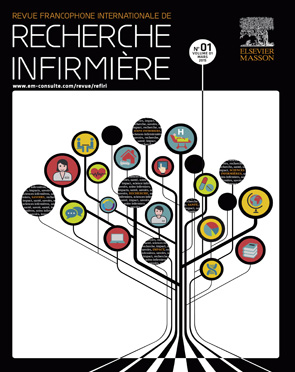

## Document page 1

Pour citer cet article : Busnel C, et al. Complexité des prises en soins à domicile : développement d’un outil d’évaluation infirmier et résultat d’une étude d’acceptabilité. Revue francophone internationale de recherche infirmière (2018), https://doi.org/10.1016/j.refiri.2018.02.002

ARTICLE IN PRESS Modele + REFIRI-127; No. of Pages 8

Revue francophone internationale de recherche infirmière (2018) xxx, xxx-xxx

Disponible en ligne sur

ScienceDirect www.sciencedirect.com

INSTRUMENT DE MESURE /Évaluation

Complexité des prises en soins à domicile : développement d’un outil d’évaluation infirmier et résultat d’une étude d’acceptabilité

Complexity in home care: Development of an assessment tool dedicated to nurses

and results

of an acceptability study

Catherine

Busnel (BScN) (Infirmière, directrice a.i du service

des pratiques professionnelles et responsable de

l’unité recherche & développement) ∗, Laurent Marjollet

(BScN) (Infirmier, spécialiste clinique), Olivier

Perrier-Gros-Claude (BScN) (Infirmier, directeur

des opérations)

Institution

genevoise de maintien à domicile (imad), 36, avenue Cardinal-Mermillod, 1731-1227,

Carouge, Suisse

Rec¸u

le 3 juillet 2017 ; rec¸u sous la forme révisée le 12 janvier 2018 ; accepté le 8 f´evrier 2018

MOTS CLÉS Acceptabilité ; Évaluation ; Prise en soin complexe

; Soins

infirmiers à domicile

Résumé Le vieillissement de la population, l’accroissement des maladies chroniques et l’augmentation

de la prévalence de la multimorbidité complexifient les prises en soins des patients.

Les infirmières se doivent d’intégrer ces différentes dimensions dans leur pratique quotidienne

en évaluant précocement les situations de prises en soins dites « complexes ». Pour

répondre à cette nécessité, l’Institution genevoise de maintien à domicile (imad) a développé

un instrument de complexité multidimensionnel (COMID). Dans le cadre de cette étude, la notion

de complexité a été considérée comme une accumulation de facteurs multidimensionnels

∗Auteur correspondant. Adresse e-mail : catherine.busnel@imad-ge.ch (C. Busnel).

https://doi.org/10.1016/j.refiri.2018.02.002 2352-8028/© 2018 Elsevier Masson SAS. Tous droits r´eserv´es.

## Document page 2

Pour citer cet article : Busnel C, et al. Complexité des prises en soins à domicile : développement d’un outil d’évaluation infirmier et résultat d’une étude d’acceptabilité. Revue francophone internationale de recherche infirmière (2018), https://doi.org/10.1016/j.refiri.2018.02.002

ARTICLE IN PRESS Modele + REFIRI-127; No. of Pages 8

2 C. Busnel et al.

intégrant les 6 dimensions: médicale, socioéconomique, mentale, comportementale, d’instabilité

et celle relative aux intervenants du système de soins. Cette étude a aussi visé l’acceptabilité

par les infirmières d’utiliser cet instrument. Les résultats obtenus, auprès de 44 infirmières, sur la simplicité, l’utilité et la pertinence de l’instrument sont extrêmement encourageants

et incitent à poursuivre le développement de l’outil proposé. © 2018 Elsevier Masson SAS. Tous droits r´eserv´es.

KEYWORDS Acceptability; Assesment; Complexity

in home care; Home

care

Summary Population aging as well as increasing rates of non-communicable diseases and multimorbidities

heavily contribute to enhance complexity in home care delivery. The early identification and evaluation of so-called ‘‘complex’’ situation need to be integrated in routine

practice. In response to these needs, the Genova Institution for home care and assistance (imad)

developed a multidimensional complexity scale (COMID) for everyday use by nurses. In the

COMID,

complexity was operationalized along six dimensions, which cover medical, socioeconomic,

mental

and behavioral issues, as well as instability and density of the care network. The

present paper describes the rational underlying the development of the COMID and provides a

detailed

description of the instrument. This description is complemented by the results of acceptability

study conducted with

44 home care nurses. The results demonstrated that nurses perceived the COMID as easy-to-use, useful and relevant for the practice. These encouraging results support further development of the COMID to pursue the identification on complexity in home care practice. © 2018 Elsevier Masson SAS. All rights reserved.

Aujourd’hui, la Suisse comme de nombreux pays industrialisés est confrontée à un important défi dans les prises en soins

des personnes atteintes de maladies chroniques et multimorbides. Le contexte de vieillissement de la population [1] et le virage ambulatoire visant la réduction des durées de séjours

hospitaliers, compliquent de plus en plus les prises en

soins des patients et plus particulièrement celles des personnes

âgées [2]. Face à la diversification des besoins de soins, les professionnels de santé et notamment les infirmières

ont un rôle central à jouer. À

Genève, la

politique sanitaire en faveur du maintien à domicile nécessite la continuité des soins dans un réseau structuré,

coordonné et de proximité conduisant à la participation

active de l’ensemble des acteurs de soins (patient, proche

aidant, médecin traitant et autres professionnels des

soins) [3]. Ainsi, le développement des approches interprofessionnelles devient essentiel et oblige l’ensemble des acteurs

à avoir une approche systémique, dynamique, anticipatrice

et adaptable en permanence [4]. Néanmoins, la prise en charge en silo par une trop faible coordination amène

encore à des décisions de soins contradictoires ou incohérentes

avec des impacts non négligeables tels que des hospitalisations prématurées (concept de la porte tournante

« revolving door » [5]), des polymédications accrues [6] ainsi que la perte de sens thérapeutique à la fois pour les patients,

les proches et les soignants. Une prise en charge en vase clos a des conséquences à la fois pour les personnes atteintes

dans leur santé, pour le réseau de soin et pour la société,

car elle engendre une augmentation des coûts de la santé non négligeable [7] mettant sous tension l’ensemble des

différents systèmes.

La complexité et les approches conceptuelles

La complexité est au cœur des réflexions scientifiques depuis les années 1960s, toutes disciplines confondues (physique, chimie, biologie, économie) [8], mettant en avant les interactions non linéaires, dynamiques, multiples avec de nombreuses boucles de rétroaction [9]. La théorie de la complexité

s’est progressivement introduite dans tous les champs

de la société et s’est naturellement implémentée dans le domaine de la santé [10]. Ainsi, la notion de soins infirmiers en tant que complexité a été intégrée par de nombreux

auteurs au cours des dernières décennies [11], s’inscrivant dans un courant humaniste avec des approches psychologiques et relationnelles [12]. Ces modèles de santé ont

évolué passant du modèle biomédical « faire pour » [13], au modèle biopsychosocial « faire avec » [14], jusqu’au modèle

holistique « être avec ». L’approche systémique est devenue

une référence dans la société et dans les organisations

de travail et de santé prenant en compte l’individu, ses interactions, et l’organisation tant micro que macro [10]. Ce modèle prend tout son sens dans les prises en soin des patients

ayant une maladie chronique [15]. Le Chronic Care Model

[16] vise à des prises en charge intégrant le système de santé, les prestations de soins, l’aide à la décision, les systèmes

d’information, l’environnement et la capacité d’auto prise

en charge de manière continue, coordonnée et proactive. Face à ces différents défis, un accompagnement des professionnels

habitués à des prises en soins plus standardisées et plus linéaires [17] est nécessaire.

## Document page 3

Pour citer cet article : Busnel C, et al. Complexité des prises en soins à domicile : développement d’un outil d’évaluation infirmier et résultat d’une étude d’acceptabilité. Revue francophone internationale de recherche infirmière (2018), https://doi.org/10.1016/j.refiri.2018.02.002

ARTICLE IN PRESS Modele + REFIRI-127; No. of Pages 8

Complexité des prises en soins à domicile 3

À domicile, les professionnels se retrouvent face à différentes

interactions comme les facteurs médicaux, contextuels

et personnels qui créent des situations plus difficilement gérables et nécessitent un travail en réseau avec des liens interprofessionnels forts. Pour ce faire, ce changement

de paradigme [18] « suggère des rapports égaux entre professions qui visent un même but, nécessite non seulement

de connaître la spécificité et les compétences de chacun mais aussi d’abandonner les schémas hiérarchiques pour

se concerter, prendre et porter ensemble la responsabilité

des décisions prises ». Ainsi, dans cette perspective, l’infirmière a un rôle primordial à jouer.

La complexité et les approches empiriques

Si au cours des dix dernières années, le concept de la complexité

a évolué sans permettre une définition unanime [19], ni une description et opérationnalisation précise [20],

la complexité dans la santé peut être définie comme l’impact global d’une maladie prenant en compte des aspects

non

liés directement à la maladie première [21] et incluant

des difficultés diverses selon les disciplines de santé et les modèles [22,23]. Différentes études ont mis en lumière la complexité dans trois grandes directions:

• celle

des prises

en soins (« care complexity ») [24];

• celle relative à la complexité des cas (« case complexity ») [24];

• et

celle liée

à la complexité des besoins des patients [25].

Dans

une perspective d’anticipation et d’adaptation des professionnels, des grilles ont été déclinées telles que l’outil INTERMED [26], le Patient Centered Assesment Method (PCAM)

[17], elles répondent le plus souvent au besoin du monde

médical

et de l’univers hospitalier [27]. En revanche, aucun

instrument n’a été adapté spécifiquement aux pratiques infirmières pour les soins à domicile. À l’heure du virage ambulatoire,

du vieillissement de la population et de l’augmentation des maladies chroniques

et multimorbides, l’infirmière à domicile

est un acteur clé pour l’identification des patients complexes.

La complexité et le repérage

Face aux situations de patients ayant des caractéristiques cliniques

complexes, chroniques et fluctuantes [28] à risque élevé de décompensation et de réadmission hospitalière [29], la réactivité et la coordination de l’ensemble des acteurs

formels ou informels sont essentiels pour éviter des résultats indésirables [30]. L’apport de tous les éléments de

l’évaluation globale et spécifique lors de la coordination interprofessionnelle

est fondamental pour une compréhension

commune de la situation [30]. Aussi, pour évaluer les besoins

requis des personnes adultes recevant des soins, l’infirmière

de l’institution genevoise de maintien à domicile (imad) utilise en routine le Resident Assesment Instrument Home Care

(RAI-HC) [31] adapté pour la Suisse. Cet instrument

comporte 18 domaines de santé et génère par des scores composites, 30 alarmes et quatre échelles de performance, qui indiquent aux professionnels les principaux

risques et problèmes de santé de la personne évaluée.

Il permet, sur la base des informations collectées auprès des

personnes bénéficiant de soins et/ou de leur proche aidant,

de réaliser une analyse clinique, d’établir des plans d’interventions ciblés et de déterminer les prestations adaptées [32]. Si le RAI-HC permet d’obtenir un état des lieux global

de la situation, certains éléments de la complexité ne sont pas spécifiés avec cet outil. Ainsi, les infirmières ont évoqué leurs difficultés à le mobiliser en ce sens. C’est pour répondre à ce besoin qu’un travail de développement a été mené afin d’apporter un nouvel outil de repérage pour une identification commune, rapide et ajustée de la complexité des

prises en soins à domicile. Le processus mis en place s’est

basé sur les étapes d’une participation consultative [33] de proximité dont l’objectif a été l’élaboration d’un instrument

structuré et bénéficiant d’une bonne acceptation par les professionnels en complément du RAI-HC.

Objectifs

Cette étude a eu deux objectifs: celui de développer un instrument

de complexité d’évaluation multidimensionnelle (COMID) pour les patients recevant des soins infirmiers à domicile

en déterminant les domaines, les items et la structure; et celui d’évaluer l’acceptabilité du COMID par les infirmières des soins à domicile. Le

bénéfice attendu de l’étude est la description d’un instrument d’évaluation de la complexité, d’utilisation simple et bénéficiant d’une bonne acceptabilité par les infirmières qui auront l’usage de l’instrument proposé.

Méthode

Cette étude s’est faite en plusieurs étapes :

• la détermination des dimensions de la complexité;

• la désignation des items pour chaque dimension;

• le choix de la structure;

• l’évaluation

de l’acceptabilité du COMID par les infirmières des soins à domicile.

Détermination des choix des dimensions

L’instrument

d’évaluation présenté se réfère à la littérature de

la complexité en intégrant le « case complexity » [24] et la

« care complexity » [24]. Pour ce qui concerne le « case complexity », quatre facteurs

majeurs identifiés [22] ont été retenus: médicaux; socio-économiques;

de maladie mentale; et de comportement aggravant l’état de santé du patient avec des maladies chroniques. Ces dimensions sont résumées dans le Tableau 1. Pour

ce qui concerne la « care complexity », la dimension relative

à la coordination des soins avec de multiples acteurs socio-sanitaires

a été incluse [23]. À

ces cinq dimensions a été intégrée celle d’instabilité, très présente dans la population âgée multimorbide et tant

problématique pour la prise de décisions du maintien à domicile ou dans le cas des réadmissions cycliques d’hospitalisation

[5]. Ainsi, l’instrument de complexité domiciliaire,

COMID, proposé dans cette étude est constitué de

six dimensions soient:

## Document page 4

Pour citer cet article : Busnel C, et al. Complexité des prises en soins à domicile : développement d’un outil d’évaluation infirmier et résultat d’une étude d’acceptabilité. Revue francophone internationale de recherche infirmière (2018), https://doi.org/10.1016/j.refiri.2018.02.002

ARTICLE IN PRESS Modele + REFIRI-127; No. of Pages 8

4 C. Busnel et al.

Tableau 1 Typologie de la complexité des patients selon Loeb et al. [22], p. 452 (traduction libre).

Complexité médicale Facteurs socio-économiques aggravant l’état de santé Maladie mentale aggravant l’état de santé Caractéristiques et comportement du patient

Conditions médicales (ou

état de santé) discordantes Douleur

chronique Allergie/intolérance aux

médicaments Symptômes inexpliquésProblèmes cognitifs

Difficulté

à payer les soins et incapacités

à supporter financièrement les traitements/transports Facteur

de stress familial Faible

niveau de littéracie (ou alphabétisation) en santé

Dépression

conduisant à une mauvaise

observance du traitement Addiction Anxiété

rendant le tableau clinique

confus

Demandeur (d’examen, de traitement) Querelleur

avec l’équipe soignante

ou les médecins Anxieux (face aux symptômes)

d’explication et d’information complémentaire

concernant son

état de santé

• les

facteurs de santé médicale au regard des affections chroniques

et polymorbides;

• les

facteurs

socio-économiques aggravant l’état de santé pour lesquels un

contexte socio-économique fragilise encore plus les soins et la prise en soin à domicile;

• les facteurs

de santé mentale aggravant l’état de santé pouvant mettre au second plan

des problèmes de santé somatiques;

• les

facteurs

comportementaux pouvant mettre en échec l’organisation des soins;

• les facteurs d’instabilité et de détérioration de l’état de santé

par des phases aiguës et subites;

• et les facteurs relatifs aux intervenants et système de santé concernant le sens des prises en soins et les pressions

individuelles et/ou collectives des professionnels.

La désignation des items pour chaque dimension

Chaque dimension a été déclinée avec des items descriptifs se basant pour 4 d’entre eux sur ceux déjà déclinés par Loeb [22] (Tableau 1). Si différentes études se sont basées

sur des nombres de domaines et d’items différents (de 3 à 5 domaines pour moins de 15 items) [34,35], le choix des items du COMID s’est porté pour un nombre de 5 pour chacune

des 6 dimensions comme celle considérée pour la complexité médicale [22] et développée par Searle dans le

cadre de la fragilité. Ses recommandations méthodologiques

ont été appliquées ici pour la complexité permettant d’en

faire un indicateur global et un construit clinique [36] suffisamment détaillé. Le choix du même nombre d’items par

domaine établit permet ainsi une relation comptable égalitaire

entre les 6 domaines. De plus, la cohérence des items s’est basée, tant que possible, sur les données recherchées

au moyen du RAI-HC et habituellement mobilisés par

les infirmières. Cependant, le RAI-HC ne permettant pas

d’obtenir directement tous les éléments de la complexité,

d’autres aspects ont été considérés et développés comme pour les facteurs relatifs aux intervenants et système de

soins

(partenariat, incohérence thérapeutique, lourdeur émotionnelle)

et les éléments d’imprévisibilité de l’état de santé (apparition de symptômes inhabituels, décompensation d’une pathologie chronique).

Le choix de la structure

Le COMID a un format, à l’instar de l’INTERMED [26] d’un questionnaire

fermé plutôt qu’ouvert ou semi-structuré. Il intègre la logique des questions du RAI-HC pour le choix des questions fermées et a été élaboré sous forme d’une checklist.

Aussi, chaque item est codé en mode binaire (non = 0; oui

= 1). Ainsi, pour chaque domaine un score maximal de 5, soit un total pour l’ensemble de l’instrument de 30. Cet instrument se veut être une aide à la décision pour repérer les éléments de la complexité et non un outil de graduation de la complexité. Il

associe

et réorganise les informations récoltées au cours de l’entretien d’évaluation des besoins. Il intègre de nouveaux éléments et combine les données par un algorithme simple

venant compléter les alarmes et les échelles du RAI-HC, et il synthétise les aspects de la complexité rencontrés par les infirmières à

domicile. Ainsi, les étapes de la construction [37] du COMID ont inclus:

• les

connaissances actuelles de la littérature en termes de complexité

et d’évaluation à domicile;

• l’énumération des différents facteurs de complexité;

• l’énumération des contenus de chaque dimension.

L’échelle

telle que développée est présentée dans la Fig.

1. Après l’élaboration de cet instrument il a été proposé à un panel d’infirmières afin d’évaluer son acceptabilité.

L’évaluation de l’acceptabilité du COMID par les

infirmières des soins à domicile

L’étude d’acceptabilité a été conduite auprès de 44 infirmières

travaillant dans 20 équipes d’imad. Chacune d’entre elles

a répondu à un bref questionnaire sociodémographique, afin de disposer des informations concernant le sexe,

l’année d’obtention du diplôme d’infirmière, leur nombre

d’années d’expérience aux soins à domicile. Un échantillonnage de commodité a été effectué, avec pour

seul critère d’inclusion que les participants disposent d’une

situation vécue comme « complexe » dans leur prise en

soin. Cette situation a été utilisée comme une aide individuelle à l’identification structurée de la complexité et pour

permettre un ancrage clinique servant à la simplicité

## Document page 5

Pour citer cet article : Busnel C, et al. Complexité des prises en soins à domicile : développement d’un outil d’évaluation infirmier et résultat d’une étude d’acceptabilité. Revue francophone internationale de recherche infirmière (2018), https://doi.org/10.1016/j.refiri.2018.02.002

ARTICLE IN PRESS Modele + REFIRI-127; No. of Pages 8

Complexité des prises en soins à domicile 5

| Dimension / item | Non = 0 | Oui = 1 |
| --- | --- | --- |
| 1. Facteurs de santé médicale |  |  |
| a. Plusieurs maladies chroniques (>2) et/ou symptôme(s) inexpliqué(s) |  |  |
| b. Douleurs chroniques |  |  |
| c. Allergie et/ou intolérance médicamenteuse |  |  |
| d. Polymédication (>5) |  |  |
| e. Troubles cognitifs |  |  |
| Sous-score |  | /5 |
| 2. Facteurs socio-économiques aggravant l’état de santé |  |  |
| a. Difficultés financières et/ou incapacité à supporter financièrement des prestations d’aide et de soins et/ou de traitements et/ou de moyens auxiliaires et/ou de transports et/ou d’alimentation |  |  |
| b. Absence ou épuisement du proche aidant et/ou tensions familiales |  |  |
| c. Faible niveau de littératie |  |  |
| d. Isolement social |  |  |
| e. Logement inadapté et/ou barrière environnementale |  |  |
| Sous-score |  | /5 |
| 3. Facteurs de santé mentale aggravant l’état de santé |  |  |
| a. Dépression et/ou idées suicidaires |  |  |
| b. Maladie psychiatrique et/ou troubles psychiques |  |  |
| c. Addiction |  |  |
| d. Anxiété ou angoisse rendant le tableau clinique confus |  |  |
| e. Fonctions mentales variant au cours de la journée |  |  |
| Sous-score |  | /5 |
| 4. Facteurs comportementaux du client |  |  |
| a. Sollicitations récurrentes du réseau primaire et/ou secondaire |  |  |
| b. Communication ambivalente et/ou conflictuelle avec l’un des membres du réseau primaire et/ou secondaire |  |  |
| c. Inquiétude face à ses symptômes et/ou état de santé et/ou aux informations médicales reçues |  |  |
| d. Agressivité (verbale et/ou physique) ou mutisme |  |  |
| e. Résistance ou opposition aux soins, qu’elle soit active ou passive |  |  |
| Sous-score |  | /5 |
| 5. Facteurs d’instabilité |  |  |
| a. Dégradation récente de l’état de santé ressentie par le client |  |  |
| b. Changement global du degré d’indépendance (AVQ/AIVQ) lors du dernier mois |  |  |
| c. Période de transition (p. ex. : annonce diagnostic, retour hospitalisation, décès proche aidant) |  |  |
| d. Changement aigu des capacités cognitives |  |  |
| e. Non prévisibilité de l’état de santé (p. ex. : apparition de symptômes inhabituels, décompensation d’une pathologie chronique) |  |  |
| Sous-score |  | /5 |
| 6. Facteurs relatifs aux intervenants et système de soins |  |  |
| a. Multitude d’intervenants dans le réseau secondaire (médecin traitant, spécialiste, soignant, curateur, etc.) |  |  |
| b. Absence ou faible degré de partenariat entre les différents intervenants du réseau primaire et/ou secondaire |  |  |
| c. Incohérence thérapeutique et/ou perte de sens dans la prise en charge du point de vue du professionnel |  |  |
| d. Problème d’assurance (p. ex. : limitation du remboursement de prise en charge) |  |  |
| e. Lourdeur émotionnelle et/ou physique de la prise en charge ressentie par les membres du réseau secondaire (médecins, soignants) |  |  |
| Sous-score |  | /5 |
| Score total |  | /30 |

Figure 1. Instrument d’évaluation de la complexité multidimensionnelle pour les pratiques infirmières à domicile (COMID). © C. Busnel

d’utilisation, à l’utilité et à la pertinence de l’instrument proposé. L’étude a été réalisée entre janvier et juin 2017. Pour

évaluer l’acceptabilité du COMID, les infirmières ont

rempli

l’instrument de complexité sur un client qu’elles avaient

au préalable identifié comme « complexe » dans leur pratique domiciliaire. Les infirmières ont coché les cases correspondant à la situation de leur patient et ont obtenu des

sous-scores pour les 6 dimensions, ainsi qu’un score total compris

entre 0 et 30. Suite au remplissage de l’instrument, la première étape d’acceptabilité

a consisté à questionner les infirmières sur:

• la

simplicité d’utilisation;

• l’utilité;

• la

pertinence pour identifier la complexité des patients suivis

à

domicile;

• la

recommandation de l’utilisation de l’instrument à leurs paires.

Les évaluations ont été effectuées à l’aide d’échelles nominales à deux modalités de réponse oui/non. En cas de réponse

négative pour chacune des 4 questions, il a été proposé

que leur choix soit explicité.

## Document page 6

Pour citer cet article : Busnel C, et al. Complexité des prises en soins à domicile : développement d’un outil d’évaluation infirmier et résultat d’une étude d’acceptabilité. Revue francophone internationale de recherche infirmière (2018), https://doi.org/10.1016/j.refiri.2018.02.002

ARTICLE IN PRESS Modele + REFIRI-127; No. of Pages 8

6 C. Busnel et al.

Les données ont été collectées et analysées dans un objectif

d’amélioration de la pratique infirmière et de la qualité

des soins. Les participants ont rec¸u un identifiant numérique individuel aléatoire ne permettant pas leur identification pour l’analyse statistique et la publication des résultats.

Résultats

L’instrument de complexité multidimensionnelle (COMID) intégrant

les 6 dimensions a été développé et est présenté dans la Fig. 1. L’échantillon

de professionnels infirmiers qui ont testé cet instrument sont majoritairement des femmes (33 vs 11). La durée médiane, depuis l’obtention du diplôme, est de

15 années (min. 4-max. 36). Leur expérience dans le domaine domiciliaire à imad est faible (moins de 2 ans) pour trois

d’entre elles, moyenne (de 2 à 5 ans) pour 15 professionnels, importantes (de 5 à 10 ans) pour 13 d’entre elles, et très importante (plus de 10 ans) pour 13 infirmières. Vingt-six

présentent une expérience à imad de plus de 5 ans. Les

44 infirmières, à la suite de la journée de formation,

ont déclaré que l’instrument de complexité est simple d’utilisation (n = 40), utile (n = 42) et pertinent (n = 42) pour identifier

la complexité de la prise en soin du patient. Pour

la question relative à la simplicité d’utilisation, quatre soignants ont apporté une réponse négative; trois ont complété

leur réponse en qualifiant les items de « trop subjectif », « de manque de temps pour l’utiliser actuellement dans

sa pratique quotidienne », « tenir compte des désirs et priorités du client ». Pour

la question concernant son utilité, deux réponses négatives

ont

été renseignées et précisées de la manière suivante:

« pas toujours adapté », « pas de norme dans la complexité, dépendant de chaque intervenant selon ses capacités ». Pour

la question

sur la pertinence, les deux réponses négatives n’ont pas fait l’objet de commentaires. L’ensemble

des 44

professionnels infirmiers recommande son utilisation par d’autres paires. Le fait d’avoir évalué un patient perc¸u comme complexe au préalable a grandement favorisé le remplissage et sa compréhension.

Discussion

Si beaucoup d’études ont discuté du concept de complexité, son

utilisation est en général encore peu répandue [19]. Si des modèles et instruments sont développés pour les milieux hospitaliers

[27,38], ils font aujourd’hui encore cruellement défaut

dans les pratiques domiciliaires. Cependant, dans un contexte politique favorisant

le maintien à domicile et les soins intégrés adaptés aux besoins d’une population vieillissante, souvent polymorbide, les infirmières à domicile ont un

rôle grandissant à jouer dans l’identification précoce de patients

en situations « complexes » et dans l’adaptation des prestations de soin. Le

développement d’outils cliniques permettant de mener

à bien cette mission est donc, non seulement essentiel,

mais également attendu par des professionnels

qui souhaitent améliorer leurs pratiques, la qualité

des soins prodigués et l’individualisation des prises en charges

en partenariat avec l’ensemble des acteurs de soins

(patient, proche aidant, médecins et professionnels de santé). Le RAI-HC bien que complet, ne permet pas une estimation ciblée et rapide de la complexité (situation

du patient, de son environnement, de son système de soins). C’est pour pallier à cette absence que la présente étude a été initiée, afin de répondre aux attentes des infirmières en termes d’évaluation spécifique. Elle a visé le développement d’un instrument d’évaluation multidimensionnelle de la complexité dans les pratiques domiciliaires, qui

intègre une check-list déclinant 6 dimensions de la complexité-retenues

sur la base des données disponibles dans la littérature [26,39] et couvrant la complexité inhérente

au patient (case complexity [24]), à la prise en soins (care complexity [24]), mais aussi un aspect souvent

implicite, mais caractéristique des prises en soins « complexes » [40]: l’instabilité. Cet instrument souhaite considérer à la manière de Shippee et al. [23] la complexité comme

une accumulation de facteurs multidimensionnels qui interagissent

de manière dynamique, et trop souvent imprévisible. Par

le développement de cet instrument et pour initier la démarche de validation, une étude d’acceptabilité a été menée

auprès d’un échantillon d’infirmières, qui ont émis un

avis positif à l’utilisation, la pertinence et la simplicité d’utilisation

de l’échelle proposée. Elles ont également toutes soutenu le fait de recommander l’outil à d’autres collègues infirmières. On

pourra également relever qu’aucune distinction n’a été mise en évidence entre infirmières possédant

différentes durées d’expérience ou de sensibilisation préalable à la complexité. Ainsi, la plus-value de l’utilisation de l’échelle est relevée, y compris par les infirmières expérimentées (diplômées de plus de 10 ans) ayant une solide expérience des soins à domicile. Les

résultats obtenus dans cette première phase de développement

sont donc extrêmement encourageants et incitent à poursuivre le développement de l’outil proposé, notamment par une étude d’utilisabilité à plus large échelle. À

l’issue de celle-ci, des données suffisamment nombreuses et étoffées devront aussi permettre d’évaluer les caractéristiques

métrologiques et / ou psychométriques de l’échelle, une étape indispensable à l’implémentation de l’outil dans la

pratique en mode routine.

Les limites de cette étude

Parmi les limites à relever dans cette étude, on peut mentionner

la faible représentativité de l’échantillon au regard de

la diversité de l’expérience et du parcours de formation des professionnels infirmiers. En effet, les participants à

l’étude sont majoritairement des infirmières avec une importante

expérience dans les soins infirmiers et dans le domaine domiciliaire. Elles sont également au bénéfice

d’une formation centrée sur la discipline, mais n’ayant pas

intégré une approche interprofessionnelle à hauteur de ce

qui est développé actuellement. Plus généralement, on peut penser que l’expérience et le contenu de la formation peuvent

avoir un impact sur la capacité à identifier les différents

éléments de la complexité. Dans les étapes ultérieures du développement proposé, il paraîtrait pertinent d’évaluer

## Document page 7

Pour citer cet article : Busnel C, et al. Complexité des prises en soins à domicile : développement d’un outil d’évaluation infirmier et résultat d’une étude d’acceptabilité. Revue francophone internationale de recherche infirmière (2018), https://doi.org/10.1016/j.refiri.2018.02.002

ARTICLE IN PRESS Modele + REFIRI-127; No. of Pages 8

Complexité des prises en soins à domicile 7

son acceptabilité sur un échantillon plus représentatif de l’ensemble

de la population infirmière.

Conclusion

Cette étude est la première étape dans le développement d’un

outil de complexité multidimensionnelle, structuré à destination

des infirmières pratiquant des soins à domiciles. Le

COMID s’inscrit en complémentarité de projets interprofessionnels et interinstitutionnels dans le canton de Genève. L’évaluation de la complexité est une étape incontournable pour mettre rapidement en œuvre des stratégies ciblées, pour améliorer la qualité et la sécurité des soins et permettre la diminution des hospitalisations inappropriées, des réhospitalisations

prématurées, et ainsi contribuer au maintien

à

domicile des patients. À l’issue de la démarche de développement et de validation de l’outil, les infirmières

pourront bénéficier d’un instrument fiable,

efficace et pertinent pour identifier la complexité dans leur pratique et

mieux adapter la mise en place de

prestations de soins. Elles pourront ainsi optimiser leur rôle notamment dans

la coordination des prises en soins dans une

pratique domiciliaire intégrée

et de proximité. La deuxième

étape de cette étude sera d’évaluer des propriétés

métrologiques et / ou psychométriques de l’instrument, et la faisabilité d’une utilisation en routine en complément du

RAI-HC.

Remerciements

Nous remercions les professionnels des soins à domicile pour leur participation à cette étude, à Catherine Ludwig pour son

appui méthodologique, et Tiziana Corvaglia pour sa relecture.

Déclaration de liens d’intérêts

Les auteurs déclarent ne pas avoir de liens d’intérêts.

Références

[1] Office fédéral de la statistique (OFS). La population de la Suisse 2014. Neuchâtel, Suisse: OFS; 2015. [2] Höpflinger F, Bayer-Oglesby L, Zumbrunn A. La dépendance des personnes âgées et les soins de longue durée. Scénarios actualisés pour la Suisse [Dependency of older persons and long-term care: updated scenarios for Switzerland]. Bern, Switzerland: Hans Huber Verlag; 2011. [3] Schusselé-Filletaz S, Marjollet L, Perone N, Budan F, Rosenberg A. Le plan de soins partagé informatisé. Soins Infirm 2016;10:72-3. [4] Charron DF. La recherche écosanté en pratique. Applications novatrices d’une approche écosystémique de la santé. New York: Springer-Verlag; 2014. [5] Joyce PR, Khan A, Jones AV. The revolving door patient. Comp Psych 1981;22(4):397-403. [6] Frazier SC. Health outcomes and polypharmacy in elderly individuals: an integrated literature review. J Geront Nurs 2005;31(9):4-11.

[7] Roth S, Pellegrini S. Virage ambulatoire. Transfert ou expansion de l’offre de soins? (Obsan Rapport N◦68). Neuchâtel, Suisse: Observatoire suisse de la santé; 2015. [8] Anderson RA, Issel LM, McDaniel RR. Nursing homes as complex adaptive systems: relationship between management practice and resident outcomes. Nursing Res 2003;52(1):12-21. [9] Cilliers P. Complexity and postmodernism: understanding complex systems. New York: Routledge; 1998. [10] Chandler J, Rycroft-Malone J, Hawkes C, Noyes J. Application of simplified complexity theory concepts for healthcare social systems to explain the implementation of evidence into practice. J Adv Nursing 2016;72(2):461-80. [11] Parker ME, Smith MC. In: Edition T, editor. Nursing theories and nursing practices. Philadelphia: United Stated of America: Davis Company; 2010. [12] Kerouac S, Pepin J, Ducharme F, Duquette A, Major F. La pensée infirmière. Laval-Québec: Etudes vivantes; 1994. [13] Engel GL. The need for a new medical model: a challenge for biomedicine. Science 1977;196(4286):129-36. [14] Engel GL. The clinical application of the biopsychosocial model. Am J Psychiatry 1980;137(5):535-44. [15] Wagner EH. Chronic disease management: what will it take to improve care for chronic illness? Effective Clin Pract 1998;1(1):2-4. [16] Bodenheimer

T,

Wagner EH, Grumbach K. Improving primary care for patients with chronic illness: the chronic care model, part 2. JAMA 2002;288(15):1909-14. [17] Peek CJ, Baird MA, Coleman E. Primary care for patient complexity, not only disease. Fam Syst Health 2009;27(4):287-302. [18] Coppet Pia. L’indispensable interprofessionnalité des soins. Rev Int Soins Palliatifs 2010;25:147-8. [19] Manning E, Gagnon M. The complex patient: a concept clarification. Nurs Health Sci 2017;19(1):13-21. [20] Thompson DS, Fazio X, Kustra E, Patrick L, Stanley D. Scoping review of complexity theory in health services research. BMC Health Serv Res 2016;16:87. [21] Valderas JM, Starfield B, Sibbald B, Salisbury C, Roland M. Defining comorbidity: implications for understanding health and health services. Ann Fam Med 2009;7(4):357-63. [22] Loeb DF, Binswanger IA, Candrian C, Bayliss EA. Primary care physician insights into a typology of the complex patient in primary care. Ann Fam Med 2015;13(5):451-5. [23] Shippee ND, Shah ND, May CR, Mair FS, Montori VM. Cumulative complexity: a functional, patient-centered model of patient complexity can improve research and practice. J Clin Epidemiol 2012;65(10):1041-51. [24] de Jonge P, Huyse FJ, Stiefel FC. Case and care complexity in the medically ill. Med Clin N Am 2006;90(4):679-92. [25] de Jonge P, Huyse FJ, Herzog T, Lobo A, Slaets JPJ, Lyons JS, et al. Risk factors for complex care needs in general medical inpatients: results from a European Study. Psychosomatics 2001;42(3):213-21. [26] Huyse FJ, Lyons JS, Stiefel FC, Slaets JP, de Jonge P, Fink P, et al. INTERMED: a method to assess health service needs. I. Development and reliability. Gen Hosp Psychiat 1999;21(1):39-48. [27] Stiefel FC, Huyse FJ, Sollner W, Slaets JP, Lyons JS, Latour CH, et al. Operationalizing integrated care on a clinical level: the INTERMED project. Med Clin N Am 2006;90(4):713-58. [28] Christensen CM, Bohmer R, Kenagy J. Will disruptive innovations cure health care? Harv Bus Rev 2000;78(5) [102-12,99]. [29] Kripalani S, Theobald CN, Anctil B, Vasilevskis EE. Reducing hospital readmission: current strategies and future directions. Ann Rev Med 2014;65:471-85. [30] Di Pollina L, Guessous I, Petoud V, Combescure C, Buchs B, Schaller P, et al. Integrated care at home reduces unnecessary hospitalizations of community-dwelling frail older adults: a prospective controlled trial. BMC Geriatrics 2017; 17(1):53.

## Document page 8

Pour citer cet article : Busnel C, et al. Complexité des prises en soins à domicile : développement d’un outil d’évaluation infirmier et résultat d’une étude d’acceptabilité. Revue francophone internationale de recherche infirmière (2018), https://doi.org/10.1016/j.refiri.2018.02.002

ARTICLE IN PRESS Modele + REFIRI-127; No. of Pages 8

8 C. Busnel et al.

[31] Morris JN, Fries BE, Steel K, Ikegami N, Bernabei R, Carpenter GI, et al. Comprehensive clinical assessment in community setting: applicability of the MDS-HC. J Am Geriatrics Soc 1997;45(8):1017-24. [32] Busnel C, Mastromauro L, Zecca W, Ludwig C. Le RAI-Home Care : utilisation, potentiels et limites dans les soins à domicile. Gerontol Soc 2017;39:167-82. [33] Lescarbeau R, Payette M, St-Arnaud Y. Profession: consultant. 4e ed Montréal: Canada: Gaëtan Morin; 2003. [34] Stiefel FC, de Jonge P, Huyse FJ, Slaets JP, Guex P, Lyons JS, et al. INTERMED-an assessment and classification system for case

complexity. Results in patients with low back pain. Spine 1999;24(4):378-84 [discussion 85]. [35] Pratt R, Hibberd C, Cameron IM, Maxwell M. The patient centered assessment method (PCAM): integrating the social dimensions of health into primary care. J Comorbidity 2015;5(1):10. [36] Searle S, Mitnitski A, Gahbauer E, Gill T, Rockwood K. A standard procedure for creating a frailty index. BMC Geriatrics 2008;8:24.

[37] Tenn L. Développement d’un instrument de mesure d’intégration des soins de santé primaires dans les programmes universitaires de sciences infirmières au Canada. Rech Soins Infirm 1994;39:63-70. [38] Hong CS, Atlas SJ, Ashburner JM, Chang Y, He W, Ferris TG, et al. Evaluating a model to predict primary care physician-defined complexity in a large academic primary care practice-based research network. J Gen Int Med 2015;30(12): 1741-7. [39] Yoshida S, Matsushima M, Wakabayashi H, Mutai R, Murayama S, Hayashi T, et al. Validity and reliability of the patient centred assessment

method for patient complexity and relationship with hospital length of stay: a prospective cohort study. BMJ Open 2017;7(5):e016175. [40] Berry LL, Rock BL, Smith Houskamp B, Brueggeman J, Tucker L. Care coordination for patients with complex health profiles in inpatient and outpatient settings. Mayo Clin Proc 2013;88(2):184-94.
