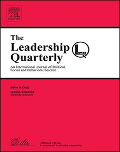
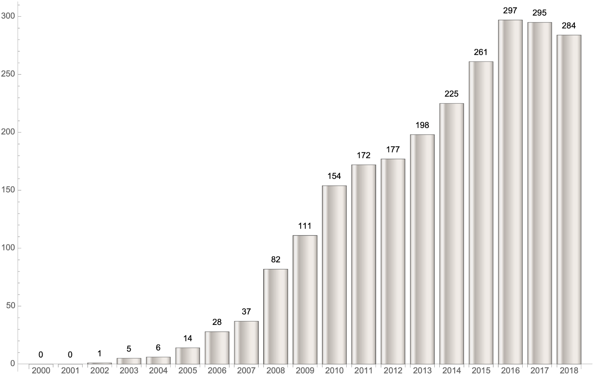

## Document page 1

Contents lists available at ScienceDirect

The Leadership Quarterly

journal homepage: www.elsevier.com/locate/leaqua

Full length article

Complexity theory and leadership practice: A review, a critique, and some recommendations

Jonathan Rosenheada, L. Alberto Francob,c,*, Keith Grintd, Barton Friedlande

a London School of Economics, Department of Management, London WC2A 2AE, UK b Loughborough University, School of Business and Economics, Leicestershire LE113TU, UK c Universidad del Pacifico, Pacifico Business School, Lima, Peru d University of Warwick, Warwick Business School, Coventry CV4 7AL, UK e University of the Arts London, 272 High Holborn, London WC1V 7EY, UK

A R T I C L E I N F O

Keywords: Complexity Leadership Management Analogy Metaphor

A B S T R A C T

There is an extensive literature on complexity theory authored by natural scientists writing about research fields in which they are themselves active. There is also a growing literature that draws on this work to address leadership concerns and practices, but whose authors are experienced in leadership education rather than in the substantive scientific fields whose findings they report and interpret. We shall refer to this arena as complexity leadership. The initial burst of enthusiasm for complexity management and leadership in the 1990s, as a conceptual framework for informing organisational practice, has not been sustained at its early intensity. However, the field continues to attract interest. The purpose of this paper is to contribute to a discussion of the validity and significance of these ideas for the leadership of organisations. We enable this through a review of the literature, a critique, and some recommendations. The type of questions which we will be raising are: (1) What failings in current leadership theory or practice are claimed to be corrected? (2) How novel, and how plausible, are the leadership prescriptions which are derived from complexity theory? (3) Does complexity theory provide scientific authority for these prescriptions? We find a paradox in the complexity leadership message which, on the one hand, claims to be rooted in complexity theory, but at the same time, rejects key denominators of the hard sciences. Finally, we offer suggestions on how to constructively handle the apparent paradox.

1. Introduction

Complexity theory has exercised a considerable hold on the public imagination. The obscure yet fascinating phenomena it deals with, and their validation through the language of science, have contributed to its prominence. The field of complexity theory is concerned with the behaviour over time of certain kinds of systems. Over the last 40 years and more, this behaviour became the focus of attention in scientific disciplines including astronomy, chemistry, evolutionary biology, geology and meteorology. Indeed, there is no unified field of complexity theory, but rather a number of different fields with intriguing points of resemblance, overlap or complementarity. While some authors refer to the field as “the science of complexity”, others more modestly and appropriately use the phrase in the plural. An increasing body of work at the intersection of complexity and management has been published in academic and practitioner journals over the last two decades (see Allen, Maguire, & McKelvey, 2011; Dick,

Faems, & Harley, 2017; Maguire, McKelvey, Mirabeau, & Oztas, 2006). Initially, most of this literature focused on advocating complexity ideas as a way of understanding the management of organisational processes (Stacey, 1995; Wheatley, 1992), and indeed as a guide to the practice of organisational leadership (Heifetz & Laurie, 1997; Pascale, 1999). As complexity-based theories become more established in contemporary discourses of management research and practice, it seems timely to take stock and examine the extent to which these ideas have now progressed to do the same for the field of leadership. Consequently, in this article, we are concerned with answering the following question: What can we learn collectively from complexity theory that can inform leadership research and practice? Answering this question is, however, not straightforward. The reason for this is that, up to this point, the study of what we will call here complexity leadership has resulted in a wide range of related but differently named approaches, as evidenced in Table 1. Each of these approaches has its own character and differs from the others, but they

https://doi.org/10.1016/j.leaqua.2019.07.002 Received 30 May 2016; Received in revised form 1 July 2019; Accepted 5 July 2019

* Corresponding author. E-mail addresses: jrosenhead@lse.ac.uk (J. Rosenhead), l.a.franco@lboro.ac.uk (L.A. Franco), keith.grint@wbs.ac.uk (K. Grint), bjf@acm.org (B. Friedland).

The Leadership Quarterly xxx (xxxx) xxxx

1048-9843/ © 2019 Elsevier Inc. All rights reserved.

Please cite this article as: Jonathan Rosenhead, et al., The Leadership Quarterly, https://doi.org/10.1016/j.leaqua.2019.07.002

## Document page 2

also have some common features. To address possible resulting terminological confusion, in this article we undertake a systematic survey and analysis of the literature in detail. The review pays considerable attention to the evidence advanced to support the relevance of a proposed approach, to the basis of claims for its scientific validity, and its possible role as metaphor or analogy. This analysis suggests that complexity theory is still a developing but imperfectly integrated field, and that it is contestable whether the field is sufficiently well-established in its natural science base to serve as a reliable source of analogies for the practice of leadership. Our analysis highlights that complexity leadership proponents tend to lack specificity about what concepts from the natural scientific domain of complexity theory should be put into one-to-one correspondence with equivalents in the leadership domain. Indeed, the only relationships claimed to be preserved across the two domains are those of nonlinear feedback between elements within each of them, which makes this mapping so general that it limits the possibility of developing testable propositions derived from complexity theory. Finally, we also observe rather limited empirical evidence of actual take up of complexity ideas as a basis for leadership action. On the contrary, much of complexity leadership research work reported in the literature is revealed as rather abstract and untested. The principal contributions of this paper are threefold: First, our review extends the current understanding of the complexity leadership domain by critically examining its different theoretical bases. Second, it highlights its contradictory tendency to oppose rationalist science but also simultaneously rely on science to justify itself. Thirdly, contrary to the rejection of rational analysis which runs through most of the complexity leadership discourse, we suggest that the insights that can be derived from the competent application of analytic tools and techniques can provide a complementary-though partial-understanding of complexity-based phenomena. A more balanced view of the complexity leadership field can thus create opportunities for pluralistic research designs that can have important implications for leadership practice. The paper is organised as follows. We first provide an overview of the subject matter of complexity theory, leading on to an outline of how these ideas have entered the field of leadership. Following an introduction to the methodology used to interrogate our corpus, consisting of over 3000 references, we present our review of the complexity leadership domain. Subsequent sections examine the solidity of complexity leadership's claims to a natural scientific foundation, including issues in transferring such authority and prestige to domains where social interaction is central. In doing so, we build on a critique by Rosenhead (1998) of the conceptual bases of the earlier application of complexity ideas to the management field. The implications of our analysis are explored in the final section along with suggestions for future research.

2. Defining complexity

The study of complexity1 has already generated an impressive literature (e.g. Cohen & Stewart, 1994; Cowan, Pines, & Meltzer, 1994; Gell-Mann, 1994; Gell-Mann & Tsallis, 2004; Kauffman, 1993, 1995, 2007; Kelly, 1994; Lorenz, 1995; Mitchell, 2009; Peitgen, Jürgens, & Saupe, 2004; Prigogine, 1997; Stewart, 1989), and a specialized vocabulary to match. . Goldstein, Hazy, and Lichtenstein (2010, p. 7) provide a very helpful overview of the scientific and mathematical fields. Simon provides a very helpful historical perspective on the development of complexity theory, asserting there were three distinct waves of interest in complexity across the twentieth century: 1) Holism, 2) Cybernetics & General Systems Theory, and 3) Chaos & Adaptive Systems ( Simon, 1969/, 1996, p. 169). Holland further delineated the current phase of research in complexity theory as falling into two major subfields: complex physical system and complex adaptive system. The former refers to complex systems with fixed elements that follow physical laws and are often modelled using cellular automata (Holland, 2014, p. 13). The latter refers to complex systems where the elements are not fixed and often represented by agents in complex adaptive systems where these agents learn and adapt “in response to interactions with other agents” (Holland, 2014, p. 8). Despite these helpful orientating views, we are not suggesting that for all complexity researchers, the terms and definitions mean the same things. For as with the study of leadership, there are wide range of perspectives and methodological approaches. Johnson, for example, in the opening chapter of his primer on complexity theory tells us that:

[T]here is no unique definition of Complexity. Instead, the scientific notion of Complexity-and hence of a Complex System-has been traditionally conveyed using particular examples of real-world systems which scientists believe to be complex (Johnson, 2009, p. 1).

This is a crucial fact to consider when looking at the convergence of research that attempts to join up complexity theory with the study of leadership, for as MacKenzie has noted, researchers often encounter “diverse, and often conflicting, conceptualizations of the focal construct (s) found in the research literature” and fail to synthesise alternative, “clear, concise conceptual definitions of the focal construct(s)” (MacKenzie, 2003, p. 323). Johnson attempts to address this dilemma by offering a definition of complexity that does not refer to an instance of what is purported to be embodying the construct, but rather this succinct abstraction:

Complexity […] is the study of phenomena which emerge from a collection of interacting objects (Johnson, 2009, p. 1).

This construct refers to no exemplars or outcomes, but rather a concise abstraction that can then be generalised and tested. For example, under this definition, a crowd can be conceptualised as an emergent phenomenon of a group of interacting people. One emergent phenomenon which seems to hold great interest for complexity theory researchers is unpredictability. Under certain conditions systems of interest appear to perform in regular, predictable ways; however under other conditions they exhibit behaviour in which regularity and predictability is lost. Almost undetectable differences in initial conditions lead to gradually diverging system reactions until eventually the evolution of behaviour is quite dissimilar. The most graphic example of this is the oft-quoted assertion that the flapping of a butterfly's wing can in due course decisively affect weather on a global scale (Lorenz, 1963).

Table 1 Sampling of titular approaches to complexity leadership.

Titular approach Citation(s)

Complex Adaptive Leadership Hannah, Eggers, and Jennings (2008) Complex Systems Leadership Theory Hazy and Goldstein (2007) Complexity Leadership Theory Uhl-Bien and Marion (2011) Cynefin Kurtz and Snowden (2003); Snowden and Boone (2007) Dissipative Processes Management MacIntosh and MacLean (1999) Emergent Leadership McKelvey and Lichtenstein (2007) Flock Leadership Will (2016) Leadership and Capabilities Model Hazy (2006, 2011, 2013) Micro-Enactment Theory Silberstang and Hazy (2008) Rheo Leadership Backström (2013)

1 For disambiguation and clarity, when we refer to ‘complexity’, we are referring to complexity theory as opposed to the psychological construct of task complexity (Wood, 1986) . The two concepts are not the same and both are applied across the study of leadership. We do not address task complexity in this paper as it is not part of complexity theory.

J. Rosenhead, et al. The Leadership Quarterly xxx (xxxx) xxxx

2

## Document page 3

These systems of interest are often referred to as nonlinear dynamical systems-those capable of changing over time-and the research interest is with the predictability of their behaviour. Some systems, though they are constantly changing, do so in a regular manner: think of the solar system, or a clock pendulum. Other systems lack this stability: for example, the universe (if we are to believe the ‘big bang’ theory), or a bicyclist on an icy road. Unstable systems are said to move further and further away from their starting conditions until or unless brought up short by some over-riding constraint - in the case of our bicyclist, an unintended impact with the road surface. Stable and unstable behaviour as concepts are part of the traditional repertoire of physical science. What is novel is the concept of something in between - chaotic behaviour. The term “chaos” is used here in a subtly different sense from its common language usage as ‘a state of utter confusion and disorder’. In this context, those researchers concerned with chaos theory are interested in complex systems that display behaviour which, though it has certain regularities, defy prediction. Think of the weather as we have known it. With the advent of vastly greater computing power and data capture, the forward reach of weather forecasting has advanced, but far from proportionately to the resources deployed. Forecasts still become less accurate the further ahead they are pitched. And this is despite vast data banks available from previous experience.2 Every weather pattern, every cold front, is different from all its predecessors, in ways that can only be predicted quite a short time in advance. And yet the Nile does not freeze, and London is not subject to the monsoon. The behaviour of complex systems, then, may be divided into two zones, plus the boundary between them. There is the stable zone, where if disturbed the system returns to its initial state; and there is the zone of instability, where a small disturbance leads to movement away from the starting point, which in turn generates further divergence. Which type of behaviour is exhibited depends on the conditions which hold: the laws governing behaviour, the relative strengths of positive and negative feedback mechanisms. Under appropriate conditions, systems may operate at the boundary between these zones, sometimes called a phase transition, or the “edge of chaos” (Lewin, 1993; Waldrop, 1993). It is here that complex systems are said to exhibit the sort of bounded instability which we have been describing - unpredictability of specific behaviour within a general structure of predictable behaviour. Underlying the broad interest which developed in this notion of chaos theory is the discovery that apparently random results can be produced without the need for any probabilistic element at all. That is, we can take some quite simple (and entirely deterministic) equations, compute the values of some variables of interest repetitively using the outputs of any stage of the calculation as the input to the next, and get results which shift around as the calculation proceeds. Put in more technical terms, these are nonlinear dynamical systems incorporating both positive and negative feedback loops. More significantly, if we repeat the calculation a second time from a starting point only infinitesimally different from the first, after a time the computed values diverge and follow a quite different path. This is the mathematical basis for the ‘butterfly effect’. The small difference in starting conditions is analogous to an additional movement of the butterfly's wings; the quite different trajectories which result correspond to distinct weather sequences bearing little or no resemblance to each other. However, although the different streams of values output by the mathematical calculations, like the different weather sequences, are highly irregular, they are not formless. Though they are infinitely variable, the variation stays within a pattern, a family of trajectories.

Such a pattern of trajectories (and a whole range of different ones have been identified by trying out interesting ideas in the branch of mathematics called topology) is called a strange attractor. They are called ‘strange’ to distinguish them from stable attractors, specific states to which the complex system reliably returns if disturbed. All of the above are, of course, ‘only’ abstract mathematical results - demonstrating at best that certain kinds of unstable behaviour are theoretically possible. However, mathematicians are likely to assert that “anything that shows up as naturally as this in the mathematics has to be all over the place” (Stewart, 1989). The literature on chaos theory can cite examples that appear to validate this claim. One example is the wobbly orbit of Hyperion, one of Saturn's planets. Another is the propagation of turbulence in fluids. It has also been used as the basis for an approach offering an alternative (or at least a complement) to Darwinian natural selection as an explanation of the ordered complexity of living organisms. The great nineteenth century mathematician Poincaré has been claimed as a founding figure who ‘almost’ discovered complexity theory 100 years before its eventual flowering. Since then, there has undoubtedly been an exciting journey of intellectual discovery, which can boast significant achievements. Some distinguished authors even believe that this work already represents a watershed for natural science, ending three centuries, since Newton, of determinism (see Prigogine, 1997). But what are the implications for management and leadership?

3. Applying complexity theory to leadership

In this section, we provide a comprehensive review of the complexity leadership literature. We begin, in Section 3.1, by describing in detail the methodology we applied for collecting and reviewing our corpus, which contains well over 3000 references, including key review articles, as well as the most-cited papers. In Section 3.2, we discuss early entrants to this stream of research in order to set context. Then in Section 3.3, we elaborate on both the previous reviews and the extant approaches to categorising the literature. Based on this previous work, we then present our categorisation of the complexity leadership literature as well as our commentary on how this stream of literature sits with broader leadership enquiry. We then present a detailed review of the top 10 most-cited papers across the complexity leadership stream of research according to our categorisation and offer a theoretical analysis that calls out the distinctive theoretical claims in Section 3.4. And finally in Section 3.5, we offer a closing synthesis which draws together salient features across this research stream as a whole.

3.1. Review methodology

Our primary review aims were to identify both the assumptions and the research strategies employed across the complexity leadership literature. To accomplish this, we sought first to trace the emergence of the topic in the literature, then to identify key studies and reviews, thereby establishing the context for researchers' interest (Hart, 2006, pp. 28-29) . In this way, we first provide a basis for, and then distinguish what has been accomplished within, this stream of research. Simultaneously, we have attempted to balance comprehensiveness against analytical focus (Korica, Nicolini, & Johnson, 2015, p. 153). In order to achieve this balance, we set a number of boundaries, which include our limiting theoretical review to the top 10 most-cited papers according to the citation-indexing service Web of Science. Such boundaries simultaneously stand as limitations of the review. As evidenced in Table 1, the approaches scholars have taken to the application of complexity theory to leadership studies has not converged to a single perspective. To gain an understanding of this varied terrain, we first assembled our corpus by asking each author to contribute references they were already aware of within the complexity leadership stream, resulting in a base set of 135 distinct papers. This core list of papers provided a starting point for the wide-range of titular

2 Recent developments in Big Data, Artificial Intelligence/Machine Learning are, however, improving short-term forecasting (Chang, 2017) offering the potential to predict some changes more accurately, despite the behaviour of butterflies. Indeed, many advances in this space build on contributions of knowledge from complexity theory (Jordan & Mitchell, 2015).

J. Rosenhead, et al. The Leadership Quarterly xxx (xxxx) xxxx

3

## Document page 4

approaches compiled in Table 1. We then enriched our corpus by using the citation-indexing service Web of Science, searching for papers that used any of the terms listed in Table 1. This yielded a result set of approximately 3000 records. From this significantly broader set, we identified about a dozen review articles which synthesise and report on developments across this stream of research. These review articles, as enumerated by date of appearance in Table 2, were used as part of this review to frame and inform our choices about the categorisation of areas of work within the stream. Further, based on the assumption that the most-cited papers have had greater overall influence across this research stream, we refined these data further. We found that a total of 2347 citations have accrued across these top 20 papers over the years 2000-2018, visualised in Fig. 1. Looking closely at the number of citations for each of these top 20 most-cited papers, we quickly determined that the number of citations decreased dramatically within the first 10 papers. Specifically, the most-cited paper was cited 505 times while the 10th most-cited paper was cited a mere 72 times, a decrease by a factor of 7. Since the greatest number of citations is clustered around the top 10 papers, we decided to limit our theoretical review to these, based on the

assumption that the most-cited papers are likely to have been the most influential papers across the complexity leadership stream of research, and therefore indicative of the field (Newman, 2005). A listing of these top 10 most-cited papers which form the basis for our detailed analysis elaborated in Section 3.4 are listed as Table 3. To ensure that relevant articles were not accidentally excluded, however, we conducted a backward and forward snowballing search (Given, 2008, pp. 815-816) based on reference lists of the selected papers in Tables 2 and 3. This added additional relevant references to our overall corpus. Peer-reviewed journal articles were the primary data source for our corpus. Books and book chapters, unpublished articles, working papers, conference proceedings, and dissertations were also included where we felt the work therein had strong bearing. In the next subsection, we begin our review by describing the early entrants of the complexity leadership literature to set context.

3.2. Early entrants

Mintzberg and Waters were among of the first to use terms from the vocabulary of complexity theory to the formation of management strategy. For example, they write:

This paper sets out to explore the complexity and variety of strategy formation processes by refining and elaborating the concepts of deliberate and emergent strategy (Mintzberg & Waters, 1985, p. 258).

Mintzberg and Waters effectively mobilised a complexity vocabulary without drawing explicitly on complexity theory to support their theoretical framing. The work of Stacey (1992, 1993) and Wheatley (1992) follow shortly thereafter, with the distinction that these authors are among the first to explicitly link to complexity theory in the fields of strategy and leadership, respectively. Notably, Wheatley’s, (2006) book had a significant impact. The 3rd

edition of the book boasts no less than 42 endorsements in its opening leaves from a wide range of thought-leaders, associations, periodicals, and academics. It won many accolades, including an award from Industry Week as the best management book (Scarpino, 2014), as well as one of CIO Magazine's “Top Ten Business Books of the 1990s”, and one of Xerox Corporation's “Top Ten Business Books of all time” (The Speaker Agency, 2017). Wheatley's central argument is that established world-views around leadership and management were based on mechanistic science and that these no longer produced effective results. In her view, these world-views required updating in alignment with advances in modern science, in particular from the domains of quantum physics3, self-organising systems, and chaos theory. Only the latter two

Table 2 Key review papers from our corpus, sorted by date published.

Review paper Citation

The Study of Organizations and Organizing Since 1945 March (2007) Complex Systems Leadership Theory: New Perspectives from Complexity Science on Social and Organizational Effectiveness Jennings and Dooley (2007) Leadership: Current Theories, Research, and Future Directions Avolio, Walumbwa, and Weber (2009) Scholarly leadership of the study of leadership: A review of The Leadership Quarterly's second decade, 2000-2009 Gardner, Lowe, Moss, Mahoney, and Cogliser (2010) Implications of Complexity Science for the Study of Leadership Marion and Uhl-Bien (2011) Leadership, creativity, and innovation: A critical review and practical recommendations Denis, Langley, and Sergi (2012) Changing the Rules: The Implications of Complexity Science for Leadership Research and Practice Hazy and Uhl-Bien (2014a) Towards operationalising complexity leadership: How generative, administrative and community-building leadership practices enact organizational outcomes

Hazy and Uhl-Bien (2014b)

A 25-year perspective on levels of analysis in leadership research Dionne et al. (2014) Leadership theory and research in the new millennium: Current theoretical trends and changing perspectives Dinh et al. (2014)

| Simon’s Three Phases of Complexity Theory | March’s Three Phases of Organisational Studies (OS) |
| --- | --- |
| Holism | World War II |
| Cybernetics and General Systems Theory | The Protests of the 1960s and 1970s |
| The Triumph of Markets | Chaos & Adaptive Systems |

Fig. 1. Mapping of Simon's (1969/, 1996, p. 169) three periods of complexity theory to March’s (2007) three periods of organisational studies.

3 A number of other sociological domains, including critical humanities, feminist materialism, media studies, and posthumanism have since found

J. Rosenhead, et al. The Leadership Quarterly xxx (xxxx) xxxx

4

## Document page 5

categories can rightly be placed in complexity theory. Wheatley devotes one chapter to introducing these three domains, three chapters to the implications of quantum physics to organisational practices, two chapters exploring self-organising systems, one chapter to chaos theory, one to adaptation and emergence and their applicability to organisational life, and a closing chapter which argues how all of these perspectives, when synthesised together, contribute to a “new science’ of leadership” (Wheatley, 2006, p. xiv). A notable characteristic in Wheatley's seminal book is that she did not limit herself to complexity theory in a search for ways that modern sciences could be applied to leadership and organisational behaviour. However, like many others who followed, including Hamel (2009), Heifetz, Grashow, and Linsky (2009), and Guastello (2007), Wheatley picked up on an organic/mechanistic dichotomy which Grint has referred to as the “bi-polar shopping list approach” (Grint, 1997, p. 3) of which Collinson has elsewhere noted a striking prevalence within mainstream leadership studies (Collinson, 2014, p. 39). This “bi-polar” device is commonly used as a motivating factor across leadership studies to justify a need for change.

3.3. Previous reviews and categorisation of the literature

In this subsection, we analyse the review papers in Table 2 in order to inform and support our categorisation of the literature. We then build on this previous work to inform our categorisation of the field in Section 3.3.2.

3.3.1. Previous reviews Within our corpus, we found a number of reviews that are relevant to the complexity leadership literature, as listed in Table 2. We attempt to order our presentation of this material from most broad to most specific, beginning with March’s (2007) review of organisational studies, of which leadership is part. In this review, March sets out three eras or phases of organisational studies. We then follow with Avolio et al. (2009) and Gardner et al. (2010) who introduce broad categorisations such as “collective” and “shared” leadership under which they view complexity leadership. We then turn to Dionne et al. (2014) and Dinh et al. (2014) on changing perspectives in leadership, both of which seek to broadly categorise the literature and link complexity leadership to multi-level research. We follow this with Denis et al.’s (2012) review, which seeks to categorise the literature in a more radical fashion than the previous two reviews by linking it to research that views leadership as a social construction arising through processual apparatuses in practice.

We then conclude with reviews that are explicitly bound to complexity leadership. First, we present Jennings and Dooley’s (2007) earlier work and then Marion and Uhl-Bien (2011) and Hazy and Uhl- Bien (2014a) on the implications of complex systems for the study of leadership. And finally, we present a review from Hazy and Uhl-Bien (2014b) which seeks to operationalise complexity leadership.

3.3.1.1. March on organisational studies. March (2007) offers a broad account of organisational studies since 1945. This review is integral to this analysis as it provides an overall framing of organisational studies, of which the study of leadership is a part. He posits three distinct eras in organisational studies following 1945, which he titles as:

1. The Aftermath of World War II;

2. The Protests of the 1960s and 1970s; and

3. The Triumph of Markets.

March observes that the focus in the first era was an emphasis on making “postwar studies of human behavior and institutions more scientific […by seeking to] increase the role of academic knowledge and methods and reduce the role of experiential knowledge and methods in management education” (March, 2007, p. 13). In the second era, the counterculture movement incited “support for a feminist sensibility, rhetoric, and historical perspective”, “a radical (primarily Marxist) critique of society and social science”, and “a post-structuralist, post-modern, social constructivist worldview” (March, 2007, p. 14). In the third era, the “preeminence of markets was taken for granted, and discovering the factors contributing to individual or organisational success within a market system, or discovering new uses of markets as instruments of organizing, became prototypic forms of research in organization studies” (March, 2007, p. 15). Taken together, March observes a significant fragmenting of organisational studies as well as a resistance across the field to respect alternative conceptions. This view highlights important disciplinary boundaries, revealing a disciplinary parochialism in the approach to studying leadership (Boyacigiller & Adler, 1991; March, 2005). While each discipline brings particular approaches to their production of knowledge that both enable and constrain the types of questions and answers each can offer, none are capable of answering all questions (Giddens, 1974, pp. 1-22; Packer, 2010, pp. 17-41; Terjesen & Politis, 2015, p. 151). Moreover, March's three phases can be mapped to Simon's categorisation of three periods of complexity theory: 1) Holism, 2) Cybernetics & General Systems Theory, and 3) Chaos & Adaptive Systems ( Simon, 1969/, 1996, p. 169). Under this view, a general period of holism in complexity theory held for roughly the first half of the twentieth century, leading to a period of cybernetics and general systems theory through the 1960s and 1970s, and culminating with emphasis on adaptation and chaos theory in the period corresponding

Table 3 Top 10 most-cited complexity leadership papers, according to Web of Science.

Rank Title Citations Reference

➊ Complexity Leadership Theory: Shifting leadership from the industrial age to the knowledge era 505 Uhl-Bien, Marion, and McKelvey (2007) ➋ Leadership in complex organizations 279 Marion and Uhl-Bien (2001) ➌ A Leader's Framework for Decision Making 258 Snowden and Boone (2007) ➍ Toward a contextual theory of leadership 250 Osborn, Hunt, and Jauch (2002) ➎ Organizations as complex adaptive systems: Implications of Complexity Theory for leadership research 161 Schneider and Somers (2006)

➏ Direction, alignment, commitment: Toward a more integrative ontology of leadership 156 Drath et al. (2008) ➐ The role of leadership in emergent, self-organization 122 Plowman, Solansky, Beck, Baker, Kulkarni, and Travis (2007) ➑ Complexity leadership in bureaucratic forms of organizing: A meso model 117 Uhl-Bien and Marion (2009) ➒ The leadership of emergence: A complex systems leadership theory of emergence at successive organizational levels 85 Lichtenstein and Plowman (2009)

➓ Storytelling, time, and evolution: The role of strategic leadership in complex adaptive systems 72 Boal and Schultz (2007)

(footnote continued) proponents arguing for the applicability of the understandings quantum physics brings to lived experience. See Barad (2007), Dolphijn and van der Tuin (2012), Kirby (2011), and Rouse (2004) for an overview of this stream of research.

J. Rosenhead, et al. The Leadership Quarterly xxx (xxxx) xxxx

5

## Document page 6

with the triumph of markets. We present this mapping visually in Fig. 2 and suggest that March's phases not only impacted organisational studies but also many other forms of enquiry such as leadership and complexity theory.

3.3.1.2. Avolio at al. and Gardner et al. on the study of leadership.. These reviews both include complexity theory-based approaches to the study of leadership. Avolio et al. (2009) do this across the field while Gardner et al. (2010) tackle this within the confines to the Leadership Quarterly. In particular, both of these reviews offer categorisations of where complexity leadership sits on the leadership studies spectrum. Avolio at al. refer to complexity leadership as a “new genre” along with “leadership that is shared, collective, or distributed” (Avolio et al., 2009, p. 421) while Gardner et al. describe the work as “new” (Gardner et al., 2010, p. 924) along with neuroscience-based approaches. In these categorisations there is already some agreement and divergence. Thus, while both reviews both see complexity leadership as novel, Avolio et al. interestingly categorise that novelty as aligned with views of shared, collective, and distributed conceptions of leadership. Additionally, Avolio et al. tell us that the “complexity leadership field lacks substantive research” (Avolio et al., 2009, p. 431), remaining at the level of a conceptual discussion.

3.3.1.3. Dionne et al. and Dinh et al. on changing perspectives in leadership.. Dionne et al.’s (2014) review, which focuses on the 25year history of multi-level analysis research in leadership, views the application of complexity theory to the study of leadership as a form of multi-level research (Dionne et al., 2014, p. 8). They cite Anderson (1999) as a prime example of this linkage, who tells us that

complex systems resist simple reductionist analyses, because interconnections and feedback loops preclude holding some subsystems constant in order to study others in isolation. Because descriptions at multiple scales are necessary to identify how emergent properties are produced (Bar-Yam, 1997), reductionism and holism are complementary strategies in analyzing such systems (Fontana & Ballati,

1999) - (Anderson, 1999, p. 217).

Moreover, following Avolio et al. (2009), Dionne et al. categorise the streams of collective leadership, complex leadership, complexity leadership, distributed leadership, empowering leadership, entrepreneurial leadership, network leadership, participative leadership, shared leadership, and team leadership as “collectivist” theories of

leadership:

Collectivistic leadership theories look at leadership at a higher level of analysis than traditional leadership approaches, which often look at the individual, dyad, or small group levels of analysis. Collectivistic theories, in contrast, look at larger organizational collectives, alliances and network levels, and acknowledge that leadership can involve more than one individual or that the leadership role can change over time (Dionne et al., 2014, p. 13).

In their review, Dinh et al. (2014) explore the broad field of leadership theory. Like Dionne et al., they recognise the link to multi-level research (Yammarino & Dansereau Jr, 2011) where “leadership dynamics can involve multiple levels and can produce both top-down and bottom-up emergent outcomes at higher and lower levels of analysis” (Dinh et al., 2014, p. 37). Their categorisation as well aligns with Dionne et al. where they identify a “systems thematic category [that] consists of contextual, complexity, social network and integrative approaches, each of which attempts to capture various aspects of the contextual features within which leadership phenomena unfold” (Dinh et al., 2014, p. 41).

3.3.1.4. Denis, Langley, and Serg on behavioural complexity. Denis et al.’s (2012) review attempts to bring together the approaches which the previous reviews referred to as collective or integrative. These authors refer to their name for the category in the title of their paper as “Leadership in the plural” (Denis et al., 2012) and break down pluralist research across four sub-categories, as follows:

1. Sharing leadership for team effectiveness;

2. Pooling leadership at the top to lead others;

3. Spreading leadership across levels over time; and

4. Producing leadership through interactions.

They place complexity leadership in the fourth sub-category, arguing that studies falling into this grouping

share one common root: that leadership is fundamentally more about participation and collectively creating a sense of direction than it is about control and exercising authority. This assumption problematizes the individuality of leadership, which in turn requires a reconceptualization of what leadership is and, for some, what indeed it should be (italics in original Denis et al., 2012, p. 254).

Fig. 2. Distribution of the 2347 citations across top 20 complexity leadership papers over the years 2000-2018 according to Web of Science (n = 20).

J. Rosenhead, et al. The Leadership Quarterly xxx (xxxx) xxxx

6

## Document page 7

Thus, for Denis et al., complexity leadership approaches to leadership go well beyond the simple notion of ‘collective’ leadership (Avolio et al., 2009, p. 421; Dionne et al., 2014, p. 13; Yammarino, Salas, Serban, Shirreffs, & Shuffler, 2012), linking it explicitly to research that views leadership as a social construction (Crevani, Lindgren, & Packendorff, 2007; Fairhurst & Grant, 2010; Grint, 2014; Ladkin, 2013) arising through processual (Friedland, 2015a; Koivunen, 2007; Packendorff, Crevani, & Lindgren, 2014; Tourish, 2014) and relational (Cunliffe & Eriksen, 2011; Drath et al., 2008; Hosking, 2007; Lindgren, Packendorff, & Tham, 2011; Uhl-Bien & Ospina, 2012) apparatuses in practice (Carroll, Levy, & Richmond, 2008; Crevani, Lindgren, & Packendorff, 2010; Endrissat & von Arx, 2013; Friedland, 2015b). In their own words, they

conceptualize leadership as a social phenomenon, as a collective process in which formally designated individuals may play a role, but from which it is impossible to ignore other actors. The place of individuals is thus reduced: actors are present in leadership-enacting it, influencing it, and creating it-but they are not ‘containers' of leadership […] Because leadership is always collectively enacted in situation, it becomes a consequence of actors' relations, an effect processually generated by a group of people, a product of their local interactions (Denis et al., 2012, p. 254).

Denis. et al's. categorisation is particularly interesting as it aligns leadership-as-practice, practice-based, processual, relational, social construction, and sociomaterial approaches with those that apply complexity theory to the study of leadership.4

3.3.1.5. Jennings and Dooley on Complex Systems Leadership Theory. Jennings and Dooley offer the earliest comprehensive review of the complexity leadership field under the umbrella-term Complex Systems Leadership Theory. Unfortunately, the authors never actually define the term. While it suggests a “theory” with its final word in the term, the authors tell us that Complex Systems Leadership Theory is not a theory but a “paradigm” which seeks to bridge “the gap between conventional leadership theory and the complex realities of organization and management” (Jennings & Dooley, 2007, p. 17). It appears that their use of the term is intended as a referent to synthesise the various conceptions of complexity theory applied to leadership rather than to describe a theory per se. In this review, they offer a content analysis using centering resonance analysis5 (Corman, Kuhn, Mcphee, & Dooley, 2002) of the relevant literature to identify three related, overarching themes of context, concept, and methods:

1. Changes in the social-economic context: They find that many scholars look to current changes in global socio-economic conditions (e.g. the “information era” and “knowledge economy”) to question established conceptions of leadership. This, as we pointed out in Section 3.2, is a common motivation, not only in the complexity leadership literature, but also across leadership studies as a whole (Collinson, 2014, p. 39).

2. Alternative conceptions of leadership: Here, the authors note that in contrast to mechanistic metaphors of leadership which emphasise control dynamics and stability, Complex Systems Leadership Theory applies a living organism metaphor emphasising dynamics arising from emergence and ongoing adaptation. They present a generic

conceptual model of leadership in a complex adaptive system. In this model, “adaptive challenges” are seen to catalyse emergent leadership behaviours that are themselves “outcomes of relational interactions among agents” (Jennings & Dooley, 2007, p. 24). They characterise Complex Systems Leadership Theory here as a “leadership process […] more limited yet interdependent and interactive […than] suggested by more traditional leadership theories” (Jennings & Dooley, 2007, p. 24).

3. Innovative research methods: Here the authors recapitulate criticisms from leading leadership scholars from Bass to Yukl on current theoretical approaches which are too “simplistic” as well as elaborating directions for complexity leadership methodological approaches (Jennings & Dooley, 2007, p. 25). Falling back to point number 1 in this list, the authors tell us that “Complex Systems Leadership Theory scholars […] require methods that can more fully apprehend how leadership occurs un today's complex knowledge economy” (Jennings & Dooley, 2007, p. 25). To this point, they assert an increasing number of studies across their review show the use of “robust mathematical and computational models of leadership […and] “robust, longitudinal case studies […that] address the multi-level dynamics” (Jennings & Dooley, 2007, p. 25).

3.3.1.6. Marion & Uhl-Bien and Hazy & Uhl-Bien on the implications of complex systems for the study of leadership.. Both of these reviews (Hazy & Uhl-Bien, 2014a; Marion & Uhl-Bien, 2011) are chapters written by the leading complexity leadership authors within three years from one another. Both were published in topical handbooks on complexity and leadership and seek to provide overviews of the complexity leadership field. And both set out assumptions and theses underlying the application of complexity theory to the study of leadership. Surprisingly, however, the two reviews diverge significantly in their categorisation of the field, suggesting that even among the leading scholars in the field there is no single view. In the earlier review, the authors invoke the “bi-polar” (Grint, 1997,

p. 3) dichotomy to frame complexity leadership as a necessary response to ineffective “top-down (centralized) leadership approaches” (Marion & Uhl-Bien, 2011, p. 385). In describing an approach presumed to be more effective by using complexity theory, the authors simultaneously explain that there remain differences among theorists based on “aspects of complexity theory they choose to emphasize” (Lichtenstein and Plowman cited in Marion & Uhl-Bien, 2011, p. 387). For example, Guastello (2007) uses catastrophe theory to explain the emergence of informal leaders and Surie and Hazy (2006) use complex adaptive system to explain the role of leadership in innovation.6

They further summarise and categorise complexity leadership research across six major orientations, rendered in Table 4. Notably, these categories span both theoretical and methodological dimensions. And finally, they note that irrespective of the orientation, there are significant differences in the way complexity leadership theorists conceptualise control or management. Some view leaders as agents who intentionally shape outcomes (Surie & Hazy, 2006) and do not view emergent processes as being beyond the control of leaders (J. Goldstein et al., 2010). Uhl-Bien et al. (2007) in their articulation of Complexity Leadership Theory, which we elaborate on in Section 3.4.1, stand at the opposite pole of this orientation, arguing that complex dynamics cannot be mechanistically controlled or managed but instead that leaders can enable outcomes through networks of influence. This view on networks of influence is shared by others in the complexity leadership stream

4 See Denis et al. (2012, p. 256) for a detailed analysis of research across these categories. 5 Centering resonance analysis is itself an approach that grounded in complexity theory, which brings graph and network theories to bear (Barabási, 2002). Centering resonance analysis relies on building network relationships between linguistic terms. See Jennings and Dooley (2007, p. 33) for a diagrammatic example of a network of terms their content analysis uncovered.

6 Marion and Uhl-Bien (2011) neglect to mention that the work of Surie and Hazy (2006) and others under the orientation of Generative Leadership are limited to ecologies of innovation but instead emphasise this perspective's emphasis on bottom-up interactions. Contrast this with later work by Hazy and Uhl-Bien (2014b) where they use the term differently to refer to a leadership function that drives adaptation.

J. Rosenhead, et al. The Leadership Quarterly xxx (xxxx) xxxx

7

## Document page 8

(Griffin, 2002; Plowman, Solansky et al., 2007; Schreiber & Carley, 2007).7

The later review (Hazy & Uhl-Bien, 2014a) adopts the same terminology as Jennings and Dooley (2007), Complex Systems Leadership Theory (Hazy & Uhl-Bien, 2014a, p. 710) to refer to the field of complexity leadership. Like Jennings and Dooley, they don’t define the term, again suggesting through its use that there is a single “theory” encompassing the field, which is not the case. What these authors seem to mean is that this stream of research is paradigmatic.8 One may also attribute this to a desire to unify the field. By referring to the family of theoretical orientations as Complex Systems Leadership Theory, this still leaves room for different researchers to take different approaches and attendant theoretical perspectives. Indeed that is exactly what their review attempts to do, summarising and categorising four different theoretical approaches, categorised in Table 5. Of these four, the first two, Complexity Leadership Theory and Complex Responsive Processes are also in the first review as individual categories. However, the 3rd

category, Emergence, is not. Further, in reading the 2nd and 3rd categories carefully, one may wonder why Complex Responsive Processes is not considered an emergence approach. The 4th category, Leadership and Capabilities Model is described as an approach “explicitly describing human organizing as a complex adaptive system of interactions that performs certain functions” (Hazy & Uhl-Bien, 2014b, p. 716). However, what is understated in this summary is that Hazy's work on Leadership and Capabilities Model is heavily underpinned by a methodological commitment to agent-based models ( Hazy, 2006, 2007, 2011, 2013). What also confounds their review is that the categorisation of orientations appears to be explained one way in the text (Hazy & Uhl- Bien, 2014a, p. 715-725), but then combined in new ways which are not elucidated in a table “32.1: Empirical Studies Using Various Methods” (Hazy & Uhl-Bien, 2014a, p. 726-768), which catalogs 23

complexity leadership papers across 12 approaches and 14 methodological categories. For completeness, we list these approaches and methods in Appendix A. For example, while a total of six approaches appear in the textual discussion of their paper, 12 distinct approaches are listed in the table (Hazy & Uhl-Bien, 2014a, p. 726-728) . A critical example here is that in the text Leadership and Capabilities Model is explained as a distinct approach which views leadership as a meta-capability. However, in the table, Leadership and Capabilities Model never appears. Instead, we find the text “Leadership Meta-Capabilities”. This lack of consistency, unfortunately, muddies the waters and suggests that even the leading experts of the field lack clarity on their focal constructs (MacKenzie, 2003).

3.3.1.7. Hazy and Uhl-Bien on operationalising complexity leadership.. In this paper, the authors present an “analysis [which] draws on theoretical and empirical work over the last several years to identify five specific areas where complexity inspired research has led to new insights about the mechanisms that enable the organization to perform and adapt” (italics added, Hazy & Uhl-Bien, 2014b, p. 80). The description of “complexity inspired” suggests that for many researchers, complexity theory may merely be a point of inspiration via metaphor or analogy rather than a foundational grounding point. The paper most notably synthesises theoretical constructs found across the complexity leadership field as five categories of leadership functions, which they enumerate as:

1. Generative: enabling adaptation;

2. Administrative: enacting management processes, policies, and procedures;

3. Community-building: engendering a sense of belonging and shared identity among individuals, thus creating a common vehicle that enables complex organising;

4. Information gathering: enabling individuals to sense and absorb information during fine-grain interactions and recognising what might be relevant to the coarse-grain properties of the system; and

5. Information using: taking outputs that have been gathered through integration and synthesis processes and using them to influence the organisation in a particular direction (Hazy & Uhl-Bien, 2014b, p. 81-85).

Table 4 Summarisation and categorisation of orientations across the complexity leadership field, according to Marion and Uhl-Bien (2011) .

Orientation Explanation Citation

Catastrophe Theory This orientation applies Catastrophe Theory to explain social behaviours and the emergence of informal leaders.

Guastello (2007)

Contextual/Cynefin Osborn et al. (2002) and Snowden and Boone s (2007) apply the concepts of complexity theory to delineate leadership into four different contexts, which, while named differently, follow a similar logic. Marion and Uhl-Bien (2011, p. 389) also note that both of these papers won best paper of the year awards in their respective journals. The latter paper, whose theoretical framework goes under the name Cynefin, is both the 3rd most-cited (see Table 3) and predates Complexity Leadership Theory by more than a decade. We elaborate these theories in Section 3.4.2.

Osborn et al. (2002); Snowden and Boone (2007)

Complexity Leadership Theory Articulated by Uhl-Bien et al. (2007), Complexity Leadership Theory presents a tripartite adaptive, administrative, and enabling aspects of leadership. This particular view is perhaps the most influential in terms of citations (see Table 3). We elaborate this theory in Section 3.4.1.

Uhl-Bien et al. (2007)

Complex Responsive Processes Stacey (2001) and Griffin (2002) offer a theoretical orientation called Complex Responsive Processes, where patterns of communication and thought are said to emerge from interactions within a complex adaptive system. Under this view, the role of leadership is to steward the identity and purpose of the complex adaptive system. This approach, according to the Marion and Uhl-Bien (2011, p. 389), seeks to explain how patterns of behaviour emerge rather than influence outcomes.

Stacey (2001)

Generative Leadership Surie and Hazy (2006) and J. Goldstein et al. (2010) both emphasise leadership as a distributed mechanism through which bottom, up, interactive are enacted. The reviewers fail to mention that this view of leadership is a synthesis of innovation and complexity leadership and limited to ecologies of innovation.

J. Goldstein et al. (2010); Surie and Hazy (2006)

Network Analysis Schreiber and Carley ’s (2007) methodological emphasis on dynamic network analysis, which provides a perspective on the nature and outcomes of interactions across a complex system and, like Guastello ’s work (2007), explains the emergence of informal leadership.

Schreiber and Carley (2007)

7 Process theory (Langley, 1999; Langley, Smallman, Tsoukas, & Van de Ven, 2013; Rescher, 1996) is especially compatible with these concepts and merges with extant leadership studies that explain phenomena through process models (Bathurst & Cain, 2013; Day & Antonakis, 2013, p. 225; Koivunen, 2007; Oborn, Barrett, & Dawson, 2013; Tourish, 2014; Uhl-Bien & Marion, 2009). 8 Jennings and Dooley (2007) created the same confusion in their review using Complex Systems Leadership Theory as a paradigm even though it contains the word “theory”.

J. Rosenhead, et al. The Leadership Quarterly xxx (xxxx) xxxx

8

## Document page 9

They present these leadership functions and link them to both complexity mechanisms and organisational outcomes associated for each function. They further elaborate a separate table illustrating practices that exemplify the leadership function and associate these with empirical studies that, in the authors' view, support this perspective.

3.3.2. Categorisation of the literature In the previous subsection, we saw that there are a number of ways to look at the field. Taking these results and then applying what we learned to the top 10 complexity leadership papers (see Table 3), we came up with six distinct theoretical frames. These are rendered in Table 6. The theoretical frames are an explicit attempt, based on the understanding we have developed throughout our extensive review of the field in Section 3.3.1 to group distinctive theoretical approaches together so that they can be further analysed. In the section that follows, we analyse these theoretical frames in terms of the contributions each have made.

3.4. Theoretical analysis

In this subsection, we analyse the top 10 most-cited papers in the complexity leadership space, grouped by their theoretical framing as per Table 6. As described in Section 3.1, we took these top 10 papers as an indicator of the most influential approaches to studying complexity leadership. We have summarised this analysis in Table 7.

3.4.1. Complexity Leadership Theory Complexity Leadership Theory was first introduced by Uhl-Bien et al. (2007). Previous research collaboration on this topic (Marion &

Uhl-Bien, 2001) did not espouse a particular theory but rather presented first steps and possibilities to mobilise complexity theory as a theoretical framing for the study of leadership. The authors tell us they were motivated by paradigmatic shifts between classical science, which they characterise as reductionist and deterministic, in contrast to complexity science, which they assert “approaches matters more holistically” (Marion & Uhl-Bien, 2001, pp. 390-391) . This follows Grint's “bi-polar shopping list approach” (Grint, 1997, p. 3) as part of an argument to move from Pepper's mechanistic towards contexual or organic world hypotheses (see Table 13). Papers which followed have offered further refinements of Complexity Leadership Theory (Uhl-Bien & Arena, 2017; Uhl-Bien & Marion, 2009, 2011). In one of their most recent papers, the following epigraph establishes the authors' motivation:

We’ve got twenty-first century technology and speed colliding headon with twentieth and nineteenth century institutions, rules and cultures (Lovins quoted in Uhl-Bien et al., 2007, p. 9).

This sentiment, coupled with the observation of paradigmatic shifts described in Marion and Uhl-Bien (2001, p. 390), suggests the position of the authors is that contemporaneous methods and approaches to leadership are inappropriate to the current context. These themes of the need for adaptability, learning, and the rejection of extant tools and techniques are common across this literature. In their first formal formulation of Complexity Leadership Theory, the authors tell us that it is

a leadership paradigm that focuses on enabling the learning, creative, and adaptive capacity of complex adaptive systems (CAS) within a context of knowledge-producing organizations […and]

Table 5 Summarisation and categorisation of approaches to complexity leadership, according to Hazy and Uhl-Bien (2014a, pp. 715-725).

Orientation Explanation Citation

Complexity Leadership Theory Articulated by Uhl-Bien et al. (2007), Complexity Leadership Theory presents a tripartite adaptive, administrative, and enabling aspects of leadership. This particular view is perhaps the most influential in terms of citations (see Table 3). We elaborate this theory in Section 3.4.1.

Uhl-Bien et al. (2007)

Complex Responsive Processes

Stacey (2001) and Griffin (2002) offer a theoretical orientation called Complex Responsive Processes, where patterns of communication and thought are said to emerge from interactions within a complex adaptive system. Under this view, the role of leadership is to steward the identity and purpose of the complex adaptive system. This approach, according to the Marion and Uhl-Bien (2011, p. 389), seeks to explain how patterns of behaviour emerge rather than influence outcomes.

Stacey (2001)

Emergence Studies that leverage the theoretical lens of emergence are interested in understanding how “adaptive change actually happen[s] at the coarse-grained level when human interaction is experienced and predicted at the fine-grained level” (Hazy & Uhl-Bien, 2014a, p. 712) . For these leadership complexity theorists, emergence provides the requisite theoretical framing.

Lichtenstein and Plowman (2009); Plowman, Baker, Beck, Kulkarni, Solansky, and Travis (2007); Plowman, Solansky et al. (2007)

Leadership and Capabilities Model Leadership and Capabilities Model is both a theoretical view on measurable leadership activities within a complex adaptive system as well as a methodology for exploring computer simulations of these activities using agent-based models.

Hazy (2006, 2011, 2013)

Table 6 Top 10 most-cited complexity leadership papers, according to Web of Science and grouped by theoretical framing.

Theoretical framing Rank/citation

Complexity Leadership Theory ➊Uhl-Bien et al. (2007) ➋Marion and Uhl-Bien (2001) ➑Uhl-Bien and Marion (2009) Cynefin/Contextual Theory of Leadership ➌Snowden and Boone (2007) ➍Osborn et al. (2002) Leadership in a complex adaptive system ➎Schneider and Somers (2006) DAC Framework: Leadership ontology - direction, alignment, and commitment ➏Drath et al. (2008) Emergence and self-organisation ➐Plowman, Solansky et al. (2007) ➒Lichtenstein and Plowman (2009) Dialogue and storytelling in a complex adaptive system ➓Boal and Schultz (2007)

J. Rosenhead, et al. The Leadership Quarterly xxx (xxxx) xxxx

9

## Document page 10

includes three entangled leadership roles (i.e., adaptive leadership, administrative leadership, and enabling leadership) that reflect a dynamic relationship between the bureaucratic, administrative functions of the organization and the emergent, informal dynamics of complex adaptive systems (CAS) (Uhl-Bien et al., 2007, p. 298).

Under this view, the theory calls attention to three different modes of leadership9

1. Adaptive:10 informal interactive actions which influence local behaviours, generating innovative outcomes;

2. Administrative:11 managerial leadership aiming towards efficiency and control through formal systems and structures; and

3. Enabling: This form of leadership is conceptualised as operating “at the interface between the other two by fostering the necessary conditions for adaptive leadership and the loosening of administrative structures” (Marion & Uhl-Bien, 2011, p. 389).

In subsequent work, further claims include a need to enable established organisations develop context-appropriate leadership skills that support organisational adaptation and result in innovation, learning, and new forms of organisation (Uhl-Bien & Arena, 2017; Uhl-Bien & Marion, 2009). Complexity Leadership Theory suggests that enabling leadership, which the authors describe as “a new way of thinking arising in response to complexity” (Uhl-Bien & Arena, 2017, p. 16), must be formally sanctioned within organisations in order to enable those organisations to adapt to challenges arising from contextual factors. To this end, they offer principles and practices of enabling leadership as

heuristics to guide leaders in an awareness of complexity concepts in their leadership practice (Uhl-Bien & Arena, 2017, p. 17). In summary, Complexity Leadership Theory can be described as a theory that projects a need for organisational (and therefore leadership) change to enable what the authors see as new requirements for twentyfirst century organisations. Their theory rests on the basis that if their prescriptions are followed, the desired organisational results will be achieved.

3.4.2. Cynefin/theory of contextual leadership The Cynefin framework, rather than a theory of leadership, is a conceptual framework providing heuristics for decision-making (Snowden & Boone, 2007). Developed originally in 1999, its authors explain that it is a sense-making (Weick, 1995) framework that

“ originated in the practice of knowledge management as a means of distinguishing between formal and informal communities, and as a means of talking about the interaction of both with structured processes and uncertain conditions ”, however, the framework also found applicability in many other areas, including leadership, strategy, management, training, cultural change, policy-making, product development, market creation, and branding (Kurtz & Snowden, 2003, p. 467).

The theory challenges the universality of three established assumptions which “pervade the practice and to a lesser degree the theory of decision-making and policy formulation in organizations” (Kurtz & Snowden, 2003, p. 462). These are:

1. order, which is used as a basis to predict or prescribe action;

2. rational choice; and

3. intent, where the actions of others are assumed to be the result of intentional behaviour.

While the authors accept that these assumptions are true some of the time, they argue that they are not true in many contexts and that an alternative perspective is required to inform decision-making. The Cynefin framework addresses these concerns by establishing five sense/decision-making contextual domains in which human actors

Table 7 Summary of theoretical analysis of complexity leadership of the top 10 papers.

Theoretical framing Summary

Complexity Leadership Theory A view on leadership that mobilises the concept of a complex adaptive system to further behaviours beyond administrative command and control for leadership. Specifically, Complexity Leadership Theory proposes a triad of adaptive, administrative, and enabling modes of leadership behaviour. It is a view that projects a need for organisational (and therefore leadership) change to enable what the authors see as new requirements for twentyfirst century organisations. Their theory rests on the basis that if their prescriptions are followed, the desired organisational results will be achieved (Marion & Uhl-Bien, 2001 ; Uhl-Bien et al., 2007 ; Uhl-Bien & Marion, 2009). Cynefin/Contextual Theory of Leadership Cynefin a conceptual framework introduced in 1999 providing heuristics for practitioners to aid in decisionmaking. It posits that the terrain for decisions can be categorised into one of five domains (simple, complicated, complex, chaotic, and disorder), each with specific behaviours attached (Snowden & Boone, 2007). Contextual Theory of Leadership closely mimics the first four Cynefin categories but, unlike Cynefin, was developed to explain leadership to those who study leadership (Osborn et al., 2002). Leadership in a complex adaptive system This view mobilises the complexity theory concepts of nonlinear dynamical systems, chaos theory, and adaptation to argue that organisational identity and social movements as mediating variables to leadership (Schneider and Somers, 2006). It was the only perspective among the top 10 complexity leadership papers that presented formal hypothetico-deductive propositions with variables and suggested methods for testing in the tradition of logical positivism. DAC Framework: Leadership ontology - direction, alignment, and commitment The Direction, Alignment, and Commitment (DAC) framework uses holds that the three dimensions are an ontological claim of desired leadership outcomes. While it is not derived from complexity theory, the streams of shared/distributed leadership, complexity leadership, and relational leadership are offered as exemplars which show that existing conceptions of leadership are lacking (Drath et al., 2008). Emergence and self-organisation The work in this stream proposes a lifecycle of organisational emergence which moves through distinct phases (dis-equilibrium, amplifying action, recombination, and stabilising feedback) to argue how leaders influence, rather than control change (Plowman, Solansky et al., 2007 ; Lichtenstein & Plowman, 2009). Dialogue and storytelling in a complex adaptive system This perspective puts forward a view that places dialogue and storytelling as a central mechanism explaining how strategic leaders are involved in the emergence of new behaviours in complex adaptive system (Boal & Schultz, 2007).

9 Compare this to the work of Hazy and Uhl-Bien (2014b) which we present in Section 3.3.1 on page 22, which synthetically adds two additional modes that are derived from Complexity Leadership Theory but other research in the complexity leadership field. 10 In later work, “Adaptive” is referred to as “Entrepreneurial” (Uhl-Bien & Arena, 2017, p. 15). 11 In later work, “Administrative” is referred to as “Operational” (Uhl-Bien & Arena, 2017, p. 15).

J. Rosenhead, et al. The Leadership Quarterly xxx (xxxx) xxxx

10

## Document page 11

may find themselves in relation to the information available to them. The Cynefin framework categorises situations in five distinct ways. The authors explain the categories as follows:

The framework sorts the issues facing leaders into five contexts defined by the nature of the relationship between cause and effect. Four of these-simple,12 complicated, complex, and chaotic-require leaders to diagnose situations and to act in contextually appropriate ways. The fifth-disorder-applies when it is unclear which of the other four contexts is predominant (Snowden & Boone, 2007, p. 70).

Interestingly, Osborn et al.’s Contextual Theory of Leadership (Osborn, Hunt, & Jauch, 2002), introduced more than a decade after Cynefin, follows a very similar logic. For Osborn et al., their theory was required because extant theories were “incomplete”. In particular, the authors cite a need to ensure that “human agency is not to be replaced with mechanistic prescription” (Osborn et al., 2002, p. 797). To this end, they introduce four contexts: “stability, crisis, dynamic equilibrium, and edge of chaos” (Osborn et al., 2002, p. 797), which align to the outer dimensions of the Cynefin field, as shown in Table 8. In fact, the only substantive categorical distinction between the two models is that Cynefin contains the central ‘disorder’ field to represent ambiguity. However, Cynefin was developed to help practitioners-leaders who make decisions-whereas Contextual Theory of Leadership was developed to explain leadership to those who study leadership. In this sense, the theories are different. If, however, we look closely, Uhl-Bien et al.’s Complexity Leadership Theory, which we analysed in Section 3.4.1, can also be viewed as a contextual theory of leadership in its assertion of operational, enabling, and entrepreneurial leadership is contextual categories for leadership practice.

3.4.3. Leadership in a complex adaptive system

Schneider and Somers, (2006) attempt to show “how leadership might influence emergent self-organization through the mediating variables of organizational identity and social movements; and presented appropriate methods for further theory development and testing” (Schneider and Somers, 2006, p. 362). They accomplish this by first exploring both complexity theory and its predecessor, general systems theory, comparing the two. Specifically, they associate open systems with general systems theory and complex adaptive system with complexity theory (Schneider and Somers, 2006, p. 355-356)). From this comparison, they draw out what they refer to as a “rudimentary” model for leadership in a complexity theory expressed as propositions that identify specific mediating variables they argue are fruitful for future leadership study (see Schneider and Somers, 2006, p. 358-359). What we found unique about this approach to the study of leadership was not that it suggests organisational identity and social movements as mediating variables, for there are many other examples in the leadership literature as a whole which arrive at the same conclusions without the use of complexity theory (c.f. DeRue & Ashford, 2010; Bathurst & Ladkin, 2012; Nicholson & Carroll, 2013; Sveningsson, Alvehus, & Alvesson, 2012). What makes this view distinctive, in our view, is that it applies the insights of complexity theory, namely nonlinear dynamical systems, chaos theory, and adaptation13 as a metaphorical lens to generate the propositions. Further, this is the only paper in the top 10 list (see Table 3) to present formal hypothetico-deductive propositions with variables and suggested methods for testing in the tradition of logical positivism. Yet, we find that this diversity in approaches found across the top 10 list papers from peer-reviewed journals demonstrates that researchers in

the complexity theory take different ontological, epistemological, and methodological approaches to their research. This variability in ways of approaching the acquisition of knowledge and its range of possibilities are aptly explained through by Pepper's World Hypotheses,14 which explicitly refutes logical positivism in its claim that there is no such thing as data without interpretation and crucially, that explanatory concepts are based on his root metaphor theory, that is, root metaphors derived from an area of empirical observation, which then stand as the point of origin for a world hypothesis (Pepper, 1942, p. 91).

3.4.4. DAC framework: leadership ontology - direction, alignment, and commitment Strictly speaking, Drath et al. ’s (2008) proposed Direction, Alignment, and Commitment (DAC) framework is not derived from complexity theory nor does it represent itself as being part of that literature stream. However, “complexity leadership” (Drath et al., 2008, p. 635) is listed among its keywords. Our understanding of why it is associated with complexity leadership has to do with the approach found within it to demonstrate the need of the framework it proposes. Specifically, the paper discusses the streams of shared/distributed leadership, complexity leadership, and relational leadership as exemplars which show that existing conceptions of leadership are inadequate (Drath et al., 2008, p. 639-641) . The framework itself is drawn from the work of Bennis (2007). Drath et al. begin with a quote from Bennis, which states

In its simplest form [leadership] is a tripod - a leader or leaders, followers, and a common goal they want to achieve (Bennis, 2007,

p. 3).

Drath et al. assert that while this is not a definition of leadership, it describes without question the entities involved in leadership. That is, it is an ontological statement about leadership. They refer to these three entities as “the tripod” (Drath et al., 2008, p. 635). The contribution Drath et al. make is to connect Bennis' ontological tripod of leadership entities with three leadership outcomes:

1. direction: widespread agreement in a collective on overall goals, aims, and mission;

2. alignment: the organisation and coordination of knowledge and work in a collective; and

3. commitment: the willingness of members of a collective to subsume their own interests and benefit within the collective interest and benefit (Drath et al., 2008, p. 636).

We render this linkage between the tripod of leadership entities and outcomes in Table 9. Along these lines, Drath et al.’s contribution, while not directly drawing on complexity theory, closely aligns with what we saw in our overall review of the field as per Section 3.3. There, we demonstrated that some scholars connect complexity leadership with ‘collective’

Table 8 Comparison of the dimensions of Cynefin (Kurtz & Snowden, 2003; Snowden & Boone, 2007) and Contextual Theory of Leadership (Osborn et al., 2002).

Cynefin Contextual Theory of Leadership

Simple/Obvious Stability Complicated Dynamic Equilibrium Complex Crisis Chaotic Edge of Chaos Disorder N/A

12 The name of the ‘simple’ category was renamed to ‘obvious' in 2014 in order to underscore the point that in such situations, the relationship between cause and effect is ‘obvious' to all (Berger & Johnston, 2015, p. 237, n. 7). 13 See Section 2 for an elaboration of these areas within complexity theory. 14 See Section 3.3.1, page 48.

J. Rosenhead, et al. The Leadership Quarterly xxx (xxxx) xxxx

11

## Document page 12

leadership (Avolio et al., 2009, p. 421; Dionne et al., 2014, p. 13; Yammarino et al., 2012) as well as leadership-as-practice, practicebased, processual, relational, social construction, and sociomaterial approaches (Denis et al., 2012). For us, this is what Drath et al. do as well, by linking the streams of shared/distributed leadership, complexity leadership, and relational leadership as exemplars to show that existing conceptions of leadership are lacking (Drath et al., 2008, p. 639-641).

3.4.5. Emergence and self-organisation The two papers we review in this subsection from Plowman, Solansky et al. (2007) and Lichtenstein and Plowman (2009) ground their work in the seminal ideas expressed in Marion and Uhl-Bien (2001). Like Marion and Uhl-Bien (2001), Plowman, Solansky et al. (2007), question the degree of control leaders actually have, arguing that leaders can, at best, influence, rather than control outcomes. However, they do not strictly ascribe to Complexity Leadership Theory as proposed by Uhl-Bien and her colleagues (Marion & Uhl-Bien, 2001; Uhl-Bien & Arena, 2017; Uhl-Bien et al., 2007), but rather take it as a conceptual starting point for the theoretical development of an understanding of how leadership mechanisms and actions are involved in the process of emergence and self-organisation within a complex adaptive system. Specifically, they focus in particular on the aspects of complexity theory having to do with emergence and self-organisation.

Plowman, Solansky et al.’s’ (2007) theorising centers on how to understand cycles of emergence, resulting in new patterns of behaviour and/or practice. Drawing on complexity theory, they assume that organisations are complex systems and therefore that the existence of emergence and self-organisation are given. Notwithstanding that Mintzberg and Waters (1985) were able to argue the same without the theoretical construct of complexity theory (see Section 3.2), the theoretical contribution they offer is to present a range of three modes that the leader can adopt to influence emergence and self-organisation. These are:

1. Disrupt existing patterns;

2. Encourage novelty; and

3. Act as sensemakers.

Plowman, Solansky et al. (2007) link these modes to specific activities, make propositions for each mode, and specify implications. We elaborate their full set of modes, activities, propositions, and implications in Table 10. Lichtenstein and Plowman (2009) continue this line of thought by further elaborating a theoretical view of a productive cycle of emergence and self-organisation as four successive states:

1. Dis-equilibrium;

2. Amplifying Actions;

3. Recombination/‘Self-organisation’; and

4. Stabilising Feedback.

We elaborate their definitions for these states in Table 11. They further propose 10 distinct propositions along with a “complexity-inspired design for a meso-level research study” (Lichtenstein & Plowman, 2009, p. 627) to study these. In comparing the propositions from both Plowman, Solansky et al.

(2007) and Lichtenstein and Plowman (2009) to those found in the work of Schneider and Somers (2006), we note a significant difference in the use of hypothetical language. Specifically, where Schneider and Somers use the formality of variables prolifically in their propositions, the researchers reviewed in this subsection do not use them at all. Rhetorically, the more formal language used by Schneider and Somers may give the impression of being more ‘scientific’, however, all of the propositions in all of the tables assume the stable existence of a number of concepts within a social system such as complex adaptive systems, organisational identity, nonlinear interactions, tags, and leadership. We have some concern about clarity of some of these focal constructs (MacKenzie, 2003) and presume a stable definition for each. The possibility for pinning such concepts down is not a given (Alvesson & Spicer, 2011; Johnson, 2009, p. 1; Spoelstra, 2011). Irrespective of the differences between the rhetorical approach of the hypotheses and their underlying concepts discussed in this section, we believe the propositions are useful steps in attempting to cull out novel and potentially useful ways of thinking about leadership that have value for improving the understanding of both researchers and practitioners. Broadly speaking, we interpret this stream on emergence and selforganisation through Pepper ’s (1942) World Hypotheses and fundamentally view the work of Plowman, Solansky et al. (2007) and Lichtenstein and Plowman (2009) as an attempt to move from a hypothetical frame that aligns with the integrative/analytic mechanistic and towards an integrative/synthetic organic world-view (see Table 13).

3.4.6. Dialogue and storytelling in complex adaptive system

Boal and Schultz (2007), like Lichtenstein and Plowman (2009) similarly ground their work on the seminal work of Marion and Uhl-Bien (2001). And, like Lichtenstein and Plowman (2009), they also focus on the aspects of complexity theory having to do with emergence and selforganisation. However, beyond these basic starting points, they differ in subtle but important ways. For example, the manner in which they frame complexity theory. Unlike many of the other papers in this stream, Boal and Schultz are explicit in their use of complexity theory as an analogical concept for the study of leadership and organisations. They tell us that

Many consider the field of complexity theory attractive because many practical organizational issues and management problems-handling fast-changing environments and competition, creating and maintaining flexible and resilient organizations, etc.-seem to fit with the concerns of the theory (Boal & Schultz, 2007, p. 412).

Here, they state explicitly that many organisational and leadership scholars may choose complexity theory as a frame because it furthers the research concerns already important to them. By making such a statement, they unmask the authors' view that the choice of a theory has ideological implications by invoking a particular historical, psychological, and cultural Weltanschauung Boal and Schultz assert that the principal contribution of the work of Marion and Uhl-Bien (2001) is the suggestion of “thinking of leadership in terms of a complex adaptive system. ” In particular, Boal and Schultz are interested in the seeming paradox that emergence occurs in a complex adaptive system where “surprising and innovative behaviors can emerge from the interaction of groups of agents, seemingly without the necessity of centralized control.” For them, “This begs the question of the role of leadership in such systems” (Boal & Schultz, 2007, p. 412). Further, they are concerned with the sub-domain of strategic leadership, which for them is defined as

a series of decisions and activities, both process-oriented and substantive in nature, through which, over time, the past, the present, and the future of the organization coalesce. Strategic leadership forges a bridge between the past, the present, and the future, by reaffirming core values and identity to ensure continuity and

Table 9 Relationship between ontological leadership entities and outcomes, according to Drath et al.’s DAC framework (Drath et al., 2008) .

Entity Outcome

Leaders Direction Followers Alignment Shared Goals Commitment

J. Rosenhead, et al. The Leadership Quarterly xxx (xxxx) xxxx

12

## Document page 13

integrity as the organization struggles with known and unknown realities and possibilities (Boal, 2004 quoted in Boal & Schultz, 2007, 412) .

This view highlights a commitment to a process-based view of leadership, one concerned with the temporality of ongoing becoming and posits that the strategic leader has a crucial role to play in the process. This view aligns closely with the explicit linkage to process theory we saw in the work of Denis et al. (2012) in Section 3.3.1, page 16 as well as the implicit link we saw in the work of Hazy and Uhl-Bien (2014b) in Section 3.3.1, page 48. Based on these assumptions, Boal and Schultz argue that “strategic leaders channel knowledge (by altering interaction patterns) about organizational identity and vision (by promoting dialogue and organizational narratives)” (Boal & Schultz, 2007, p. 412). Interestingly, without subscribing to Uhl-Bien et al.’s Complexity Leadership Theory, Boal and Schultz pick up on the distinction Uhl-Bien et al. make between administrative and enabling leadership. For both camps, the former represents the traditional mode of command-andcontrol and the latter represents the ability to shape and inspire vision. Boal and Schultz do not, however, theorise a third dimension as per Complexity Leadership Theory. Boal and Schultz, however use different terminology to Uhl-Bien et al. Instead of “administrative”, they use the term supervisory. And instead of the term “enabling”, they use “strategic”. Like others in this space, they review the literature on complex adaptive system to draw out the theoretical concepts of tags and adaptation - under the guise of information processing and learning.15

They take a synthetic research approach, weaving together other literatures and in the process produce 12 propositions in support of their

theorising. While Boal and Schultz do not attempt to explain how their propositions could be tested, their synthetic approach grounds each proposition in extant literature to anchor the assumptions. They put forward a view that places dialogue and storytelling as a central mechanism explaining how strategic leaders are involved in the emergence of new behaviours in complex adaptive system. However, they offer no guidance to future researchers on how to take such a model and ground it within an empirical study. This concludes our theoretical analysis of the top 10 most-cited papers introduced in Table 3. In the next section, we shift to a synthetic mode, drawing together the themes common to these and offering a critique of these shared themes.

3.5. Critical synthesis

Now that we have looked closely at what complexity leadership research has to say, we would like to offer some critiques of some of its recurrent themes. Looking across the top 10 most-cited papers introduced in Table 3, we observed a number of recurrent themes. Depending on how one looks at it, they are claimed as being either consequences arising from the science of complexity theory itself or developed with complexity theory deployed as an analogy/root metaphor to drive a shift from a world hypothesis based on the dominant integrative/analytic mechanistic Weltanschauungtowards one that values integrative/synthetic organicism (Pepper, 1942). The shared practice orientations are:

a) rejection of individual agency;

b) learning;

c) bottom-up innovation;

d) dissonant dialogue; and the

Table 10 Summary of mechanisms, actions, propositions, and implications of leaders as enablers in emergent, self-organisation (Plowman, Solansky et al., 2007) .

Mode Actions Propositions Implications

Disrupt existing patterns

• Create and highlight conflict

• Acknowledge uncertainty

Complex leaders enable emergent futures by disrupting patterns through the use of conflict and uncertainty; whereas traditional leaders create knowable futures by minimising conflict and eliminating uncertainty.

Leaders (constructively) destabilize rather than stabilize organisations.

Encourage novelty

• Establish simple rules

• Encourage ‘swarm like’ behaviours

• Promote nonlinear interactions

Complex leaders become enablers of emergent, self-organisation by encouraging innovation through simple rules, nonlinear interactions, and swarm behaviours; whereas traditional leaders operate as controllers by leading through command and control.

Leaders encourage innovation rather than innovate.

Act as sensemakers

• Create correlation through language

• Accept the role of ‘tag’

Complex leaders become enablers of emergent, self-organisation by being sensemakers through correlation and becoming tags; whereas traditional leaders operate as controllers by directing order.

• Leaders interpret emerging events rather than direct events.

• Leaders manage words rather than manage people.

Table 11 Theoretical definitions of the sequence of conditions in the leadership of emergence (Lichtenstein & Plowman, 2009) .

State of Emergence Definition

Dis-equilibrium Emergence is initiated by activities/events occurring ‘outside the norm’ for each context that push the system into a highly dynamic state. Sustaining this dis-equilibrium state for an extended period of time seems to be a requisite aspect of emergent order creation. Amplifying Actions Small actions and events-fluctuations in the system-can be amplified through positive feedback and a cycle of self-reinforcement. This process of ‘deviation amplification’ creates a dynamic whereby the emergence of one action/event in the system increases the likelihood that other similar events will emerge. Recombination/‘Self-organisation’ This marks the point where a new ‘level of order’ in the system comes into being. This is created through a recombination of resources - a re-aggregation of some kind, that increases the capacity of the overall system to operate. Emergence is thus the outcome of the system - the creation of a new entity with qualities that are not reflected in the interactions of each. Recombination thus ‘expands the pie’ in a real way for all the agents in the ecology. Stabilising Feedback Finally new emergent order, if it is creating value, will stabilise itself in short order, finding parameters that best increase its overall sustainability in the ecology. Stabilising feedback anchors the change by slowing the nonlinear process that led to the amplification of emergence in the first place. In so doing these role-based actions help institutionalise the change throughout the system, by slowly increasing the legitimacy of the new entity.

15 Note the parity with Hazy and Uhl-Bien’s (2014b) conceptualisation of information gathering and information using in Section 3.3.1, page 21.

J. Rosenhead, et al. The Leadership Quarterly xxx (xxxx) xxxx

13

## Document page 14

e) limited role of established tools & techniques.

We summarise each of these themes found in complexity leadership in Table 12 below and critically elaborate in greater depth each theme.

3.5.1. Rejection of individual agency Many of the complexity leadership papers we reviewed focussed on organisations' need for adaptability to situational developments, but argued that this cannot be achieved through direct control but rather influence of formal leaders. Leaders who hear this advice should rather focus on facilitating and managing conflict in this adaptive space. Thus, Clarke suggests a more distributed view of leadership along with a subtle change in leadership emphasis from control to facilitation:

Complexity leadership draws upon a number of insights from complex systems in order to frame leadership as a property of a social system […] Leadership is therefore defined in its broadest sense as those structures, processes and practices that ‘make things happen’ in order to cope with greater uncertainty […] It therefore challenges the value of reductionist approaches that believe leadership and its impact within complex systems can be captured by simple and linear cause-effect relationships. The focus is therefore on how leadership might bring about conditions that enable or facilitate organizational effectiveness, in contrast to determining it (Clarke, 2013, p. 137-138).

Marion and Uhl-Bien similarly assert that “leaders do not create the system but rather are created by it” (Marion, 2003, p. 55). According to Holland, complex adaptive systems are organised in and through the activities of agents who “learn or adapt in response to interactions with other agents” (Holland, 2014, p. 8). But just how this more distributed leadership should operate within viable functioning organisations is, in general, not specified, leading to a vague focal construct (MacKenzie, 2003). Indeed, and ironically, complexity leadership often seems to imply that there is no role for human agency in the world of complexity because focus is on the systems and the contexts over and above individual leaders. If this is the case then complexity leadership actually poses a much more radical criticism of leadership than has been

recognised, in that it leaves no significant role for individual agents. Given that the key finding claimed for complexity theory is the effective unknowability of the future, the common assumption among leaders that part of their job is to decide where the organisation is going, and to take decisions designed to get it there is seen for the most part across the complexity leadership literature as a dangerous delusion. However leadership, afflicted by increasing complexity and information overload, can react by becoming quite intolerant of ambiguity (Grint, 2005). Factors, targets, organisational structures all need to be nailed down. Uncertainty is ignored or denied. This approach leads to the leadership task being seen as the enunciation of mission and vision, the determination of strategy, and the elimination of deviation: in effect, in terms of our differentiation of roles, it turns leadership into management.16 Management stability is sought as the ultimate bulwark against leadership anxiety (Hirschhorn, 1988; de Vries & Miller, 1984; Menzies, 1960), which might otherwise become overwhelming. All of these traditional managerial reflexes, many of them seeming unassailably commonsensical, are counter-productive when viewed from a complexity theory perspective for which conflict is a necessary prerequisite for collaborative change.

3.5.2. Learning The perceived importance of learning stems from the central finding of complexity theory - that for systems of any complexity the future is in principle unknowable. If an organisation can expect to encounter the unexpected, there will be a premium on learning quickly and effectively. Indeed it must be what has been named “double-loop learning” (Argyris, 1990, 1999; Senge, 2006). That is, it is not enough for leaders to adjust their behaviour in response to feedback on the effectiveness of their previous actions relative to pre-established targets; they also need to reflect on the appropriateness, in the light of unfolding events, of the assumptions used to set up those actions and targets. This sort of learning cannot easily take place within an organisation

Table 12 Analytical Summary of Shared Themes found in complexity leadership.

Practice orientation Description

Rejection of Individual Agency A focus on organisations' need for change in response to situational developments, along with a view that argues this cannot be achieved through direct control but rather influence of formal leaders. Learning This emphasis stems from the central finding of complexity theory - that for systems of any complexity the future is in principle unknowable. Under this view, it is not enough for leaders to adjust their behaviour in response to feedback on the effectiveness of their previous actions relative to pre-established targets; they also need to reflect on the appropriateness, in the light of unfolding events, of the assumptions used to set up those actions and targets. Bottom-up Innovation Theorists championing complexity leadership emphasise, more radically than strategy theorists, the importance of openness to accident, coincidence, and serendipity. Rather than trying to consolidate stable equilibrium, they say, the organisation should welcome disorder as a partner, and use instability positively. In this way new possible futures for the organisation will emerge, arising out of the (controlled) ferment of ideas which it should try to provoke. Instead of a perfectly planned corporate death, the released creativity leads to an organisation which continuously re-invents itself. Dissonant Dialogue Studies of complexity leadership value dissonance within organisations as reflective of dissonance in the complex external environment. They hold that the organisation which takes complexity theory to heart should take steps to promote an active internal politics that is both open and broadly democratic in style. Limited Role of Established Tools and Techniques Under complexity leadership, the role seen for the tools and techniques offered for rational analysis is extraordinarily limited. Virtually the entire portfolio of quantitative tools established to support leadership or management foresight is either ignored or explicitly consigned to the dustbin of history. The suspicion of tools and techniques runs strongly through complexityinfluenced writing on leadership; they are viewed as an unhelpful means of taming complexity.

Table 13 Pepper's world hypotheses (Tsoukas, 2005, p. 301) which are grounded in root metaphor theory.

Analytic theories Synthetic theories

Dispersive theories Formism(root metaphor: similarity) Contextualism (root metaphor: the historic event) Integrative theories Mechanism (root metaphor: the machine) Organicism (root metaphor: the integrated whole)

16 This paper does not engage the larger debate of distinctions between leadership and management, however, for an excellent overview and discussion of extant distinctions, see Kort (2008), Korica et al. (2015), and Ladkin (2015).

J. Rosenhead, et al. The Leadership Quarterly xxx (xxxx) xxxx

14

## Document page 15

which puts a premium on maintaining (or managing) a common culture. The dynamics of “group think” (Janis, 1972), not to mention the possible effects of deviancy on promotion or even survival within the organisation, are potent pressures for conformity. This is not an atmosphere in which searching and re-examination of cherished assumptions can thrive - rather the reverse. Yet agility of thought based on the fostering of diversity is a prerequisite for the organisation's longer-term success in a wayward environment. For an organisation to seek stable equilibrium relationships with an environment which is itself inherently unpredictable is bound to lead to failure. The organisation will build on its strengths, fine-tune its adjustments - and succumb to more innovative rivals. In this environment, successful strategies, especially in the longer-term, do not result from managing an organisational intention and mobilising around it; instead they emerge from leading complex and continuing interactions between people (Schneider, Wickert, & Marti, 2016).

3.5.3. Bottom-up innovation It could be argued that from the 1980s the influential critique of strategic planning launched by Mintzberg (e.g. Mintzberg, 1987, 1993; Mintzberg & Waters, 1985) reached similar conclusions. According to his view, now widely accepted, strategy should not be formulated at the top of the pyramidal organisation and then implemented at the base through management. Rather, there needs to be a link between strategy formulation and implementation, with the result that the organisation's realised strategy will differ from the original strategic intent. There are crucial differences, however. Mintzberg's view is based on empirical observation of what decision-makers in organisations actually do. The complexity leadership view, however, is just that-theorybased. Mintzberg's rejection of strategy is less root and branch. Theorists championing complexity leadership emphasise, more radically than strategy theorists, the importance of openness to accident, coincidence, and serendipity. Rather than trying to consolidate stable equilibrium, they say, the organisation should welcome disorder as a partner, and use instability positively. In this way new possible futures for the organisation will emerge, arising out of the (controlled) ferment of ideas which it should try to provoke. Instead of a perfectly planned corporate death, the released creativity leads to an organisation which continuously re-invents itself. Members of an organisation in equilibrium with its environment are locked into stable work patterns and attitudes; far from equilibrium, complexity leadership researchers claim, behaviour can be changed more easily (Boal & Schultz, 2007; Brown & Eisenhardt, 1997, 1998; Marion & Uhl-Bien, 2001; Pascale, 1999; Uhl-Bien & Marion, 2009). These stipulations do sharply challenge certain traditional management and leadership orthodoxies. However they are all in effect ‘motherhood’ statements; for the most part they are general and nonspecific, and offered with a sense of being unchallengeable within the offered framework of (complexity) ideas. There are thus two reasons for paying close attention to the directly actionable proposals-for leadership structure, strategy, and so forth-which it is claimed are deduced from complexity theory. The first is that leaders are thereby provided with a subjective reality test. Leaders who can say, after due reflection, that these concrete proposals are plausibly beneficial will feel less inclined to be sceptical, more inclined to accept the general stance as well as the specific recommendations; and vice-versa. The second, of course, is that it is through the specifics that change in leadership practice will be effected.

3.5.4. Dissonant dialogue Studies of complexity leadership value dissonance within organisations as reflective of dissonance in the complex external environment. They hold that the organisation which takes complexity theory to heart should do its best to ensure, e.g. by mid-career recruitment or job rotation, that there is not a single homogeneous organisational culture. It should take steps to promote an active internal politics that is both open

and broadly democratic in style. For example, workshops might be established around particular issues or processes, with membership drawn from different business units, functions, and levels. Leadership are guided not to espouse a unique vision or long-term plan but rather, to promote the conditions for the emergence of an evolving agenda of strategic issues, and aspirations. It should intervene only selectively, and then at sensitive points. In effect leadership needs to combine permissive style with abrasive challenge. If necessary, it should provoke conflict through ambiguity, deliberately steer away from equilibrium, intentionally escalate small changes, amplify rather than damp down the effects of chance events, and de-emphasise the significance of central leadership in favour of dissonant dialogue (Griffin, Shaw, & Stacey, 1998; Seel, 2000; Shaw, 1997; Stacey, 1996, 2010; Marion & Uhl-Bien, 2001). Leadership may make statements, design procedures and allocate resources. But it cannot programme the responses that others in the organisation will make to their initiatives. Under a complexity leadership view, the strategic role of leadership, then, is largely to facilitate processes of dialogue that can lead to innovation, rather than to preside as final arbiters over an elaborate analytic process.

3.5.5. Limited role of established tools and techniques The last constitutive element in this matrix of ideas is that the role seen for the tools and techniques offered for rational analysis is extraordinarily limited. Virtually the entire portfolio of quantitative tools established to support leadership or management foresight is either ignored or explicitly consigned to the dustbin of history. The suspicion of tools and techniques runs strongly through complexity-influenced writing on leadership; they are viewed as an unhelpful means of taming complexity. Thus, Merali and Allen (2011) take a substantial list of “systemsbased” methods, from the hard (System Dynamics) to the soft (Soft Systems Methodology), and argue that they are relevant only under highly restrictive assumptions about the world being planned for. The only exception to this dismissal is acceptance of the use of simulation as “experiments in pragmatic representation” (Allen & Boulton, 2011, p. 178-179), so long as they do not adopt the constraining assumption that they facilitate prediction for the purpose of control. In his earlier work, Stacey (1992), in particular, relegates rather cursorily even those tools that might have been thought relevant to a concern with uncertainty and unknowability (e.g. simulation, scenario analysis) to a marginal role, if any. Uhl-Bien et al. (2007), however, do see a limited role for such processes in what they term Administrative Leadership - that is, associated with what we would call management. Subsequently, Stacey has taken a more nuanced approach to the intellectual demolition of tools and techniques for rational analysis. His later critique has three bases:

1. that the tools and techniques are promoted as standard, context-free procedures, but in practice leaders and managers have to supply context-related meaning (Stacey, 2012, p. 49);

2. that rather than being an exercise in instrumental rationality, the use of these tools occurs “in the ordinary politics of daily organizational life” with a consequential effect on emotions, power relations, conflict and resistance (Stacey, 2012, p. 51); and

3. that all the techniques take the form of rules or steps, which are likely to be misapplied by those who do not understand the background assumptions on which the approach is based (Stacey, 2012, pp. 51-52).

None of these undoubted factors would, however, invalidate an aware and sophisticated application of tools and techniques as an aid rather than a substitute for judgement. Ultimately their dismissal by Stacey has the same basis as before - that leaders cannot choose the futures of their organisations, no matter how much planning they do, which problematizes “all the tools and techniques of the dominant

J. Rosenhead, et al. The Leadership Quarterly xxx (xxxx) xxxx

15

## Document page 16

discourse” (Stacey, 2012, p. viii).

4. Discussion: scientific justification for a Complexity Leadership Theory

Traditional management theory and practice, complexity leadership researchers tell us, bear the hallmarks of the over-rationalist scientific management thinking which has dominated since the triumphs of Newton, Descartes and Taylor. The organisation, like the universe, is conceptualised as a giant piece of clockwork machinery. The latter was thought to be, in principle, entirely predictable; and good management should be able to get similarly reliable performance from the former. Discoveries by researchers on complexity theory show that even the natural world does not always operate this way - and this revelation of the role of creative disorder in the universe, they say, needs to be taken to heart by leaders. The consequence is to turn much management orthodoxy on its head; in effect to turn management into leadership. Ironically, underlying each of these stated desired practice orientations is a rejection of leadership as informed by positivism and rationality. Ironical, because the over-arching claim is that complexity leadership is rooted in, and based on, science. In other words, while complexity leadership seeks the legitimacy of science, it also seeks to reject certain key denominators of the hard sciences: or, in more common parlance, complexity leadership could be said to want to have its scientific cake and eat it. This section will first explore the reasons for this apparent paradox, as well as the solidity of complexity leadership's claims to a natural scientific foundation; and issues in transferring such authority and prestige to domains where social interaction is central will then be examined. The section concludes with an exploration of a different possible role for Complexity Leadership Theory - that of metaphor.

4.1. Evidential and authority issues

There is a relative scarcity of documented accounts of applications of complexity leadership in practical organisational contexts, which one might expect to back up its claims. More common are anecdotal accounts of successful corporate improvisation, and of the apparent corporate death wishes of rigid hierarchical organisations, and approving quotations from business leaders. Typically, different standards of proof or disproof are used. The advantage of opportunistic policies is supported by examples of success, while the perils of formal planning methods are driven home by examples of failure. Yet surely opportunism has its shortcomings, and analytic techniques even have their modest achievements - which tend not to be cited. In the absence of a conclusive case based on evidence, it is not surprising that great weight has been placed on the authority of science, drawn from other spheres. This was especially marked in the early popularisers (see Section 3.2). Wheatley (1992) has it in her title: Leadership and the New Science. Snowden and Boone (2007) signal this authority with his title of “Chief Scientific Officer” of his consultancy (Snowden, 2015). Merry (1995) relegates it to his sub-title, but in the plural: Insights from the New Sciences of Chaos, Self-Organization and Complexity. Indeed “New Sciences”, always capitalised, runs throughout his book. Leadership complexity texts are liberally peppered with phrases like “Scientific discoveries have shown that […]” or “The science of complexity shows that […]”. This theme is by no means exhausted. In the Introduction to the 2012 Handbook of Complexity and Management (Allen et al., 2011), the word “complexity” is predominantly followed immediately by the word “science”. Uhl-Bien and Marion similarly note how scholars in the field of Complexity Leadership Theory are using complexity concepts from the physical sciences to develop new foundations for theorising about leadership (Uhl-Bien & Marion, 2011, p. 466). ‘Science’ has an unchallengeable authority in its authentic domains. Thus the application of the scientific method has validated the double

helix model of DNA; and Einstein's theory of relativity has recently been shown entirely consistent with the results of recent work to produce a direct image of a black hole (Pimbblet, n.d.). This authority is not however automatically achieved by assertion. Advocates of a “complexity science” approach to leadership rely on the undoubted achievements of complexity theory in natural science. But if we are to rely on these to validate claims for complexity theory applied to leadership practice, there need to be a number of links in the argument. First, we have to accept that the “findings” do actually apply to the natural systems that natural scientists have investigated. Second, we have to accept that organisations do constitute systems with corresponding internal structure, and thirdly, that findings can be transferred across from the original domain to a quite different one.

4.1.1. Complexity results in natural science The least problematic of these three elements is the solidity of those natural science results in their own domains. There are indeed a considerable number of findings that have passed stringent tests of scientific validity. Stewart (1989) provides a good source of such examples - the weather (of course), ecological cycles, fluid dynamics, chemical clocks. Experiments are only possible in some cases, but in all of them observations of real-world events fit patterns consistent with aspects of complexity theory. What follows from this is that complexity theory is a field within which some surprising and diverse results have been found, leading on to some further intriguing conjectures. What does not follow is that any such result necessarily applies to all situations that share some of its structural features (for example, mathematical structure). Perhaps the principal approach within complexity that produces clear predicted outcomes from specified theories (in the shape of models) is that of Agent-based Modelling. This is a class of computational models for simulating the actions and interactions of autonomous agents with a view to assessing their effects on the system as a whole. Pioneered at the Santa Fe Institute, this approach is characteristic of the “model-centric North American complexity science tradition” (McKelvey, 2002). An agent-based model simulates the behaviours of adaptive actors or “agents” who make up a living or social ‘system’ (e.g. an organisation, a market, an industry), and who influence one another through their interactions (Casti, 1997; Davis, Eisenhardt, & Bingham, 2007; Gilbert, 2008; Harrison, Lin, Carroll, & Carley, 2007; Macy & Willer, 2002). Typically, some simple rules of individual agent behaviour and mutual interaction are postulated, and a computer is used to run a programme (presumably written by the researcher) that explores how the application of these rules would translate into long-term development or macro-behaviour of the system of concern. The overall behaviour of the system is not modelled directly, but emerges, rather, from the interactive rule-based behaviours of its constituent agents. The computer tracks the way in which such simple rules, if they were to hold, could produce patterned order. Applications of agent-based models to study complexity represent the largest volume of published research in the complexity literature17

This is less so in the leadership field, but agent-based model studies include Dionne, Sayama, Hao, and Bush (2010), McHugh et al. (2016), and Serban et al. (2015). Though there are some exceptions (e.g. Fleming & Sorenson, 2001; Meadows, Meadows, Randers, & Behrens III, 1972; Sorenson, 2003), the findings of these agent-based models have not in general been corroborated against real-world data18

A central issue with simulation models is the degree to which the component elements of agent-based models can be shown to represent real-world phenomena. This is, at best, questionable. There is a general lack of sophistication in the formulations of agents' learning, memory,

17 For reviews of agent-based model studies, see Allen et al. (2011) and Maguire et al. (2006). 18 Edelson, Polania, Ruff, Fehr, and Hare (2018) is one leadership-based counterexample to this general rule.

J. Rosenhead, et al. The Leadership Quarterly xxx (xxxx) xxxx

16

## Document page 17

cognitive abilities and emotion; nor do the models take into account organisational contingencies that may affect the emergent behaviours of the system within which they interact (Carley, 2002). There tend to be no doubt necessary but simplifying assumptions, such as that agents contribute more or less equally to emergent outcomes (Sorenson, 2003); or there being no disadvantages to being a second mover (Rivkin, 2000). Given this degree of simplification, the concern about how, if at all, the outputs of such models are to be validated becomes a significant issue. For many agent-based model studies, there is a problematic gap between the rich, lived complexity of organisations and the abstracted and necessarily simplified models undertaken in computer simulation. The best-case outcome is that the simulation output adequately reproduces observable real-world behaviour. Yet such demonstrations, absorbing though they may be, cannot constitute proofs that individual interactive behaviours governed by these rules are indeed the cause of the observed group behaviour. There could be any number of other, untried hypotheses, which would have fitted the macro-behaviour as well or better. These shortcomings by no means imply that agent-based modelling is without value to the understanding of leadership and of other social systems. Computational models of this kind can be invaluable as a discipline within which to generate hypotheses, and their development and outputs can be valuable in enriching intuitions. What they cannot in general do is trade on the reputation of science to claim that their results have the status of natural science “findings” from which practical application to the leadership sphere can safely be inferred.

4.1.2. Structural equivalence between natural and social systems The second and third of our conditions for the relevance of claims to scientific legitimation-that organisations are equivalent in structure to natural systems, and that results can be transferred from one domain to the other-are closely linked. Mitleton-Kelly (1997) recognises a further need for circumspection if proposing to transfer complexity theory formulations from the natural to the social domain. The achievements of science, more strictly the scientific method, in providing reliable knowledge about the natural world are striking. It could be argued, perhaps, that since organisations are certainly no more complex that the natural world, there should be no inherent problem in developing analogous models for the behaviour of social systems. But the reason why modelling the latter presents difficulties is not that systems such as organisations (and their management and leadership) are more complex than natural systems, but that they are differently complex. The possibility of an objective external perspective is absent, since any description of a social system must imply a purpose for the organisation (Checkland, 1999). Furthermore, while behaviour in natural systems may be assumed to be governed by laws; in the latter, awareness of a claimed law may itself generate changed behaviour. In these crucial respects, social systems (including organisations and their management) are fundamentally different from all other complex systems (Chia, 2016; Goldstein, 2000; Houchin & MacLean, 2005; Reason & Goodwin, 2012). Claims for the relevance of complexity theory to leadership are commonly based on an equivalence structure between natural and social systems. This is exemplified in an early statement by Stacey that “human systems, that is, individuals, groups, organizations, and societies, are all nonlinear feedback networks” (Stacey, 1996, p. 47) to which the findings of complexity theory consequentially apply. But are they, and do they? The route of this argument encounters at least two mathematical booby-traps. The first is that not all nonlinear dynamical systems exhibit chaotic behaviour. Many are quite happy to settle down to stable equilibria, on which an infinitesimal difference in starting conditions has only an infinitesimal effect. Whether we get chaos or not depends critically not only on the form of the equation but also on the parameters defining the strength of the links within the feedback networks. Evidence that the feedback parameters in the whole array of

social systems listed above do in fact take chaos-generating values is absent. The second difficulty is that the mathematical work cited by complexity leadership researchers is virtually all about deterministic chaos. That is, the unpredictability arises, as explained in Section 2, without the need for any randomness of input or process. The weird and wonderful results of mathematical chaos theory, which have so gripped the public imagination, all stem from this type of formulation. However, in the real world of social processes and organisations, probabilistic elements evidently abound. Sadly perhaps, under what is called stochastic chaos, strange attractors fail to manifest themselves (and consequently these more realistic situations have attracted much less theoretical attention). Intuitively, we may understand this result as the buffeting of random shocks knocking the system out of the delicate entrapment of the strange attractor. Systems return to a stable equilibrium, or retreat indefinitely from it. The edge of chaos, on which so much complexity leadership writing is predicated (e.g. Brown & Eisenhardt, 1998; MacLean & MacIntosh, 2011), is abolished. The conclusion of all this must be that scientific authority is an unsafe ground for asserting that specific results from complexity theory necessarily apply to organisations, or that complexity-based lessons constitute imperatives for leadership practice. However, in the complexity leadership literature there is a tendency to make just such statements - both generalisations and prescriptions.

4.2. Complexity as a metaphor or analogy

If it is unwarranted (and it is) to say to leaders “take these actions because science has discovered that they are necessary”, does that dispose of the matter? Can leaders safely put away those rather daunting books with complexity in their titles, and get on with leading by the seat of their pants (or by the recipe of some guru making fewer appeals to science)? Not necessarily. Though one cannot prove that the claimed results apply to the leadership of organisations, there are other ways in which they can be relevant. This is the route of metaphor or analogy. As we went through our review, we found consistent evidence of this. We will analyse here one key example here that will help to make the use of metaphor and analogy clearer. Hazy and Uhl-Bien (2014b) synthesise theoretical constructs found across the complexity leadership field as five categories of leadership functions. We first observed that the set of heuristics for leader behaviour where complexity theory ends up playing a background role to those heuristics. However, in further exploring the underpinnings of this scholarship, we found that many of the papers Hazy and Uhl-Bien cite as empirical studies in support of their views do not actually rely on complexity theory as an underlying argument. Instead, the cited papers have leveraged alternative theoretical underpinnings to support the leadership function that Hazy and Uhl-Bien (2014b) argue for. One of the citations they offer is a Tsoukas ’ (2005) chapter, entitled Refining Common Sense: Types of Knowledge in Management Studies. This citation is offered by Hazy and Uhl-Bien (2014b) as support for the category of “information usage” as well as lending support for Hazy's view of Leadership and Capabilities Model as a “meta-capability” (Hazy, 2006). However, the citation itself does not rely at all on complexity theory whatsoever. Instead, Tsoukas puts forward Pepper ’s (1942) root metaphor theory, which views human knowledge as an

endless process of cognitive refinement: the criticism and improvement of common-sense claims (cf. Payne, 1975-1976; Payne, 1982). Cognitive refinement occurs in two ways. First, by a process of what Pepper called “multiplicative corroboration”, which is a process of obtaining intersubjective confirmation of certain phenomena. The second process is that of “structural corroboration”; this proceeds by constructing theories or hypotheses about the world and comparing them with empirical data. For Pepper, structural hypotheses do not

J. Rosenhead, et al. The Leadership Quarterly xxx (xxxx) xxxx

17

## Document page 18

merely produce predictions whose validity is decided on comparison with real data; structural hypotheses also organize the evidence they encounter and try to accommodate it even when anomalous. In other words, structural hypotheses are enquiry systems for obtaining knowledge (Churchman, 1971), and as such they do not merely reflect aspects of social reality but also impose a cognitive organization on it (Burrell & Morgan, 1979) - (italics added, Tsoukas, 2005, p. 300) .

Here, Tsoukas reminds us that knowledge is processual in its becoming and furthermore cognitively structured by the very frameworks we use to explore it. This view is consistent with Morgan's argument that “all theories of organization and management are based on implicit images or metaphors that lead us to see, understand, and manage organizations in distinctive yet partial ways” (Morgan, 2006, p. 4). Moreover, Tsoukas distinguishes Pepper's

four ‘world hypotheses', which he considers to be the most adequate ways of refining common sense. He also argues that world hypotheses are epistemologically incommensurate - one cannot reject one on the basis of another and, thus, they cannot be synthesized into an overarching world hypothesis. These four world hypotheses are the following: formism, mechanism, contextualism, and organicism. Each one is associated with a different ‘root metaphor’ and characterized by a different set of assumptions concerning the logical structure of the social world (Tsoukas, 2005, pp. 300-301) .

Tsoukas' argument is that there are effectively four variants of epistemological hypotheses about the world. We reproduce these as Table 13. Pepper's root metaphor theory crucially associated a hypothesis with a root metaphor. Pepper described the theory descriptively, as follows:

A man desiring to understand the world looks about for a clue to its comprehension. He pitches upon some area of common-sense fact and tries if he cannot understand other areas in terms of this one. The original area becomes then his basic analogy or root metaphor. He describes as best he can the characteristics of this area, or, if you will, discriminates its structure. A list of structural characteristics becomes his basic concepts of explanation and description. We call them a set of categories […] He undertakes to interpret all facts in terms of these categories (Pepper, 1942, p. 91).

In other words, according to Pepper, people, including theorists, use metaphors to fundamentally shape the way we interpret empirical data and therefore see the world. This view is amplified and further elaborated by Lakoff and Johnson ’s (1980) treatise on metaphor which similarly explores the foundational role conceptual metaphor plays in linguistic structure in shaping meaning. Their thesis is that

The concepts that govern our thought are not just matters of the intellect. They also govern our everyday functioning, down to the most mundane details. Our concepts structure what we perceive, how we get around in the world, and how we relate to other people. Our conceptual system thus plays a central role in defining our everyday realities. If we are right in suggesting that our conceptual system is largely metaphorical, then the way we think, what we experience, and what we do every day is very much a matter of metaphor (Lakoff & Johnson, 1980, p. 4).

Indeed, the central argument from Lakoff and Johnson's work is that human beings employ metaphors, not only to explain concepts, but as the fundamental mechanism of human conceptual capability without even realising we do so. In this sense, the use of complexity theory can be interpreted here, and indeed much of the research in the complexity leadership field, not as revealing the ‘true’ nature of leadership as a complex adaptive system per se, but rather as a set of useful conceptual metaphors including complex system and nonlinear dynamical systems. Crucially,

these concepts align with Pepper's integrative/synthetic organicism in support of Hazy and Uhl-Bien's desire to move away from the dominant integrative/analytic approach of studying leadership. It is important in this discussion to distinguish between metaphor and analogy. The Oxford English Dictionary defines a metaphor as “a figure of speech in which a name or descriptive word or phrase is transferred to an object or action different from, but analogous to, that to which it is literally applicable” (OED Editors, 2001). Such metaphors are legitimate devices that can illuminate phenomena in a novel way, so that routine understandings of their significance may be enriched by interpretations based on the quite different field to which they are juxtaposed. However, if complexity is an extended metaphor when applied to organisational behaviour and leadership, then it loses much of its prescriptive force (Tsoukas & Hatch, 2001). Any influence it may have over practice will depend on the vividness of the metaphor, and on its plausibility in the real world of organisations. For example, economists and politicians used to make frequently to employ an automobile metaphor to describe macroeconomic policy - applying the brakes, a touch on the accelerator. Yet none would have proposed that this metaphor, doubtless helpful to understanding and visualising policy, could justify designing economic institutions based on how, say, the spark plug or crank shaft is actually configured. An analogy carries rather more conceptual clout. An analogy consists of assertions of similarity or difference between corresponding elements in two different systems, and about the sets of causal relations operating within each system (Hesse, 1963). Analogies are widely used to suggest scientific hypotheses worth investigating, to the extent that “analogy” and “model” can be treated as virtual synonyms (Brodbeck, 1968). Generally, the analogy is used to connect a well-understood domain to one in which understanding is less developed. So, for example, Huygens developed his wave theory of light with ideas from the familiar view of sound as a wave phenomenon; and Fourier's theory of heat conduction was constructed by analogy with the known laws of the flows of liquids (Nagel, 1961). So, could complexity leadership scholars claim that the results they draw from complexity theory hold for leadership by analogy? The requirements for this would be:

a) that the natural scientific domain of complexity theory is better understood than that of leadership;

b) that there are concepts in the first domain which have been clearly put in one-to-one correspondence with equivalents in the second; and,

c) that connections (especially causal ones) between groups of concepts in the first domain are implicitly preserved between their equivalents in the second (Brodbeck, 1968).

If the answers to all these queries are positive, then the analogy may reasonably be used to articulate a theory in the new domain. However, analogy is not a form of proof. Validation of theory can only come from empirical work in the new domain. These issues were first raised in relation to management complexity in Rosenhead (1998). Stacey, Griffin, and Shaw’s (2000, pp. 199-203) response accepts much of this argumentation, though translated into a language he is more comfortable with. He agrees that a metaphorical connection between natural science results and possible implications for management can be creatively stimulating but no more. Analogical transfer is more powerful, but has correspondingly tighter conditions attached, and in itself cannot provide validation of a theory in the new domain. From the review of previous work in complexity leadership we have undertaken, it does appear that the degree of scientific support it can claim leaves complexity leadership in an exposed position. We have now also seen that a retreat to an analogical argument is insecure. To summarise:

J. Rosenhead, et al. The Leadership Quarterly xxx (xxxx) xxxx

18

## Document page 19

(i) The field of complexity theory proper is developing but young and imperfectly integrated (Johnson, 2009; Mitchell, 2009). It is still contestable whether it is sufficiently well-established in its natural science base to serve as a reliable source of analogies for the field of leadership. (ii) Proponents of complexity leadership are rather unspecific about what organisational aspects are to be put in relation with which concepts drawn from complexity theory. For example, is it the organisation or its environment which is the focus of interest in which chaotic behaviour might be observed? (iii) Broadly, the relationships claimed to be preserved across the two domains are those of nonlinear feedback between elements within each of them. This mapping is so general, and therefore so undemanding, as to add only limited credibility to the analogy. (iv) This situation could well change, as complexity theory develops further, or as complexity leadership writers refine their analyses. However at present the conceptual basis seems inadequate to support testable analogical insights.

4.3. Evidence of successful application

Approaches which lack a sound and articulated theoretical base may nevertheless be used and developed pragmatically (This is, loosely, the difference between engineering and science). The question that therefore remains to be addressed is: What evidence is there that the behaviour of leadership within specific organisations has actually been influenced by complexity ideas? Even more specifically, have they been actively employing complexity theory to derive their strategies and actions (Stacey, 2010, pp. 175-184)? There is undoubtedly an inherent difficulty in demonstrating that a set of ideas has entered into leadership practice. If the change resulting from the introduction of complexity-inspired ideas takes place only inside some leaders' heads, then evidence verifiable by a third party will be absent. If leaders go on record that they have been influenced by such ideas that is a kind of evidence. But such statements do not in themselves demonstrate in a convincing way that the practices or the posture of those leaders, or of their organisations, have in fact been changed as a result. Leadership is an area of art or craft (Grint, 2001) in which ideas may be espoused because they are fashionable rather than because they represent embedded commitments. There is a further problem, of causality. If cases are identified where some leadership practice is consistent with complexity thinking, this does not mean that the latter gave rise to the former. Zimmerman (2011) recognises this: that claims made for “complexity in action” frequently refer to practice which might be consistent with complexity thinking but was actually implemented on more common sense grounds. To demonstrate that complexity-based practices are taking hold it is not necessary to look for wholesale conversions. What might reasonably be looked for, though, is a solid and growing set of verifiable instances of decisions, practices, policies or structures that are demonstrably different from what they would otherwise have been. One class of accounts use empirical, practice-based examples as, in effect, illustrations and selling points for the complexity idea. These articles, mostly in practitioner-oriented journals, draw their legitimacy from their reference to large corporations such as Disney (Boje, 2000), General Electric (Lewis, 1994), Microsoft (Beinhocker, 1999), and Shell (Pascale, 1999). In effect, company behaviour and experience is used retrospectively as anecdotal validation for the relevance of complexity ideas at work. Another set of reports, mostly in research journals, use ideas drawn from complexity as a framework for understanding change processes and how they relate to performance in organisations or even whole industries. For example, some authors use the concept of complex adaptive systems as a framework to:

• empirically examine instances of change and emergence over time (e.g. Chiles, Meyer, & Hench, 2004; Houchin & MacLean, 2005; Lichtenstein, 2000; Plowman, Solansky et al., 2007; Rhodes, 2008);

• demonstrate how particular organisations respond to turbulent environments (e.g. Boisot & Child, 1999; Plowman, Solansky et al., 2007; Ashmos, Duchon, & McDaniel Jr, 2000; Gerpott, Lehmann- Willenbrock, Voelpel, & van Vugt, 2018);

• unpack the complex and dynamic nature of policy implementation processes (e.g. Butler & Allen, 2008); and explore what it means for organisations to operate at the “edge of chaos” (e.g. Brown & Eisenhardt, 1997 ; MacLean & MacIntosh, 2011).

However, there is little evidence in the empirical literature of actual take-up of complexity theory as a basis for action in leadership. One exception is the VISA Corporation, which has been cited as the best example of an organisation purposefully adopting complexity principles (Hock, 1999; Tetenbaum, 1998). Here, Uhl-Bien and Marion suggest, “complexity leadership scholars now need to engage in programmatic empirical research” (Uhl-Bien & Marion, 2011, p. 478). However, we note that extant analyses are virtually all cases based on interview or observation rather than on intervention experimentation, with the latter approach vital to understand cause and effect (Podsakoff & Podsakoff, 2019). One prime source of accounts of practical complexity-based interventions comes from academic consultants specializing in the complexity area, for example Griffin et al. (1998), McMillan and Carlisle (2007), MacIntosh and MacLean (1999), MacLean and MacIntosh (2011), Shaw (1997) and Seel (2000). Most of these consultancy or action research interventions are reported as successful at least within the intervention period reported. However, there is a paucity of external validation for these claims; and whether they were effective over the longer term is not clear. The Sage Handbook of Complexity and Management (Allen et al.,

2011) summarised the then current state of the field. It is consistent with our analysis above that the great majority of its 36 chapters and 644 pages are devoted to rather general accounts of complexity theory (including interesting theoretical advances) and its relevance and potential for management (though we would suggest the appropriate decision style is leadership). Specific applicability, or indeed applications to particular areas of practice, are represented only by Zimmerman (2011), who provides a convincing survey of how complexity theory can help and has been applied in healthcare; and by Colbert and Kurucz (2011), who discuss in detail the differences it can make in strategic human resource management. But these chapters stand out as exceptions. Zimmerman accepts that in her field “the promise has not been fully realized for a number of reasons” (Zimmerman, 2011, p. 630), reasons which include pressure for accountability and standardization (surely the epitome of “management”, in our terms); lack of awareness, literacy and training; and the fact that complexity through its emphasis on contingency presents a challenge to expertise.

5. Conclusions

The present paper, based on an in-depth review of the complexity leadership literature, critically explores the case for the advance of complexity theory into leadership studies, outlining the major theoretical bases drawn upon in making claims for a new type of leadership practice.19 We particularly highlight the tendency in complexity leadership studies to base claims on the authority of science and the validity of scientific theory, but question the security of such

19 Rosenhead (1998) explores the connection between the development of managerial interest in complexity theory and the advance of neoliberal ideas in the 1990s.

J. Rosenhead, et al. The Leadership Quarterly xxx (xxxx) xxxx

19

## Document page 20

justifications. We do so by drawing attention to the contradictory tendency within complexity leadership to oppose rationalist science but simultaneously to rely on an alternative science as its primary underlying justification. In summary, we question the claim of a scientific underpinning for its prescriptions for organisational practice. As we have discussed, complexity leadership, in contrast to traditional leadership approaches, represent a shift from a mechanistic towards contextual or organic world hypothesis. The theory of root metaphor (Pepper, 1942), along with the work of Lakoff and Johnson (1980), underscore the importance of metaphor and analogy to human thinking, which must also include scientific theorising. The core of our argument is therefore that complexity offers a potentially valuable metaphor for leadership practice and research. This metaphor holds the possibility of conveying the intricacies and tensions generated in milieux of radical indeterminacy in which, nevertheless, organisations need to take action. Such a metaphorising of leadership complexity marks a less ambitious - but more practical and grounded role for complexity leadership. The chief methodological implication of such an argument is that complexity leadership is better suited to more “artful” (Grint, 2001) and qualitative forms of research that seek to further magnify complexity and ambiguity, rather than to tame undecidable and contested organisational problems and contingent phenomena under the banner of “science” (Tsoukas, 2017). This account of attempts to apply ideas from complexity theory to leadership practice and studies has been broadly critical - critical of claims for the authoritative status of what would be better presented at this stage of development as stimulating metaphors. It is indeed curious that a message based on the importance of accepting instability, uncertainty and the limits to our knowledge should be presented with such an excess of certainty. The conceptual imperialism implicit in much writing on complexity is both unfortunate and unnecessary. Unfortunate because some of those exposed to these ideas may reject them on grounds of over-selling, while others may be persuaded to place more reliance on the “findings” than is merited. Unnecessary, because leadership complexity has indeed generated metaphorically-based insights which are novel and instructive. Many thoughtful leaders of complex organisations in turbulent times will, we believe, appreciate them as an enrichment of their world-view. That is to say, they will recognise the features of the organisational world in which they operate, set within a framework which makes them both more understandable and more significant. Future research employing complexity leadership to aid managers and leaders to view their working environments in more complex and ambiguous terms is of course welcome. Dubious claims of scientific authority will however be an unsafe basis for solid progress. An alternative research approach would employ qualitative research methodologies that make the complexity of leadership more vivid, rather than seeking to tame complexity within an unproven scientific rationale. Such ethnographic and even participative research would help leaders draw analogies from the messy and complex world of peers (Watson, 2011), without claiming a grounding in generalisable truth. Researchers might instead seek to enhance, qualitatively, the richness and vividness of the complexity and indeterminacy faced by organisational subjects practicing leadership, through “thick description” of the ambiguities, aporias and contradictions of the organisational scene (Van Maanen, 1988). Such a stance would be closer to Tsoukas' (2017) notion of “conjunctive theorising ” of complexity in organisations, where any conclusions drawn are assumed to be transitory, necessarily loaded with subjectivity, and contingent. Theory building is here a task concerned with honouring and drawing out complexity, rather than seeking to solve or simplify it. One thread that runs through the complexity-based discourse is that rationality is in some sense the deadly enemy of creativity. There is however evidence to support the common-sense observation that in practice rationality and creativity are not kept in such tidy

compartments. Shallice (1996) has demonstrated that dealing with novel situations involves complex cognitive processes which have many rational elements.Indeed there is a growing consensus among cognitive psychologists and social cognition researchers operate in parallel (Chaiken & Trope, 1999; Gilovich, Kruger, & Medvec, 2002). Aids to rational discourse on organisational issues fit awkwardly within the world-view promoted by leadership complexity authors. Indeed these authors provide rational arguments against rationality, as well as forecasting, with great confidence, the impossibility of forecasting, and planning for the absence of planning. If, however, we resist their invitation to elevate one view of management, leadership, and organisation, there are many thought provoking and practical insights to be found along the way. As a metaphor, complexity theory holds significant value for differentiating leadership from management, and for stimulating thought about how leadership can be exercised creatively. Wheatley urges the use of leadership complexity ideas to make sense of our own experience (Wheatley, 1992, p. 150). So long as we afford that experience powers of veto, leadership complexity can serve as a constructive provocation.

Acknowledgements

We are indebted to Peter Abell, Gordon Best, Helena Cronin, David Lane, Eve Mitleton-Kelly, the late Felix Pirani, Tim Shallice, Ralph Stacey and Bob Young, who have allowed us to consult them at various stages in the course of preparing this and a precursor paper, and who have been extremely generous with their time. Owain Smolović Jones made helpful contributions towards the final text.

List of terms

catastrophe theory Part of complexity theory, catastrophe theory is focused on the development of mathematical models concerned with sudden shifts in behaviour arising from small changes in circumstances. It analyses how the qualitative nature of equation solutions depends on the parameters that appear in the equation (Kauffman, 1993). See also: complex system, complexity theory. cellular automaton A cellular automaton is a computational modelling approach first developed by Von Neumann (Burks, 1970,

p. 3) which models the possible states of an element in a complex physical system. Notably, the cellular automaton is credited with proving that non-living systems are capable of reproduction (Holland, 2014, p. 14). chaos theory Chaos theory concerns itself with mathematical models that explain complex systems displaying behaviour which, though they have certain regularities, defy prediction. Think of the weather as we have known it. Despite immense efforts, success in predicting the weather has been quite limited, especially in the long run, and forecasts become less accurate the further ahead they are pitched. The most oft-quoted assertion with this area is that the flapping of a butterfly's wing can, in due course, decisively affect weather on a global scale (Lorenz, 1963). See also: complex systems, complexity theory. complex adaptive system A complex adaptive system is a model of a special case of a complex system: one that exhibits the capacity to change and learn from experience. This is achieved through the interaction of so-called agents that learn and adapt “in response to interactions with other agents” (Holland, 2014, p. 8). In practice, such models are often referred to as agent-based models. Examples of systems that can be modelled using this approach include brains and other living cells, as well as social systems such as manufacturing businesses, political parties, stock markets, the phenomena of standing ovations in crowds, or the social activities within

J. Rosenhead, et al. The Leadership Quarterly xxx (xxxx) xxxx

20

## Document page 21

insect colonies or schools of fish (Miller & Page, 2009; Schelling, 1978; Skrimizea, Haniotou, & Parra, 2018). See also: complex system, nonlinear dynamical systems. complexity leadership A stream of research which generally claims to study leadership based on consequences arising from the science of complexity theory itself or developed with complexity theory deployed as a root metaphor to drive a shift from a world hypotheses based on the dominant integrative/ analytic mechanistic Weltanschauung towards one that values integrative/synthetic organicism (Pepper, 1942). See also: root metaphor theory, . complexity theory Complex Systems Theory, Complexity Theory, or simply Complexity is an interdisciplinary field of research that uses models to explain how large numbers of relatively simple entities organise themselves, without the benefit of any central controller, into a collective whole that creates patterns, uses information, and, in some cases, evolves and learns (Mitchell, 2009). Simon provides a very helpful historical perspective on the development of complexity theory, asserting there were three distinct waves of interest in complexity across the twentieth century: 1) Holism, 2) Cybernetics & General Systems Theory, and 3) Chaos & Adaptive Systems (Simon, 1969/, 1996, p. 169). The most recent emphasis on complexity theory grew out of 1960s systems theory, most notably General Systems Theory (von Bertalanffy, 1969) and draws from research in the natural sciences that examines uncertainty and nonlinearity, emphasising interactions and accompanying feedback loops that change systems. While proposing that systems are unpredictable, it also asserts that they are constrained by ordergenerating rules. See also: complex system, glsEM. complex physical system According to Holland, complex physical systems are complex system whose elements follow fixed physical laws, such as gravity or electromagnetism, and usually expressed by differential equations (Holland, 2014, p. 13). A major modelling tool for these kinds of complex systems are cellular automaton. They are contrasted with complex adaptive systems. See also: cellular automaton, complex adaptive system, complex system. complex system A complex system is an approach to modelling reality. It envisions a unified whole composed of many components which may interact with each other. It further exhibits nontrivial emergent and self-organising behaviours. Examples of complex systems include insect colonies, immune systems, brains, infrastructure such as the internet, social and economic Organisations (such as cities) (Mitchell, 2009). Their behaviour is inherently difficult to model due to myriad dependencies, competitions, relationships, or other types of interactions between their parts or between a given system and its environment. Systems that are ‘complex’ have distinct properties that arise from these relationships, such as nonlinearity, emergence, spontaneous order, adaptation, and feedback loops, among others (Cowan et al., 1994) Because such systems appear across a wide variety of fields, commonalities among them have become the topic of their own independent area of research. It is common, for example, to represent such a system as a network where the nodes represent the components and the links their interactions. See also: chaos theory, catastrophe theory, complex adaptive system, emergence, nonlinear dynamical systems. emergence Emergence is a central property of complex systems where phenomena are present in the system that are not present in its component parts. The term emergence gives substantive form to holism, an ancient idea that a “whole” can be greater than the sum of its parts (Simon, 1969/, 1996, p. 170), however Holland notes there are conflicting definitions

(Holland, 2014, p. 4). Goldstein (2000, 2011) provides excellent overviews of the topic in complexity theory, with the earlier reference providing a useful critical analysis of problems and confusions associated with the term. Irrespective of any problems or disagreements, emergence, as a philosophical concept, has played a prominent role in philosophy in the first half of the twentieth century. For a history of British Emergentism from 1843 to 1925, see McLaughlin (1997). See also: holism, complex system. holism According to Smuts, who coined the term (OED Editors, 1989), holism “regards natural objects as wholes […] It looks upon nature as consisting of discrete, concrete bodies and things […which] are not entirely resolvable into parts; and […] which are more then the sums of their parts, and the mechanical putting together of their parts will not produce them or account for their characters and behavior” (Smuts, 1929). See also: emergence. nonlinear dynamical systems This term refers to a changeable systemic relationship where output of a given system is not proportional to its input. According to Boeing, “[n]onlinear means that due to feedback or multiplicative effects between the components, the whole becomes something greater than the mere sum of its individual parts […and] dynamical means the system changes over time based on its current state. Nearly every nontrivial real-world system is a nonlinear dynamical system” (Boeing, 2016, p. 1). See also: complex system. root metaphor theory Root metaphor theory was introduced by Stephen Pepper in his book World Hypotheses (Pepper, 1942). This theory looks to a cognitive basis for human understanding. In so doing, it refutes logical positivism in its claim that there is no such thing as data without interpretation and crucially, that explanatory concepts are based on root metaphors derived from an area of empirical observation and stand as the point of origin for a world hypothesis (Pepper, 1942, p. 91). See also: Weltanschauung. tagging According to Boal and Schultz, “Tagging is a process identified by Holland (1995) as one of a number of crucial features of complex adaptive systems […It] is a mechanism that facilitates the creation of aggregates by permitting agents to distinguish among each other. Tags signal to agents when interactions are possible, resulting in patterns of interactions that define boundaries among a collection of agents. Tags serve as markers (e.g., brands, symbols, protocols, etc.) that identify different agents and control the types of transactions/interactions that are permissible. Like the effect produced among soldiers by flags on a battlefield or the chemical signals that identify cells within the immune system, tags serve to coordinate the activities of different agents by creating “identities” around different agent groupings; tags basically signal differences between agent types and act as mediators between differentiated agents (Holland, 1995). Agents with different tags may not cooperate at all (the difference between tags identifying differences between “bad” and “good” agents, for instance). Similar, but not completely identical, tags may indicate patterns of interaction (a tag may indicate broad similarity across agents, but small differences may signal interactions that occur only at certain times or between certain subgroups of agents)” (Boal & Schultz, 2007, pp. 414-415). While the term ‘tags' complexity theory and complex adaptive systems in particular, when applied to human social systems, can more commonly be thought of as the set of social cues, customs, norms, and mores that a group of people may rely upon to structure their interaction. See also: complexity theory. Weltanschauung German for worldview. The term is often employed

J. Rosenhead, et al. The Leadership Quarterly xxx (xxxx) xxxx

21

## Document page 22

to signal not only its definition, but also the history of its use in philosophical thought to ‘designate the inherently obscure source of all cultural life and thinking’ (Staiti, 2013, p. 34) and an understanding of philosophy as ‘nothing but the conceptual articulation of pre-theoretical worldviews that are inextricably related to the historical, psychological, and cultural conditions of individual philosophers' (Staiti, 2013, p. 34). See also: root metaphor theory.

Appendix A. Approaches and methods described by Hazy and Uhl- Bien

Hazy and Uhl-Bien (2014b, pp. 726-728), in addition to the four approaches they summarise in Table 5, also elaborate the following 12 approaches to complexity leadership:

1. Complexity and punctuated equilibria

2. Complexity Leadership Theory

3. Complex Responsive Processes

4. Complex Systems Leadership Theory/Directing Leadership

5. Complex Systems Leadership Theory/Generative Leadership

6. Complex Systems Leadership Theory/Leadership of emergence

7. Complex Systems Leadership Theory/Convergent Leadership

8. Complexity and innovation

9. Dynamic Network Analysis

10. Dynamical Systems & Bifurcation Theory

11. Nonlinear dynamical systems/Game theory

12. Leadership Meta-capability

They also elaborate 14 methods:

1. Action learning

2. Agent-Based Models

3. Case study

4. Ethnography

5. Grounded Theory

6. Interview

7. Laboratory Study

8. Longitudinal case study

9. Multi-Case study

10. Participant-Observer

11. Personal Reflection

12. Phenomenographic study

13. Survey

14. System dynamics modelling

References

Allen, P., & Boulton, J. (2011, April). Complexity and limits to knowledge: The importance of uncertainty. In P. Allen, S. Maguire, & B. McKelvey (Eds.). The Sage handbook of complexity and management (pp. 164-181). London: Sage Publications. Allen, P. , Maguire, S. , & McKelvey, B. (Eds.). (2011, April). The Sage handbook of complexity and management. London: Sage Publications. Alvesson, M., & Spicer, A. (2011, January). Once again: The (un)bearable slipperiness of leadership. In M. Alvesson, & A. Spicer (Eds.). Metaphors we lead by: Understanding leadership in the real world (pp. 194-205). Abingdon: Routledge. Anderson, P. (1999, May). Complexity theory and organization science. Organization Science, 10(3), 216-232. https://doi.org/10.1287/orsc.10.3.216. Argyris, C. (1990). Overcoming organizational defenses: Facilitating organizational learning. Boston, MA: Allyn and Bacon. Argyris, C. (1999, June). On organizational learning. Oxford: Wiley-Blackwell. Ashmos, D. P., Duchon, D., & McDaniel, R. R., Jr (2000, December). Organizational responses to complexity: The effect on organizational performance. Journal of Organizational Change Management, 13(6), 577-595. https://doi.org/10.1108/ 09534810010378597. Avolio, B. J., Walumbwa, F. O., & Weber, T. J. (2009, January). Leadership: Current theories, research, and future directions. Annual Review of Psychology, 60(1), 421-449. https://doi.org/10.1146/annurev.psych.60.110707.163621. Backström, T. (2013). Managerial rein control and the Rheo task of leadership. E:CO, 15(4), 76-90. Barabási, A.-L. (2002, May). Linked: How everything is connected to everything else and what

it means for business, science, and everyday life. New York, NY: Plume. Barad, K. (2007). Meeting the universe halfway: Quantum physics and the entanglement of matter and m eaning. Durham, NC: Duke University Press. Bar-Yam, Y. (1997). Dynamics of complex systems. Reading, MA: Addison-Wesley. Bathurst, R., & Cain, T. (2013, July). Embodied leadership: The aesthetics of gesture. Leadership, 9(3), 358-377. https://doi.org/10.1177/1742715013485851. Bathurst, R., & Ladkin, D. (2012, December). Performing leadership: Observations from the world of music. Administrative Sciences, 2(4), 99-119. https://doi.org/10.3390/ admsci2010099. Beinhocker, E. D. (1999). Robust adaptive strategies. Sloan Management Review, 40(3), 95-106. https://sloanreview.mit.edu/article/robust-adaptive-strategies/. Bennis, W. G. (2007). The challenges of leadership in the modern world: Introduction to the special issue. American Psychologist, 62(1), 2-5. https://doi.org/10.1037/0003- 066X.62.1.2. Berger, J. G., & Johnston, K. (2015, February). Simple habits for complex times: Powerful practices for leaders. Stanford, CA: Stanford University Press. Boal, K. B. B., & Schultz, P. L. (2007). Storytelling, time, and evolution: The role of strategic leadership in complex adaptive systems. The Leadership Quarterly, 18(4), 411-428. https://doi.org/10.1016/j.leaqua.2007.04.008. Boeing, G. (2016, December). Visual analysis of nonlinear dynamical systems: Chaos, fractals, self-similarity and the limits of prediction. Systems, 4(4), 37. https://doi.org/ 10.3390/systems4040037. Boisot, M. H., & Child, J. (1999). Organizations as adaptive systems in complex environments: The case of China. Organization Science, 10(3), 237-252. https://doi.org/ 10.1287/orsc.10.3.237. Boje, D. M. (2000, December). Phenomenal complexity theory and change at Disney Response to Letiche. Journal of Organizational Change Management, 13(6), 558-566. https://doi.org/10.1108/09534810010359598. Boyacigiller, N. A., & Adler, N. J. (1991). The parochial dinosaur: Organizational science in a global context. The Academy of Management Review, 16(2), 262-290. https://doi. org/10.2307/258862. Brodbeck, M. (1968). Models, meaning, and theories. In M. Brodbeck (Ed.). Readings in the philosophy of the social sciences (pp. 579-600). London: MacMillan. Brown, S. L., & Eisenhardt, K. M. (1997, March). The art of continuous change: Linking complexity theory and time-paced evolution in relentlessly shifting organizations. Administrative Science Quarterly, 42(1), 1-34. https://doi.org/10.2307/2393807. Brown, S. L., & Eisenhardt, K. M. (1998). Competing on the edge: Strategy as structured chaos. Harvard Business Press. Burks, A. W (1970). Essays on cellular automata. Urbana, IL: University of Illinois Press. Burrell, G., & Morgan, G. (1979). Sociological paradigms and organisational analysis: Elements of the sociology of corporate life. London: Heinemann. Butler, M. J. R., & Allen, P. M. (2008, May). Understanding policy implementation processes as self-organizing systems. Public Management Review, 10(3), 421-440. https:// doi.org/10.1080/14719030802002923. Carley, K. M. (2002, March). Intra-organizational complexity and computation. In J. A. C. Baum (Ed.). The Blackwell companion to organizations (pp. 208-232). Oxford: Wiley- Blackwell. Carroll, B., Levy, L., & Richmond, D. (2008, November). Leadership as practice: Challenging the competency paradigm. Leadership, 4(4), 363-379. https://doi.org/ 10.1177/1742715008095186. Casti, J. L. (1997). Would-be worlds: How simulation is changing the frontiers of science. New York: Wiley. Chaiken, S., & Trope, Y. (1999, February). Dual-process theories in social psychology. New York: Guilford Press. Chang, V. (2017, July). Towards data analysis for weather cloud computing. Knowledge- Based Systems, 127, 29-45. https://doi.org/10.1016/j.knosys.2017.03.003. Checkland, P. (1999, November). Systems thinking, systems practice. London: Wiley. Chia, R. (2016, August). From complexity science to complex thinking: Organization as simple location. Organization, 5(3), 341-369. https://doi.org/10.1177/ 135050849853003. Chiles, T. H., Meyer, A. D., & Hench, T. J. (2004, October). Organizational emergence: The origin and transformation of Branson, Missouri's musical theaters. Organization Science, 15(5), 499-519. https://doi.org/10.1287/orsc.1040.0095. Churchman, C. W. (1971). The design of inquiring systems: Basic concepts of systems and organization. New York, NY: Basic Books. Clarke, N. (2013, April). Model of complexity leadership development. Human Resource Development International, 16(2), 135-150. https://doi.org/10.1080/13678868.2012. 756155. Cohen, J., & Stewart, I. (1994). The collapse of chaos: Discovering simplicity in a complex world. New York: Viking Pr. Colbert, B. A., & Kurucz, E. C. (2011, April). A complexity perspective on strategic human resource management. In P. Allen, S. Maguire, & B. McKelvey (Eds.). The sage handbook of complexity and management (pp. 400-417). London: Sage Publications. Collinson, D. (2014, January). Dichotomies, dialectics and dilemmas: New directions for critical leadership studies? Leadership, 10(1), 36-55. https://doi.org/10.1177/ 1742715013510807. Corman, S. R., Kuhn, T., Mcphee, R. D., & Dooley, K. J. (2002, April). Studying complex discursive systems: Centering resonance analysis of communication. Human Communication Research, 28(2), 157-206. https://doi.org/10.1111/j.1468-2958. 2002.tb00802.x. Cowan, G. A., Pines, D., & Meltzer, D. E. (1994). Complexity: Metaphors, models, and reality. Reading, MA: Addison-Wesley. Crevani, L., Lindgren, M., & Packendorff, J. (2007). Shared leadership: A post-heroic perspective on leadership as a collective construction. International Journal of Leadership Studies, 3(1), 40-67. http://urn.kb.se/resolve?urn=urn:nbn:se:kth:diva- 47606.

J. Rosenhead, et al. The Leadership Quarterly xxx (xxxx) xxxx

22

## Document page 23

Crevani, L., Lindgren, M., & Packendorff, J. (2010, March). Leadership, not leaders: On the study of leadership as practices and interactions. Scandinavian Journal of Management, 26(1), 77-86. https://doi.org/10.1016/j.scaman.2009.12.003. Cunliffe, A. L., & Eriksen, M. (2011, November). Relational leadership. Human Relations, 64(11), 1425-1449. https://doi.org/10.1177/0018726711418388. Davis, J. P., Eisenhardt, K. M., & Bingham, C. B. (2007). Developing theory through simulation methods. The Academy of Management Review, 32(2), 480-499. Day, D. V., & Antonakis, J. (2013, June). The future of leadership. In H. S. Leonard, R. Lewis, A. M. Freedman, & J. Passmore (Eds.). The Wiley-Blackwell handbook of the psychology of leadership, change and organizational development (pp. 221-235). Chichester: Wiley-Blackwell. https://doi.org/10.1002/9781118326404.ch11. de Vries, M. F. R. K., & Miller, D. (1984, August). The neurotic organization: Diagnosing and changing counterproductive styles of management. San Francisco: Jossey-Bass. Denis, J.-L., Langley, A., & Sergi, V. (2012, June). Leadership in the plural. The Academy of Management Annals, 6(1), 211-283. https://doi.org/10.1080/19416520.2012. 667612. DeRue, D. S., & Ashford, S. J. (2010, October). Who will lead and who will follow? A social process of leadership identity construction in organisations. The Academy of Management Review, 35(4), 627-647. https://doi.org/10.5465/AMR.2010.53503267. Dick, P., Faems, D., & Harley, B. (2017, February). An introduction to the special issue on managing complexity within and across organizational boundaries. Journal of Management Studies, 54(2), 129-131. https://doi.org/10.1111/joms.12261. Dinh, J. E., Lord, R. G., Gardner, W. L., Meuser, J. D., Liden, R. C., & Hu, J. (2014, February). Leadership theory and research in the new millennium: Current theoretical trends and changing perspectives. The Leadership Quarterly, 25(1), 36-62. https://doi.org/10.1016/j.leaqua.2013.11.005. Dionne, S. D., Gupta, A., Sotak, K. L., Shirreffs, K. A., Serban, A., Hao, C., ... Yammarino,

F. J. (2014, February). A 25-year perspective on levels of analysis in leadership research. The Leadership Quarterly, 25(1), 6-35. https://doi.org/10.1016/j.leaqua. 2013.11.002. Dionne, S. D., Sayama, H., Hao, C., & Bush, B. J. (2010, December). The role of leadership in shared mental model convergence and team performance improvement: An agentbased computational model. The Leadership Quarterly, 21(6), 1035-1049. https://doi. org/10.1016/j.leaqua.2010.10.007. Dolphijn, R., & van der Tuin, I. (2012). New materialism: Interviews & cartographies. Dearborn, MI: Open Humanities Presshttps://doi.org/10.3998/ohp.11515701.0001. 001. Drath, W. H., McCauley, C. D., Palus, C. J., Van Velsor, E., O’Connor, P. M. G., & McGuire,

J. B. (2008, December). Direction, alignment, commitment: Toward a more integrative ontology of leadership. The Leadership Quarterly, 19(6), 635-653. https:// doi.org/10.1016/j.leaqua.2008.09.003. Edelson, M. G., Polania, R., Ruff, C. C., Fehr, E., & Hare, T. A. (2018, August). Computational and neurobiological foundations of leadership decisions. Science, 361(6401), eaat0036. https://doi.org/10.1126/science.aat0036. Endrissat, N., & von Arx, W. (2013, May). Leadership practices and context: Two sides of the same coin. Leadership, 9(2), 278-304. https://doi.org/10.1177/ 1742715012468786. Fairhurst, G. T., & Grant, D. (2010, April). The social construction of leadership: A sailing guide. Management Communication Quarterly, 24(2), 171-210. https://doi.org/10. 1177/0893318909359697. Fleming, L., & Sorenson, O. (2001, August). Technology as a complex adaptive system: Evidence from patent data. Research Policy, 30(7), 1019-1039. https://doi.org/10. 1016/S0048-7333(00)00135-9. Fontana, W., & Ballati, S. (1999, January). Complexity. Complexity, 4(3), 14-16. https:// doi.org/10.1002/(SICI)1099-0526(199901/02)4:3<14::AID-CPLX3>3.0. CO;2-O?>. Friedland, B. (2015a, April). Leadership without Leaders. Proceedings of the 10th international conference on organizational learning, knowledge and capabilities. Milan. Friedland, B. (2015b, September). Posthuman leadership and the role of computational objects. Doctoral dissertationCoventry: Warwick Business School. Gardner, W. L., Lowe, K. B., Moss, T. W., Mahoney, K. T., & Cogliser, C. C. (2010, December). Scholarly leadership of the study of leadership: A review of The Leadership Quarterly's second decade, 2000-2009. The Leadership Quarterly, 21(6), 922-958. https://doi.org/10.1016/j.leaqua.2010.10.003. Gell-Mann, M. (1994). The quark and the jaguar: Adventures in the simple and the complex. New York: W H Freeman & Company. Gell-Mann, M., & Tsallis, C. (2004, March). Nonextensive entropy: Interdisciplinary applications. Interdisciplinary applications. Oxford: Oxford University Press. Gerpott, F. H., Lehmann-Willenbrock, N., Voelpel, S. C., & van Vugt, M. (2018, June). It's not just what is said but also when it's said: A temporal account of verbal behaviors and emergent leadership in self-managed teams. The Academy of Management Journal (AMJ). https://doi.org/10.5465/amj.2017.0149. Giddens, A. (1974). Positivism and sociology. London: Heinemann. Gilbert, N. (2008). Agent-based models. Thousand Oaks, CA: SAGE. Gilovich, T., Kruger, J., & Medvec, V. H. (2002, January). The spotlight effect revisited: Overestimating the manifest variability of our actions and appearance. Journal of Experimental Social Psychology, 38(1), 93-99. https://doi.org/10.1006/jesp.2001. 1490. Given, L. M. (2008, August). The Sage encyclopedia of qualitative research methods. Thousand Oaks, CA: Sage Publications. Goldstein, J., Hazy, J. K., & Lichtenstein, B. M. B. (2010, June). Complexity and the nexus of leadership: Leveraging nonlinear science to create ecologies of innovation. New York: Springerhttps://doi.org/10.1057/9780230107717. Goldstein, J. A. (2000). Emergence: A construct amid a thicket of conceptual snares. Emergence: Complexity and Organization, 2(1), 5-21. Goldstein, J. A. (2011, April). Emergence in complex systems. The Sage handbook of

complexity and management (pp. 65-78). London: Sage Publications. Griffin, D. (2002). The emergence of leadership: Linking self-organization and ethics. London: Routledge. Griffin, D., Shaw, P., & Stacey, R. D. (1998, August). Speaking of complexity in management theory and practice. Organization, 5(3), 315-339. https://doi.org/10.1177/ 135050849853002. Grint, K. (1997). Leadership: Classical, contemporary, and critical approaches. Oxford: Oxford University Press. Grint, K. (2001, July). The arts of leadership. Oxford: Oxford University Press. Grint, K. (2005, February). Leadership: Limits and possibilities. Hamsphire: Palgrave Macmillan. Grint, K. (2014). Leaders as story-tellers: Social constructionist approaches to political leadership. In R. A. W. Rhodes, & P. t. Hart (Eds.). The Oxford handbook of political leadership (pp. 240-252). Oxford: Oxford University Press. Guastello, S. J. (2007). Non-linear dynamics and leadership emergence. The Leadership Quarterly, 18(4), 357-369. https://doi.org/10.1016/j.leaqua.2007.04.005. Hamel, G. (2009, January). Moon shots for management. Harvard Business Review, 87(2), 91-98. https://hbr.org/2009/02/moon-shots-for-management. Hannah, S. T., Eggers, J. T., & Jennings, P. L. (2008). Complex adaptive leadership: Defining what constitutes effective leadership for complex organizational contexts. In

G. B. Graen, & J. A. Graen (Eds.). Knowledge-driven corporation (pp. 79-124). Charlotte, NC: IAP. Harrison, J.. R., Lin, Z., Carroll, G.. R., & Carley, K.. M. (2007, October). Simulation modeling in organizational and management research. The Academy of Management Review, 32(4), 1229-1245. https://doi.org/10.2307/20159364. Hart, C. (2006). Doing a literature review: Releasing the social science research imagination. Sage Publications. Hazy, J. K. (2006, September). Measuring leadership effectiveness in complex sociotechnical systems. E:CO, 8(3), 58-77. https://journal.emergentpublications.com/ article/measuring-leadership-effectiveness-in-complex-socio-technical-systems/pdf/. Hazy, J. K. (2007, August). Computer models of leadership: Foundations for a new discipline or meaningless diversion? The Leadership Quarterly, 18(4), 391-410. https:// doi.org/10.1016/j.leaqua.2007.04.007. Hazy, J. K. (2011). Parsing the ‘influential increment’ in the language of complexity: Uncovering the systemic mechanisms of leadership influence. International Journal of Complexity in Leadership and Management, 1(2), 164. https://doi.org/10.1504/IJCLM. 2011.040735. Hazy, J. K. (2013, December). System and method to simulate the impact of leadership activity. https://patents.google.com/patent/US8612270B2/en. Hazy, J. K., & Goldstein, J. A. (2007, September). Complex systems leadership theory: New perspectives from complexity science on social and organizational effectiveness. Mansfield, MA: Isce Pub. Hazy, J. K., & Uhl-Bien, M. (2014a). Changing the rules: The implications of complexity science for leadership research and practice. In D. V. Day (Ed.). The Oxford handbook of leadership and organizations.Oxford University Presshttps://doi.org/10.1093/ oxfordhb/9780199755615.013.033. Hazy, J. K., & Uhl-Bien, M. (2014b, March). Towards operationalizing complexity leadership: How generative, administrative and community-building leadership practices enact organizational outcomes. Leadership, 11(1), 79-104. https://doi.org/10. 1177/1742715013511483. Heifetz, R. A., Grashow, A., & Linsky, M. (2009, June). Leadership in a (permanent) crisis. Harvard Business Review, 87(7/8), 62-69. https://hbr.org/2009/07/leadership-in-apermanent-crisis. Heifetz, R. A., & Laurie, D. L. (1997, January). The work of leadership. Harvard Business Review, 75(1), 124-134. Hesse, M. B. (1963). Models and analogies in science. London: Sheed and Ward. Hirschhorn, L. (1988, January). The workplace within: Psychodynamics of organizational life. Cambridge, MA: MIT Press. Hock, D. (1999). Birth of the chaordic age. San Francisco: Berrett-Koehler. Holland, J. H. (1995). Hidden order: How adaptation builds complexity. Reading, MA: Addison-Wesley. Holland, J. H. (2014). Complexity: A very short introduction. Oxford: Oxford University Press. Hosking, D. M. (2007). Not leaders, not followers: A post-modern discourse of leadership processes. In B. Shamir, R. Pillai, M. C. Bligh, & M. Uhl-Bien (Eds.). Follower-centered perspectives on leadership (pp. 243-263). Charlotte, NC: Information Age Publishing. Houchin, K., & MacLean, D. (2005, June). Complexity theory and strategic change: An empirically informed critique. British Journal of Management, 16(2), 149-166. https://doi.org/10.1111/j.1467-8551.2005.00427.x. Janis, I. L. (1972). Victims of groupthink: A psychological study of foreign-policy decisions and fiascoes. Houghton Mifflin Harcourt. Jennings, P. L., & Dooley, K. J. (2007, September). An emerging complexity paradigm in leadership research. In J. K. Hazy, J. A. Goldstein, & B. M. B. Lichtenstein (Eds.). Complex systems leadership theory: New perspectives from complexity science on social and organizational effectiveness (pp. 17-34). Mansfield, MA: Isce Pub. Johnson, N. (2009, October). Simply complexity: A clear guide to complexity Theory. Oxford: Oneworld Publications. Jordan, M. I., & Mitchell, T. M. (2015, July). Machine learning: Trends, perspectives, and prospects. Science, 349(6245), 255-260. https://doi.org/10.1126/science.aaa8415. Kauffman, S. A. (1993). The origins of order: Self-organization and selection in evolution. Oxford: Oxford University Press. Kauffman, S. A. (1995). At home in the universe: The search for laws of self-organization and complexity. New York: Viking. Kauffman, S. A. (2007, December). Beyond reductionism: Reinventing the sacred. Zygon, 42(4), 903-914. https://doi.org/10.1111/j.1467-9744.2007.00879.x. Kelly, K. (1994). Out of control: The new biology of machines, social systems and the economic

J. Rosenhead, et al. The Leadership Quarterly xxx (xxxx) xxxx

23

## Document page 24

world. Boston, MA: Addison-Wesley. Kirby, V. (2011, August). Quantum anthropologies: Life at large. Durham, NC: Duke University Press. Koivunen, N. (2007, September). The processual nature of leadership discourses. Scandinavian Journal of Management, 23(3), 285-305. https://doi.org/10.1016/j. scaman.2007.05.006. Korica, M., Nicolini, D., & Johnson, B. (2015, November). In search of ‘managerial work’: Past, present and future of an analytical category. International Journal of Management Reviews, 19(2), 151-174. https://doi.org/10.1111/ijmr.12090. Kort, E. D. (2008). What, after all, is leadership? ‘Leadership’ and plural action. The Leadership Quarterly, 19(4), 409-425. https://doi.org/10.1016/j.leaqua.2008.05.003. Kurtz, C. F., & Snowden, D. J. (2003). The new dynamics of strategy: Sense-making in a complex and complicated world. IBM Systems Journal, 42(3), 462-483. https://doi. org/10.1147/sj.423.0462. Ladkin, D. (2013, July). From perception to flesh: A phenomenological account of the felt experience of leadership. Leadership, 9(3), 320-334. https://doi.org/10.1177/ 1742715013485854. Ladkin, D. (2015, April). Leadership, management and headship: Power, emotions and authority in organizations. In B. Carroll, J. Ford, & S. Taylor (Eds.). Leadership: Contemporary critical perspectives (pp. 3-25). London: Sage Publications. Lakoff, G., & Johnson, M. (1980). Metaphors we live by. Chicago, Il: University of Chicago Press. Langley, A. (1999). Strategies for theorizing from process data. The Academy of Management Review, 24(4), 691-710. https://doi.org/10.5465/amr.1999.2553248. Langley, A., Smallman, C., Tsoukas, H., & Van de Ven, A. H. (2013, March). Process studies of change in organization and management: Unveiling temporality, activity, and flow. The Academy of Management Journal (AMJ), 56(1), 1-13. https://doi.org/ 10.5465/amj.2013.4001. Lewin, R. (1993). Complexity: Life at the edge of chaos. New York: Collier Books. Lewis, R. (1994, August). From chaos to complexity: Implications for organizations. Executive Development, 7(4), 16-17. https://doi.org/10.1108/09533239410061806. Lichtenstein, B. M. B. (2000, December). Emergence as a process of self-organizing - New assumptions and insights from the study of non-linear dynamic systems. Journal of Organizational Change Management, 13(6), 526-544. https://doi.org/10.1108/ 09534810010378560. Lichtenstein, B. M. B., & Plowman, D. A. (2009, June). The leadership of emergence: A complex systems leadership theory of emergence at successive organizational levels. The Leadership Quarterly, 20(4), 617-630. https://doi.org/10.1016/j.leaqua.2009.04. 006. Lindgren, M., Packendorff, J., & Tham, H. (2011, January). Relational dysfunctionality: Leadership interactions in a Sarbanes-Oxley Act implementation project. European Journal of International Management, 5(1), 13-29. https://doi.org/10.1504/EJIM. 2011.03778. Lorenz, E. N. (1963, March). Deterministic nonperiodic flow. Journal of the Atmospheric Sciences, 20(2), 130-141. Lorenz, E. N. (1995). The essence of chaos. London: UCL Press 10/fwwt5q. MacIntosh, R., & MacLean, D. (1999, April). Conditioned emergence: A dissipative structures approach to transformation. Strategic Management Journal, 20(4), 297-316 10/dsp5rm. MacKenzie, S. B. (2003, June). The dangers of poor construct conceptualization. Journal of the Academy of Marketing Science, 31(3), 323-326. https://doi.org/10.1177/ 0092070303031003011. MacLean, D., & MacIntosh, R. (2011, April). Organizing at the edge of chaos: Insights from action research. In P. Allen, S. Maguire, & B. McKelvey (Eds.). The Sage handbook of complexity and management (pp. 235-253). London: Sage Publications. Macy, M. W., & Willer, R. (2002, August). From factors to actors: Computational sociology and agent-based modeling. Annual Review of Sociology, 28(1), 143-166. https://doi.org/10.1146/annurev.soc.28.110601.141117. Maguire, S., McKelvey, B., Mirabeau, L., & Oztas, N. (2006, July). Complexity science and organization studies. In S. R. Clegg, C. Hardy, T. B. Lawrence, & W. R. Nord (Eds.). The Sage handbook of organization studies (pp. 165-214). London: Sage Publications. https://doi.org/10.4135/9781848608030.n6. March, J. G. (2005, March). Parochialism in the evolution of a research community: The case of organization studies. Management and Organization Review, 1(1), 5-22. https://doi.org/10.1111/j.1740-8784.2004.00002.x. March, J. G. (2007). The study of organizations and organizing since 1945. Organization Studies, 28(1), 9-19. https://doi.org/10.1177/0170840607075277. Marion, R. (2003). Complexity theory and Al-Qaeda: Examining complex leadership. E:CO, 5(1), 54-76. https://journal.emergentpublications.com/article/complexitytheory-and-al-qaeda-examining-complex-leadership/. Marion, R., & Uhl-Bien, M. (2001). Leadership in complex organizations. The Leadership Quarterly, 12(4), 389-418. https://doi.org/10.1016/S1048-9843(01)00092-3. Marion, R., & Uhl-Bien, M. (2011, April). Implications of complexity science for the study of leadership. The Sage handbook of complexity and management (pp. 385-399). London: Sage Publications. McHugh, K. A., Yammarino, F. J., Dionne, S. D., Serban, A., Sayama, H., & Chatterjee, S. (2016, April). Collective decision making, leadership, and collective intelligence: Tests with agent-based simulations and a field study. The Leadership Quarterly, 27(2), 218-241. https://doi.org/10.1016/j.leaqua.2016.01.001. McKelvey, B. (2002, March). Model-centered organization science epistemology. In J. A.

C. Baum (Ed.). The Blackwell companion to organizations (pp. 752-780). Oxford: Wiley- Blackwell. McKelvey, B., & Lichtenstein, B. M. B. (2007, September). Leadership in the four stages of emergence. In J. K. Hazy, J. A. Goldstein, & B. M. B. Lichtenstein (Eds.). Complex systems leadership theory: New perspectives from complexity science on social and organizational effectiveness.. Mansfield, MA: Isce Pub.

McLaughlin, B. P. (1997). Emergence and supervenience. Intellectica, 2(25), 25-43. McMillan, E., & Carlisle, Y. (2007, December). Strategy as order emerging from chaos: A public sector experience. Long Range Planning, 40(6), 574-593. https://doi.org/10. 1016/j.lrp.2007.07.002. Meadows, D. H., Meadows, D. L., Randers, J., & Behrens, W. W. , I.I.I. (1972, January). The limits to growth: A report for the club of Rome's project on the predicament of mankind. New York: Universe Books. Menzies, I. E. P. (1960, May). A case-study in the functioning of social systems as a defence against anxiety. Human Relations, 13(2), 95-121. https://doi.org/10.1177/ 001872676001300201. Merali, Y., & Allen, P. (2011, April). Complexity and systems thinking. In P. Allen, S. Maguire, & B. McKelvey (Eds.). The Sage handbook of complexity and management (pp. 31-52). London: Sage Publications Ltd. Merry, U. (1995). Coping with uncertainty: Insights from the new sciences of chaos, self-organization, and complexity. London: Praeger. Miller, J. H., & Page, S. E. (2009, November). Complex adaptive systems: An introduction to computational models of social life. Princeton, NJ: Princeton University Press. Mintzberg, H. (1987, July). Crafting strategy. Harvard Business Review, 65(4), 66-75.

https://hbr.org/1987/07/crafting-strategy. Mintzberg, H. (1993, October). The pitfalls of strategic planning. California Management Review, 36(1), 32-47. https://doi.org/10.2307/41165733. Mintzberg, H., & Waters, J. A. (1985, July). Of strategies, deliberate and emergent. Strategic Management Journal, 6(3), 257-272. https://doi.org/10.1002/smj. 4250060306. Mitchell, M. (2009, May). Complexity: A guided tour. Oxford: Oxford University Press. Mitleton-Kelly, E. (1997, September). Organisation as co-evolving complex adaptive systems. British Academy of Management Conference. Morgan, G. (2006, May). Images of organization. Thousand Oaks, CA: Sage. Nagel, E. (1961). The structure of science: Problems in the logic of scientific explanation. London: Kegan Paul. Newman, M. (2005, September). Power laws, Pareto distributions and Zipf's law. Contemporary Physics, 46(5), 323-351. https://doi.org/10.1080/ 00107510500052444. Nicholson, H., & Carroll, B. (2013, February). Identity undoing and power relations in leadership development. Human Relations. https://doi.org/10.1177/ 0018726712469548. Oborn, E., Barrett, M., & Dawson, S. (2013, February). Distributed leadership in policy formulation: A sociomaterial perspective. Organization Studies, 34(2), 253-276. https://doi.org/10.1177/0170840612473552. OED Editors. (1989). Holism, n. Retrieved January 26, 2019 http://www.oed.com/view/ Entry/87726. OED Editors. (2001, December). Metaphor, n.. http://www.oed.com/view/Entry/ 117328. Osborn, R. N., Hunt, J. G., & Jauch, L. R. (2002, December). Toward a contextual theory of leadership. The Leadership Quarterly, 13(6), 797-837. https://doi.org/10.1016/ S1048-9843(02)00154-6. Packendorff, J., Crevani, L., & Lindgren, M. (2014, June). Project leadership in becoming: A process study of an organizational change project. Project Management Journal, 45(3), 5-20. https://doi.org/10.1002/pmj.21418. Packer, M. (2010, November). The science of qualitative research. Cambridge: Cambridge University Press. Pascale, R. T. (1999). Surfing the edge of chaos. Sloan Management Review, 40(3), 83-94.

https://sloanreview.mit.edu/article/surfing-the-edge-of-chaos/. Payne, R. (1975-1976). Truisms in organizational behaviour. Interpersonal Development, 6(3-4), 203-221. Payne, R. (1982). The nature of knowledge and organizational psychology. In N. Nicholson, & T. D. Wall (Eds.). The theory and practice of organizational psychology: A collection of original essays (pp. 36-47). London: Academic Press. Peitgen, H.-O., Jürgens, H., & Saupe, D. (2004, February). Chaos and fractals: New frontiers of science. New York, NY: Springer-Verlaghttps://doi.org/10.1007/b97624. Pepper, S. C. (1942). World hypotheses: A study in evidence. Berkeley, CA: Univ of California Press. Pimbblet, K.. First black hole photo confirms Einstein's theory of relativity. (2007). https:// phys.org/news/2019-04-black-hole-photo-einstein-theory.html n.d. Plowman, D. A., Baker, L. T., Beck, T. E., Kulkarni, M., Solansky, S. T., & Travis, D. V. (2007). Radical change accidentally: The emergence and amplification of small change. The Academy of Management Journal (AMJ), 50(3), 515-543. https://doi.org/ 10.5465/amj.2007.25525647. Plowman, D. A., Solansky, S. T., Beck, T. E., Baker, L. T., Kulkarni, M., & Travis, D. V. (2007). The role of leadership in emergent, self-organization. The Leadership Quarterly, 18(4), 341-356. https://doi.org/10.1016/j.leaqua.2007.04.004. Podsakoff, P. M., & Podsakoff, N. P. (2019, February). Experimental designs in management and leadership research: Strengths, limitations, and recommendations for improving publishability. The Leadership Quarterly, 30(1), 11-33. https://doi.org/10. 1016/j.leaqua.2018.11.002. Prigogine, I. (1997, August). The end of certainty: Time, chaos and the new laws of nature. New York: The Free Press. Reason, P., & Goodwin, B. (2012, July). Toward a science of qualities in organizations: Lessons from complexity theory and postmodern biology. Concepts and Transformation, 4(3), 281-317. https://doi.org/10.1075/cat.4.3.04rea. Rescher, N. (1996). Process metaphysics: An introduction to process philosophy. Albany, NY: State University of New York Press. Rhodes, M. L. (2008, May). Complexity and emergence in public management. Public Management Review, 10(3), 361-379. https://doi.org/10.1080/14719030802002717. Rivkin, J. W. (2000, June). Imitation of complex strategies. Management Science, 46(6), 824-844. https://doi.org/10.1287/mnsc.46.6.824.11940.

J. Rosenhead, et al. The Leadership Quarterly xxx (xxxx) xxxx

24

## Document page 25

Rosenhead, J. (1998, September). Complexity theory and management practice. No. Working Paper LSEOR 98.25. London: Department of Operational Research, London School of Economics. Rouse, J. (2004, February). Barad's feminist naturalism. Hypatia, 19(1), 142-161. https:// doi.org/10.1111/j.1527-2001.2004.tb01272.x. Scarpino, P. (2014, October). Margaret Wheatley oral history interview. Retrieved January 26, 2019, from https://goo.gl/u67KRt. Schelling, T. C. (1978, January). Micromotives and macrobehavior. New York, NY: W. W. Norton. Schneider, A., Wickert, C., & Marti, E. (2016, April). Reducing complexity by creating complexity: A systems theory perspective on how organizations respond to their environments. Journal of Management Studies, 54(2), 182-208. https://doi.org/10. 1111/joms.12206. Schneider, M., & Somers, M. (2006, August). Organizations as complex adaptive systems: Implications of complexity theory for leadership research. The Leadership Quarterly, 17(4), 351-365. https://doi.org/10.1016/j.leaqua.2006.04.006. Schreiber, C., & Carley, K. M. (2007, September). Leadership style as an enabler of organizational complex functioning. In J. K. Hazy, J. A. Goldstein, & B. M. B. Lichtenstein (Eds.). Complex systems leadership theory: New perspectives from complexity science on social and organizational effectiveness (pp. 227-245). Mansfield, MA: Isce Pub. Seel, R. (2000). Culture and complexity: New insights on organisational change and organization development. Organisations People, 7(2), 2-9. Senge, P. M. (2006). The fifth discipline: The art and practice of the learning organization. New York: Random House. Serban, A., Yammarino, F. J., Dionne, S. D., Kahai, S. S., Hao, C., McHugh, K. A., ... Peterson, D. R. (2015, June). Leadership emergence in face-to-face and virtual teams: A multi-level model with agent-based simulations, quasi-experimental and experimental tests. The Leadership Quarterly, 26(3), 402-418. https://doi.org/10.1016/j. leaqua.2015.02.006. Shallice, T. (1996, October). The domain of supervisory processes and temporal organization of behaviour [and discussion]. Philosophical Transactions: Biological Sciences, 351(1346), 14 05-1412. https://www.jstor.org/stable/3069186. Shaw, P. (1997, June). Intervening in the shadow systems of organizations: Consulting from a complexity perspective. Journal of Organizational Change Management, 10(3), 235-250. https://doi.org/10.1108/09534819710171095. Silberstang, J., & Hazy, J. K. (2008). Toward a micro-enactment theory of leadership and the emergence of innovation. 13(3), 1-18https://innovation.cc/scholarly-style/2008_13_3_ 5_silberstang-hazy_micro-theory.pdf. Simon, H. A. (1996, October). The sciences of the artificial. Cambridge, MA: The MIT Press. Skrimizea, E., Haniotou, H., & Parra, C. (2018, June). On the ‘complexity turn’ in planning: An adaptive rationale to navigate spaces and times of uncertainty. Planning Theory, 122(1), 1-21. https://doi.org/10.1177/1473095218780515. Smuts, J. C. (1929). Holism. Encyclopaedia britannica. Vol. 11. Encyclopaedia britannica (pp. p.640-). . Snowden, D. J. (2015, April). About us - Cognitive Edge. Retrieved from https://cognitiveedge.com/about-us/#about-dave. Snowden, D. J., & Boone, M. E. (2007). A leader's framework for decision making. Harvard Business Review, 85(11), 68-76. https://hbr.org/2007/11/a-leadersframework-for-decision-making. Sorenson, O. (2003, April). Interdependence and adaptability: Organizational learning and the long-term effect of integration. Management Science, 49(4), 446-46 3. https://doi.org/10.1287/mnsc.49.4.446.14418. Spoelstra, S. (2011, June). Is leadership a visible phenomenon? On the (im)possibility of studying leadership. International Journal of Management Concepts and Philosophy, 7(3/4), 174 -188. http://www.inderscience.com/offer.php?id=56499. Stacey, R. D. (1992, September). Managing the unknowable: Strategic boundaries between order and chaos in organizations. New York: John Wiley & Sons. Stacey, R. D. (1993, February). Strategy as order emerging from chaos. Long Range Planning, 26(1), 10-17. https://doi.org/10.1016/0024-6301(93)90228-8. Stacey, R. D. (1995). The science of complexity: An alternative perspective for strategic change processes. Strategic Management Journal, 16(6), 477-49 5. https://doi.org/ 10.1002/smj.4250160606. Stacey, R. D. (1996, January). Complexity and creativity in organizations. San Francisco: Berrett-Koehler. Stacey, R. D. (2001). Complex responsive processes in organizations: Learning and knowledge creation. London: Routledgehttps://doi.org/10.4324/9780203361481. Stacey, R. D. (2010). Complexity and organizational reality: Uncertainty and the need to rethink management after the collapse of investment capitalism. London: Routledge. Stacey, R. D. (2012, July). Tools and techniques of leadership and management: Meeting the challenge of complexity. Abingdon: Routled ge. Stacey, R. D., Griffin, D., & Shaw, P. (2000). Complexity and management: Fad or radical challenge to systems thinking?. London: Psychology Press.

Staiti, A. (2013, January). Heinrich Rickert. Stanford encyclopedia of philosophy, 55.

http://plato.stanford.edu/entries/heinrich-rickert/. Stewart, I. (1989). Does God play dice? The new mathematics of chaos. London: Blackwell. Surie, G., & Hazy, J. K. (2006, December). Generative leadership: Nurturing innovation in complex systems. E:CO, 8(4), 13-26. Sveningsson, S., Alvehus, J., & Alvesson, M. (2012, April). Managerial leadership: Identities, processes; and interactions. In S. Tengblad (Ed.). The work of managers: Towards a practice theory of management (pp. 69-86). Oxford: Oxford University Press. Terjesen, S., & Politis, D. (2015, June). From the editors: In praise of multidisciplinary scholarship and the polymath. Academy of Management Learning & Education, 14(2), 151- 157. https://doi.org/10.5465/amle.2015.0089. Tetenbaum, T. J. (1998, March). Shifting paradigms: From Newton to chaos. Organizational Dynamics, 26(4), 21-32. https://doi.org/10.1016/S0090-2616(98) 90003-1. The Speaker Agency. (2017, December). Margaret Wheatley. Retrieved January 26, 2019, from https://goo.gl/ubeWVD. Tourish, D. (2014, January). Leadership, more or less? A processual, communication perspective on the role of agency in leadership theory. Leadership, 10, 79-98. https:// doi.org/10.1177/1742715013509030. Tsoukas, H. (2005). Complex knowledge: Studies in organizational epistemology. Oxford University Press. Tsoukas, H. (2017, July). Don’t simplify, complexify: From disjunctive to conjunctive theorizing in organization and management studies. Journal of Management Studies, 54(2), 132-15 3. https://doi.org/10.1111/joms.12219. Tsoukas, H., & Hatch, M. J. (2001, August). Complex thinking, complex practice: The case for a narrative approach to organizational complexity. Human Relations, 54(8), 979-

1013. https://doi.org/10.1177/0018726701548001. Uhl-Bien, M., & Arena, M. (2017, January). Complexity leadership: Enabling people and organizations for adaptability. Organizational Dynamics, 46(1), 9-20. https://doi.org/ 10.1016/j.orgdyn.2016.12.001. Uhl-Bien, M., & Marion, R. (2009, August). Complexity leadership in bureaucratic forms of organizing: A meso model. The Leadership Quarterly, 20(4), 631- 650. https://doi. org/10.1016/j.leaqua.2009.04.007. Uhl-Bien, M., & Marion, R. (2011, March). Complexity leadership theory. In A. Bryman,

D. Collinson, K. Grint, B. Jackson, & M. Uhl-Bien (Eds.). The Sage handbook of leadership (pp. 468-482). London: Sage. Uhl-Bien, M., Marion, R., & McKelvey, B. (2007). Complexity leadership theory: Shifting leadership from the industrial age to the knowledge era. The Leadership Quarterly, 18(4), 298- 318. https://doi.org/10.1016/j.leaqua.2007.04.002. Uhl-Bien, M., & Ospina, S. M. (2012, August). Advancing relational leadership research: A dialogue among perspectives. Charlotte, NC: Information Age Publishing. Van~Maanen, J.. (1988). Tales of the field: On writing ethnography. Chicago, IL: University Of Chicago Press. von Bertalanffy, L. (1969). Perspectives on general system theory: Scientific-philosophical studies. New York: George Braziller. Waldrop, M. M. (1993, September). Complexity: The emerging science at the edge of order and chaos. New York: Simon and Schuster. Watson, T. J. (2011). Ethnography, reality, and truth: The vital need for studies of ‘how things work’ in organizations and management. Journal of Management Studies. https://doi.org/10.1111/j.1467-6486.2010.00979.x. Weick, K. E. (1995). Sensemaking in organizations. Thousand Oaks, CA: Sage Publications, Inc. Wheatley, M. J. (1992, March). Leadership and the new science: Learning about organization from an orderly universe. San Francisco: Berrett-Koehler. Wheatley, M. J. (2006, September). Leadership and the new science: Discovering order in a chaotic world. San Francisco: Berrett-Koehler. Will, T. E. (2016, April). Flock leadership: Understanding and influencing emergent collective behavior. The Leadership Quarterly, 27(2), 261- 279. https://doi.org/10. 1016/j.leaqua.2016.01.002. Wood, R. E. (1986, February). Task complexity: Definition of the construct. Organizational Behavior and Human Decision Processes, 37(1), 60-8 2. https://doi.org/10.1016/ 0749-5978(86)90044-0. Yammarino, F. J., & Dansereau, F., Jr (2011, December). Multi-level issues in evolutionary theory, organization science, and leadership. The Leadership Quarterly, 22(6), 1042-1057. https://doi.org/10.1016/j.leaqua.2011.09.002. Yammarino, F. J., Salas, E., Serban, A., Shirreffs, K., & Shuffler, M. L. (2012, November). Collectivistic leadership approaches: Putting the “we” in leadership science and practice. Industrial and Organizational Psychology, 5(4), 382- 402. https://doi.org/ 10.1111/j.1754-9434.2012.01467.x. Zimmerman, B. (2011, April). How complexity science is transforming healthcare. In P. Allen, S. Maguire, & B. McKelvey (Eds.). The Sage handbook of complexity and management (pp. 617-635). London: Sage Publications.

J. Rosenhead, et al. The Leadership Quarterly xxx (xxxx) xxxx

25

