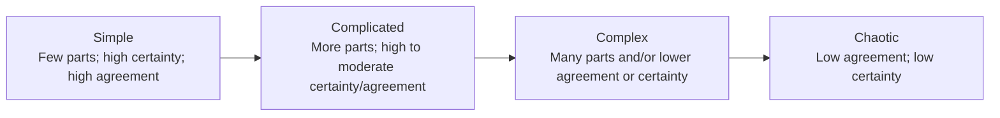

## Document page 1

Copyright © 2020 Wolters Kluwer Health, Inc. Tous droits réservés.

The Health Care Manager, volume 39, numéro 1, p. 18-23. Copyright © 2019 Wolters Kluwer Health, Inc. Tous droits réservés.

Les organismes de santé en tant que systèmes adaptatifs complexes

Savithiri Ratnapalan, MBBS, MED, PhD ; Daniel Lang, PhD

Les organismes de santé qui dispensent des soins à la population constituent un élément majeur des systèmes de santé dans de nombreux pays. Bien que certaines composantes d’un organisme de santé puissent fonctionner comme un système simple ou compliqué où les interventions produiraient les résultats escomptés, de nombreuses parties de celui-ci fonctionnent comme des systèmes complexes au sein de l’organisme. De ce fait, il n’est pas toujours possible de prédire les changements ou les effets des interventions sur ces systèmes en raison de leur nature complexe. Il est nécessaire de comprendre la nature complexe des systèmes de santé ainsi que les caractéristiques de ces systèmes complexes et de leurs réseaux pour gérer les organismes de soins de santé et les changements dans le domaine de la santé. Cet article décrit différents types de systèmes et explique pourquoi les organismes de soins de santé sont considérés comme des systèmes adaptatifs complexes. Mots-clés : théorie de la complexité, systèmes complexes, organismes de soins de santé, systèmes de santé, théorie des systèmes

TOUT SYSTÈME est censé comporter des

éléments structurels et procéduraux qui entretiennent des relations temporelles et spatiales. Les éléments structurels peuvent être des matériaux, des programmes, des organismes vivants, des êtres humains, des hypothèses ou des

concepts. Considérer le monde social comme un système n’est pas un concept nouveau, car l’idée

que le tout est plus que la somme de ses parties

s’applique bien au monde social.1 Von Bertalanffy2 évoque le succès de l’ère scientifique et explique comment le réductionnisme moderniste

décompose les problèmes en de nombreux éléments simples distincts ; l’étude de ces éléments

et la correction des éléments problématiques pour

réparer l’ensemble du système ont contribué au succès de la science au cours du siècle dernier. Le

concept d’une organisation fonctionnant efficacement comme une machine bien huilée et des métaphores telles que la « réingénierie » du

système ou

Affiliations des auteurs : Université de Toronto (Dr Ratnapalan) et à l'Hôpital pour enfants malades (Dr Lang), Toronto, Ontario, Canada.

Les auteurs n'ont aucun financement ni conflit d'intérêts à déclarer.

Correspondance : Savithiri Ratnapalan, MBBS, MED, PhD, Département de pédiatrie et École de santé publique Dalla Lana, Université de Toronto, Hôpital pour enfants malades,

555, avenue University, Toronto, ON, Canada M5G 1X8 (savithiri.ratnapalan@sickkids.ca ).

DOI : 10.1097/HCM.0000000000000284 18

Téléchargé depuis http://journals.lww.com/healthcaremanagerjournal par BhDMf5ePHKbH4TTImqenVIiuKVF7qTxsO7egTcR85zjoHTGCiOlp/g4cWl8N+nnHTv17fW9kRgE= le 03/02/2020

E

Abonnez-vous à DeepL Pro pour traduire des fichiers plus volumineux. Visitez www.DeepL.com/pro pour en savoir plus.

**Additional extracted image(s) from this page:**

## Document page 2

Copyright © 2020 Wolters Kluwer Health, Inc. Tous droits réservés.

Ces notions de « pilotage automatique » sont souvent utilisées dans de nombreuses organisations, y compris dans le secteur de la santé. Considérer une organisation comme une machine façonne nos perceptions, nos attentes et nos actions, ce qui nous aide à planifier des changements systémiques visant à améliorer les résultats. Nous concevons ou exploitons des machines pour qu’elles remplissent des fonctions bien définies. Chaque pièce a une fonction précise qu’elle exécute de manière répétitive et sans variation, ce qui se traduit par une performance globale fiable. Pour modifier la fonction d’une machine, on en fabrique souvent une nouvelle, et la machine est construite exactement selon les spécifications. La machine ne participe pas ; le changement provient uniquement des ingénieurs qui s’attendent à contrôler entièrement la conception, la mise en œuvre et les résultats, et dont on attend qu’ils le fassent. Des résultats inattendus (ou « changement imprévu ») impliquent une responsabilité pour des lacunes dans la conception ou l’exécution.

Les modèles mécaniques newtoniens de prédiction et de gestion peuvent encore s’appliquer à des systèmes simples et complexes. L’analogie entre les organisations et les systèmes mécaniques fonctionnait raisonnablement bien à l’ère industrielle, lorsque nous pouvions analyser différentes parties du système, les modifier selon les besoins et gérer le comportement pour obtenir des résultats prévisibles. La métaphore de la machine s’avère insuffisante dans les organisations complexes actuelles, telles que les hôpitaux, qui comportent de multiples sous-systèmes de conception compliquée ou complexe présentant un comportement non linéaire, dynamique et imprévisible

## Document page 3

## Document page 4

Systèmes adaptatifs complexes dans le domaine de la santé

Copyright © 2020 Wolters Kluwer Health, Inc. Tous droits réservés.

19

et où les changements apportés au système peuvent souvent produire des résultats imprévus.

TYPES DE SYSTÈMES

Un système simple est un système qui comporte un nombre défini de composants et produit un résultat prévisible. Un système compliqué est plus élaboré. Le nombre de composants d’un système et leurs interrelations sont souvent utilisés pour le classer comme un système simple, compliqué, complexe ou chaotique. Les systèmes comportant peu de composants, avec de faibles interrelations et des processus linéaires, sont considérés comme des systèmes simples. Ceux qui comportent de nombreux composants avec une interdépendance faible à moyenne sont considérés comme des systèmes compliqués, et ceux qui comportent de nombreux composants avec une forte interdépendance sont considérés comme des systèmes complexes.3 Les systèmes complexes possèdent des unités dynamiques cohérentes qui interagissent entre elles et sont capables d’évoluer pour s’organiser par rapport à leur environnement. Cette capacité à évoluer et à se restabiliser augmente la robustesse du système, rendant les systèmes complexes adaptatifs à leur environnement, au point qu’on les appelle souvent des systèmes adaptatifs complexes. Les systèmes complexes présentent un comportement dynamique collectif issu d’interactions simples entre un grand nombre de sous-unités, tandis qu’un système chaotique génère un comportement compliqué, apparemment aléatoire, résultant de l’interaction de facteurs en apparence sans rapport entre eux, à l’intérieur ou à l’extérieur du système.4 La conceptualisation des systèmes en systèmes simples, compliqués, complexes ou chaotiques, en fonction du degré de certitude et du degré d’accord sur les prochaines étapes qui produiraient les résultats souhaités, aide à expliquer l’évolution des systèmes et les tensions au sein de ceux-ci.5 Les chercheurs en informatique et en mathématiques utilisent la complexité pour la modélisation quantitative ; les chercheurs en sciences sociales utilisent la complexité au sens métaphorique pour décrire les organisations politiques, économiques et sociales. Dans cet article, les classifications des systèmes sont conceptualisées plus en détail en fonction du nombre de parties, du nombre de relations en leur sein, du degré de certitude et du degré de concordance de leurs actions. La figure illustre certaines caractéristiques et relations des systèmes simples, compliqués, complexes et

Figure. Types de systèmes.

chaotiques. Les systèmes complexes et les systèmes chaotiques sont abordés plus en détail dans le texte.

THÉORIE DE LA COMPLEXITÉ

À l'heure actuelle, l'ère scientifique semble avoir cédé la place à l'ère de la connaissance, marquée par une prise de conscience accrue des effets des progrès technologiques et de la mondialisation, ce qui a donné naissance à de nombreux réseaux, connus et inconnus, formant ainsi un monde de systèmes complexes. La métaphore dominante de la science de la complexité est celle du système vivant. Les théories de la complexité, initialement utilisées pour expliquer la science et les mathématiques, se sont ensuite étendues à la sociologie et à la gestion. La théorie de la complexité explique en quoi une organisation s'apparente à un écosystème, réagissant aux lois naturelles pour trouver les meilleures solutions possibles aux problèmes. La science de la complexité constitue un cadre d'étude des systèmes adaptatifs complexes, en se concentrant sur les schémas et les relations entre les composantes ou les acteurs du système afin de comprendre et d'agir sur les aspects imprévisibles du travail avec des personnes au sein d'organisations dynamiques. La science de la complexité nous incite à nous concentrer sur l'interconnexion et l'interaction des agents plutôt que d'étudier les agents individuels de manière isolée, car les organisations de soins de santé telles que les hôpitaux sont des systèmes complexes et l'objet de l'intervention ou de l'étude ne peut se limiter à un changement au niveau individuel ou micro.

Il n'existe pas de définition claire de ce qu'est la complexité ni des caractéristiques qui distinguent les systèmes complexes, car la complexité est souvent contextuelle et subjective.3 La plupart des théoriciens de la complexité décrivent les propriétés communes

**Figure - Types de systèmes (diagramme converti en Mermaid)**

## Document page 5

Copyright © 2020 Wolters Kluwer Health, Inc. Tous droits réservés.

20 THE HEALTH CARE MANAGER / JANVIER-MARS 2020

aux systèmes complexes après avoir travaillé avec et étudié ces derniers pour décrire leur perception de la complexité.G Gell-Mann,7 un mathématicien, affirme qu’il peut être nécessaire d’utiliser diverses mesures pour saisir nos notions intuitives variées de ce que l’on entend par complexité et par son contraire, la simplicité. Alors que les mathématiciens ont examiné la prévisibilité quantitative à l’aide de calculs et d’algorithmes pour expliquer la complexité, les chercheurs en sciences, en sociologie, en économie et en gestion ont utilisé la complexité de manière métaphorique, à la recherche d’explications qualitatives de la complexité.

Caractéristiques des systèmes complexes

Homer-DixonG affirme que la plupart des systèmes complexes comportent de nombreux composants et décrit cinq propriétés communes aux systèmes complexes, qui présentent les caractéristiques suivantes :

1. un haut degré de connectivité,

2. l'illimité,

3. un besoin important en énergie de haute qualité,

4. un comportement non linéaire, et

5. l'émergence de propriétés nouvelles.

D'autres ont identifié l'interdépendance des composants du système comme l'aspect le plus important de la complexité, arguant que, bien que

l'augmentation du nombre de composants dans le

système puisse le rendre plus compliqué, c'est le

nombre de relations entre eux et le caractère unique de ces relations qui rendent un système complexe.3 Ces interrelations uniques conduisent à la non-décomposabilité des composants individuels,

de leurs actions et à d'autres comportements non

linéaires des composants du système. Ces interrelations uniques au sein d'un système complexe

conduisent à l'émergence de comportements, de

propriétés et de résultats inattendus face à des

influences internes et externes, ainsi qu'à des comportements émergents dans les systèmes complexes.3 La principale différence entre les systèmes compliqués et les systèmes complexes réside dans le fait que les systèmes complexes ne

peuvent être compris en étudiant les composants

individuels de manière isolée, car il s'agit d'un système dynamique non linéaire. Glouberman et

Zimmerman8 ont examiné les différences mentionnées dans la littérature entre les systèmes

complexes et les systèmes compliqués en les classant en groupes sur la base de la théorie, de la

causalité, des preuves et de la planification. Les

caractéristiques des systèmes complexes

identifiées

dans la littérature décrivent les caractéristiques des organisations de soins de santé. Certaines différences clés entre les systèmes compliqués et complexes sont présentées dans le tableau.

Une revue de la théorie de la complexité en sciences organisationnelles a identifié 47 concepts, dont 7 étaient partagés par plusieurs auteurs.9 Ces concepts étaient les suivants : le système comportant des agents capables d’influencer d’autres agents, les différents types de connexions, les changements de comportement, les pressions évolutives, la manière dont les agents agissent, la survenue de changements inattendus et la présence de types d’agents variés.9 La théorie de l'agence, qui explique comment les agents peuvent différer dans leurs actions et comment les actions et interactions entre agents et mandants peuvent être incongrues, est très utile pour expliquer certains aspects du comportement des agents dans les systèmes complexes.10 Les organisations de soins de santé sont décrites comme des systèmes complexes comportant de multiples agents de types variés. La théorie de l'agence explique également les difficultés liées à la mise en œuvre des « réformes des soins de santé » imposées par le gouvernement lorsque les professionnels de santé, dotés d'une autonomie professionnelle, n'acceptent pas pleinement les conditions organisationnelles et présentent des problèmes d'agence au sein des organisations de soins de santé.11

Les effets imprévisibles et les effets indésirables de certaines interventions de santé s’expliquent également par la théorie du chaos, selon laquelle les organisations de santé, en tant que systèmes complexes, se trouveraient au bord du chaos ou à un point critique lorsqu’un changement de phase se produit dans le système.12,13

THÉORIE DU CHAOS ET SYSTÈMES CHAOTIQUES

La théorie mathématique du chaos, initialement décrite par le mathématicien français Henri Poincaré, a contribué à expliquer les surprises imprévisibles et les complexités infinies de la nature, telles que les phénomènes météorologiques, les paysages ou les schémas de migration.14 Les systèmes chaotiques sont également des systèmes aléatoires non linéaires, mais ils peuvent comporter soit un petit nombre, soit un grand nombre de sous-unités en interaction, et leurs interactions produisent des évolutions dynamiques très complexes.4 Lorenz14 a utilisé la modélisation mathématique de la théorie du chaos pour montrer que de petits changements peuvent entraîner des changements

## Document page 6

Systèmes adaptatifs complexes dans le domaine de la santé

21

Copyright © 2020 Wolters Kluwer Health, Inc. Tous droits réservés.

complexes et imprévisibles dans les systèmes naturels, comme le célèbre effet papillon, où un petit changement, tel qu’un papillon battant des ailes au Brésil

## Document page 7

Copyright © 2020 Wolters Kluwer Health, Inc. Tous droits réservés.

22 THE HEALTH CARE MANAGER / JANVIER-MARS 2020

Process us

Systèmes compliqués

Processus linéaire Bruit, tension et fluctuations

supprimés Solution externe au système L'adaptation s'effectue dans un environnement statique

Cause et effet

Résultats et conséquences

Stratégies de planification

Systèmes complexes

Non linéaire (entrées et sorties non directement

corrélées) Opportunité perçue dans la tension, le bruit et

les fluctuations Solution s'inscrivant dans le système Interaction avec le reste d'un environnement

dynamique Causalité simple Causalité réciproque Résultats conçus et escomptés Résultats adaptatifs et émergents Déterministe Probabiliste Certitude Incertitude Prétendue prévisibilité Éléments reconnus de non-prévisibilité Les structures déterminent les relations Les structures et les relations sont interactives Réductionnisme/analyse Holisme/synthèse Les moyennes dominent : les valeurs aberrantes sont sans importance Les valeurs aberrantes sont considérées comme des déterminants clés potentiels L'économie classique ignore l'histoire L'histoire recèle le sens du changement, et

des preuves, car les systèmes ont toujours tendance les systèmes évoluent en partie en fonction de l'équilibre ont été Mesures de l'efficacité, de l'adéquation et de l'optimum fonctionnement des relations et des pratiques réelles boucles de rétroaction (positives et négatives) Pensée convergente Pensée divergente Caractéristiques réductrices Caractéristiques émergentes La procédure décisionnelle en tant qu'événement La décision en tant que phénomène émergent Analyse de l'environnement Développer une réflexion sur sa propre pratique Un enjeu majeur nécessite un changement majeur Effet papillon : l'ampleur du changement ne détermine pas l'ampleur du changement

Tableau. Caractéristiques des systèmes compliqués et complexes

Adapté de Glouberman et Zimmerman.8

peut générer une tornade au Texas en modifiant la trajectoire du vent. Depuis lors, la théorie du chaos a été utilisée dans de nombreux domaines, notamment dans le secteur de la santé, pour étudier des effets imprévisibles, comme l'étude des arythmies cardiaques par la modélisation mathématique selon une approche positiviste.15 La théorie du chaos a également été utilisée pour analyser les temps d'attente au sein du Service national de santé britannique.12 Il a été suggéré d'utiliser la théorie du chaos pour étudier la qualité et la sécurité dans les organismes de santé en adoptant une approche interprétative, mais aucune publication utilisant cette approche n'a été publiée.13 Certains ont utilisé le terme « chaos » au sens général pour dire que le secteur de la santé est en désordre, sans faire référence à la théorie du chaos.1G

LES ORGANISMES DE SOINS DE SANTÉ EN TANT QUE SYSTÈMES ADAPTATIFS COMPLEXES

Les systèmes adaptatifs complexes sont définis comme des réseaux de type neuronal composés d’agents interdépendants et en interaction, liés par une dynamique coopérative autour d’un objectif, d’une vision, d’un besoin communs,

etc., et sont décrits comme des structures changeantes dotées de hiérarchies multiples et chevauchantes.17,18 À l’instar des individus qui les composent, les systèmes complexes sont également reliés les uns aux autres au sein d’un réseau dynamique et interactif. Les systèmes complexes interconnectés soulignent l’importance des agents et de leur interconnexion tout en reconnaissant les structures hiérarchiques et les réseaux.17 Les soussystèmes qui y sont intégrés peuvent fonctionner comme des systèmes simples, compliqués ou complexes au sein d’une organisation fonctionnant comme un système adaptatif complexe.17

Les soins de santé et les organisations de soins de santé deviennent de plus en plus complexes, le modèle du médecin et du patient isolés ayant été remplacé par des réseaux, des organisations, des institutions et des services primaires, spécialisés et parfois fragmentés qui doivent être coordonnés par de multiples prestataires et soutenus par de multiples stratégies de financement. Plsek et Greenhalgh 18décrivent un système adaptatif complexe comme un ensemble d’agents individuels ayant la liberté d’agir de manière non toujours prévisible et

## Document page 8

Systèmes adaptatifs complexes dans le domaine de la santé

23

Copyright © 2020 Wolters Kluwer Health, Inc. Tous droits réservés.

dont les actions sont interconnectées avec celles des autres agents.

Les organisations de soins de santé telles que les hôpitaux universitaires fonctionnent également comme des systèmes adaptatifs complexes, car elles regroupent des agents dotés de la liberté d’agir (autonomie professionnelle) et d’influencer les autres. Plsek et Greenhalgh18 décrivent 11 attributs du système complexe, abordant ou décrivant essentiellement les agents et leur comportement au sein du système afin d’expliquer la nature adaptative complexe des organisations de soins de santé. Les attributs et le comportement des systèmes complexes sont décrits comme suit18 :

1. les actions des agents sont fondées sur des

règles intériorisées ;

2. les agents et le système sont adaptatifs ;

3. les systèmes sont intégrés dans d'autres

systèmes et coévoluent ;

4. les tensions et les paradoxes sont des

phénomènes naturels, qui ne doivent pas nécessairement être résolus ;

5. l'interaction conduit à l'émergence continue de comportements nouveaux ;

G. non-linéarité inhérente ;

7. imprévisibilité inhérente : les « inconnues

connues » et les « inconnues inconnues » ;

8. modèle inhérent ;

9. comportement d'attracteur ;

10. auto-organisation inhérente par le biais de règles simples appliquées localement ;

11. des frontières floues où l'appartenance

varie et où les agents peuvent être membres et faire partie de plusieurs systèmes. Les frontières floues où l'appartenance change et où les agents peuvent être membres et faire partie de plusieurs systèmes simultanément sont également expliquées par les théories institutionnelles dans la littérature sur la gestion d'entreprise.

Une revue exploratoire de la théorie de la complexité dans la recherche en soins de santé a identifié 44 études et a révélé que l'attribut le plus couramment utilisé par les auteurs était celui des relations.19 Parmi les autres attributs figuraient l'auto-organisation, la diversité, la communication, le retour d'information, l'apprentissage, l'adaptation, l'équilibre, les agents au sein d'un système, la nonlinéarité et l'imprévisibilité.19 Dans de nombreux pays, des réformes des soins de santé bien intentionnées échouent parfois à produire les résultats escomptés ou entraînent des conséquences indésirables importantes.20,21 Le manque de compréhension de la nature complexe du système de santé, où les interactions non linéaires à

à plusieurs niveaux et à différentes échelles entre les réseaux de composants et d’agents au sein du système de santé ou de ses sous-systèmes, qui font également partie d’autres systèmes sociopolitiques, est souvent citée comme l’une des principales causes de l’échec de certaines réformes des soins de santé.20 La théorie de la complexité fournit une explication des conséquences imprévues du changement au sein d’une organisation et met l’accent sur les règles simples que suivent les agents et leurs schémas de comportement inhérents, qui peuvent être observés et étudiés, mais aussi utilisés à l’avantage du système, car l’ordre, l’innovation et le progrès peuvent émerger naturellement des interactions au sein d’un système complexe ; ils n’ont pas toujours besoin d’être imposés de manière centralisée ou depuis l’extérieur.18

La littérature suggère qu'il faut beaucoup d'énergie (le plus souvent des ressources financières et humaines) pour gérer de grands systèmes complexes. Il existe peu de littérature sur les témoignages des agents concernant l'énergie nécessaire pour maintenir des systèmes complexes tels que les organisations de soins de santé. Bien que les concepts d'évolution, de maturation et de destruction des systèmes complexes soient bien compris dans le domaine de l'écologie, les effets de la maturation et de l'élagage des éléments et agents indésirables pour l'efficacité dans les systèmes adaptatifs complexes, tels qu'une organisation de soins de santé, ne sont pas bien appréciés.G

RÉSUMÉ

Les organismes de soins de santé sont essentiellement des systèmes complexes composés de multiples éléments, et le retrait d’un élément (tel qu’une seule infirmière) n’entraînerait pas de dysfonctionnement du système, car d’autres cliniciens au sein du système prendraient le relais et parviendraient à faire fonctionner le système. Cependant, si le système complexe se trouvait à un point critique ou au bord du chaos, un petit changement, tel que l'ajout ou la suppression d'une personne ou d'une nouvelle technologie, pourrait avoir des effets importants, inattendus et imprévisibles. Le choix de la théorie pour étudier une organisation dépend du contexte et de la perspective. Même les organisations complexes comportent de multiples systèmes simples et complexes qui se prêtent à un modèle mécanique de résolution de problèmes : décomposer les problèmes en éléments simples, les étudier et les modifier si nécessaire pour résoudre le problème ou obtenir de meilleurs résultats. Comme pour

## Document page 9

Copyright © 2020 Wolters Kluwer Health, Inc. Tous droits réservés.

24 THE HEALTH CARE MANAGER / JANVIER-MARS 2020

tout système complexe, les points de vue divergents, les tensions et le bruit sont des caractéristiques inhérentes aux organisations de soins de santé. Il convient de noter que de nombreux changements peuvent ne pas produire les effets escomptés, et qu’il peut être difficile de prédire quels changements auront quels effets en raison de la nature complexe des organisations de soins de santé. Les gestionnaires et les agents du changement doivent reconnaître la nature complexe des organisations de soins de santé

RÉFÉRENCES

1. Von Bertalanffy L. General Systems Theory. 1973. New York ; 1988 : 40.

2. Von Bertalanffy L. The history and status of general systems theory. Acad Manage J. 1972 ; 15(4) : 407-42G.

3. Kannampallil TG, Schauer GF, Cohen T, Patel VL. Prise en compte de la complexité dans les systèmes de santé. J Biomed Inform. 2011 ; 44(G) : 943-947.

4. Rickles D, Hawe P, Shiell A. Petit guide du chaos et de la complexité. J Epidemiol Community Health. 2007 ; G1(11) : 933.

5. Stacey RD. Gestion stratégique et dynamique organisationnelle : le défi de la complexité pour les modes de pensée sur les organisations. Edinburg Gate, Royaume- Uni : Pearson Education ; 2007 : 234-295.

G. Homer-Dixon T. La science de la complexité et les politiques publiques.

Série New Directions. 2010 ; 11 : 7-19.

7. Gell-Mann M. Complexité et systèmes adaptatifs

complexes. Dans : Études de l'Institut de Santa Fe sur les sciences de la complexité - Recueil des actes. Boston, MA : Addison-Wesley Publishing Co ; 1992 : 3- 18.

8. Glouberman S, Zimmerman B. Systèmes compliqués et

complexes : à quoi ressemblerait une réforme réussie de Medicare ? Romanow Papers. 2002 ; 2 : 21-53.

9. Wallis SE. La complexité de la théorie de la complexité : une analyse novatrice. Emerg Complex Org. 2009 ; 11(4) : 2G.

10. Eisenhardt KM. Théorie de l'agence : évaluation et analyse. Acad Manage Rev. 1989 ; 14(1) : 57-74.

11. Porter ME. Une stratégie pour la réforme des soins de santé - vers un système fondé sur la valeur. N Engl J Med. 2009 ; 3G1(2) : 109-112.

12. Papadopoulos MC, Hadjitheodossiou M, Chrysostomou C,

lors de la mise en œuvre de changements et de soutenir l’innovation et les progrès qui émergent naturellement dans ces environnements.

REMERCIEMENTS

Les auteurs remercient les professeures Katherine Janzen et Linda Muzzin pour leur aide dans la mise au point de cet article.

Hardwidge C, Bell BA. Le National Health Service est-il au bord du chaos ? J R Soc Med. 2001 ; 94(12) : G13- G1G.

13. Benson H. Chaos et complexité : applications pour la qualité des soins de santé et la sécurité des patients. J Healthc Qual. 2005 ; 27(5) : 4-10.

14. Lorenz EN. L'essence du chaos. Seattle, WA : University of

Washington Press ; 1995.

15. Pikkujämsä SM, Mäkikallio TH, Sourander LB, et al. Dynamique de l’intervalle entre les battements cardiaques de l’enfance à la vieillesse : comparaison entre les mesures conventionnelles et les nouvelles mesures basées sur les fractales et la théorie du chaos. Circulation. 1999;100(4):393-399. 1G. Fox DM. Chaos et organisation dans les soins de santé. JAMA.

2011 ; 305(10) : 103G-1040.

17. Uhl-Bien M, Marion R, McKelvey B. Théorie du leadership dans la complexité : faire évoluer le leadership de l'ère industrielle à l'ère de la connaissance. Leadersh Q. 2007;18(4):298-318.

18. Plsek PE, Greenhalgh T. Science de la complexité : le défi de la complexité dans les soins de santé. BMJ. 2001 ; 323(7313) : G25-G28.

19. Thompson DS, Fazio X, Kustra E, Patrick L, Stanley D. Revue exploratoire de la théorie de la complexité dans la recherche sur les services de santé. BMC Health Serv Res. 201G;1G:87.

20. Lipsitz LA. Comprendre les soins de santé comme un système complexe : le fondement des conséquences imprévues. JAMA. 2012 ; 308(3) : 243-244.

21. Tsasis P, Evans JM, Owen S. Recadrer les défis des soins intégrés : une perspective des systèmes complexes adaptatifs. Int J Integr Care. 2012;12(5).
