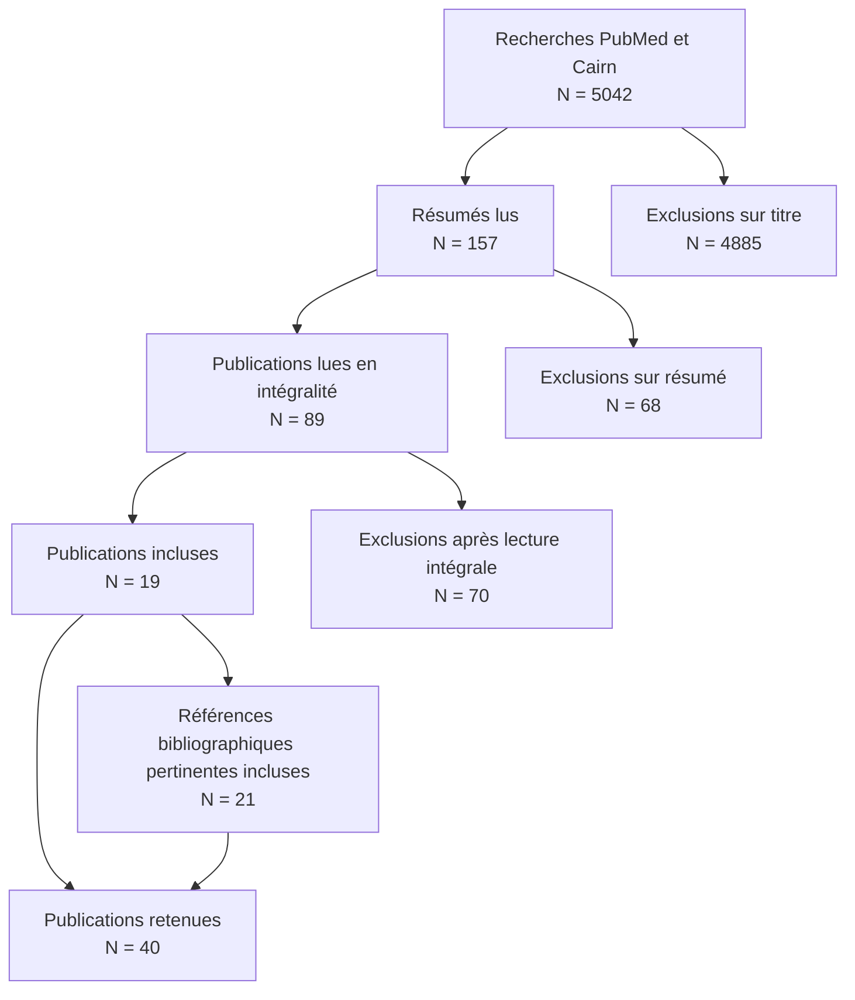

## Document page 1

La complexité : concept et enjeux pour les interventions de santé publique

Victoria Pagani, Joëlle Kivits, Laetitia Minary, Linda Cambon, Frédérique Claudot, François Alla

Dans Santé Publique 2017/1 Vol. 29 , pages 31 à 39 Éditions S.F.S.P.

ISSN 0995-3914

DOI 10.3917/spub.171.0031

Date de mise en ligne : 14/03/2017

Article disponible en ligne à l’adresse https://stm.cairn.info/revue-sante-publique-2017-1-page-31?lang=fr

Découvrir le sommaire de ce numéro, suivre la revue par email, s’abonner... Scannez ce QR Code pour accéder à la page de ce numéro sur Cairn.info.

Distribution électronique Cairn.info pour S.F.S.P.. Vous avez l’autorisation de reproduire cet article dans les limites des conditions d’utilisation de Cairn.info ou, le cas échéant, des conditions générales de la licence souscrite par votre établissement. Détails et conditions sur cairn.info/copyright. Sauf dispositions légales contraires, les usages numériques à des fins pédagogiques des présentes ressources sont soumises à l’autorisation de l’Éditeur ou, le cas échéant, de l’organisme de gestion collective habilité à cet effet. Il en est ainsi notamment en France avec le CFC qui est l’organisme agréé en la matière.

**Additional extracted image(s) from this page:**

## Document page 2

Santé publique volume 29 / N°1 - janvier-février 2017 31

Politiques, interventions et expertises en santé publique Synthèse des connaissances

La complexité : concept et enjeux pour les interventions de santé publique Complexity: concept and challenges for public health interventions

Victoria Pagani 1, Joëlle Kivits 2,3, Laetitia Minary 2,4,5, Linda Cambon 6,7, Frédérique Claudot 1,8, François Alla 2

ûRésumé

Introduction : Depuis les années 2000, la notion d’« interventions complexes » émerge dans le champ de la recherche en santé. Cette notion et celle de complexité sont souvent évoquées mais généralement pas définies. L’objectif de cette revue exploratoire est de caractériser la notion de complexité à travers les questions suivantes : qu’est-ce que la complexité ? D’où vient cette notion et que recouvre-t-elle ? Quelles sont les conséquences de sa prise en compte en santé ? Méthodes : Pour clarifier le concept de complexité, une revue narrative a été réalisée dans le domaine des sciences humaines, sociales et managériales, en psychologie et en santé. Résultats : Le concept de complexité qui trouve son origine chez Edgar Morin a fait l’objet d’appropriations, adaptations et opérationnalisations dans plusieurs disciplines. Il s’agit notamment de comprendre les facteurs d’influence des décisions des individus. En santé, c’est une utilisation plutôt pragmatique de la complexité qui domine, cette dernière définie par les caractéristiques objectivables des interventions (définies comme « complexes ») ou de leurs contextes dans un objectif d’évaluation. Conclusion : Les notions de complexité et d’interventions complexes ont des implications à la fois pour les chercheurs et les utilisateurs des résultats de la recherche. En particulier, il s’agit de mieux comprendre les mécanismes d’efficacité des interventions pour en favoriser la transférabilité et l’utilisation par les acteurs et les décideurs.

Mots-clés : Santé publique ; Comportements ; Intervention ; Ėvaluation.

ûAbstract

Introduction: Since 2000, the notion of “complex interventions” has been emerging in the health research field. “Complex interventions” and “complexity” are commonly used terms, but they are generally not defined. Conceptual ambiguities persist concerning the notion of complexity. The objective of this exploratory review is to characterize the notion of complexity: What is complexity? Where does this notion come from and what does it cover? What are the consequences of complexity in the health field? Methods: To clarify the concept of complexity, a narrative review was conducted in the fields of humanities and social science, managerial economics, psychology and healthcare. Results: The concept of complexity, that can be attributed to Edgar Morin, has been the subject of appropriations, adaptations, and operations in multiple areas. Complexity consists of understanding the factors influencing individual decisions. In the field of healthcare, the concept of complexity is used more pragmatically and is defined by objective characteristics of interventions (defined as complex) or their contexts for the practical purposes of evaluation. Discussion: The notions of complexity and complex interventions have implications for researchers and users of the results of research. In particular, the notion of complexity is designed to provide a better understanding of the mechanism of effectiveness of interventions, support transferability and use by actors and decision-makers.

Keywords: Healthcare; Behaviours; Interventions; Evaluation.

1 Université de Lorraine - EI ETHOS Axe 2 « Éthique et droit de la Santé » - Faculté de Médecine - 9, avenue Forêt de Haye - 54505 Vandœuvre-lès-Nancy - France. 2 Université de Lorraine - Université Paris Descartes - Apemac - EA4360 - 54000 Nancy - France. 3 Service Évaluation et Information Médicales - Pôle S2R - CHU Nancy - 54000 Nancy - France. 4 Inserm - CIC-EC - CIE6 - CHU de Nancy - pôle S2R - épid - 5, rue du Morvan - 54000 Nancy - France. 5 École de Santé Publique, Département de Médecine Sociale et Préventive, Université de Montréal, 7101 avenue du Parc, Montréal (Québec), Canada, H3C3J7. 6 UMR 6051 CRAPE-ARENES - EHESP - Avenue George Sand - 93270 Plaine Saint Denis - France. 7 Chaire de Recherche en Prévention des cancers INCa/IReSP/EHESP - Avenue George Sand - 93270 Plaine Saint Denis - France. 8 CHRU de Nancy - Plateforme d’Aide à la Recherche Clinique (PARC) - Bâtiment Recherche - Rue du Morvan - 54511 Vandœuvre-lès-Nancy - France.

Correspondance : V. Pagani Réception : 12/10/2015 - Acceptation : 07/11/2016 victoria.pagani@univ-lorraine.fr

S.F.S.P. | Téléchargé le 14/05/2026 sur https://stm.cairn.info (IP: 178.51.230.39)

## Document page 3

Santé publique volume 29 / N°1 - janvier-février 2017 32

V. Pagani, J. Kivits, L. Minary, et al.

Introduction

Depuis les années 2000, la notion d’« interventions complexes » occupe le champ de la recherche en santé [1]. L’intérêt porté à cette notion répond à une complexification des objets d’évaluation, tels que les services de santé, les interventions éducatives auprès de publics divers ou de patients, ou encore des actions visant à améliorer les milieux de vie. De telles interventions exigent en effet de concevoirl’objetd’évaluationdanssamulti-dimensionnalité, en particulier par une meilleure prise en compte des contextes, des processus et mécanismes de l’intervention, ainsi que des facteurs d’applicabilité, de transférabilité. C’est à cette condition que l’utilisation des résultats de la recherche dans la décision clinique ou de santé publique, enjeu majeur pour nos systèmes de santé [2, 3], trouve sa légitimité. L’évaluation des interventions complexes soulève d’importantes questions méthodologiques, liées notamment aux limites de l’utilisation des paradigmes méthodologiques expérimentaux, construits pour l’évaluation du médicament [4-6]. En effet, si l’essai contrôlé randomisé individuel est considéré comme un gold standard en recherche clinique, son utilisation n’est pas toujours adaptée pour évaluer des interventions de santé publique non standardisables par nature, ou encore pour prendre en compte l’influence du contexte sur les résultats obtenus. Depuis une décennie, de nouveaux modèles et une nouvelle démarche de développement et d’évaluation de ces interventions se construisent, en particulier sous l’impulsion des recommandations du Medical Research Council [7-9]. Cependant, au-delà de ces aspects méthodologiques, il persiste des ambiguïtés conceptuelles quant à la notion de complexité. Alors que cette notion est souvent évoquée en santé, elle y est rarement définie [10] ce qui laisse place à des incompréhensions. Par exemple l’intervention est-elle complexe du fait des éléments (matériels, humains, théoriques...) qui la composent, ou du fait du système dans lequel elle s’inscrit ? [8, 11]. Autrement dit l’intervention est-elle complexe du fait de sa composition ou du fait que le contexte (politique, culturel, familial, psychologique, économique…) influence son efficacité et ses résultats ? Loin d’être l’apanage du champ de la santé, la complexité est étudiée et mobilisée par d’autres disciplines, en particulier dans les sciences humaines et sociales, elles-mêmes disciplines concourantes à la démarche d’intervention et de recherche en santé publique [12].

L’objectif de cette revue exploratoire est de caractériser la notion de complexité : sa définition (qu’est-ce que la complexité ?), son champ (d’où vient cette notion et que recouvre-t-elle ?), sa portée (quelles sont les conséquences de la prise en compte de la complexité en santé ?). L’approche adoptée pour cette revue exploratoire est d’emblée interdisciplinaire.

Matériel et Méthode

Identification des données

Pour répondre à notre objectif, une revue narrative a été conduite en première intention. Cette méthode de revue de la littérature consiste en un rappel de connaissances portant sur un sujet précis, recueillies à partir de la littérature pertinente sans processus méthodologique systématique, explicite, d’obtention et d’analyse qualitative des articles inclus dans la revue [13]. Elle n’a pas vocation à l’exhaustivité comme dans le cadre d’une revue systématique : elle ne vise donc pas à recenser la totalité des informations disponibles sur un sujet, mais permet de faire le point à partir de publications et de travaux d’auteurs qui font autorité sur le sujet. L’étude a été guidée par l’objectif d’appréhender ce que la notion de complexité recouvrait dans les sciences humaines et sociales ainsi qu’en santé. La revue narrative a été réalisée à partir des bases de données CAIRN et PUBMED. Les mots-clés sélectionnés pour cette recherche, étaient (en anglais ou en français) : [« Complexité », « Théorie de la complexité », « Système complexe »] auxquels s’ajoutait [« intervention »] pour le champ de la santé. Dans un second temps, les références listées dans les publications issues de cette recherche ont été vérifiées. Les références jugées pertinentes pour notre question de recherche ont été incluses à l’analyse de contenu.

Sélection des articles

Les critères de sélection étaient : rapports officiels, ouvrages, articles en anglais ou en français, publiés entre 1990 et 2015, dont le titre ou les mots-clés contenaient au moins un des termes de la recherche ou à défaut évoquaient considérablement la complexité ou la complexité des interventions de santé publique. Nous avons poursuivi la

S.F.S.P. | Téléchargé le 14/05/2026 sur https://stm.cairn.info (IP: 178.51.230.39)

## Document page 4

Santé publique volume 29 / N°1 - janvier-février 2017 33

INTERVENTIONS COMPLEXES EN SANTÉ: CONCEPT ET ENJEUX

sélection par la lecture du résumé afin d’exclure les études ne traitant pas de la complexité, et nous avons terminé par la lecture complète de l’article, sur la base de nos objectifs (définir la complexité et son utilisation en santé publique).

Analyse

Les articles retenus étaient lus dans leur intégralité, à partir d’une grille de lecture visant à relever et caractériser la notion de complexité. L’analyse a porté sur deux aspects :

• les points relatifs à la définition et aux éléments de la complexité (conceptuelle, utilitaire, pragmatique, etc.),

• l’approche disciplinaire de la complexité : sociologie, psychologie sociale, sciences du management, santé publique, etc.

Résultats

Les références lues et utilisées sont celles citées (tableau I). Au total, 40 ouvrages et articles ont été retenus [4, 6-11, 14-46], majoritairement publiés en anglais (n = 26 - 63,4 %) et datant des dix dernières années (n = 28 - 68,3 %). La présentation des résultats est structurée en trois parties : le fondement du concept ; des exemples de déclinaison de ce concept par différentes disciplines ; son intégration dans le domaine de la santé.

La complexité : l’approche fondatrice d’Edgar Morin

Lesécritsd’EdgarMorinontconstituéunesourcemajeure pour définir la complexité. En effet, la moitié des publications françaises retenues pour notre étude [16, 21-24], se fondent sur la théorie d’Edgar Morin pour appréhender les systèmes complexes (tableau I). Sociologue et philosophe français, il est le fondateur de « la pensée complexe ». Pour Edgar Morin, la réalité est « conçue comme essentiellement complexe, tout dont les éléments hétérogènes constitutifs s’enchevêtrent dans des maillages inextricables rendant son comportement, certes intelligible, mais non totalement algorithmique et prédictible » [14]. Il définit alors, la complexité comme « un phénomène quantitatif dû à l’extrême quantité d’interactions et d’interférences entre un très grand nombre d’unités » [15]. Il ajoute qu’elle comprend aussi « des incertitudes et des indéterminations », c’est-à-dire des phénomènes aléatoires. Selon Morin, la complexité désigne étymologiquement ce qui est « tissé ensemble ». Il s’agit de comprendre le tout qui est plus que la somme des éléments, sans pour autant déconsidérer les éléments du tout. La pensée complexe met donc le chercheur dans une contradiction permanente. Elle exige également de s’intéresser aux relations qu’entretiennent les différents éléments d’une même réalité. L’objectif de Morin était de rendre intelligible la complexité du réel sans la « mutiler ». Il ne serait plus question de prétendre à « maîtriser le réel » à travers une pensée simplifiante mais bien de s’exercer à une pensée capable de « faire avec le réel » [15].

Figure 1 : Flowchart

S.F.S.P. | Téléchargé le 14/05/2026 sur https://stm.cairn.info (IP: 178.51.230.39)

**Figure 1 - Flowchart converti en Mermaid**

## Document page 5

Santé publique volume 29 / N°1 - janvier-février 2017 34

V. Pagani, J. Kivits, L. Minary, et al.

Auteurs Date Titre Champs de la recherche Référence à la complexité

ROTH C 2007 Systèmes complexes sociaux et validation empirique Sociologie MEJ. Newman 2003

BAGLA L 2003 Sociologie des organisations Sociologie

M. Crozier 1975

LANG T 2004 Inégalités sociales de santé Sociologie -

GOLSORKHI D BERGERON H, ASTEL P, DURAND R, LECA B 2011 Mouvements sociaux, organisations et stratégies Sociologie -

TAP P 2007 Propos sur l’utilisation des modèles physiques de la complexité en psychologie sociale Psychologie Sociale E Morin

GODIN G 1991 L’éducation pour la santé : les fondements psycho-sociaux de la définition des messages éducatifs Psychologie sociale -

THIETART RA 2000 Management et complexité : concepts et théories Science du Management E Morin

BRUNEL V 2008 Les managers de l’âme Le développement personnel en entreprise, une nouvelle pratique du pouvoir ?

Science du Management E Morin

BENANI A 2009 L’articulation entre la surveillance de l’environnement de l’entreprise et le système d’information : l’apport d’une approche systémique Science du Management E Morin

JOURNÉ B, GRIMAND A GARREAU L 2012 Face à la complexité, illusions, audaces, humilités Science du Management E Morin

DESGROSEILLIERS V 2014 Retrouver la complexité du réel dans les approches théoriques de promotion de la santé : transiter par l’identité du sujet

Santé publique Promotion de la santé E Morin

SHANKLAND R LAMBOY B 2010 Unité des modèles théoriques pour la conception et l’évaluation de programme en prévention et promotion de la santé Santé et Science sociale -

RORTVEIT G SCHEI E, STRAND R 2005 Complex systems and human complexity in Medicine Santé MRC

RIDDE V HADDAD S 2013 Pragmatisme et réalisme pour l’évaluation des interventions de santé publique Santé publique E Morin

CLARKE AM 2012 What are the components of complex interventions in healthcare? Theorizing approaches to parts, powers and the whole intervention Santé publique MRC

DURLAK JA DUPRE EP 2008 Implementation matters: a review of research on the influence of implementation on program outcomes and the factors affecting implementation Santé publique MRC

PLSEK P GREENHALGH T 2001 The challenge of complexity in health care Santé publique MRC

GREEN LW 2006 Public health asks of systems science: to advance our evidencebased practice, can you help us get more practice-based evidence? Santé publique MRC

CRAIG P 2008 Developing and evaluating complex interventions: the new Medical Research Council guidance Santé publique MRC

HAWE P 2004 Complex interventions: how “out of control” can a randomized controlled trial be? Santé publique MRC

SHIELL A HAWE P 2008 Complex interventions or complex systems? Implications for health economic evaluation Santé publique MRC

BYRNE M 2006 Development of a complex intervention for secondary prevention of coronary heart disease in primary care using the UK Medical Research Council framework Santé publique MRC

Tableau I : Utilisation de la complexité dans différentes disciplines et appropriation en santé

S.F.S.P. | Téléchargé le 14/05/2026 sur https://stm.cairn.info (IP: 178.51.230.39)

## Document page 6

Santé publique volume 29 / N°1 - janvier-février 2017 35

INTERVENTIONS COMPLEXES EN SANTÉ: CONCEPT ET ENJEUX

Auteurs Date Titre Champs de la recherche Référence à la complexité

OAKLEY A BONELL C 2006 Process evaluation in randomized controlled trials of complex interventions Santé publique MRC

CAMPBELL M 2000 Framework for design and evaluation of complex interventions to improve health Santé publique MRC

RYCHETNIK L, HAWE P 2001 Criteria for evaluating evidence on public health interventions Santé publique MRC

CAMPBELL NC 2007 Designing and evaluating complex interventions to improve health care Santé publique MRC

COLLINS L TRAIL J, KUGLER K 2014 Evaluating individual intervention components: making decisions based on the results of a factorial screening experiment Santé publique MRC

MUHLHAUSER I LENZ M, MEYER G 2011 Development, appraisal and synthesis of complex interventions: a methodological challenge Santé publique MRC

MOORE G AUDREY S, BARKER M 2014 Process evaluation in complex public health intervention studies: the need for guidance Santé publique MRC

BARANOWSKI T STABLES G 2000 Process Evaluations of the 5-a Day Projects Santé publique MRC

MURRAY E TREWEEK S 2010 Normalization process theory: a framework for developing, evaluating and implementing complex interventions Santé publique MRC

MAY C 2006 A rational model for assessing and evaluating complex interventions in health care Santé publique

K. Dooley 1997 M Campbell 2000

MAY C MAIR F, FINCH T 2009 Development of a theory of implementation and integration: Normalization Process Theory Santé publique

K. Dooley 1997 M Campbell 2000

COUPE N ANDERSON E 2014 Facilitating professional liaison in collaborative care for depression in UK primary care: a qualitative study utilizing normalization process theory Santé publique

J. Gunn 2006

FINCH T RAPLEY T GIRLING M 2013 Improving the normalization of complex interventions: measure development based on normalization process theory: study protocol Santé publique -

Les démarches d’intervention, au sein d’environnements aussi variés soient-ils (social, santé, travail...), sont dès lors complexes. Le comportement, dont le changement est généralement l’objectif de ces interventions, ne peut pas être isolé de son contexte, du système auquel il appartient. C’est notamment pour ces raisons que certaines disciplines, afin d’initier le changement en contexte « réel », se sont ainsi emparées des concepts liés à la complexité d’Edgar Morin.

Les appropriations disciplinaires de la complexité

Parmi les publications sélectionnées, quatre provenaient de la sociologie [17, 19, 20, 45], deux de la psychologie sociale [16, 18], et quatre des sciences du management [21-24].

Les résultats de la revue narrative ont montré que plusieurs disciplines utilisaient les concepts associés à la complexité comme cadre de compréhension des organisations et des systèmes faisant l’objet de leur analyse. Il s’agissait en particulier de contribuer à expliquer, voire à agir sur les décisions et comportements des acteurs concernés. La complexité a été utilisée par exemple en psychologie sociale afin de proposer « une description, une caractérisation et une modélisation du comportement d’un système complexe » [16, 17]. La théorie est utilisée alors pour comprendre « quels évènements petits ou grands, prévisibles ou non, provoquent des changements dans la structure de la personne, dans son histoire ou dans le système de communication et quelles sont les interactions entre ces trois éléments » [16]. Cette caractérisation des facteurs psychosociaux qui déterminent les comportements liés à la santé est essentielle au choix des leviers et modes d’intervention [18]. En effet, c’est par l’analyse de ces facteurs, de

S.F.S.P. | Téléchargé le 14/05/2026 sur https://stm.cairn.info (IP: 178.51.230.39)

## Document page 7

Santé publique volume 29 / N°1 - janvier-février 2017 36

V. Pagani, J. Kivits, L. Minary, et al.

leur origine (éducative, environnementale, etc.), de leur caractère influençable ou non, que les acteurs, notamment du champ de la prévention et de la promotion de la santé, fondent leur choix de stratégie d’intervention (communication, modification de l’environnement, renforcement du soutien social, etc.). Le concept de complexité a également été utilisé par la sociologie des organisations et par la théorie des mouvements sociaux, afin de comprendre les « interactions entre les contraintes sociales et la liberté individuelle, les effets non intentionnels de décisions, les dynamiques de la coopération et du conflit, les phénomènes de domination et de pouvoir » [19, 20]. Au-delà de la compréhension des phénomènes collectifs, cette étude de la complexité accompagne le développement de méthodes d’organisation, la définition de processus de changements organisationnels et collectifs plus efficaces. C’est notamment le cas des sciences managériales, où cela a permis d’analyser comment l’organisation se comporte, évolue et se transforme [21]. Ainsi, dans le domaine du management, afin de mieux gérer les interactions entre individus au sein d’une même société, les dirigeants s’appuient sur les modèles de comportement basés sur ces paradigmes [21-22]. L’appropriation de la théorie de la complexité par ces différentes disciplines a pour finalité de réduire l’incertitude dans des contextes, de comprendre, d’expliquer l’articulation de l’environnement avec le système [22], de comprendre les mécanismes comportementaux et affectifs [23, 24], et ainsi de définir et améliorer l’efficacité des interventions. Ainsi, l’analyse de la déclinaison de la complexité dans les différentes disciplines peut contribuer à l’intégration de cette notion en santé.

La complexité en santé : une vision pragmatique et utilitaire

Dans le champ de la santé, l’appropriation de la notion de complexité semblait être instrumentale plus que conceptuelle : autrement dit il s’agissait de développer et évaluer des interventions complexes plus que de s’intéresser à la complexité. Cette dernière a été construite dans une perspective évaluative et repose donc sur des caractéristiques objectivables de l’intervention [25, 26]. Sur les 25 articles retenus dans le champ de la santé, 18 se fondaient sur le cadre du Medical Research Council (n = 18 - 72 %) [6, 8-11, 27-39], à savoir « la complexité d’une intervention réside dans le nombre de composantes qui agissent à la fois de manière indépendante et interdépendante, le nombre et la difficulté des comportements requis par ceux qui

fournissent et reçoivent l’intervention, le nombre et la variabilité des résultats, le nombre de groupes et de niveaux organisationnels ciblés par l’intervention, le degré de flexibilité ou d’adaptabilité de l’intervention » [7, 8, 25, 26] (tableau I). Le MRC cite l’intervention SHARE (Sexual Health and RElationships : Safe, Happy and REsponsible) comme exempled’interventioncomplexe.SHAREestunprogramme d’éducation sexuelle visant à améliorer la qualité des relations sexuelles, à réduire les rapports sexuels non protégés et les grossesses non désirées chez les jeunes de 13 à 15 ans. Cette intervention consistait en 20 sessions délivrées par les enseignants d’un programme d’éducation sexuelle à destination des 13-15 ans. Ses bases théoriques s’appuyaient sur la théorie du comportement planifié, l’interactionnisme et l’analyse sociologique du genre. Elle avait pour but de développer des connaissances/savoirs pratiques, le changement d’attitude, et contrairement à l’éducation sexuelle conventionnelle en milieu scolaire, le développement de la négociation sexuelle et le développement de compétence d’utilisation du préservatif, principalement à l’aide de vidéos interactives. Les enseignants ont reçu une formation intensive de cinq jours. Elle a été développée sur deux années, incluant deux études pilotes dans chacune des quatre écoles et une consultation étendue avec les praticiens et chercheurs. Cette intervention était vue comme complexe du fait du nombre important des personnes-cibles (25 écoles, 7 630 élèves), le nombre important des cadres théoriques utilisés pour la mise en place de l’intervention (101 études), ainsi que les facteurs contextuels (socio-économiques et familiaux, groupes affinitaires, attitudes à l’école, etc.) qui influencent les résultats. Ce cadre reconnaît la nécessité d’une phase exploratoire permettant de « décrire les composantes constantes et variables d’une intervention reproductible » [7]. Cette définition n’est donc pas conceptuelle, mais pragmatique, se rapportant aux caractéristiques objectivables de l’intervention. À la suite des travaux du MRC, nombre d’auteurs [6, 8-10, 27-38] se sont intéressés à la notion de composantes des interventions, soulignant la nécessité de les identifier durant la mise en œuvre de l’intervention. Il s’agissait en particulier, de préciser les éléments constitutifs des interventions et de déterminer dans quelle mesure ces éléments spécifiques sont délivrés ou modifiés lors de la mise en œuvre de l’intervention [6, 10, 27-31, 37-38]. Afin de prendre la meilleure décision sur la composition finale de l’intervention, il faut examiner la performance des composantes de l’intervention, en rassemblant le maximum

S.F.S.P. | Téléchargé le 14/05/2026 sur https://stm.cairn.info (IP: 178.51.230.39)

## Document page 8

Santé publique volume 29 / N°1 - janvier-février 2017 37

INTERVENTIONS COMPLEXES EN SANTÉ: CONCEPT ET ENJEUX

d’informations nécessaires sur les effets de chacune [6, 10, 27-29, 31-38]. Les composantes ont été définies, comme « les parties distinctes qui composent l’intervention, reconnues comme étant des aspects importants. Elles peuvent être considérées comme des parties de l’intervention, qui, pour des raisons empiriques, sociales ou culturelles, viennent être considérées comme des pièces puissantes de l’intervention » [10]. Les interventions complexes sont donc construites à partir d’un certain nombre de composantes qui sont individuelles mais aussi reliées entre elles, qui peuvent agir à la fois de façon indépendante et interdépendante [6, 8-10, 25-38]. Enfin, la prise en compte des interactions entre les composantes de l’intervention et les facteurs contextuels semble d’une importance particulière [6, 11, 31, 39-43]. Ceci concerne particulièrement les interventions visant au changementdecomportement,qu’ilsoitindividuel,communautaire ou défini à l’échelle de la population. Ces interventions, aussi variées soient-elles, sont dès lors complexes, le comportement ne pouvant être isolé de son contexte, du système auquel il appartient. Penelope Hawe distingue « les aspects fixes » et « les aspects variables » de l’intervention. Les aspects fixes sont les fonctions essentielles, alors que les aspects variables sont leurs formes dans différents contextes [6]. La prise en compte du contexte, afin de s’adapter aux conditions locales, semble être un élémentclé pour l’amélioration de l’efficacité de l’intervention [11]. Cela inclut de prendre en compte les répercussions que les effets contextuels ont sur la conception et l’évaluation des interventions [11]. Le contexte englobe à la fois les structures, les opérations [11], les processus de groupe, les conventions [39], les contextes organisationnels, institutionnels [40] les contextes sociaux [42], les contraintes individuelles et/ou communautaires, qui peuvent être physiques, sociales, financières, environnementales, etc. [44, 45], des normes sociales, des réseaux sociaux, locaux, des cultures, mais aussi le vécu des individus, l’ordre social, des perceptions, des valeurs, la politique, la morale [16, 45, 46].

Discussion

La notion de complexité est de plus en plus évoquée par les chercheurs en santé, ceci est constaté à travers l’accroissement du nombre de publications sur le sujet depuis le début des années 2000 [1]. Cette étude avait pour objectif de définir la notion de complexité et de décrire son

appropriation et son adaptation dans la recherche en santé. Cette revue narrative n’avait pas de prétention systématique mais exploratoire, visant à porter un éclairage conceptuel sur la notion d’intervention complexe en santé. Le concept fondateur d’Edgar Morin a fait l’objet d’appropriations, adaptations, opérationnalisations dans plusieurs disciplines. Il s’agit notamment de comprendre les facteurs d’influences des décisions des individus. Par exemple l’utilisation de la théorie de la complexité permet de proposer une description et une modélisation du comportement d’un système complexe et ainsi se concentrer sur les évènements petits ou grands, prévisibles ou non, qui provoquent des changements dans la structure de la personne, dans son histoire, ou dans le système de communications et d’interactions et dans la façon où ces trois éléments déterminants s’intègrent ou s’opposent [16]. En santé, les concepts ne sont pas souvent évoqués, c’est une utilisation plutôt pragmatique de la complexité qui domine. La complexité est définie par des caractéristiques objectivables des interventions ou de leurs contextes dans un objectif d’évaluation. En ce sens, c’est la définition du Medical Research Council qui fait référence et est très largement citée (72 % des publications du champ de la santé).

Enjeux et implications pour les chercheurs, acteurs et décideurs

La complexité des interventions implique inévitablement une nouvelle considération de l’approche méthodologique évaluative. Des publications récentes indiquent l’inadéquation de la méthode de référence qu’est l’essai contrôlé randomisé individuel, modèle développé pour l’évaluation du médicament, à l’évaluation d’une intervention de santé publique [5, 6]. Elles soulignent le fait que l’évaluation des interventions complexes nécessite en effet des adaptations ou alternatives au modèle classique des essais [5]. Des alternatives ont été proposées, basées sur des approches quantitatives, qualitatives voire mixtes [47]. Pour appréhender la complexité, certaines disciplines se sont intéressées à l’approche systémique [48-51]. Une démarche systémique a pour objectif de favoriser un fonctionnement plus efficace des systèmes qui évoluent dans des situations complexes [52]. Cette approche permet de surmonter les difficultés rencontrées dans la tentative d’appréhension des problèmes complexes par les outils analytiques existants, en appréhendant de nouveaux concepts comme le système, l’interaction, la rétroaction, la régulation, l’organisation, la finalité, la vision globale, l’évolution, etc. [52]. Ainsi, elle prend en compte des

S.F.S.P. | Téléchargé le 14/05/2026 sur https://stm.cairn.info (IP: 178.51.230.39)

## Document page 9

Santé publique volume 29 / N°1 - janvier-février 2017 38

V. Pagani, J. Kivits, L. Minary, et al.

caractéristiques souvent ignorées comme l’instabilité, l’ouverture, la fluctuation, le chaos, le désordre, le flou, la créativité, la contradiction, l’ambiguïté, le paradoxe, qui sont l’apanage de la complexité [53]. Cette approche pourrait être utilisée en santé publique afindemettreenévidencelescaractéristiquesdessystèmes et organisations de santé et les interactions entre leurs différents éléments afin d’appliquer les connaissances obtenues à la conception et à l’évaluation d’interventions de nature à améliorer l’état de santé des populations [6, 11, 52, 54]. La complexité étant à la fois une propriété de l’intervention et une propriété du système dans lequel l’intervention est mise en application, l’utilisation d’une approche systémique en santé a été proposée par Hawe et Shiell afin de rendre compte aussi bien des interactions entre les différentes composantes de l’intervention et celles relatives aux facteurs contextuels dans lesquels ces interventions sont mises en place [6, 11]. Toutefois,siellessontcourammentutiliséesdansd’autres disciplines (sciences de l’éducation, sociologie, sciences politiques, économie, etc.), le recours à celles-ci est encore marginal en santé. De plus, comprendre comment et pourquoi les interventions produisent des effets, qu’ils soient positifs ou négatifs, est une démarche indispensable pour l’élaboration d’interventions adaptées, utilisables par les décideurs, et plus généralement pour la conduite des programmes de promotion de la santé. En effet, au-delà de l’efficacité de l’intervention, les décideurs ont également besoin de certaines données, pour pouvoir adapter les interventions efficaces dans leur contexte. Le Medical Research Council propose ainsi un cadre pour l’évaluation de processus (process evaluation) [9]. Il s’agit de comprendre le fonctionnement d’une intervention, en examinant la mise en œuvre, les mécanismes de l’impact et l’influence des facteurs contextuels. Selon cette définition, ce type d’évaluation permet une analyse complémentaire à l’étude de l’efficacité des interventions afin de comprendre comment et pourquoi une intervention est efficace. En effet, se limiter à l’efficacité ne suffit pas, il faut aller explorer les mécanismes pour favoriser la transférabilité et l’utilisation des données par les acteurs et les décideurs [48]. Ainsi, ces méthodes et démarches alternatives permettent d’étudier l’efficacité des interventions, de comprendre le mécanisme d’action de cette intervention et d’identifier les éléments contextuels susceptibles d’influencer les résultats de l’intervention. Elles permettent de fournir aux décideurs des informations indispensables à l’adaptation dans leur contexte, d’interventions jugées efficaces.

Ces méthodes restent cependant peu utilisées dans le domaine de la santé, une explication pouvant être que la notion d’intervention complexe et la problématique de son évaluation viennent seulement d’émerger explicitement.

Aucun conflit d’intérêt déclaré

Remerciements Ce travail a été réalisé grâce à un soutien de l’Inca et la Fondation Arc, obtenu dans le cadre de l’Appel à projets de recherche en prévention primaire 2014 Iresp/Inca.

Références

1. Datta J, Petticrew M. Challenges to evaluating complex interventions: a content analysis of published papers. BMC Public Health. 2013 Jun 11;13:568.

2. Stratégie nationale de santé, Feuille de route. 23 septembre 2013.

3. Cambon L, Minary L, Ridde V, Alla F. Un outil pour accompagner la transférabilité des interventions en promotion de la santé : Astaire. Santé Publique. 2014;26:783-6.

4. Ridde V, Haddad S. Pragmatisme et réalisme pour l’évaluation des interventions de santé publique. Rev Épidémiol Santé Publique 2013;61S:S95-S106.

5. Tarqunio C, Kivits J, Minary L, Coste J, Alla F. Evaluating complex interventions: Perspectives and issues for health behaviour change interventions. Psychologie Health. 2015;30(1):35-51.

6. Hawe P, Shiell A, Riley T. Complex interventions: how “out of control” can a randomised controlled trial be? BMJ. 2004;328(7455):1561-3.

7. Medical Research Council. A framework for development and evaluation of RCTs for complex interventions to improve health. 2000.

8. Craig P, Dieppe P, Macintyre S, Michie S, Nazareth I, Petticrew M. Developing and evaluating complex interventions: the new Medical Research Council guidance. BMJ. 2008;337:a1655.

9. Moore GF, Audrey S, Barker M, Bond L, Bonell C, Hardeman W, et al. Process evaluation of complex interventions: Medical Research Council guidance. BMJ. 2015;350:h1258.

10. Clark AM. What are the components of complex interventions in healthcare? Theorizing approaches to parts, powers and the whole intervention. Social science and medicine. 2013;93:185-93.

11. Shiell A, Hawe P, Gold L. Complex interventions or complex systems? Implications for health economic evaluation. BMJ. 2008;336(7656): 1281-3.

12. Bessin M, Bourgeois I, Marchand A, Restivo L, Rollin Z. Agir pour chercher, chercher pour agir : introduction aux recherches interventionnelles en SHS. Santé Publique. 2015;3:305-8.

13. Green BN, Jonhson CD, Adam A. Writing narrative literature reviews for peer-reviewed journals: secrets of the trade. J Chiropr Med. 2006 Fall;5(3):101-17.

14. Morin E. La Méthode 4 Les idées, leur habitat, leur vie, leurs mœurs, leur organisation. Paris : Seuil ; 1991.

15. Morin E. Introduction à la pensée complexe. Paris : ESF éditeur ; 1990.

S.F.S.P. | Téléchargé le 14/05/2026 sur https://stm.cairn.info (IP: 178.51.230.39)

## Document page 10

Santé publique volume 29 / N°1 - janvier-février 2017 39

INTERVENTIONS COMPLEXES EN SANTÉ: CONCEPT ET ENJEUX

16. Tap P. Propos sur l’utilisation des modèles physiques de la complexité en psychologie sociale. Movement & Sport Sciences. 2007; 60:81-91.

17. Roth C. Systèmes complexes sociaux et validation empirique. Sociétés. 2007;98:53-64.

18. Godin G. L’éducation pour la santé : les fondements psychosociaux de la définition des messages éducatifs. Science sociales et santé. 1991;4(1):67-94.

19. Bagla L. Sociologie des organisations. 2e édition. Paris : La Découverte ; 2003.

20. Golsorkhi D, Bergeron H, Castel P, Durand R, Leca B. Mouvements sociaux, organisations et stratégies. Revue française de gestion. 2011;217:79-91.

21. Thietart RA. Management et complexité : concepts et théories. In : Martinet AC, Thiétart RA, dir. Stratégies : actualités et futurs de la recherche. Paris : Vuibert ; 2001.

22. Bennani AE, Laghzaoui S. L’articulation entre la surveillance de l’environnement de l’entreprise et le système d’information : l’apport d’une approche systémique. Revue internationale d’intelligence économique. 2009;1:257-70.

23. Brunel V. Les managers de l’âme. Le développement personnel en entreprise, nouvelle pratique de pouvoir ? Paris : La Découverte ; 2008.

24. Journé B, Grimand A, Garreau L. Face à la complexité. Illusions, audaces, humilités. Revue française de gestion. 2012;(223): 15-25.

25. Medical Research Council. Developing and evaluating complex interventions: new guidance. 2008.

26. Medical Research Council. Research changes lives 2014-2019. 2014.

27. Campbell M, Fitzpatrick R, Haines A, Kinmonth AL, Sandercock P, Spiegelhalter D, et al. Framework for design and evaluation of complex interventions to improve health. BMJ. 2000;321(7262): 694-6.

28. Collins LM, Trail JB, Kugler KC, Baker TB, Piper ME, Mermelstein RJ. Evaluating individual intervention components: making decisions based on the results of a factorial screening experiment. Transl Behav Med. 2014;4(3):238-51.

29. Baranowski T, Stables G. Process evaluations of the 5-a-day projects. Health Educ Behav. 2000;27(2):157-66.

30. Campbell NC, Murray E, Darbyshire J, Emery J, Farmer A, Griffiths F, et al. Designing and evaluating complex interventions to improve health care. BMJ. 2007;334(7591):455-9.

31. Mühlhauser I, Lenz M, Meyer G. Development, appraisal and synthesis of complex interventions - a methodological challenge. Z Evid Fortbild Qual Gesundhwes. 2011;105(10):751-61.

32. Oakley A, Strange V, Bonell C, Allen E, Stephenson J, RIPPLE Study Team. Process evaluation in randomised controlled trials of complex interventions. BMJ. 2006;332(7538):413-6.

33. Rychetnik L, Frommer M, Hawe P, Shiell A. Criteria for evaluating evidence on public health interventions. J Epidemiol Community Health. 2002;56(2):119-27.

34. Green LW. Public Health Asks of Systems Science: To Advance Our Evidence-Based Practice, Can You Help Us Get More Practice-Based Evidence? AM J Public Health March. 2006;96(3):406-9.

35. Rortveit G, Schei E, Strand R. Complex Systems and Human Complexity in Medicine. Complexus. 2004;2:2-6.

36. Plsek PE, Greenhalgh T. Complexity science: The challenge of complexity in health care. BMJ. 2001;323(7313):625-8.

37. Durlak JA, Dupre EP. Implementation matters: a review of research on the influence of implementation on program outcomes and the factors affecting implementation. Am J Community Psychol. 2008;41(3-4):327-50.

38. Byrne M, Cupples ME, Smith SM, Leathem C, Corrigan M, Byrne MC, et al. Development of a complex intervention for secondary prevention of coronary heart disease in primary care using the UK Medical Research Council framework. Am J Manag Care. 2006;12(5):261-6.

39. Murray E, Treweek S, Pope C, MacFarlane A, Ballini L, Dowrick C, et al. Normalisation process theory: a framework for developing, evaluating and implementing complex interventions. BMC Med. 2010;20(8):63.

40. May C. A rational model for assessing and evaluating complex interventions in health care. BMC Health Serv Res. 2006;6:86.

41. May CR, Mair F, Finch T, MacFarlane A, Dowrick C, Treweek S, et al. Development of a theory of implementation and integration: Normalization Process Theory. Implement Sci. 2009;4:29.

42. Finch T, Rapley T, Girling M, Mair F, Murray E, Treweek S. Improving the normalization of complex interventions: measure development based on normalization process theory (NoMAD): study protocol. Implement Sci. 2013;8:43.

43. Coupe N, Anderson E, Gask L, Sykes P, Richards DA, Chew-Graham C. Facilitating professional liaison in collaborative care for depression in UK primary care; a qualitative study utilising normalisation process theory. BMC Fam Pract. 2014;15:78.

44. Shankland R, Lamboy B. Utilité des modèles théoriques pour la conception et l’évaluation de programmes en prévention et promotion de la santé. Pratiques psychologiques. 2011;17:153-72.

45. Lang T. Inégalités sociales de santé. Les Tribunes de la santé. 2014;(43):31-8.

46. Desgroseilliers V, Vonarx N. Retrouver la complexité du réel dans les approches théoriques de promotion de la santé : transiter par l’identité du sujet. Santé Publique. 2014;26:17-31.

47. Campbell DT, Stanley J. Quasi-experimental Designs for Research. Hopewel: Houghton Mifflin Compagny; 1963.

48. Bériot D. Manager par l’approche systémique. Paris : Eyrolles ; 2014.

49. Blanchette L. L’approche systémique en santé mentale. Les Presses de l’Université de Montréal ; 1995.

50. Vautier V. The general hospital’s systemic approach in liaison psychiatry: A different way to handle catastrophic situations. Annales Medico Psychologiques. 2015;173(10):872-6.

51. Probst G, Bassi A. Tackling. Complexity: A Systemic Approach for Decision Makers. Greenleaf Publishing; 2014.

52. Certu. Introduction à l’approche systémique : appréhender la complexité. Les rapports d’étude ; 2007.

53. Donadier G, Karsky M. La systémique, penser et agir dans la complexité. Paris : Éditions Liaisons ; 2002.

54. Cohn S, Clinch M, Bunn C, Stronge P. Entangled complexity: why complex interventions are just not complicated enough. Journal of Health Services Research and Policy. 2013;18(1):40-3.

S.F.S.P. | Téléchargé le 14/05/2026 sur https://stm.cairn.info (IP: 178.51.230.39)
