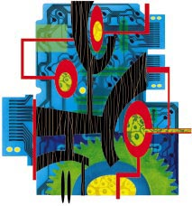
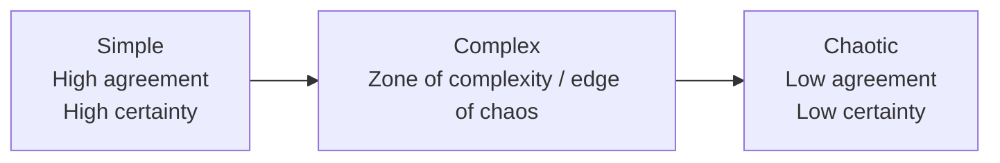

## Document page 1

Complexity science The challenge of complexity in health care

Paul E Plsek, Trisha Greenhalgh

Across all disciplines, at all levels, and throughout the world, health care is becoming more complex. Just 30 years ago the typical general practitioner in the United Kingdom practised from privately owned premises with a minimum of support staff, subscribed to a single journal, phoned up a specialist whenever he or she needed advice, and did around an hour’s paperwork per week. The specialist worked in a hospital, focused explicitly on a particular system of the body, was undisputed leader of his or her “firm,” and generally left administration to the administrators. These individuals often worked long hours, but most of their problems could be described in biomedical terms and tackled using the knowledge and skills they had acquired at medical school. You used to go to the doctor when you felt ill, to find out what was wrong with you and get some medicine that would make you better. These days you are as likely to be there because the doctor (or the nurse, the care coordinator, or even the computer) has sent for you. Your treatment will now be dictated by the evidence-but this may well be imprecise, equivocal, or conflicting. Your declared values and preferences may be used, formally or informally, in a shared management decision about your illness. The solution to your problem is unlikely to come in a bottle and may well involve a multidisciplinary team. Not so long ago public health was the science of controlling infectious diseases by identifying the “cause” (an alien organism) and taking steps to remove or contain it. Today’s epidemics have fuzzier boundaries (one is even known as “syndrome X” 1): they are the result of the interplay of genetic predisposition, environmental context, and lifestyle choices. The experience of escalating complexity on a practical and personal level can lead to frustration and disillusionment. This may be because there is genuine cause for alarm, but it may simply be that traditional ways of “getting our heads round the problem” are no longer appropriate. Newton’s “clockwork universe,” in which big problems can be broken down into smaller ones, analysed, and solved by rational deduction, has strongly influenced both the practice of medicine and the leadership of organisations. For example, images such as the heart as a pump frame medical thinking, and conventional management thinking assumes that work and organisations can be thoroughly planned, broken down into units, and optimised. 2

But the machine metaphor lets us down badly when no part of the equation is constant, independent, or predictable. The new science of complex adaptive systems may provide new metaphors that can help us to deal with these issues better. 3 In this series of articles we shall explore new approaches to issues in clinical practice, organisational leadership, and education. In this introductory article, we lay out some basic principles for understanding complex systems.

Complex adaptive systems: some basic concepts

Definitions and examples A complex adaptive system is a collection of individual agents with freedom to act in ways that are not always totally predictable, and whose actions are interconnected so that one agent’s actions changes the context for other agents. Examples include the immune system, 4 a colony of termites, 5 the financial market, 6

and just about any collection of humans (for example, a family, a committee, or a primary healthcare team).

Fuzzy, rather than rigid, boundaries In mechanical systems boundaries are fixed and well defined; for example, knowing what is and is not a part of a car is no problem. Complex systems typically have fuzzy boundaries. Membership can change, and agents can simultaneously be members of several systems. This can complicate problem solving and lead to unexpected actions in response to change. For example, Dr Simon (box) cannot understand why staff are so resistant to a small extension of surgery opening hours. Perhaps it is the fact that the apparently simple adjustment to working arrangements will play havoc with their own lunchtime inivolvlements with other social systems-be these meeting a child from school, attending a meeting or study class, or making contact with others who themselves have fixed lunch hours.

Agents’ actions are based on internalised rules In a complex adaptive system, agents respond to their environment by using internalised rule sets that drive action. In a biochemical system, the “rules” are a series of chemical reactions. At a human level, the rules can be expressed as instincts, constructs, and mental mod-

Summary points

The science of complex adaptive systems provides important concepts and tools for responding to the challenges of health care in the 21st century

Clinical practice, organisation, information management, research, education, and professional development are interdependent and built around multiple self adjusting and interacting systems

In complex systems, unpredictability and paradox are ever present, and some things will remain unknowable

New conceptual frameworks that incorporate a dynamic, emergent, creative, and intuitive view of the world must replace traditional “reduce and resolve” approaches to clinical care and service organisation

Education and debate

This is the first in a series of four articles

Paul E Plsek & Associates Inc, 1005 Allenbrook Lane, Roswell, GA 30075, USA Paul Plsek director University College London, London N19 3UA Trisha Greenhalgh professor of primary health care Correspondence to: P E Plsek paulplsek@ directedcreativity.com Series editors: Trisha Greenhalgh and Paul Plsek

BMJ 2001;323:625-8

625 BMJ VOLUME 323 15 SEPTEMBER 2001 bmj.com

## Document page 2

els. “Explore the patient’s ideas, concerns, and expectations” is an example of an internalised rule that might drive a doctor’s actions. These internal rules need not be shared, explicit, or even logical when viewed by another agent. 7 For example, another doctor might act according to the internalised rule “Patients come to the doctor for a scientific diagnosis.” In the example in the box Dr Simon’s partners and staff probably do not share her implicit behaviour rule-“Try to accommodate patients’ desire to be seen outside standard surgery hours.” The mental models and rules within which independent agents operate are not fixed. The fourth article in this series-on complexity and educationwill explore this point in more detail. 8

The agents and the system are adaptive Because the agents within it can change, a complex system can adapt its behaviour over time. 9 At a biochemical level, adaptive micro-organisms frequently develop antibiotic resistance. At the level of human behaviour, Mr Henderson (see box) seems to have learnt that the surgery is somewhere he can come for a friendly chat. As this example illustrates, adaptation within the system can be for better or for worse, depending on whose point of view is being considered.

Systems are embedded within other systems and co-evolve The evolution of one system influences and is influenced by that of other systems. 10 Dr Simon and Mr

Henderson have together evolved a system of behaviour; they have both contributed to the pattern of frequent visits we now observe. The health centre is also embedded within a locality and the wider society, and these also play a part in Mr Henderson’s behaviour. A subsequent article in this series will explore how medical care for people with diabetes is embedded in wider social and other systems. 11 Our efforts to improve the formal system of medical care can be aided or thwarted by these other more informal “shadow systems.” 12 Since each agent and each system is nested within other systems, all evolving together and interacting, we cannot fully understand any of the agents or systems without reference to the others.

Tension and paradox are natural phenomena, not necessarily to be resolved The fact that complex systems interact with other complex systems leads to tension and paradox that can never be fully resolved. In complex social systems, the seemingly opposing forces of competition and cooperation often work together in positive waysfierce competition within an industry can improve the collective performance of all participants. 13

Many will sympathise with Dr Simon’s uneasiness about evidence based medicine. There is an insoluble paradox between the need for consistent and evidence based standards of care and the unique predicament, context, priorities, and choices of the individual patient. Whereas conventional reductionist scientific thinking assumes that we shall eventually figure it all out and resolve all the unresolved issues, complexity theory is comfortable with and even values such inherent tension between different parts of the system.

Interaction leads to continually emerging, novel behaviour The behaviour of a complex system emerges from the interaction among the agents. The observable outcomes are more than merely the sum of the parts-the properties of hydrogen and oxygen atoms cannot be simply combined to account for the noise or shimmer of a babbling brook. 14 The next article in this series considers the application of complexity thinking in healthcare organisations; it will describe how the productive interaction of individuals can lead to novel approaches to issues. 15 The inability to account for surprise, creativity, and emergent phenomena is the major shortcoming of reductionist thinking.

Inherent non-linearity The behaviour of a complex system is often non-linear. For example, in weather forecasting the fundamental laws governing gases contain non-linear terms that lead to what complexity scientists have called “sensitive dependence on initial conditions,” such that a small difference in the initial variables leads to huge differences in outcomes. 16

This property of non-linearity appears in all complex systems. Dr Simon, for example, was surprised by the uproar over her suggestion of a seemingly small change-to remain open an additional 30 minutes during the lunch hour.

Inherent unpredictability Because the elements are changeable, the relationships non-linear, and the behaviour emergent and sensitive to small changes, the detailed behaviour of any

Complexity in the life of an ordinary GP

Dr Fiona Simon is a part time partner in a large health centre and the clinical governance lead for her primary care trust. After a busy morning surgery she goes on to chair a multidisciplinary educational meeting on a local initiative to establish local asthma guidelines at which an academic expert gives a talk on evidence. She emerges from the meeting somewhat irritated that the world presented by the academic is so black and white. She was surprised to hear herself described by a colleague as an “opinion leader and advocate of evidence based medicine.” In fact, she reflects, she found herself agreeing with a group of nurses in the audience, who protested that “patients very rarely fit the textbook case or the evidence based medicine guidelines.” Later, during an overbooked afternoon surgery, she sees Mr Henderson, a 71 year old widower who has diabetes and little in the way of social support. He has no new physical problems and Dr Simon notes that the patient was told last time to see her in six months’ time-but once again he has returned after less than two weeks. She gives him five minutes and writes “Gen. chat” in his record. In the evening, there is a practice staff meeting to discuss a proposal that the surgery should stay open an additional 30 minutes over lunch to accommodate patients who can only leave work in their lunch breaks. Dr Simon has sent round a memo suggesting that a different duty team of doctor, nurse, and receptionist could run the service each day. The meeting was scheduled to last 20 minutes but goes on for over an hour, and the issue is not resolved; two of the five partners are vehemently opposed and did not even stay for the meeting. “Opening over lunch worked fine in my brother’s practice,” thinks Dr Simon on her way home. “Why the furore among the staff and my partners?”

Education and debate

626 BMJ VOLUME 323 15 SEPTEMBER 2001 bmj.com

## Document page 3

complex system is fundamentally unpredictable over time. 16 Ultimately, the only way to know exactly what a complex system will do is to observe it: it is not a question of better understanding of the agents, of better models, or of more analysis.

Inherent pattern Despite the lack of detailed predictability, it is often possible to make generally true and practically useful statements about the behaviour of a complex system. There is often an overall pattern. 17 For example, Mr Henderson will turn up periodically in Dr Simon’s surgery until something is done to alter his behaviour. We cannot predict the exact timing of his appointments or his chief complaint-nor is this detailed information necessary to deal with the problem.

Attractor behaviour Complexity science notes a specific type of pattern called an attractor. Attractor patterns provide comparatively simple understanding of what at first seems to be extremely complex behaviour. For example, in psychotherapy, clients are more likely to accept a counsellor’s advice when it is framed in ways that enhance their core sense of autonomy, integrity, and ideals. 18 These are underlying attractors within the complex and ever changing system of a person’s detailed behaviour. Relatively simple attractor patterns have been shown in share prices in a financial market, 6

biological systems (such as beat to beat variation in heart rate 19), human behaviour (such as Mr Henderson’s frequent consulting), and social systems (such as nurses’ staffing patterns on a hospital ward 20). Doctors’ behaviour is notoriously difficult to influence, but, as we shall illustrate in the article on organisational applications in this series, 21 attractor metaphors can be used to identify potentially fruitful areas for work.

Inherent self organisation through simple locally applied rules Order, innovation, and progress can emerge naturally from the interactions within a complex system; they do not need to be imposed centrally or from outside. For example, termite colonies construct the highest

structures on the planet relative to the size of the builders. 5 Yet there is no chief executive termite, no architect termite, and no blueprint. Each individual termite acts locally, seemingly following only a few simple shared rules of behaviour, within a context of other termites also acting locally. The termite mound emerges from a process of self organisation. In everyday life many complex behaviours emerge from relatively simple rules in such things as driving in traffic or interacting in meetings. While no one directs our detailed actions in such situations, we all know how to behave adaptively and end up getting to where we want to go. We shall explore this concept further in the forthcoming article on management and leadership in healthcare organisations. 21

The zone of complexity

Langton has termed the set of circumstances that call for adaptive behaviours “the edge of chaos.” 22 This zone (the middle area in the figure) has insufficient agreement and certainty to make the choice of the next step obvious (as it is in simple linear systems), but not so much disagreement and uncertainty that the system is thrown into chaos (figure). 23 The development and application of clinical guidelines, the care of a patient with multiple clinical and social needs, and the coordination of educational and development initiatives throughout a practice or department are all issues that lie in the zone of complexity. Our learnt instinct with such issues, based on reductionist thinking, is to troubleshoot and fix things-in essence to break down the ambiguity, resolve any paradox, achieve more certainty and agreement, and move into the simple system zone. But complexity science suggests that it is often better to try multiple approaches and let direction arise by gradually shifting time and attention towards those things that seem to be working best. 24 Schön’s reflective practitioner, 25 Kolb’s experiential learning model, 26 and the plan-do-study-act cycle of quality improvement 27

are examples of activities that explore new possibilities through experimentation, autonomy, and working at the edge of knowledge and experience. Not all problems lie in the zone of complexity. Where there is a high level of certainty about what is required and agreement among agents (for example, the actions of a surgical theatre team in a routine operation) it is appropriate for individuals to think in somewhat mechanistic terms and to fall into their preagreed role. In such situations the individuals

IIANE PAYNE

Degree of certainty

Degree of agreement

High Low High

Low

Complex

Simple

Chaotic

The certainty-agreement diagram (based on Stacey23)

Education and debate

627 BMJ VOLUME 323 15 SEPTEMBER 2001 bmj.com

**The certainty-agreement diagram (converted to Mermaid)**

## Document page 4

relinquish some autonomy in order to accomplish a common and undisputed goal; the system displays less emergent behaviour but the job gets done efficiently. Few situations in modern health care, however, have such a high degree of certainty and agreement, and rigid protocols are often rightly abandoned.

Conclusion

This introductory article has acknowledged the complex nature of health care in the 21st century, and emphasised the limitations of reductionist thinking and the “clockwork universe” metaphor for solving clinical and organisational problems. To cope with escalating complexity in health care we must abandon linear models, accept unpredictability, respect (and utilise) autonomy and creativity, and respond flexibly to emerging patterns and opportunities.

Competing interests: None declared.

1 Hansen BC. The metabolic syndrome X. Ann N Y Acad Sci 1999;892:1-24. 2 Morgan G. Images of organization. 2nd ed. Thousand Oaks, CA: Sage, 1997. 3 Waldrop MW. Complexity: the emerging science at the edge of order and chaos. New York: Simon and Schuster, 1992. 4 Varela F, Coutinho A. Second generation immune networks. Immunol Today 1991;12(5):159-66. 5 Wilson EO. The insect societies. Cambridge, MA: Harvard University Press, 1971. 6 Mandelbrot B. A fractal walk on Wall Street. Sci Am 1999;280(2)70-3.

7 Stich SP. Rationality. In: Osherson DN, Smith EE, eds. An invitation to cognitive science: thinking. Vol 3. Cambridge, MA: MIT Press, 1990. 8 Fraser S, Greenhalgh T. Coping with complexity: educating for capability. BMJ (in press). 9 Holland JH. Hidden order: how adaptation builds complexity. Reading, MA: Addison-Wesley, 1995. 10 Hurst D, Zimmerman BJ. From life cycle to ecocycle: a new perspective on the growth, maturity, destruction, and renewal of complex systems. J Manage Inquiry 1994:3;339-54. 11 Wilson T, Holt T, Greenhalgh T. Complexity and clinical care. BMJ (in press). 12 Stacey RD. Strategic management and organizational dynamics. London: Pitman Publishing, 1996. 13 Axelrod RM. The complexity of cooperation. Princeton: Princeton University Press, 1997. 14 Gell-Mann M. The quark and the jaguar:adventures in the simple and complex. New York: Freeman, 1995. 15 Plsek PE, Wilson T. Complexity, leadership, and management in healthcare organisations. BMJ (in press). 16 Lorenz E. The essence of chaos. Seattle: University of Washington Press, 1993. 17 Briggs J. Fractals: the patterns of chaos. New York: Simon & Schuster, 1992. 18 Schafer R. A new language for psychoanalysis. New Haven, CT: Yale University Press, 1976. 19 Goldberger AL. Nonlinear dynamics for clinicians: chaos theory, fractals, and complexity at the bedside. Lancet 1996;347:1312-4. 20 Sharp LF, Piesmeyer HR. Chaos theory: a primer for health care. Quality management in healthcare 1995;3(4):71-86. 21 Plsek P, Wilson T. Complexity, leadership, and management in healthcare organisations. BMJ (in press). 22 Langton CG. Artificial life. Proceedings of the Santa Fe Institute.Studies in the sciences of complexity. Vol 6. Redwood City, CA: Addison-Wesley, 1989. 23 Stacey RD. Strategic management and organizational dynamics. London: Pitmann Publishing, 1996. 24 Zimmerman BJ, Lindberg C, Plsek PE. Edgeware: complexity resources for healthcare leaders. Irving, TX: VHA Publishing, 1998. 25 Schon, DA. The reflective practitioner. New York: Basic Books, 1983. 26 Kolb DA. Experiential learning. Experience as the source of learning and development. Englewood Cliffs, NJ: Prentice Hall, 1984. 27 Berwick DM. Developing and testing changes in delivery of care. Ann Intern Med 1998;128:651-6.

A patient who changed my practice Fifteen years before looking at job

When we recently looked at a survey on chronic uraemia that included patients for whom there was no occupational history, we felt that not enough attention was paid to this factor. We went back to the story of a 38 year old man who was admitted to our hospital in September 1976 complaining of severe abdominal pain. His clinical history was unremarkable up to 1961, when he first experienced abdominal pain and was admitted to another hospital. As laboratory tests showed no abnormalities and his clinical picture spontaneously improved, he was discharged, but he relapsed with colic-like severe abdominal pain and hypertension, and he was admitted to the same hospital once a year for the next 15 years. Diagnostic hypotheses were pancreatitis, liver disease, diverticulitis, and pancreatic cancer, without any confirmation. On his admission to our hospital, a suspicion of plumbism was formed. Body lead burden on EDTA mobilisation tests was 1650 ìg (normal value 150 ìg, toxic levels > 1000 ìg). He had been working since 1952 in a ceramic industry, making hand prepared enamel. When somebody asked him why he never talked about his job, he said: “ I did, but the physicians told me I have not ‘black tooth,’ so I could not be lead intoxicated, and I was most probably suffering from psychosomatic symptoms or was even a drug addict.” A renal biopsy showed ischaemic glomeruli and arteriolosclerosis compatible with lead-nephropathy. Chelation therapy was done for 20 years (body lead burden was still > 600 ìg in 1992) and halted only in 1998, as normal lead excretion was obtained. There was no relapse of abdominal pain, and he is now enjoying good general health, with normal renal function and good blood pressure control .

This case illustrates two important points: (a) only if doctors ask their patients about exposure may a causal association be established; and (b) only if doctors know the potential risk implications of an occupation on health may a correlation between symptoms and exposure be recognised. Although some doctors think occupational diseases are a thing of the past, occupational risks do still exist, as do environmental and lifestyle exposure risks (from pollution, hobbies, habits) such as lead toxicity in children and elderly people. Occupational diseases lack “glamour” for potential clinical investigators, but they are important because they can be prevented. They also serve as models (few workers exposed to high concentrations of toxins over short periods) that help in the understanding of environmental diseases (large populations exposed to low concentrations over long periods). So, please ask patients about job experience and other possible occupational or environmental exposure, as we have done routinely since looking after this patient.

Piero Stratta clinician

Caterina Canavese clinician, Nephrology, Dialysis, and Transplantation, University of Torino, Italy

We welcome articles up to 600 words on topics such as A memorable patient, A paper that changed my practice, My most unfortunate mistake, or any other piece conveying instruction, pathos, or humour. If possible the article should be supplied on a disk. Permission is needed from the patient or a relative if an identifiable patient is referred to.

Education and debate

628 BMJ VOLUME 323 15 SEPTEMBER 2001 bmj.com
