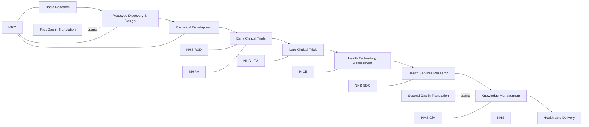
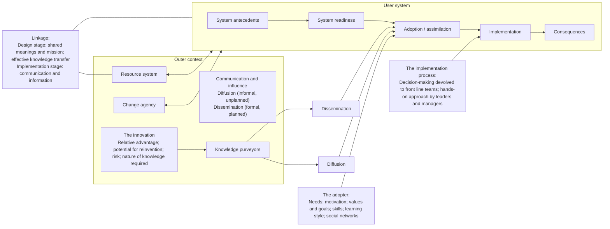
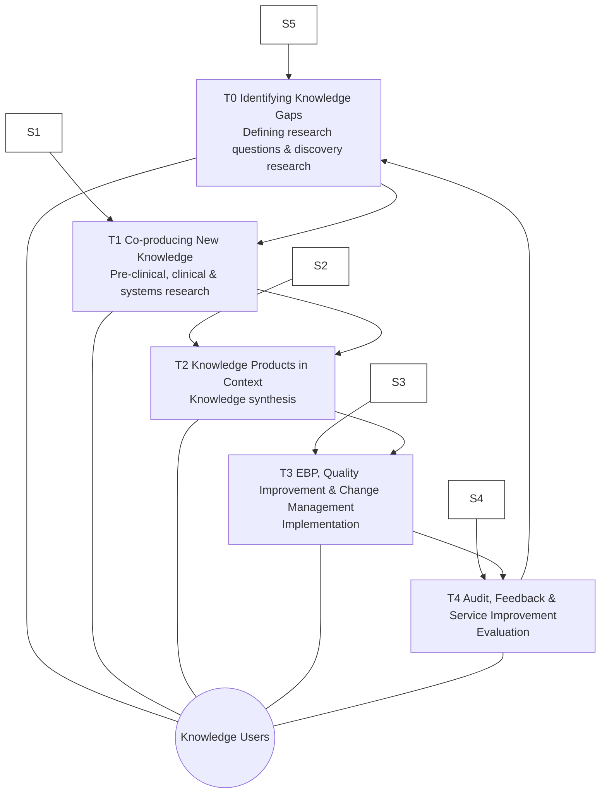
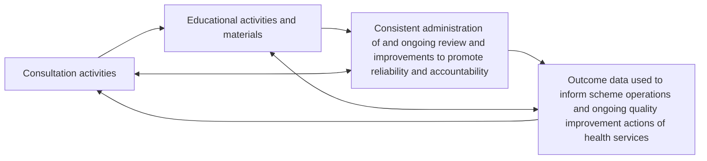

## Document page 1

OPINION Open Access

When complexity science meets implementation science: a theoretical and empirical analysis of systems change

Jeffrey Braithwaite* , Kate Churruca, Janet C. Long, Louise A. Ellis and Jessica Herkes

Abstract

Background: Implementation science has a core aim - to get evidence into practice. Early in the evidence-based medicine movement, this task was construed in linear terms, wherein the knowledge pipeline moved from evidence created in the laboratory through to clinical trials and, finally, via new tests, drugs, equipment, or procedures, into clinical practice. We now know that this straight-line thinking was naïve at best, and little more than an idealization, with multiple fractures appearing in the pipeline. Discussion: The knowledge pipeline derives from a mechanistic and linear approach to science, which, while delivering huge advances in medicine over the last two centuries, is limited in its application to complex social systems such as healthcare. Instead, complexity science, a theoretical approach to understanding interconnections among agents and how they give rise to emergent, dynamic, systems-level behaviors, represents an increasingly useful conceptual framework for change. Herein, we discuss what implementation science can learn from complexity science, and tease out some of the properties of healthcare systems that enable or constrain the goals we have for better, more effective, more evidence-based care. Two Australian examples, one largely top-down, predicated on applying new standards across the country, and the other largely bottom-up, adopting medical emergency teams in over 200 hospitals, provide empirical support for a complexity-informed approach to implementation. The key lessons are that change can be stimulated in many ways, but a triggering mechanism is needed, such as legislation or widespread stakeholder agreement; that feedback loops are crucial to continue change momentum; that extended sweeps of time are involved, typically much longer than believed at the outset; and that taking a systems-informed, complexity approach, having regard for existing networks and socio-technical characteristics, is beneficial.

Conclusion: Construing healthcare as a complex adaptive system implies that getting evidence into routine practice through a step-by-step model is not feasible. Complexity science forces us to consider the dynamic properties of systems and the varying characteristics that are deeply enmeshed in social practices, whilst indicating that multiple forces, variables, and influences must be factored into any change process, and that unpredictability and uncertainty are normal properties of multi-part, intricate systems.

Keywords: Complexity science, Implementation science, Translation, Improvement, Change, Systems innovation, Health and medical research, Take up, Speed, Culture

* Correspondence: jeffrey.braithwaite@mq.edu.au Centre for Healthcare Resilience and Implementation Science, Australian Institute of Health Innovation, Macquarie University, Level 6, 75 Talavera Road, North Ryde, NSW 2109, Australia

© The Author(s). 2018 Open Access This article is distributed under the terms of the Creative Commons Attribution 4.0 International License (http://creativecommons.org/licenses/by/4.0/), which permits unrestricted use, distribution, and reproduction in any medium, provided you give appropriate credit to the original author(s) and the source, provide a link to the Creative Commons license, and indicate if changes were made. The Creative Commons Public Domain Dedication waiver (http://creativecommons.org/publicdomain/zero/1.0/) applies to the data made available in this article, unless otherwise stated.

Braithwaite et al. BMC Medicine (2018) 16:63 https://doi.org/10.1186/s12916-018-1057-z

## Document page 2

“As complex as things are today, everything will be more complex tomorrow.”

- K. Kelly in Out of Control: The New Biology of Machines, Social Systems and the Economic World [1]

“One question … is whether the implementation of radical organizational change in health care is actually the core issue … there are many small-scale improvements and experimental projects … thus the primary issue is one of evaluation and spread.”

- L. Fitzgerald in Challenging Perspectives on Organizational Change in Health Care edited by L. Fitzgerald and A. M. McDermott [2]

Background In what now seems to us like the distant past, yet, in reality, was merely a decade or so ago, medical scientists believed that the translation of research evidence into practice followed a prescribed set of research steps, moving from test tube to needle, or bench to bedside. It was common to apply the concept of a ‘pipeline’ as a heuristic for understanding research uptake. Adherents to this view frequently diagrammed the process as a linear one, conceptualizing interventions through a series

of stages starting from the laboratory, into the randomized trial environment, and then across real-world settings. Such models implicitly assumed that those on the clinical frontlines would naturally provide new types of care, such as novel pharmaceuticals, practices, or innovative technologies, based on the latest evidence, and all heavily informed by upstream research. While various research pipeline models were proposed over the years, all were similar in that research evidence was assumed to advance in a rational, step-wise manner. One influential model, described in the Cooksey report [3] (Fig. 1), was developed following a review of health research funding in the UK examining the critical pathways to successful research translation; it is often referred to, and equivalent models have been developed in other countries [4, 5]. However, the linear, rational way in which such a model assumes that evidence is converted into practice masks the complexity of the research-practice ecosystem [6, 7]. It hides much of what is important in trying to accomplish evidence-based medicine, namely, that basic research is fundamentally risky and often does not produce any useable breakthrough; that some ideas never even reach the prototype stage, let alone preclinical development; that even if developments progress to a trial, this may prove unsuccessful; that health services research is relatively poorly funded and thus implementers often fall short of truly understanding how socio-professional systems work in practice; and that the

Fig. 1 Example of a causal linear approach for the translation of health research into practice. Source: Cooksey [3]. Use of this image is supported by an Open Government License (http://nationalarchives.gov.uk/doc/open-government-licence/version/3/)

Braithwaite et al. BMC Medicine (2018) 16:63 Page 2 of 14

## Document page 3

‘translation gaps’ (more like chasms) between research findings and their use in practice often cannot be bridged [8-10]. This traditional manner of thinking about research pathways was founded on a Newtonian-style, clockwork universe paradigm, representing a mechanistic and reductionist view of the way the world works, dominated by the randomized clinical trial and precision measurement. In reality, when we deal with non-mechanical human systems, this view has serious limitations [11]. To extend the metaphor, in contrast to a Newtonian view, the health system is more quantum mechanical than classically clockwork, and is characterized by uncertainty, emergence, and embedded unpredictability. Participants exert effects on the system; sometimes, the system appears wave-like (akin to group behaviors), sometimes particle-like (with individual agents’ efforts having influence), and it changes once measured or observed, because measurers and observers are entangled within the system and each other. The health system is probabilistic and stochastic rather than deterministic and causal.

Shifting the paradigm Some 10 to 15 years ago, several thinkers began to realize the limitations inherent in the pipeline idea [12] as it became increasingly obvious that getting evidence into practice was much harder than earlier proponents believed. This recognition came from the knowledge and understanding of human systems that had been accumulating in sociology, ecology, and evolutionary biology ever since the 1940s, and with antecedents even earlier, which we can loosely call ‘systems thinking’. The systems view is based on several fundamental ideas, essentially, that all systems are composed of a set of seemingly discrete but actually interdependent components, defined not just by their inter-relations but by the permeable and shifting boundaries between them. The components (people, technology, artefacts, equipment) are combined haphazardly and in unexpected ways, aggregating to be more than the sum of their parts, and are characterized by eddying, recurring patterns of behavior. Key moments in the path of articulating a systems view of the world arose through the work of many theorists, but management scientist Peter Checkland [13], biologist Ludwig von Bertalanffy [14], and organizational theorist Andrew Van de Ven [15] can be used as proxy exemplars. Checkland’s pioneering work [13], beginning in the 1960s, was encapsulated under the title ‘soft systems methodology’. This approach differentiated between hard systems, represented by relatively rigid techniques, technology, artefacts, and equipment, and soft systems, which involve the learning that occurs in fuzzy, ill-defined

circumstances as people navigate across time in messy ecosystems. Von Bertalanffy’s ideas date decades earlier, and his development of ‘General System Theory’ laid the platform for much of the later work. He, in turn, drew on even earlier sociological, mathematical, and biological research and theories, and by approximately 1946 he had assembled General System Theory, applying universal principles and espousing the ontological underpinnings for the interactive and dynamic nature of social organization and structuring [14, 16]. Andrew Van de Ven’s work built on this systems approach through the 1990s, culminating in his book The Innovation Journey [15], which proved timely and useful for those interested in translational research processes. An organizational theorist, he too distinguished between linear conceptualizations and more unpredictable, iterative approaches, but made a further distinction between the two world views. When speaking about innovation, he argued that attention must be paid to fluidity, messiness, and even chaotic tendencies. Van de Ven noted, through a series of case studies, that innovation often manifests not progressively in a stepby-step manner, but recursively, and always diverging from aspired-to pathways. He encapsulated this duality by showing the implicit mechanistic assumptions made in the literature, in stark contrast with what hke actually saw when he researched and observed innovative practices (Table 1). For Van de Ven and his intellectual successors, the trajectories to an innovative outcome always have several variations, multiple pathways, unanticipated processes and results, and exhibit conflict between stakeholders. People flex and adjust, accommodating to local conditions, and always deviate from idealized pathways. Innovation processes for Van de Ven are neither stable and predictable nor stochastic and chaotic. Being an innovator implies working with inherent unpredictability, sometimes with random effects, and dealing with the multiplicity of internal and external forces that impinge on and are intrinsic to the journey. Sometimes, innovators need to run with the pack, and at other timess do so in opposition. Persistence in the face of setbacks and an ability to work with, or simply just understand, multiple agents who inhabit indistinct, orthogonal, or oppositional cultures and subcultures, facing sometimes destructive and sometimes constructive politics, and experiencing periods of inactivity, are all features of the innovation journey.

Bringing the systems view together From 2004, this rich theorizing and new-fashioned conceptualizing of the ontology of improvement pathways began to be applied more concertedly to healthcare.

Braithwaite et al. BMC Medicine (2018) 16:63 Page 3 of 14

## Document page 4

Many of these ideas converged in Greenhalgh’s work on the diffusion of innovation, where she and her colleagues brought together disparate research in an influential paper that provided an extended systems model articulating the intricacies, problematics, and minutiae of getting evidence into practice (Fig. 2) [12]. The Greenhalgh model suggested four pivotal systems factors important for innovation, namely the innovation itself, and its characteristics; the system’s propensity, or its readiness, for change; the journey or implementation process; and the

external or outer context. For ease of access and readability, we have streamlined this model by rationalizing the number of variables that Greenhalgh et al. [12] stipulated in their original work. Of course, all models are simplifications of reality and even one that acknowledges a very large number of variables is, nevertheless, merely a model that reduces real-world complexity for the purposes of explication. This is not to deny that there are, at the broadest levels, iterative roadmaps from bench to bedside or test

Table 1 Assumptions and observations about core innovation concepts

Concept Linear causal thinking Systems thinking

Ideas One invention, operationalized Reinvention, proliferation, reimplementation, discarding, and termination

Innovator(s) An entrepreneur with a fixed set of full-time people over time Many entrepreneurs and other players, sometimes on-track and sometimes distracted, fluidly engaging and disengaging over time in a variety of roles

Transaction A defined network of people or firms working out details of an idea between themselves Expanding, contracting, and flexing networks of partisan stakeholders who converge and diverge on ideas

Context The environment provides opportunities and constraints on the innovation process The innovation process is captured by political and cultural features, and creates opponents or is constrained by multiple enacted environments

Process Simple, orderly, cumulative sequences of stages or phases Multiple messy, imprecise journeys; many divergent, parallel and convergent paths; some related, others not

Outcomes Final result predictable; a stable new order comes into being Final result indeterminate; many in-process perturbations, assessments and spinoffs; integration of any new order with old orders

Source: Modified from Van de Ven et al. [15]

Fig. 2 Conceptual model - determinants of diffusion, dissemination, and implementation of innovations in health services. Source: Modified from Greenhalgh et al. [12]. Written permission granted by Wiley Global Permissions

Braithwaite et al. BMC Medicine (2018) 16:63 Page 4 of 14

## Document page 5

tube to needle. However, this assessment does illuminate the reality that there are many components, moving parts, and shifting relationships, and that innovative journeys are much more convoluted, imprecise, uncertain, ambiguous, and deceptive than the pipeline proponents realized or hoped for. Social science had been waiting in the wings, eager to point this out, and have the mechanistic pipeline view excised. It brings to mind the English poet, David Whyte, who aphoristically said, “Stop trying to change reality by attempting to eliminate complexity” [17], and Abdus Salam, the Pakistani theoretical physicist and Nobel Prize winner, who once remarked, “From time immemorial, man has desired to comprehend the complexity of nature in terms of as few elementary concepts as possible” [18]. Yet, more mechanistic, simplified views of the world cannot wish away its complexity. That said, there are some today who still persistently hold a traditional pipeline view, even in the face of experience with its shortcomings. At bedrock, this most likely has something to do with the architecture of the human mind, which often sees things in cause-andeffect terms [11, 19]. The brain has evolved to compose a narrative, linear account of events that unfold with a past-present-future representation of how things work [11, 19]; this forms part of the executive function of the brain responsible for planning, organizing, and reasoning [20]. Of course, the mind is also capable of out-of-thebox creative thinking, but straight-line rationalizing frequently trumps other ways of imagining how the world works.

Complex Adaptive Systems (CAS) theory - raising the bar in the challenge to linearity When we talk about the world being more complex than we typically imagine it to be, we do not just mean that it is complicated, or layered, or socially dense, or sometimes confusing. We do not mean, either, that it is merely unpredictable and varied, although it is certainly all of these things. We are also heralding the science of complex systems, which has developed, in part, out of systems theory, as a multi-disciplinary take on understanding many facets of the world (see Glossary of terms; Table 2). Complexity theory can be applied at multiple scales, from the very smallest, ranging from quantum foam to quarks, to the minutiae of the chemical and biological underpinnings of matter, to the behavior of molecules and cells, up to the macro interactions of humans, their groups, and even entire civilizations [21]. Complexity science has more recently been utilized in healthcare in order to apprehend, for example, the management, safety, and organization of clinical services [22, 23], as well as the implementation of interventions and the translation of evidence into practice [24].

Complexity science challenges conventional wisdom and an unduly straight-line approach to implementation on a number of fronts. Traditionally, people have studied parts of a system (the people, the intervention, the outcomes) as distinct variables, assuming the influences on one another to be straightforward [25], or at least knowable. These effects were conceived as additive, where the sum of the parts equaled the whole and a predictable relationship existed; that is, causes were identifiable because they preceded effects, and led to them. In designing interventions, people in this mode have aimed for reduction and control, removing the influence of, or controlling, ‘extraneous’ or ‘confounding’ variables [26]. Researchers and implementers then inferred the ability to generalize findings derived from this approach across contexts. Thus, an effect observed through well-controlled experimentation in one environment would be assumed to occur similarly in other situations; this may have worked in some cases, but by no means always. In contradistinction, in complexity science, while the components of a system, namely the agents and their artefacts, are important, they are often secondary to the relationships between these components [27]. In such systems, agents communicate and learn from each other and from their environment, and adjust their behavior accordingly. However, there are many cross-cutting interconnections and influences. As such, the system is best described as a CAS, meaning that it has the capability to self-organize, accommodate to behaviors and events, learn from experience, and dynamically evolve [28], but not necessarily in ways anyone can forecast with any degree of confidence. The self-organizing, iterative, reverberating interactions among agents, which in the healthcare CAS includes stakeholder groups such as doctors, allied health, patients, nurses, managers, and policymakers, as well as many other subgroups, give rise to unpredictability and nonlinearity, with causes and effects often disconnected or disproportional to one another [19, 25]. CASs are distributed in space and behave dynamically across time, with idiosyncratic interactions among agents at the local level determining the context, and the present and future behaviors of the system [24]. Through the interactions among the system’s components, global system patterns emerge and new factors (e.g., technology, policy, novel relationships, practices) eventuate. These patterns are influenced by feedback loops, where different system inputs at different points in time perpetuate their own outputs, either dampening or enhancing them. Feedback helps to explain how responses to interventions, which might be positive at first, are often not sustained. The relatively loosely or tightly coupled interconnections between agents within a CAS, and their changeability over time, suggest there is much

Braithwaite et al. BMC Medicine (2018) 16:63 Page 5 of 14

## Document page 6

propensity for unintended consequences of an intervention in addition to the improvements agents hope for [29]. Borrowing from Gould and Eldridge’s famous distinction in evolutionary biology [30], health system progress in such circumstances resonates much more with the idea of punctuated equilibrium than that of morphologic gradualism.

Enter implementation science More recently, the efforts to study methods and mobilize knowledge, designed to enhance the ways in which we acquire and use evidence in healthcare, have been termed ‘implementation science’. For convenience, we can date this idea from the first issue of Implementation Science in 2006, although some scholars had been working on the development of this field before then. Implementation science is not a unified approach to getting

evidence into practice, but rather comprises diverse perspectives, frameworks, and methods. However, broadly, implementation science is characterized by three aims, namely (1) to describe the process of translating research into practice (process models), (2) to understand what influences implementation outcomes (determinant frameworks, classic theories, implementation theories), and (3) to evaluate the implementation of interventions (evaluation frameworks) [31]. The two sciences of complexity and implementation need not be mutually exclusive, though they have been largely seen and treated as such. Nevertheless, some of what is published under the umbrella of implementation science is certainly antithetical to complexity science, drawing as it does from the linear, reductionist paradigms. Table 3 provides a brief comparison of the sciences of complexity and implementation, as well as how they might be fused.

Table 2 Glossary of terms

Glossary of terms

Adaptation The capacity to adjust to internal and external circumstances; usually thought of in terms of modifying behaviors over time

Agents The individual components of a complex system - typically, individuals, whose capacity for sense-making means they can learn and adapt their behaviors across time, or artefacts

Complex Adaptive System A dynamic, self-similar collectivity of interacting, adaptive agents and their artefacts

Complexity The behavior embedded in highly composite systems or models of systems with large numbers of interacting components (e.g., agents, artefacts and groups); their ongoing, repeated interactions create local rules and rich, collective behaviors

Culture The sum of the shared values, attitudes, and beliefs across part of or the whole of an organization (e.g., across the division of medicine, or an entire hospital or health service)

Emergence Behaviors that are built from smaller or simpler entities, the characteristics or properties of which arise through the interactions of those smaller or simpler entities; the larger entities are one level up in scale, and manifest as social structures, patterns, or properties

Feedback loop A recursive mechanism creating reciprocal behaviors that reverberate back in on themselves; a positive (self-reinforcing) feedback loop increases the rate of change of a factor, creating more of its own output; in a negative (self-correcting) feedback loop, the output responses dampen the change or modulate its direction

Implementation science The processes of translating research into practice, understanding what influences translational outcomes, and evaluating the adoption of interventions

Network An interlocking web of relationships or connections at varying levels of scale in a system; the agents or artefacts are the nodes and the relationships between them are lines or vectors, which together describe the structure of the interactions of the network’s membership

Path dependence Current events and circumstances are influenced, and can be determined, by prior events and circumstances, harking back to the origins of the entity or system; path dependence underpins the point that ‘history matters’

Perturbation An internal or external disruption or unexpected event that affects normal patterned behaviors, structures or processes; often thought of as an external disturbance or interruption to the current state-of-affairs

Self-organization The way in which agents interact to coordinate their own circumstances, workplaces, processes and procedures, such that they order their work and they autonomously, or semi-autonomously, organize their localized behavior; this can occur passively or actively

Sensemaking Methods by which individuals figure out what is going on around them; a typically social process among agents in which they come to a shared meaning of their experience, and is necessary for action in the face of ambiguity or uncertainty

Social network A set of people who have relationships, communications, ties, or interactions that connect them

System dynamics An analytical modelling methodology used for problem solving, which combines qualitative and quantitative data and identifies the fundamental elements of a system, and how they influence one another over time

Tipping point A critical point in a system in which a kind of radical, potentially irreversible, change may occur, resulting in a different state of system behavior, which can settle into a new equilibrium

Braithwaite et al. BMC Medicine (2018) 16:63 Page 6 of 14

## Document page 7

Despite their differences, the two theoretical paradigms can be used together to the benefit of both theory building and healthcare practice and systems improvement. The complexity lens can help illuminate the scope of the implementation problem to be tackled and the dynamics of change and inertia. The translation of evidence into new clinical or organizational practices does not unfold in a static and controlled environment awaiting the attention of top-down change agents; it takes place in settings comprised of diverse actors with varying levels of interest, capacity, and time, interacting in ways that are culturally deeply sedimented, and have often solidified [32, 33]. In other words, the complex patterns by which healthcare is delivered, and the enmeshed social structures inherent within the system, are already established and entrenched. In such a networked, at times tightly and at others loosely coupled ecosystem,

already teeming with activity and relationships, knowledge uptake is rarely simple or straightforward, and has to find a place in an intricate, pre-existing milieu. Going further, spread is closely related to uptake. The patterns of interaction between agents and their environment are locally specific, and although they share features with other CASs, they also exhibit remarkable variation from one site to the next. The notion, then, that a new practice can be adopted equally well and in the same manner across a whole health system, is untenable. Thus, standardization of an intervention, and assuming its generalizability, can be the downfall of successful implementation [34]. However, implementation scientists, or at least those working within implementation science with pluralistic conceptualizations of the world, have not been standing still. The need to factor in context is being increasingly

Table 3 Comparison of some key characteristics of implementation science and complexity science and their integration

Features Implementation science Complexity science Complexity science and implementation science

Task The task is specific: getting evidence into clinical practice in an understandable way

The task is context dependent; properties of complexity apply to biology, ecology, physics, computer science, human social systems

Tailored solutions and iterative processes

Theoretical assumptions Heterogeneous and diverse numerous theories, frameworks, and models

Homogenous - core assumptions of complexity science are characterized by ‘universality’ (i.e., they apply across all complex systems)

Different theories, frameworks, and models require an understanding of complexity features such as unpredictability, uncertainty, emergence, interconnection

The intervention To be standardized to permit generalizability To be adapted to meet needs Factoring in complex interventions and complex settings

The context Full of confounders, a ‘problem’ to be solved for successful implementation

An intrinsic part of a complex system; a dynamic environment that must be factored in for any intervention to be successfully taken up

For improvement to be realized, the context must be re-etched or re-inscribed such that its culture, politics, and characteristics are altered

Historical underpinnings Evidence-based practice movement, statistics, and the scientific method

Systems theory, chaos theory; emanating from diverse scientific disciplines

More sophisticated change models can be encouraged to arise over time

Aims within health services research - Describing or guiding the process of translating research into practice (process models) - Understanding or explaining what influences implementation outcomes (determinant frameworks, classic theories, implementation theories) - Evaluating implementation (evaluation frameworks)

- Description of complex system

• Understanding context

• Relationships among agents

• Dynamics

• How rules and governance structures emerge, i.e., selforganization - For prediction rather than implementation

- Ensure that turning evidence into practice is accomplished without too many unintended negative consequences; improvement might be sustained, potentially through the adaptation of the intervention to different settings - Implementation is not merely based on effective planning but anticipation of a range of possible outcomes

Tools and methods Randomized controlled trials, behavior change interventions, step-wedge designs

Causal loop diagrams, system dynamics modelling, network articulations

Realist evaluation, long-term case study, participatory research, stakeholder analysis, systems mapping, social network analysis

Sources: Authors’ conceptualizations and May et al. [24]; Braithwaite et al. [7]; Rapport et al. [65]; Hawe et al. [32]

Braithwaite et al. BMC Medicine (2018) 16:63 Page 7 of 14

## Document page 8

recognized by scholars in implementation science, as is the identification of barriers and facilitators to an intervention [35]. For example, the Promoting Action on Research Implementation in Health Services formula [36] sees successful implementation as a function of the explicit interrelations among evidence, context, and facilitation. Nevertheless, these contextual characteristics of the environment are often viewed as ‘confounders’ in implementation research, rather than the normal conditions of practice in healthcare. Complexity science, in highlighting the dynamic properties of every CAS and the local nature of each system’s culture, suggests that what operates as a ‘barrier’ to implementation in one site may not do so in another, and could even be facilitative [24].

Informing implementation with complexity In complexity-informed approaches to implementation it is not enough to leverage facilitators or eliminate barriers; the focus of implementation shifts from the fidelity of the intervention to its effective adaptation [37, 38]. Thus, Hawe et al. [34] argue that, rather than standardizing aspects of an intervention, despite some essential functions being replicable, the form of an intervention should be varied as required by context [39]. This type of CAS-oriented approach is particularly important when attempting to scale-up or spread interventions previously found to be effective in one, or a limited number of sites, to the whole system. Improvement structures may thus involve tailoring to context and harnessing the self-organizing and sense-making capacities of local agents [38]. Indeed, working with bottom-up local stakeholders is paramount to adapting an intervention to their practices, facilitating ways to get them onboard with the intervention, in piloting it, in reflecting on progress amongst stakeholders, and in providing feedback to participants to help them embrace implementation iteratively over time. In such a messy, complex set of circumstances, it makes less and less sense to think of ‘knowledge producers’ as conceptually distinct from ‘knowledge users’ [40] when indeed they are inter-related. Chambers et al. [41] suggest that a further consideration is the sustainability of an intervention. Sustainable change requires the ongoing adaptation of an intervention to multilevel contexts, with expectations for lasting improvement rather than diminishing outcomes over time. In this regard, implementation in the hands of complexity theorists is increasingly recognized as an iterative and recursive, long-term process rather than a linear one [35]. Complexity science thereby encourages not only attention to the context of an intervention, but also to the interactions between elements and the consequences of this intervention for the system. The implementation method of choice will not necessarily be the randomized clinical trial or experimental design, but will

be the iterative and responsive, more ecology-aware, social science-informed approaches such as those envisaged by longer term realist designs or process evaluation of implementation efforts [32, 42]. Despite the potential utility in harnessing complexity science for implementation, until now, not much conjoining of the two, either theoretically or empirically, has occurred. There have been intermittent examples of using a complex systems framework to inform clinical transformation, as when Best et al. [43] applied complexity thinking in the implementation of new clinical guidelines in British Columbia, Canada. They noted that the implementation of the guidelines required the ability to tailor system-level recommendations to local context. In another promising turn, there have been more recent attempts to explicitly challenge the pipeline view of knowledge translation, with Kitson et al. [40] undergoing an iterative process to develop a complexity-informed model that highlighted the connections between phases previously conceptualized as discrete such as problem identification and knowledge synthesis. This model (Fig. 3) in essence highlights the key issues to be considered, including the distinctions and connections between knowledge users and knowledge generators, the importance of arriving at good definitions for the gaps, and co-producing new knowledge and contextualizing it, as well as implementation and evaluation.

Fig. 3 Process of developing a model of knowledge translation aligned to complexity science. Source: Modified from Kitson et al. [40]. Use of this image is supported by a Creative Commons License http://creativecommons.org/licenses/by/4.0/

Braithwaite et al. BMC Medicine (2018) 16:63 Page 8 of 14

## Document page 9

That said, a recent systematic review by Brainard et al. [29] found that health interventions using complexity science approaches have done so inconsistently, for example, often not incorporating an evaluation component or failing to analyze the potential, unintended consequences of the intervention. Nevertheless, this recent work has suggested the value of complexity science in creating large-scale system transformation, including sensitizing stakeholders to the natural properties of CAS that might then be leveraged by emphasizing distributed leadership, networks, sense-making, and feedback loops [38, 42, 44]. Thus, thinking is altering, at least amongst some leading theorists and researchers, and we are now more advanced in understanding systems change, with new models replacing the pipeline approach. Having established the juxtaposition of complexity and implementation, we now examine how some of these ideas have been leveraged to accomplish large-scale system transformations in Australia, exploiting the combined complexity-implementation paradigm.

Case 1: Rapid response systems and the New South Wales ‘Between the Flags’ (BtF) program Since the 1980s, there has been an increasing focus on patient safety and quality of care in hospitals internationally, as well as in Australia. Many initiatives have been designed and conducted, but there is limited evidence to show that systems-level improvement has been achieved [45]. One notable exception has been the implementation of rapid response systems (RRSs), in which specialized teams attend to inpatients whose deteriorating condition has been identified through reference to a set of defined criteria. RRSs have had a significant impact on patient safety, with evidence that they have reduced inpatient mortality and cardiac arrests by about one-third [46, 47]. Yet, RRSs illustrate that even a relatively simple and intuitively sound intervention can struggle to be adopted into the CAS of healthcare, where history, path-dependence, and context, especially social influences, can have substantial effects. RRSs were a bottom-up initiative, coming from selforganizing clinicians who recognized that the deterioration of a patient’s condition could easily go undetected until it was too late to reverse. In their chapter outlining the history of the RRS in Australia, Braithwaite et al. [48] described the strong influence of context on the adoption of this intervention. Attempts in the early 1980s to introduce a Medical Emergency Team (MET), the precursor of RRSs, failed in a large London teaching hospital due to inertia and unconcealed opposition, but succeeded in a smaller, more recently established teaching hospital in Liverpool, New South Wales (NSW), Australia. Barriers and confounders of the London

adoption were identified as the entrenched medical and management hierarchies, and an onerous bureaucracy. Perhaps more significantly, there were strongly deterministic path dependencies, represented by a pervasive belief in medical culture that patients were ‘owned’ by their admitting doctor, a belief that clouded who was authorized to treat and where accountability for patients lay. In Liverpool, innovation was more accepted, medical autonomy less jealously guarded, and there was a culture of readiness for experimentation and change. The notion of the MET began to be taken up in other countries without active implementation mechanisms. Through deceptively simple knowledge dissemination means, such as articles in low-impact publications or conference presentations, and clinical networks and informal discussions, clinicians assessed their needs and adopted METs, tentatively at first, into their own context [49]. This highlights that, while an implementation plan is typically necessary for system-wide change, bottomup, knowledge dissemination approaches can facilitate attitude change. That is, interconnected clinicians communicate locally and across the boundaries of their systems, influencing one another in their own and other environments, and self-organizing their practices in novel ways based on this new knowledge. This type of on-the-ground interactivity, whereby clinicians felt ownership of the incremental changes rather than having it imposed on them, made possible the eventual systemwide transformation. The tipping point for dissemination of many largescale, system-wide changes has been in the form of a perturbation to the system, such as the SARS epidemic in Canada or the tragic death of teenager Vanessa Anderson in NSW, Australia [50]. This latter case, deemed a preventable death caused by failure to recognize the teenager’s deteriorating condition, led to the BtF program, which flipped the bottom-up approach of previous MET implementations into a whole-of-system approach with concerted support from multiple sectors, including government [51]. BtF alludes to the Australian Surf Life Saving model that offers surveillance of bathers on popular surf beaches, who swim between two yellow and red flags, planted conspicuously in the sand. Surf Life Saving Australia estimate that they rescue 35 swimmers under threat of drowning and intervene in 913 other cases per hour on a typical summer’s day using this simple model. The BtF program used the imagery of a safe zone to redesign and standardize vital sign charts across the hospital system [52], with upper and lower unsafe limits reflecting the colors of the flags (yellow as early deterioration warning sign, red as late). Vital sign readings that were in the yellow zones triggered an urgent clinical review and the red triggered intervention by the

Braithwaite et al. BMC Medicine (2018) 16:63 Page 9 of 14

## Document page 10

specialized MET. The work was led by the Clinical Excellence Commission, an agency set up to oversee quality and safety across NSW healthcare. For a linear thinker, this highly effective intervention would seem easy to implement with predictable, positive outcomes. However, the issue is not the relative simplicity of the model of monitoring a patient’s vital signs with a standardized form and the use of a MET intervention to ‘rescue’ them when straying into the unsafe yellow or red zones, but rather the complexity of the system into which the intervention is being introduced. BtF was implemented into NSW’s 225 public hospitals in January 2010. Many had already adopted RRS-style models in idiosyncratic ways. For its successful introduction, the Clinical Excellence Commission recognized the complexity of the system, including the independence and interdependence of agents, the presence of positive and negative social influences, and the generation of possible adverse knock-on effects. Accordingly, the program had five elements, namely governance, standard calling criteria (the red and yellow flags), a two-tiered RRS in each facility, an associated education program, and an evaluation plan. Governance mechanisms supported by well-staffed and supportive advisory boards, alongside a State-wide policy directive, held hospitals to an implementation schedule with scope for local flexibility and promulgated clearly defined roles and expectations. The standard calling criteria were incorporated into the new, mandatory NSW standard observation charts with a simple track-and-trigger design. The two-tiered RRS response was developed to prevent the problem of false positives that could overwhelm the system, as well as false negatives that would result in failure to rescue [53]. Both types of errors could undermine the credibility of the program and lead to poor clinical compliance on the wards. BtF designers also understood the challenge of embedded social influences such as medical hierarchies and clinical tribalism [48]. The program diffused authority for intervention from medical consultants to any health professional detecting a patient outside the flags. Following the extensive preparation period, uptake was rapid. Clinician fears of ‘extra paperwork’ were shown to be unfounded and the empowerment of nursing and junior medical staff to initiate a rescue reinforced its utility. Evaluation data, as it was collected, showed consistent falls in cardiac arrest and mortality rates (cardiac arrest by 42%; P < 0.05) and the rapid response rate increased by 135.9% (P < 0.05) [53]. Thus, BtF showed that successful implementation requires an understanding of the complex system into which even ‘simple’ interventions are being introduced. CAS theory can help to unpack the multi-dimensional contextual issues and address them with multifaceted

solutions prior to the roll out of such a large-scale intervention.

Case 2: New nation-wide safety and quality standards In 2013, systems-level reform of the Australian accreditation model occurred with the implementation of the Australian Health Service Safety and Quality Accreditation Scheme. A critical component of the scheme, overseen by the Australian Commission on Safety and Quality in Health Care (ACSQHC), has been the development and application of new National Safety and Quality Health Service Standards (NSQHSS). The development of the 10 standards represented an important element in the safety and quality of care architecture of the health system. The standards cover areas including governance arrangements, partnerships with consumers, and eight key clinical areas of health service operation (Box 1). Each standard has a set of criteria, and for each criterion, a series of actions are required to be fulfilled. To achieve accreditation status, all core actions for health services must be demonstrated. The work has drawn international interest and is informing efforts to improve the safety and quality of healthcare in other countries [54]. The Australian Health Service Safety and Quality Accreditation Scheme has been enacted with an appreciation of the CAS features of healthcare, and the implementation process was dynamically modified in response to the multifarious and interlinked institutions, groups, and structural arrangements that can hinder or facilitate implementation, and must ultimately adopt the model. International experience shows that the inherent complexity of healthcare and in-built resistance, regardless of country, can be an impediment to adoption of such systems-level reforms [55-58].

Box 1: The 10 National Safety and Quality Health Service Standards

1. Governance for safety and quality in health service

organizations

2. Partnering with consumers

3. Preventing and controlling healthcare associated infections

4. Medication safety

5. Patient identification and procedure matching

6. Clinical handover

7. Blood and blood products

8. Preventing and managing pressure injuries

9. Recognizing and responding to clinical deterioration in acute

healthcare

10. Preventing falls and harm from falls

Source: Australian Commission on Safety and Quality in Health

Care [59].

Braithwaite et al. BMC Medicine (2018) 16:63 Page 10 of 14

## Document page 11

To respond to this challenging environment, the ACSQHC undertook extensive consultation activities with the aim of determining appropriate methods of utilizing existing government legislative powers to support the reform measures, to align the views and actions of diverse groups, and to foster distributed leadership across reform elements [59-61]. In total, the ACSQHC arranged 227 separate consultation activities involving over 1000 stakeholders spanning the breadth of the Australian health system. The perceived importance of these activities for maximizing the effectiveness of the scheme reinforces the fundamental role of continued stakeholder engagement as a necessary facilitator of national reform [54]. The need for effective stakeholder engagement has also been identified in relation to other systems-level healthcare reforms internationally [62, 63]. The ACSQHC continues to undertake consultation with health services to facilitate effective implementation of the scheme and further revisions have been made to the standards over time (in 2016 and again in 2017), assuring their continued relevance [59-61]. Despite the nature of the standards’ implementation as seemingly a top-down, government-sponsored, homogeneous model, NSQHSS have been well received by the system due to the clinical focus of most of the standards. This was considered crucial for increasing the engagement of health professionals and board members in health and quality improvement activities [54]. Participants proposed that the NSQHSS provided, for the first time, a clearly evidenced-oriented, coherent, and integrated national framework. The scheme separated and clarified responsibilities of different actors for accreditation standards development, surveying processes and decisions, and regulation and policy matters. As a result,

the initiative has been seen to mobilize expectations, integrate roles and responsibilities, and promote transparency [54]. From the outset, two potential risks to the credibility of and satisfaction with the scheme at the health system level were raised, namely the application of the NSQHSS across varied settings and the reliability of assessments by different accrediting agencies. The application of the NSQHSS across settings was discussed in the consultations as a point of credibility - that the same expectations would be applied to different health services, in different settings, was considered vital to the government’s interests in equity [54]. Four strategies to facilitate implementation, to reinforce the potential benefits, and to overcome the substantial challenges facing the scheme emerged (Fig. 4). The widespread ACSQHC consultation activities were seen to facilitate implementation by providing a common platform for knowledge transfer, encouraging widespread stakeholder engagement. At those meetings, high-quality, accessible educational activities and materials were provided. Feedback loops in the form of regular review of the program and updates to the system using progress data helped maintain momentum.

Discussion Pipeline models sprang initially from those adhering to a linear worldview of the path from knowledge creation, through knowledge products, to knowledge use. The task was to get evidence into practice, and this was seen by many as a simple, staged activity, following recipestyle models such as the one expressed by Cooksey [3]. In the minds of many scholars and practitioners, including some who self-define as implementation scientists, the process of bench to bedside has, by and large, continued

Fig. 4 Strategies facilitating implementation. Source: Greenfield et al. [54] Permission granted by John Wiley and Sons for use of this image. License number: 4236860320684

Braithwaite et al. BMC Medicine (2018) 16:63 Page 11 of 14

## Document page 12

to be conceptualized in a largely mechanical frame, although some researchers and theorists have introduced complexity ideas to it [7, 40, 64]. Complexity science offers a radically different set of considerations to those interested in systems change. As a paradigm, it denies over-simplification, and is conceptually transformative, adding a much richer set of understandings to the task of systems improvement. The two traditions of implementation science and complexity science can be drawn together, and culminate in more textured, multi-dimensional, complexityinformed models. Paradigm-shifting exemplars that have achieved this include those offered by Greenhalgh et al. [12] on innovation (Fig. 2) and Kitson et al. [40] on knowledge transfer (Fig. 3). The RRS case was bottom-up followed by top-down; the accreditation case was top-down but with middle-out and bottom-up responses. Whether top-down, middle-out, or bottom-up, these Australian case exemplars show how complexity science attributes (emerging ideas, iterative approaches, feedback mechanisms, inter-dependencies, building momentum over time, dynamic communication with multiple stakeholders, systems perturbation) can be factored into change programs. Both cases involved extensive coalition building over multiple years in order to reach a tipping point. We provide a synthesis of what we have learned from this theoretical analysis of implementation science and complexity science by using the case

exemplars to empirically illuminate the interface of the two paradigms (Table 4). These case studies show that successful systems change can take varied forms and that the implementation sequence can differ depending on circumstance and needs. Thus, a hybrid of factors drawn from implementation science and complexity science help explain how systems change occurred in these two case exemplars. The key is to harness such understanding to strengthen progress with other multifaceted health systems interventions. Based on these examples, the portents are for future change agents to conjoin complexity science and implementation science approaches for the benefit of systems-level change.

Conclusion Notwithstanding this analysis and these case exemplars, we conclude with a word of warning. Complexity thinking adds a real-world, multidimensional appreciation of the system and its density and dynamics, but it does not make it easier to effect change; in fact, the opposite is true. We can no longer assume to solve health systems issues by pretending or conspiring to imagine that they have Newtonian properties, and pipeline models should be seen for what they always were - idealistic, normative renderings of the world. Even though this makes our ambitions to improve healthcare infuriatingly more difficult, we must grapple with the world we actually inhabit, not the one we wish we did.

Table 4 Case study comparisons - exemplifications of implementation science and complexity science paradigms

Selected implementation or complexity characteristic Case 1: Rapid response systems’ adoption and spread Case 2: Introduction of national quality standards

Overarching strategy and implementation sequence Bottom-up followed by top-down implementation, with middle-out support Top-down with localized middle-out and then bottom-up acceptance

Adaptation Localized arrangements, then accommodating to an agreed, state-wide model Legislated authority; brokered national agreement following extensive consultations

Agents Clinicians in intensive care units; later, managers and policymakers; acceptance by admitting clinicians in wards

Policymakers and regulators; accreditation agencies; organizational adoption

Culture Positive values and attitudes amongst intensivists; eventual behavior and practice change across the system

Policy enactment from the highest levels as a driver of eventual change through the hierarchy

Feedback Local clinicians influencing each other recursively for many years; eventually, formal design and implementation to reinforce and institutionalize the agreed framework

Policy implementation model: Ministerial endorsement, ongoing consultation and education leading to dampening of opposition and widespread take-up and adoption

Networks Intensive care physicians as prime movers; later, policymakers, managers, and other clinicians Policy and accreditation bodies, with research partners lending expertise and support

Path dependence Thirty years in the making, leading to eventual acceptance against systems and clinical inertia Ten years of policy and managerial discussion and maneuvering before implementation

Type of perturbation Gradual radiation of acceptance over time nationally and internationally Legislation as an enabler, acting as an initial mover

Self-organization Intensive care physicians particularly; followed by whole-of-system acceptance Influence groups of policymakers, managers and academics followed by big-bang introduction

Tipping point Growing acceptance by clinicians leading to leaders eventually invoking the authority of the Clinical Excellence Commission

Ministerial authority, legislative enactment, sustained pressure from peak bodies, eventual system-wide acceptance

Braithwaite et al. BMC Medicine (2018) 16:63 Page 12 of 14

## Document page 13

Abbreviations ACSQHC: Australian Commission on Safety and Quality in Health Care; CAS: Complex Adaptive System; MET: Medical Emergency Team; NSQHSS: National Safety and Quality Health Service Standards; NSW: New South Wales; RRS: Rapid Response System

Acknowledgements Our appreciation goes to our colleagues at the “We need to talk about complexity” workshop at Green Templeton College, University of Oxford, 13-14 June, 2017.

Funding JB is Professor of Health Systems Research and Founding Director of the Australian Institute of Health Innovation at Macquarie University, Sydney, Australia. This work was supported by the Australian Institute of Health Innovation which receives 80% of its core funding from category one, peer-reviewed grants, chiefly, the National Health and Medical Research Council (NHMRC) and Australian Research Council (ARC) funding which includes, most recently, the NHMRC Partnership Grant for Health Systems Sustainability (ID: 9100002).

Authors’ contributions JB led the project, conceived the manuscript and wrote various parts of it. JB, KC, JL, LE and JH drafted parts of the manuscript and read, approved and edited the final version of the manuscript.

Competing interests The authors declare that they have no competing interests.

Publisher’s Note Springer Nature remains neutral with regard to jurisdictional claims in published maps and institutional affiliations.

Received: 19 December 2017 Accepted: 20 April 2018

References 1. Kelly K. Out of Control: The New Biology of Machines, Social Systems and The Economic World. Boston: Addison-Wesley; 1994. 2. Fitzgerald L. The diffusion of innovations: the translation and implementation of evidence-based innovation. In: Fitzgerald L, McDermott A, editors. Challenging Perspectives on Organizational Change in Health Care. New York: Taylor & Francis; 2017. 3. Cooksey D. A Review of UK Health Research Funding. London: Stationary Office; 2006. 4. Milat A, Li B. Narrative review of frameworks for translating research evidence into policy and practice. Public Health Res Pract. 2017;27:e2711704. 5. Trochim W, Kane C, Graham MJ, Pincus HA. Evaluating translational research: a process marker model. Clinical Transl Sci. 2011;4:153-62. 6. Ogilvie D, Craig P, Griffin S, Macintyre S, Wareham NJ. A translational framework for public health research. BMC Public Health. 2009;9:116. https://doi.org/10.1186/1471-2458-9-116. 7. Braithwaite J, Churruca K, Ellis LA, Long J, Clay-Williams R, Damen N, Herkes J, Pomare C, Ludlow K. Complexity Science in Healthcare-Aspirations, Approaches, Applications and Accomplishments: A White Paper. North Ryde: Australian Institute of Health Innovation, Macquarie University; 2017. 8. Balas EA, Boren SA. Managing clinical knowledge for health care improvement. Yearb of Med Inform. 2000;1:65-70. 9. Westfall JM, Mold J, Fagnan L. Practice-based research - “blue highways” on the NIH roadmap. JAMA. 2007;297:403-6. 10. Butler D. Translational research: crossing the valley of death. Nature. 2008; 453:840-2. 11. Wells S, McLean J. One way forward to beat the newtonian habit with a complexity perspective on organisational change. Systems. 2013;1(4):66-84. https://doi.org/10.3390/systems1040066. 12. Greenhalgh T, Robert G, Macfarlane F, Bate P, Kyriakidou O. Diffusion of innovations in service organizations: systematic review and recommendations. Milbank Q. 2004;82:581-629. 13. Checkland P, Scholes J. Soft systems methodology in action. West Sussex: Wiley; 1999.

14. Von Bertalanffy L. The history and status of general systems theory. Acad Manag. 1972;15:407-26. 15. Van de Ven AH, Polley DE, Garud R, Venkataraman S. The Innovation Journey. New York: Oxford University Press; 1999. 16. Von Bertalanffy L. Biologie und medizin. Vienna: Springer-Verlag Wien; 1946. 17. Whyte D. David Whyte: Poet, Author, Speaker. http://www.davidwhyte.com. Accessed 5 Dec 2017. 18. Lai CH, editor. Ideals and Realities: Selected Essays of Abdus Salam. 2nd ed. Singapore: World Scientific Publishing; 1987. 19. Plsek PE, Greenhalgh T. Complexity science: the challenge of complexity in health care. BMJ. 2001;323:625-8. 20. Ardila A. On the evolutionary origins of executive functions. Brain Cogn. 2008;68:92-9. 21. Bar-Yam Y. Complexity rising: from human beings to human civilization, a complexity profile. In: UNESCO, editor. Encyclopedia of Life Support Systems. Oxford: UNESCO Publishers; 2002. 22. McDaniel RR, Driebe DJ. Complexity science and health care management. In: Friedman LH, Goes J, Savage GT, editors. Volume 2 - Advances in Health Care Management. Bingley: Emerald Group Publishing Limited;

2001. p. 11-36. 23. Bar-Yam Y, Bar-Yam S, Bertrand KZ, Cohen N, Gard-Murray AS, Harte HP, Leykum L. A complexity science approach to healthcare costs and quality. In: Sturmberg J, Martin C, editors. Handbook of Systems and Complexity in Health. New York: Springer; 2013. p. 855-77. 24. May CR, Johnson M, Finch T. Implementation, context and complexity. Implement Sci. 2016;11:141. https://doi.org/10.1186/s13012-016-0506-3. 25. Sturmberg JP. EBM: a narrow and obsessive methodology that fails to meet the knowledge needs of a complex adaptive clinical world: a commentary on Djulbegovic, B., Guyatt, G. H. & Ashcroft, R. E. (2009) Cancer Control, 16, 158-168. J Eval Clin Prac. 2009;15:917-23. 26. Reynolds M, Forss K, Hummelbrunner R, Marra M, Perrin B. Complexity, systems thinking and evaluation - an emerging relationship? Evaluation Connections Newsletter of The European Evaluation Society. Prague: The European Evaluation Society; 2012. p. 7-9. 27. Braithwaite J, Churruca K, Ellis LA. Can we fix the uber-complexities of healthcare? J R Soc Med. 2017;110:392-4. 28. Paina L, Peters DH. Understanding pathways for scaling up health services through the lens of complex adaptive systems. Health Policy Plan. 2012;27:365-73. 29. Brainard J, Hunter PR. Do complexity-informed health interventions work? a scoping review. Implement Sci. 2016;11:127. https://doi.org/10.1186/ s13012-016-0492-5. 30. Gould SJ, Eldredge N. Punctuated equilibria: the tempo and mode of evolution reconsidered. Paleobiology. 2016;3:115-51. 31. Nilsen P. Making sense of implementation theories, models and frameworks. Implement Sci. 2015;10:53. 32. Hawe P, Bond L, Butler H. Knowledge theories can inform evaluation practice: what can a complexity lens add? New Direct Eval. 2009;2009: 89-100. 33. Leykum LK, Lanham HJ, Pugh JA, Parchman M, Anderson RA, Crabtree BF, Nutting PA, Miller WL, Stange KC, McDaniel RR. Manifestations and implications of uncertainty for improving healthcare systems: an analysis of observational and interventional studies grounded in complexity science. Implement Sci. 2014;9:165. https://doi.org/10.1186/s13012-014-0165-1. 34. Hawe P, Shiell A, Riley T. Complex interventions: how “out of control” can a randomised controlled trial be? BMJ. 2004;328:1561-3. 35. Damschroder LJ, Aron DC, Keith RE, Kirsh SR, Alexander JA, Lowery JC. Fostering implementation of health services research findings into practice: a consolidated framework for advancing implementation science. Implement Sci. 2009;4:50. https://doi.org/10.1186/1748-5908-4-50. 36. Kitson AL, Rycroft-Malone J, Harvey G, McCormack B, Seers K, Titchen A. Evaluating the successful implementation of evidence into practice using the PARiHS framework: Theoretical and practical challenges. Implement Sci. 2008;3:1. https://doi.org/10.1186/1748-5908-3-1. 37. Ghate D. From programs to systems: deploying implementation science and practice for sustained real world effectiveness in services for children and families. J Clin Child Adolesc Psych. 2016;45:812-26. 38. Lanham HJ, Leykum LK, Taylor BS, McCannon CJ, Lindberg C, Lester RT. How complexity science can inform scale-up and spread in health care: understanding the role of self-organization in variation across local contexts. Soc Sci Med. 2013;93:194-202.

Braithwaite et al. BMC Medicine (2018) 16:63 Page 13 of 14

## Document page 14

39. Fixsen DL, Naoom SF, Blase KA, Friedman RM, Wallace F. Implementation research: A Synthesis of the Literature. Tampa: Louis de la Parte Florida Mental Health Institute; 2005. 40. Kitson A, Brook A, Harvey G, Jordan Z, Marshall R, O’Shea R, Wilson D. Using complexity and network concepts to inform healthcare knowledge translation. Int J Health Policy Manag. 2017;6:1-13. 41. Chambers DA, Glasgow RE, Stange KC. The dynamic sustainability framework: addressing the paradox of sustainment amid ongoing change. Implement Sci. 2013;8:117. https://doi.org/10.1186/1748-5908-8-117. 42. Best A, Greenhalgh T, Lewis S, Saul JE, Carroll S, Bitz J. Large-system transformation in health care: a realist review. Milbank Q. 2012;90:421-56. 43. Best A, Berland A, Herbert C, Bitz J, van Dijk MW, Krause C, Cochrane D, Noel K, Marsden J, McKeown S, et al. Using systems thinking to support clinical system transformation. J Health Organ Manag. 2016;30:302-23. 44. Braithwaite J, Runciman WB, Merry AF. Towards safer, better healthcare: harnessing the natural properties of complex sociotechnical systems. BMJ Qual Saf. 2009;18:37-41. 45. Braithwaite J, Coiera E. Beyond patient safety flatland. J R Soc Med. 2010;103:219-25. 46. Chen J, Bellomo R, Flabouris A, Hillman K, Finfer S. Merit Study Investigators for the Simpson Centre, Anzics Clinical Trials Group. The relationship between early emergency team calls and serious adverse events. Crit Care Med. 2009;37:148-53. 47. Chan PS, Jain R, Nallmothu BK, Berg RA, Sasson C. Rapid response teams: a systematic review and meta-analysis. Arch Intern Med. 2010;170:18-26. 48. Braithwaite J, Clay-Williams R, Vecellio E, Marks D, Hooper T, Westbrook M, Westbrook J, Blakely B, Ludlow K. The basis of clinical tribalism, hierarchy and stereotyping: a laboratory-controlled teamwork experiment. BMJ Open. 2016;6:e012467. 49. Winters B, DeVita M. Rapid response systems: history and terminology. In: DeVita M, Hillman K, Bellomo R, editors. Textbook of Rapid Response Systems: Concept and Implementation. New York: Springer; 2011. p. 3-12. 50. Braithwaite J, Travaglia JF. An overview of clinical governance policies, practices and initiatives. Aust Health Rev. 2008;32:10-22. 51. Hughes C, Pain C, Braithwaite J, Hillman K. ‘Between the flags’: implementing a rapid response system at scale. BMJ Qual Saf. 2014;23:714-7. 52. Green M. Between the Flags Program: Interim Evaluation Report. Sydney: Clinical Excellence Commission; 2013. 53. Pain C, Green M, Duff C, Hyland D, Pantle A, Fitzpatrick K, Hughes C. Between the flags: implementing a safety-net system at scale to recognise and manage deteriorating patients in the New South Wales Public Health System. Int J Qual Health Care. 2017;29:130-6. 54. Greenfield D, Hinchcliff R, Banks M, Mumford V, Hogden A, Debono D, Pawsey M, Westbrook J, Braithwaite J. Analysing ‘big picture’ policy reform mechanisms: the Australian health service safety and quality accreditation scheme. Health Expect. 2015;18:3110-22. 55. Braithwaite J, Mannion R, Matsuyama Y, Shekelle P, Whittaker S, Al-Adawi S, editors. Health Systems Improvement Across the Globe: Success Stories from 60 Countries. Boca Raton: Taylor & Francis; 2017. 56. Braithwaite J, Mannion R, Matsuyama Y, Shekelle P, Whittaker S, Al-Adawi S, editors. Health Care Systems: Future Predictions for Global Care (in press). Boca Raton: Taylor & Francis; 2018. 57. Braithwaite J, Matsuyama Y, Mannion R, Johnson J, editors. Healthcare Reform, Quality and Safety: Perspectives, Participants, Partnerships and Prospects in 30 Countries. Farnham: Ashgate Publishing; 2015. 58. Braithwaite J, Donaldson L. Patient safety and quality. In: Ferlie E, Montgomery K, Reff Pedersen A, editors. The Oxford Handbook of Health Care Management. Oxford: Oxford University Press; 2016. p. 325-51. 59. Australian Commission on Safety and Quality in Health Care. Annual Report 2015-16. Sydney: ACSQHC; 2016. 60. Australian Commission on Safety and Quality in Health Care. Fact Sheet on the NSQHS Standards. Sydney: ACSQHC; 2017. 61. Australian Commission on Safety and Quality in Health Care. Annual Report 2016-17. Sydney: ACSQHC; 2017. 62. Wilkens J, Thulesius H, Schmidt I, Carlsson C. The 2015 National Cancer Program in Sweden: introducing standardized care pathways in a decentralized system. Health Policy. 2016;120:1378-82. 63. Phillips S, Pholsena S, Gao J, Oliveira CV. Stakeholder learning for health sector reform in Lao PDR. Health Policy Plan. 2016;31:910-8.

64. Long JC, Cunningham FC, Braithwaite J. Bridges, brokers and boundary spanners in collaborative networks: a systematic review. BMC Health Serv Res. 2013;13:158. https://doi.org/10.1186/1472-6963-13-158. 65. Rapport F, Clay-Williams R, Churruca K, Shih P, Hogden A, Braithwaite J. The struggle of translating science into action: foundational concepts of implementation science. J Eval Clin Pract. 2018;24(1):117-26. https://doi.org/10.1111/jep.12741.

Braithwaite et al. BMC Medicine (2018) 16:63 Page 14 of 14
