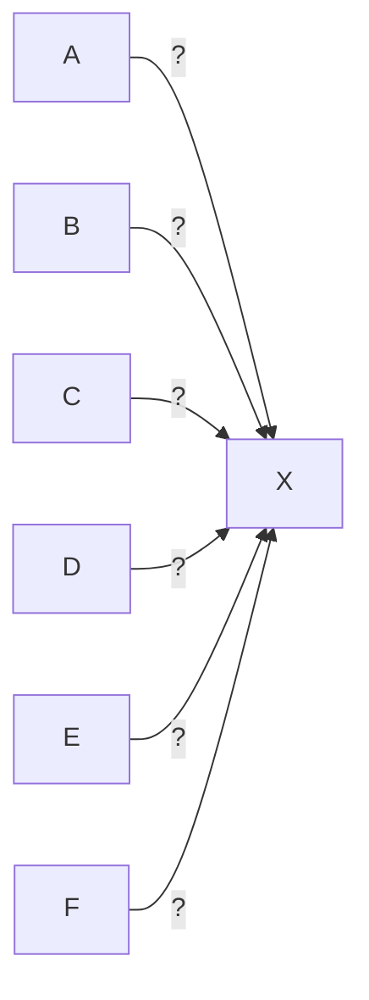

## Document page 1

Chapitre 1
Rien n'est simple... Tout se complique !
« La simplicité n'est pas si simple que cela. »
— Edgar Morin¹

« Le simple n'est qu'un moment, un aspect entre plusieurs complexités. »
— Ibid.

Le patient² avait dit oui et avait signé un formulaire de consentement indiquant avoir compris
les informations reçues en vue de la pose d'un pacemaker et les risques qui pouvaient en
découler. Il en avait discuté avec le cardiologue et l'infirmière. Rien n'avait ébranlé sa
détermination. Pourtant, arrivé en salle d'intervention, il refusa soudain, arguant qu'il devait
encore réfléchir. À son retour en chambre, l'infirmière qui s'était occupée de lui manifesta
auprès de ses collègues une certaine colère, ne comprenant pas qu'après avoir dit oui, ce
patient puisse soudain dire non et remettre en cause tout ce qui avait été investi.

Souvent peu de choses séparent le oui et le non et un rien peut faire basculer le oui vers le
non, ou le non vers le oui. Parfois même, le oui et le non coexistent, même si seul l'un d'entre
eux s'exprime ouvertement. Il suffit d'une pression indirecte des soignants ou de la famille
pour que la pensée réelle du malade ne puisse s'exprimer, à moins qu'il ne trouve tout
simplement pas le chemin pour formuler les ambivalences présentes en lui. À la logique
simplifiante qui voudrait que le oui élimine le non, et vice versa, l'infirmière de ce patient
venait de découvrir le b-a-ba de la complexité, même si elle ne l'acceptait pas.

Une chose et son contraire

Notes de bas de page :
¹ Edgar Morin, L'Intelligence de la complexité, in Edgar Morin, Jean-Louis Le Moigne,
L'Intelligence de la complexité, Paris, L'Harmattan, 1999.
² Tous les exemples de ce livre ont été reconstruits autour de leurs composantes
emblématiques, à partir de plusieurs situations similaires. Toute ressemblance avec des
personnes précises serait le fruit du hasard.

 Page PDF : 2 |
 Page Livre : 16
📄
📖

## Document page 2

16 | Les situations de soins complexes

peuvent exister simultanément ou se substituer l'un(e) à l'autre en fonction d'un simple
changement de contexte passer d'une chambre d'hôpital à une salle d'intervention, d'un
soignant à un autre. Dans certaines situations, le « oui et non » s'avère plus représentatif de la
volonté des patients que le « oui ou non ». La réalité ne s'exprime pas toujours en termes de
noir ou blanc, de santé ou de maladie, mais plutôt au travers d'un ensemble de nuances, de «
oui » qui peuvent contenir du « non », de « maintenant » qui signifient « plus tard », d'une
santé qui peut inclure la maladie, comme de maladies qui peuvent inclure la santé.

Ce passage d'une réalité simplifiée et simplifiante à une réalité plus diverse, plus interreliée,
plus interdépendante, plus... complexe, qui inclut des positions déclarées et assumées et
simultanément des silences, des ambiguïtés, des ambivalences et des paradoxes, représente un
changement majeur auquel certains soignants sont peu entraînés. Il est dès lors utile de mieux
comprendre la logique dominante dans laquelle nous vivons afin de mieux mesurer l'écart qui
la sépare de la logique de la complexité.

De la nécessité de quitter – momentanément - la complexité
Les mots « compliqué » ou « difficile » sont devenus plus rares dans le langage courant. Le
mot « complexe » les remplace fréquemment et désigne tout ce qui n'est pas, a priori, simple.
Il est utilisé pour expliquer des lenteurs, des non-décisions, des dysfonctionnements, des
conflits, des absences de résultats, des oublis, des erreurs, etc., sans que la question soit posée
de savoir si d'autres modes d'organisation, de décision, de communication, de gestion ou de
soins ne permettraient pas une plus grande efficacité.

Le mot « complexe » est devenu une donnée brute, une explication en lui-même, qui réunit
un ensemble de représentations individuelles et collectives en une pseudo-concordance, sans
qu'il soit ni besoin d'en vérifier le contenu, ni possible de la contredire. L'excès de ce mot,
tant dans son emploi que dans tout ce qu'il est censé contenir, le dénature pourtant, dans la
mesure où « le trop plein en fait un mot vide [et] comme il est de plus en plus employé, son
vide se répand de plus en plus¹ ».

Notes de bas de page :
¹ Edgar Morin, « L'Épistémologie de la complexité », in Edgar Morin, Jean-Louis Le Moigne,
L'Intelligence de la complexité, op. cit., p. 106.

## Document page 3

Page PDF : 3 |
 Page Livre : 17
📄
📖

Rien n'est simple... Tout se complique ! | 17

Les mots « complexe » ou « complexité » sont ainsi devenus ce que Gaston Bachelard
appelait un « obstacle épistémologique », un obstacle au développement de la connaissance.
Ils relèvent de la catégorie des obstacles verbaux, qui à la fois « désignent et expliquent ». Le
mot devient une explication sans que celle-ci soit explicitée et argumentée. Il donne
l'impression que celui qui l'exprime a une idée précise de ce qu'il dit, que ses interlocuteurs
peuvent sans hésiter comprendre. Parce que le mot est reconnu, son contenu semble connu. Il
devient une « habitude verbale² » qui, par son usage abusif et non spécifique, se suffit à elle-
même. Affirmer que « la situation de Mme X est complexe » amène nombre de soignants à
s'arrêter à cette explication sans chercher plus loin.

Les mots « complexe » et « complexité » sont devenus des obstacles non seulement à la
pensée, mais aussi au changement et à l'évolution des personnes, des organisations et des
pratiques. Il devient dès lors nécessaire d'en préciser les éléments constitutifs. Il serait
cependant illusoire de s'attendre à des définitions simples et à des attributs faciles à
appréhender. Trop simplifier ce que recouvre la notion de complexité revient à la dénaturer,
d'autant plus qu'il existe non pas une mais des complexités³. Pour s'en rapprocher, il faut
d'abord les différencier du simple et du compliqué.

Du simple au complexe, des regards différents sur une même
réalité
Il existe probablement autant de manières de regarder le monde qu'il y a d'êtres humains, de
cultures et de traditions, de conceptions du bien et du mal, du juste et du faux, de manières de
raisonner. Le psychologue Robert Nisbett en apporte une démonstration interpellante. Il
invite à enlever l'intrus qui se trouve dans la suite ci-dessous :

XXXX

Notes de bas de page :
¹ Gaston Bachelard, La Formation de l'esprit scientifique, Paris, J. Vrin, 1986. coll. «
Bibliothèque des Textes Philosophiques », p. 13-22.
² Ibid., p. 73.
³ Edgar Morin, Science avec conscience, Paris, Le Seuil, coll. « Points Sciences », 1990, p. 3.
⁴ Robert Nisbett, cité in Sacha Gironde, « L'Holiste Asiatique face à l'analytique Occidental
», 24 Heures, 30 mai 2013.

## Document page 4

Page PDF : 4 |
 Page Livre : 18
📄
📖

18 | Les situations de soins complexes

Nisbett rapporte que la majorité des Occidentaux suppriment le petit « x » pour constituer une
suite homogène XXX, alors qu'un Oriental a plutôt tendance à supprimer un des grands X
pour construire une suite équilibrée X x X.

Imprégné d'une culture fondée sur l'analyse, la compétition et l'individualisme, l'Occidental
sélectionne et élimine l'intrus qui sort de la norme (x) à partir d'un raisonnement reposant sur
la taille des lettres. L'Oriental, vivant dans une société fondée sur la synthèse et la
communauté, favorise la complémentarité et la solidarité. Il fait un choix qui préserve une
structure familiale : le père et la mère qui entourent l'enfant et veillent sur sa sécurité et son
éducation. Quatre lettres... deux interprétations radicalement différentes.

Derrière une réalité apparente du monde se cache une diversité de manières de se l'approprier,
qui créent une tension entre la simplicité des faits et des phénomènes et leur complexité sous-
jacente, entre l'objectif et le subjectif. Deux paradigmes¹ s'opposent et se complètent : les
approches linéaires, mécanistes et simplificatrices d'un côté et les approches non linéaires de
l'autre, qui prônent des lectures plus globales, incluant différentes formes et différents
niveaux de réalités. L'interprétation d'un événement, d'un symptôme, d'un signe clinique,
d'une plainte, d'une réflexion, d'une proposition passe ainsi d'une réalité apparemment unique
à des ensembles de réalités intriquées, complémentaires et antagonistes, parfois inaccessibles
à notre entendement, parce qu'ils ne satisfont pas nos cadres de références, nos croyances et
nos modes de pensée. Il nous est ainsi parfois difficile de comprendre les choix que peuvent
faire certains patients, tant ils nous semblent irrationnels, contraires à notre bon sens - mais
pas au leur...

Approches simplifiantes de la compréhension du monde
La science occidentale s'est développée principalement à partir d'une vision du réel issue de
la « révolution scientifique », marquée au XVIe siècle par la découverte de la mécanique de
Galilée, des lois de

## Document page 5

Notes de bas de page :
¹ Un paradigme est compris ici au sens que l'historien et philosophe des sciences Thomas
Kuhn en a donné (cf. La Structure des révolutions scientifiques, Paris, Flammarion, coll.
Champs Sciences, 2008). Il repose sur trois caractéristiques : des lois scientifiques
formalisées, des procédés heuristiques et une conception du monde, des croyances qui
réunissent les chercheurs en une communauté, à une époque donnée.

 Page PDF : 5 |
 Page Livre : 19
📄
📖

Rien n'est simple... Tout se complique ! | 19

Kepler décrivant le mouvement des planètes autour du soleil et des lois de Newton sur le
mouvement général des corps. Ces découvertes favorisèrent une représentation du monde
dans laquelle les objets naturels obéissaient à des lois mécaniques¹. Pour René Descartes,
l'univers était « une grosse horloge... une machine où il n'y a rien du tout à considérer que les
figures et les mouvements de ses parties² ». Cette conception s'étendait au fonctionnement
des êtres vivants. Comme le relevait encore Descartes : « j'ai décrit cette terre, et
généralement tout le monde visible comme si c'était seulement une machine³ ». Il n'existait à
cette époque aucune distinction stricte entre les êtres vivants et les objets inanimés et le
fonctionnement des êtres vivants était appréhendé comme un reflet du fonctionnement des
objets observables.

L'approche mécaniste de la connaissance visait à attribuer à chaque cause un effet et à chaque
effet une cause à partir de la vision déterministe de l'univers développée par Pierre-Simon de
Laplace au XVIIIe siècle. Aujourd'hui était pensé comme la continuité et la conséquence
directe de hier, au même titre que demain était pensé comme la continuité et la conséquence
d'aujourd'hui.

Cette manière de penser, dite linéaire, simplifiante, déterministe et réductionniste - car elle
tend à réduire la nature complexe des choses à un ensemble de principes simples -, repose
principalement sur l'analyse des causes et des effets. Elle peut se schématiser de la manière
suivante :
. Elle est au cœur des découvertes scientifiques modernes.

Un processus est considéré comme linéaire lorsque « les événements qui surviennent à
chacune de ses étapes sont déterminés par les contraintes de l'étape immédiatement
précédente⁴ ». Cela conduit à des mécanismes identifiables, à des conclusions directement
déductibles, à des lois constamment confirmées, à une logique formelle, rationnelle, qui

## Document page 6

Notes de bas de page :
¹ Frédérique Théry, « Le Concept de mécanisme en biologie : perspectives historique et
épistémologique », Philo Sciences, 2010,
https://philosciences.com/philosophie-et-science/philosophie-de-la-biologie/24-le-concept-
de-mecanisme-en-biologie.
² René Descartes, Les Principes de la philosophie, IV, 188, cité in Simone Manon, « Le
Modèle mécanique », 2008, https://www.philolog.fr/le-modele-mecanique/
³ Cité in L. Aimé-Martin, Œuvres philosophiques de Descartes, d'après les textes originaux,
Paris, Auguste Desrez éditeur, 1838, p. 413.
⁴ Paul Carle (dir.), Processus non linéaires d'intervention, Sainte-Foy, Presses de l'Université
du Québec, coll. « Organisation en Changement », 1998, p. 1.

 Page PDF : 6 |
 Page Livre : 20
📄
📖

20 | Les situations de soins complexes

permet la stabilité et la continuité. Elle est par là même rassurante. Si A entraîne B, ou si l'on
préfère, si B est la conséquence de A, alors tout devient explicable : ce patient a un cancer du
poumon parce qu'il a fumé toute sa vie, celui-ci présente un surpoids parce qu'il mange trop,
tel autre souffre d'une angine parce qu'il ne s'est pas assez habillé. Les mêmes causes
induisant les mêmes conséquences, des principes de généralisation, de reproductibilité et de
prédiction deviennent possibles : fumer conduit au cancer du poumon, trop manger à être
obèse, ne pas assez s'habiller à prendre froid.

Cette manière d'appréhender la réalité permet une compréhension pointue de certains
phénomènes en facilitant l'identification des éléments qui les constituent et leurs processus
sous-jacents. Cette compréhension permet d'élaborer des définitions, des classifications - des
plantes, des animaux ou des maladies -, des règles, des lois, des protocoles. La plupart des
méthodes de résolution de problème, dont le processus de soins infirmiers (PSI), ou la
démarche de soins, telles qu'elles sont enseignées¹, reposent sur des approches linéaires : des
données sont collectées, puis analysées pour en faire émerger les problèmes, les causes et les
interventions requises.

Dans le domaine de la santé, les approches linéaires sont essentielles. Comme le relève
Michael Bleich : « la question de la valeur de la linéarité dans la performance clinique, basée
sur la logique, l'analyse et la prédictibilité causale, ne se pose pas² ». Nos connaissances en
anatomie, en physiologie, en pathologie sont grandement redevables à ces approches, au
même titre que le vocabulaire qui y est lié. C'est grâce à elles que les mots « fémur », «

## Document page 7

thrombose » ou « pneumonie » ont un sens commun pour l'ensemble des professionnels de la
santé, que les processus qui les sous-tendent ont pu être identifiés et enseignés, que des
traitements standardisés ont pu être développés. D'une manière générale, tout le courant des
evidence-based en découle au travers des données statistiques qu'elles fournissent grâce à la
recherche quantitative.

Notes de bas de page :
¹ Réalisé dans une pratique auprès du patient, le PSI relève d'une démarche significativement
plus complexe, non linéaire.
² Michael Bleich, « Providing nursing care in a complex health care environment », in Alice
Ware Davidson, Marylin A. Ray, Marian C. Turkel, Nursing, caring, and complexity science:
for human-environment well-being, New York, Watson Caring Science Institute-Springer
Publishing Company, 2011, p. 256.

 Page PDF : 7 |
 Page Livre : 21
📄
📖

Rien n'est simple... Tout se complique! | 21

Limites des approches linéaires, réductionnistes
Même si elles attirent par les raisonnements qui les sous-tendent, proposant une cause à
chaque problème et par là même une solution, les approches linéaires présentent un ensemble
de limites.

Leur simplicité apparente - pertinente dans certains cas - induit des illusions sur notre pouvoir
réel d'agir sur certains problèmes, ce qui conduit à des échecs partiels ou globaux, comme le
montre le faible impact des campagnes de prévention dans le domaine de la santé. Comme le
disait Bachelard : « le simple est toujours le simplifié ; il ne saurait être pensé correctement
qu'en tant qu'il apparaît comme le produit d'un processus de simplification¹ ». L'oublier
conduit à perdre de vue des composantes essentielles du réel ;

Réductrices puisque simplifiantes, ces approches privilégient les liens directs et démontrés.
Elles ont tendance à rejeter les éléments qui ne correspondent pas à la théorie et à ses
postulats. Il en va ainsi du soignant qui refuse de reconnaître la douleur d'un patient sous
prétexte « qu'il n'a pas l'air d'avoir si mal que ça, et d'ailleurs, il rit ! » ou « qu'il n'a pas de
raison d'avoir mal ».

## Document page 8

En morcelant le réel, elles provoquent la perte de la vue d'ensemble des phénomènes étudiés
et des liens qui les réunissent au point parfois d'en perdre le sens (encadré 1.1). Ce processus
est renforcé par l'explosion des connaissances, qui conduit la science à se scinder en
différentes disciplines et en différents courants qui ont du mal à communiquer entre eux. Il en
résulte un éclatement de la médecine en un ensemble de spécialités et de sous-spécialités qui
rendent difficile une approche globale de la personne, comme en témoignent les malades
renvoyés d'un spécialiste à l'autre sans qu'aucun ne se sente responsable de toute sa
problématique de santé : « Sa perte de poids ? Ce n'est pas mon domaine ! ».

Le principe du tiers exclu qui est au cœur de cette approche et qui veut qu'une affirmation ne
peut être que vraie ou fausse, sans autres alternatives et sans qu'il soit possible qu'elle soit à la
fois vraie et fausse conduit à des postures duales de type malade ou guéri, dépendant ou
indépendant, orienté ou confus, qui figent la réalité et rendent difficiles et parfois non
entendables des positions plus nuancées. Le verbe « être » apparaît ainsi comme une
difficulté majeure en termes de communication et d'explicitation de la réalité. Lorsqu'un
patient est décrit comme étant « coopérant », « dépressif » ou « agressif », tout semble dit de
lui.

Notes de bas de page :
¹ Gaston Bachelard, Le Nouvel esprit scientifique, op. cit., p. 143.

 Page PDF : 8 |
 Page Livre : 22
📄
📖

22 | Les situations de soins complexes

Encadré 1.1. Six aveugles et un éléphant
Il était une fois six aveugles qui vivaient dans un petit village. Un jour, les habitants dirent
aux six aveugles qu'un prince étranger traversait le village à dos d'éléphant. Mais ils
n'avaient aucune idée de ce qu'était un éléphant. Ils décidèrent que, même s'ils ne
pouvaient pas le voir, ils pouvaient le palper, le sentir. Ils s'empressèrent d'aller là où
l'éléphant se trouvait et chacun le toucha.
Le premier explora le flanc. Il s'extasia : « Cet éléphant, cette merveille, est un mur, c'est
évident ».
Le deuxième palpa l'oreille et prétendit : « Oh, non, cet éléphant dont on parle tant, est un
éventail ».

## Document page 9

Le troisième caressa la patte et déclara : « Vous vous trompez, cet éléphant est un arbre ».
Le quatrième, auscultant la trompe, opta pour un serpent, tandis que le cinquième prit les
défenses pour une lance et s'exclama : « Vous dites tous n'importe quoi ! »
Enfin, le dernier, qui s'était saisi de la queue, affirma haut et fort : « Mais c'est très simple.
L'éléphant n'est rien d'autre qu'une corde »...
Ils se mirent à discuter, chacun d'eux étant convaincu que son avis était le bon. Un tumulte
s'ensuivit et les six aveugles commencèrent à se disputer, chacun refusant d'écouter la
description des autres...
Chacun avait, en partie, raison. Mais ils avaient aussi tous tort.
(Conte anonyme, rendu célèbre par John Godfrey Saxe.)

Edgar Morin relève que l'approche réductionniste conduit à des connaissances abstraites, au
travers d'un processus qui « extrait un objet de son contexte et de son ensemble, en rejette les
liens, les intercommunications avec son milieu, l'insère dans un compartiment qui est celui de
la discipline dont les frontières brisent arbitrairement la systémicité (la relation d'une partie
au tout) et la multidimensionnalité des phénomènes¹ ».

Il ajoute qu'en isolant et en morcelant ces objets, « ce mode de connaissance efface non
seulement leur contexte, mais aussi leur singularité, leur localité, leur temporalité, leur être et
leur existence et il tend à décharner le monde ; en réduisant la connaissance des ensembles à
l'addi-

Notes de bas de page :
¹ Edgar Morin, « La Pensée complexe, une pensée qui se pense », in Edgar Morin, Jean-Louis
Le Moigne, L'Intelligence de la complexité, op. cit., p. 258-259.

 Page PDF : 9 |
 Page Livre : 23
📄
📖

Rien n'est simple... Tout se complique ! | 23

tion de leurs éléments, il affaiblit notre capacité à remembrer les connaissances ; plus
généralement, il atrophie notre aptitude à relier (les informations, les données, les savoirs, les
idées) au seul profit de notre aptitude à séparer¹ ».

## Document page 10

Or, dans la vraie vie, une personne ne peut être comprise qu'au contact de son environnement
- c'est le cas aussi pour un objet. Lorsque nous observons un malade à domicile, ses
comportements ne prennent sens que si nous tenons compte des personnes présentes, des
objets et de leur histoire, des rituels de cette personne dans son habitat.

Cette disjonction de l'objet de son environnement va de pair avec la séparation entre l'objet
observé et la personne qui l'observe². Dans les approches réductionnistes, l'observateur se
considère comme extérieur à l'objet qu'il observe et ne prend pas en compte l'influence qu'il
exerce dessus. Cette posture a permis pendant longtemps de défendre la thèse de la neutralité
du chercheur et de la science et, par là même, de tous ceux dont les décisions reposaient sur
une pensée rigoureuse, cartésienne. À l'opposé, ceux dont les prises de position contenaient
des émotions, des sentiments ou des intuitions étaient regardés avec condescendance et
relégués au rang de personnes irrationnelles.

Or, pour Edgar Morin « la science est faite de théories, qui correspondent à un point de vue
sur le monde, lequel dépend des obsessions de tel ou tel scientifique » ; ainsi, « une théorie
n'est pas neutre puisqu'elle impose un certain point de vue³ ». De fait, toute observation
dépend d'un observateur avec les croyances et les connaissances qui lui servent de cadres de
référence : l'infirmière, le médecin et les parents ne ressentent pas la même chose face à la
fièvre d'un enfant et ne l'interprètent pas de la même manière.

Comme le relève encore Morin, rationaliser revient à enfermer la réalité dans un système
cohérent. Et tout ce qui, dans la réalité, contredit ce système est écarté, oublié, mis de côté, vu
comme illusion ou apparence⁴.

Notes de bas de page :
¹ Ibid., p. 107.
² Edgar Morin, « L'Épistémologie de la complexité », in Edgar Morin, Jean-Louis Le Moigne,
L'Intelligence de la complexité, op. cit., p. 60.
³ « Universalité, incertitude, éducation et complexité, Dialogue avec Edgar Morin, Hubert
Reeves et Monique Mounier-Kuhn », in Edgar Morin, Jean-Louis Le Moigne, L'Intelligence
de la complexité, op. cit., p. 191.
⁴ Edgar Morin, Introduction à la pensée complexe, Paris, ESF, coll. « Communication et
Complexité », 1996, p. 94.

 Page PDF : 10 |
 Page Livre : 24
📄
📖

## Document page 11

24 | Les situations de soins complexes

Malgré leurs qualités, les approches linéaires, appelées aussi réductionnistes, disjonctives, ou
mécanistes, conduisent à des simplifications de la réalité. Dans le monde des soins, ces
dernières peuvent être à l'origine d'erreurs d'interprétation de ce que dit et vit le patient, avec
les conflits, les pertes de confiance, les ruptures de dialogues qui en découlent, sans parler des
erreurs de diagnostics ou des non-prises en compte par les soignants de réactions ou d'effets
inattendus signalés par le patient et sa famille.

Du simple au compliqué
Comme le relevait Sempé dans ses esquisses de notre société : « Rien n'est simple... Tout se
complique¹ ». La plupart d'entre nous avons appris que 1 + 1 faisait deux. C'est simple. Mais
est-ce toujours le cas ? Comme le rappellent Martine Castello et Vahé Zartarian, si vous
ajoutez une goutte d'eau à une autre goutte d'eau, vous n'obtenez pas deux gouttes d'eau, mais
une seule, un peu plus grande...². Et on pourrait multiplier les exemples : si vous prenez un
ovocyte et un spermatozoïde, vous obtenez un ovule fécondé qui va devenir... bien plus que
cela !

Le compliqué s'oppose en partie à ce qui est simple : « l'adjectif compliqué désigne ce qui est
composé d'un grand nombre d'éléments ou ce qui est difficile à comprendre, à exécuter³ »
(figure 1.1). Difficile, mais pas impossible : la nuance est importante. L'Association pour la
pensée complexe précise que l'on est en présence d'un système compliqué aussi longtemps
que les composants de ce système et leurs interrelations sont dénombrables de manière
exhaustive⁴. L'exemple du cockpit d'un avion est souvent utilisé, avec ses boutons et de ses
cadrans, pour illustrer le compliqué. Un labyrinthe, un ordinateur, certains schémas, certains
mots (par leur orthographe, leur prononciation ou leur caractère inusité),

Notes de bas de page :
¹ Sempé, Rien n'est simple, Paris, Denoël, 1962 ; Tout se complique, 1963 ; sans oublier
Sauve qui peut, 1964.
² Martine Castello, Vahé Zartarian, Nos pensées créent le monde. Comment les sciences de
pointe conduisent à une nouvelle métaphysique, Paris, Robert Laffont, 1994, p. 43.
³ « Compliqué et complexe », Office québécois de la langue française,
http://bdl.oqlf.gouv.qc.ca/bdl/gabarit_bdl.asp?id=2310.
⁴ Réseau Intelligence de la Complexité/Association pour la pensée complexe, « Le petit
lexique des termes de la complexité, Complexité-définition usuelle »,
http://www.intelligence-complexite.org/fr/documents/lexique-de-termes-de-la-
complexite.html.

## Document page 12

Page PDF : 11 |
 Page Livre : 25
📄
📖

Rien n'est simple... Tout se complique ! | 25

## Document page 13

[Diagramme - Figure 1.1]

## Document page 14

Figure 1.1. Représentation schématique du compliqué.
Un ensemble de facteurs causaux (A à F) pourraient expliquer un phénomène (X) (une
panne, un symptôme, etc.). Ils sont cependant en nombre limité et une analyse rigoureuse
finit par en isoler un (C) comme la cause réelle.

certains calculs, certaines formules chimiques peuvent paraître compliqués aux yeux de
certains en fonction de leurs connaissances, de leur éducation ou de leurs centres d'intérêt.
Mais dès l'instant où ils sont reproductibles, ils ne peuvent être que compliqués, pas
complexes : un cockpit d'avion peut être construit en série, un labyrinthe peut être reproduit
en autant d'exemplaires que l'on veut dès qu'on en possède le plan, des formules chimiques
servent tous les jours à fabriquer en grande quantité des médicaments.

Ce qui peut être ramené à des principes, à des lois, à des formules est peut-être difficile et
compliqué, mais ne peut être considéré comme complexe. La maîtrise de ce qui est
compliqué dépend de notre capacité de le modéliser pour en comprendre les constituants et
les règles. Trouver la cause de certains symptômes peut s'avérer difficile, amenant des
patients à errer d'un médecin à l'autre, d'un examen à l'autre, parfois pendant des mois voire
des années, jusqu'à ce qu'ils trouvent la personne qui posera le bon diagnostic. Tout alors
devient beaucoup plus simple.

Les difficultés qui se trouvent en arrière-plan du compliqué font que celui-ci peut être
considéré comme « un des constituants de la complexité¹ ». Ce n'est cependant pas suffisant
pour définir la complexité : Si la complexité comprend effectivement un caractère quantitatif
(plusieurs éléments qui interagissent entre eux), elle inclut également des

Notes de bas de page :
¹ Edgar Morin, Introduction à la pensée complexe, op. cit., p. 93.

 Page PDF : 12 |
 Page Livre : 26
📄
📖

26 | Les situations de soins complexes

dimensions qualitatives, telles que l'irrationalité, l'incertitude, le désarroi, le désordre, les
aléas, l'indétermination. Ces dimensions peuvent à tout moment faire irruption dans le monde
de la maladie et de la mort; elles contribuent également à la complexité de certaines situations
de soins et expliquent les limites des approches linéaires pour tenter de les comprendre.

## Document page 15

Synthèse
●Le principe de cause-effet qui se trouve derrière le paradigme mécaniste et réductionniste a
permis des avancées scientifiques extraordinaires, notamment dans le monde de la santé.
C'est grâce à lui que bien des maladies ont pu être expliquées, diagnostiquées, traitées.
●En ne prenant en compte qu'un nombre limité d'éléments et qu'une partie de leurs
interactions, ce paradigme permet d'élaborer des principes facilement reproductibles autour
de catégories apparemment semblables, postulant que chaque membre de la catégorie se
comportera selon les règles établies. Ces principes permettent des prises de décision
rapides puisque les facteurs à prendre en compte sont connus et les conséquences des
décisions prédictibles. C'est sur cette base que sont élaborés les protocoles de traitement et
de soins.
●Ces approches linéaires ont cependant des limites importantes du fait qu'elles excluent une
partie de la réalité, notamment les variables qui sont considérées comme aléatoires ou trop
difficiles à mesurer. C'est ainsi que, pendant des décennies, la médecine a soigné les
femmes comme si elles étaient des hommes, alors même qu'elles étaient exclues des
recherches médicales, car leur cycle hormonal rendait trop difficile l'interprétation de
certains résultats.

Notes de bas de page :
¹ Edgar Morin, « L'Épistémologie de la complexité », in Edgar Morin, Jean-Louis Le Moigne,
L'Intelligence de la complexité, op. cit., p. 46-47.
