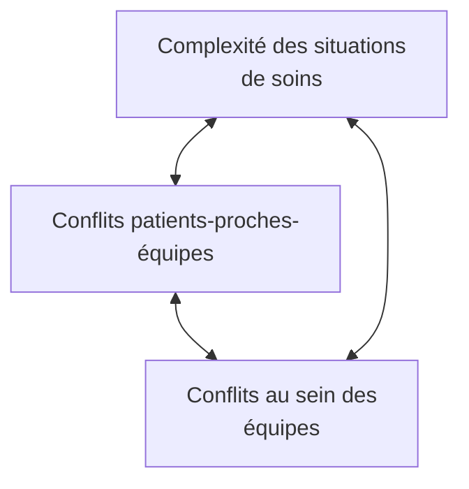

## Document page 1

Page 215
10 - Apprivoiser la complexite
« Alors que le mot "complexité" désigne une valeur, le tressage d'une singularité humaine
ou culturelle, la politique au pouvoir en fait une complication à résoudre. Alors que la
complexité s'occupe de relier (de distinguer, certes, mais surtout de mettre ensemble), on
cherche à la disjoindre pour en faire façon, pour mieux tarifer et normaliser [...]. »
— Bertrand Kiefer, « Changement d'époque », Revue Médicale Suisse, 10 juin 2009, p.
1344

Nos sociétés sont devenues de plus en plus complexes, notamment en raison de
l'hétérogénéisation et de la fragmentation des connaissances, des cultures et des repères.
Vivre dans une société et dans un environnement professionnel complexes, au contact de
personnes qui présentent des situations de soins complexes ou à fort risque de
complexification implique d'adapter sa manière d'habiter le monde et de le penser. Là où trop
de personnes souhaiteraient simplifier cette complexité en l'enfermant dans des protocoles et
des routines supplémentaires, d'autres voies sont possibles face à cette caractéristique
irréductible de la vie. Chacun des chapitres qui précèdent apporte des pistes pour s'engager
sur ce chemin. Certaines de ces idées sont reprises et développées ci-dessous, complétées par
des propositions complémentaires. La complexité ne peut pas se « gérer » puisqu'elle échappe
à toute règle. Elle ne peut que s'apprivoiser... partiellement.

Changer sa manière de penser le monde et les soins
Nos modes de pensées usuels sont suffisants pour faire face aux situations courantes qui
meublent notre quotidien. Lorsqu'un problème A surgit, qui satisfait à nos connaissances et à
nos modes de décision usuels, une réponse linéaire B permet de le résoudre. Tout est pour le
mieux.

Page 216
Les situations de soins complexes

Face à des situations complexes, un tel processus s'avère souvent inefficace voire contre-
productif, même si parfois, à court terme, il semble apporter une solution. Dès lors,
apprivoiser la complexité implique de changer notre manière de penser le monde, les soins et
les relations non seulement entre les soignants, les patients et leurs proches, mais aussi entre
les professionnels de la santé eux-mêmes. Trop nombreux sont ceux qui, toutes fonctions
confondues, conçoivent encore les responsabilités qui sont les leurs dans une logique

## Document page 2

formelle, corporatiste et hiérarchique, et ont de la difficulté à les penser de manière
systémique dans leurs interdépendances et leurs interactions.

Il est ainsi souvent bien difficile pour les patients d'obtenir des soins fondés sur une
perception d'ensemble de leurs problèmes de santé, écartelés qu'ils sont entre des
professionnels qui ne sont pas réunis dans de mêmes locaux, qui communiquent
insuffisamment entre eux ou qui sont pris dans leurs modèles du monde respectifs. À chaque
fois, le malade risque d'en payer les frais, telle cette patiente qui se retrouve en iléus parce
que le médecin hospitalier n'a pas voulu poursuivre le traitement anti-constipant prescrit par
le gastro-entérologue de ville.

De même, bien des professionnels sont confrontés à des modes d'organisation en partie
contre-productifs, qui leur imposent des écarts permanents entre le prescrit et le réel, entre la
théorie décontextualisée et une pratique située¹, avec tous les risques qui en découlent. Or,

une connaissance ne peut être pertinente que si elle crée une navette incessante qui sépare
et relie, analyse et synthétise, abstrait et réinsère dans le concret².

Cette navette permet d'éviter la fragmentation arbitraire et l'abstraction³ dans laquelle nous
maintiennent les modes de pensée dominants et invite à mieux relier les personnes, les
connaissances, les cultures, les environnements, afin que les soins soient plus efficaces et plus
économes en ressources humaines et financières.

Notes de bas de page :
1. Cf. supra, p. 125 et suiv.
2. Edgar Morin, Jean-Louis Le Moigne, L'Intelligence de la complexité, op. cit.
3. Edgar Morin, « Association pour la pensée complexe. Intentions et buts »,
http://www.rond-point.qc.ca/rond-point/complexite/association-pour-la-pensee-complexe/.

Page 217
Apprivoiser la complexité

Penser la complexité implique un mouvement permanent entre nos idées, croyances, valeurs
et connaissances, à l'aide d'une réelle confrontation¹ aux idées, croyances, valeurs et
connaissances des autres personnes, et surtout, de celles qui pensent différemment de nous,

## Document page 3

afin d'enrichir nos modèles du monde et de renforcer notre conscience de la pluralité des
réalités. Cette manière de pensée a pour intention de :

négocier avec les incertitudes et les contradictions, [...] de reconnaître, partout où elles
sont en œuvre, les dialogies² d'ordre/désordre/organisation. Elle pose ses objets de
connaissance comme les produits d'une coopération entre une réalité objective et les
opérations mentales des observateurs/concepteurs³.

L'infirmière qui souhaiterait approcher les situations de soins complexes devrait ainsi tendre à
:

● créer un mouvement de va-et-vient entre des informations isolées et leur rattachement tant
à la personne qu'à son histoire de vie, à ses valeurs et croyances, à son contexte et à ses
différents environnements ;
● inclure dans son mode de pensée l'idée qu'aussi rigoureuses que soient ses connaissances,
il existe toujours une part de non-savoirs, de doutes, d'incertitudes, de contradictions au
sein même des théories, entre les différents courants théoriques, et entre les théories et la
réalité de la personne soignée ;
● s'arrêter pour réfléchir à comment prendre en compte (principe dialogique), dans ses
réflexions, les avis, les questionnements, les prises de position contraires à ce qu'elle pense,
plutôt que de s'y opposer par besoin d'affirmer son rôle ou par peur du désordre que
pourrait créer ce qui est contraire à ce qu'elle croit ;
● tenir compte du fait que, quelle que soit la rigueur de sa démarche, il existera toujours des
parts d'imprévus, de désordre, de facteurs non...

Notes de bas de page :
1. La personne qui se confronte doit le faire avec une grande honnêteté vis-à-vis d'elle-même
et d'autrui. Trop de pseudo-consultations ne prennent pas réellement en compte les points de
vue des personnes consultées.
2. Le texte consulté comporte le mot « dialogue » à la place de « dialogie », dans une
structure grammaticalement et syntaxiquement peu compréhensible. J'ai fait le choix de
considérer qu'il s'agissait probablement d'une erreur de retranscription et ai préféré le terme
de dialogie, cher à Edgar Morin, d'autant plus que ce dernier implique d'inévitables
dialogues...
3. Edgar Morin, « Association pour la pensée complexe. Intentions et buts », art. cité.

## Document page 4

Page 218
Les situations de soins complexes

...contrôlables, qui peuvent à tout moment remettre en question les meilleures décisions, les
meilleures organisations ;
● maintenir une distance réflexive, car, quelle que soit son honnêteté intellectuelle et morale,
sa lecture des événements est toujours une construction qui tient compte de ses cadres de
références, expériences, croyances, valeurs et émotions. En tant que telle, cette lecture n'a
ni plus ni moins de valeur que celle faite par d'autres personnes, notamment par le patient ;
● considérer comme potentiellement vraie toute information transmise par un patient ou un
de ses proches, même si cela semble contraire à ce qu'elle croit ou perçoit.

Une telle approche invite à rechercher d'autres explications que les évidences premières, à
sortir des routines de pensée avec les stéréotypes et les jugements qui parfois les
accompagnent, à accepter que même le moins vraisemblable peut s'avérer vrai, à imaginer
des solutions qui concilient des points de vue, des impératifs, des valeurs et des croyances qui
divergent, à tenir pour potentiellement plausible tout ce qui n'a pas été démontré comme faux.

Quitter sa zone de confort pour explorer d'autres réalités
L'aérostier Bertrand Piccard considère qu'« au lieu d'être conditionnés dans des certitudes, il
faudrait saisir qu'il existe des milliers de manières de penser, des milliers de réalités
différentes¹ ». Cela implique pour les soignants d'accepter pleinement que la personne qu'ils
soignent a une autre perception qu'eux de sa santé, de sa qualité de vie, de sa maladie ou de
ses handicaps, de sa finitude, des soins dont elle devrait bénéficier.

Une telle acceptation implique à son tour de quitter ce que B. Piccard appelle notre zone de
confort, qui « correspond à ce que nous avons réussi à constituer comme repères, comme
certitudes, comme habitudes. Elle contient notre façon de penser, de nous comporter, d'entrer
en relation...

Notes de bas de page :
1. Bertrand Piccard, Changer d'altitude. Quelques solutions pour mieux vivre sa vie. Paris,
Stock, 2014, p. 29.
2. Cf. Claude Curchod, Prévenir et dénouer les conflits dans les relations soignants-soignés,
2e éd., chap. 3, « La réalité des soignants n'est pas la réalité des soignés », Issy-les-
Moulineaux, Elsevier Masson, 2018.

## Document page 5

Page 219
Apprivoiser la complexité

...avec notre environnement. C'est notre vision de la vie, du monde, des autres et de nous-
mêmes¹ ».

Quitter sa zone de confort peut être menaçant pour tous les professionnels qui ressentent un
besoin élevé de certitudes, de contrôle et, de façon plus ou moins consciente, de pouvoir.
Accepter comme crédibles ces « milliers de manières de penser » et ces « milliers de réalités
différentes » conduit en effet à une profonde remise en question tant de leurs certitudes que
de ce qu'ils croient contrôler. Un tel cheminement est pourtant nécessaire puisque, parmi les
facteurs à l'origine de la complexité de certaines situations de soins, se trouvent des
connaissances, des expériences, des croyances, des valeurs multiples, à la fois
complémentaires et en contradiction.

L'humilité est une des ressources qui permet de quitter sa zone de confort tout en étant
suffisamment en sécurité. Lorsque nous n'avons rien à montrer et à démontrer à nos propres
yeux et à ceux des autres, il est possible d'être ouvert à ce qui nous surprend².

Travailler en réseau de compétence
Réfléchir ensemble limite les phénomènes de compétition, de chasse gardée, de crainte du
regard et du jugement d'autrui. De la mise en commun naissent des regards nouveaux, des
prises de conscience, des hypothèses audacieuses, des intuitions salvatrices ; des expériences
passées, des cadres de référence oubliés ressurgissent. Le paradigme de complexité qui invite
à relier amène à favoriser la coopération, les synergies, les partages de ressources et de
savoirs.

Quels que soient son statut et son niveau de connaissance, chaque personne impliquée dans
une situation de soins complexe a quelque chose à apporter dans sa compréhension et son
apprivoisement, car elle la perçoit avec sa propre subjectivité et l'ensemble des subjectivités
présentes constituent des formes de savoirs complémentaires aux savoirs scientifiques
reconnus. Cela implique que :

seuls des réseaux horizontaux, avec un respect mutuel et une bonne communication, sont à
même de prendre en charge les patients plurimorbides pour éviter qu'ils ne se sentent
morcelés: ces réseaux assurent une relation basée sur la continuité avec un nombre
restreint de soignants stables (continuité de...

## Document page 6

Notes de bas de page :
1. Bertrand Piccard, Changer d'altitude, op. cit., p. 31.
2. Cf. supra, p. 212-213.

Page 220
Les situations de soins complexes

...la personne et non seulement du dossier) qui peuvent avoir recours si besoin à des unités
spécialisées (verticales) comme ressource¹.

Cette remarque, en lien avec la complexité des situations médicales, est transposable aux
situations dont la complexité relève principalement du champ de compétence des infirmières.
Ces situations présentent des dynamiques qui mobilisent des connaissances spécifiques et des
interactions entre ces connaissances qui sont uniques. Identifier les personnes ressources en
fonction de la spécificité de leurs savoirs ou de leurs approches et se mettre ensemble pour
tenter de décoder ces dynamiques devient dès lors impératif. De tels réseaux devraient
comprendre - d'une manière à déterminer à chaque fois - le patient et ses proches, qui
détiennent, parfois plus que les professionnels de la santé, les clés qui permettront de
décomplexifier la situation en faisant soudain émerger du sens là où, de l'extérieur,
l'irrationnel semblait dominer.

Travailler en réseau, au même titre que travailler en équipe, implique cependant de se faire
confiance et de ne pas entrer dans les jeux de discrédits qui sont trop souvent à l'œuvre dans
certaines situations. La confiance est à démontrer devant le patient et sa famille, mais
également à exercer au sein des équipes pour partager ses désaccords afin de les dépasser.

Utiliser les soins de base comme support pour mieux
connaître le patient
Sanchia Aranda et Rosie Brown ont exprimé des « inquiétudes considérables en lien avec le
changement substantiel des soins infirmiers qui s'éloignent des "soins infirmiers de base"² ».
Les conséquences qui découlent de cet éloignement font que bien des dimensions des soins
qui les rendent complexes sont laissées pour compte, avec, en parallèle, une perte de
compétences des infirmières. Il en résulte une perte d'attention envers les interactions
complexes qui s'établissent entre le patient, sa maladie, et les conséquences physiques et
psychologiques liées au fait d'être malade³.

## Document page 7

Notes de bas de page :
1. Marianne Samuelson, Lilli Herzig, Daniel Widmer, « L'Avenir des soins primaires
interprofessionnels dans un temps de crise », Revue Médicale Suisse, nº 8, 2012, p. 2254-
2259.
2. Sanchia Aranda, Rosie Brown, « Nurses must be clever to care », art. cité, p. 131.
3. Sioban Nelson, « Ethical expertise and the problem of the good nurse », in Sioban Nelson,
Suzanne Gordon (eds), The complexities of care: nursing reconsidered. op. cit., p. 123-124.

Page 221
Apprivoiser la complexité

Une telle évolution est à haut risque d'augmenter le nombre de soins omis¹, et de renforcer les
processus de complexification iatrogène. En effet, certaines situations de soins apparaissent
comme difficiles voire complexes, ou le deviennent, simplement parce que l'équipe ne
connaît pas suffisamment le patient pour interpréter de manière adéquate ses comportements.

Or, comme le relèvent S. Aranda et R. Brown: « une grande partie de ce que les infirmières
apprennent au sujet des patients se produit parce qu'elles sont dans une relation immédiate et
intime avec le patient », relation qui « existe parce que les infirmières fournissent des soins
intimes », en contact direct avec le corps du patient².

Dans les situations de soins complexes ou à risque de le devenir, il est dès lors impératif que
les infirmières utilisent les soins de base comme support pour collecter des informations, les
analyser, identifier les problèmes de soins présents et les valider auprès du patient. Toute la
plus-value d'un soin de base réalisé par une infirmière par rapport au même soin réalisé par
un personnel moins qualifié réside dans cette démarche.

Développer sa vigilance
Même les situations apparemment simples peuvent contenir des « aspects spécifiques » qui
relèvent de niveaux de complexité plus élevés³. Ces éléments passent souvent inaperçus, la
situation du patient paraissant dans son ensemble ne pas présenter de problème. Telle cette
patiente, assez gaie, occupée à regarder dans son miroir une cicatrice de biopsie pour en
mesurer l'impact esthétique, évalué comme très faible par les soignantes présentes. Mais la
patiente se referma comme une huître à l'instant où une infirmière plus expérimentée,
profitant d'un instant plus confidentiel, lui demanda comment elle vivait ce prélèvement et
l'attente des résultats. Ou tel ce patient qui, au cours d'un petit-déjeuner, confia à ses

## Document page 8

compagnons de chambre avoir chuté plusieurs fois à domicile au cours des dernières
semaines ; cette problématique était passée inaperçue, n'étant pas au cœur de ses motifs
d'hospitalisation.

Notes de bas de page :
1. Cf. supra, p. 147 et suiv.
2. Sanchia Aranda, Rosie Brown, « Nurses must be clever to care », art. cité, p. 131.
3. Cf. supra, p. 110 et suiv.

Page 222
Les situations de soins complexes

De telles situations relèvent des soins omis¹, privant les patients des actions de prévention, de
soins et d'éducation dont ils auraient eu besoin. C'est grâce à sa vigilance, à ses connaissances
et à son expérience que l'infirmière peut repérer des indices de ces problématiques sous-
jacentes plus complexes, ou en formuler l'hypothèse à partir de son expérience. Cette
vigilance a été conceptualisée². Les infirmières devraient y être systématiquement entraînées
et son exercice faire l'objet d'une supervision.

Viser des connaissances maîtrisées
Claire Lindberg et al. soutiennent que, « bien que les infirmières d'aujourd'hui soient
fréquemment confrontées à des situations qui sont complexes, elles n'ont souvent pas les
connaissances et les fondements requis³ ». À l'exception des connaissances mobilisées
quotidiennement, le savoir des infirmières est souvent insuffisant pour faire face à des
situations qui sortent de l'ordinaire ou n'atteint pas un niveau de maîtrise suffisant.

Par maîtrise, il faut entendre le fait d'être capable de développer ce savoir au travers des
éléments qui le constituent, en l'argumentant, en l'explicitant au travers d'exemples et de
contre-exemples, en construisant des liens avec d'autres cadres de référence connexes et en
l'appliquant de manière différenciée. Ne pas disposer de cette connaissance peut conduire à la
non-identification de certains signes cliniques ou à en faire une interprétation erronée, amène
des jugements, des émotions contre-productives face à des comportements que le
professionnel ne comprend pas, à des langages non professionnels mal compris et mal
interprétés.

## Document page 9

Développer un niveau de maîtrise suffisant de ses connaissances et de leur utilisation en
temps réel implique un processus d'entraînement qui permet la consolidation des savoirs et
leur stockage dans la mémoire à long terme, garantissant ainsi un bon niveau de sécurité dans
leur utilisation. Or, bien souvent, les systèmes de formation sont conçus comme cumulatifs et
non intégratifs, ce qui entraîne la perte des connaissances vues antérieurement, au détriment
des patients et des soignants eux-mêmes.

Notes de bas de page :
1. Cf. supra, p. 147 et suiv.
2. Geralyn Meyer, Mary Ann Lavin, « Vigilance: the essence of nursing », art. cité.
3. Claire Lindberg, Sue Nash, Curt Lindberg, On the edge: Nursing in the age of complexity,
op. cit., p. 27.

Page 223
Apprivoiser la complexité

Créer une navette permanente entre le savoir et l'action,
l'action et le savoir
Tout cadre théorique à la fois apporte des éclairages sur la réalité, la simplifie et la déforme.
Dès lors, prétendre maîtriser un savoir sur son seul plan théorique sans le confronter
régulièrement à la réalité ne permet pas d'en mesurer la puissance, les limites et les
évolutions. La compétence professionnelle doit être comprise comme une co-construction
dialogique et récursive de deux processus : savoir pour faire et faire pour savoir (figure 10.1),
qui rappelle la navette incessante qui « abstrait et réinsère dans le concret¹ » prônée par Edgar
Morin, évoquée plus haut.

Pour les soignants, cette navette devrait être accompagnée durant les premières années
d'exercice de leur rôle professionnel, car elle n'a rien de naturel. La démarche de soins en est
un bon exemple. Elle sert de fondement méthodologique à la pensée clinique infirmière.
Alors qu'elle constitue « un processus complexe, profondément dynamique, qui n'est maîtrisé
par le clinicien qu'après de longues années de formation et d'entraînement² », elle ne fait
l'objet d'aucun accompagnement pour la majorité des infirmières en début de carrière, en vue
d'en développer la maîtrise en conditions réelles de travail.

Or, cette maîtrise est essentielle pour comprendre les situations de soins difficiles et éviter
que celles-ci ne se complexifient. Bien conduite, cette démarche de soins - avec les outils de

## Document page 10

communication qui la sous-tendent (écoute active, reformulation, relation d'aide, etc.) et les
connaissances nécessaires sur les concepts de soins présents ou potentiels – permet souvent
de décomplexifier certaines situations en les éclairant d'un jour nouveau. Comme le relève
Edgar Morin, « l'intelligibilité des phénomènes globaux ou généraux a besoin de circuits, de
va-et-vient et de navettes entre les points singuliers et les ensembles³ ». C'est une telle navette
qui devrait être faite entre ce que l'infirmière connaît, voit et entend, et l'histoire du patient, sa
pathologie, ses ressources, son vécu, etc. pour que sa démarche réflexive soit performante.

Notes de bas de page :
1. Edgar Morin, Jean-Louis Le Moigne, L'Intelligence de la complexité, op. cit.
2. Pierre Désaulniers, Jean-François Letendre, « La Démarche clinique: un outil toujours
d'actualité », Recherche en Soins Infirmiers, n° 84, mars 2006, p. 4-10.
3. « Le Défi de la complexité », Chimères, nº 5-6, 1988,
http://www.revue-chimeres.fr/drupal_chimeres/files/05chi05.pdf.

Page 224
Les situations de soins complexes

Figure 10.1. Approche dialogique de la compétence.

## Document page 11

Combattre le fléau de la prétention de connaître par une
distance critique
Gérard Bélanger, professeur en économie, invite à combattre l'épidémie que constitue la «
prétention de connaître », qu'il qualifie de « fléau »¹. Cette prétention peut se retrouver à tous
les âges, dans toutes les professions et dans toutes les fonctions. Elle repose tant sur les
croyances issues de la pratique que sur la considération que certains s'attribuent en fonction
de leur statut hiérarchique ou professionnel, et/ou sur la représentation de certains que ce qui
est publié est vrai, en dépit des critiques sur la fiabilité de bien des résultats de recherche
(encadré 10.1).

Cette prétention de connaître peut s'avérer un facteur de complexification et devenir un
obstacle à la compréhension et à la résolution de certaines situations de soins complexes,
lorsque le savoir en question devient une certitude, une généralisation appliquée sans tenir
compte de l'unicité des patients. Utilisée telle quelle, la « connaissance » peut devenir
délétère, source d'arrogance, de pouvoir et de jugements, alors qu'elle devrait stimuler le
partage, la curiosité et la croissance collective.

Les situations de soins complexes représentent toujours un défi lancé aux connaissances sur
lesquelles s'appuient les pratiques courantes. Cela impose aux infirmières d'avoir la sagesse et
la rigueur intellectuelle de prendre la distance nécessaire pour poser un regard critique sur ce
qu'elles apprennent et font, pour écouter les propos des patients et des familles, pour prendre
en compte les avis parfois iconoclastes de personnes moins formées qu'elles et se souvenir
qu'« il y a toujours une zone d'incertitude dans chaque donnée scientifique² ».

Notes de bas de page :

1. Gérard Bélanger, « La Prétention de connaître : un fléau à combattre plus que jamais! »,
Revue Canadienne de Gestion, Infolettre, 17 août 2017.
2. Jacques Cornuz, « Enseignement du doute médical et des incertitudes aux étudiants de
Lausanne », Courrier du Médecin Vaudois, juillet-août 2017, p. 7.

Page 225
Apprivoiser la complexité

## Document page 12

Encadré 10.1. Les limites de la connaissance
En médecine, 60 à 80 % des résultats de recherche sont non reproductibles. L'éditorialiste
Richard Horton, de la prestigieuse revue The Lancet, en déduisait qu'« une grande partie
de la littérature scientifique, peut-être la moitié, est inexacte*¹ ». Parmi les raisons
évoquées, R. Horton soulignait que « dans leur quête pour raconter une histoire
irrésistible, les scientifiques trop souvent sculptent leurs données pour qu'elles s'adaptent à
leur théorie préférée du monde. Ou bien ils réaménagent leurs hypothèses pour qu'elles
s'adaptent à leurs données ». Il suffit parfois simplement de changer la méthode d'analyse
pour obtenir des résultats différents. À cela s'ajoute notamment la responsabilité des
journaux scientifiques et des universités, pris dans la pression des ratings, des recherches
de fonds et de prestige. De fait, le principe de l'observateur inclus dans le processus
d'observation s'applique autant aux cliniciens, qu'aux chercheurs, aux rédacteurs et aux
enseignants, que leurs rôles soient d'appliquer, de trouver, de diffuser ou de transmettre les
savoirs « scientifiques ».
Ces réalités ne doivent pas entraîner un dénigrement de la recherche scientifique,
essentielle à l'avancement des connaissances et à de meilleurs soins ; elles appellent à une
distance critique permanente sur ses résultats et leur mise en œuvre et, surtout, sur notre
prétention de savoir ce qui est juste et bon pour l'autre.
*untrue, traduisible par « inexact » ou par « faux ».
1. Richard Horton, « Off line: What is medicine's 5 sigma? », The Lancet, vol. 385, 2015,
p. 1380.

Promouvoir le développement d'infirmières de niveau
expert
Les travaux de Defloor et al. sur la complexité des situations de soins¹ font apparaître pour le
niveau de complexité le plus élevé un profil de compétences qui correspond aux niveaux
d'infirmière performante et d'infirmière experte selon les travaux de Patricia Benner sur le
développement de l'expertise professionnelle infirmière.

Notes de bas de page :

1. Tom Defloor et al., « The clinical nursing competences and their complexity in Belgian
general hospitals », art. cité ; cf. aussi supra, p. 111 et suiv.

## Document page 13

Page 226
Les situations de soins complexes

Les infirmières performantes perçoivent les situations comme des touts et non en termes
d'aspects¹, tandis que les infirmières expertes ne s'appuient plus sur un principe analytique
pour passer du stade de la compréhension de la situation à l'acte approprié. L'experte, qui a
une énorme expérience, comprend à présent de manière intuitive chaque situation et
appréhende directement le problème [...].²

Cette « énorme expérience » est un facteur important de compréhension des situations de
soins complexes. L'infirmière experte puise en effet dans les milliers de situations qu'elle a
rencontrées des similitudes avec la situation à laquelle elle fait face pour identifier des points
communs qui seront autant de clés de compréhension et d'interventions. Les actions qu'elle
met en œuvre reposent par ailleurs sur les ficelles du métier qu'elle a progressivement
acquises, facilitant ainsi l'obtention de résultats parfois inespérés, quitte à s'affranchir des
règles et des recommandations usuelles.

Différents facteurs menacent cependant les niveaux d'expertise décrits par Patricia Benner et,
par là même, les capacités des soins infirmiers de faire face aux situations de soins
complexes. Kimberley Bowen et Dawn Prentice³ s'inquiètent ainsi de la possible extinction
de ces niveaux en raison :

● de la standardisation et de la protocolisation des soins en cours dans nos systèmes de
santé ;
● du fractionnement des soins entre différents corps professionnels avec la perte de vision
globale du patient et la perte d'expertise des infirmières liées à une fréquence moindre de
réalisation de certains soins et de certains raisonnements ;

Notes de bas de page :

1. P. Benner relève que « la perception est ici un mot clé. La perspective n'est pas bien
réfléchie, mais "se présente d'elle-même" » (De novice à expert, op. cit., p. 29). En fait, grâce
à son expérience, l'infirmière performante n'analyse plus la situation du patient besoin par
besoin, problème par problème, comme elle ne conçoit plus son travail comme une liste de
tâches. À partir des informations clés perçues, elle se fait une représentation précise de la
situation globale du patient et des soins qu'il requiert, au même titre qu'elle se fait une idée
précise du type de complications qui peuvent survenir et des ressources qu'il faut mobiliser

## Document page 14

chez le patient. Cela lui permet d'avoir une idée rapide des éléments prioritaires du projet de
soins à discuter avec la personne malade.
2. Patricia Benner, De novice à expert, op. cit., p. 36.
3. Kimberley Bowen, Dawn Prentice, « Are Benner's expert nurses near extinction? »,
Nursing Philosophy, nº 17, 2016, p. 144-148.

Page 227
Apprivoiser la complexité

● des développements techniques, qui, dans certains services, font que « la technologie est
en train de contrôler l'autonomie et la capacité de prendre des décisions des infirmières, et
particulièrement des infirmières novices¹ », empêchant le développement de leur sens
clinique et de leur expertise.

Bowen et Prentice soulignent aussi :

Avec l'utilisation de procédures standardisées survient une obligation professionnelle de
suivre les soins tels qu'universellement identifiés, ce qui rend de plus en plus difficiles à
justifier les modifications des soins fondées sur la compréhension thérapeutique de
l'infirmière de ses patients spécifiques et sur la pensée intuitive qui se développe durant les
soins².

D'autres auteurs reprochent également au courant evidence-based de trop insister sur la valeur
de la preuve scientifique, aux dépens du jugement clinique et de l'expertise professionnelle
personnelle³. Or, cette dernière est essentielle pour personnaliser les soins et éviter des
pratiques inadaptées à certaines situations particulières.

Afin d'éviter ces dérives, il est primordial - tant au niveau des professionnels, des institutions
que des chercheurs - que les savoirs d'expérience des praticiens experts et les savoirs
académiques issus de la recherche soient considérés comme complémentaires, avec une égale
légitimité, de manière à ce qu'un dialogue puisse s'établir entre eux, et que l'expérience
clinique des experts obtienne la juste reconnaissance qui lui est due.

Favoriser le développement d'infirmières expertes implique un renforcement de
l'encadrement de la réflexivité qui devrait entourer les soins. Cela peut sembler utopique au
vu des pressions financières exercées sur les services cliniques. C'est oublier que la
souffrance des patients, des proches et des équipes soignantes liée à des situations complexes

## Document page 15

mal accompagnées, les conflits soignants-soignés/soignants-soignants qui résultent de ces
situations, les conséquences en termes d'erreurs, de soins omis et de prolongation des durées
de séjour qui...

Notes de bas de page :

1. Ibid.
2. Ibid.
3. Cf. Mark Avis, Dawn Freshwater, « Evidence for practice, epistemology and critical
reflexion », Nursing Philosophy, n° 7, 2006, p. 247-256 ; Romana Hasnain-Wynia, « Is
evidence-based medicine patient-centered and is patient-centered care evidence-based? »,
Health Services Research, n° 41(1), 2006, p. 1-8.

Page 228
Les situations de soins complexes

...peuvent en résulter coûtent également très cher. Sans oublier le coût pour certains soignants
lorsque leurs compétences sont niées par le système de soins.

Accompagner les professionnels confrontés à des
situations de soins chroniques
La mission des hôpitaux de soins aigus se modifie en profondeur avec l'augmentation du
nombre de patients qui présentent des polymorbidités, répondent mal aux traitements,
connaissent des évolutions lentes mais irréversibles (maladies dégénératives), développent
des complications, oscillent entre soins curatifs et soins palliatifs. Gisèle Davis relève :

Les progrès de la médecine permettent de traiter des patients, qui auparavant n'avaient
aucune chance de survie. Ces progrès contribuent indirectement à l'augmentation
progressive de patients atteints de maladies chroniques complexes dans les hôpitaux, dont
l'organisation est mal adaptée pour la prise en charge de ces patients¹.

## Document page 16

Différentes pistes semblent possibles pour accompagner les équipes confrontées à ces
situations. Elles passent par la mise en place d'infirmières de référence ou d'infirmières de
coordination² ; par l'adjonction dans les équipes soignantes de profanes, de non-
professionnels³, chargés d'accompagner les malades dans le développement de leurs capacités
d'autosoins ; par l'arrivée de patients-partenaires, actifs tant dans les soins que dans la
recherche et la formation ; par un soutien actif au développement de la réflexivité des
infirmières et de leur expertise clinique ; par des réorganisations des soins pour augmenter
leur continuité ainsi que la coopération entre les professionnels ; sans oublier l'impératif
renforcement d'un leadership clinique infirmier (voir plus loin) capable de fédérer les
énergies et d'orienter les pratiques en vue d'une offre en soins la plus en adéquation possible
avec les besoins des patients.

Notes de bas de page :

1. Giselle Davis, Complexité médicale et pratiques soignantes à l'ère de la biotechnologie,
op. cit.
2. Raphaël Froger, Benoît Allenet, Pascale Guillem, « Coordonner la prise en charge
complexe: construction d'un outil d'orientation des patients atteints de cancer vers l'infirmière
de coordination », Recherche en Soins Infirmiers, n° 128, 2017, p. 54-65.
3. R. Adair, D.R. Wholey, J. Christianson et al., « Improving chronic disease care by adding
laypersons to the primary care team », Ann Intern Med, n° 159, 2013, p. 176-184.

Page 229
Apprivoiser la complexité

Renforcer la réflexivité individuelle et collective, la liberté
de penser et de s'exprimer
Dans ses appels à la réforme de l'éducation et de la pensée, Edgar Morin défend que «
quiconque pense selon la méthode de la complexité pense par lui-même et incite autrui à
penser par soi-même¹ ». Penser par soi-même n'est pourtant pas facile dans certaines équipes
lorsque les leaders imposent une certaine conformité de pensée, ont la prétention de détenir la
connaissance, ou lorsque ce qui est juste de penser est délimité par les derniers articles
publiés et les protocoles en vigueur. De même, dans les équipes qui privilégient l'action à la
réflexion, penser, questionner, remettre en question n'est pas toujours bien vu.

## Document page 17

Dans de tels contextes, il serait souhaitable que les cadres et les cliniciens encouragent la
liberté de penser et de s'exprimer afin de renforcer une pratique réflexive systémique et
critique, individuelle et collective. Ils devraient notamment être garants de la sécurité de
chacun, dans la mesure où exprimer ses émotions, ses doutes, ses questionnements, ses
incertitudes, ses non-connaissances face à un groupe de pairs représente toujours une prise de
risque sans laquelle, il n'y a pas de véritable réflexion possible.

C'est une des conditions clés d'une approche professionnelle des situations de soins
complexes, dans laquelle les jugements, les a priori, les stéréotypes, les mouvements de
projection et de rejet peuvent être remplacés par des hypothèses, des problèmes de soins
potentiels, des concepts de soins explicatifs, des questions à se poser et à explorer, une
intervention inédite à tenter. Avec toute la richesse qui en découle, puisque,

dès que l'on pose une question, quelle qu'elle soit, on introduit le doute, on cesse de
réciter, on va voir. Et des tas de surprises nous attendent, y compris dans ce qui a
l'apparence du banal².

Notes de bas de page :

1. Edgar Morin, « L'Épistémologie de la complexité », in Edgar Morin, Jean-Louis Le
Moigne, L'Intelligence de la complexité, op. cit., p. 167.
2. Boris Cyrulnik, Émile Noël, De la parole comme d'une molécule, op. cit., p. 61.

Page 230
Les situations de soins complexes

Anticiper et gérer les conflits, causes et conséquences des
situations de soins complexes
Les tensions et les conflits qui sont souvent présents au sein des équipes disciplinaires et
interdisciplinaires du fait des enjeux qui s'y jouent peuvent être à l'origine d'une
complexification iatrogène de certaines situations de soins. De même, d'une manière
complémentaire et souvent synergique, les situations de soins complexes génèrent des
conflits au sein des équipes qui se retrouvent partagées quant aux causes de la complexité
dont elles sont à la fois observatrices et actrices, et quant aux actions à poser. S'y ajoutent

## Document page 18

d'autres conflits entre les patients, les soignants et les proches, lorsqu'ils ont des
compréhensions et des objectifs différents (figure 10.2).

Toute situation de soins complexe devrait dès lors faire l'objet d'espaces de rencontre entre
professionnels dans lesquels les vécus et les questionnements de chacun devraient pouvoir
s'exprimer, en sachant que les décisions à prendre sont souvent lourdes de craintes et de
conséquences, qui pèsent sur les épaules de celles et ceux qui ont à les prendre.

Il existe aussi des processus parfois irrationnels faits d'histoires personnelles et
professionnelles jamais partagées, de refus de la mort pour soi et pour autrui, de craintes pour
son image et sa carrière, qui se cachent parfois derrière la rationalité apparente des propos et
qui contribuent alors au maintien de la complexité présente.

[Diagramme - Figure 10.2]

## Document page 19

*Figure 10.2. La triple boucle récursive de la complexité et des conflits.*¹

Notes de bas de page :

1. Cf. supra, p. 144 et suiv.

Page 231
Apprivoiser la complexité

L'infirmière : un être complexe au savoir-être déterminant
Les auteurs d'une étude conduite en Belgique, déjà citée, sur la complexité des situations de
soins arrivent à la conclusion que le « savoir-être » est très nettement la composante la plus
complexe des compétences professionnelles requises pour les infirmières¹. Le savoir-être
apparaît même « comme l'essence de la complexité des compétences² ». De nombreux
facteurs de complexification iatrogène des soins relèvent en effet des domaines qui
influencent le savoir-être, tels que les croyances, les valeurs, les émotions, les styles de
relation et de communication.

Les situations de soins complexes sont par ailleurs confrontantes, déstabilisantes,
conflictuelles, lourdes émotionnellement et éthiquement, du fait des difficultés auxquelles
elles exposent les patients, les proches et les professionnels. Il est dès lors essentiel pour ces
derniers de pouvoir prendre du recul afin de mieux analyser les fondements de leurs propres
réactions, d'identifier les processus à l'œuvre et notamment certains jeux sociaux qui
s'établissent entre les acteurs. Cela leur impose une bonne connaissance d'eux-mêmes et une
bonne capacité de se remettre en question.

Le développement de son savoir-être permet à l'infirmière, par son attitude, par le choix de
ses mots, par la conscience de ses émotions et de ses discours internes, par ses
reformulations, ses intonations, ses mimiques, etc. de faire émerger chez le patient des
compréhensions de ce qu'il vit dont il n'avait pas conscience jusque-là. Développer son
savoir-être devient ainsi un moyen pour prévenir et gérer les conflits et faciliter la résolution
de ces derniers. Certaines situations, insolubles, peuvent perdurer durant des semaines, voire

## Document page 20

des mois, et nécessitent de la part des soignants des ressources personnelles et
professionnelles très élevées.

Renforcer le leadership clinique infirmier
Les professionnels confrontés à des situations de soins complexes ont parfois l'impression
que personne ne tient le gouvernail et que le bateau des soins vogue au gré des vents. De
telles impressions sont habituellement...

Notes de bas de page :

1. Micheline Gobert et al., « La Profession infirmière: essai d'évaluation de la complexité des
compétences », art. cité.
2. Ibid.

Page 232
Les situations de soins complexes

...générées par la difficulté à ce que des décisions soient prises et les émergences d'opinions
et de projets de soins qui en découlent. Ces situations peuvent induire des comportements de
désengagement chez les uns et des envies chez d'autres - patients ou familles notamment - de
prendre le commandement, pour conduire l'embarcation là où ils pensent qu'elle doit aller, par
les moyens qu'ils ont décidés. Il en résulte des soins de moindre qualité, une exacerbation des
rivalités, des sentiments de perte de sens des soins, des émergences de clans, de tensions, de
rumeurs, de médisances qui ajoutent encore un peu de confusion – et de complexité.

Plus les situations de soins sont complexes ou en tout cas perçues comme telles, plus la
présence d'un leadership clinique fort est essentiel, tant sur un plan interdisciplinaire que
disciplinaire.

Bien qu'il n'existe pas de définition du leadership clinique qui fasse l'unanimité, celui-ci peut
être compris comme une approche pour assurer des soins optimaux et dépasser les problèmes
rencontrés dans les services de soins¹. En s'appuyant sur des modèles et des concepts de
soins, le leadership clinique infirmier devrait favoriser l'émergence d'une vision commune

## Document page 21

des soins infirmiers à donner à la personne malade, indépendamment des problématiques
biomédicales présentes. En s'appuyant sur la méthodologie générale présentée au chapitre 8
de ce livre, il devrait aider à recentrer la réflexion infirmière de manière à ce que les soins à la
personne soient assurés et retrouvent un sens, en dépit des incertitudes liées aux décisions
médicales.

Un leadership clinique infirmier est essentiel à l'heure où

la recherche concernant le travail du soin a identifié la complexité marquée qui entoure la
délivrance des soins et a commencé à comprendre pourquoi les résultats attendus ne sont
souvent pas obtenus, même en présence d'excellents programmes de formation et de
systèmes de soins bien reconçus².

Ce constat conduit à de nouvelles conceptions du développement de la qualité des pratiques,
en quittant des approches centrées sur la seule compétence individuelle pour se centrer « sur
le système de réalisation des soins³ », et notamment sur les facteurs de complexification
iatrogène et sur ceux qui contribuent à rendre l'activité soignante complexe.

Notes de bas de page :

1. John Daly, Debra Jackson, Judy Mannix et al., « The importance of clinical leadership in
the hospital setting », Journal of Healthcare Leadership, nº 6, 2014, p. 75-83.
2. Patricia R. Ebright, « The complex work of RNs: implications for healthy work
environments », art. cité.
3. Ibid.

Page 233
Apprivoiser la complexité

Synthèse
La complexité ne se gère pas, car elle ne peut pas être contrôlée. À tout moment, de nouveaux
événements peuvent émerger, remettant en question ce qui vient d'être fait, dit, décidé. Ou, au

## Document page 22

contraire, la situation peut se retrouver figée, en dépit de tous les efforts faits pour la faire
évoluer, sa complexité intrinsèque empêchant d'en identifier les points d'action. De telles
réalités font partie de la vie. À défaut de contrôler la complexité qui nous entoure et qui
s'exprime au travers de ces situations, nous pouvons apprendre à vivre avec, à l'apprivoiser.
Cela implique cependant que nous quittions nos zones de confort habituelles pour prendre des
risques, notamment celui de changer notre manière de penser.

Grâce notamment à une pratique réflexive individuelle et d'équipe s'appuyant sur des
connaissances professionnelles et guidée par des collègues de niveau expert à l'aide d'un
leadership clinique professionnalisant, les infirmières devraient pouvoir développer des
connaissances, des expériences, un savoir-être, des capacités d'analyse et de synthèse qui les
aident à soigner le mieux possible, dans le respect de leur déontologie professionnelle, même
lorsque le sens de ce que vit le patient leur échappe.
