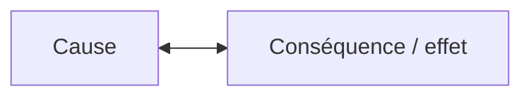
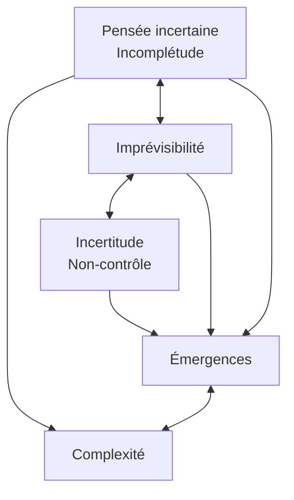
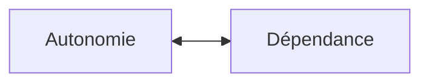

## Document page 1

Page 27
2 Approches complexes du réel : notions de base
« Le complexe, c'est ce qui est tissé ensemble y compris ordre/ désordre, un/multiple,
tout/parties, objet/environnement, objet/ sujet, clair/obscur. Le complexe, c'est
l'indécidabilité logique et l'association complémentaire de deux vérités contradictoires. »
— Edgar Morin, « L'Épistémologie de la complexité », in Edgar Morin, Jean-Louis Le
Moigne, L'Intelligence de la complexité, op. cit., p. 163

Savoir identifier les informations essentielles pour simplifier ce qui paraît de prime abord
compliqué est important dans un monde où tout semble parfois entremêlé. Simplifier revient
cependant à exclure certains pans de la réalité pour ne retenir que ce qui satisfait nos
croyances, notre confort intellectuel (ou notre paresse), nos priorités de l'instant, nos besoins
de gagner du temps, nos contraintes organisationnelles et financières. Les limites de la
logique simplifiante, linéaire sont telles que certains chercheurs remettent en question sa
pertinence et privilégient de plus en plus des approches systémiques, non linéaires,
complexes. Du fonctionnement de la cellule au mouvement des étoiles, du développement
d'un enfant à la vie d'un groupe social, de l'activité économique à l'augmentation des
inégalités sociales, de l'équilibre de la flore intestinale à l'univers biologique d'une forêt ou au
déplacement d'un banc de poisson, la plupart des phénomènes relèvent aujourd'hui de telles
approches.

La longueur des côtes de la Bretagne comme introduction
à la complexité
La question de la longueur des côtes de Bretagne sert parfois de métaphore pour illustrer le
passage du simple au compliqué, puis au complexe. D'anciens livres de géographie donnaient
comme réponse environ

Page 28
3000 km. La question devient cependant plus compliquée selon que cette réponse doit être
estimée à marée basse ou à marée haute... Et encore, en fonction de quel coefficient ? Ce
serait long et fastidieux de chercher la réponse, coefficient par coefficient, mais pas
impossible. La question devient réellement complexe lorsque vous introduisez un ensemble
de paramètres qui interfèrent. Comment, par exemple, tenir compte de la houle ou de
l'embouchure des rivières : où s'arrête la rivière, où commence la mer ? Il faudrait aussi tenir
compte des effets liés au temps : montée des océans, construction de ports, érosions des côtes,
mouvements du sable sur les plages, etc.¹. De plus, comment l'évaluer ? La distance mesurée
dépend en effet de l'outil employé. Une chevillière de 20 mètres, une règle millimétrée ou un
microscope permettraient de prendre en compte des anfractuosités de tailles très différentes.
Il en résulterait des longueurs sans commune mesure, atteignant presque l'infini ; sans parler
des marges d'erreur selon les repères, les critères et les outils utilisés. En fait, il n'existe pas

## Document page 2

de réponse à cette question, pourtant toute simple². Ou, pour être précis, il existe une
multitude de réponses en fonction des buts de la question et de ce que chacun décide de
prendre en compte.

Ainsi, peut être considéré comme complexe ce qui ne peut recevoir de réponse simple,
univoque, car les paramètres en jeu sont trop nombreux pour être répertoriés de façon
exhaustive et qu'ils peuvent être combinés et pondérés de manière différente.

Le monde dans lequel nous vivons se révèle intrinsèquement multifactoriel, interdépendant,
interagissant. Il appelle des manières différentes et complémentaires de le concevoir et de le
comprendre, tout en sachant qu'il y a autant de façons de se l'approprier qu'il y a de courants
de pensées, d'approches disciplinaires, d'expériences et de vécus chez les interlocuteurs
présents³. Alors que la pensée simplifiante invite à séparer

¹ Cf. Gérard Villemin, « Nombres : Curiosités, théorie et usages - Géographie, Terre, traits de
côtes », http://villemin.gerard.free.fr/aGeograp/GENERALE/TraiCote.htm.
² Cf. Benoît Mandelbrot, « How long is the coast of britain ? Statistical self-similarity and
fractional dimension », Science, New Series, vol. 156, nº 3775, 1967, p. 636-638; vidéo « Ça
m'intéresse - La minute de la connaissance: quelle est la vraie longueur des côtes de Bretagne
», https://www.dailymotion.com/video/xa2xvg.
³ La manière de penser le monde dans la tension entre simplicité et complexité, et notamment
la place de la complexité dans l'histoire de la pensée humaine depuis l'Antiquité, n'est pas
traitée ici. De tout temps, des hommes ont tenté de simplifier, de séparer, tandis que d'autres
percevaient l'univers comme un ensemble d'éléments en étroites relations...

Page 29
pour comprendre, la pensée complexe appelle à relier pour comprendre en gardant en tête les
mots d'Edgar Morin, un des érudits de notre temps qui s'est le plus penché sur la notion de
complexité :

[!quote]
« Est complexe ce qui ne peut se résumer en un maître mot, ce qui ne peut se ramener à
une loi, ce qui ne peut se réduire à une idée simple. Autrement dit, le complexe ne peut se
résumer dans le mot de complexité, se ramener à une loi de complexité, se réduire à l'idée
de complexité. La complexité ne saurait être quelque chose qui se définirait de façon
simple et prendrait la place de la simplicité. La complexité est un mot problème et non un
mot solution¹. »

## Document page 3

L'étude de la complexité relève d'une discipline émergente, qui n'a pas encore construit un
cadre théorique solide². Il n'existe pas de théorie unifiée reposant sur une définition univoque
— ce qui serait incompatible avec la notion de complexité —, mais des approches
hétérogènes³, scientifiques ou métaphoriques. Les notions présentées ci-dessous permettent
cependant de répondre aux objectifs de ce livre : comprendre en quoi certaines situations de
soins sont complexes de manière à offrir des soins infirmiers en adéquation avec les besoins
des patients concernés.

Un « nouveau » regard sur la connaissance et la recherche
Le Discours de la Méthode de Descartes — qui sert de fondement aux approches analytiques
— fut très tôt l'objet de vives critiques. Giambattista Vico, professeur à l'université de Naples,
dénonçait en 1708 déjà la dictature intellectuelle de ceux qui se référaient à Descartes et
déplorait

¹ Edgar Morin, Introduction à la pensée complexe, op. cit., p. 10.
² Federica Raia et al., « Definitions of complexity », Workshop 2010,
https://serc.carleton.edu/NAGTWorkshops/complexsystems/definitions.html.
³ Michel Alhadeff-Jones, « Trois générations de théories de la complexité: nuances et
ambiguïtés », http://archive.mcxapc.org/docs/conseilscient/0805michel.pdf; texte traduit et
adapté par son auteur à partir de l'article « Three generations of complexity theories: nuances
and ambiguities », Educational Philosophy and Theory, vol. 40, nº 1, 2008, p. 66-82.
⁴ Marlaine Smith, « Philosophical and theoretical perspectives related to complexity science
in nursing », in Alice Ware Davidson, Marylin A. Ray, Marian C. Turkel, Nursing, caring
and complexity science, op. cit., p. 2-3.

Page 30
dans une lettre de 1729 l'influence du cartésianisme sur les jeunes gens. Celui-ci « a empli
leur tête [...] des grands mots de "démonstrations", d'"évidences", de "vérités démontrées", les
préparant ainsi à entrer dans un monde des hommes qui serait composé de lignes, de nombres
et de signes algébriques¹ ». Il proposait comme alternative « le monde humain réel, dans sa
richesse et sa complexité, celui qui est créé, "inventé" par les hommes eux-mêmes, création et
invention qui mettent en œuvre la totalité de leurs facultés [...]² ».

L'appel de Vico à explorer le monde dans toute sa richesse, tel qu'il est vécu par les êtres
humains, et en remettant ces derniers au cœur du processus de recherche, fut en grande partie
ignoré. Sciences « fondamentales » et « humaines » prirent des importances et des chemins
différents, pendant que les spécialisations et sous-spécialisations morcelaient et cloisonnaient
les savoirs. D'importants changements sur la manière de concevoir la connaissance sont
pourtant en cours. En France, le Centre national de la recherche scientifique (CNRS)
affirmait en 2002 déjà qu'« il faut voir la recherche non comme un espace distribué en

## Document page 4

différents secteurs, plus ou moins étanches les uns aux autres, mais comme un espace intégré
d'activités³ ». Là où les disciplines régnaient en maître naissent des espaces dans lesquels
celles-ci doivent collaborer, partager leurs connaissances et leurs méthodologies, confronter
leurs jargons et leurs visions, reconstituer la complexité.

Ces changements trouvent leurs origines « dans la nécessité qui s'impose aujourd'hui
d'approcher dans des termes nouveaux la question de la complexité. Dans tous les domaines
de la recherche, il n'est question que "d'objets complexes" ou de "systèmes complexes" [...]⁴
», imposant à la recherche de se redéfinir. De nouvelles méthodes sont explorées, un nouveau
vocabulaire apparaît, de nouvelles manières de penser le monde, l'être humain... et les soins
se font jour. Comme le relève Murray Gell-Mann⁵ :

¹ Giambattista Vico, La Méthode des études de notre temps (de nostri temporis studiorum
ratione, 1708), présentation, traduction et notes par Alain Pons, Paris, Grasset, 1981.
² Ibid.
³ CNRS, « Projet d'établissement », 2002, p. 12.
⁴ Ibid.
⁵ Prix Nobel de physique, fondateur du Santa Fe Institute dont la mission est de conduire des
recherches interdisciplinaires sur les principes fondamentaux des systèmes complexes en
physique, en biologie et dans la société en général.

Page 31
« il faut battre en brèche l'idée, si répandue dans les milieux aussi bien académiques que
bureaucratiques, selon laquelle ne méritent d'être prises aux sérieux que les recherches les
plus pointues dans une spécialité donnée. Nous devons reconnaître et glorifier au même
titre la contribution vitale de ceux qui se risquent à ce que j'appelle "une vision sommaire
du tout"¹. »

Noir ou blanc ? Trop simpliste pour être vrai !
Passer de modes de pensée qui simplifient la réalité pour la rendre plus aisément intelligible à
des modes de pensée qui embrassent la complexité du réel impose de remettre en question
certains postulats sur lesquels notre société et le monde des soins se sont construits.

Edgar Morin soutient que « le problème de la complexité est d'abord d'affronter une certitude
conceptuelle par rapport à nos habitudes de pensée qui suppose qu'à tous les problèmes on
peut apporter une réponse claire et distincte² ». Les explications linéaires de type $A
\rightarrow B$, les réponses en noir ou blanc, en juste ou faux, en malade ou guéri sont
souvent trop simplistes pour être vraies. La réalité, dès qu'elle devient complexe, apparaît
faite d'un ensemble de facteurs entremêlés, aux liens aussi nombreux que difficiles à

## Document page 5

identifier et parfois à imaginer (encadré 2.1), colorés d'une multitude de nuances et de
tendances, en fonction de la culture de chacun, du cadre de référence utilisé, des expériences
vécues, de l'importance des facteurs concomitants rationnels et irrationnels.

Une étude montrait ainsi que la sévérité des juges lors d'un procès dépendait non seulement
d'une approche la plus objective possible des faits et des lois, mais également du moment de
la journée : la probabilité d'une décision favorable à l'accusé était significativement plus
importante en début de journée ou après la pause repas et décroissait progressivement au fur
et à mesure que l'on s'éloignait de ces moments³ ; autrement dit, plus le juge a faim, moins il
est clément... De tels déterminants échappent à la logique rationnelle. Et aucun code civil ou
pénal ne prévoit que l'état de satiété des juges doit intervenir dans les décisions

¹ Murray Gell-Mann, Le Quark et le jaguar. Voyage au cœur du simple et du complexe, Paris,
Flammarion, coll. « Champs », 1997, Préface, p. 12.
² Edgar Morin, in « Universalité, incertitude, éducation et complexité. Dialogue avec Edgar
Morin, Hubert Reeves et Monique Mounier-Kuhn », art. cité, p. 210.
³ S. Danziger, J. Levav, L. Avnaim-Pesso, « Extraneous factors in judicial decisions »,
Proceedings of the National Academy of Sciences of the United States of America, n°
108(17), 2011, p. 6889-6892.

Page 32
prises... C'est pourtant une réalité humaine, comme il s'en retrouve dans toutes les interactions
sociales : même si les codes de déontologie préconisent que les soins devraient être les
mêmes quelle que soit la personne soignée, nombre de professionnels reconnaissent qu'il est
plus agréable de répondre à la demande d'une personne jolie, polie et souriante qu'à un
malade laid, aigri et irascible.

Ainsi, le passage d'une logique formelle, linaire, simplifiante à une logique de la complexité
représente un changement de paradigme qui remet en question ce qui était généralement
attendu en Occident du processus de pensée : « nous demandons légitimement à la pensée
qu'elle dissipe les brouillards et les obscurités, qu'elle mette de l'ordre et de la clarté dans le
réel, qu'elle révèle les lois qui le gouvernent. Le mot de complexité, lui, ne peut qu'exprimer
notre embarras, notre confusion, notre incapacité de définir de façon simple, de nommer de
façon claire, de mettre de l'ordre dans nos idées¹ ».

En gros, la complexité restitue au brouillard, à l'obscurité, au hasard et au désordre la place
qui leur revient.

## Document page 6

[!info] Encadré 2.1. La complexité : aperçu étymologique
Alors que le mot « simple » vient du latin simplex qui signifiait « ce qui ne fait qu'un pli
»¹, le mot complexe vient de complexus, aux différents sens de tourner ou rouler ses
cheveux, friser, entrelacer, tresser, puis enlacer, embrasser, contenir. Il est repris au XVIe
siècle comme adjectif pour qualifier tout ce qui est composé de divers éléments
hétérogènes. Le terme renvoie ainsi à un « composé d'éléments qui entretiennent des
rapports nombreux, diversifiés, difficiles à saisir par l'esprit, et présentant souvent des
aspects différents² ».
¹ Michel Alhadeff-Jones, « Trois générations de théories de la complexité : nuances et
ambiguïtés », art. cité.
² http://www.cnrtl.fr/definition/complexe.

La reliance comme approche du « tout »
Comprendre le monde qui nous entoure impose dans un premier temps d'en identifier les
éléments constitutifs et leurs propriétés. C'est ce que fait chaque infirmière qui accueille un
nouveau patient, en lui demandant son identité, en écoutant le récit de ses soucis de santé et
en pratiquant

¹ Edgar Morin, Introduction à la pensée complexe, op. cit., p. 9.

Page 33
une évaluation clinique initiale. Simultanément, à l'aide de ses connaissances, elle relie
certaines informations pour en faire émerger le sens : tel ensemble de symptômes correspond
probablement à une hypotension orthostatique, telles manifestations pourraient faire penser à
des douleurs chez un patient atteint de démence.

Pour Edgar Morin, la pensée complexe est un mode de reliance, concept créé par le
sociologue Marcel Bolle de Bal qui implique « l'action de relier et de se relier, et ses
résultats¹ ». La reliance se positionne « contre l'isolement des objets de connaissance : elle les
restitue dans leur contexte et, si possible, dans la globalité dont ils font partie² ». Comme le
montre le conte des « Six aveugles et un éléphant » (cf. encadré 1.1, p. 22), l'isolement des
objets de connaissance nous prive d'une vue globale de la réalité et peut conduire à des
interprétations erronées, chaque personne ayant raison dans son modèle du monde, et
simultanément tort au regard d'une réalité plus complète. Dès lors, il faut « une autre méthode
pour qui la connaissance des parties ne prend sens que si on la lie à la connaissance d'un tout,
qui en tant que tout, mérite d'être étudié lui-même³ ».

## Document page 7

Il est sans doute intéressant de connaître le détail de la jambe ou de la trompe d'un éléphant,
mais cela ne nous dit rien de ce qu'est un éléphant en tant que tel, ni sur ce qu'il mange ou sur
ses habitudes sociales. De même, connaître dans les détails la physiopathologie du diabète est
essentiel dans certaines situations, mais n'a guère de sens si ces connaissances ne sont pas
reliées aux modes de vie de Monsieur X ou de Madame Y, à leur culture, à leurs habitudes
alimentaires, à leurs ressources financières ou à leur contexte socioprofessionnel.

Dans le même ordre d'idée, un foie + une rate + un intestin + un estomac + un cerveau + des
poumons + quatre membres + ... ne vous dit toujours pas si, au bout du compte, vous avez un
rat, un rhinocéros ou un être humain, ni si celui-ci est un homme ou une femme, heureux ou
malheureux.

¹ Jean-Louis Le Moigne, Edgar Morin, « Le Génie de la reliance », Synergies Monde, n° 4,
2008, p. 177-184.
² Nelson Vallejo-Gomez, « La Pensée complexe antidote pour les pensées uniques »,
Entretien avec Edgar Morin, Synergies Mondes, nº 4, 2008, p. 249-262.
³ Edgar Morin, in « Universalité, incertitude, éducation et complexité... », art. cité, p. 210.

Page 34
Le système comme fondement
Les premières approches modernes¹ de la systémique remontent au chercheur russe
Alexandre Bogdanov qui publia entre 1912 et 1917 trois ouvrages précurseurs consacrés à la
science des structures². En Occident, Ludwig von Bertalanffy présenta à la fin des années
1930 ses premières réflexions sur les systèmes ouverts, qui débouchèrent en 1968 sur la
Théorie générale des systèmes³. Cette dernière contribua de manière déterminante au
fondement scientifique de l'écologie et à l'émergence d'une révolution scientifique consistant
à relier au travers du temps et de l'espace ce qui était auparavant étudié isolément⁴.

L'exemple de l'arbre est à cet égard emblématique (encadré 2.2)⁵. Pour beaucoup d'entre nous,
un arbre peut se regarder en tant que tel comme un élément isolé du restant de l'univers.
Pourtant, simultanément, il interagit en permanence avec ce dernier, ce que nous pourrions
avoir tendance à oublier.

[!info] Encadré 2.2. L'arbre et l'univers
« Pensez à un arbre : vous aurez tendance à le percevoir en tant qu'objet clairement défini,
ce qui est vrai à un certain niveau. Mais un examen attentif vous montrera qu'en fin de
compte, il ne possède pas d'existence indépendante. Si vous le contemplez, vous
constaterez qu'il se dissout en un réseau extrêmement subtil de relations s'étendant à
l'univers entier : la pluie qui tombe sur ses feuilles, le vent qui l'agite, le sol qui le nourrit

## Document page 8

et le fait vivre, les saisons et le temps, la lumière de la lune, des étoiles et du soleil — tout
cela fait partie de l'arbre. En poursuivant votre réflexion, vous découvrirez que tout dans
l'univers contribue à faire de l'arbre ce qu'il est [...] ».
Source : Sogyal Rinpoché, Le Livre tibétain de la vie et de la mort, Paris, Éditions de La
Table Ronde, coll. « Les Chemins de la Sagesse », 2003, p. 70.

¹ Les notions de complexité et de reliance se retrouvent dès l'Antiquité au cœur des grandes
traditions culturelles, philosophiques et religieuses, notamment dans les populations
amérindiennes et aborigènes, ou en Orient. Le lecteur trouvera des pistes dans les références
bibliographiques en complément des exemples cités dans ce livre.
² Cf. Fritjof Capra, La Toile de la vie. Une nouvelle interprétation scientifique des systèmes
vivants, Monaco, Éditions du Rocher, 2003, p. 60-62.
³ Ludwig von Bertalanffy, Théorie générale des systèmes, Paris, Dunod, 2002.
⁴ Edgar Morin, « L'Épistémologie de la complexité », art. cité, p. 133-134.
⁵ Sogyal Rinpoché, Le Livre tibétain de la vie et de la mort, Paris, Éditions de La Table
Ronde, coll. « Les Chemins de la Sagesse », 2003.

Page 35
Cette manière de penser peut paraître difficile à appliquer au quotidien. Dans d'autres
cultures, elle est au cœur de la manière d'être au monde. Dans le bouddhisme, la notion de
Sanyata — souvent traduite de manière imparfaite par les mots « vide » ou « vacuité » —
renvoie au fait que tout être, toute chose est sans existence propre, par elle-même et pour elle-
même, et qu'elle est forcément en interdépendance avec tout ce qui constitue son
environnement. Cette chose ne peut être comprise qu'en tenant compte du contexte dont elle
dépend et qui dépend d'elle.

Pour le physicien Fritjof Capra,

[!quote]
chacun forme un tout par rapport à ses propres parties tout en s'intégrant lui-même dans un
plus grand tout. Les cellules s'assemblent par exemple pour former les tissus, les tissus
pour former les organes, et les organes pour former les organismes. Ces derniers, à leur
tour, vivent à l'intérieur de systèmes sociaux et d'écosystèmes¹.

Les courants des soins centrés sur la famille et des thérapies systémiques reposent sur de
telles conceptions.

Le concept de système constitue une des bases de la pensée complexe, n'étant pas réductible à
des unités élémentaires, à des concepts simples, à des lois générales². Une telle approche

## Document page 9

amène à considérer les propriétés de chaque partie principalement au regard de leurs
interactions. Ainsi, une hypertension ne peut se comprendre qu'au regard de la tension
habituelle de la personne considérée, de sa volémie, de son débit cardiaque, de ses activités,
de ses émotions... facteurs qui dépendent eux-mêmes d'un ensemble de paramètres. De
même, le comportement agressif d'un patient ne peut parfois se comprendre qu'en tenant
compte des comportements des soignants à son égard, de l'anxiété qui est la sienne dans
l'attente du résultat de ses investigations, d'expériences négatives antérieures, de ses soucis
familiaux, professionnels ou financiers.

¹ Fritjof Capra, La Toile de la vie, op. cit., p. 43.
² Edgar Morin, La Méthode. 1: La Nature de la nature, Paris, Le Seuil, 1977, p. 149.

Page 36
L'observateur et l'objet/sujet d'observation : un couple
inséparable
Dans une perspective systémique, il n'est plus possible d'accepter le postulat que l'observateur
est séparé de l'objet qu'il observe¹. L'observateur et l'objet/sujet observé deviennent un couple
indissociable, en interaction constante, formant ce qu'Edgar Morin appelle une « nouvelle
totalité systémique² ». Dans le domaine des soins, dès qu'une infirmière est en présence d'un
patient ou d'une famille, les comportements des uns et des autres vont s'influencer et entraîner
des attitudes, des actions et des réactions différentes de ce qui se serait passé si chacun était
resté isolé. L'enfant module ainsi ses rires et ses pleurs en fonction de la présence ou non de
ses parents ; malades et familles changent de comportement lorsque le médecin ou
l'infirmière entre en chambre, au même titre que bien des soignants changent de contenance
dès que le malade ou ses proches observent leurs faits et gestes.

Alors que, dans une logique simplifiante, les observations scientifiques sont pensées comme
objectives, une approche systémique considère toute observation comme influencée par
l'observateur et sujette à l'interprétation de ce dernier. Une même scène observée par un
enfant ou une personne âgée, un citadin ou un montagnard, un Européen, un Africain ou un
Asiatique débouchera sur des descriptions et des interprétations différentes. Comme le relève
le physicien Bernard d'Espagnat, « la science ne nous décrit pas les choses elles-mêmes, mais
l'ensemble de notre expérience humaine des choses³ ».

Dès lors que la perception, la description et l'interprétation du monde dépendent de chaque
observateur, la notion même de complexité devient dépendante de la compréhension que
chacun s'en fait. Selon R.A. Thiétart,

## Document page 10

[!quote]
on peut affirmer qu'au-delà d'une définition de la complexité, cette dernière réside autant
dans les yeux de celui qui la regarde et de sa manière de regarder que dans les propriétés
du système observé, ce qui rend les choses encore plus... complexes⁴.

¹ Cf. supra, p. 21 et suiv.
² Ibid., p. 143.
³ Bernard d'Espagnat, À la recherche du réel. Le regard d'un physicien, Paris, Presses Pocket,
1991, cité in R.A. Thiétart, « Management et complexité: concepts et théories », Centre de
recherche DMSP, Cahier n° 282, avril 2000.
⁴ R.A. Thiétart, « Management et complexité: concepts et théories », art. cité.

Page 37
Concrètement, lorsqu'une infirmière présente la situation d'un patient à une collègue, sa
description dépend étroitement de sa propre connaissance de la personne soignée et de ce qui
lui arrive, de son expérience professionnelle et de ses expériences de vie, des connaissances
préalables de sa collègue tant sur ce malade que vis-à-vis de sa pathologie et de ses
traitements, etc.

La différence entre le simple, le compliqué et le complexe dépend en partie de la subjectivité
des personnes qui y sont confrontées, de leurs connaissances et de leurs expériences. En
parallèle, il existe des niveaux différents de complexité en fonction des paramètres ou des
échelles pris en compte : parler de la complexité d'une cellule se fera différemment que de
parler de la complexité des relations au sein d'un groupe social. Au-delà de la question de la
complexité réelle ou non d'une situation ou d'un phénomène, se pose la question du vécu de
l'observateur dans son interaction avec cette situation ou ce phénomène. Il en découle un
sentiment de complexité, plus ou moins fort, révélateur de ce que la personne considère
comme complexe¹.

Lorsque causes et conséquences s'entraînent
réciproquement
Dans bien des situations, un lien de cause à effet peut être observé et reproduit, donc
généralisé comme nous l'avons vu au chapitre 1. Une telle approche est très efficace dans les
situations courantes et a permis des progrès gigantesques dans le monde de la santé. C'est par
exemple grâce à l'identification par Robert Koch du bacille de la tuberculose que celle-ci a pu
être éradiquée de nombreux pays. Comme le relève Hubert Reeves : « l'histoire des sciences
c'est, en définitive, la liste des relations causales découvertes successivement entre des objets
apparemment sans relation² ». Il ébranle cependant cette approche de la connaissance en
rapportant certaines expériences en physique quantique dont la particularité est de ne reposer
sur aucune cause³.

## Document page 11

¹ Cf. infra, p. 120 et suiv.
² Hubert Reeves, « Incursion dans le monde acausal », in Hubert Reeves et al., La
Synchronicité, l'âme et la science, Paris, Albin Michel, 1995, coll. « Espaces Libres », p. 11.
³ C'est le principe d'acausalité.

Page 38
Avant lui, Carl Jung avait déjà relaté et questionné de surprenantes simultanéités — qu'il
appela synchronicités — qu'aucune cause ne pouvait expliquer.

La recherche des causes de certains phénomènes montre également ses limites lorsque causes
et conséquences s'entraînent mutuellement. Posons-nous par exemple la question de
l'augmentation du nombre des appareils d'imagerie par résonance magnétique (IRM) : est-ce
l'augmentation de l'offre qui génère une augmentation de la demande ou est-ce l'augmentation
de la demande qui entraîne une augmentation de l'offre ?

Edgar Morin parle de récursivité, de principe récursif ou de boucle récursive lorsque causes
et conséquences deviennent indissociables et se cogénèrent mutuellement, ce qui peut être
représenté au travers du schéma suivant :

Un bel exemple de récursivité est donné par la vision des couleurs développée par les
abeilles. Ces dernières sont capables de « voir » les ultraviolets, ce qui leur permet de mieux
repérer les fleurs à butiner. Or, ces mêmes fleurs ont développé la capacité de refléter les
ultraviolets, ce qui leur permet d'attirer les abeilles qui, en les butinant, vont les féconder et
les aider ainsi à se reproduire¹. Le langage courant questionne ce type de phénomènes en se
demandant si c'est la poule qui a précédé l'œuf ou...

Les liens entre les êtres humains et leur environnement social constituent une autre forme de
boucle récursive, dans la mesure où « les individus produisent la société qui produit les

## Document page 12

individus² ». Il est ainsi parfois difficile, voire impossible, de déterminer si un patient devient
agressif et revendicatif à cause de certains comportements soignants non empathiques, ou si,
au contraire, certains comportements du patient sont à l'origine de la perte d'empathie des
professionnels. Vraisemblablement, ces deux processus s'entraînent mutuellement.

¹ Cf. Frédéric Joignot, Ariel Kyrou, Francisco Varela, « L'Esprit n'est pas une machine »,
Actuel, 1993.
² Gérard Blanc, « Les Paradoxes de la complexité : entretien avec Edgar Morin »,
CoEvolution, nº 11, 1983 (https://www.revue3emillenaire.com/blog/les-paradoxes-de-la-
complexite-entretien-avec-edgar-morin/).

Page 39
Le jeu des enchevêtrements, interdépendances et
émergences
Dès l'instant où il n'est plus possible de déterminer avec exactitude ce qui relève des causes et
des conséquences, dès l'instant où l'observateur et l'objet observé sont en interaction
constante, des ensembles de facteurs apparaissent comme indissociables les uns des autres :
les propos des uns entraînent des commentaires des autres ; les émotions présentes interfèrent
les unes avec les autres (la contagion émotionnelle) ; les contextes, histoires personnelles et
vécus de chacun se retrouvent mobilisés à différents niveaux et interagissent entre eux.

Alors que la pensée simplifiante essaie de comprendre les interactions présentes en les
ramenant à des liens peu nombreux et que le compliqué relève de liens nombreux mais
dénombrables et dont les règles peuvent être énoncées, le complexe repose sur des liens et
des interactions trop nombreuses pour être identifiées, par ailleurs en partie aléatoires, non
observables, non conscientes, voire non imaginables.

Il en résulte que :

[!quote]
La complexité est dans l'enchevêtrement qui fait que l'on ne peut pas traiter les choses
parties à parties [...]. Le problème de la complexité apparaît immense parce que nous
sommes dans un monde où il n'y a pas que des déterminations, des stabilités, des
répétitions, des cycles, mais aussi des perturbations, des tamponnements, des
surgissements, du nouveau¹.

## Document page 13

Se pose alors la question de savoir où s'arrêter dans la recherche de compréhension d'un
événement, comme le montre l'exemple de la chute d'un objet (encadré 2.3). À l'impossibilité
de maîtriser toute la connaissance théoriquement à disposition s'ajoute le fait qu'à tout
moment des phénomènes nouveaux peuvent émerger de manière imprévisible :

[!quote]
D'un point de vue général, la notion de complexité repose sur l'idée fondamentale selon
laquelle un système articulant des éléments divers constitue un tout qui est différent de la
somme de ses parties. Elle implique que l'organisation même de ces éléments produit des
émergences, autrement dit qu'elle développe des propriétés spécifiques qui ne sont pas
déductibles de la connaissance de chacun de ces éléments².

¹ Edgar Morin, in « Universalité, incertitude, éducation et complexité... », art. cité, p. 210.
² CNRS, Projet d'établissement, 2002, p. 12.

Page 40
[!info] Encadré 2.3. La connaissance ? Une approximation!
Une simple formule de physique suffit à calculer le temps nécessaire à un objet lâché
d'une certaine hauteur pour qu'il touche le sol. Le résultat obtenu n'est cependant qu'une
approximation qui ne tient pas compte de la résistance de l'air. Cette dernière dépend elle-
même de la température ambiante, de la pression atmosphérique et de la convection de
l'air (la circulation de l'air dans l'environnement). Cette dernière dépend à son tour de
l'étanchéité de la pièce dans laquelle se déroule l'expérience (et par là-même des
conditions de l'environnement extérieur) et de la respiration des observateurs présents, au
même titre que la température de la pièce est influencée par leur propre température et
n'est donc pas constante, d'autant plus que leur température est elle-même fonction de
nombreux facteurs.
Le phénomène « chute d'un objet » dépend ainsi étroitement de ce qui se produit dans son
environnement et les connaissances qui y sont liées ne peuvent être qu'approximatives.
Source : adapté de Fritjof Capra, La Toile de la vie, op. cit., p. 57.

Les interactions entre les parties génèrent ainsi des changements imprévus, des bifurcations
subites dans le cours des événements ou des idées, de la créativité, des innovations, dont la
probabilité est d'autant plus grande que le degré de désordre et de désorganisation est élevé¹.

## Document page 14

Ces émergences portent sur des propriétés nouvelles du système. Elles peuvent porter sur
celui-ci dans son ensemble ou seulement sur certains de ses composants. L'apparition de
complications imprévisibles, de nouvelles maladies, ou leur résurgence (zika, ebola, etc.), de
nouvelles approches des soins (comme l'éducation thérapeutique) ou de nouvelles manières
de penser (la prise en compte de la complexité, etc.) constituent des émergences².

¹ Au sens métaphorique d'un des concepts clés de la théorie du chaos (cf. John Briggs, F.
David Peat, Un miroir turbulent, op. cit., p. 143-146) : à tout moment, une information
nouvelle, une idée qui surgit à l'improviste ou un événement inattendu peut entraîner des
modifications dans des décisions prises, dans les projets de soins élaborés, dans les
interventions planifiées, dans l'organisation du travail, etc., créant parfois de véritables
ruptures avec les continuités pressenties.
² Marlaine Smith, « Philosophical and theoretical perspectives related to complexity science
in nursing », art. cité, p. 6-9.

Page 41
La connaissance : une approche incertaine du réel
La connaissance s'arrête... à ce qui est connu, évidence souvent oubliée. Dès l'instant où la
créativité liée à la vie peut faire émerger à tout moment de nouveaux ordres et désordres, la
sécurité que procurent les savoirs devient partielle, voire illusoire. Le mathématicien,
philosophe et essayiste Nassim Nicholas Taleb a développé la métaphore du cygne noir¹ pour
illustrer les illusions de connaissance et de maîtrise dans lesquelles nous nous trouvons : aussi
longtemps qu'une personne n'a pu observer que des cygnes blancs, elle ignore qu'il en existe
des noirs dans d'autres régions du monde. Et plus elle aura rencontré de cygnes blancs, plus
elle sera portée à croire que tous les cygnes sont blancs, d'autant plus qu'il lui est impossible
d'explorer tous les lieux de la planète pour éliminer l'hypothèse qu'il pourrait en exister
d'autres couleurs. À un moment donné, le cadre explicatif qui est le sien lui suffit... même s'il
est faux. Cette personne sera d'autant plus surprise le jour où elle verra des cygnes noirs. Au
point parfois de rejeter cette réalité : une photographie... c'est si vite truqué !

Les scientifiques rigoureux utilisent une formule qui va bien dans le sens d'un savoir
imparfait, approximatif : « en l'état actuel des connaissances ». Un tel adage se résume
pourtant souvent à une formule de rhétorique quand bien même les sources de savoirs sont
multiples — scientifiques, philosophiques, religieuses, expérientielles, etc. —, débouchant
sur des savoirs parfois complémentaires, parfois incompatibles, parfois autocensurés, voire
interdits. Ce morcellement conduit à des savoirs contextualisés et limités, propres à un cadre
de référence, un corps professionnel, un auteur, une institution ou une culture. Comme le

## Document page 15

relève Edgar Morin, nous sommes « condamnés à la pensée incertaine, à une pensée criblée
de trous, à une pensée qui n'a aucun fondement absolu de certitude² ».

Les frontières de la connaissance, du vécu et du vocabulaire sont elles-mêmes floues et
incertaines, bien que nous ayons souvent l'impression que les mots sont porteurs de
significations univoques. Morin rappelle, au sujet de l'amour et de l'amitié, que derrière ces
mots apparemment bien distincts, « il y a aussi de l'amitié amoureuse, des

¹ Nassim Nicholas Taleb, Le Cygne noir. La puissance de l'imprévisible, Paris, Les Belles
Lettres, 2008.
² Edgar Morin, Introduction à la pensée complexe, op. cit., p. 93.

Page 42
amours amicales. Il y a donc des intermédiaires, des mixtes entre l'amour et l'amitié il n'y a
pas une frontière nette ». Il en conclut que « les frontières sont toujours floues, sont toujours
interférentes¹ ». Ainsi en va-t-il des frontières entre la santé et la maladie, entre la vie et la
mort — nous y reviendrons au chapitre 4.

L'instabilité, l'imprévisibilité, l'incertitude et
l'impossibilité de contrôler comme constituants et
conséquences de la complexité
Si la connaissance est incomplète car « criblée de trous », alors l'inconnu et l'imprévu doivent
être considérés comme des parties intégrantes de la réalité. L'imprévisible et l'imprédictible
deviennent des générateurs d'instabilité et de désordre, eux-mêmes co-constitutifs de la réalité
et de la complexité du monde. L'instabilité, le déséquilibre permettent l'émergence de
nouveaux possibles, de nouvelles structures, de nouvelles idées, de nouvelles opportunités qui
empêchent de figer l'existant. Dès que nous acceptons le principe de n'avoir que des savoirs
partiels, à tout instant l'imprévisible, l'incontrôlable peuvent survenir. Dans le monde des
soins, l'imprévisible prend souvent la forme de l'infarctus, de l'attaque cérébrale, du choc
anaphylactique ou de l'hémorragie massive, alors que la personne allait bien quelques instants
auparavant.

Parce qu'il est impossible de penser à tout, parce qu'à tout moment un grain de sable peut
enrayer la machine la mieux huilée, nous devons apprendre à vivre avec l'incertitude, à

## Document page 16

remettre en question nos besoins de contrôle et à accepter un certain degré d'insécurité. Une
telle conception peut être déstabilisante pour celles et ceux qui apprécient la stabilité,
postulent sur une continuité de ce qui est, pensent avoir la maîtrise de leur travail et de leur
vie. Les principes d'incomplétude, d'imprévisibilité et d'incertitude sont cependant constitutifs
de la complexité et en sont simultanément la conséquence. Ils forment une boucle récursive et
contribuent au fait qu'il est impossible de contrôler un phénomène complexe, du fait des
événements qui peuvent à tout moment en émerger (figure 2.1).

¹ Ibid., p. 98.

Page 43
Figure 2.1. L'incomplétude et le non-contrôle comme causes et conséquences de la
complexité.

Du « ou » au « et » pour réconcilier les contraires

## Document page 17

« Tu veux ou tu veux pas ? » ; « C'est oui ou bien non » ; « C'est comme ci ou comme ça » ; «
C'est noir ou blanc, mais ce n'est pas noir et blanc¹ », etc. Dans une logique formelle, le
principe du tiers exclu impose des choix binaires, qui s'excluent mutuellement, consacrant le
règne du « ou » et rejetant le « et » dès l'instant où celui-ci permettrait de vouloir
simultanément deux opposés : « Je veux et je ne veux pas ». Or, les réalités humaines sont
bien plus nuancées qu'un oui ou un non, un juste ou un faux, un « je veux » ou « je ne veux
pas ». Ambiguïtés, paradoxes, ambivalences, cohérences partielles en fonction des
interlocuteurs, des priorités ou des émotions présentes : chacun, en fonction de sa
personnalité et des circonstances, tend à être plus ou moins constant dans ses positions, plus
ou moins fiable, plus ou moins décidé.

À l'opposé du « ou » de la logique formelle, le principe dialogique permet de relier des points
de vue opposés. Cela est d'autant plus important que, contrairement à ce que nous laisse
croire la dialectique hégélienne, la synthèse entre la thèse et l'antithèse n'est pas toujours
possible. En lieu et place, le principe dialogique permet « que deux logiques, deux principes
sont unis sans que la dualité se perde dans cette unité [...]. La dialogique est la
complémentarité des antagonismes² ». Ainsi, une porte n'est pas forcément ouverte ou fermée
(logique formelle) ; elle peut être simultanément ouverte et fermée selon le point de vue
retenu : fermée au

¹ Marcel Zanini. Tu veux ou tu veux pas ?, Barclay, 1970.
² Nelson Vallejo-Gomez, « La Pensée complexe antidote pour les pensées uniques », art. cité.

Page 44
passage d'un être humain, mais largement ouverte aux microbes. De même, l'on peut
simultanément désirer faire quelque chose et ne vouloir rien faire, avoir envie de manger et
être dégoûté par l'idée même de manger, être fatigué et ne pas arriver à dormir. De fait, le
principe dialogique ne s'applique pas seulement à deux logiques qui à la fois s'opposent, se
complètent et sont interdépendantes, mais peut s'appliquer à plusieurs logiques qui satisfont
ces conditions¹.

Le principe dialogique invite à renoncer à des manières de penser dans lesquelles un
argument l'emporte sur un autre, pour apprendre à les faire vivre ensemble. Edgar Morin écrit
ainsi :

[!quote]
Pour concevoir la dialogique de l'ordre et du désordre, il nous faut mettre en suspension le

## Document page 18

paradigme logique où l'ordre exclut le désordre et inversement où le désordre exclut
l'ordre. Il nous faut concevoir une relation fondamentalement complexe, c'est-à-dire à la
fois complémentaire, concurrente, antagoniste et incertaine entre ces deux notions [...]².

La sagesse populaire a depuis longtemps intégré cette complémentarité des opposés dans des
formules du type : « il a la qualité de ses défauts et les défauts de ses qualités », dans
lesquelles qualités et défauts sont non seulement antagonistes, mais de plus complémentaires
et indissociables.

La danse de l'ordre et du désordre
Les approches linéaires favorisent la conception d'un ordre du monde qui serait fait de
stabilité, de régularité, de constance, de respect des règles et des lois, garantissant un haut
degré de déterminisme. À l'opposé, pour Edgar Morin, « la notion de désordre enveloppe les
agitations, les dispersions, les turbulences, les collisions, les irrégularités, les instabilités, les
accidents, les aléas, les bruits, les erreurs dans tous les domaines de la nature et de la société³
», l'existence de ces agitations et autres aléas étant un des éléments constitutifs de la
complexité.

Ordre et désordre, coexistant et se concurrençant, forment une dialogie permanente. Un
service de soins est à la fois un lieu bien organisé

¹ Sara Bonomo, Morin dans sa langue. Réflexions suggérées par les tables de la Méthode,
Publications de l'Université de Bari, Schena Editore, 2006.
² Edgar Morin, La Méthode, t. 1, op. cit., p. 80.
³ Edgar Morin, La Méthode. 5: L'humanité de l'humanité - L'identité humaine. Paris, Le
Seuil, coll. « Points Essais », 2014, p. 347.

Page 45
avec des plannings, des horaires, des routines, des procédures et un lieu très désorganisé avec
des urgences, des imprévus, des absences à suppléer, des surcharges à absorber, etc. De
même, un organisme humain est l'expression d'un ensemble d'organes, de réactions
chimiques et de processus hormonaux parfaitement ordrés et simultanément le lieu de
multiples désordres qui vont de l'apparition de cellules cancéreuses ou de calculs rénaux à des
troubles électrolytiques, à des dérégulations hormonales ou psychiques. Comme le disait
Héraclite : « c'est même chose que vie et mort, veille et sommeil, jeunesse et vieillesse : ce

## Document page 19

sont mutuelles métamorphoses¹ » — une sagesse dont les approches qui tentent d'isoler, de
séparer nous ont éloignée. La retrouver implique d'accéder à un point de vue plus vaste qui
englobe les contradictions apparentes et prend en compte leur enrichissement mutuel.

Autonomie et dépendance : la relation ambiguë du sujet et
de son environnement
Pour survivre, tout être vivant doit adapter sa physiologie et ses comportements aux stimuli
qui proviennent tant de son environnement interne (ses organes et sa psyché, notamment) que
de son environnement externe, dans un processus permanent d'apprentissage. Dans les
sciences de la complexité, ce processus continu d'adaptation est désigné sous le terme d'auto-
organisation — voire d'auto-éco-organisation² —, et correspond à une des caractéristiques
clés des systèmes adaptatifs complexes. L'auto-organisation est considérée comme une source
illimitée de créativité et d'innovation — à l'origine des émergences citées précédemment —,
qui, en s'éloignant des réponses habituelles, font apparaître de nouveaux possibles.

¹ Héraclite: fragments originaux, trad. fr. Yves Battistini, Paris, Gallimard, coll. « Idées »,
1968.
² L'expression « auto-éco-ré-organisation » est également utilisée dans la mesure où « une
organisation, forme à la fois organisée et organisante, est dépendante et solidaire des
environnements (éco) avec lesquels elle interagit pour y puiser énergie et information, et elle
s'en différencie en s'organisant elle-même (auto) au fil du temps (ré) », Marie-José Avenier, «
La Pensée complexe pour relever les défis du management stratégique d'entreprises ? Retours
d'expérience », http://www.intelligence-complexite.org/fileadmin/docs/0805avenier.pdf.
Ainsi, au sens de la complexité, « l'organisation, la chose organisée, le produit de cette
organisation et l'organisant sont inséparables » (Paul Valéry, 1920).
³ Cf. infra, p. 59-60.

Page 46
Les systèmes complexes façonnent ainsi leur environnement et sont façonnés par celui-ci¹.
Au sein d'une famille, les enfants acquièrent les valeurs, les croyances et les connaissances
que leur transmettent leurs parents et, en interagissant avec ces derniers, en transforment les
valeurs, les croyances et les connaissances. Chacun vit une certaine forme d'autonomie tout
en étant simultanément dépendant de son entourage et, d'une façon plus générale, de son
environnement. Dans une équipe de soins, chaque professionnel possède sa propre
autonomie, ses marges de manœuvre tout en étant lié à l'organisation de ses collègues et de
son service ; de même, son organisation influence l'organisation de ses collègues et de son

## Document page 20

service. Chaque individu construit ainsi une relation dialogique et récursive permanente entre
les principes d'autonomie et de dépendance, comme le montre le schéma suivant :

Chacun élabore à chaque instant des compromis avec son entourage et son environnement,
comme ces derniers construisent des compromis avec lui, chacun induisant également par
moments des rapports de domination et de soumission. L'exemple de Liliane, rapporté par
Patrick Sureau, est à cet égard emblématique. Présentant des atteintes cérébrales importantes
suite à un arrêt cardio-respiratoire, Liliane, durant toute sa réadaptation, démontra des
capacités d'autonomisation extrêmement différentes selon les environnements dans lesquels
elle se retrouvait, oscillant entre une dépendance presque complète et une autonomie
suffisante pour seconder les infirmières dans certaines de leurs activités².

Les limites de la complexité
Au même titre que les approches réductionnistes, les approches fondées sur la complexité ont
des limites³. Relevons notamment que :

¹ Marlaine Smith, « Philosophical and theoretical perspectives related to complexity science
in nursing », art. cité, p. 6.
² Patrick Sureau, Relation de soin et handicap. Pour une approche humaine et éthique de
situations complexes, Paris, Seli Arslan, 2018, p. 75-82.
³ Cf. supra, p. 21 et suiv.

Page 47
●tout ce qui relève de la complexité... est complexe ! Le mot « complexité » est un mot
problème, non un mot solution. La complexité ne peut pas se réduire à une loi, à une
procédure, à un algorithme. Elle peut donc décourager car elle va à l'encontre de la manière
dont beaucoup ont été éduqués et ont appris à penser. Penser de manière linéaire est bien
plus aisé que penser en termes d'interactions, de rétroactions, de récursivité, etc.¹ ;

## Document page 21

●la complexité va à l'encontre de la façon dont bien des institutions essaient
d'améliorer leur fonctionnement en générant de plus en plus de règles pour tenter de
contenir les émergences qui y apparaissent et créent du désordre ;
●penser la complexité prend du temps. Or, partout, le temps manque. Il est dès lors
tentant de régler les problèmes en « sautant » sur les causes et les solutions les plus
évidentes. Au risque de voir surgir certaines lois de la systémique, dont les suivantes : « les
problèmes d'aujourd'hui viennent des solutions d'hier² » ; « la solution de facilité vous
ramène au problème de départ³ » ;
●la complexité demande de réfléchir ensemble, de mettre en commun des cadres de
référence, des sensibilités, des expériences différentes. Elle impose l'interdisciplinarité, la
discussion libre, non (auto)censurée. Ces conditions sont peu présentes dans beaucoup
d'institutions où elles génèrent des craintes fondées sur la déconsidération d'autrui ou la
peur de paraître incompétent, de perdre le contrôle, de perdre en efficacité immédiate ;
●la complexité est désécurisante. Accepter les émergences et le fait que certains résultats
sont non prédictibles revient à accepter le non-contrôle, l'incertitude, les limites de notre
savoir. Cela remet en question des pans entiers de nos éducations, ainsi que les attentes des
employeurs envers leurs cadres et leurs subordonnés ;
●la complexité requiert les essais-erreurs, voire parfois l'errance lorsque aucun repère
n'indique le chemin. Elle impose donc beaucoup de respect et de tolérance envers ceux qui
osent essayer de nouvelles voies ;

¹ Cf. Manuel Lima, Cartographie des réseaux. L'art de représenter la complexité, Paris,
Eyrolles, 2013 cf. aussi le site internet Visual complexity:
http://www.visualcomplexity.com/vc/.
² Et son corollaire : les problèmes de demain proviendront des solutions mises en place
aujourd'hui.
³ Peter Senge, La cinquième discipline. Levier des entreprises apprenantes, Paris, Eyrolles,
1990-2006.

Page 48
●enfin, et peut-être avant tout, penser la complexité ne fait pas partie de notre culture.
Cette dernière est construite sur le fait d'avoir raison, d'argumenter son point de vue au lieu
d'inclure celui de son interlocuteur, de déjà préparer ses réponses au lieu de véritablement
écouter, d'être sûr de soi et de ses certitudes au lieu de donner valeur à ceux qui doutent.

La complexité apparaît dès lors parfois comme un simple alibi, comme une bonne excuse,
comme un argument irréfutable dont le but est de camoufler nos propres limites et faiblesses.

## Document page 22

Le tableau 2.1 présente une comparaison entre la logique formelle, simplifiante, et la logique
complexe. Il résume les différents aspects abordés jusqu'ici.
Tableau 2.1. Du simple au complexe : tableau comparatif

| Logique formelle, simplifiante/ « old science » | Logique complexe/ « new science » |
| --- | --- |
| Approche réductionniste, disjonctive* | Approche globale, « holistique » |
| Analyse | Analyse et synthèse |
| Centration sur les parties | Centration sur les modèles, les structures, les processus |
| Centration sur de petites entités | Centration sur les relations entre les entités |
| Causalités linéaires | Causalités non linéaires, multiples, récursives |
| Relations proches, linéaires, peu nombreuses | Relations à distance, non linéaires, multiples |
| Déterminisme, prédictibilité | Indéterminisme, imprédictibilité |
| Principes de stabilité, de contrôle global | Principes d'instabilité, d'aléatoire, de non- contrôle, de contrôle local |
| Focus sur des lois, des directives, des protocoles, des standardisations | Focus sur le feedback, sur la créativité des réponses, sur l'unicité des situations |
| Focus sur la hiérarchie, logique top-down | Focus sur les réseaux ; logique bottom-up |
| Réalité objective | Réalité subjective, co-créée, contextuelle |
| Observateur objectif et neutre, extérieur à l'objet d'observation | Observateur partie de l'objet observé, dans une influence réciproque |

Page 49
Tableau 2.1. Suite

| Logique formelle, simplifiante/ « old science » | Logique complexe/ « new science » |
| --- | --- |
| Adaptation du système aux stimuli | Auto-éco-organisation** |
| Modes de pensée dual (ou/ou) | Reliance, et/et, dialogie |
| Tiers exclu | Tiers inclus |
| Moyennes, homogénéité des groupes, résultats statistiques | Diversité, variations, probabilités |
| Centration sur les résultats | Centration sur les émergences |
| Recherche de certitudes, notamment au travers de « savoirs » largement applicables (evidence-based) | Acceptation de l'incertitude, du fait de théories de portée restreinte ou non applicables |

## Document page 23

| Logique formelle, simplifiante/ « old science » | Logique complexe/ « new science » |
| --- | --- |
| Confiance dans la connaissance théorique, démontrée | Confiance dans la connaissance théorique et expérientielle ; conscience des limites de la connaissance, de l'importance des savoirs non validés et des non-savoirs |

Source : adapté et complété à partir de Eric B. Dent, « Complexity science, a worldview shift
», Emergence, nº 1(4), 1999, p. 5-19.
** Action de séparer, diviser, ce qui était joint.*
● Cf. note 2, p. 45.*
Synthèse
➤ Analyser, séparer, isoler reste nécessaire pour obtenir une certaine
compréhension de la réalité. Ce n'est cependant pas suffisant dans bien des
circonstances, car chaque processus d'analyse entraîne des simplifications souvent
préjudiciables. Cette démarche devrait alors être complétée par une tentative de
compréhension du « tout » au travers notamment des interactions entre les parties
qui le constituent, de ce qui les oppose et les réunit. La pensée complexe invite ainsi
à un va-et-vient entre les processus d'analyse et de synthèse :
Page 50
➤ Le paradigme de la complexité remet le sujet, c'est-à-dire chacun d'entre nous, au cœur de
la réalité, dans une interaction constante avec l'environnement que nous façonnons et qui
nous façonne. Comme le rappelle Edgar Morin : « le monde est à l'intérieur de notre esprit,
lequel est à l'intérieur du monde¹ ». La subjectivité, l'irrationalité, les émotions, les
incohérences, les erreurs, les jugements font dès lors partie de la complexité. Inclure ces
dimensions dans les processus de décision et de soins implique d'accepter un certain niveau
d'insécurité en abandonnant le mythe de pouvoir contrôler les événements, car à tout moment
des imprévus peuvent survenir. Cette fin des certitudes conduit à privilégier des probabilités
qui pourront ou non se réaliser. Alors que les approches linéaires présentées au chapitre 1
considèrent que ces probabilités ne sont que la manifestation de notre ignorance, elles

## Document page 24

deviennent constitutives d'une réalité complexe dans laquelle la science doit apprendre à
inclure l'incomplétude de la connaissance, l'incertitude, l'aléatoire, l'imprévisible.

¹ Edgar Morin, Introduction à la pensée complexe, op. cit., p. 60.
