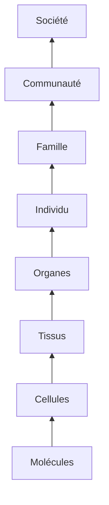

## Document page 1

3 - Au cœur des soins : des êtres humains complexes
« Aucune époque n'a accumulé sur l'homme des connaissances aussi nombreuses et aussi
diverses que la nôtre. Aucune époque n'a réussi à présenter son savoir de l'Homme sous
une forme qui nous touche davantage. Aucune époque n'a réussi à rendre ce savoir aussi
promptement et aussi aisément accessible. Mais aussi, aucune époque n'a moins su ce
qu'est l'Homme ».
— Martin Heidegger, Kant et le problème de la métaphysique, Paris, Gallimard, coll. «
Tel », 1981

Les soins infirmiers sont souvent considérés comme complexes par nature, du fait même
qu'ils s'adressent à la « complexité singulière de l'humain », pour reprendre l'expression de
Walter Hesbeen¹. Cette dernière prend la forme d'un postulat qui ne requiert aucune
démonstration, tant il est évident. C'est pourtant à cette complexité singulière que se
confrontent chaque jour les infirmières. Dès lors, il s'avère nécessaire de l'explorer
brièvement, avant d'aborder la question de la complexité des soins infirmiers.

L'être humain : un système complexe
Les propos ci-dessus de Heidegger montrent les limites de toute approche qui tendrait à
réduire l'être humain à un ensemble de connaissances scientifiques, aussi pointues soient-
elles. Comme l'écrit Edgar Morin, « la connaissance de l'humain doit être à la fois beaucoup
plus scientifique, beaucoup plus philosophique et enfin beaucoup plus poétique qu'elle ne
l'est² ». Même ainsi, elle ne saurait tout expliquer, notamment

1. Walter Hesbeen, « Le Soignant, les soins et le soin », in collectif, Les Soignants.
L'écriture, la recherche, la formation, Paris, Seli Arslan, 2012, p. 46.
2. Edgar Morin, La méthode, t. 5, op. cit., p. 12.

Page 52
Les situations de soins complexes

ce qui relève du Mystère - au sens ancien du terme (religieux et contemporain (ce qui
échappe à la compréhension) - de la vie et de la mort. Il est impossible de présenter de
manière exhaustive les différents facteurs qui entrent en ligne de compte, puisque « connaître
l'humain, c'est non pas le retrancher de l'univers mais l'y situer !¹ », projet ambitieux s'il en
est. Certains d'entre eux méritent cependant d'être brièvement explorés, en raison de leurs
impacts sur les soins.

## Document page 2

L'être humain : un système complexe en lien avec des sous- et sur-
systèmes
Les premières formes complexes de vie apparurent probablement il y a quelque 2,1 milliards
d'années, comme le montrent certains organismes pluricellulaires retrouvés au Gabon.
Depuis, cette complexité n'a fait qu'augmenter au fur et à mesure que les êtres vivants
devenaient de plus en plus évolués. Selon C. Taylor et D. Jefferson :

« la vie sur Terre est organisée selon au moins quatre niveaux fondamentaux de structure :
le niveau moléculaire, le niveau cellulaire, le niveau de l'organisme et le niveau de la
population et de son écosystème². »

Chacun de ces niveaux, pour survivre, organise des échanges avec des éléments de mêmes
niveaux, de niveaux inférieurs (sous-systèmes) et de niveaux supérieurs (sur-systèmes) dans
des logiques d'interdépendance et de compétition. Les différents organes du corps humain,
par exemple, réalisent en permanence des échanges entre eux (information, nourriture,
oxygène, etc.) et sont simultanément en relation avec les tissus qui les constituent et les
cellules qui constituent ces tissus, elles-mêmes en échange permanent avec les fluides qui les
entourent. À un niveau supérieur, chaque organe contribue à l'existence et aux activités de
l'être humain auquel il appartient, qui lui-même fait partie d'une famille, d'une communauté,
d'une société (figure 3.1).

1. Ibid., p. 21.
2. Charles Taylor, David Jefferson, « Artificial life as a tool for biological inquiry », in
Christopher G. Langton, Artificial life: an overview, Massachusetts Institute of Technology,
1997, p. 1.

Page 53

## Document page 3

[Diagramme - Figure 3.1]

## Document page 4

Note : Le schéma original présente deux flèches latérales : l'une orientée vers le haut pour
les "Sur-systèmes" (de Individu vers Société), l'autre orientée vers le bas pour les "Sous-
systèmes" (de Individu vers Molécules).

Figure 3.1. Sur- et sous-systèmes constitutifs de l'être humain (schéma simplifié).

L'être humain : un système ouvert complexe
Une des caractéristiques de tout être vivant est d'être un système ouvert, qui échange
constamment de l'énergie, des informations et de la matière avec son environnement. L'être
humain respire l'air présent autour de lui, consomme la nourriture à sa disposition, rejette des
déchets, capte par ses sens les informations nécessaires à sa sécurité et à ses interactions avec
les personnes, les animaux ou les objets qui l'entourent. Ainsi, au regard de la théorie des
systèmes et des sciences de la complexité :

l'être humain est considéré comme un système complexe ouvert caractérisé par des
interactions continues internes et externes innombrables et non linéaires.

Ces interactions, variables d'un instant à l'autre en fonction de ses besoins, de son état d'éveil,
de ses préoccupations, de ses émotions ou de ses qualités sensorielles, sont nécessaires à l'être
humain non seulement pour survivre, mais également pour se développer. C'est en acquérant
petit à petit les valeurs, les habitudes et les règles de son environnement que l'enfant devient
progressivement un adulte inséré socialement. À l'inverse, lorsqu'un être humain se replie sur
lui-même et se rapproche

Page 54
Les situations de soins complexes

progressivement des comportements d'un système clos, il se coupe du restant du monde,
comme on peut l'observer dans le syndrome de Diogène.

L'être humain : un système biologique complexe
L'ADN humain comprend 3 milliards de paires de bases, réparties sur 25 000 gènes¹ qui
interagissent entre eux pour permettre aux hommes et aux femmes que nous sommes de
naître, de grandir, de vieillir et de mourir. La seule taille d'un individu dépend ainsi de
plusieurs milliers de variants génétiques².

## Document page 5

Pour simplifier la complexité biologique du corps humain (encadré 3.1), les scientifiques l'ont
découpé en « systèmes » (respiratoire, nerveux, locomoteur, etc.) et/ou en « fonctions »
(procréation, élimination, etc.), quand bien même il est possible de relier chacun de nos
organes à l'ensemble des systèmes ou fonctions, au même titre que l'arbre est relié à
l'ensemble de l'univers³.

Encadré 3.1. La complexité biologique de l'être humain : quelques exemples
Un être humain compte dix fois plus de bactéries que de cellules ; bactéries qui
appartiennent à quelque 500 espèces différentes. Son corps comprend 100 000 km de
nerfs, chaque neurone étant potentiellement en contact avec 25 000 autres, mettant en jeu
une centaine de neurotransmetteurs. De plus, 640 muscles permettent à chaque partie du
corps de se mouvoir et de conserver sa posture. Quant à la rétine, elle est composée de 260
millions de cellules réceptrices, tandis que la vision occupe un tiers de la capacité de notre
cerveau et qu'il faudrait plus de 60 caméras à haute définition pour capter autant
d'informations qu'un seul œil. Sans oublier les 80 hormones qui contribuent à la régulation
du tout...

1. Michel Georges, « Pourquoi l'homme a-t-il si peu de gènes ? », propos recueillis par
Sophie Coisne, dossier spécial, La Recherche, nº 390, octobre 2005, p. 55.
2. A.R. Wood et al., « Defining the role of common variation in the genomic and biological
architecture of adult human height », Nat Genet, nº 46(11), 2014, p. 1173-1186.
3. Cf. supra, p. 34.

Page 55
Au cœur des soins des êtres humains complexes

Par l'intermédiaire d'hormones, de médiateurs chimiques, de fibres nerveuses, de muscles, de
fascias, de vaisseaux sanguins ou lymphatiques, chaque partie du corps, chaque organe est
relié aux autres en une complexité que l'homme n'a pas fini de découvrir et qui peut susciter
surprise, curiosité ou scepticisme. Lorsqu'un ostéopathe supprime des douleurs dans la
mâchoire en agissant sur les muscles fessiers et la position du bassin, cela peut paraître
surprenant, mais les résultats sont là. Les effets secondaires des médicaments constituent un
autre exemple de ces liens surprenants (encadré 3.2).

## Document page 6

Selon le journaliste scientifique James Gleick, le corps humain représente, « pour beaucoup
de scientifiques, la pierre angulaire de toute approche de la complexité ». Selon lui :

« Il n'existe pas pour les physiciens un objet offrant une telle cacophonie de mouvements à
contretemps sur des échelles allant du microscopique au macroscopique : mouvements de
muscles, de fluides, de courants, de fibres, de cellules [...]. Chaque organe est doté de sa
propre microstructure et de sa propre chimie¹. »

Malgré cela, l'anatomie reste souvent enseignée en termes d'éléments isolés les uns des
autres.

Encadré 3.2. Les effets secondaires des médicaments
Les effets secondaires des médicaments représentent un exemple de la complexité des
liens qui unissent les différents organes qui composent le corps humain. Qu'ils s'agissent
de médicaments aussi différents que des antiarythmiques, des somnifères ou une pilule
contraceptive, ces effets secondaires peuvent toucher à des degrés divers la plupart des
organes, alors même que leur molécule active ne devrait toucher que celui qui est ciblé. Si
l'on prend par exemple le Zolpidem®, ses effets secondaires incluent des hallucinations,
des maux de tête, des diarrhées, des nausées et vomissements, des infections des voies
aériennes supérieures et inférieures, des troubles de la vue, des inflammations du foie, de
l'urticaire, une faiblesse musculaire, etc. La liste n'est pas exhaustive.
Source : données de www.compendium.ch.

1. James Gleick, La Théorie du Chaos, Paris, Flammarion, coll. « Champs Sciences », 2008,
p. 388.

Page 56
Les situations de soins complexes

Les formes parfois très étranges que peuvent prendre ces éléments sont une autre
démonstration de cette complexité :

« Sous ses aspects les plus tangibles, un élément du corps humain peut être un organe
apparemment bien défini, comme le foie. Ce peut être aussi un casse-tête spatial de

## Document page 7

liquides et de solides, comme le réseau du système vasculaire. Ce peut être encore une
assemblée invisible, un objet véritablement aussi abstrait qu'un « trafic » ou une «
démocratie » comme le système immunitaire avec ses lymphocytes et ses messagers T4
[...]¹. »

L'être humain constitue ainsi, sur un plan biologique, non seulement un ensemble de sous-
systèmes étroitement entrelacés, mais également un ensemble de processus physico-
chimiques, mécaniques, électriques et énergétiques qui impliquent une multitude de
mécanismes de régulation autonomes et interdépendants relevant de ce qu'Edgar Morin
appelle « le grand jeu entre ordre/désordre/interactions/organisation² ». À la constance
apparente des normes biologiques s'oppose la réalité complexe d'un ensemble en perpétuel
mouvement : « en biologie, tout varie sans arrêt dans tous les sens, tout s'adapte avec une
infinie subtilité aux moindres spécificités du contexte³ ».

L'être humain : un système psychologique et social complexe
La complexité biologique de l'être humain se complète par une complexité cognitive,
psychologique, sociale et spirituelle. Selon Edgar Morin :

« Les diversités psychologiques sont plus frappantes encore que les physiques.
Personnalités, caractères, tempéraments, sensibilités, humeurs sont d'une variété
innombrable. Les principes d'intelligibilité, les systèmes d'idées sont extrêmement divers
de culture à culture et même au sein d'une même culture⁴. »

Ce n'est pas sans raison que les soins infirmiers revendiquent une individualisation des soins,
bien conscients que ces multiples dimensions conduisent chaque patient à des représentations,
des compréhensions, des émotions, des comportements, des actions et réactions en partie
uniques,

1. Ibid.
2. Edgar Morin, La Méthode, t. 5, op. cit., p. 23.
3. « Le corps pensant », Entretien avec France Haour, directrice de laboratoire à l'INSERM,
propos recueillis par Patrice van Eersel, Nouvelles Clés, hors-séries n° 2. « Se guérir »,
2006, p. 42-47.
4. Edgar Morin, La Méthode, t. 5, op. cit., p. 61-62.

## Document page 8

Page 57
Au cœur des soins des êtres humains complexes

en fonction de ses gènes, de son histoire, de sa culture, de son éducation, de ses sensibilités,
de ce dont il est conscient et inconscient (encadré 3.3).

Nos états internes, par exemple, sont en liens directs avec les stimuli qui se produisent dans
nos environnements et qui nous touchent directement, indirectement, symboliquement et/ou
fantasmatiquement. Ils sont également sous l'influence de nos hormones, de nos expériences
passées, de la qualité de notre sommeil, des circonstances présentes, des événements à venir
dont nous nous réjouissons ou que nous craignons. Cela montre à quel point nos pensées, nos
émotions et nos réactions physiologiques sont étroitement intriquées au travers de liens dont
la complexité nous échappe, conduisant à des phénomènes pour lesquels nous n'avons parfois
aucune explication. Bien des soignants et des médecins ont ainsi été témoins de guérisons
surprenantes chez des patients que la médecine considérait comme condamnés.

Encadré 3.3. La complexité des phénomènes humains
« Pourquoi les sciences humaines sont-elles plus touchées que les sciences de la nature
[comme la physique ou la chimie] par le défi de la complexité ? [...] Parce que leurs objets
d'études sont très complexes [...]. Pour comprendre un phénomène humain, il faut tenir
compte de plusieurs facteurs qui l'influencent, chacun à leur manière, tandis qu'en sciences
naturelles les objets d'étude subissent l'influence de moins de dimensions ou de facteurs.
Ainsi, on peut étudier une roche sans tenir compte de la conscience qu'elle a d'elle-même
et de ses semblables, de sa conscience historique, de ses idéologies et de sa culture, du
sens qu'elle donne à telle ou telle action ou à sa vie. Il n'en va pas de même lorsqu'on
étudie des êtres humains. »
François Dépelteau, La Démarche d'une recherche en sciences humaines, Bruxelles, De
Boeck Université, 2010, p. 79-80.

Tiraillé entre des besoins, des désirs, des sentiments contradictoires, des faits objectifs et
subjectifs, des interprétations et des croyances profondément ancrées, l'être humain oscille
entre des pôles à la fois opposés et complémentaires faits de cohérences et d'incohérences, de
doutes et de certitudes, de progressions et de régressions, d'acceptations et de refus, qui créent
en lui et autour de lui des ambiguïtés, des ambivalences et des paradoxes plus ou moins
marqués en fonction de son caractère, de son éducation, de son environnement...
environnement fait lui-même de similitudes et de contradictions, d'ordre et de désordre.

Page 58

## Document page 9

Les situations de soins complexes

L'être humain : un système langagier, cognitif et représentatif
complexe
Chaque culture possède un système de langage, de croyances et de savoirs qui lui sont
propres et qui façonnent les perceptions, les représentations, les modes de communication et
de relations entre ceux qui appartiennent à cette culture et ceux qui en sont exclus. Il en naît
autant de sens partagés que de difficultés à se comprendre. Cette diversité s'explique non
seulement par des références culturelles différentes, mais également par le fait que les êtres
humains n'utilisent pas leurs sens de la même manière pour percevoir leur environnement.
Certaines personnes sont plus visuelles, plus auditives ou plus kinesthésiques. Dans le
brouhaha des stimuli dont nous sommes l'objet, certains seront ainsi retenus, d'autres
éliminés, conditionnant notre compréhension du monde. À cela s'ajoute le fait que chacun
utilise des formes différentes d'intelligences¹.

Au nombre de huit à neuf selon le psychologue du développement Howard Gardner, celles-ci
sollicitent des régions différentes du cerveau, ce qui rend l'acte de penser différent d'une
personne à une autre². Chaque être humain possède dès lors un savoir plus ou moins
développé, plus ou moins conscient. De même, chaque personne possède un langage plus ou
moins développé, précis et concret. La maladie et la mort ont ainsi des représentations et des
significations très différentes selon que l'on est patient ou soignant. De même, le vécu d'une
hospitalisation ne prend réellement sens pour bien des professionnels de la santé qu'une fois
qu'ils l'ont eux-mêmes expérimentés.

La diversité des savoirs, la multiplicité des représentations, le sens souvent imprécis des mots
et la manière différente de chacun de penser le monde et de le communiquer complexifient
fortement la manière d'être au monde et de construire des relations sociales avec toutes les
incompréhensions, tous les malentendus et les conflits qui en découlent et qui complexifient à
leur tour la réalité du monde.

1. Ce mot d'intelligences est à comprendre au sens que lui donne Howard Gardner, soit : «
un potentiel biologique - la capacité de traiter, de manière spécifique, une catégorie
déterminée d'informations ou de données ».
2. Howard Gardner, « L'Intelligence au pluriel », entretien par Christian Delacampagne, La
Recherche, nº 337, décembre 2000.

## Document page 10

Page 59
Au cœur des soins: des êtres humains complexes

L'être humain : un système adaptatif complexe
Non seulement l'être humain est un système complexe ouvert, mais en plus il est capable de
s'adapter à son environnement en co-construisant et en co-évoluant avec ce dernier plus ou
moins en continu. De telles caractéristiques sont typiques de ce que les sciences de la
complexité¹ appellent des systèmes adaptatifs complexes (encadré 3.4).

Ces processus d'adaptation se font d'une manière qui est toujours incertaine, sans pour autant
relever du hasard. Il n'est ainsi pas possible de

Encadré 3.4. Les systèmes adaptatifs complexes
La notion de « systèmes adaptatifs complexes » désigne tous les systèmes complexes,
quelle que soit leur nature, capables de s'adapter à des environnements en constante
évolution, grâce à des processus d'apprentissage. Cette adaptation se fait par des processus
d'auto-organisation à partir des informations reçues. Elle repose sur l'émergence de
solutions nouvelles et de modèles d'action inédits, lorsque les anciens ne sont plus
adéquats. De tels systèmes adaptatifs développent des réponses différentes à des stimuli
similaires, ce qui rend imprévisibles leurs comportements et leur développement : deux
personnes ne réagissent pas de la même manière à l'annonce d'un même diagnostic.
Les exemples de systèmes adaptatifs complexes sont multiples. Ils incluent : « l'enfant qui
apprend sa langue maternelle, la souche de bactéries développant une résistance à un
antibiotique, la communauté scientifique testant de nouvelles théories, l'artiste qui a une
idée créatrice, une société élaborant de nouvelles coutumes ou adoptant un nouvel
ensemble de superstitions, l'ordinateur programmé pour mettre au point de nouvelles
stratégies pour gagner aux échecs, et l'espèce humaine à la recherche de nouvelles
manières de vivre [...]¹ ».

1. Murray Gell-Mann, Le Quark et le jaguar, op. cit., p. 26.

1. « Sciences de la complexité » est parfois utilisé comme synonyme de la théorie des
systèmes complexes (cf. Gérard Weisbuch, Hervé Zwirn, dir., Qu'appelle-t-on aujourd'hui les
sciences de la complexité?, Paris, Vuibert, 2010) ou des théories de la complexité; cette
expression est aussi utilisée pour parler des différents courants qui travaillent dans le
domaine de la complexité (la théorie du chaos; la complexité selon E. Morin, etc.) voire pour
parler des différentes sciences qui se réfèrent à la complexité (cf. Marc Halévy, Introduction
aux sciences de la complexité, Bayeux, Maranes Éditions, 2006).

## Document page 11

Page 60
Les situations de soins complexes

prédire avec exactitude la réaction d'un patient à un médicament, même un état grippal. De
même, il n'est pas possible de désigner à l'avance les personnes qui, en cas d'épidémie,
tomberont malades ou pas. Trop de paramètres entrent en ligne de compte, tant liés à
l'intensité de l'exposition qu'à la réponse de la personne à son éventuelle vaccination ou à
l'état de ses défenses immunitaires, elles-mêmes dépendantes de multiples facteurs.

En tant que système adaptatif complexe, chaque être humain est capable d'apprentissages qui
touchent toutes les dimensions qui le constituent. Sur un plan biologique, par exemple, notre
système immunitaire apprend chaque fois qu'il est confronté à un nouveau virus de manière à
pouvoir activer ses mécanismes de défense. Sur un plan cognitif, social, émotionnel ou
spirituel, nous réalisons des apprentissages qui renforcent ou limitent nos aptitudes à nous
maintenir en santé, facilitent ou empêchent nos capacités de demander de l'aide, encouragent
ou freinent l'instauration d'un partenariat entre la personne soignée et les soignants.

Lorsqu'un patient rencontre un soignant, deux systèmes adaptatifs complexes échangent de
l'information, apprennent l'un de l'autre et s'adaptent mutuellement jusqu'à ce qu'ils trouvent
un mode de communication et de collaboration satisfaisant, dans le meilleur des cas, et dans
le pire, un mode de fonctionnement dans lequel l'un devra se soumettre ou se révolter. Si, à ce
binôme patient-soignant, nous ajoutons chacun des proches et des professionnels -
disciplinaires et interdisciplinaires - impliqués, un vaste système adaptatif complexe apparaît,
composé de dizaines de personnes et de plusieurs sous-systèmes représentant une somme très
importante de connaissances hétérogènes, d'interactions et de régulations.

L'être humain : un système complexe au cœur de rétroactions non
linéaires
Le psychologue John Briggs et le physicien F. David Peat relèvent que :

Lorsque le fonctionnement d'une machine est perturbé, il s'avère relativement simple de
localiser le problème. Un lien dans la chaîne des relations de cause à effet des pièces s'est
rompu. Il faut alors repérer ce lien et le réparer. En revanche, lorsque le corps humain
défaille, un médecin peut diagnostiquer un problème particulier, mais en fait toute
perturbation de notre santé a une

## Document page 12

Page 61
Au cœur des soins des êtres humains complexes

cause toujours multiple puisqu'un organisme vivant est constitué d'un nombre incroyable
de boucles de rétroaction¹.

Ces systèmes de régulation (encadré 3.5) permettent de ramener à la norme les écarts qui se
produisent au sein de cet organisme (l'homéostasie) ou, au contraire, l'aident à se transformer
en adoptant de nouvelles normes. Ce système de régulation - aussi appelé feedback - est dit :

●négatif, lorsqu'il vise à ramener des déviances physiologiques, psychologiques, sociales ou
comportementales dans les normes (sécrétions hormonales, états émotionnels, satiété, etc.).
Il favorise la stabilité du système ;
●positif, lorsqu'il amplifie les écarts à la norme, accélère les processus de changement et de
transformation, provoquant parfois des crises, des ruptures ou de nouvelles formes
d'organisation. La maladie grave, l'accident, le handicap entraînent souvent de telles
rétroactions dans la mesure où la personne et son entourage vont devoir ou choisir de
modifier profondément certaines habitudes et réinventer de nouvelles normes et de
nouveaux comportements.

Bien qu'étudiées initialement surtout dans le domaine biologique, les boucles de rétroaction
existent aux différents niveaux psychologiques, relationnels, sociaux ou spirituels constitutifs
de la personne et de ses interactions avec ses environnements.

Encadré 3.5. La vie ? Des rétroactions permanentes
Le maintien de la vie impose d'incessantes rétroactions. Ces dernières non seulement
permettent de réguler les fonctions vitales, mais de plus interférent en permanence avec
d'autres mécanismes de rétroaction qui régulent d'autres fonctions : « Entrelacés dans les
boucles de structures vivantes, on trouve la transformation des aliments en énergie, la
contraction des muscles, la régulation de la température du corps, le mouvement des
hormones et des neurotransmetteurs, l'action des réflexes tels que la dilatation de l'iris de
l'œil devant une obscurité soudaine ou l'accélération du rythme cardiaque en présence d'un
danger [...]. Des myriades de boucles sont liées les unes aux autres de telle manière que
l'organisation interne d'un organisme puisse sans cesse s'adapter aux exigences de son
environnement¹ ».

## Document page 13

1. John Briggs, F. David Peat, Un miroir turbulent. Guide illustré de la théorie du chaos,
Paris, Dunod, 1997, p. 153.

Page 62
Les situations de soins complexes

Briggs et Peat rappellent que :

« Nos pensées et sentiments les plus intimes naissent d'une rétroaction continue au travers
des pensées et sentiments de ceux qui nous ont influencés. Notre individualité fait
incontestablement partie intégrante d'un mouvement collectif. Ce mouvement trouve ses
racines dans la rétroaction¹. »

Du fait de leurs interactions mutuelles et des influences internes et externes qu'elles subissent,
les rétroactions dont l'être humain est l'objet se révèlent principalement non linéaires.

L'être humain : entre autonomie et dépendance
Dans une société et un système éducatif qui nous ont souvent appris à opposer les contraires,
l'affirmation selon laquelle « il faut considérer l'individu à la fois comme totalement
dépendant et véritablement autonome² » n'est pas forcément facile à intégrer, ni sur un plan
conceptuel, ni dans la réalité des soins. Pourtant, cet individu « doit se nourrir en énergie,
matière et information extérieures pour se régénérer en permanence. Son autonomie est donc
dépendante [...]³ ». Le nourrisson est à la fois dépendant de ses parents pour une partie de ses
besoins fondamentaux (s'alimenter, rester propre, assurer l'intégrité de son épiderme, etc.) et
autonome dans une certaine mesure pour d'autres besoins, tels que respirer ou éliminer.
Néanmoins, cette autonomie est limitée. Que survienne un rhume ou une constipation et ce
même nourrisson aura besoin de l'aide de ses parents.

Cette dialogie entre autonomie et dépendance se retrouve à des degrés divers et sous des
formes multiples tout au long de la vie. Même le jeune adulte découvrant les plaisirs de
l'indépendance sur un plan familial, financier, affectif et professionnel reste dépendant
directement ou indirectement de ceux qui produisent ce dont il a besoin pour vivre, tant sur
un plan matériel que social et émotionnel. Cette dialogie crée des forces qui tendent d'un côté
vers plus de liberté, tandis que d'autres augmentent les contraintes. La personne malade ou
handicapée tend souvent à préserver son autonomie décisionnelle et son indépendance
fonctionnelle le plus longtemps possible, quand bien même sa maladie ou son handicap

## Document page 14

1. Ibid., p. 154.
2. Edgar Morin, La Méthode. 2: La vie de la vie, Paris, Le Seuil, coll. « Points », 2014, p.
277.
3. Edgar Morin, La Méthode, t. 5, op. cit., p. 345.

Page 63
Au cœur des soins des êtres humains complexes

freine sa liberté de mouvements et de décision. Il y a ainsi « toujours, et dans tout système, et
même chez ceux qui y suscitent des émergences, des contraintes sur les parties, qui imposent
restrictions et servitudes¹ » – y compris, et parfois surtout, lorsqu'on devient dépendant de
soi-même, c'est-à-dire de ses croyances, de ses représentations, de ses émotions, de ses
ressources et limites. Cela peut induire des refus de diagnostics, de traitements et de soins.

L'être humain : des rôles et identités multiples et complexes
Nous avons tous une histoire unique, à nulle autre pareille, liée à celle des environnements
dans lesquels nous nous sommes développés et dans lesquels nous habitons, travaillons,
voyageons et parfois souffrons. Cette histoire est constituée d'un ensemble d'histoires
enchevêtrées, transgénérationnelles, dont une partie est accessible à nos souvenirs tandis
qu'une autre nous échappe.

Chacun d'entre nous est généralement identifié par un nom et un prénom qui lui ont été
attribués à la naissance et dans lesquels chacun se reconnaît peu ou prou tout au long de sa
vie. Porter un nom, un prénom n'est pourtant pas neutre. Bien des prénoms et des noms de
famille sont porteurs d'une histoire à la dimension religieuse, historique, sociale ou familiale.
Porter le nom d'un saint, du grand-père, d'une sœur décédée ou d'un acteur à la mode n'est pas
sans intentions de la part des parents et sans responsabilités - conscientes et/ou inconscientes
- de la part de ceux qui le portent ; comme ce n'est pas sans risque de transferts, de
projections, de fantasmes. Certaines personnes portent ainsi en elles des loyautés envers un
membre de la famille, son histoire, ses mentors et ses trahisons. Anne Ancelin
Schützenberger relevait :

« On s'est aperçu comme cela qu'il y avait des familles dans lesquelles, de génération en
génération, il y avait répétition de structures et d'événements et où une sorte de loyauté

## Document page 15

familiale inconsciente faisait que les gens marquaient des dates importantes par la mort,
ou la maladie gravissime et la mort³. »

1. Edgar Morin, La Méthode, t. 1, op. cit., p. 113.
2. Ou dans les mois qui suivent, selon les cultures.
3. Anne Ancelin Schützenberger, « Forme européenne inconsciente du chamanisme : "la
réalisation automatique des prédictions" », IIes Rencontres internationales Fêtes et
Communication, 1986.

Page 64
Les situations de soins complexes

Nos identités dépendent aussi des communautés auxquelles nous appartenons et des qualités
que nous, notre entourage et la société, y attribuons. Nous sommes ainsi des êtres composites
aux rôles et aux identités multiples, liés notamment :

●au genre et à la sexualité : homme, femme, transgenre ; homo-, hétéro-, bisexuel, etc. ;
●à l'âge : prématuré, bébé, enfant, adolescent, adulte ou personne âgée ;
●à la situation familiale : père ou mère, enfant (premier, dernier de la fratrie, etc.), grand-
père ou grand-mère, jumeau ou jumelle, parrain ou marraine, etc. ;
●au statut social : marié(e), veuf(ve), célibataire, mère ou père célibataire, orphelin(e), de
père ou de mère inconnu(e), chômeur(se), retraité(e), etc. ;
●à l'activité au sein de la communauté familiale ;
●aux écoles suivies, à leur niveau dans la hiérarchie scolaire et à leur renommée ;
●au(x) métier(s) exercés ;
●à (aux) entreprise(s) dans lesquelles nous avons travaillé (« je suis un ancien de... ») ;
●à la provenance ethnique, à la nationalité ;
●au lieu d'habitation (ville, campagne, montagne, quartier, etc.) ;
●au système de croyance : croyant, non croyant, athée, adepte de telle ou telle religion,
confession ou philosophie.

Chacune de ces identités et chacun de ces rôles coexiste de manière concurrente,
complémentaire et antagoniste. La modernité nous « conduit à multiplier les rôles sociaux et

## Document page 16

à ballotter notre vie quotidienne entre des logiques différentes¹ », chacun excellant peu ou
prou dans cet exercice d'équilibrisme. Tel était le cas de cette jeune femme atteinte d'une
maladie grave qui, en tête à tête avec les infirmières, demandait à connaître son diagnostic,
mais qui, dès son mari présent, refusait de le connaître, car dans sa culture, seuls le mari et les
parents étaient en droit de savoir.

1. Jean-François Dortier, « L'Individu dispersé et ses identités multiples », in Jean-Claude
Ruano-Borbalan (coord.), L'Identité. L'individu, le groupe, la société, Auxerre, Sciences
Humaines, 1998, p. 51.
2. Jean-François Dortier, « L'Individu dispersé et ses identités multiples », art. cité, p. 51-52.

Page 65
Au cœur des soins des êtres humains complexes

Chacune des identités constitutives de l'être humain est en elle-même multiple, faite de ce que
la personne en sait et en ignore, de ce que les autres en savent et en ignorent, de ce que les
uns et les autres croient et fantasment à son égard, des ressources et des limites que chacun y
attribue.

L'être humain : une dialogie permanente entre la vie et la mort
Chacun est fait simultanément de cellules vivantes, de cellules en train de naître et de cellules
mortes ou en train de mourir. La mort, sous certaines formes, est non seulement présente en
chacun, à chaque instant de la vie, mais nécessaire à la vie, tant au niveau individuel que
collectif. Des chercheurs de l'institut Karolinska de Stockholm ont mis en évidence que
chaque tissu du corps humain a une durée de vie spécifique : si les cellules de l'œil semblent
ne pas se régénérer, la peau se renouvelle environ toutes les 2 semaines, les globules rouges
tous les 4 mois, le foie tous les 300 à 500 jours, le squelette tous les 10 ans, les muscles
intercostaux tous les 15 ans¹.

Si la conscience de ces changements et de ces mélanges de mort et de renaissance n'est pas
constante, différents éléments nous les rappellent régulièrement. Au travers des « outrages du
temps », le corps montre progressivement ses limites et le miroir nous renvoie des images
plus ridées comme autant d'indicateurs des transformations qui se font en nous et qui nous
rapprochent lentement mais continuellement d'une mort dont seuls le moment et les modalités
nous échappent. Il s'ensuit que « la mort travaille l'esprit humain. La certitude de la mort liée

## Document page 17

à l'incertitude de son heure est une source d'angoisse pour la vie² » - en tout cas pour certains
et à certains moments de l'existence.

Conscience de notre finitude et tentation d'éviter d'y penser, acceptation de notre mort (un
jour) et volonté de repousser les échéances le plus loin possible, conscience que nous sommes
à tout instant mortels et simultanément volonté d'y échapper en construisant des mythes et
des croyances en une vie éternelle ou en une réincarnation coexistent de manière complexe en
la plupart d'entre nous, d'une manière à la fois

1. Futura-Sciences.com, « La plupart de nos cellules sont plus jeunes que nous », Cordis, 25
août 2005, https://www.futura-sciences.com/sciences/actualites/recherche-plupart-nos-
cellules-sont-plus-jeunes-nous-6938/.
2. Edgar Morin, La méthode, t. 5, op. cit., p. 49.

Page 66
Les situations de soins complexes

complémentaire et antagoniste, précise et ambiguë, objective et subjective, individuelle et
collective, rassurante et anxiogène, partiellement élaborée et simultanément en partie
inconcevable.

L'être humain : un maelström d'ordre et de désordre
« Qu'est-ce que l'homme ? » demande Edgar Morin, avant de tenter de le délimiter :

« Être vivant, animal, vertébré, mammifère, primate, hominien, il est aussi quelque chose
d'autre, et ce quelque chose, nommé homo sapiens, échappe non seulement à une
définition simple, mais aussi à une définition complexe. Car il ne s'agit pas seulement de
concevoir que l'être de l'homme s'exprime à travers et par son affectivité, il faut concevoir
aussi que la folie est un problème central de l'homme, et non seulement son excès et son
déchet. Il nous faut tenter de concevoir - et nous ne sommes qu'au tout début - le rôle
inouï, dysfonctionnel et fonctionnel, de l'irrationalité dans la rationalité (et l'inverse)¹. »

## Document page 18

Nous avons vu plus haut qu'au regard de la pensée complexe, ordre et désordre non
seulement coexistent, mais sont simultanément concurrents et complémentaires, l'un étant
nécessaire au développement de l'autre, l'un étant inclus dans l'autre. Dans cette perspective,
l'être humain est lui aussi fait d'ordre et de désordre - de fonctionnel et de dysfonctionnel, de
rationalité et d'irrationalité pour reprendre les propos d'Edgar Morin -, tant au niveau
biologique que psychologique, social ou spirituel. Nous retrouvons ainsi par exemple :

●l'ordre génétique lié aux chromosomes et à leurs gènes, et son désordre lié aux mutations et
aux ruptures ;
●l'ordre socioculturel normalisé par les lois et les codes moraux, et le désordre permanent de
l'irruption de l'individu ainsi que de nouvelles formes de cultures et de sous-cultures avec
leurs propres normes et codes ;
●l'ordre rassurant de nos croyances et de nos connaissances, et le désordre continu qui
émerge de la recherche scientifique et de la confrontation à des croyances ou des champs
de connaissances qui échappent aux représentations individuelles et collectives courantes ;

1. Edgar Morin, La Complexité humaine, textes rassemblés avec Edgar Morin et présentés
par Heinz Weinmann, Paris, coll. « Champs/L'Essentiel », Flammarion, 1994, p. 167.

Page 67
Au cœur des soins des êtres humains complexes

●l'ordre représenté par la santé physiologique et psychologique, et le désordre lié à la
maladie et à la perte progressive de certaines facultés ;
●l'ordre représenté par la sensation d'un corps sain, et le désordre manifesté par les signes et
symptômes tels que la douleur, la fatigue, des crampes abdominales, des maux de tête ou
un essoufflement anormal ;
●l'ordre d'un esprit et d'une conscience en paix, et le désordre de l'anxiété, de la peur, de la
culpabilité, de la colère, de la honte, de la fragilité ;
●l'ordre de la reproduction fidèle des cellules au fil de leurs générations successives, et le
désordre de la prolifération des cellules cancéreuses et des métastases ;
●l'ordre du fonctionnement mental « normal » aux yeux de la société et le désordre des
psychoses et des névroses ;
●l'ordre du corps parfait, répondant aux canons de la publicité et de son époque, et le
désordre du corps imparfait, vieillissant ou handicapé ;

## Document page 19

●l'ordre de l'enfant normal porteur de promesses d'un développement harmonieux et le
désordre de l'enfant anormal porteur des limites de développement qui y sont liées ;
●l'ordre des sexes et des genres liés aux schémas dominants, et le désordre qu'y induisent les
réalités sexuées et sexuelles multiples ;
●l'ordre de la parentalité qui découle des lois biologiques et le désordre des parentalités aux
référencements multiples ;
●l'ordre de l'être humain réfléchi, raisonnable, pondéré et cohérent, et le désordre de l'être
humain irréfléchi, déraisonnable, excessif et incohérent.

L'être humain est un tout qui conjugue en continu ses qualités et ses défauts, ses ressources et
ses limites. Il entraîne dans une danse extraordinaire et sans fin à :

« lier l'homme raisonnable (sapiens) à l'homme fou (demens), l'homme producteur,
l'homme technicien, l'homme constructeur, l'homme anxieux, l'homme jouisseur, l'homme
extatique, l'homme chantant et dansant, l'homme instable, l'homme subjectif, l'homme
imaginaire, l'homme mythologique, l'homme crisique, l'homme névrotique, l'homme
érotique, l'homme ubrique, l'homme destructeur, l'homme conscient, l'homme inconscient,
l'homme magique, l'homme rationnel [...]¹. »

1. Edgar Morin, La Complexité humaine, op. cit., p. 168.

Page 68
Les situations de soins complexes

De l'être biologique à l'être symbiotique : une complexité...
augmentée
Dans L'Homme symbiotique¹, Joël de Rosnay présentait :

« l'origine d'une nouvelle forme de vie sur la Terre : celle d'un macro-organisme planétaire
constitué par l'ensemble des hommes et des machines, organismes, réseaux, nations [...].
Une nouvelle histoire des origines de la vie à laquelle, cette fois, nous participons
directement en tant que cellules. Une histoire destinée à éclairer l'avenir que nous
construisons encore à tâtons : celui de l'homme symbiotique. »

## Document page 20

Il y annonçait une « nouvelle forme de vie [...] hybride, à la fois biologique, mécanique et
électronique² ».

Joël de Rosnay annonçait une nouvelle forme d'êtres humains : l'« homme transformé³ »,
voire l'« homme augmenté ». Ses prédictions sont en train de se réaliser, même si nous
sommes au tout début de ce formidable bouleversement. Aujourd'hui déjà, dans la vraie vie
ou dans les laboratoires (et donc pour demain), des êtres humains se font implanter des puces
dans le corps ou pallient leurs limites grâce à des exosquelettes ; des chercheurs travaillent à
intégrer nos téléphones portables à l'intérieur de nos corps ; testent des pilules bardées de
minuscules senseurs qui collecteront des informations de l'intérieur sur notre état de santé et
les transmettront à notre médecin traitant, générant leur énergie à partir du suc gastriques ;
élaborent des puces électroniques sous forme de tatouages ; travaillent à relier le cerveau
humain à des ordinateurs ; développent des nano-ordinateurs actifs à l'intérieur du corps
humain pour lutter contre la douleur ou traiter certains cancers⁶. Vêtements intelligents
capables de mesurer des constantes biologiques, les mouvements et la

1. Joël de Rosnay, L'Homme symbiotique. Regard sur le troisième millénaire, Paris, Le Seuil,
1995.
2. Ibid., p. 16-17.
3. Selon le nom de l'exposition « L'homme transformé » de Joël de Rosnay, Cité des Sciences
et de l'industrie, 2002.
4. Édouard Kleinpeter (dir.), L'Humain augmenté, Paris, CNRS Éditions, coll. « Les
Essentiels d'Hermès », 2013.
5. Arnaud Lefebvre, « Cette pilule électronique vous examine et envoie le diagnostic à votre
médecin en 24 heures », Express.be, 10 août 2014.
6. Arnaud Lefebvre, « 9 technologies intelligentes que vous pourriez bientôt avoir dans votre
corps », Express.be, 10 novembre 2014.

Page 69
Au cœur des soins des êtres humains complexes

localisation du porteur ; rétine artificielle, puce qui permet d'entendre les couleurs,
neuroprothèses commandées par la pensée, main bionique... : l'électronique portable et
personnalisée nous transforme progressivement en une espèce mutante, augmentée et
interconnectée, qui va multiplier, transformer, voire révolutionner la complexité des relations
à nous-mêmes, aux autres êtres vivants... et aux soins.

## Document page 21

De nouveaux domaines de connaissances et d'actions, de nouveaux métiers non spécifiques
au monde de la santé et des soins relevant de l'ingénierie, de l'électronique, de la
micromécanique, de nouvelles perspectives préventives et thérapeutiques apparaissent
progressivement avec leurs complémentarités, leurs interférences, leurs rivalités, leurs
incompatibilités, simplifiant et complexifiant la tâche tant des soignants que des patients.

Portées par de puissants groupes économiques, ces évolutions soulèvent de nouveaux
dilemmes déontologiques et éthiques. Elles vont bien au-delà des progrès qu'elles font
miroiter pour des personnes malades ou handicapées, avec des applications visant d'autres
buts que de soigner, notamment pour augmenter et transformer l'espèce humaine comme le
prône le courant transhumaniste¹ (encadré 3.6), voire ayant des fins économiques et
militaires.

Un jour, selon la Singularity University², « êtres humains et machines fusionneront de
manière si naturelle et si élégante que la maladie, les ravages du vieillissement, voire la mort
elle-même, appartiendront à un passé révolu³ ». Demain - c'est-à-dire d'ici quelques années
ou décennies -, des soignants transformés voire augmentés soigneront des patients
transformés ou augmentés, porteurs de nouvelles identités : les cyborgs⁴ ; avec,
probablement, par bien des aspects, une complexité... augmentée.

1. Cf. notamment le site de Humanity+, https://humanityplus.org/.
2. Cette entreprise privée américaine est à la fois une université, un centre d'incubation
d'entreprises et un think-tank ; cf. https://su.org/.
3. Ashlee Vance, « L'Avènement des technoprophètes : bienvenue à l'école des sorciers ! »,
Courrier International, 5 août 2010 (The New York Times 29 juillet 2010).
4. Cyborg: « désigne un être vivant auquel on a greffé ou implanté dans le corps des
éléments technologiques », Édouard Kleinpeter, L'Humain augmenté, op. cit., glossaire.

Page 70
Les situations de soins complexes

Encadré 3.6. Le transhumanisme - Humanity+
L'appellation « Humanity+ » désigne bien ses ambitions : promouvoir un être humain
nouveau, augmenté. Elle caractérise le mouvement transhumaniste. Celui-ci se définit
comme « un ensemble de philosophies de la vie qui recherchent la continuation et

## Document page 22

l'accélération de l'évolution de la vie intelligente au-delà de sa forme humaine actuelle et
des limitations humaines au moyen de la science et de la technologie, guidées des
principes et des valeurs de promotion de la vie¹ ».
La Déclaration transhumaniste soutient notamment que : « Les transhumanistes prônent le
droit moral de ceux qui le désirent, de se servir de la technologie pour accroître leurs
capacités physiques, mentales ou reproductives et d'être davantage maîtres de leur propre
vie. Nous souhaitons nous épanouir en transcendant nos limites biologiques actuelles² ».
Objet de nombreuses critiques, le mouvement transhumaniste a depuis nuancé ses
positions.
1. Max More, 1990, https://humanityplus.org/philosophy/transhumanist-faq/.
2. Richard Gauthier, 2003, pour la traduction française,
https://iatranshumanisme.com/transhumanisme/la-declaration-transhumaniste.

➤ Constamment en transformation au travers des processus incessants de mort et
de renaissance cellulaires, l'être humain représente une complexité biologique que
la science n'a pas fini d'explorer.

➤ Ambivalents, rationnels et irrationnels, partagés entre des émotions diverses, les
êtres humains ne sont réductibles à aucun modèle, à aucune loi, tout en présentant
simultanément des ensembles de ressemblances et de similitudes sans lesquelles il
ne serait pas possible de communiquer, de se comprendre, de soigner et d'être
soigné.

➤ L'être humain est ainsi intrinsèquement imprédictible dans ses manières d'être et
de s'adapter, oscillant entre ordre et désordre, développant et maintenant des
mécanismes non linéaires pour construire des compromis entre les différentes
sollicitations dont il est l'objet, que celles-ci viennent de lui-même ou de son
environnement.

Aux travers de leurs soins, les infirmières sont plus ou moins confrontées à ces formes de
complexités et à leurs manifestations, selon que ces dernières s'expriment peu ou beaucoup.
Individualiser les soins devient alors une condition pour s'adapter à la singularité de chaque
patient et de chaque situation, que cette dernière s'avère simple, compliquée ou complexe,
