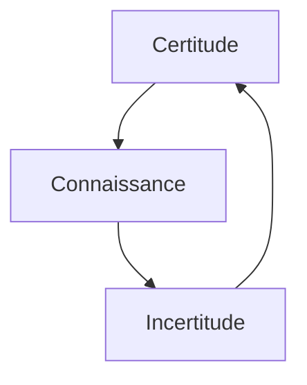

## Document page 1

4 - Au cœur de la complexité des soins : des
références multiples, floues et instables
« Dans la nouvelle médecine de l'inflation des données et de l'approche statistique des
individus, l'incertitude frappe l'ensemble de ce qui, autrefois, semblait bien établi : la
distinction entre la santé et la maladie, la définition du normal, la notion même de
diagnostic. »
— Bertrand Kiefer, « La Médecine cernée par l'incertitude », Revue Médicale Suisse, n°
543, 2016, p. 2192.

Peut-on avoir 80 ans et être en bonne santé, alors même que certaines fonctions biologiques
ont fortement décliné (encadré 4.1) ? Peut-on se sentir en bonne santé et être malade ? Ou à
l'inverse, se sentir malade et être en bonne santé ? Peut-on être encore malade alors que l'on
se sent guéri, ou se sentir malade alors qu'aux yeux de la médecine l'on est guéri ? Est-on
guéri ou en rémission ? Et sur quels savoirs et certitudes s'appuie-t-on pour répondre à ces
questions ? Ces dernières renvoient autant à des définitions de dictionnaire et à des éléments
normatifs scientifiques qu'au ressenti de chacun et à l'appréciation que l'entourage de la
personne se fait à partir de ce qu'il observe, de ses peurs et de ses croyances.

Les notions de santé et de maladie, de guérison ou de rémission, de situations aiguës ou
chroniques sont porteuses de dimensions objectives et subjectives, parfois complémentaires,
parfois antagonistes, souvent relatives. Une patiente de soins intensifs - dont les indicateurs
biologiques montraient une amélioration - se recroquevillait ainsi de plus en plus dans son lit,
persuadée que nous lui mentions lorsque nous lui disions qu'elle allait mieux, alors que son
ressenti lui laissait croire qu'elle allait de plus en plus mal. Son vécu et notre lecture des
indicateurs « objectifs » à notre disposition étaient, sur le moment, incompatibles ; sans parler
du désespoir que cette patiente pouvait ressentir en se sentant pareillement incomprise dans
une situation menaçante. Comment

Page 72 - Les situations de soins complexes
dès lors communiquer pour soutenir ses ressources et éviter les tensions liées à nos
divergences ?

Même si les soins infirmiers s'adressent aussi à des personnes et des groupes en bonne santé,
notamment pour de la prévention, ils visent la plupart du temps des personnes malades,
handicapées ou mourantes. Derrière ces termes, interprétés différemment par chacun, se
cachent des vécus, des repères, des normes, des habitudes culturelles qui rendent les soins
parfois difficiles, porteurs de zones d'ambivalences et de non-dits, de tension et de conflits
entre personnes soignées, personnes soignantes et proches. Mieux comprendre ce que ces
mots recouvrent aide à mieux appréhender cette complexité et à mieux l'anticiper.

## Document page 2

Encadré 4.1. Malade ?
Côté pile : 85 ans, un gros infarctus, un remplacement de valve aortique, une
cardiomégalie massive, des difficultés respiratoires récurrentes, une fonte musculaire
importante, un périmètre de marche très restreint.
Côté face : une femme de 85 ans, indépendante pour ses activités quotidiennes, fine
observatrice du monde, totalement lucide sur son état et les risques qu'il représente, très
active dans le périmètre qui est le sien, pleine de projets, qui gère très bien ses affaires et
reste active dans sa communauté.
Une femme âgée, qui, quand on lui demande comment elle va, répond selon les jours : «
En paix, prête à mourir », ou « Comme une jeune femme ! ».
Alors : malade ?

La santé ? Un concept vague, multiforme, ambigu
et... instable
Qu'est-ce que la santé ? Ce terme est abondamment utilisé, mais comment le définir ? En fait,
« il existe d'innombrables définitions de la "santé", qui sont parfois divergentes¹ », bien que
nous ayons souvent l'illusion que, lorsque nous utilisons ce terme, chacun y accorde un sens
similaire. Mais est-ce que le mot « santé » recouvre les mêmes significations, les mêmes
déterminants lorsque l'on est en pleine forme à 20 ans que lorsque l'on en a 40 et que les
premiers signes de vieillissement apparaissent, ou 80 et que monter les escaliers s'avère
difficile ?

Page 73 - La complexité des soins des références multiples, floues et instables
Certaines fois, pour simplifier, les notions de santé et de maladie sont définies l'une par
rapport à l'autre. En anglais par exemple, la maladie est parfois approchée sous l'angle d'une
ill health, soit d'une santé malade, ou en français courant, d'une mauvaise santé. On peut ainsi
être, en bonne ou en mauvaise santé. Mais est-ce qu'être en mauvaise santé est synonyme
d'être malade ? Et si l'on peut être en mauvaise santé sans être malade, de quoi est fait cet état
intermédiaire entre santé et maladie, tant sur un plan biologique, que psychologique ou
social ?

La terminologie qui tourne autour de la maladie a une connotation systématiquement
négative, qui renvoie à la notion de « problèmes de santé », reflétant des événements qui
surviennent dans le cours de la vie² pour la perturber et en modifier le cours. La santé jouit,
elle, d'une connotation positive. Elle apparaît comme la norme, la référence, tandis que la
maladie apparaît non pas comme faisant partie de la vie et contribuant à celle-ci, mais comme
un mal, une erreur, un accident de parcours qu'il faut réparer, guérir, dépasser.

La question de l'utilité de la maladie - tant sur un plan physiologique, par exemple pour
favoriser le renforcement du système immunitaire, que sur un plan existentiel – n'est presque

## Document page 3

jamais abordée. Seuls certains malades, qui ont intégré leur maladie à leur quotidien, la
vivent comme une expérience, une ressource, qui contribue à leur développement, voire qui
leur donne l'impression d'être réellement en vie. Le neurologue Oliver Sacks rapporte ainsi
l'histoire de Mme K. qui, après s'être autodiagnostiquée une neurosyphilis, hésitait sur les
suites à donner :

« Je ne sais pas si je veux qu'on la traite, disait-elle. Je sais que c'est une maladie, mais elle
me procure une sensation de bien-être. J'y ai trouvé et y trouve encore du plaisir, je ne
peux le nier. Elle me donne l'impression d'avoir plus d'entrain, d'être plus vive, une
impression que je n'ai pas eue depuis vingt ans [...]. Je ne veux pas que cela s'aggrave, ce
serait horrible ; mais je ne veux pas qu'on la guérisse, ce serait tout aussi affreux. Je n'étais
pas vraiment vivante avant d'être prise de ces remous³. »

Page 74 - Les situations de soins complexes
La maladie qui redonne la vie, qui redonne de l'entrain, du bien-être, quel paradoxe !
Pour l'Organisation mondiale de la santé (OMS), la santé requiert « une absence de maladie
ou d'infirmité »¹, alors que Mme K. se sent bien plus vivante et en santé avec sa
neurosyphilis. Le vécu de Mme K. questionne également la définition de l'OMS (2007) de la
santé mentale qui postule que cette dernière « n'est pas simplement l'absence de troubles
mentaux. Elle se définit comme un état de bien-être dans lequel chaque personne réalise son
potentiel² ». Or, le sentiment de bien-être de Mme K. découle directement de troubles
mentaux liés à sa neurosyphilis et non de leur absence.

Santé et maladie apparaissent ainsi non pas comme des opposés, mais comme une dialogie
dont un des pôles l'emporte par moments sur l'autre sans pouvoir l'éliminer.

Au cœur de la santé et de la maladie : des
normalités multiples, complémentaires et
contradictoires
Un des facteurs de complexité des soins découle du fait que patients, soignants et proches se
réfèrent à des normes et à des indicateurs différents et parfois opposés. Pour évaluer un état
de santé, chacun recourt à ce qu'il considère comme normal ou anormal - sur la base de ses
connaissances, de ses expériences, de ses croyances, de sa culture et de ses ressentis - sans
que les « normes » auxquelles il se réfère soient forcément conscientes, partagées et
acceptées. Lorsqu'une personne dit à propos d'un voisin qu'« il devrait se faire soigner », elle
se réfère à ce qu'elle considère comme normal et anormal, tant au niveau de la santé de la
personne dont elle parle que des traitements qu'elle devrait suivre.

La dimension de la normalité est au cœur des questions de santé, une bonne partie de l'action
médico-soignante visant à ramener au plus près d'une norme sociale ou « scientifique » des

## Document page 4

déséquilibres biologiques ou des « désordres » psychologiques voire psychiatriques, tandis
que patients et proches attendent des soignants que ceux-ci rétablissent un état qu'ils jugent
normal à leurs yeux. Dans la normalité médico-soignante, de...

Page 75 - La complexité des soins des références multiples, floues et instables
l'insuline est ainsi donnée à des patients diabétiques pour ramener leur glycémie dans les
normes, tandis que des antihypertenseurs ou des antidépresseurs sont prescrits pour maintenir
une tension artérielle dans les valeurs déterminées statistiquement comme normales ou pour
aider un patient à « sortir » de sa dépression. De leur côté, certains patients, en fonction de
leurs propres normes, demandent avec insistance des antibiotiques pour guérir leur angine,
alors que d'autres au contraire ne s'estiment plus assez malades pour continuer à prendre ces
mêmes antibiotiques prescrits dans un autre contexte. Les normes fixées par la science à une
époque donnée - donc relatives, bien que « scientifiques » - sont concurrencées par les
normes que chaque individu détermine pour lui-même et pour autrui, ainsi que par celles
fixées par la société ou un groupe social donné.

Pour le psychiatre Édouard Zarifian, la normalité dépend
« largement de la manière dont on appréhende le réel pour en faire notre réalité [...]. Le
même fait objectif - le réel - sera perçu ou aura une signification différente selon les
individus [...]. Pour chacun il n'y aura qu'une seule réalité, celle à laquelle il croit, comme
s'il s'agissait du réel. Ces réalités différentes entraîneront forcément des réponses
d'adaptation différentes dont certaines seront jugées "normales" et d'autres pathologiques¹
»

Une personne qui tousse régulièrement trouvera peut-être cela normal au point de ne plus s'en
rendre compte, alors que ses proches insisteront pour qu'elle consulte un médecin. Ce dernier
quant à lui s'intéressera peut-être de près aux douleurs que présente un jeune de 25 ans, les
relativisera vis-à-vis d'un de ces patients qui entre dans la cinquantaine et s'énervera
intérieurement face à un octogénaire qui lui reproche de négliger ses plaintes. La même
norme de référence - ne pas avoir mal - sera ainsi appliquée de manière différente selon les
circonstances (encadré 4.2).

Normalités et moyennes : des constantes
inconstantes aux frontières imprécises
Sur un plan scientifique, « définir la normalité est une entreprise complexe. D'un point de vue
superficiel, elle est définie par rapport au résultat moyen, ou le plus courant, pour une
personne de ce type.

Page 76 - Les situations de soins complexes

## Document page 5

Encadré 4.2. Des normes à contextualiser
Les normes aident à se référer, à se situer. Elles sont nécessaires tant à la réflexion, qu'à
l'action et à son argumentation. Cependant, « la norme ne prend son sens que si elle est
contextualisée dans une situation, c'est-à-dire dans un espace-temps donné, se découpant
dans un monde institutionnel déjà structuré. En résultent inévitablement la différenciation
des interprétations d'une même "norme" et la pluralisation des normes pour des situations
"identiques". C'est cela qui produit le sentiment d'infinie complexité qui est le propre des
sociétés contemporaines¹ » ... et qui rend si complexes certaines situations de soin.
1. Jean de Munck, Marie Verhoeven (dir.), Les Mutations du rapport à la norme...

Malheureusement, normalité n'est pas synonyme de santé : en moyenne, les Canadiens font
de l'embonpoint¹ ». En médecine, la norme est généralement définie par des constantes
biologiques établies de manière statistique à partir d'un groupe d'individus considérés comme
représentatifs - habituellement quasi exclusivement des hommes d'une certaine tranche d'âge.
Cette population n'est cependant représentative que d'elle-même, alors que les résultats
obtenus sont souvent étendus à d'autres : bien que les femmes et les personnes âgées soient en
grande partie exclues des recherches, les résultats obtenus leur sont souvent appliqués, d'une
manière que l'on sait être en partie erronée.

Les moyennes obtenues ne disent par ailleurs rien de la norme de chaque individu pris
isolément. Georges Canguilhem, dans une célèbre thèse consacrée au normal et au
pathologique, rappelait que Napoléon aurait eu une pulsation de base à 40, qui était sa norme
et qu'elle était saine pour lui, même si elle paraît aberrante au regard de la norme commune².
Il en concluait que « si donc le normal n'a pas la rigidité d'un fait de contrainte collective
mais la souplesse d'une norme qui se transforme dans sa relation à des conditions
individuelles, il est clair que la frontière entre le normal et le pathologique devient imprécise³
». Il ajoutait que,

Page 77 - La complexité des soins des références multiples, floues et instables
« dans des situations différentes, il y a des normes différentes et qui, en tant que différentes,
se valent toutes¹ ». La moyenne statistique ne pouvant déterminer ce qui est sain et normal
pour un individu donné en fonction de ce qui lui est spécifique, chacun devient légitimé à
définir ce qui est sain pour lui-même. Dès lors, des sources majeures de conflits entre
soignants, patients et proches peuvent émerger, faute d'une norme acceptée par tous. En
Grande-Bretagne, 90% des personnes considérées par les professionnels de la santé comme
obèses se considèrent comme normales² !

Soulignons que, si la « norme » biologique soulève un ensemble de questions, la situation en
psychiatrie est encore plus délicate. La norme y implique forcément des données culturelles,
géographiques, temporelles, etc. Ce qui était « normal », en matière de rapports sociaux,
d'habillement, etc. dans le Paris du XIXe siècle ne l'est plus dans celui d'aujourd'hui. Ce qui
est « normal » dans les échanges entre individus varie selon qu'on se trouve en Tasmanie, à
Kyoto ou à Bécon-les-Bruyères³ !

## Document page 6

L'être humain peut ainsi basculer du statut de personne en bonne santé à celui de malade
selon le lieu où il réside, les stéréotypes en vigueur ou sur une simple modification de ce que
des professionnels décident de fixer comme seuil pour une maladie. C'est souvent la manière
dont le patient se sent dans son corps, dans ses pensées, dans ses émotions et dans sa
souffrance qui décide s'il se considère comme malade ou en santé, quelles que soient les
normes des professionnels. Cela questionne le rôle et les savoirs de chacun et rend les soins
complexes, lorsque les normes de références des uns et des autres diffèrent au point d'être
inconciliables.

Malade ? Médicalement, anthropologiquement ou
socialement ?
La notion de maladie repose autant sur des données scientifiques que sur des composantes
culturelles, sociales et individuelles. Comme le rappelle

Page 78 - Les situations de soins complexes
le chirurgien et psychothérapeute Thierry Janssen, « avoir une maladie ou être malade n'est
pas la même chose¹ ». Cette distinction doit être gardée à l'esprit si l'on veut soigner un être
humain et ne pas simplement tenter de guérir une maladie.

Pour comprendre cette distinction, un détour par la langue anglaise est utile. En effet, la
langue française ne connaît que le mot « maladie » pour recouvrir trois notions
complémentaires et parfois antagonistes auxquelles recourent les Anglo-Saxons, même si
certaines différences font débat². Ces différenciations doivent beaucoup aux travaux
d'anthropologues, en réponse à l'insatisfaction grandissante de cliniciens qui ne se
retrouvaient plus dans les définitions biomédicales usuelles³. Naomar de Almeida-Filho
soutient que :

« malgré leur hégémonie dans le contexte scientifique et technologique actuel, les modèles
biomédicaux de la maladie, qui privilégient les niveaux individuels et infra-individuels
d'analyse, se révèlent insuffisants lorsqu'il s'agit d'aborder la complexité des phénomènes
de santé qui se produisent, au fil du temps, chez les populations humaines.⁴ »

Dès lors, la maladie, au sens francophone du terme, doit être analysée au travers de trois
approches différentes : disease, illness et sickness.

## Document page 7

La maladie « disease »
L'affection « disease » découle du paradigme réductionniste (voir le chapitre 1), qui « réduit
les fonctions vitales à des processus physiques et chimiques⁵ ». Elle recouvre ce que la
médecine désigne sous le nom de maladie. Cette approche, dite biomédicale, « résulte d'une
culture : rationalité scientifique, croyance en l'existence d'entités pathologiques que sont les
maladies⁶ », qui ont pour origine des causes objectivables, géné-

Page 79 - La complexité des soins : des références multiples, floues et instables
ralement linéaires, matérialisées au travers d'organes, de tissus, de phénomènes hormonaux
ou infectieux : « Vous avez un herpès dû à un virus ». Le processus d'identification repose sur
des examens dont les résultats mettent en évidence une pathologie selon une codification qui
fait consensus auprès du corps médical. Il s'ensuit la mise en œuvre d'un traitement, dont le
succès « est souvent évalué sur la base de critères principalement techniques, où les
paramètres physiologiques objectivables jouent un rôle beaucoup plus important que la
perception subjective des patients et des soignants, une perception qui est par définition
difficile à décrire et à interpréter¹ ». Le chirurgien soutiendra ainsi que « l'opération a
parfaitement réussi », même si le malade continue à se sentir mal, voire décède.

Dans le cadre de la maladie « disease », professionnels de la santé, malades et entourage
s'expriment parfois comme si la maladie était extérieure à la personne, une sorte d'ajout fait à
son insu : « Vous avez maintenant un diabète » ; « Vous êtes victime d'un infarctus ». Ce
diabète ou cet infarctus peuvent être vécus comme quelque chose d'étranger qui doit être
combattu, avec toutes les métaphores guerrières et les sentiments de toute-puissance qui les
accompagnent² : « On va se battre contre... » ; « L'infection a été vaincue » ; « Nous avons
encore des armes dans notre arsenal thérapeutique » ; « On se garde des cartouches en réserve
», etc.
L'attention du personnel soignant est alors essentiellement centrée sur la pathologie, au risque
que le patient devienne l'objet d'actes médico-techniques déshumanisés. Cela est d'autant plus
vrai quand la médecine est considérée comme « une révolte contre la maladie, la souffrance
et la mort³ » et que l'approche réductionniste qui la sous-tend ne s'intéresse pas à « savoir
pourquoi une personne tombe malade à un certain moment de sa vie et ce que cela peut
signifier pour elle et son entourage⁴ ».

La maladie « illness »
Le terme « illness » désigne la manière dont une personne perçoit et donne du sens à ce
qu'elle ressent dans son être, le malaise physique et parfois psychologique, spirituel et social
qui occupe à un moment donné, dans un contexte spécifique, son corps, ses pensées et ses
affects. La per-

Page 80 - Les situations de soins complexes

## Document page 8

sonne interprète à sa manière les symptômes qu'elle ressent ou la détérioration de ses
conditions de santé, et y accorde une valeur symbolique¹.

La maladie « illness » est de nature foncièrement subjective et s'inscrit dans une dimension
sociale et culturelle. Exprimée en termes de : « je ne me sens pas bien », « je me sens mal,
anxieux(se), déprimé(e) », « je ne suis pas en forme », « je suis moins bien qu'hier », elle
recouvre la manière dont la personne vit sa maladie ou son état de santé dans les
environnements qui sont les siens, en fonction de ses représentations et des représentations
collectives dans lesquelles elle baigne. Des questions en lien avec l'origine de ce qui lui arrive
vont émerger — « pourquoi ai-je un taux de cholestérol trop élevé alors que je fais attention à
ce que je mange ? » — et des schémas explicatifs apparaître : « c'est sans doute lié au stress
que j'ai vécu ces derniers mois ». Les réponses apportées se nourrissent tant de données
scientifiques que de croyances personnelles, culturelles ou populaires. Le « je suis malade »
— différent du « j'ai une maladie » — fait réémerger la personne en tant que sujet de ce qui
lui arrive et des soins. La conception même de ces derniers change et implique une écoute
attentive et sincère, favorisant une réelle prise en compte de son vécu profond.

Au contraire de la maladie « disease » qui, une fois identifiée, reste une constante (un
infarctus reste un infarctus), le ressenti de la maladie varie dans le temps, influencé par un
ensemble de facteurs : état émotionnel du moment, maladies concomitantes, intérêt ou non à
se sentir malade (par exemple selon que l'on souhaite ou non aller travailler...), expériences
antérieures personnelles ou familiales, etc. Dès lors, « la maladie ressentie ne se réduit pas à
une expérience purement individuelle : les voies qui la constituent sont multiples et souvent
conflictuelles² ». Donc, complexes...

La maladie « sickness »
Le mot « sickness » désigne la morbidité perçue par l'entourage, c'est-à-dire la maladie en
tant que phénomène qui implique ou exprime un état

Page 81 - La complexité des soins des références multiples, floues et instables
de dysfonctionnement social, au regard de l'identité (c'est « un diabétique », « un sidéen », «
un insuffisant cardiaque », « un dépressif », etc.), du comportement et du rôle social qu'une
personne malade prend ou se voit octroyer en société, dans différents contextes de vie². La
personne se voit attribuer des droits et des devoirs³ considérés comme légitimes au vu de sa
pathologie et qui modifient sa place dans le groupe. Les jugements sur les absences au travail
d'un collègue, par exemple, relèvent de cette approche de la maladie, comme les réflexions
qui seront faites par ceux qui diront d'un membre de la famille à propos de son comportement
: « C'est normal, il a un diabète » ; « C'est logique, avec sa dépression... » ; ou encore « Après
l'infarctus qu'il a eu, il ne faut pas lui en demander plus ».

## Document page 9

Il en va de même d'un patient qui, bien qu'ayant retrouvé son autonomie fonctionnelle, une
fois rentré chez lui, voit son épouse suppléer à ses besoins, arguant du fait qu'il est malade et
qu'il faut lui éviter tout effort. Dans de tels contextes, le fait d'être malade induit des rôles et
activités bien précis tant de la part de la personne « malade » que de ses proches. Pour
Florence Douguet :

« La maladie-sickness résulte de la socialisation de la maladie-disease et illness à la fois ;
processus dépendant essentiellement de la société et de la culture d'appartenance du
médecin et du malade. En définitive, sickness se rapporte au statut social du malade, au
malade comme "personnage social"⁴. »

Le comportement de la personne malade devient un mode de communication⁵. Le regard que
la communauté porte sur la personne peut l'encourager dans sa lutte contre la maladie ou au
contraire lui donner l'impression d'être incomprise dans ce qu'elle vit. Une famille ou des
collègues peuvent ainsi considérer un des leurs comme « malade », alors que celui-ci se
considère en pleine santé, ou vice versa.

Il est à relever que toutes les maladies ne suscitent pas les mêmes représentations sociales, ni
sont porteuses des mêmes connotations. Un infarctus, un ictus, un diabète juvénile ou un
cancer génèrent plutôt de la compassion, tandis que le sida, une maladie vénérienne, un
problème d'alcool ou d'obésité peuvent susciter des propos blessants et dénigrants.

Page 82 - Les situations de soins complexes
De même, les qualifications d'hystérique, de schizophrène ou de paranoïaque peuvent avoir,
dans l'expression commune, une connotation péjorative¹.

Des propos aidants ou dénigrants, issus de nos représentations individuelles et collectives,
porteurs d'encouragements ou de jugements paralysants, les personnes malades en entendent
tous les jours. Certaines voient leurs efforts être l'objet de louanges, tandis que, pour d'autres,
leur manque apparent de volonté leur vaut des remarques - directes ou entendues au détour
d'une porte mal fermée - du type « il le fait exprès », « il se laisse aller », « elle pourrait
quand même faire un effort », etc., qui serviront de détonateur à un regain d'énergie ou
conduiront à encore plus de découragement, augmentant la complexité des soins.

La santé, la maladie ressentie, la maladie observée, la maladie diagnostiquée, les traitements
et les soins sont indissociables du système culturel dans lequel ils s'insèrent, ainsi que des
sous-systèmes présents, qu'ils soient professionnels, familiaux ou communautaires. Tenir
compte de cette complexité des processus en jeu ainsi que des représentations et des savoirs
mobilisés peut souvent améliorer la qualité des soins et aider à construire des alliances
thérapeutiques.

## Document page 10

« Condamné(e) », « guéri(e) » ou « en rémission » :
l'instabilité des termes et des vécus
Les phénomènes à l'œuvre dans ce que chaque individu, chaque communauté et chaque
culture considèrent comme relevant de la santé et de la maladie s'exercent également au
travers des processus de guérison, tels qu'étudiés par l'anthropologie de la santé ou
l'ethnomédecine². Cela explique le fait que, « si des processus de guérison distincts coexistent
dans une société, c'est parce qu'ils agissent sur les différentes dimensions de la maladie³ ». En
anglais, les verbes to cure ou to heal renvoient à des modes d'intervention différents, touchant
des composantes différentes du soin, de la santé et de la guérison. To cure relève
principalement de

Page 83 - La complexité des soins : des références multiples, floues et instables
l'ensemble des moyens médicaux mis en œuvre pour éliminer la maladie, alors que le verbe
to heal s'attache aux processus qui permettent à la personne de se retrouver dans sa globalité
en santé même si elle est malade ou mourante, le healing visant à restaurer l'équilibre et
l'harmonie entre le corps et l'esprit.

Comme vu ci-dessus pour la maladie, la guérison, dans certaines situations, doit être
considérée comme « un processus complexe qui intéresse l'homme dans sa globalité
physique, psychique et sociale » (encadré 4.3) au regard duquel « une seule approche
thérapeutique isolée, médicamenteuse, psychologique ou sociale, est une absurdité »². Un
homme peut ainsi être médicalement guéri - somatiquement ou psychiatriquement parlant -,
mais se sentir dévalorisé par ce qui lui est arrivé, avoir perdu confiance en soi ou craindre le
regard des autres. Peut-on dès lors dire qu'il est guéri ? Probablement pas complètement si
l'on en croit Édouard Zarifian, pour qui guérir revient à devoir « répondre à une triple
attente : celle du soigné, celle des soignants, celle des proches - quand ce n'est pas celle de la
société³ ».

Les connaissances, représentations et croyances diverses qui gravitent autour de la notion de
guérison questionnent le sens même de ce mot et rend difficile de satisfaire à cette triple
attente. Que signifie en effet être guéri ? Une personne qui avait développé un cancer, chez
qui l'on ne retrouve plus trace de cellules cancéreuses et dont les marqueurs biologiques
restent dans des valeurs normales est-elle guérie ? Ou est-elle seulement en rémission, les
cellules cancéreuses attendant une opportunité pour se manifester à nouveau ? La même
question pourrait se poser pour toute personne qui a développé une varicelle dans son
enfance, dont elle a apparemment guéri au bout de quelques jours, alors que le virus reste
caché dans ses ganglions et peut, des décennies plus tard, se manifester sous forme d'un zona.

Les notions de pronostic et de guérison sont ainsi floues, relatives et instables. Les réponses à
la question « Suis-je guéri(e) ? » ou « Suis-je

## Document page 11

Page 84 - Les situations de soins complexes
Encadré 4.3. Les entrelacs complexes de la guérison
« Si vous vouliez vraiment tenir compte de tous les facteurs qui entrent en jeu dans la
santé, la maladie et la guérison d'une personne précise, cela vous coûterait des fortunes !
Conclusion : c'est une mission impossible [...]. Tout facteur psychique défavorable aura
des effets défavorables sur l'issue de la maladie et tout facteur psychique favorable aura
des effets favorables sur l'évolution de cette même maladie [...]. Le problème est ailleurs.
Il tient à l'énorme variabilité de la population humaine. Ce qui aide la guérison de telle
personne à tel moment, à tel endroit, n'est pas généralisable à toute l'espèce. Car tout se
met à jouer, non seulement le terrain génétique ou le traitement médical suivi, mais le
climat, l'âge, la relation avec le conjoint, la vie des enfants, la présence d'un animal
domestique... tout ! Et il devient extrêmement difficile d'établir des "lois moyennes". »
Source : « Le corps pensant », Entretien avec France Haour, directrice de laboratoire à
l'INSERM, Propos recueillis par Patrice van Eersel, Nouvelles Clés, hors-séries n° 2, « Se
guérir », 2006, p. 42-47.

condamné(e) ? », dans les cas graves, ne peuvent être formulées qu'avec prudence. Même si
les données statistiques laissent penser que la personne est guérie ou qu'au contraire elle
devrait décéder dans une brève échéance, tout soignant jouissant de quelques années
d'expérience connaît des patients qui ont déjoué les pronostics et les statistiques, soit en
décédant plus rapidement que prévu, soit, au contraire, en faisant partie de ce que l'on appelle
les « longs survivants », appellation qui dit bien la limite des mots : nul n'ose dire que ces
personnes sont guéries, mais nul n'ose prétendre qu'elles sont malades.

Qualité de vie et des soins : divergences et
dilemmes
Les soins deviennent plus complexes lorsque les conceptions de qualité de vie et de qualité
des soins divergent au sein du trinôme formé par le patient, ses proches et les soignants. Ces
derniers s'appuient sur leurs connaissances scientifiques et expérientielles, ainsi que sur leurs
valeurs et leur conception de la vie - généralement au travers de ce qu'ils imaginent être le
bien pour le patient¹. Ce dernier se réfère plus à la trajectoire de vie qu'il avait es-

Page 85 - La complexité des soins : des références multiples, floues et instables
comptée ou qu'il espère encore, à la qualité de vie qu'il parvient à maintenir, ainsi qu'aux
efforts et sacrifices que ce maintien lui coûte. Se lever du lit ou du fauteuil, accéder à la salle
de bains, chercher son courrier, ouvrir la porte de l'immeuble ou tenter d'arriver au téléphone
avant que l'interlocuteur n'ait raccroché : tout cela représente un ensemble de décisions et
d'actions dont la difficulté et le coût échappent souvent aux professionnels, qui tout au plus
s'en font une représentation imparfaite. De même, aller chez le médecin, le coiffeur ou le
dentiste peut représenter des stress et des difficultés d'organisation considérables, impliquant

## Document page 12

l'aide de voisins, d'un membre de la famille ou d'un service bénévole de transport. Vu de
l'extérieur, cela peut se résumer à de simples appels téléphoniques à réaliser, alors que pour la
personne dont l'autonomie est limitée et la fragilité importante, cela peut conduire à reporter
ou renoncer à des soins par crainte de tout ce qu'il faut affronter.

Les encouragements et injonctions des soignants du type : « Vous devriez sortir un peu plus,
vous verriez du monde et vous sentiriez moins seul » peuvent apparaître en complet décalage
face à la réalité du patient, au point que ce dernier n'estimera pas nécessaire ou possible
d'expliquer pourquoi il ne le fait pas. Le soignant peut alors avoir l'impression que le patient
ne réalise pas tout son possible pour se maintenir autonome et en santé, malgré tous les soins
et toute l'attention apportés. Il peut en résulter de la frustration, de la colère, du dépit, un
sentiment que ce qui est fait ne sert à rien. Les réalités et les représentations du patient et des
soignants s'avèrent ainsi parfois trop différentes pour que des compromis puissent être
élaborés.

De tels écarts de conception de vie et de qualité de vie peuvent également opposer le patient
et son entourage, de manière chronique ou en lien avec des événements spécifiques, au risque
que les professionnels de la santé se retrouvent pris en otages, sommés de prendre parti, ou
rejetés par une des parties car refusant de lui donner raison. Tout soin, toute parole devient
alors objet de manipulation ou d'interprétation.

Dans de telles situations, la maltraitance des uns ou des autres n'est souvent pas loin,
confrontant les soignants à des dilemmes importants dans lesquels protéger la personne de
l'hostilité qui l'entoure ne pourrait passer que par des mesures qui compliqueraient la situation
en l'exposant à des représailles. Il en résulte que, parfois, « les difficultés de la régulation
entre les acteurs sont plus déterminantes dans l'étiquetage de la lourdeur que les diverses
pathologies du patient ou que la lourdeur...

Page 86 - Les situations de soins complexes
physique¹ ». Ces régulations sont en effet complexes à réaliser en raison de la vigilance
permanente qu'elles imposent, de l'impossibilité de trouver des compromis durables et des
problèmes de conscience qu'elles soulèvent.

De la médecine aux médecines
La pluralité des médecines auxquelles les patients peuvent se référer contribue à la
complexité des soins et des relations entre soignants et personnes soignées, d'autant plus que
la transparence dans ce domaine n'est souvent pas de mise. Il y a 50 ans, une seule médecine
était accessible en Occident : la médecine allopathique, enseignée dans les facultés. Il existait
bien des rebouteux, des personnes qui connaissaient le « secret » ou qui pratiquaient d'autres
approches aussi étranges que douteuses aux yeux de la « science », mais elles étaient l'objet
d'un mépris ostensible de la part de la médecine officielle, comme l'étaient ceux qui osaient

## Document page 13

leur confier leur santé. Aujourd'hui, dans une société où les normes deviennent individuelles,
patients (et soignants) - pour peu qu'ils en aient la connaissance et les moyens - ont à leur
disposition des dizaines d'approches en lien avec la santé et la maladie : médecine chinoise,
ayurvédique, homéopathique ou anthroposophe, aromathérapie, phytothérapie,
chromatothérapie, magnétisme, dentisterie holistique, pratique chamanique ou marabout
coexistent en parallèle, en complémentarité et parfois en concurrence avec la médecine !

Autrefois choisies par des malades qui tentaient d'échapper aux échecs et à l'impuissance de
la médecine ou réservées à des personnes méfiantes envers cette dernière et désireuses de
thérapies plus « naturelles », ces approches - ou en tout cas celles qui sont considérées
comme crédibles - s'enseignent aujourd'hui dans de prestigieuses universités, qui mettent
leurs connaissances au service du grand public. L'Arizona Center for Integrative Medicine de
l'Université de l'Arizona, par exemple, se propose d'être un leader :

« dans la transformation des soins de santé en créant, formant et supportant activement
une communauté qui incarne la philosophie et la pratique des méde-

Page 87 - La complexité des soins des références multiples, floues et instables
cines orientées vers la guérison (healing). Tous les facteurs qui influencent la santé, le
bien-être et la maladie sont pris en considération, en incluant la pensée (mind), l'esprit
(spirit)² et la communauté, aussi bien que le corps³. »

Les différentes dénominations qui les désignent illustrent bien ce qui réunit et ce qui sépare
ces approches. Le terme de « médecines complémentaires » insiste sur leurs
complémentarités avec la médecine occidentale, celui de « médecines parallèles » montre la
difficulté de les faire se rejoindre, tandis que l'expression « médecines alternatives » met en
avant les choix à disposition des patients. Fondées sur des modèles, des croyances et des
preuves scientifiques variables, ces approches permettent à des patients de vivre et d'exprimer
leur maladie au travers de canaux que la médecine « officielle » ne permet pas. Le fait
qu'elles soient regardées avec méfiance par bien des praticiens conduit cependant beaucoup
de malades à taire le fait qu'ils y recourent. Cela ne peut que complexifier les relations,
l'évaluation de l'efficacité des traitements et les soins en général.

L'enchevêtrement des frontières entre la vie et la
mort
Dans une logique formelle, un être humain ne peut être que vivant ou mort. Dans la réalité
complexe de la vie, les frontières entre la vie et la mort deviennent elles-mêmes complexes.
Comme le relève Margaret Lock : « La mort n'est pas évidente en elle-même, parce que
l'espace entre la vie et la mort est historiquement et culturellement construit,

## Document page 14

Notes:
1. The Université of Arizona, Arizona Center for Integrative Medicine, « About the Center »,
https://integrativemedicine.arizona.edu/about/index.html.
2. Ce mot doit être compris au sens anglophone du terme, qui différencie mind (l'esprit, au
sens des processus cognitifs) et spirit. Comme le précise le T. Janssen, pour les anglophones,
« le lien corps-esprit est un lien body-mind. Ils utilisent, en plus, le mot soul pour désigner
les émotions. Body, soul, mind: le corps, les émotions, la pensée. Ces trois dimensions
constituent la personne humaine. Elles doivent pouvoir être vécues dans une complète
harmonie. Le mot spirit désigne alors ce qui les relie entre-elles ». Il rappelle que « le mot
"esprit" - spirit, en anglais - vient du latin spiritus: le souffle. C'est ce souffle qui traverse
l'être et le rend vivant. On peut donc dire que l'esprit est l'ensemble des liens qui existent
entre toutes les dimensions du vivant ». Thierry Janssen, « À la recherche de l'esprit »,
Inexploré, n° 12, octobre-décembre 2011.
3. «What is IM/IH?», https://integrativemedicine.arizona.edu/about/definition.html, point 2.

Page 88 - Les situations de soins complexes
fluide, multiple et ouvert au débat¹ ». Cet espace suit les évolutions des connaissances
scientifiques, sans forcément être aligné sur les croyances et représentations présentes dans la
société, d'autant plus que les conceptions liées à la vie et à la mort varient selon les
personnes, les cultures, les religions. Pour certaines personnes, la mort n'est qu'un néant
absolu, alors que pour d'autres, il ne s'agit que d'une continuité, d'une transformation de
l'énergie, d'un passage. Pour certains, les questions fondamentales qui les animent tournent
autour de ce qui les attend « après » la mort, alors que d'autres sont plus en souci sur le
mourir : « Est-ce que tu sais comment on meurt ? » demandait une vieille dame à une amie.

Les frontières entre la mort et la vie sont plus complexes que ce qui est généralement admis,
comme en témoigne dans son livre Angèle Lieby² après le calvaire qu'elle a vécu durant de
longues journées, incapable de bouger et de communiquer, suite à la survenue du syndrome
de Bickerstaff (encadré 4.4). Chacun d'entre nous porte une part de mort en soi, en
permanence, ne serait-ce qu'au niveau du renouvellement cellulaire. D'autres personnes
portent en elles des parties d'organes mortes, nécrosées, suite à un infarctus ou à une attaque
cérébrale par exemple. D'autres encore portent la mort en elles, symboliquement ou
fantasmatiquement, sous différentes formes, en portant la mort d'un proche dont elles
n'arrivent pas à « faire le deuil » (comme on dit), en étant constamment habitées par leur
propre angoisse (ou espoir) de mort, en étant tiraillées entre des pulsions de vie et de mort, en
pensant au suicide ou à une mort assistée, en étant considérées comme déjà mortes aux yeux
de leurs proches, pris par leur besoin de se protéger en débutant un deuil anticipé.

De façon assez similaire, les services de soins sont des lieux ambigus, où se côtoient des
personnes qui reviennent à la vie et d'autres qui suivent inexorablement un chemin vers la
mort, où certaines chambres comptent plus de « vivants en sursis », pour reprendre les mots
d'Angèle Lieby³, que de vivants tout court. Certains lieux, tels les services de réanimation, y
apparaissent comme de véritables « antichambres de la mort ». De telles formulations et
réalités questionnent les limites, les enchevêtrements et ambivalences entre la vie et la mort :

## Document page 15

une maternité accueille tant des femmes qui viennent donner la vie que d'autres qui viennent
avorter...

Page 89 - La complexité des soins: des références multiples, floues et instables
Encadré 4.4. Dans le flou de la vie et de la mort
« Je suis comme dans un cercueil qui serait mon propre corps. » (p. 26)
« Comment les empêcher de pleurer, de se lamenter, de s'angoisser ? De faire le deuil,
déjà, de ma présence... » (p. 31)
« Beaucoup de mes amis, même s'ils ne l'avoueront jamais, me croient déjà morte. » (p.
32)
« Un service de réanimation, c'est l'antichambre de la mort. On ne franchit pas forcément
la porte fatidique, mais on vit à côté. Souvent, dans les hôpitaux, les architectes installent
ce service juste à côté de la morgue. » (p. 32)
« Une file de personnes fait la queue pour venir jusqu'à moi, pour venir se recueillir sur
mon corps, comme cela se fait lors des grands enterrements. » (p. 32)
« On n'existe que dans le regard des autres » (p. 34)
« [...] Pour eux, je suis déjà morte... Pour eux, je ne suis qu'un corps artificiellement
branché. Ce n'est que de la mécanique tout ça. » (p. 62)
« Au fond, si je suis en train de mourir, c'est que je suis encore vivante ! » (p. 62)
Source : Angèle Lieby, Une larme m'a sauvée, Paris, Éditions des Arènes, 2012.

L'évolution de la médecine et des soins conduit à des situations qui simultanément repoussent
et questionnent l'enchevêtrement de ces frontières. L'infirmière qui donne des soins à une
personne en mort cérébrale, en attente de prélèvements d'organes, se considère-t-elle comme
soignant un être vivant ou un mort ? Si elle soigne un être vivant, elle devrait lui parler, lui
expliquer les soins qu'elle donne, veiller à son confort... toutes choses à la fois pertinentes et
paradoxales, puisque la personne, en mort cérébrale, ne peut plus ni entendre, ni ressentir.
Mais si elle réalise simplement des actes de soins sur un corps et se contente de surveiller des
organes sans s'adresser à la personne, est-ce que cela ne dépersonnalise pas complètement
l'être qui était encore « vivant » quelques minutes ou quelques heures auparavant ? Et
comment la famille vit-elle de telles attitudes ? Et ce malade, décérébré, à la frontière entre la
mort et la vie, comment interpelle-t-il le soignant qui, extérieurement, ne voit guère de
différence, d'autant plus que le monitorage cardiaque révèle une forme de vie que le
respirateur maintient ?

Page 90 - Les situations de soins complexes

## Document page 16

Savoirs complexes et complexité des savoirs : des
références hétérogènes, complémentaires,
contradictoires et instables
Plusieurs milliers de sites en langue française consacrés à la santé sont présents sur Internet.
Les professionnels de la santé ne sont ainsi plus les seuls consultés lorsqu'un problème de
santé apparaît. Leur avis est testé, partagé, soumis à critique au travers des proches et de la
communauté virtuelle. Comme le relève le Dr Jean-Paul Ortiz, néphrologue et président de la
Confédération des syndicats médicaux français, « de plus en plus de patients vont vérifier ce
que nous leur disons. Ils nous demandent pourquoi nous ne leur avons pas proposé tel ou tel
traitement¹ ». À côté des sites en ligne et des réseaux sociaux, des centaines d'associations de
patients conseillent et orientent. De nombreuses sources d'informations se complètent ainsi et
s'affrontent, souvent dans des cadres de référence différents. Le savoir des professionnels doit
de plus en plus composer avec le savoir des patients et avec les savoirs incontrôlables issus de
l'expérience de la communauté humaine et des multiples formes de médecines et de soins
dont elle s'inspire depuis des millénaires ; et ce sans parler des « savoirs » motivés par les
formidables enjeux financiers qui gravitent autour de la santé.

Ces savoirs sont parfois complémentaires et permettent l'instauration d'un partenariat.
D'autres fois, ils entrent en compétition, l'expérience du patient, ses sources d'informations,
les références de sa culture (encadré 4.5), ainsi que son niveau de compréhension mettant de
tels savoirs en porte-à-faux avec les connaissances des professionnels. Il peut alors en
émerger un dialogue de sourds, ou, plus couramment, une altération de la communication,
notamment lorsque le patient, sachant qu'il sera non cru et jugé, décide de se taire.

Le savoir des professionnels est lui-même multiple, en fonction de leurs professions et de
leurs cadres de référence, de leurs sources de documentation, de leurs expériences
professionnelles et personnelles, avec des zones de convergences et de divergences, souvent
marquées par des jeux et des enjeux de prestige et de pouvoir. Le savoir professionnel est lui-
même de plus en plus instable : des centaines d'articles sont publiés chaque année sur la
douleur, l'obésité, le diabète, les pathologies...

Page 91 - La complexité des soins : des références multiples, floues et instables
Encadré 4.5. Culture et savoirs
Edgar Morin souligne que la culture est « constituée par l'ensemble des habitudes,
coutumes, pratiques, savoir-faire, savoirs, règles, normes, interdits, stratégies, croyances,
idées valeurs, mythes, qui se perpétue de génération en génération, se reproduit en chaque
individu, génère et régénère la complexité sociale ».
Il précise qu'elle « permet d'apprendre et de connaître, mais elle est aussi ce qui empêche
d'apprendre et de connaître hors de ses impératifs et de ses normes, et il y a alors
antagonisme entre l'esprit autonome et sa culture ».
Une dialogie s'instaure entre l'individu et sa culture, puisque « l'émergence de la culture,
qui se produit par la complexification de l'individu et celle de la société, les complexifie

## Document page 17

en retour ». Individu, culture et société développent ainsi une étroite co-dépendance qui
les façonne, les développe et les limite.
Source : Edgar Morin, La Méthode. 5 : L'humanité de l'humanité - L'identité humaine,
Paris, Le Seuil, coll. « Points Essais », 2014, p. 29-30.

cardiaques, etc. Impossible de tout lire. Et comment trier ? Que retenir dans les multiples
études qui tentent d'expliquer chacune à leur façon les facteurs de surpoids ou les facteurs de
protection de la maladie d'Alzheimer ? Comment garder une distance réflexive face au flux
continuel d'informations ? Que croire, au risque que demain ce qu'on croyait vrai aujourd'hui
soit démenti ? Combien de personnes avec un diabète de type 2 se sont ainsi vues
encouragées à faire du sport pour perdre du poids, alors que l'on sait aujourd'hui que 20% de
ces diabétiques ne répondent pas à l'activité physique¹ ?

Comment concilier ces savoirs hétérogènes de patients aux origines culturelles diversifiées
avec ceux des soignants de cultures professionnelles différentes ? Comment mobiliser ces
savoirs en temps réel dans des systèmes de soins en flux tendus qui empêchent tant de
professionnels de s'arrêter pour réfléchir - avec les : « On n'y a pas pensé » qui en...

Éloge de l'incertitude
« La connaissance est une navigation dans un océan d'incertitudes à travers des archipels de
certitudes² » pour Edgar Morin.

Page 92 - Les situations de soins complexes
Certaines certitudes sont nécessaires. Elles nous protègent de dangers réels et nous aident à
être efficaces au quotidien. Elles évitent de se poser des questions inutiles et facilitent la prise
de décisions : tel médicament ne doit jamais être injecté en intraveineuse ou doit toujours être
dilué ; tels contrôles sont impératifs avant une transfusion ; être informé sur les risques liés à
un traitement est un droit, etc. C'est simple, facile à mémoriser et ne se discute pas ou peu.

Les certitudes peuvent aussi être dangereuses, notamment lorsqu'elles s'avèrent imperméables
à toute remise en question. Elles peuvent également se révéler des obstacles ou des leurres
face à des situations compliquées ou complexes. Nos certitudes risquent alors d'avoir comme
fonction principale de nous protéger de nos doutes, de nos peurs, de nos méconnaissances.
Pourtant, dès que l'on a pris conscience que « les certitudes ont une fonction tranquillisante¹
», il devient possible de prendre de la distance par rapport à ce que l'on croit, ce que l'on «
sait », ce que l'on veut. Un océan de liberté et de créativité s'ouvre devant nous, encourageant
à réfléchir, à questionner, à créer.

## Document page 18

Au travers de l'observation du rôle des équipes mobiles de soins palliatifs, Michel Castra met
en évidence trois types d'incertitudes auxquelles médecins et infirmières peuvent être
confrontés :
 incertitudes sur les savoirs médicaux (méconnaissance des diagnostics, pronostics,
thérapeutiques, gestes techniques, etc.) ;
 incertitudes sur les savoir-faire de nursing (pansements difficiles, soins spécifiques aux
phases avancées ou terminales de la maladie, etc.) ;
 incertitudes dans le rapport au patient (information sur l'évolution de la maladie, relation
avec lui et son environnement familial, soutien psychologique, etc.)²

L'évolution de la médecine et des soins, au même titre que le développement de la recherche,
loin d'apporter des certitudes, tend au contraire à renforcer les incertitudes. Selon Bertrand
Kiefer :

« l'individualisation des approches ne fait que renforcer l'incertitude globale. Certes, le
savoir concernant la santé augmente. Et donc, d'une certaine façon, »

Page 93 - La complexité des soins des références multiples, floues et instables

[Diagramme - Figure 4.1]

## Document page 19

Figure 4.1. La boucle dialogique certitude-incertitude.

l'incertain régresse. Mais les nouvelles connaissances génèrent davantage d'inconnues qu'elles
n'en lèvent. Entre le nouveau monde de données (génétiques et autres) et l'incertitude
s'organise une sorte de coévolution, comme s'ils étaient pris dans un même mouvement
d'expansion, au sein d'une identique bulle¹.

S'y ajoutent « les flous inhérents aux méthodes de recherche, aux discours des malades, ou
encore à la sensibilité et la spécificité des tests et à l'imprévisibilité des résultats des
traitements », ainsi que « les multiples biais, souvent inconscients, qui frappent le
raisonnement des soignants »².

Certitude et incertitude apparaissent comme une récursivité et une dialogie irréductibles
(figure 4.1), même si patients, soignants et proches sont bien souvent dans une recherche en
partie illusoire de certitudes. C'est cependant oublier que « pratiquer la médecine sans
éprouver des doutes et des incertitudes est aussi dangereux que de rouler à contre-sens sur
l'autoroute³ ». Et nous pouvons en dire autant pour les soins infirmiers. Nombreux sont les
patients qui se heurtent aux certitudes des soignants qui s'occupent d'eux, sans que soient pris
en compte leurs expériences, leurs questionnements, leurs doutes, leurs savoirs, et qui en
subissent les conséquences.

Là où les certitudes apportent une certaine forme de sécurité, l'incertitude crée un sentiment
de vulnérabilité et de peur. Elle nous perturbe et nous fait envier le noir et blanc, pour
échapper à toutes les zones grises⁴. Pourtant, dès l'instant où l'infirmière accepte de quitter le
champ

Page 94 - Les situations de soins complexes
des connaissances générales et des généralisations faciles pour se centrer sur la personne qui
est devant elle, avec tout ce qu'il y a d'unique dans son histoire, son psychisme et sa biologie,
elle est réellement soignante.

Synthèse
 Les moyens diagnostiques et thérapeutiques ont connu de très importants progrès au
cours des dernières décennies, accompagnés de changements de fond dans les attentes de la
population envers les professionnels de la santé, d'autant plus que les approches destinées à
préserver la santé et à favoriser la guérison se sont multipliées.
 Le monopole médical de la connaissance est ainsi remis en question, créant des tensions
entre les savoirs, ainsi qu'entre les professionnels, les patients et les proches. Les relations

## Document page 20

de chacun à sa santé, à la maladie et à la mort, la confiance que chacun place dans le
système de santé et ses représentants, médicaux et infirmiers notamment, de même que ce
que chacun considère comme normal pour lui-même ou pour autrui conduisent à des
décisions de se faire traiter ou non, de suivre ou non les traitements et les soins prescrits,
de croire dans les compétences des professionnels rencontrés ou, au contraire, de partir
dans une quête de ce qui pourrait soigner ou sauver, dans une dialectique sans compromis
entre santé et maladie.
 Ce processus multiforme conduit à une individualisation des savoirs et des expériences,
des relations à la maladie, à la mort, aux traitements et aux soins. Cette individualisation
est marquée par une perte de repères collectifs et une négociation permanente et récurrente
sur tout ce qui ne fait pas partie de nos représentations du « normal ».
 Santé et maladie doivent ainsi être aujourd'hui considérées « comme résultats de
l'interaction complexe de facteurs multiples, aux niveaux biologique, psychologique et
sociologique¹ ». Il en découle une transformation radicale des soins.
