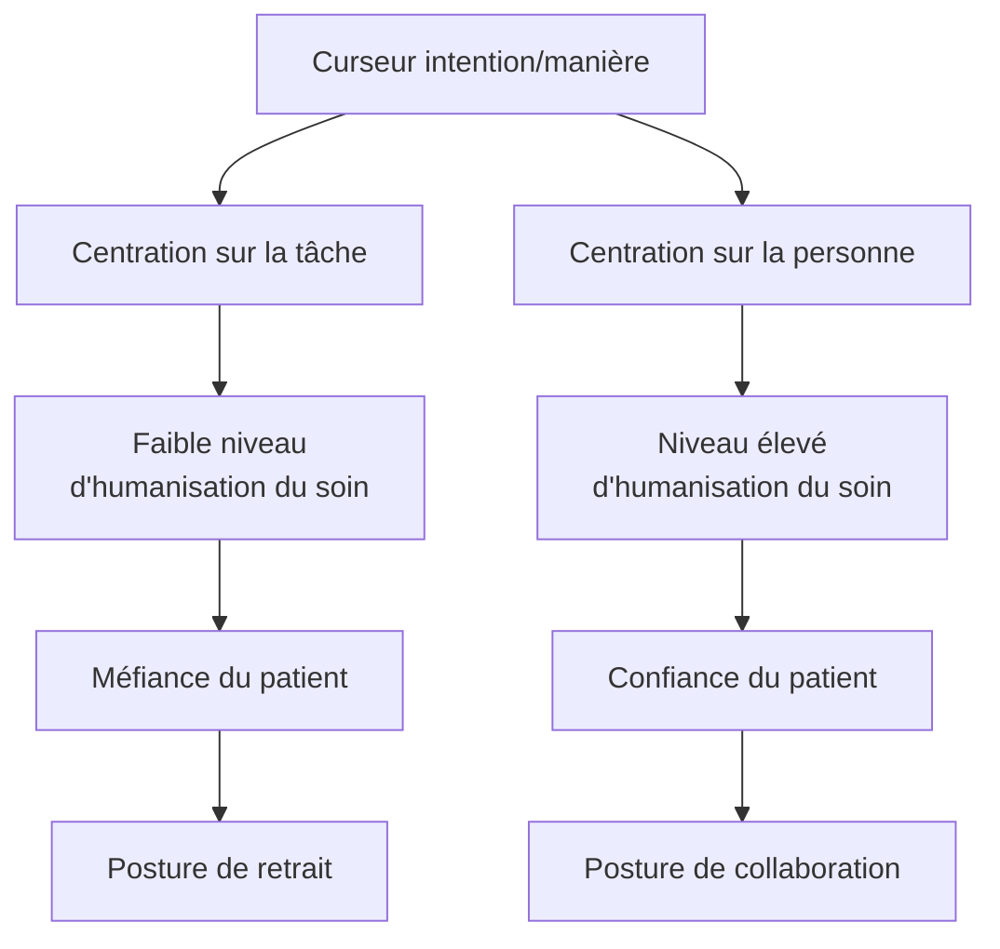

## Document page 1

Page 95
« Je ne m'étais jamais attendu à ce que la médecine soit un tel monde dépourvu de lois et
incertain. Je me demandais si la désignation compulsive de parties, de maladies et de
réactions chimiques [...] était un moyen inventé par les médecins pour se défendre contre
une vaste sphère impénétrable de connaissances. La profusion de faits occultait un
problème plus profond et plus significatif : la réconciliation entre la connaissance
(certaine, figée, parfaite, concrète) et la sagesse clinique (incertaine, fluide, imparfaite,
abstraite). »
— Siddhartha Mukherjee, The laws of medicine. Field notes from an uncertain science,
Londres, TED Books-Simon & Schuster, 2015, p. 6

Qu'est-ce qui différencie un soin simple d'un soin compliqué ? Quelles différences y a-t-il
entre un acte (de soin), un soin et une situation de soin ? En quoi des soins ou des situations
de soins peuvent-ils être simples, compliqués ou complexes ? Les situations perçues comme
lourdes par les soignants sont-elles forcément complexes ? Au vu de quoi cette complexité
serait-elle croissante, comme cela est maintes fois proclamé ? Et surtout, de quoi cette
complexité est-elle faite ?

Ces questions sont étroitement en lien avec les besoins en soins des patients, la qualité des
prestations fournies, les calculs de dotation en personnel, les niveaux de qualification requis
et les axes prioritaires des formations de base et continue. Les lignes suivantes proposent des
pistes de réponse en complément des notions explorées dans les chapitres précédents.

Un acte de soins n'est pas un soin
Les infirmières – et les soignants en général – réalisent chaque jour de nombreux actes de
soins, techniques, relationnels, informationnels ou éducationnels. Tant l'intention que la
manière de réaliser ces tâches en...

Page 96
...font de simples actes – globalement à la portée de tout un chacun – ou, au contraire, des
soins à part entière, œuvres d'un véritable professionnel.

Une centration sur l'acte conduit à une organisation du travail à la tâche, alors qu'une
centration sur la personne transforme ces tâches en des soins personnalisés. Dans une
centration sur la tâche, la primauté est donnée à son exécution, à la rapidité de l'acte, à sa
conformité à une norme, à la quantité qui en est réalisée en un temps donné ; en d'autres
termes, à une productivité immédiate liée à des résultats pensés de manière linéaire : un

## Document page 2

problème, un acte, un temps planifié, un résultat prédictible à un coût prédéterminé. Le risque
d'une telle conception réside dans le fait que la personne à qui s'adressent ces actes devienne
un simple objet, notamment pour permettre aux soignants d'atteindre les objectifs de
production qui leur sont assignés. C'est le cas par exemple lorsque des personnes âgées sont
contraintes de porter des protections sans raison, simplement « au cas où ». Dans une telle
approche, humanisme, déontologie et éthique passent à la trappe. Comme le relève Walter
Hesbeen, « une telle compréhension de la pratique et la centration sur la tâche qui la
caractérise et qu'elle induit ne sont pas propices à une relation singulière et conduisent, le
plus souvent, à une frénésie du "faire" ».

Dans une centration sur la personne, le soin est au contraire porteur d'une intention et d'une
attention à considérer cette personne comme un être unique, qui vit des événements singuliers
– avec les émotions et les questionnements qui y sont liés –, et en recherche le sens.
L'intention – souvent implicite – du soignant qui réalise un soin au sens complet du terme est
que celui-ci soit réellement soignant pour la personne. Alors que l'acte est pensé dans sa
dimension locale, le soin repose sur une approche globale.

Intention et attention se manifestent la plupart du temps au travers des qualités d'observation
du soignant, de son écoute, de son authenticité, de son sourire, de sa gravité, de sa capacité de
montrer à la personne soignée qu'elle est un être à part entière. Comme le relève Thierry
Janssen :

« L'essentiel ne s'apprend pas dans les livres, mais dans l'expérience. L'essentiel ne se
trouve pas dans les techniques et les méthodes, il est dans la qualité de la présence et
l'authenticité du contact, dans la clarté de l'intention et l'intensité de l'attention. »

1. Walter Hesbeen, Cadre de santé de proximité. Un métier au cœur du soin, Issy-les
Moulineaux, Elsevier Masson, 2011, p. 63.
2. Thierry Janssen, La maladie a-t-elle un sens?, op. cit., p. 258.

Page 97
Cependant, il est aussi essentiel que techniques et méthodes soient maîtrisées pour éviter
d'être délétères.

Dans la réalité quotidienne, le curseur du soin oscille constamment entre les pôles de la
centration sur la tâche et de la centration sur la personne (figure 5.1). Ces pôles sont
complémentaires : selon sa priorité de l'instant, le patient attend autant une maîtrise technique
qu'une maîtrise relationnelle de la part des soignants, au même titre que la société attend
autant une maîtrise des coûts qu'une approche humaniste des soins.

## Document page 3

Soigner un enfant, un adulte ou une personne âgée, un natif local ou un migrant, un homme
ou une femme, une personne en pleine possession de ses ressources ou atteinte d'un état
confusionnel, en confiance ou en colère envers les soignants implique à chaque fois des zones
d'inconnu et d'incertitudes différentes.

Soigner est à comprendre comme une action – et non un acte – dont le processus peut, selon
la complexité de la situation, impliquer un ensemble de dimensions philosophiques,
cognitives, émotionnelles, sociales, culturelles, existentielles et techniques, tant pour la
personne soignée que pour la personne soignante. Cette action s'inscrit à chaque fois dans un
contexte particulier, qui est à la fois celui du patient et de son entourage, celui du soignant et
celui du système de soins.

Figure 5.1. Centration sur la tâche versus sur la personne.

## Document page 4

Page 98
Soins simples, soins compliqués et soins complexes
Soigner constitue un processus, au sens d'« un ensemble d'activités corrélées ou interactives
qui transforme des éléments d'entrée en éléments de sortie ». Ce processus devrait reposer sur
une démarche infirmière qui implique une collecte de données (les éléments d'entrées)
formelle ou informelle à partir de laquelle des actions sont mises en place, avec à la clé des
résultats réels (les éléments de sortie) semblables ou différents du résultat attendu, avec des
appréciations concordantes ou divergentes de la part de la personne qui a réalisé le soin, de
celle qui l'a reçu et des personnes témoins.

Un soin simple peut ainsi être défini comme un soin qui s'inscrit dans un contexte aisément
maîtrisable et dont le processus – cognitif, émotionnel, social et technique – est composé d'un
nombre limité de paramètres, avec un faible niveau de variabilité et des probabilités élevées
de donner les résultats prévus. Un soin simple ressemble à une recette : « travailler avec le
"connu". Nous connaissons le problème. Nous connaissons la solution ». Dans la routine
quotidienne, les problèmes simples « sont ceux qui peuvent être résolus en suivant les
instructions ».

La désinfection d'une cicatrice, la pose d'un cathéter chez une personne qui a un bon réseau
veineux, l'administration d'un médicament courant chez un patient collaborant ou la
préparation du retour à domicile d'un patient autonome relèvent de soins simples. Le niveau
de standardisation est élevé, la créativité requise pour adapter le soin à la personne est faible.
De tels soins relèvent de professionnels moindrement qualifiés, ou, pour des infirmières
diplômées, du niveau débutant selon le modèle de développement de l'expertise
professionnelle de Patricia Benner.

1. ISO 9000:2005(fr), «Systèmes de management de la qualité - Principes essentiels et
vocabulaire», 3.4. Termes relatifs aux processus et aux produits.
https://www.iso.org/obp/ui/fr/#iso:std:iso:9000:ed-3:v1:fr.
2. Cathy MacLean, Maîtres de la complexité: célébrer la zone grise de la pratique familiale,
Canadian Family Physician - Le Médecin de famille canadien, vol. 56, octobre 2010, p.
1082.
3. Claire Lindberg, Sue Nash, Curt Lindberg, On the edge: Nursing in the age of complexity,
New Jersey, Plexus Press Bordentown, 2008, p. 25.
4. Patricia Benner, De novice à expert. L'excellence en soins infirmiers, Paris, Masson,
2003.

## Document page 5

Page 99
Un soin compliqué est un soin dont certaines dimensions présentent des difficultés, qui, si
elles sont maîtrisées – notamment par des connaissances et des stratégies particulières –, ne
sauraient empêcher la réussite du soin :

Les problèmes compliqués sont constitués de sous-ensembles de problèmes simples. Ils
sont compliqués parce qu'ils ne peuvent pas être décomposés ou réduits aux problèmes
simples qu'ils contiennent. Les problèmes compliqués requièrent une expertise spécialisée
pour être résolus, mais ils peuvent l'être par des experts qui ont un haut niveau de
connaissances et d'expériences et qui s'appuient sur, ou appliquent des formules
préexistantes. Une autre caractéristique des problèmes compliqués relève du fait que,
lorsque le problème est pris en main par de tels experts, les résultats peuvent être prédits
avec un haut degré de certitude.

L'évaluation d'une plaie minée et infectée, une prise de sang chez un malade au réseau
veineux défaillant, l'organisation du retour à domicile d'un patient fragile, certains protocoles
requérant la succession de nombreuses étapes dans des délais précis relèvent généralement du
compliqué, nécessitant le recours à des infirmières expérimentées, disposant de plusieurs
années de pratique réflexive, qui maîtrisent des techniques ou des approches relativement peu
courantes, sans être exceptionnelles, et qui sont capables de faire preuve d'un certain niveau
de créativité.

Un soin complexe est caractérisé, en référence aux travaux de Peter Craig et al., par :

●le nombre d'éléments en interaction ;
●le nombre et la difficulté des comportements requis de la part de ceux qui délivrent et de
ceux qui reçoivent l'intervention ;
●le nombre de groupes ou de niveaux organisationnels qui sont touchés par l'intervention ;
●le nombre et la variété des résultats ;
●le degré permis de flexibilité ou d'adaptation de l'intervention.

Cependant, moins que le nombre d'éléments ou de groupes en interactions ou touchés par
l'intervention, c'est souvent l'importance des...

1. Claire Lindberg, Sue Nash, Curt Lindberg, On the edge, op. cit., p. 26.
2. Peter Craig et al., « Developing and evaluating complex interventions: the new Medical
Research Council guidance », BMJ, n° 337, 2008, a1655.

## Document page 6

Page 100
...écarts ou des divergences entre les différents éléments et groupes impliqués qui va
déterminer si les soins seront complexes ou non. Lorsque ces éléments et groupes :

●reposent sur des valeurs, des buts et des priorités et des moyens partagés, ils favorisent des
synergies qui facilitent et simplifient les soins ;
●reposent sur des valeurs, des buts, des priorités et des moyens divergents voire
antagonistes, ils tendent à faire émerger à tout moment des obstacles, des bifurcations, des
conflits et des blocages qui complexifient les soins.

En conséquence, peut être considéré comme complexe un soin dont le processus doit prendre
en compte :

●un ou des paramètres dont les causes ou les fondements ne peuvent pas être clairement
identifiés (des récursivités, des symptômes inhabituels, une croyance limitante et
inamovible, des attitudes paradoxales, etc.) ou sur lesquels il est impossible d'agir ;
●des interactions et/ou des répercussions systémiques non linéaires, divergentes voire
antagonistes (l'impact d'une dénutrition, par exemple) ;
●des résultats réels ou potentiels imprévus ou imprévisibles, non maîtrisables (effets
secondaires, collatéraux) ;
●des éléments liés au contexte et à l'environnement tant de la personne soignée que de son
entourage, de ceux qui la soignent et du système de soins, qui tendent par leurs spécificités,
leurs priorités et leurs contraintes à s'opposer au soin requis.

Accompagner dans son cheminement un patient qui refuse un soin indispensable mais
contraire à ses croyances, déterminer l'origine de l'agitation d'un malade qui présente des
troubles cognitifs, faire face à l'incompréhension d'une famille guidée par des références
culturelles différentes ou aider un patient en surpoids à modifier ses comportements
alimentaires peut relever rapidement de soins complexes. De même, les interventions liées à
certaines situations instables, que ce soit sur un plan médical (instabilité hémodynamique,
respiratoire, etc.), psychologique ou psychiatrique (état de crise), social (conflits familiaux),
ou spirituel (détresse spirituelle) – voire les quatre simultanément –, relèvent de soins
complexes.

L'accueil d'une personne qui reçoit pour la première fois une chimiothérapie anticancéreuse et
qui ressent un niveau élevé d'anxiété...

## Document page 7

Page 101
...liée à ses représentations de sa maladie, de son traitement et de ses effets secondaires, aux
réactions de son conjoint, de ses enfants et de ses parents, et aux incidences sur son emploi,
sur ses revenus et son apparence physique, relève d'un soin complexe. Lever, laver et habiller
avec respect et dignité un patient atteint d'une maladie d'Alzheimer qui réagit avec agressivité
dès qu'on s'approche relève bien souvent de soins complexes.

De tels soins requièrent un niveau élevé de compétence professionnelle de la part des
soignants, qui doivent savoir intervenir avec doigté, maîtriser leurs propres émotions et
réactions, construire des ponts entre des faits apparemment sans liens et les inscrire dans une
histoire de vie dont une grande partie leur est inconnue. Leurs connaissances et surtout leurs
expériences leur permettent généralement de compléter l'information qui manque, puis de la
valider ou de la tester auprès de la personne soignée et de ses proches.

Un tel degré d'intervention relève dans le modèle de Patricia Benner du niveau expert, requis
lorsque, au-delà du soin lui-même, c'est la situation de soin qui s'avère complexe.

Du soin à des situations de soins simples, compliquées ou
complexes
Au-delà du fait de savoir si un soin est simple, compliqué ou complexe en lui-même, la
plupart du temps, c'est la prise en compte du contexte dans lequel il est réalisé qui détermine
son niveau de complexité. Comme vu précédemment, une toilette chez une personne
présentant une démence peut être un soin complexe, alors qu'elle relèvera d'un soin simple
chez une personne collaborante. De même, accueillir un patient serein qui vient pour une
intervention bénigne qu'il a bien comprise relève d'un soin simple, alors qu'accueillir un autre
patient pour la même intervention, à laquelle il n'adhère pas mais qui y est poussé par sa
famille, peut devenir compliqué.

Les soins infirmiers s'adressent toujours à des personnes singulières, situées dans des
environnements et des contextes spécifiques. Les infirmières s'intéressent dès lors plus à des
situations de soins – plus ou moins simples, plus ou moins complexes – qu'aux soins eux-
mêmes, ces derniers ne représentant que des moyens d'intervention.

1. Patricia Benner, De novice à expert.

## Document page 8

Page 102
Une situation de soins correspond à la situation d'une personne précise à un moment
spécifique de son histoire en lien avec un problème de santé particulier, dans un contexte
socio-économique, spirituel, organisationnel et environnemental particulier. Elle ne peut
jamais être entièrement déduite d'une connaissance générale.

Une infirmière peut ainsi se retrouver face à des patients qui présentent :

●des situations de soins simples, dont l'environnement, les causes, processus et résultats
sont connus, maîtrisés, avec un faible niveau d'incertitudes. Les procédures qui en
découlent sont largement standardisées et d'un apprentissage relativement aisé. Les soins
qui y sont liés sont simples, au pire difficiles sur un plan technique, avec des résultats
reproductibles. Dans certains établissements de soins chroniques par exemple, les résidents
sont bien connus et leurs soins relèvent d'une routine qui se renouvelle jour après jour. En
soins aigus, un patient de 70 ans, autonome et en bon état général, hospitalisé pour une
pneumonie, peut vivre cette expérience comme un simple incident de parcours. De même,
une personne qui vient pour l'opération d'une hernie discale suit un itinéraire clinique
préétabli, commun aux différents patients qui vivent cette intervention, avec un protocole
et des soins préplanifiés qui permettent d'anticiper la durée du séjour et son coût ;
●des situations de soins compliquées, dont les processus – et parfois les résultats – sortent
de l'ordinaire standardisé, par au moins une ou plusieurs dimensions, tout en restant
globalement sous contrôle : « nous commençons avec l'inconnu et, avec notre savoir et nos
habiletés en médecine, nous allons de l'inconnu au connu », puis « nous choisissons une
intervention qui entraînera probablement la guérison ou le contrôle ». Un patient de 80 ans
présentant un état général amoindri, fatigué, avec peu d'appétit, de langue étrangère et
souffrant de troubles auditifs vivra plus difficilement la même pneumonie que décrite au
paragraphe précédent. Il nécessitera plus de soutien et de temps pour ses soins. Il sera
initialement dépendant de son oxygène et aura besoin de plus d'aide pour lutter contre la
surinfection. Sa surdité partielle rendra plus difficiles les échanges avec les soignants, au
risque qu'il n'entende pas certaines informations et donne des ré-...

1. Et en soins infirmiers, dans le contexte de ce livre.
2. Cathy MacLean, « Maîtres de la complexité : célébrer la zone grise de la pratique
familiale », art. cité, p. 1082.

Page 103

## Document page 9

...ponses erronées à des questions mal comprises. Cependant, la plupart de ces difficultés
peuvent être surmontées. Ses problèmes auditifs peuvent probablement être partiellement
résolus avec un appareillage adapté et une attention accrue des soignants. De même,
l'obstacle de la langue peut être contourné grâce à un interprète. Le tout entraînera parfois des
tensions avec certains soignants moins patients et prolongera sa durée de séjour sans que cela
ne doive empêcher sa guérison et son retour à domicile ;

●des situations de soins complexes dont les causes et processus – biologiques, cognitifs,
émotionnels, sociaux, etc. – sont entremêlés d'une manière qui en empêche une
identification et une compréhension précises (encadré 5.1), voire dont les causes et
conséquences s'entremêlent de manière récursive (encadré 5.2). Les interactions et les
rétroactions entre les différents facteurs présents sont généralement non linéaires, avec en
conséquence un niveau élevé d'instabilité et de non-maîtrise lié à l'émergence de
phénomènes auxquels personne ne s'attendait. Il s'agit souvent de patients qui présentent
simultanément « de multiples problèmes chroniques, des problèmes de santé mentale et de
médication ainsi qu'une vulnérabilité sociale », auxquels s'ajoutent parfois des résistances
face aux soins et aux traitements, sans parler des interventions de membres de la famille en
désaccord avec les soignants.

Encadré 5.1. Complexité ? L'exemple de l'obésité
Dans une logique réductionniste, de cause à effet, le problème de l'obésité est simple à
résoudre : il suffit d'absorber moins de calories et d'en dépenser plus. Dans la vraie vie, le
problème est beaucoup plus complexe ; ne serait-ce que parce que bien des personnes en
surpoids ne se perçoivent pas comme telles. Les causes de l'obésité sont par ailleurs bien
plus difficiles à cerner qu'une simple question d'apports et de dépenses d'énergie. Sont
entre autres évoqués : l'abondance de l'offre, l'environnement urbain, des modifications de
la flore intestinale, les inégalités vis-à-vis des rythmes circadiens et de l'activité physique,
la perte du goût des matières grasses ou le rôle complexe d'un ensemble d'hormones qui
agissent tant sur les sentiments de faim et de satiété que sur la masse grasse et l'emploi des
nutriments.

1. Pierre Pluye et al., « Les Patients ayant des besoins complexes en matière de soins »,
Réseau-1 Québec, 2018, RRAPPL Université McGill.

Page 104
Encadré 5.2. Récursivité, systémique et soins
Le principe récursif invite à sortir d'une logique de causes-effets, lorsque ces derniers ne
peuvent être clairement identifiés, comme le montre les questionnements ci-dessous :
●Est-ce que le patient prend du poids car il est déprimé ou est-ce qu'il est déprimé parce
qu'il prend du poids ?

## Document page 10

●Est-ce que le patient perd sa force musculaire parce qu'il ne marche plus assez ou est-ce
qu'il ne marche plus assez parce qu'il a perdu sa force musculaire ?
●Est-ce que le patient est dépressif parce qu'il se sent seul, ou est-ce qu'il est seul car son
état dépressif l'isole ?
●Est-ce que le patient est peu autonome car son épouse fait tout pour lui, ou est-ce qu'elle
fait tout pour lui car il n'est plus autonome ?
De telles questions ont rarement des réponses simples et chaque personne impliquée y va
de sa propre explication.
1. Cf. supra, p. 37-38.

Dans de telles situations « la prise de décision clinique et les processus liés aux soins ne
peuvent être, ni de routine, ni standards », ce qui entraîne souvent des projets de soins
différents selon les acteurs, voire inconciliables. C'est le monde de l'impossible à savoir et
prévoir, qui ne peut que se découvrir et se réinventer dans des configurations de faits et de
causalités à la fois uniques et multiples. Aucun livre, aucune théorie ne peut dire comment
faire juste. Tout au plus peut-on envisager des probabilités. La part d'improvisation,
d'apprentissage, de correctifs, de chance et de hasards l'emporte largement sur les pronostics
de la théorie, conduisant tant à des échecs imprévus qu'à des réussites incompréhensibles.

Il en découle que les situations complexes :

●affichent des propriétés de singularité et doivent ainsi être approchées et comprises de
manière individuelle.
●Elles présentent un haut degré d'incertitude inhérent aux problèmes et situations
complexes, et les résultats ne sont pas prédictibles. Les solutions ne peuvent pas être
assurées grâce à l'application de formules connues.

1. Haute autorité de santé, « Comment organiser les fonctions d'appui aux professionnels de
soins primaires ? », Note méthodologique et de synthèse documentaire, 2014.
2. Claire Lindberg, Sue Nash, Curt Lindberg, On the edge, op. cit., p. 27.

Page 105
Le monde de la complexité des soins « n'est pas le monde du corps-machine, mais plutôt un
monde qui considère le corps [et le psychisme] du patient comme un système complexe, la
vie complexe du patient dans un environnement complexe et le contexte comme étant
essentiel aux soins ». C'est un monde qui exige des infirmières qui exercent à ce niveau
d'expertise des connaissances et des compétences particulières issues d'une co-construction
continue entre des connaissances théoriques et expérientielles diversifiées et pointues, et leur

## Document page 11

impose l'exercice d'une pratique réflexive, critique et créatrice de haut niveau. Cela leur
permet, dans un cadre déontologique et éthique strict, de s'affranchir des règles, des
protocoles et des routines pour construire des interventions de soins inédites.

Situations de soins complexes : entre stabilité et instabilité
Les frontières entre le simple, le compliqué et le complexe sont mouvantes et peuvent à tout
moment faire basculer une situation d'un côté ou de l'autre. Dans les théories du chaos, un des
courants d'étude de la complexité, il est postulé que des modifications minimes des
conditions initiales peuvent avoir de très grands effets : c'est le célèbre effet papillon, de la
métaphore du météorologue Edward Lorenz. Il en va de même dans le monde des soins : une
embolie pulmonaire peut rendre une situation bien maîtrisée hautement instable, comme
quelques bactéries peuvent déclencher un choc septique ; à l'opposé, un antibiotique ou une
dose d'insuline peuvent rétablir une situation critique. Il en va de même sur un plan
relationnel. Dans De la parole comme d'une molécule, Boris Cyrulnik insiste sur le poids des
mots, qui peuvent sauver ou condamner. Nombre de patients se ferment comme une huître
sur un mot déplacé d'un soignant ou, au contraire, s'ouvrent à la confidence parce que le ton...

1. Cathy MacLean, « Maîtres de la complexité : célébrer la zone grise de la pratique
familiale », art. cité, p. 1082.
2. Cf. supra, note 1, p. 59.
3. Peuvent : le lien cause-effet n'est pas automatique. La conséquence n'est donc pas
obligatoire et ne peut pas être prédite avec certitude pour chaque cas particulier. Il ne s'agit
que de probabilités.
4. Pour rappel, cette métaphore postule qu'un battement d'ailes de papillon pourrait, par
effet d'amplification, générer un ouragan à des milliers de kilomètres de distance.
5. Boris Cyrulnik, De la parole comme d'une molécule, op.cit.

Page 106
...de voix y invite. De même, un recadrage de croyance peut transformer le comportement
oppositionnel d'un malade en une collaboration fructueuse.

Certaines situations sont cependant couramment perçues comme complexes par les soignants
qui y sont confrontés. C'est le cas par exemple lorsque la situation est tellement dégradée que
le seul objectif « consiste à limiter les dégâts, à intervenir non pas sur les problèmes eux-
mêmes, mais sur le maintien d'un équilibre instable ». La plupart des situations marquées par
la fragilité irréversible des équilibres biologiques et psychologiques et par la vulnérabilité des
personnes et/ou de leurs entourages relèvent de telles approches. On les retrouve tant dans
des unités de soins intensifs (avec une priorité sur l'instabilité biologique) que dans des
services courants d'hospitalisation, en soins à domicile ou en gériatrie face à des personnes
dont les ressources ne permettent que des équilibres précaires, au bord de la rupture, ou qu'en

## Document page 12

psychiatrie face à des patients en instabilité psychologique et comportementale pouvant
facilement basculer en présence de faibles stimuli que rien n'aurait pu a priori faire penser
comme inadéquats.

Familles en conflit, patients ambivalents quant à leurs projets de soins, personnes âgées qui
mangent et boivent de manière insuffisante en ne voyant pas le sens d'augmenter leurs
apports, parents avec des représentations alimentaires et morphologiques inadéquates qui
suralimentent leurs enfants, proches dont on suspecte que les avis concernant un parent
pourraient être conditionnés par des questions d'héritage, comportements de maltraitance
familiale suspectés... : les exemples de situations de soins complexes sont multiples. Sans
causes simples, celles-ci nécessitent beaucoup de vigilance de la part des soignants. Ce sont
parfois un mot lâché par le patient ou son entourage, une mimique non congruente ou une
intonation de voix anormale qui servent de révélateurs des problèmes sous-jacents. Ces
micro-indicateurs sont à prendre avec prudence. Comme le rappelle la philosophe Isabelle
Stengers : « Nous ne savons pas a priori ce qui peut compter, ce qui peut importer, et
comment, dès que nous avons affaire à des systèmes "complexes" », tel l'être humain.

1. En programmation neuro-linguistique, un recadrage est une intervention qui vise à
modifier l'interprétation qu'une personne fait d'un événement ou d'une série d'événements en
lui proposant un sens nouveau à porter sur les événements eux-mêmes ou sur leur contexte.
Son cadre d'analyse en est ainsi transformé.
2. Geneviève Pasche, « Situations "lourdes" : relations conflictuelles dans les services d'aide
et de soins à domicile », art. cité, p. 141.

Page 107
Ainsi :

« Lorsque nous construisons le modèle d'une situation, nous risquons de négliger ce qui
semblait négligeable, mais qui, dans d'autres conditions, va jouer un rôle crucial. Tout
modèle est une simplification, mais nous avons affaire à des systèmes où une
simplification qui semblait légitime peut nous mener à nous tromper complètement. »

Intervenir dans de tels contextes implique beaucoup de prudence. Certaines situations
complexes sont paradoxalement très stables en apparence, certaines des causes sous-jacentes
étant présentes depuis des années. Tenter d'y toucher au nom de notre conception de ce qui
serait bien pour le patient ou ses proches pourrait alors présenter des risques de
déstabilisation aux résultats non contrôlables et peut-être encore plus désastreux que la
situation existante.

## Document page 13

Patients dits « lourds » et situations de soins complexes
Il est courant entre soignants de parler de « patients lourds » ou de « situations lourdes ». Ce
qualificatif n'est cependant que partiellement synonyme de complexe. Dans une étude auprès
des services d'aide et de soins à domicile, la sociologue Geneviève Pasche explique cette
lourdeur principalement par trois types d'arguments, qui peuvent être étendus à d'autres
contextes de soins :

●l'usure physique des soignants, marquée par « une pénibilité qui s'inscrit dans leurs corps
et exige d'eux résistance à l'effort et endurance, ce qui les éprouve, les fatigue, voire les
épuise ». Cette usure est fonction du niveau de dépendance du patient et s'accompagne d'un
sentiment de lourdeur lorsque « le patient a un poids supérieur à celui du professionnel qui
s'occupe de lui », ajoutant à la contrainte physique l'appréhension que le poids du patient
ne l'entraîne dans une chute, avec les risques de blessures et les questions de
responsabilités qui en résulteraient ;

1. Isabelle Stengers, « Charmes et risques de la fin des certitudes », in collectif, Lexiques de
l'incertain, Marseille, Parenthèses, 2008, p. 266-267.
2. Geneviève Pasche, « Situations "lourdes" : relations conflictuelles dans les services d'aide
et de soins à domicile », art. cité, p. 139.
3. Ibid., p. 140.

Page 108
●la gestion de l'incertitude et des risques liés à l'état de santé du patient, lorsque «
l'intrication des problèmes de santé physique et psychique rend la situation instable et
qu'une modification même minime peut remettre en cause le maintien à domicile du patient
». De telles intrications questionnent les choix faits, les soins donnés, leur efficacité et
leurs effets collatéraux. Les occasions d'incompréhension et de conflits sont nombreuses.
Le soin et le non-soin deviennent des sources de danger pour le patient et d'insécurité pour
les soignants, pouvant amener à différer les décisions en escomptant que les incertitudes se
résolvent d'elles-mêmes ;
●les difficultés de régulation des interactions entre les patients, les proches aidants et les
professionnels, qui apparaissent lors de divergences, notamment sur les conceptions de
soins de chacun ou si le patient ne coopère pas suffisamment, aux yeux des soignants.
Lorsque le patient devient « difficile », « exigeant », qu'il conteste les choix des
professionnels, refuse de respecter les consignes, tend à imposer son point de vue, les
régulations et les négociations avec les soignants deviennent permanentes, lourdes de
tensions qui risquent à tout moment de s'exacerber. Le patient peut alors être jugé comme
manipulateur, surtout s'il donne des versions des événements qui varient en fonction de
l'interlocuteur ou qu'il demande aux professionnels une participation qui va à l'encontre des
règles institutionnelles ou professionnelles. Le « manipulateur » peut également monter ses

## Document page 14

interlocuteurs les uns contre les autres en relevant les mérites des uns au détriment des
autres.

Relevons qu'à l'usure physique identifiée par Geneviève Pasche peut s'ajouter une usure
psychologique liée à la densité et à la continuité plus ou moins ininterrompue des soins,
comme on peut l'observer chez certains patients.

Si la seule lourdeur physique des soins ne saurait être considérée comme synonyme de
complexité – des techniques adaptées et du matériel adéquat devraient permettre en grande
partie d'y faire face –, l'intrication des problèmes de santé avec les incertitudes et les risques
qui en découlent, ainsi que l'usure psychologique et les difficultés de régulation...

1. Ibid., p. 141.
2. Ce qui est rarement le cas...
3. Geneviève Pasche, « Situations "lourdes" : relations conflictuelles dans les services d'aide
et de soins à domicile », art. cité, p. 143.

Page 109
...avec les conflits qui en résultent font intrinsèquement partie des facteurs qui rendent des
situations de soins et des soins complexes.

Le soin infirmier : une pratique située au cœur de processus
complexes
Selon Étienne Minvielle, en milieu hospitalier, plusieurs facteurs amènent à considérer
comme complexes les processus liés aux soins aux patients :

●ils sont caractérisés, au contraire des processus de production industrielle, par la diversité
tant des pathologies qui peuvent se rencontrer dans une unité de soins que des patients (et
des soignants). Les processus d'investigation, de surveillance et de traitement varient ainsi
d'un patient à l'autre, en fonction notamment de l'histoire de leur maladie, des comorbidités
présentes et de leurs réactions au traitement ;
●ils connaissent une grande variabilité dans le temps, en fonction des comportements du
patient, de sa réaction à l'hospitalisation et aux traitements, des événements qui surviennent
dans l'environnement dans lequel il est soigné (entrée imprévue d'un patient, complications
majeures d'un autre, etc.) et des aléas de l'organisation, marquée par la rotation des
équipes, les absences, la variabilité des compétences présentes, etc. ;

## Document page 15

●ils sont tributaires de la tendance constante à réduire les durées de séjour, avec
l'intensification des traitements et des soins qui en découle, qui induit une rotation plus
importante des patients.

L'interpénétration des soins contribue également à leur complexité. La plupart des soins sont
en effet à la fois dépendants et contributifs d'autres soins : la toilette favorise ainsi une
observation de ce que le patient peut faire par lui-même, permet un contrôle de son état
cutané, devient l'occasion d'un temps rééducatif pour stimuler son autonomie, crée un support
pour parler de ses projets. L'organisation des soins augmente souvent cette complexité du fait
de la compétition entre certains processus sous-jacents, en fonction des priorités du moment,
de la compétence et de la disponibilité des acteurs, ...

1. Étienne Minvielle, « Gérer et comprendre l'organisation des soins infirmiers », in
Geneviève Cresson, François-Xavier Schweyer (dir.), Professions et institutions de santé
face à l'organisation du travail, op. cit., p. 118-119.

Page 110
...des antagonismes entre les missions de soins, de formation et de recherche, de la
disponibilité des installations techniques. Un soin peut ainsi être interrompu pour permettre à
un consultant de rencontrer le patient ou pour profiter d'une place qui vient de se libérer au
scanner, à moins que le pansement qui vient d'être refait ne soit défait pour permettre au
médecin de parfaire sa formation et de se rassurer vis-à-vis des questions que pourrait lui
poser sa hiérarchie. Chaque instant de l'organisation des soins est ainsi en partie instable et
irréductible à un processus figé. La réalité est souvent en opposition avec les protocoles
auxquels les soignants devraient se conformer, qui ne prennent que peu en compte les
contraintes auxquelles les soignants sont tenus de répondre. Il en résulte que « le déroulement
de la prise en charge peut tourner de façon chaotique, mais sans conséquences graves, cela
aux prix d'une dépense d'énergie et de gaspillages considérables ».

Complexité latente, exprimée, ignorée, supputée
Bien que tout soin s'inscrive dans une approche qui considère l'être humain comme un
système complexe inséré dans un environnement complexe, il serait erroné d'en conclure que
toutes les situations de soins sont complexes, même si cette généralisation, abusive, est
courante. Dans la réalité quotidienne, la plupart des facteurs potentiels de complexité sont
seulement latents. Souvent, le patient ne ressent pas la nécessité de les exprimer, les soins
reçus correspondant à ses besoins immédiats. De plus, le contexte des soins et les rapports de
pouvoir qui s'y manifestent tendent à réprimer l'expression de ce qui sort de la normalité des
soignants et à empêcher patients et proches d'exprimer leur individualité, par crainte d'être
jugés, parce qu'ils perçoivent que les équipes n'auront pas le temps de s'en occuper ou parce
qu'ils ne savent pas que cela relève des compétences des professionnels présents.

## Document page 16

Certains facteurs de complexité ne se manifestent dès lors que lorsque l'écart entre les
attentes du patient et de ses proches et les soins reçus diffère trop et libère une énergie
suffisante pour leur expression. Il s'agit ainsi de différencier :

1. Ibid., p. 120. Ces points seront développés au chapitre 6 consacré à la complexification
iatrogène des soins.
2. Le principe de conformité sociale est très présent dans le monde des soins et s'applique
tant aux patients et aux proches qu'aux professionnels.

Page 111
●la complexité potentielle, latente, de toute situation de soins, qui bien souvent ne
s'exprime pas, mais qui pourrait à tout moment se révéler si un stimulus devait la
provoquer ;
●la complexité exprimée, manifeste, de certaines situations de soins, lorsque les
paramètres en jeu sont non linéaires, divergents, antagonistes, conflictuels.

Par ailleurs, bien des situations de soins simples comportent des facteurs de complexité ou
des dimensions complexes, que le patient ne révèle pas, qui s'expriment à bas bruit et/ou qui
passent inaperçus aux yeux des soignants guère entraînés à les identifier, trop peu vigilants,
insuffisamment formés pour en comprendre l'importance ou préoccupés par d'autres priorités.
Il en va ainsi de ce patient qui, durant 6 mois d'hospitalisation pour des complications
cardiovasculaires, sortait régulièrement fumer sans que personne ne l'ait interpellé sur les
liens entre son tabagisme et ses problèmes de santé, n'ait discuté avec lui de son envie ou non
d'arrêter de fumer et ne l'ait informé de l'existence d'une consultation spécialisée à sa
disposition.

Parfois également, la complexité de certaines situations est supputée voire clairement
identifiée, mais les professionnels concernés font le choix de ne pas l'aborder, faute de temps,
par crainte de ne pas avoir les compétences nécessaires pour y faire face ou de ne pas arriver
à maîtriser ce qui pourrait se produire lorsque cette complexité éclatera au grand jour.

Les situations de soins réellement complexes – elles sont peu
fréquentes, excepté en psychiatrie
Une importante recherche a été conduite en 2003 en Belgique, dans des services généraux,
spécialisés, pour personnes âgées, psychiatriques et dans le contexte des soins à domicile. La
complexité globale des compétences requises (tableau 5.1) ainsi que la complexité des

## Document page 17

composantes cognitives, psychomotrices et psychoaffectives de ces compétences y ont été
explorées.
1. M. Gobert, A. Houben, T. Defloor et al., « La Profession infirmière : essai d'évaluation de
la complexité des compétences », in Mémento de l'art infirmier, Kluwer, 2005, p. 39-64. Cf.
aussi Tom Defloor et al., « The clinical nursing competences and their complexity in Belgian
general hospitals », Journal of Advanced Nursing, vol. 56, n° 6, 2006, p. 669-678.
Page 112
Tableau 5.1. Besoins des patients et niveaux de complexité des réponses apportées par
les infirmières

| Score | Complexité globale (extraits) |
| --- | --- |
| 1 | « La réponse à fournir est rapidement trouvée et ne requiert ni connaissance ni interprétation concernant l'interaction entre les différents éléments de la situation [...] » |
| 2 | « La réponse à fournir repose sur les connaissances et l'expérience acquises tant lors de la formation de base et permanente que lors de la pratique professionnelle. Une analyse et une interprétation rapides de la situation sont indispensables et se basent sur les connaissances actuelles [...] » |
| 3 | « La réponse à fournir implique un usage créatif des connaissances et de l'expertise acquise lors de la formation (de base ou continue) et lors de la pratique professionnelle. La solution [...] implique une analyse et une interprétation en profondeur de la problématique. Cela ne suppose toutefois aucune connaissance scientifique nouvelle [...] » |
| 4 | « Les connaissances acquises lors de la formation ou de l'expérience ne sont plus suffisantes. Une analyse en profondeur est requise mobilisant des connaissances nouvelles et une manière créative d'interpréter la problématique, incluant une approche éthique mais aussi de nouvelles connaissances scientifiques complémentaires. La situation exige une nouvelle réponse jamais rencontrée ni en formation, ni lors de l'expérience professionnelle [...] » |

Source: M. Gobert et al., « La Profession infirmière : essai d'évaluation de la complexité des
compétences », art. cité.
Pour les soins courants, les soins spécialisés et les soins à la personne âgée, l'étude montre
que plus de 60 % des compétences atteignaient un score de complexité globale de 2, 15 à 17
% des compétences un score de 1 (essentiellement sur un plan administratif) et seulement 1 à
3 % des situations un score de complexité de 4. Cependant, même pour les situations de
niveau 2, certains aspects spécifiques pouvaient requérir des compétences dont la complexité

## Document page 18

se situait à un niveau 3 ou 4. Pour les soins spécialisés, le savoir était perçu comme une
composante majeure et plus complexe en comparaison des domaines de soins généraux et de
soins aux personnes âgées. Pour les soins à domicile, les compétences les plus complexes
relevaient des soins palliatifs, de l'éducation du patient, de la stimulation à l'autonomie, de
l'évaluation de la gravité des situations, de l'assistance à la famille, etc.

Page 113
La psychiatrie apparaît comme le domaine le plus complexe avec un niveau général de
complexité supérieur à 2 : « les niveaux 3 voire 4 se rencontrent dans toutes les situations
et/ou nécessitent des compétences dont la complexité est très nettement plus élevée que pour
les autres domaines de soins ». Cela explique peut-être pourquoi, dans nombre de services de
soins généraux, les situations de soins sont perçues comme de plus en plus complexes. Les
patients qui présentent des problématiques psychogériatriques y sont de plus en plus présents,
avec les troubles cognitifs et comportementaux que cela comporte.

Quelques évolutions qui contribuent à complexifier la manière de
penser les soins
Plutôt que d'affirmer qu'un soin ou une situation de soin est complexe, il est plus utile de
préciser les facteurs de complexité présents, ainsi que la manière dont ils se manifestent
concrètement. En faire une liste exhaustive (des exemples en sont proposés dans l'encadré
5.3, p. 116) est non seulement impossible, mais de plus risquerait de conduire à des
généralisations abusives, voire à tenter de calquer une telle liste sur certains patients, dans
une logique simplifiante. En plus des facteurs vus précédemment (aux chapitres 3 et 4
notamment), certaines évolutions en cours contribuent au fait que des soins sont plus
complexes aujourd'hui qu'hier :

●le développement continu des connaissances et des cadres de référence avec leur
complémentarité et parfois leur antagonisme dépasse ce qu'il est possible d'apprendre
lorsqu'on est engagé à temps complet dans une activité professionnelle : thérapies
génétiques, deuxième cerveau, microbiote, nanoparticules, remise en question régulière de
l'utilité de certains traitements, maladies rares ou nouvelles, nouvelles classes de
médicaments et nouveaux moyens d'investigation et de traitement, avancées en
immunothérapie, etc. Tous les domaines sont touchés, ce qui met au défi tant les services
spécialisés que ceux plus généraux ;
●le courant de la médecine différenciée a mis en évidence que les femmes ne présentent pas
forcément les mêmes symptômes et ne réagissent pas à certains traitements de la même
manière que les...

## Document page 19

1. Micheline Gobert et al., « La Profession infirmière : essai d'évaluation de la complexité
des compétences », art. cité.

Page 114
...hommes, bien que ces derniers aient longtemps servi de modèle de référence pour la
recherche ;

●la plupart des recherches médicales portent sur des pathologies uniques et excluent les
personnes de plus de 70 ans, alors que ces dernières représentent une part importante de la
patientèle, présentent des polypathologies et sont l'objet de polymédications ;
●les prescriptions de médicaments se font la plupart du temps à partir d'indications
générales, alors qu'il faudrait les moduler en fonction de l'indice de masse corporelle et de
la capacité physiologique d'absorption et d'élimination de chaque personne, capacité qui
évolue avec l'âge ;
●jusqu'à récemment, les êtres humains étaient répartis entre hommes et femmes.
Aujourd'hui, la dimension du « troisième sexe », ou transgenre, émerge de plus en plus, et
ces personnes, au même titre que celles homosexuelles, doivent pouvoir être soignées dans
le respect de leur différence, ce qui reste encore loin d'être le cas partout ;
●grâce aux progrès de la médecine, les pathologies et les situations de soins chroniques sont
devenues courantes dans la plupart des structures de soins, jusque dans les unités de soins
intensifs. Ces situations entraînent régulièrement un épuisement des proches aidants,
générant chez ces derniers souffrance, culpabilisation voire maladies ;
●l'évolution des connaissances médicales génère des espoirs, des déceptions, des doutes, des
exigences et des refus paradoxaux, comme le chante Lynda Lemay à propos de la mort
d'une (de sa ?) maman dans une unité de réanimation, appelant tantôt à la laisser mourir,
tantôt à tout faire pour la maintenir en vie ;
●des pratiques autrefois taboues telles que le prélèvement d'organe à cœur arrêté,
l'euthanasie passive ou active ou le suicide assisté (en fonction de la législation des
différents pays) cohabitent aujourd'hui aux côtés de pratiques centrées sur la guérison ou
l'accompagnement sur le long terme des patients, confrontant les soignants à des dilemmes
moraux et à des soins déstabilisants ;
●la perte de prestige du corps médical, jointe à une méfiance grandissante envers les
entreprises pharmaceutiques et les instances politiques de régulation génère une perte de
confiance envers les professionnels de la santé en général, ainsi qu'envers les examens, les
traitements et les soins qu'ils prescrivent ;

1. Avec parfois des conséquences importantes, notamment lors d'infarctus du myocarde.
2. « Paul-Émile a des fleurs », 1998.

## Document page 20

Page 115
●l'affaiblissement des modes de relation paternalistes favorise l'émergence non seulement de
véritables partenariats, mais également de modèles fondés sur de simples prestations et
relations de services, voire des formes de prise de pouvoir par certains patients ou proches ;
●l'hétérogénéisation culturelle de nos sociétés met en tension des valeurs, des croyances, des
savoirs, des normes sociales, des modèles familiaux, des règles comportementales, au point
de rendre certains soins difficiles, voire impossibles, dans le respect des règles de bonnes
pratiques et des principes éthiques défendus par les professions de la santé ;
●l'éclatement de certaines structures familiales entraîne des situations difficiles autour
desquelles s'affrontent des parents divorcés esseulés ou plus ou moins soutenus par leurs
nouveaux conjoints, des grands-parents qui tentent d'exister auprès de leurs petits-enfants,
des amants et des maîtresses plus ou moins officiels, sans parler des querelles familiales
classiques et de celles qui impliquent des décisions de justice très difficilement vécues par
celles ou ceux qui s'en estiment victimes ;
●sans parler de la paupérisation d'une partie de la population qui empêche cette dernière
d'accéder à certains soins et à certaines mesures de prévention avec les conséquences qui
en découlent. Pour manger cinq fruits ou légumes par jour, il faut en avoir les moyens...

Ces évolutions génèrent une forme d'instabilité permanente dans la connaissance avec le
sentiment d'incertitude qui l'accompagne. Elles imposent aux soignants une actualisation
continue de leurs savoirs pour pouvoir répondre aux questions des patients et des familles,
comprendre les nouveaux examens et traitements mis en place, anticiper sur leurs
complications, assurer les surveillances requises. Ces évolutions nécessitent un état d'esprit
de remise en question constante dans une posture difficile à incarner d'être définitivement «
non fini ». Celle-ci implique d'accepter que ce que nous tenons pour connu, sûr, acquis peut à
tout moment être bousculé par l'émergence de nouvelles connaissances et expériences.

1. Alexander M. Clark, Bailey J. Sousa, « Definitively unfinished: Why the growth mindset is
vital for educators and academic workplaces », Nurse Education Today, n° 69, 2018, p. 26-
29.

Page 116
Encadré 5.3. Exemples de facteurs de complexification des situations de soins
Plus une situation de soins comprend tout ou partie des aspects suivants, plus elle échappe
à la logique formelle et agit-interagit-réagit de manière désordonnée, non linéaire, avec un
risque élevé d'imprévus de toutes sortes (les émergences) et peut être qualifiée de
complexe :

## Document page 21

●un nombre élevé d'éléments dont les actions et interactions sont peu ou mal
identifiables, peu ou mal contrôlables ;
●des équilibres (biologiques, psychologiques, sociaux, mentaux, spirituels, etc.) fragiles
qu'un faible stimulus suffirait à rompre ;
●des difficultés ou une impossibilité à :
●identifier ou à séparer les causes des problèmes de soins présents (non-causalité,
pluricausalité, etc.) ;
●séparer ce qui relève des causes et des conséquences (boucles récursives) ;
●prédire les effets des actions projetées ;
●contrôler les effets (souhaités et non souhaités) des actions posées et les interactions
entre les effets de ces actions.
●des complications ou des réactions, qui émergent de façon imprévisible ;
●des cadres de référence, des connaissances et des compétences divergentes, en
compétition, voire antagonistes ;
●des croyances, des valeurs, des comportements, des raisonnements divergents ;
●des environnements (ou contextes) familiaux ou sociaux, dont les actions et rétroactions
se mêlent à celles des professionnels et de la personne malade de manière conflictuelle,
voire antagoniste ;
●des projets de vie et de soins et des manières de les réaliser qui diffèrent ;
●un environnement (inter)institutionnel et interprofessionnel en désaccord sur le projet
de soin et la manière de le conduire ;
●des conflits entre les routines en place, les besoins des patients/proches, les savoirs
d'expériences des experts et les recommandations de bonnes pratiques ;
●des difficultés de communication qui empêchent de connaître la volonté du patient ou
qui paralysent les prises de décision ;
●des doutes sur la compréhension par le patient et ses proches de la situation ;
●des comportements de méfiance, d'opposition, d'agressivité voire d'hostilité des patients
et des proches envers les soignants ;
●des jugements, des stéréotypes, des préjugés des soignants envers le patient et/ou ses
proches.
Les facteurs de complexité ci-dessus ne rendent cependant la situation complexe que s'ils
s'expriment. Nombre d'entre eux peuvent être inexistants, latents ou ne s'exprimer qu'à bas
bruit. Ainsi, si toute situation de soins peut se révéler potentiellement complexe, toutes ne
le sont pas.

Page 117
Les mises en scène de la maladie et de ses acteurs

## Document page 22

Les situations de soins mobilisent en tout premier lieu deux acteurs : la personne malade et la
maladie dont elle est porteuse. Une relation s'instaure entre elles d'une manière parfois
paradoxale, surtout lors d'une maladie chronique, dans laquelle la personne peut à la fois
souhaiter la disparition de sa maladie et son maintien, espérer guérir tout en se préparant à
mourir, concevoir sa maladie comme localisée en fonction de symptômes particuliers ou
d'interventions médicales spécifiques, alors qu'elle touche tout son organisme. Certains
patients souffrant de claudication intermittente, par exemple, focaliseront leur attention sur
leurs jambes sans se rendre compte que l'artériosclérose touche toutes leurs artères.

D'autres acteurs vont progressivement interférer avec le duo patient-maladie : membres de la
famille, médecins, infirmières, kinésithérapeutes, employeur, collègues, voisins, etc., chacun
développant une relation particulière à la maladie, à la personne malade, à ses symptômes et
aux autres acteurs. Selon les cas, ces acteurs construisent entre eux des alliances qui
simplifient les soins ou, au contraire, développent des rivalités et des conflits qui les
complexifient.

Ces personnes s'immiscent progressivement dans l'histoire du patient et de sa maladie pour
approuver ou désapprouver ses plaintes et comportements, parfois parler et agir à sa place,
anticiper pour lui, le protéger voire le surprotéger. Elles peuvent aussi interférer avec son
processus de choix d'un médecin, la fréquence avec laquelle il le consulte, ce qu'il va lui dire
ou lui taire, comme elles approuveront ou contesteront les examens et le traitement, inciteront
à augmenter ou à diminuer tel ou tel médicament à leurs yeux sous- ou sur-dosé. Ces
interférences peuvent aider, encourager et motiver ou, au contraire, freiner voire empêcher le
malade de retrouver son autonomie. Elles le mettent parfois en porte à faux, générant en lui
des conflits d'honnêteté et de loyauté, tout en ayant à porter et supporter les actions et
réactions de ses proches.

Les relations qui s'instaurent progressivement entre le patient et les autres acteurs répondent à
différentes règles qui codifient la mise en scène de la vie quotidienne, comme l'a montré
Erving Goffman. Ces...

1. Cf. supra, p. 72 et suiv.
2. Erving Goffman, La Mise en scène de la vie quotidienne. 1 : La présentation de soi. 2 : Les
relations en public, Paris, Minuit, 1973.

Page 118
...règles sont généralement en partie pré-existantes, mais vont se modifier en fonction de la
maladie présente, de sa durée, de sa gravité, de son pronostic, de ses symptômes, des
traitements et des soins requis, de son impact sur le patient et son entourage, notamment sur
son caractère et son comportement. La maladie d'un enfant va toucher par ricochet ses

## Document page 23

parents, frères et sœurs, grands-parents, parrain, marraine, camarades d'école, professeurs,
etc. Ses parents, en tout premier, auront à faire face non seulement à leurs questionnements,
incrédulités, doutes et émotions liés à la découverte de la maladie, mais également aux
répercussions de celle-ci sur les autres acteurs impliqués. Chacun ira de ses émotions, de ses
conseils, de ses expériences, de ce qu'il aura lu sur Internet ou entendu à la télévision. Ces
mêmes parents auront à trier dans tout cela en fonction de leurs connaissances, de leurs
croyances, de leur entente ou mésentente, des informations et conseils reçus de leur pédiatre
ou de l'infirmière scolaire... et se retrouveront parfois perdus au milieu de cette complexité
d'avis et de représentations hétérogènes.

L'infirmière qui intervient dans de tels contextes ignore souvent une partie de cette mise en
scène au point parfois de se tromper de cible de soins et de ne pas comprendre les raisons de
l'échec de ses actions.

Docteurmilie raconte ainsi la visite d'un père qui demande avec insistance un antibiotique
pour son enfant, malgré le fait qu'elle lui explique que ce n'est pas utile puisqu'il souffre d'une
angine virale. Finalement, le père passe son téléphone à la doctoresse pour qu'elle appelle sa
femme, qui lui explique qu'elle a trois enfants, qu'elle ne dort pas à cause de la toux de celui
qui est malade, qu'elle est fatiguée et qu'elle compte sur ces antibiotiques pour enfin dormir...

Ces enchevêtrements de besoins, de demandes inavouables camouflées derrière des
demandes socialement acceptables exigent un niveau élevé de compétences de la part des
soignants pour transformer une situation apparemment inextricable en une souffrance que
chacun peut comprendre. Sans oublier que, dans ces mises en scène de la maladie, du
handicap et de la mort, les soignants sont pris eux-mêmes dans une forme de théâtre faite non
seulement du patient et de ses proches, mais aussi de leurs propres témoins – collègues et
cadres notamment.

1. Docteurmilie, Journal de bord d'une jeune médecin généraliste de Seine-Saint-Denis. «
Mais il a mal... », 1er juin 2014, http://www.docteurmilie.fr/wordpress/?p=1424.

Page 119
Complexité des enjeux déontologiques et éthiques : le « bien agir »
ou l'enfer pavé de bonnes intentions
Comment faire face à la complexité des soins lorsque le temps de chaque infirmière est
compté et que tout retard pris à tenter de comprendre le malade dans sa réalité propre
compromet d'autres soins et crée des tensions avec des collègues également surchargées ?
Comment prendre soin, lorsque l'on n'est pas sûr que le patient comprenne bien les questions

## Document page 24

qui lui sont posées, lorsque l'on ne sait pas si ses réponses correspondent à sa pensée, lorsqu'il
devient impossible de savoir si les soins donnés contribuent à sa souffrance ou la soulagent ?
Quels soins donner et quelles décisions prendre lorsqu'on n'est pas sûr que le patient
comprenne les enjeux de ses propres décisions et qu'il se met en danger, par exemple lorsqu'il
est déterminé à retourner à domicile alors qu'il nous paraît trop fragile ?

Comment le soignant peut-il faire face aux sentiments d'incertitude et de non-maîtrise qui
émergent lorsqu'il se demande : « Quelles interventions privilégier quand on sait qu'une
légère modification peut faire tout basculer et qu'il faut intervenir à plusieurs niveaux pour
maintenir l'équilibre ? » ; ou : « Si la situation se dégrade, comment pourrons-nous affirmer
que tout a été fait pour le mieux ? » Comment, dans de telles circonstances, savoir si l'on est
bien- ou maltraitant ?

Un dicton affirme que « l'enfer est pavé de bonnes intentions ». Comment être sûr, dans
certaines situations complexes – dont la lecture est par définition multiple et le devenir
incertain –, que nos bonnes intentions de soignants ne sont pas pour le patient et ses proches
des pavés supplémentaires ? Plus une situation est complexe, plus le risque d'avoir de «
bonnes » intentions aux conséquences néfastes augmente, puisque nous ne contrôlons pas le
résultat des actions posées. Tout au plus nous apprenons des (non-)résultats obtenus. Il
s'avère ainsi difficile dans les situations complexes de savoir où se situe le « bien agir »,
d'autant plus que les critères d'évaluation risquent de varier fortement d'un patient à l'autre,
d'un soignant à l'autre, d'un proche à l'autre.

1. Pour explorer le sens profond de cette expression, cf. Lise Michaux, Prendre soin, care et
caring. Des voies différentes, Paris, Seli Arslan, 2018.
2. Geneviève Pasche, « Situations "lourdes" : relations conflictuelles dans les services d'aide
et de soins à domicile », art. cité, p. 141.

Page 120
L'infirmière peut ainsi se retrouver face à des dilemmes importants entre ce qu'elle a appris,
ce que sa conscience lui recommande, ce que le patient ou les proches souhaitent et ce que
son institution attend d'elle. Ces dilemmes sont accentués par les valeurs proclamées de sa
profession.

Comme le relève Geneviève Pasche :

Quand les régulations sont peu aisées, prendre en compte l'avis des patients est difficile.
Les professionnels sont alors en prise à de vives tensions : ils réalisent qu'ils ont de la
peine à prendre en compte l'avis du patient alors qu'ils tiennent un discours sur

## Document page 25

l'autonomie et la participation aux décisions. Ils sont pris dans une double contrainte :
d'une part, le patient exprime un avis et d'autre part, ils ne parviennent pas toujours à le
prendre en compte. De plus, ils se retrouvent en contradiction avec la liberté individuelle,
valeur centrale de notre société et de leur profession [...].

Face à ces dilemmes, l'infirmière – surtout si elle ne peut pas bénéficier d'une réflexion
d'équipe ou du soutien d'une commission d'éthique clinique – n'a parfois d'autres choix que
d'opter pour une « prise de distance obligée avec l'idéal professionnel », au risque de se
démotiver, de banaliser certaines situations et de contribuer ainsi à une complexification
iatrogène des soins – voir chapitre 6.

Complexité réelle versus sentiment de complexité
Certaines situations peuvent être ressenties comme complexes même si un seul facteur de
difficulté a pu être identifié, comme le montrent les exemples ci-dessous.

●Mme B. refuse toute forme de traitement chirurgical ou médicamenteux, bien que son état
général se dégrade rapidement en lien avec un cancer de l'ovaire. Adepte de thérapies «
alternatives », elle est convaincue que son cancer est lié à un conflit inconscient qu'elle a
eu avec sa fille décédée dans un accident quelques années auparavant et que si elle
identifie ce conflit et le résout, elle guérira spontanément.
●Monsieur C. présente une obstruction urétérale par un calcul rénal. Malgré les explications
fournies et les pressions de sa famille, il refuse catégoriquement l'intervention proposée, la
considérant comme inutile et dangereuse et ses douleurs s'étant apaisées, au risque de
sacrifier son rein fortement mis sous tension.

1. Ibid., p. 147.
2. Ibid., p. 150.

Page 121
●Hospitalisé d'urgence pour une épiglottite, Monsieur D. refuse catégoriquement de prendre
des antibiotiques, convaincu que ces derniers mettraient sa vie en danger.

Dans de telles situations, les soins deviennent rapidement difficiles, mettant les équipes – et
les proches – face à des constats d'impuissance, accompagnée parfois de colère ou de
culpabilité. Les soignants ressentent alors souvent un fort sentiment de complexité qui
perdure au travers du temps, tant ces situations marquent ceux qui y ont été confrontés et
laissent une empreinte dans les services concernés.

## Document page 26

D'autres situations nettement plus simples mettent également parfois certaines équipes en
difficulté, souvent faute d'un bagage professionnel suffisant, amenant les soignants à
exprimer le fait que ces situations sont « complexes ». Au-delà de l'effet de mode de ce
terme, il s'agit la plupart du temps non du constat objectif d'une complexité qui répond aux
caractéristiques scientifiques de ce mot, mais de l'expression d'une impression, d'un sentiment
de complexité. En tant que tel, ce dernier ne peut être que subjectif. Il dépend du champ de
connaissances et d'expériences de la personne, de son besoin de contrôle, de sa manière
d'appréhender le monde et de s'y situer, de sa capacité de vivre des réalités multiples avec les
incertitudes, les doutes et les émotions qui en découlent, de sa relation à la maladie et à la
mort.

Les variables à prendre en compte pour soigner, qui étaient autrefois en quantité relativement
limitée, peuvent donner l'impression d'être devenues innombrables et doivent être multipliées
par le nombre de patients et de proches. Elles confrontent les soignants à leurs valeurs, à leurs
croyances, à leurs savoirs (ou ce qui en tient lieu), à ce qu'ils ont considéré parfois toute leur
vie comme juste ou faux. Une telle confrontation est source d'émotions, de conflits intérieurs,
de déstabilisations, de remises en question personnelles et professionnelles, de
questionnements juridiques, déontologiques et éthiques qui contribuent fortement au
sentiment de complexité.

Ce dernier doit alors être pris pour ce qu'il est – l'expression du vécu du soignant – et non
forcément comme le reflet d'une complexité réelle.

Synthèse
Prendre soin d'une personne malade, handicapée ou mourante implique de dépasser la simple
réalisation d'actes de soins pour intégrer l'être soigné en tant que personne à part entière, avec
ses expériences...

Page 122
...de santé, son histoire, son environnement, ses ressources, ses limites et ses projets.

Cette singularité de chaque personne ne se manifeste souvent que de façon limitée et
n'interfère que peu avec le déroulement des soins. D'autres histoires de vie et d'autres
contextes amènent d'autres situations de soins à être compliquées et parfois complexes. Il
suffit alors de peu de choses pour rendre ces situations instables, confronter les professionnels
à leurs limites et générer un fort sentiment de complexité.
