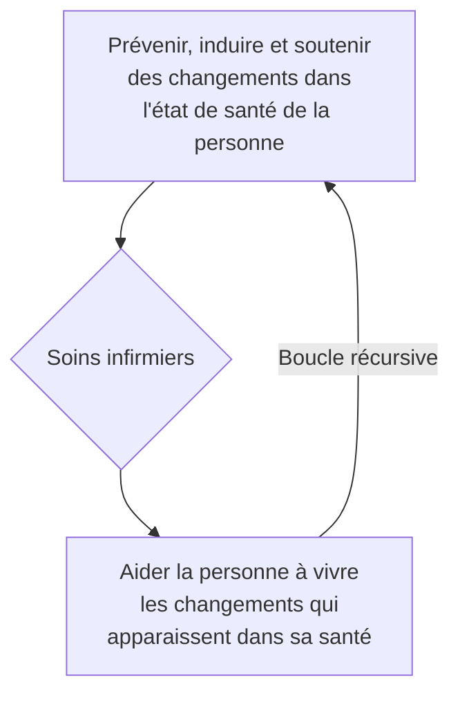
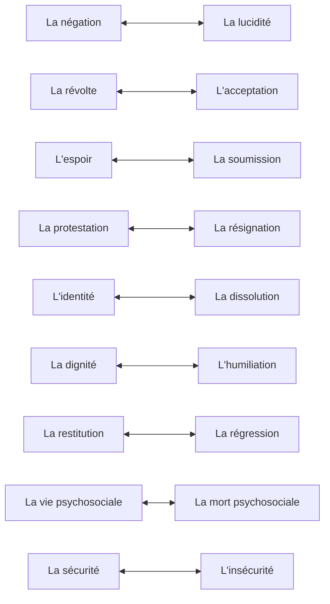

## Document page 1

Page 197 (Page de titre du chapitre)

9 - Les soins infirmiers - changement et non-linearite
« La non-linéarité, c'est d'abord et avant tout la position éthique d'une science nouvelle,
qui consiste à oser chercher de nouvelles explications, de nouveaux modèles, pour
remplacer ceux qui ne peuvent plus nous satisfaire. Avec une humilité nouvelle aussi, c'est
oser affronter la complexité, la non-détermination, le désordre sinon le chaos [...]. »
— Paul Carle, (dir.), Processus non linéaires d'intervention, Sainte-Foy, Presses de
l'Université du Québec, 1998, p. 3

Qu'une situation soit perçue comme simple, compliquée ou complexe dépend en partie du
sens que chacun donne à ces mots à partir de ses connaissances et expériences. Cependant,
souvent, la question de la complexité d'une situation de soins se pose surtout lorsque les
patients, les proches et/ou les professionnels impliqués souhaiteraient induire, soutenir ou
prévenir des changements, alors que leurs ressources en termes de connaissances et de
moyens d'intervention apparaissent insuffisantes pour atteindre le but visé voire, simplement,
pour définir ce but d'une manière qui fasse sens pour chacun.

Si dans les situations de soins simples, définir un projet de soins et le réaliser est relativement
aisé, il n'en va pas de même lors de situations complexes, telles qu'elles ont été définies
précédemment[^1]. Dans de tels cas de figure, par définition non linéaires et instables, dans
lesquels les résultats sont en partie imprédictibles, le soin infirmier ne peut être lui-même que
non linéaire, devant constamment s'adapter aux événements.

[^1]: 1. Cf. supra, p. 101 et suiv.

Page 198

Les situations de soins complexes
Le changement au cœur de la réflexion et de l'action infirmières
Confirmant les propos de Shirley Melat Ziegler, selon lesquels les soins infirmiers ont pour
but d'amener des changements au niveau de la santé des patients[^1], Norma Chick et Afaf
Ibrahim Meleis relèvent que :

Les théories de soins infirmiers, presque par définition, s'adressent au changement sous
une forme ou sous une autre [...] Le focus des réponses de soins infirmiers aux
événements liés à la santé ou à la maladie entraînent généralement des changements et de

## Document page 2

l'instabilité pour la personne concernée, et le but des soins infirmiers en lien avec la santé
dépend généralement de l'initiation de changements dans les interactions entre la personne
et l'environnement[^2].

En fait, tout événement de santé significatif entraîne pour la personne concernée et son
entourage des changements dont l'ampleur et la nature varient d'une personne à l'autre, d'une
histoire de vie à l'autre et d'un contexte à l'autre. Un accident vasculaire cérébral, un infarctus,
une maladie cancéreuse ou un diabète, par exemple, ont la plupart du temps des conséquences
majeures pour la personne. Ces événements entraînent des changements immédiats, à moyen
et à long termes, sur les gestes quotidiens, les habitudes alimentaires, le travail, les loisirs, les
déplacements, le sommeil, le sentiment de sécurité et d'utilité, les capacités relationnelles, le
sens de la vie, etc. Ils impliquent notamment pour la personne des adaptations aux micro-
gestes et automatismes inhérents à la vie quotidienne, des apprentissages de nouvelles
compétences, et entraînent parfois des transformations profondes de la personne elle-même,
de ses comportements, de ses valeurs, de ses humeurs, de sa vie sociale et de son
environnement.

Une des responsabilités clés des infirmières consiste dès lors à prévenir, induire et soutenir
des changements dans l'état de santé des personnes dont elles s'occupent et à aider ces
dernières à vivre les changements et leurs conséquences qui apparaissent ou qu'elles
anticipent dans leur santé (figure 9.1).

[^1]: 1. Cf. supra, p. 169.
[^2]: 2. Norma Chick, Afaf Ibrahim Meleis, Transitions: a nursing concern, op. cit., p. 243-
244.

## Document page 3

Page 199

Figure 9.1. Soins infirmiers et boucle récursive du changement dans l'état de santé des
patients.

Concrètement, la totalité des besoins fondamentaux identifiés par Virginia Henderson
peuvent être touchés par les changements vécus par la personne malade ou accidentée, en tout
cas tant que les mécanismes d'adaptation déployés n'ont pas permis de retrouver un équilibre
suffisant. De même, la plupart des concepts de soins couramment utilisés dans les soins
infirmiers – autonomie, dépendance, deuil, crise, espoir, anxiété, douleur totale, etc. - sont
directement en lien avec des processus de changement ou de non-changement.

Nous pouvons dès lors soutenir que le niveau de complexité des situations de soins dépend en
partie du nombre et du type d'interactions entre les facteurs qui provoquent, soutiennent ou
empêchent des changements au niveau de l'état de santé des patients et chez leurs
proches[^1], ainsi que de leurs conséquences systémiques, tant au niveau du patient que de
ses proches et des environnements concernés.

D'une manière générale, la nature des demandes d'aide du patient, l'adhésion de chacun à un
projet de soins partagé, ainsi que la qualité des relations qui s'établissent entre les personnes

## Document page 4

impliquées jouent un rôle important dans la manière dont ces changements vont être
prévenus, induits ou soutenus.

Concrètement, les interventions infirmières visent généralement à :

●prévenir l'apparition de changements délétères pour la personne, tels que la formation
d'escarres, la survenue de chutes, l'apparition d'états confusionnels chez une personne âgée
lors de son hospitalisation, etc. ;

[^1]: 1. Ces facteurs ont été en partie identifiés dans l'encadré 5.3, p. 116.

Page 200

●prévenir une aggravation de changements en cours, que ce soit au niveau d'une plaie, d'un
état de malnutrition préexistant ou d'une anxiété sévère, par exemple ;
●aider les patients et leurs proches à accepter certains changements liés à la maladie, au
handicap ou à la mort ;
●restaurer un niveau d'autonomie suffisant en dépit des changements survenus, par exemple
en lien avec une perte de forces physiques ou de soutien du réseau social ;
●aider les patients et leurs proches à identifier et mettre en place les moyens dont ils ont
besoin pour réaliser certains changements requis pour la préservation ou le rétablissement
de leur santé ;
●suppléer à ce que le patient ne peut temporairement ou définitivement plus faire, suite à des
changements dans son état de santé ;
●accompagner le patient et ses proches jusqu'à la mort, lorsque celle-ci représente le dernier
changement à vivre.

Les interventions requises pour atteindre les intentions ci-dessus nécessitent un niveau élevé
de compétence pour faire face aux problèmes relationnels, techniques et organisationnels qui
se succèdent, ainsi qu'aux représentations, croyances et valeurs qui contribuent à rendre
complexes les changements vécus et à vivre par le patient et ses proches, et par les soignants
eux-mêmes.

Utiliser un préservatif, c'est à la fois si facile... et si complexe !
Apparemment, décider de recourir aux préservatifs constitue un changement facile. Il existe
même des tutoriels qui montrent comment les utiliser. Mais alors, pourquoi est-ce que tant de

## Document page 5

personnes ont des relations non protégées ? Dans une logique linéaire, simplificatrice,
l'explication la plus plausible est qu'elles ne savent pas que cet objet existe, ne comprennent
pas pourquoi elles devraient l'utiliser ou ne savent pas s'en servir[^1]. Il suffit donc de le leur
expliquer !

La réalité est bien différente et explique sans doute à la fois la progression des maladies
sexuellement transmissibles (MST) et bien des grossesses non désirées. L. East et al. ont
interrogé dix jeunes femmes[^2]

[^1]: 1. La question du coût est ici volontairement exclue.
[^2]: 2. L. East, D. Jackson, L. O'Brien, K. Peters, « Condom negotiation experiences of
sexually active young women », Journal of Advanced Nursing, n° 67(1), 2011, p. 77-85. Une
saturation des données a été atteinte avec la dixième interview.

Page 201

australiennes sexuellement actives sur leurs habitudes d'utilisation d'un préservatif avec leur
partenaire, avant et après avoir contracté une MST. Aucune n'en avait utilisé et n'en utilisait
pour les motifs suivants[^1] :

●les caractéristiques du préservatif masculin font qu'il semblait plus facile à certaines jeunes
femmes que ce soit leur partenaire qui initie son utilisation surtout si elles manquent
d'assertivité ;
●l'inégalité des relations de pouvoir entre homme et femme et les dynamiques de genres
conduisent à des relations de dominance de l'homme envers la femme ;
●la confiance mise par ces femmes dans leur partenaire en termes d'honnêteté, de
monogamie et d'absence de MST ;
●la crainte que leurs demandes apparaissent comme un manque de confiance envers leur
partenaire ou comme une marque de suspicion vis-à-vis d'une réelle absence de MST ;
●la vulnérabilité de certaines jeunes femmes face aux pressions affectives et émotionnelles
exercées par leur partenaire ;
●la crainte que leur partenaire réagisse mal à la proposition de mettre un préservatif ;
●la volonté de ne pas donner d'elles-mêmes l'image de femmes aux mœurs légères ;
●la crainte de perdre un partenaire existant ou potentiel, ou de compromettre la naissance
d'une relation romantique durable.

## Document page 6

Un tel acte « technique » apparaît ainsi profondément situé dans un environnement
interpersonnel affectif et social qui implique une prise de risque élevée à laquelle bien des
personnes ne sont pas prêtes. Les inviter à mieux veiller à la sécurité de leur santé n'a dès lors
pas de sens si ces considérations et ces risques ne sont pris en compte, ce qui se révèle
difficile, au vu des peurs et des espoirs qui sont en jeu.

Cet exemple est représentatif de la complexité de bien des changements dans le domaine de
la santé. Lorsqu'ils sont conduits de manière linéaire, ils débouchent souvent sur des échecs,
car les raisons pour les patients de s'y opposer sont trop puissantes. Seule une approche qui
prend en compte la complexité des facteurs de non-changement et des enjeux qui les sous-
tendent améliore les chances de réussite.

[^1]: 1. Alors que d'autres études montrent que, de leur côté, la majorité des participants
masculins considèrent que c'est la responsabilité de la femme d'initier une négociation sur
l'utilisation d'un préservatif.

Page 202

Distinguer et relier : au-delà du réductionnisme et des approches
holistiques
Edgar Morin relève que :

Le réductionnisme a toujours suscité par opposition un courant « holistique » fondé sur la
prééminence du concept de globalité ou de totalité ; mais toujours, la totalité n'a été qu'un
sac de plastique enveloppant n'importe quoi n'importe comment, et enveloppant trop bien :
plus la totalité devenait pleine, plus elle devenait vide[^1].

Pour lui, « le "holisme" a en fait opéré une réduction au tout ». Se référer à une approche
holistique ou globale s'avère ainsi une manière différente de simplifier la complexité
humaine, le holisme se caractérisant par « sa cécité sur les parties en tant que parties, [...] sa
myopie sur l'organisation en tant qu'organisation, son ignorance de la complexité au sein de
l'unité globale »[^2].

Walter Hesbeen va dans le même sens lorsqu'il soutient qu'« un certain nombre de schémas
classiques de réflexion doivent évoluer et, avec eux, les expressions utilisées telles que, par
exemple, "démarche globale" ou "approche holistique" »[^3]. En effet, quelle cohérence y a-
t-il à prétendre être capable de soigner un être humain complexe dans sa globalité, alors
même que la complexité rend impossible la connaissance du tout ?

## Document page 7

Ce que propose Morin, « au-delà du réductionnisme et du holisme, c'est l'idée d'unité
complexe, qui lie la pensée analytique-réductionniste et la pensée de la globalité, dans une
dialectisation »[^4]. Selon Hesbeen, cela implique, d'une part, « de spécifier les éléments d'un
ensemble et, d'autre part, de les "interrelier" » en gardant « la conscience de leurs interactions
réciproques »[^5].

Lorsqu'un patient pose problème à une équipe, en refusant certains soins ou en manifestant
une certaine hostilité par exemple, le patient lui-même devient un problème pour l'équipe, ce
qui réduit le « problème » (ses comportements, son hostilité) au tout (la personne). Cela
empêche

[^1]: 1. Edgar Morin, Introduction à la pensée complexe, op. cit., p. 72.
[^2]: 2. Edgar Morin, La Méthode, t. 1, op. cit., p. 124.
[^3]: 3. Walter Hesbeen, « Pour une réorientation du soin infirmier », Objectif Soins, n° 28,
décembre 1994.
[^4]: 4. Edgar Morin, Introduction à la pensée complexe, op. cit., p. 72-73.
[^5]: 5. Walter Hesbeen, « Pour une réorientation du soin infirmier », art. cité.

Page 203

une démarche analytique de recherche des causes de son comportement et notamment de
celles dont l'équipe seraient à l'origine. Il en va de même lorsque des soignants « collant »
une étiquette sur un malade le réduisent à sa pathologie (« un diabétique », « un alcoolique »,
« un schizophrène », etc.), fusionnant la personne avec la multitude de ses caractéristiques en
un tout qui ne veut plus rien dire, sauf peut-être à propos des peurs, des préjugés et des
stéréotypes des soignants. Une approche complexe implique alors de séparer la personne de
sa pathologie, de ses croyances, de ses comportements, de ses environnements, de ses
traitements, tout en prenant en compte l'influence sur cette même personne de sa pathologie,
de ses croyances, de ses comportements, de ses environnements, de ses traitements.

Une telle approche du soin implique que l'infirmière soit « capable de changer de multiples
fois sa "paire de lunettes" pour mieux voir, pour mieux comprendre, pour mieux décoder
»[^1] les situations de soins auxquelles elle est confrontée, au-delà des apparences, des
fausses rationalités et de ses propres limites. Le soin devient alors empathique, au sens
complet de ce mot : la capacité de comprendre et de percevoir la réalité du point de vue des
autres (l'empathie cognitive) et la capacité de se connecter aux expériences et sensations
d'autrui (l'empathie affective).

## Document page 8

La chronicité : une dialogie entre changement et non-changement
Toute situation de soin peut connaître des changements rapides, parfois quasi instantanés,
notamment lors de processus aigus, tels qu'un infarctus, une attaque cérébrale, une
hémorragie interne ou une dissection aortique. Dans la plupart de ces situations, des
protocoles de prises en charge et d'orientation vers des unités spécialisées ont été mis en place
de manière à contenir au maximum leurs conséquences. En comparaison, les situations de
soins chroniques peuvent donner l'impression d'être plus faciles à « gérer ». Les changements
y sont souvent lents, moins immédiatement menaçants et peuvent donner par là même
l'impression d'être plus maîtrisables. Comme le montrent les travaux de Corbin et Strauss sur
la trajectoire de la maladie chronique, celle-ci est cependant instable,

[^1]: 1. Ibid.

Page 204

imprédictible et en partie non contrôlable dans son évolution, faite d'une succession de
périodes de stabilités et de crises.

Or, beaucoup d'institutions de soins aigus et de professionnels qui y travaillent sont peu
préparés à accompagner ces patients au fil des jours, des mois et parfois des années. Formés
pour s'occuper de situations aiguës et respecter des durées de séjours prédéterminées, ils
peuvent être rapidement déstabilisés par des situations de soins qui sortent des pratiques
routinières et des protocoles établis. Cela est d'autant plus le cas si les patients concernés
présentent « des besoins spéciaux pour lesquels le personnel soignant n'est pas encore
suffisamment préparé, ni pour les identifier ni pour les traiter », notamment face à « la
complexité sociale et émotionnelle des besoins de certaines personnes atteintes de maladies
chroniques »[^1].

La plupart du temps, cette complexité et les enjeux qui y sont liés apparaissent lorsque les
changements souhaités par le patient, sa famille et/ou les professionnels de la santé
n'apparaissent pas, voire que des changements non souhaités surviennent et compliquent les
traitements et les soins. Certains professionnels alors « réagissent face aux nombreuses
difficultés que pose cette clientèle en prenant leur distance ou en les stigmatisant »[^2], ce qui
conduit au déclin de l'intérêt porté à ces malades, à une prise en charge moins dynamique, à
une attitude de délaissement et à un temps de soins réduit, facteurs qui complexifient encore
la situation. Heureusement, d'autres soignants tentent parfois au contraire de trouver des
approches hors des routines et des protocoles pour soigner au mieux.

## Document page 9

Le caractère non guérissable des maladies chroniques, leur symptomatologie parfois
imprécise et qui met en échec certaines démarches diagnostiques et thérapeutiques, leur
évolution aléatoire, leur dégradation souvent lente et irréversible vécue comme des
changements négatifs et des échecs aux changements positifs souhaités par la personne
malade, son entourage et les professionnels conduisent à des sentiments d'impuissance, de
lassitude, d'échecs, tout en questionnant le sens des soins, et parfois de la vie elle-même.
Autant de facteurs qui induisent souvent un sentiment de complexité.

[^1]: 1. Giselle Davis, Complexité médicale et pratiques soignantes à l'ère de la
biotechnologie. La prise en charge des maladies chroniques complexes en milieu hospitalier
pédiatrique, thèse en sciences humaines appliquées, Université de Montréal, Faculté des arts
et des sciences, 2008.
[^2]: 2. Ibid.

Page 205

Non-linéarité du vécu du changement par les patients
Les travaux d'Ulla Qvarnstrøm, chercheuse norvégienne en soins infirmiers, représentent une
belle démonstration de la complexité et de la non-linéarité du vécu des personnes malades.
En étudiant les processus de deuils, celle-ci a mis en évidence neuf paires de facteurs, qui
oscillent de manière paradoxale entre deux pôles complémentaires et antagonistes (figure 9.2)
[^1].

Les 18 facteurs en présence interagissent également entre eux ; par exemple, les sentiments
de sécurité/insécurité influencent fortement les comportements de négation ou de lucidité,
comme les sentiments de dignité ou d'espoir se répercutent sur les processus d'acceptation ou
de protestation. Cela amène à un niveau d'intrication des facteurs en jeu (figure 9.3)[^2] qui
explique la complexité de tels processus et aide à comprendre le caractère inadéquat
d'expressions souvent peu empathiques, telles que « il vous faut faire votre deuil », trop
fréquemment utilisées par certains soignants. Ces expressions déclenchent régulièrement des
incompréhensions, de la colère et du ressentiment chez les patients et les familles.

Figure 9.2. Pôles antagonistes et complémentaires des processus liés au deuil.

## Document page 10

[Diagramme - Figure 9.2]

## Document page 11

[^1]: 1. Cité in Rosette Poletti, « Le processus de deuil chez le malade cancéreux », Acta
Nursologica, n° 4, 1983, p. 114-124.
[^2]: 2. Les figures 9.2 et 9.3 sont des représentations personnelles.

Page 206

Figure 9.3. Complexité des interactions des processus liés au deuil.

(Ce schéma représente un graphe où chaque facteur psychologique interagit de façon dense
avec l'ensemble des autres facteurs, formant une toile d'interactions complexe)

```mermaid
flowchart TB
    Interactions(("Interactions denses<br/>entre facteurs"))
    Neg["La négation"] <--> Interactions
    Luc["La lucidité"] <--> Interactions
    Rev["La révolte"] <--> Interactions
    Acc["L'acceptation"] <--> Interactions
    Esp["L'espoir"] <--> Interactions
    Soum["La soumission"] <--> Interactions
    Prot["La protestation"] <--> Interactions
    Res["La résignation"] <--> Interactions
    Ident["L'identité"] <--> Interactions
    Diss["La dissolution"] <--> Interactions
    Dign["La dignité"] <--> Interactions
    Hum["L'humiliation"] <--> Interactions
    Rest["La restitution"] <--> Interactions
    Reg["La régression"] <--> Interactions
    Vie["La vie psychosociale"] <--> Interactions
    Mort["La mort psychosociale"] <--> Interactions
    Sec["La sécurité"] <--> Interactions
    Ins["L'insécurité"] <--> Interactions
```

Non-linéarité de certains soins
Bien des soins sont simples et linéaires, avec un niveau élevé de standardisation et un faible
niveau de créativité. Faire un pansement courant, une toilette standard, une injection,
informer sur un examen ne présente la plupart du temps aucune difficulté pour le soignant
expérimenté.

D'autres situations s'avèrent plus complexes et nécessitent une adaptation permanente du soin
supportée par un niveau élevé de réflexivité, de créativité et de réactivité de l'infirmière qui y
est confrontée. Réaliser des interventions adéquates et être soi-même adéquat n'est pas aisé en
présence d'un proche sous l'influence de drogues ou d'alcool, lors de suspicions de violences

## Document page 12

ou de négligences graves envers des membres de la famille[^1], face à des troubles graves de
la communication en lien avec une maladie psychiatrique ou un accident vasculaire cérébral,
ou lorsque des proches refusent le fait que certains soins n'ont plus de sens et que l'être qu'ils
aiment va décéder.

[^1]: 1. C. Rossiter, V. Schmied, L. Kemp, et al., « Responding to families with complex
needs: a national survey of child and family health nurses », J Adv Nurs, n° 73(2), 2017, p.
386-398.

Page 207

D'une manière générale, nous pouvons affirmer que plus une situation est complexe, moins
les changements sont linéaires et plus les interventions de soins infirmiers sont non linéaires.

Dans de telles situations, aucun livre, aucun article, aucun protocole ne dit à l'infirmière
comment intervenir pour que les changements escomptés chez le patient et ses proches se
produisent avec un maximum de probabilités. Aucun formulaire, aucun algorithme ne lui
vient en aide lorsqu'elle est confrontée à la détresse, au désespoir, à l'incompréhension tant du
patient que de ses proches. Chaque mot, chaque larme, chaque silence, chaque intonation
peut changer le cours des choses de manière imprédictible et forcer le soignant à s'adapter et
à adapter ses soins.

Non-linéarité des jeux sociaux autour des situations de soins complexes
Parfois, les différents acteurs impliqués n'arrivent pas à se mettre d'accord sur les
changements visés par les soins et les traitements. Que veut-on : laisser le patient mourir
tranquillement parce qu'il n'y a plus rien à faire ; tenter un ultime traitement dont un tout
récent article vante quelque succès ; reculer la mort de quelques jours en espérant que le
temps ainsi gagné permettra à la famille d'accepter l'inévitable et réduira tant les risques de
deuil compliqué que les conflits sous-jacents ?

De tels questionnements font émerger :

●des projets de vie et de soins difficilement conciliables, car construits sur des
représentations, des valeurs et des croyances différentes, tant sur un plan personnel que
familial, culturel et religieux ;

## Document page 13

●des questionnements éthiques et des positionnements déontologiques différents et parfois
antagonistes liés aux incertitudes et aux impossibilités de prédire de façon fiable l'utilité
des traitements et des soins en cours ou projetés ;
●des conflits intrapersonnels et interpersonnels, intragroupes et intergroupes familiaux et
professionnels, liés à des cultures, des valeurs, des rivalités, des jeux de pouvoirs, mais
aussi des responsabilités, des ambitions, des cadres de référence différents ;
●des émotions, des stéréotypes, des remises en question, des jugements de compétence, de
valeurs, de crédibilité et de légitimité des uns envers les autres ;

Page 208

●des acteurs qui décident peut-être trop vite qu'il n'y a plus rien à faire, d'autres qui
voudraient au contraire « s'acharner » ou qui s'avèrent incapables de se positionner ;
●des patients, des familles et des professionnels qui se figent sur leurs positions, mettant
parfois en jeu des dimensions égotiques ou liées à leur histoire personnelle.

Ces phénomènes sont des révélateurs de la difficulté des changements à l'œuvre lors de
situations de soins complexes. Ils devraient servir de signaux d'alerte car ils mettent en
danger le sens et la cohérence des soins.

Le fait que des professionnels :

●n'arrivent plus à se mettre d'accord sur une ligne de conduite vis-à-vis d'une situation de
soins ;
●voient se mettre en place des clivages intra- et interprofessionnels ;
●sont incapables de répondre de manière coordonnée et aussi univoque que possible aux
questions de la personne malade et de ses proches ;

doit faire suspecter une situation dont la complexité les dépasse.

Le non-savoir, une nouvelle forme de connaissance au service du
changement
Les situations complexes appellent à beaucoup d'humilité. Les principes qui les caractérisent,
notamment d'incomplétude, de non-contrôle et d'imprédictibilité, invitent à accepter qu'une
part de la réalité nous échappe. Une telle posture est difficile pour les soignants convaincus
de savoir ce que le patient devrait faire, devrait changer. Pourtant, faire face à la complexité

## Document page 14

implique d'accepter les limites de ses propres croyances, valeurs et savoirs. Comme le
soutient Patricia L. Munhall, « l'état d'esprit de non-connaissance est une condition
d'ouverture »[^1] à ce qui nous échappe.

Cet état d'esprit permet une véritable écoute de ce qui heurte nos convictions, de ce qui viole
nos rationalités. Il s'agit d'une posture et d'un art qui visent à nous décentrer de nos jugements
et de nos réactions

[^1]: 1. Patricia L. Munhall, « "Unknowing" : toward another pattern of knowing in nursing
», Nursing Outlook, mai-juin 1993, p. 125-128.

Page 209

face à ce que nous ne comprenons pas ou qui nous paraît trop incroyable pour être possible. Il
s'agit d'une condition de base pour assumer notre propre subjectivité.

Être conscients que nous n'écoutons bien souvent que ce que nous souhaitons entendre, qu'il
existe des champs entiers de connaissances dont nous n'avons pas conscience, que certains
phénomènes peuvent exister même s'ils ne correspondent à aucune théorie connue est
essentiel pour aller à la rencontre de l'autre dans toute sa complexité. Et parfois pour
permettre au changement d'émerger là où on l'attend le moins.

De fait, « chaque patient a une perspective unique de son contexte situé et une perspective
unique de qui il est en tant que personne dans le monde »[^1]. Il possède tout à la fois un
ensemble de connaissances sur lui-même et son environnement et un autre ensemble
d'informations dans son inconscient et dans ses gènes, auquel il lui est impossible d'accéder.
Ces non-savoirs, tant ceux du patient et de ses proches que ceux des professionnels de la
santé, sont des obstacles à la communication et aux soins. Ils sont également d'importants
espaces d'écoute, d'ouverture à d'autres réalités parfois étranges, à des intuitions venues d'on
ne sait où. Ils sont générateurs d'étonnements et de résultats parfois autant stupéfiants que
perturbants qui doivent nous maintenir critiques envers certains propos de la « science » et les
croyances qu'ils induisent.

Le non-savoir apparaît ainsi comme une forme de connaissance essentielle à l'émergence de
changements tant au niveau des ressources que des projets et de l'état de santé de certains
malades.

## Document page 15

Les résultats de littérature : ressources et facteurs de complexification
iatrogène
La recherche et les résultats de littérature qui en découlent sont essentiels pour construire des
cadres de référence cohérents et définir les actions les plus pertinentes pour une majorité de
patients dans un contexte donné. Les pratiques fondées sur ces données ont cependant des
limites qui doivent être prises en compte, si l'on veut éviter de complexifier artificiellement
certaines situations de soins et par là même, parfois, d'être maltraitants, en imposant à
certains malades des pratiques qui sont contraires à leurs valeurs, à leurs croyances, à leur
réalité biologique spécifique.

[^1]: 1. Ibid.

Page 210

Comme le soutient Edgar Morin :

La connaissance complexe ne peut être opérationnelle comme la science classique. Mais
l'opérationnalité de la science classique est en fait une opérationnalité de manipulation
[...], le paradigme de simplification ouvre la porte à toutes les manipulations. Je suis
désormais persuadé que toute connaissance simplifiante, donc mutilée, est mutilante [...]
[^1].

Cela paraît d'autant plus évident au niveau des soins lorsqu'on tient compte de la grande
variabilité de la population humaine[^2]. Cette variabilité requiert souvent de sortir des
chemins battus pour bien soigner. Face à la complexité, il n'existe aucun article scientifique,
aucun livre, aucune procédure pour guider à coup sûr les soignants dans leurs actions, ces
dernières étant la plupart du temps, dans de tels contextes, de nature non linéaire, tels les
recadrages, les métaphores ou les analogies[^3] que leur souffle parfois leur intuition. Tant
les paroles prononcées que les résultats obtenus seront souvent attribués au hasard, parce
qu'ils échappent à nos explications rationnelles. Cette attitude conduit à ignorer ce type
d'expériences et leurs effets, « balayés comme des variations aléatoires, attribués à des erreurs
de diagnostics ou imputés à une chance extraordinaire »[^4], ce qui en empêche toute analyse
scientifique sérieuse.

La non-linéarité, la créativité et la prise de risques comme déclencheurs de
changements
Dès lors qu'aucune connaissance standardisée ne peut déterminer ce qu'il faut faire pour
amener des changements dans des situations complexes, seules des interventions uniques

## Document page 16

peuvent parfois servir de déclencheurs. Comme ces interventions sont uniques, rien ne permet
de prédire si elles vont déboucher sur les résultats escomptés, ne servir à rien ou, au contraire,
aggraver la situation.

Intervenir dans des situations complexes implique d'être créatif, d'oser faire ce que d'autres
n'osent pas et risquent de nous reprocher, sous prétexte que c'est contraire aux règles en
vigueur, à ce qui est publié, ou pire ! - ne correspond à rien qui soit publié ! C'est oublier que
n'est publié que ce qui est connu, alors que la somme des non-savoirs

[^1]: 1. Edgar Morin, La Méthode, t. 1, op. cit., p. 387.
[^2]: 2. Cf. supra, p. 75 et suiv.
[^3]: 3. Cf. supra, p. 183.
[^4]: 4. Siddhartha Mukherjee, The laws of medicine, op. cit.

Page 211

est immense. Intervenir dans des situations complexes impose de sortir des sentiers battus,
nécessite un regard neuf, débarrassé des contraintes et des interdits que les professionnels
s'imposent et se voient imposer pour être conformes au moule de leur profession, de leur
culture locale ou de leur institution. Or, sortir du moule représente toujours une prise de
risque.

Cela ne signifie cependant pas faire n'importe quoi, même si la spontanéité d'une idée ou
d'une parole peut être telle qu'il est difficile de la contrôler. Derrière la prise de risque, il
devrait toujours y avoir un niveau élevé de connaissances théoriques et pratiques, appuyé sur
une solide expérience professionnelle et de solides principes déontologiques. Ces conditions
permettent à l'infirmière experte qui réalise de telles interventions d'en calibrer finement
l'impact et de poser si nécessaire des actions de consolidation ou de remédiation. Ces
conditions lui permettent également d'argumenter rigoureusement l'intervention posée.

Le Conseil national de recherches du Canada décrit quatre niveaux pour la pensée
créatrice[^1] (encadré 9.1), qu'il définit comme la capacité de « relever des défis en offrant
des solutions, des produits ou des services novateurs, en mettant en question les moyens
conventionnels et en ayant recours à l'intuition, à l'expérimentation et à de nouvelles
perspectives »[^2].

Encadré 9.1. La pensée créatrice
Niveau 1 : sait comment résoudre des problèmes

## Document page 17

●Fait appel au bon sens et aux connaissances acquises pour identifier des questions et
résoudre des problèmes.
●Utilise des méthodes de résolution de problèmes convenables.
Niveau 2 : identifie les solutions existantes
●Examine les options, les concepts et les approches existants et détermine quels moyens
conviennent à une situation donnée.
●Prend du recul par rapport à un problème et observe les tendances et les rapports
existant entre les données pour déterminer où se situent les problèmes ou les
désaccords.
●Reconnaît et évalue plusieurs causes probables ou façons d'interpréter les
renseignements disponibles.

[^1]: 1. https://www.nrc-cnrc.gc.ca/fra/carrieres/competences_comportementales/
technicien_pensee_creatrice.html
[^2]: 2. Ibid.

Page 212

Encadré 9.1. Suite
●Résout des problèmes complexes en appliquant des théories ou des explications
existantes.
●Sait reconnaître les problèmes qui requièrent le recours à une nouvelle approche pour
trouver une solution.
Niveau 3 : modifie les solutions existantes
●Met en question des solutions classiques et a recours à des méthodes non
conventionnelles pour trouver des solutions.
●Réfléchit à des problèmes en changeant de perspective.
●Devance plusieurs étapes à venir pour déterminer la meilleure voie à suivre dans des
situations difficiles (prévoit les issues probables).
●Applique des idées provenant d'autres domaines ou champs de recherche pour résoudre
des problèmes.
Niveau 4 : crée de nouvelles solutions et de nouveaux concepts
●Évalue et applique de nouveaux concepts, ainsi que des théories, des approches ou des
solutions nouvelles.
●Crée de nouvelles approches ou de nouvelles solutions.
●Résout des problèmes complexes ou étroitement liés en élaborant des théories ou des
explications nouvelles.

## Document page 18

Source : Conseil national de recherches, Canada,
https://www.nrc-cnrc.gc.ca/fra/carrieres/competences_comportementales/
technicien_pensee_creatrice.html ; produit avec autorisation.

L'humilité au service de l'écoute du patient et de l'émergence de
changements
Paul Carle invite à « oser affronter la complexité, la non-détermination, le désordre sinon le
chaos avec une humilité nouvelle »[^1]. Le repositionnement de la connaissance comme une
approximation de la réalité et les principes d'incomplétude, d'imprévisibilité, de non-linéarité,
d'incertitude, de non-savoir ne peuvent que rendre humble tout professionnel de la santé qui
tend à intégrer ces notions dans sa pratique. Il n'est plus possible à de tels professionnels de
penser savoir à la place du patient ce qui est bon pour lui. Le patient - en tout cas dans des
contextes de chronicité - détient lui-même des parts de savoir parfois très étendues du fait
qu'il vit tous les jours avec sa maladie ou son handicap, comme sa

[^1]: 1. Paul Carle, Processus non linéaires d'intervention, op. cit., p. 3.

Page 213

famille détient des savoirs importants puisqu'elle le côtoie quotidiennement et parfois supplée
à ce qu'il ne peut plus faire.

Être humble implique de se décentrer de soi-même, pour co-construire avec la personne
soignée. Il faut cependant beaucoup de maturité pour pouvoir dire, comme cette infirmière : «
J'ai pu me rendre compte qu'en étant centrée sur l'autre, je reste au plus proche de son besoin
et non du mien ». L'humilité conduit à écouter véritablement le patient et ses proches dans ce
qu'ils vivent, dans leurs expériences, leurs savoirs, leurs priorités, en donnant crédit à leurs
propos, même s'ils sont contraires à nos croyances et connaissances. Elle favorise le lâcher-
prise nécessaire à une acceptation de la complexité du monde et de certaines situations de
soins, et permet de dire aux patients et aux autres professionnels : « Je ne sais pas ».

Elle apparaît comme un chemin pour prévenir les conflits, les violences directes et indirectes,
les abus de pouvoir, facteurs qui, comme tant d'autres, conduisent à une complexification
artificielle tant des soins que des relations de travail. Le patient se sachant non jugé ose plus
facilement partager son vécu et ses hypothèses les plus folles ; y compris celles qui s'avèrent
parfois les plus justes. Rappelons, par exemple, que les parents d'enfants autistes en posent le
diagnostic en moyenne 2 ans avant leur pédiatre et après être passés auprès de 5 à 8
professionnels[^1], ce qui représente autant de temps perdu dans une période critique du
développement de l'enfant.

## Document page 19

Être humble peut dès lors être considéré comme une forme de compétence, complémentaire
et non antagoniste au fait d'avoir un solide bagage de connaissances et d'expériences.

Synthèse
●Les changements requis pour améliorer l'état de santé des malades ou, pour le moins, éviter
qu'il ne se détériore sont au cœur de la pratique infirmière. Patients, soignants et proches
peuvent cependant avoir une perception différente, complémentaire et parfois antagoniste
de ces changements ou de ce qui les sous-tend. De plus, le vécu du patient et de ses
proches est souvent non linéaire, d'autant plus lorsque la maladie ou le handicap perdure
dans le temps.

[^1]: 1. Société suisse de pédiatrie, « Un dépistage précoce d'enfants avec un trouble
autistique est-il possible et raisonnable ? », 2003,
http://www.swiss-paediatrics.org/sites/default/files/paediatrica/vol14/n1/pdf/11-32.pdf.

Page 214

●Les interventions de soins infirmiers nécessitent alors souvent d'être elles-mêmes non
linéaires, échappant en partie aux recommandations de la littérature pour s'aventurer dans
des territoires bien moins balisés où la reconnaissance du non-savoir, la créativité,
l'humilité et la prise de risque sont requises pour tenter de répondre au mieux aux besoins
de la personne soignée.
